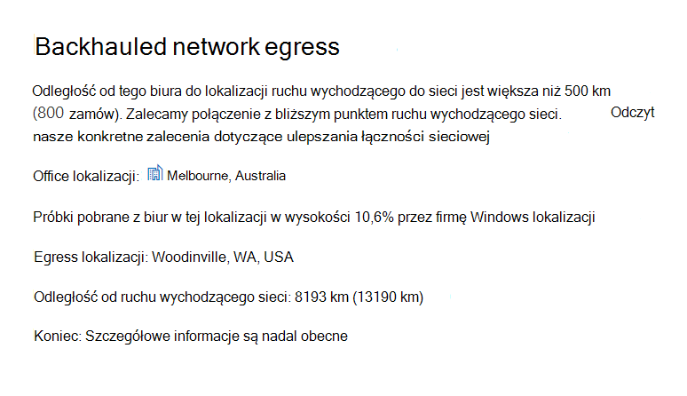

# Microsoft 365 Network Szczegółowe informacje

**Szczegółowe informacje o sieci** to metryki wydajności zbierane z Twojej Microsoft 365 dzierżawy i dostępne tylko dla użytkowników administracyjnych w Twojej dzierżawie. Szczegółowe informacje są wyświetlane w Centrum Administracja Microsoft 365 stronie <https://portal.microsoft.com/adminportal/home#/networkperformance>.

Szczegółowe informacje pomóc w projektowaniu obwodów sieci dla lokalizacji biurowych. Każda informacja zawiera szczegółowe informacje na żywo dotyczące charakterystyk wydajności konkretnego wspólnego problemu dla każdej lokalizacji geograficznej, w której użytkownicy mają dostęp do Twojej dzierżawy.

Istnieje sześć szczegółowych informacji o sieci, które mogą być wyświetlane dla każdej lokalizacji biura:

- [Backhauled network egress](#backhauled-network-egress)
- [Urządzenie pośrednie sieci](#network-intermediary-device)
- [Wykryto lepszą wydajność dla klientów w pobliżu](#better-performance-detected-for-customers-near-you)
- [Korzystanie z nieocenimowej Exchange Online frontowej serwisowej](#use-of-a-non-optimal-exchange-online-service-front-door)
- [Korzystanie z nieocenimowej SharePoint serwisowej online z przodu](#use-of-a-non-optimal-sharepoint-online-service-front-door)
- [Niska szybkość pobierania z SharePoint front door](#low-download-speed-from-sharepoint-front-door)
- [Optymalny ruch wychodzący do sieci dla użytkowników w Chinach](#china-user-optimal-network-egress)

Istnieją dwa szczegółowe informacje o sieci na poziomie dzierżawy, które mogą być widoczne dla dzierżawy:

- [Exchange przykładowych połączeń, na które wpływają problemy z łącznością](#exchange-sampled-connections-affected-by-connectivity-issues)
- [SharePoint próbnych połączeń, na które wpływają problemy z łącznością](#sharepoint-sampled-connections-affected-by-connectivity-issues)

Te szczegółowe informacje są również wyświetlane na stronach wyników produktywności.

>[!IMPORTANT]
>Szczegółowe informacje o sieci, zalecenia dotyczące wydajności i oceny w centrum Administracja Microsoft 365 są obecnie w stanie podglądu i są dostępne tylko dla dzierżaw usługi Microsoft 365, które zostały zarejestrowane w programie podglądu funkcji.

## Backhauled network egress

Ta informacja zostanie wyświetlona, jeśli usługa szczegółowych informacji o sieci wykryje, że odległość od danej lokalizacji użytkownika do ruchu wychodzącego do sieci jest większa niż 500 km (800 kilometrów). Może to oznaczać Microsoft 365, że ruch sieciowy jest zawrócony do wspólnego urządzenia przeglądarki internetowej lub serwera proxy.

W niektórych widokach podsumowania ta informacja jest Egress skrótem.

> [!div class="mx-imgBorder"]
> 

### Co to oznacza?

W ten sposób można zidentyfikować odległość między lokalizacją biura a sieciowym połączeń wychodzących na odległość większą niż 500 kilometrów (800 kilometrów). Lokalizacja biura jest identyfikowana przez lokalizację maszyny klienckiej w danych, a lokalizację ruchu wychodzącego sieciowego można zidentyfikować przy użyciu zwrotnego adresu IP w bazach danych lokalizacji. Lokalizacja biura może być niedokładna, jeśli Windows usługi lokalizacji są wyłączone na komputerach. Lokalizacja sieciowego ruchu wychodzącego może być niedokładna, jeśli informacje zawarte w bazie danych odwrotnego adresu IP są niedokładne.

Szczegółowe informacje:

- Office lokalizacji
- Szacowany procent całkowitego użytkownika dzierżawy w lokalizacji
- Bieżąca lokalizacja ruchu wychodzącego sieci
- Istotność lokalizacji wychodzącej
- Odległość między lokalizacją a bieżącym punktem punktu wyjścia
- Data wykrycia warunku
- Data rozwiązania warunku

### Co mam zrobić?

Zalecamy ruch wychodzący do sieci tak blisko lokalizacji biura, jak to tylko możliwe.  Microsoft 365 ruchu powinien być optymalnie przekierowywowyny do globalnej sieci firmy Microsoft i do najbliższych Microsoft 365 frontów serwisowych. Zamknięcie sieciowego punktu ruchu wychodzącego do lokalizacji biurowych użytkowników pozwala również na zwiększenie wydajności, ponieważ firma Microsoft rozszerza w przyszłości zarówno sieciowe punkty obecności, Microsoft 365 z przodu usługi.

Aby uzyskać więcej informacji na temat rozwiązywania tego problemu, zobacz Lokalne Egress [sieciowe](microsoft-365-network-connectivity-principles.md#egress-network-connections-locally) w zasadach Microsoft 365 [łączności sieciowej](microsoft-365-network-connectivity-principles.md).

## Urządzenie pośrednie sieci

Ta informacja zostanie wyświetlona, jeśli wykryliśmy urządzenia między Twoimi użytkownikami a siecią firmy Microsoft. Zalecamy, aby ruch sieciowy był Microsoft 365 takich urządzeń, gdy są pomijane. To zalecenie jest dodatkowo opisane w [Microsoft 365 dotyczących łączności sieciowej](microsoft-365-network-connectivity-principles.md).

Jednym z szczegółowych informacji dla pośredniej sieci jest podział SSL i inspekcja w przypadku przechwycenia i odszyfrowania przez krytyczne punkty końcowe sieci usługi Microsoft 365 dla usług Exchange, SharePoint i Teams przechwycone i odszyfrowane przez urządzenia pośrednie sieci.

### Co to oznacza?

Urządzenia pośrednie sieci, takie jak serwery proxy, sieci VPN i urządzenia do ochrony przed utratą danych, mogą wpływać na wydajność i stabilność klientów Microsoft 365, u których ruch jest pośredni.

### Co mam zrobić?

Skonfiguruj urządzenie pośredniczące sieci, które zostało wykryte, aby pominąć przetwarzanie dla Microsoft 365 ruchu sieciowego.

## Wykryto lepszą wydajność dla klientów w pobliżu

Ta informacja zostanie wyświetlona, jeśli usługa szczegółowych informacji o sieci wykryje, że znaczna liczba klientów w Twoim regionie metro ma lepszą wydajność niż użytkownicy w tej lokalizacji biura.

W niektórych widokach podsumowania ta informacja jest skrótowana jako "Równorzędni".

> [!div class="mx-imgBorder"]
> 

### Co to oznacza?

Ta analiza pozwala zbadać zagregowaną wydajność Microsoft 365 klientów w tym samym mieście, w którym znajduje się ta lokalizacja biura. Ta informacja jest wyświetlana, jeśli średnie opóźnienie Twoich użytkowników jest o 10% większe niż średnie opóźnienie sąsiadujących dzierżaw.

### Co mam zrobić?

Ten warunek może mieć wiele przyczyn, w tym opóźnienie w sieci firmowej lub u swojego isp, wąskich gardeł lub problemów związanych z architekturą. Zbadaj opóźnienie między każdym przeskokem na trasę między siecią biura a bieżącym Microsoft 365 frontem. Aby uzyskać więcej informacji, [Microsoft 365 zasady łączności sieciowej](microsoft-365-network-connectivity-principles.md).

## Korzystanie z nieocenimowej Exchange Online frontowej serwisowej

Ta informacja zostanie wyświetlona, jeśli usługa szczegółowych informacji o sieci wykryje, że użytkownicy w określonej lokalizacji nie nawiążą połączenia z optymalną Exchange Online frontem usługi.

W niektórych widokach podsumowania ta informacja jest skrótowana jako "Routing".

> [!div class="mx-imgBorder"]
> 

### Co to oznacza?

Po liście Exchange Online front drzwi usługi, które są odpowiednie do użycia z miasta w lokalizacji biura. Jeśli w bieżącym teście pokazano użycie Exchange Online serwisowej, których nie ma na tej liście, wówczas cytujemy to zalecenie.

### Co mam zrobić?

Korzystanie z nieocenej Exchange Online frontowej serwisowej może być spowodowane przez backhaul sieci, w takim przypadku zalecamy lokalny i bezpośredni ruch wychodzący do sieci. Jeśli wdrożono zdalny serwer rekurencyjny funkcji rozpoznawania nazw DNS, zalecamy wyrównanie konfiguracji serwera do ruchu wychodzącego sieci.

## Korzystanie z nieocenimowej SharePoint serwisowej online z przodu

Te informacje zostaną wyświetlone, jeśli usługa szczegółowych informacji o sieci wykryje, że użytkownicy w określonej lokalizacji nie nawiążą połączeń z najbliższymi przód usługi SharePoint Online.

W niektórych widokach podsumowania te informacje są skrótowane jako "Afd".

> [!div class="mx-imgBorder"]
> 

### Co to oznacza?

Identyfikujemy SharePoint serwisowej online, do których łączy się klient testowy. Następnie dla miasta w lokalizacji biura porównujemy to z oczekiwanym i SharePoint serwisowym Online front door for that city. Jeśli nie są zgodne, zalecamy to zalecenie.

### Co mam zrobić?

Korzystanie z nieujemnej SharePoint frontowej usługi online może być spowodowane przez zawrót sieci przed firmowym wyjściem z sieci, w którym to przypadku zalecamy lokalny i bezpośredni ruch wychodzący do sieci. Może to być również spowodowane użyciem zdalnego serwera rekurentywnego funkcji rozpoznawania nazw DNS, w którym to przypadku zalecamy wyrównanie serwera rekurentywnego rozpoznawania nazw DNS do ruchu wychodzącego sieci.

## Niska szybkość pobierania z SharePoint front door

Ta informacja zostanie wyświetlona, jeśli usługa szczegółowych informacji o sieci wykryje, że przepustowość między konkretną lokalizacją biura a usługą SharePoint Online jest mniejsza niż 1 mb/s.

W niektórych widokach podsumowania te informacje są skracane jako "Przepływność".

### Co to oznacza?

Szybkość pobierania, która może zostać pobrana przez użytkownika z aplikacji SharePoint online i OneDrive dla Firm, jest mierzona w megabajtach na sekundę (MBps). Jeśli ta wartość jest mniejsza niż 1 mb/s, to zapewniamy ci taką analizę.

### Co mam zrobić?

Aby zwiększyć szybkość pobierania, może być konieczne zwiększenie przepustowości łącza. Może też wystąpić przeciążenie sieci między komputerami w lokalizacji biura a frontem usługi SharePoint Online. Ten warunek ogranicza szybkość pobierania dostępną dla użytkowników, nawet jeśli dostępna jest wystarczająca przepustowość.

## Optymalny ruch wychodzący do sieci dla użytkowników w Chinach

Ta informacja będzie wyświetlana, jeśli w Twojej organizacji użytkownicy w Chinach łączyli się z Twoją dzierżawą usługi Microsoft 365 w innych lokalizacjach geograficznych.

### Co to oznacza?

Jeśli Twoja organizacja ma prywatną łączność WAN, zalecamy skonfigurowanie sieciowego obwodu sieci WAN z lokalizacji biurowych w Chinach, który ma ruch wychodzący do Internetu w dowolnej z następujących lokalizacji:

- Hongkong SAR
- Japonia
- Tajwan
- Korea Południowa
- Singapur
- Malezja

Ruch wychodzący do Internetu dalej od użytkowników niż te lokalizacje może zmniejszyć wydajność, a ruch wychodzący w Chinach może powodować problemy z dużymi opóźnieniami i łącznością ze względu na przeciążenie na połączeniach granicznych.

### Co mam zrobić?

Aby uzyskać więcej informacji na temat sposobu ograniczania problemów z wydajnością związanych z tą informacją, zobacz Microsoft 365 optymalizacji wydajności dzierżawy globalnej dla [użytkowników w Chinach](microsoft-365-networking-china.md).

## Exchange przykładowych połączeń, na które wpływają problemy z łącznością

Ta informacja zostanie pokazana w przypadku wpływu co najmniej 50% próbnych połączeń. Wpływ ten jest definiowany przez Exchange oceny poniżej 60% dla każdej próbki.

### Co to oznacza?

Oznacza to, że większość użytkowników ma prawdopodobnie problemy z nawiązywanie połączenia z Outlook siecią Exchange Online. Procentowa próbka oznacza procent użytkowników, którzy mają poniżej 60 punktów.  

### Co mam zrobić?

Jeśli jeszcze tego nie zrobiono, możesz włączyć widoczność sieci w lokalizacji biura. Zidentyfikuj, na które biura wpływa słaba łączność sieciowa, i znajdź sposoby ulepszania obwodu sieci w każdym z tych oddziałów, które łączą użytkowników z siecią firmy Microsoft.

## SharePoint próbnych połączeń, na które wpływają problemy z łącznością

Ta informacja zostanie pokazana w przypadku wpływu co najmniej 50% próbnych połączeń. Wpływ ten określa ocena SharePoint poniżej 40% dla każdej próbki.

### Co to oznacza?

Oznacza to, że większość użytkowników ma prawdopodobnie problemy z SharePoint i OneDrive. Procentowa próbka oznacza procent użytkowników, którzy mają poniżej 40 punktów.  

### Co mam zrobić?

Jeśli jeszcze tego nie zrobiono, możesz włączyć widoczność sieci w lokalizacji biura. Zidentyfikuj, na które biura wpływa słaba łączność sieciowa, i znajdź sposoby ulepszania obwodu sieci w każdym z tych oddziałów, które łączą użytkowników z siecią firmy Microsoft.

## Tematy pokrewne

[Łączność sieciowa w Administracja Microsoft 365 center](office-365-network-mac-perf-overview.md)

[Microsoft 365 oceny sieci](office-365-network-mac-perf-score.md)

[Microsoft 365 testu łączności sieciowej](office-365-network-mac-perf-onboarding-tool.md)

[Microsoft 365 lokalizacji łączności sieciowej](office-365-network-mac-location-services.md)
