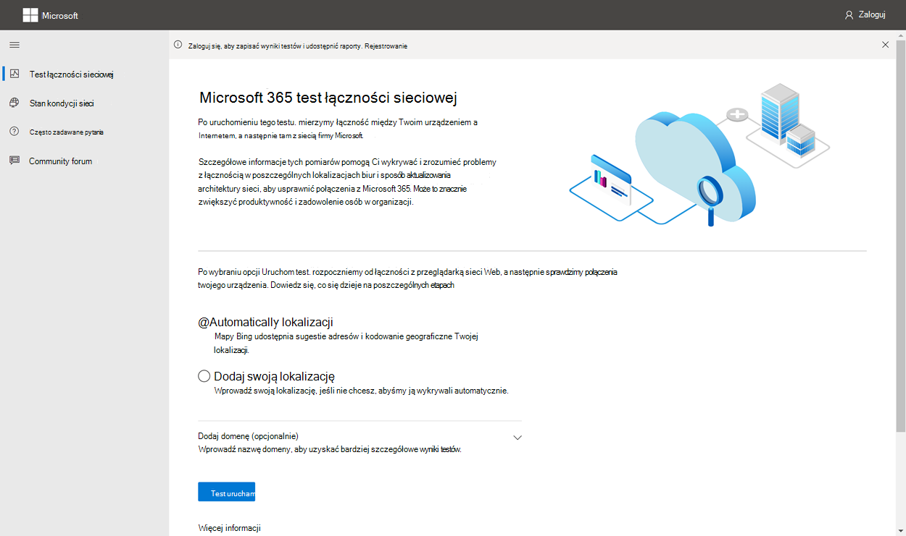

# Microsoft 365 testu łączności sieciowej

Narzędzie Microsoft 365 test łączności sieciowej znajduje się w .<https://connectivity.office.com> Jest to narzędzie adiunktowe do oceny sieci i szczegółowych informacji o sieci dostępnych w centrum administracyjne platformy Microsoft 365 w obszarze **kondycji | Menu** Łączność.

> [!IMPORTANT]
> Należy zalogować się do dzierżawy usługi Microsoft 365, ponieważ wszystkie raporty testowe są udostępniane administratorowi i przekazywane do dzierżawy podczas logowania.

> [!div class="mx-imgBorder"]
> 

>[!NOTE]
>Narzędzie do testowania łączności sieciowej obsługuje dzierżawy w sieci WW Commercial, ale nie jest GCC umiarkowane, GCC High, DoD lub China.

Szczegółowe informacje o sieci w centrum Administracja Microsoft 365 są oparte na regularnych pomiarach w produktach dla Twojej Microsoft 365 dzierżawy, zagregowanych każdego dnia. W porównaniu szczegółowe informacje o sieci z Microsoft 365 test łączności sieciowej są uruchamiane lokalnie w narzędziu.

Testowanie w produktach jest ograniczone, a uruchamianie testów lokalnych dla użytkownika zbiera więcej danych, co prowadzi do bardziej szczegółowych informacji. Szczegółowe informacje o sieci w centrum Administracja Microsoft 365 sieci wskazują, że występuje problem z siecią w konkretnej lokalizacji biura. Test Microsoft 365 połączenia sieciowego może pomóc w zidentyfikowaniu głównej przyczyny tego problemu i udostępnić kierowane działanie w zakresie poprawy wydajności.

Zalecamy, aby te wnioski były używane razem, gdzie można oceniać stan jakości sieci dla każdej lokalizacji biura w centrum Administracja Microsoft 365 Center, a więcej szczegółowych informacji można znaleźć po wdrożeniu testów na podstawie testu Microsoft 365 sieci.

## Co się dzieje na każdym etapie testowania

### Office lokalizacji

Po kliknięciu *przycisku Uruchom test* zostanie pokazana strona testowa uruchomiona i zidentyfikujemy lokalizację biura. Możesz wpisać swoją lokalizację według miasta, województwa i kraju lub zdecydować się na jej wykrycie. Po wykryciu lokalizacji biura narzędzie żąda szerokości i długości geograficznej w przeglądarce sieci Web i ogranicza dokładność do 300 metrów na 300 metrów przed użyciem. Nie trzeba dokładniej określić lokalizacji niż budynek w celu pomiaru wydajności sieci.

### Testy języka JavaScript

Po zidentyfikowaniu lokalizacji biura uruchamiamy test opóźnienia PROTOKOŁU TCP w języku JavaScript i żądamy od usługi danych dotyczących użytkowania i zalecanych Microsoft 365 frontonów serwisowych. Po zakończeniu tych testów są one wyświetlane na mapie i na karcie szczegóły, na której można je wyświetlać przed następnym krokiem.

### Pobieranie aplikacji klienckiej testów zaawansowanych

Następnie rozpoczynamy pobieranie aplikacji klienckiej testów zaawansowanych. Polegamy na tym, że użytkownik uruchamia aplikację klienutną i musi mieć zainstalowany środowisko .NET 6.0 Runtime.

Test łączności sieciowej z siecią Microsoft 365 jest dwa elementy: <https://connectivity.office.com> witryna internetowa i aplikacja Windows, która uruchamia zaawansowane testy łączności sieciowej. Większość testów wymaga uruchomienia aplikacji. W ten sposób wyniki zostaną ponownie wypełnione na stronie sieci Web.

Po zakończeniu testów przeglądarki sieci Web zostanie wyświetlony monit o pobranie zaawansowanej aplikacji testowej klienta z witryny sieci Web. Otwórz plik i uruchom go po wyświetleniu monitu.

> [!div class="mx-imgBorder"]
> 

### Uruchamianie aplikacji klienckiej testów zaawansowanych

Po uruchamianiu aplikacji klienckiej strona sieci Web zostanie zaktualizowana w celu pokazania tego wyniku. Dane testowe zaczną być odbierane na stronie sieci Web. Strona jest aktualizowana za każdym razem, gdy są odbierane nowe dane, i możesz przeglądać otrzymane dane.

### Ukończono testowanie zaawansowane i przekazywanie raportu testowego

Po zakończeniu testów będzie ona pokazywana zarówno na stronie sieci Web, jak i na kliencie testów zaawansowanych. Jeśli użytkownik jest zalogowany, raport testowy zostanie przekazany do dzierżawy klienta.

## Udostępnianie raportu testowego

Raport testowy wymaga uwierzytelnienia Microsoft 365 konta. Administrator wybiera sposób udostępniania raportu testowego.

### Udostępnianie raportu administratorowi

Jeśli zalogowano się w momencie wystąpienia raportu testowego, raport jest udostępniany administratorowi.

### Udostępnianie zespołowi konta Microsoft, pomocy technicznej lub innym pracownikom

Raporty testowe (z wyjątkiem identyfikacji osobistej) są udostępniane pracownikom firmy Microsoft. To udostępnianie jest domyślnie włączone i może zostać wyłączone przez administratora w |**Network Connectivity** page in the Administracja Microsoft 365 Center.

### Udostępnianie innym użytkownikom, którzy logują się do tej samej Microsoft 365 dzierżawy

Możesz wybrać użytkowników, dla których chcesz udostępnić raport. Możliwość wyboru jest domyślnie włączona, ale może ją wyłączyć administrator.

> [!div class="mx-imgBorder"]
> 

### Udostępnianie wszystkim osobom korzystającym z linku ReportID

Raport testowy można udostępnić innym osobom, zapewniając dostęp do linku ReportID. Ten link generuje adres URL, który można wysłać do innej osoby, aby ta osoba może uzyskać raport testowy bez konieczności logowania się. Udostępnianie jest domyślnie wyłączone i musi zostać włączone przez administratora.

> [!div class="mx-imgBorder"]
> 

## Wyniki testu łączności sieciowej

Wyniki są wyświetlane na kartach **Podsumowanie** **i** Szczegóły. Karta podsumowania zawiera mapę wykrytego obwodu sieci oraz porównanie oceny sieci z innymi pobliskimi Microsoft 365 w pobliżu. Umożliwia również udostępnianie raportu testowego. Widok wyników podsumowania wygląda następująco:

> [!div class="mx-imgBorder"]
> 

Oto przykładowe dane wyjściowe karty Szczegóły. Na karcie szczegóły wyświetlamy zielony okrąg, jeśli wynik był porównywany znacznie. Jeśli wynik przekracza próg wskazujący szczegółowe informacje o sieci, pokazujemy czerwony trójkąt wykrzyknik. W poniższych sekcjach opisano poszczególne wiersze wyników karty Szczegóły oraz wyjaśniono progi używane do analizy sieci.

> [!div class="mx-imgBorder"]
> 

### Informacje o lokalizacji użytkownika

W tej sekcji przedstawiono wyniki testów dotyczące Twojej lokalizacji.

#### Twoja lokalizacja

Lokalizacja użytkownika jest wykrywana w przeglądarce internetowej użytkowników. Można go także wpisać chętną przez użytkownika. Służy do identyfikowania odległości sieciowych do określonych części obwodu sieci przedsiębiorstwa. Tylko miasto z tego wykrywania lokalizacji i odległość od innych punktów sieciowych są zapisywane w raporcie.

Lokalizacja biura użytkownika jest wyświetlana w widoku mapy.

#### Lokalizacja ruchu wychodzącego sieciowego (lokalizacja, w której Twoja sieć łączy się z Twoim usługą sieciową)

Identyfikujemy adres IP ruchu wychodzącego sieci po stronie serwera. Bazy danych lokalizacji służą do wyszukiwania przybliżonej lokalizacji dla ruchu wychodzącego do sieci. Te bazy danych mają zazwyczaj dokładność do około 90% adresów IP. Jeśli lokalizacja wyszukiwania z adresu IP sieci wychodzącej nie jest dokładna, spowoduje to wynik fałsz. Aby sprawdzić, czy ten błąd występuje dla określonego adresu IP, możesz porównać witryny internetowe z publicznie dostępnymi adresami IP w celu porównania z rzeczywistą lokalizacją.

#### Odległość od lokalizacji ruchu wychodzącego sieciowego

Określamy odległość od tej lokalizacji do lokalizacji biura. Jest to wyświetlane jako szczegółowe informacje o sieci, jeśli odległość jest większa niż **500** mil (800 kilometrów), ponieważ może to zwiększyć opóźnienie protokołu TCP o więcej niż 25 ms i może mieć wpływ na środowisko użytkownika.

Mapa przedstawia lokalizację sieciowego ruchu wychodzącego względem lokalizacji biura użytkownika wskazującą wewnętrzną sieć WAN przedsiębiorstwa.

Implementowanie lokalnego i bezpośredniego ruchu wychodzącego z lokalizacji biur użytkowników do Internetu w celu zapewnienia optymalnej Microsoft 365 sieci. Najlepszym sposobem rozwiązania tych informacji o sieci są ulepszenia dotyczące lokalnego i bezpośredniego ruchu wychodzącego.

#### Informacje o serwerze proxy

Określamy, czy serwery proxy są skonfigurowane na komputerach lokalnych w celu przekazania Microsoft 365 sieciowego w kategorii **Optymalizowanie**. Identyfikujemy odległość od lokalizacji biura użytkownika do serwerów proxy.

Odległość jest najpierw sprawdzana przez polecenie ping ICMP. Jeśli to nie powiedzie się, testujemy przy użyciu protokołu TCP ping, a na koniec przeszukamy adres IP serwera proxy w bazie danych lokalizacji adresu IP. Pokazujemy szczegółowe informacje o sieci, jeśli serwer proxy znajduje się dalej niż **500** kilometrów (800 kilometrów) od lokalizacji biura użytkownika.

#### Wirtualna sieć prywatna (VPN), za pomocą których łączysz się ze swoją organizacją

Ten test wykrywa, czy używasz sieci VPN do łączenia się z siecią Microsoft 365. Wynik przekazywania będzie pokazywany, jeśli nie masz połączenia VPN lub jeśli masz sieć VPN z zalecaną konfiguracją podziałów na Microsoft 365.

#### Tryb dzielony VPN Tunnel

Każda **trasa kategorii** Optymalizuj dla Exchange Online, SharePoint Online i aplikacji Microsoft Teams jest sprawdzana w celu sprawdzić, czy jest ona szyfrowana w sieci VPN. Podzielone obciążenie pracą całkowicie zapobiega sieci VPN. Chmurowe obciążenie pracą jest wysyłane przez sieć VPN. Selektywnie rozdzielane obciążenie pracą ma pewne trasy przesyłane przez sieć VPN, a inne są rozdzielone. Jeśli wszystkie obciążenia są rozdzielone lub selektywne, będzie pokazywany wynik przekazywania.

#### Klienci z Twojego obszaru wielkomiejskiego o lepszej wydajności

Opóźnienie sieci między lokalizacją biura użytkownika a usługą Exchange Online jest porównywane z Microsoft 365 klientów korzystających z tego samego obszaru metra. Jeśli co najmniej 10% klientów w tym samym regionie metra ma lepszą wydajność, zostanie pokazane szczegółowe informacje o sieci. Oznacza to, że ich użytkownicy będą mieli lepszą wydajność w Microsoft 365 interfejsie użytkownika.

Ten wgląd w sieć jest generowany na podstawie tego, że wszyscy użytkownicy w mieście mają dostęp do tej samej infrastruktury telekomunikacyjnej i tej samej odległości od obwodów internetowych i sieci firmy Microsoft.

#### Czas na zgłoszenie żądania DNS w twojej sieci

To pokazuje serwer DNS skonfigurowany na komputerze klienckim, na którym uruchomiono testy. Może to być serwer rekurentywnego rozpoznawania nazw DNS, jednak jest to nietypowy serwer. Najbardziej prawdopodobne jest, że jest to serwer usługi DNS przesyłania dalej, który buforuje wyniki DNS i przesyła dalej wszystkie niezaszukane żądania DNS do innego serwera DNS.

Te informacje są udostępniane tylko w celu informacyjnych informacji i nie są udostępniane żadnym informacjom o sieci.

#### Odległość od serwera i/lub czas na połączenie się z rekurencyjną odpowiedzią DNS

Adres IP, z którym otrzymano to samo żądanie, jest identyfikowany przez wykonanie określonego żądania DNS, a następnie poproszenie serwera nazw DNS o adres IP, z którym zostało otrzymane to samo żądanie. Ten adres IP jest rekurencyjną odpowiedzią DNS i będzie szukać jej w bazach danych lokalizacji adresów IP w celu znalezienia tej lokalizacji. Następnie jest obliczana odległość od lokalizacji biura użytkownika do lokalizacji serwera rekurentywnego rozpoznawania nazw DNS. Jest to wyświetlane jako szczegółowe informacje o sieci, jeśli odległość jest większa niż **500 kilometrów** (800 kilometrów).

Lokalizacja poszukiwana z adresu IP ruchu wychodzącego sieci może nie być dokładna, co prowadzi do fałszywego wyniku tego testu. Aby sprawdzić, czy ten błąd występuje dla określonego adresu IP, możesz użyć witryn sieciowych z publicznie dostępnymi lokalizacjami adresów IP.

Ta analiza sieci w szczególności ma wpływ na wybór Exchange Online front front door usługi. Rozwiązanie problemu tego lokalnego i bezpośredniego ruchu wychodzącego do sieci powinno być wymaganiem wstępnym, a następnie powinno być zlokalizowane w pobliżu tego serwera ruchu wychodzącego sieciowego.

### Exchange Online

W tej sekcji przedstawiono wyniki testów dotyczące Exchange Online.

#### Exchange front door service

Nazwa Exchange jest identyfikowana w taki sam sposób Outlook jak jest to możliwe i mierzę opóźnienie protokołu TCP sieci z lokalizacji użytkownika do tej bramy. Wyświetlane jest opóźnienie protokołu TCP i używany Exchange front door usługi jest porównywany z listą najlepszych drzwi frontu usługi dla bieżącej lokalizacji. Jest to szczegółowe informacje o sieci, jeśli jeden z najlepszych Exchange serwisowych nie jest w użyciu.

Nieużycie jednej z najlepszych drzwi Exchange serwisowej może być spowodowane przez ruch sieciowy przed firmowym wyjściem z sieci, w którym to przypadku zalecamy lokalny i bezpośredni ruch wychodzący do sieci. Może to być również spowodowane użyciem zdalnego serwera rekurenkcyjnego funkcji rozpoznawania nazw DNS, w którym to przypadku zalecamy wyrównanie serwera rekurentywnego rozpoznawania nazw DNS do ruchu wychodzącego sieci.

Obliczamy potencjalne ulepszenie opóźnień TCP (ms) w Exchange frontów usługi. Aby to zrobić, należy pochylić testowane opóźnienie sieciowe lokalizacji użytkownika i odjąć opóźnienie sieciowe od bieżącej lokalizacji do Exchange front front door usługi. Różnica oznacza potencjalną szansę ulepszenia.

#### Najlepsze Exchange serwisowe drzwi z przodu(y) do Twojej lokalizacji

W tym miejscu są Exchange lokalizacje frontów frontu usługi według miasta dla Twojej lokalizacji.

#### Service front door recorded in the client DNS

W tym przykładzie jest pokazana nazwa DNS i adres IP Exchange front door serwera frontów usługi, do których został przekierowyny Twój adres. Jest ona dostarczana tylko w celu informacji i nie jest skojarzona z siecią.

### SharePoint Online

W tej sekcji przedstawiono wyniki testów dotyczące usługi SharePoint Online i OneDrive.

#### Lokalizacja frontów serwisowych

Nazwa "SharePoint" jest identyfikowana w taki sam sposób jak klient usługi OneDrive i mierzy opóźnienie protokołu TCP sieci z lokalizacji biura użytkownika do tego klienta.

#### Szybkość pobierania

Mierzymy szybkość pobierania dla pliku o rozmiarze 15 Mb z SharePoint frontem usługi. Wynik jest wyświetlany w megabajtach na sekundę, aby wskazać, jaki rozmiar pliku w megabajtach można pobrać z programu SharePoint lub OneDrive **w jednej sekundy**. Liczba powinna być podobna do jednej dziesiątej minimalnej przepustowości obwodu w megabitach na sekundę. Jeśli na przykład masz połączenie internetowe o sieci 100 mb/s, możesz oczekiwać 10 megabajtów na sekundę (10 MB/s).

#### Sypną bufor

Podczas pobierania 15 Mb mierzymy opóźnienie protokołu TCP na SharePoint front front door usługi. Jest to opóźnienie w trakcie ładowania i jest porównywane z opóźnieniem, gdy nie jest ono ładowane. Wzrost opóźnienia podczas ładowania jest często przypisywany do ładowanych buforów urządzeń sieciowych dla klientów (lub zwiększa ich rozmiar). Szczegółowe informacje o sieci są widoczne dla każdego wywęchu 1000 lub więcej.

#### Service front door recorded in the client DNS

W tym przykładzie jest pokazana nazwa DNS i adres IP SharePoint front door service front door, do których został przekierowyny Twój adres. Jest ona dostarczana tylko w celu informacji i nie jest skojarzona z siecią.

### Microsoft Teams

Ta sekcja zawiera wyniki testów związanych z Microsoft Teams.

#### Łączność z multimediami (audio, wideo i udostępnianie aplikacji)

To testuje łączność UDP z Microsoft Teams frontową usługą serwisową. Jeśli ta karta jest blokowana, oznacza to, Microsoft Teams nadal używać protokołu TCP, ale dźwięk i wideo będą zakłócone. Dowiedz się więcej o tych pomiarach sieci UDP, które mają również zastosowanie Microsoft Teams na temat jakości multimediów i wydajności łączności sieciowej w Skype dla firm [Online](/skypeforbusiness/optimizing-your-network/media-quality-and-network-connectivity-performance).

#### Utrata pakietów

Przedstawia wartość utraty pakietów UDP mierzoną w 10-sekundowym testowym wywołaniu audio od klienta do Microsoft Teams front door. W przypadku przełęczy powinno to być niższe niż **1,00** %.

#### Opóźnienie

Wyświetla mierzone opóźnienie UDP, które powinno być mniejsze niż **100 m**.

#### Jitter

Wyświetla mierzoną zakłóceń UDP, która powinna być mniejsza niż **30 m**.

#### Łączność

Testujemy łączność HTTP z lokalizacji biura użytkownika do wszystkich wymaganych Microsoft 365 sieciowych. Są one publikowane w .[https://aka.ms/o365ip](./urls-and-ip-address-ranges.md) Zostanie pokazana analiza sieci dla wszystkich wymaganych punktów końcowych sieci, z którymi nie można nałączyć połączenia.

Łączność może zostać zablokowana przez serwer proxy, zaporę lub inne urządzenie zabezpieczające sieci w obwodzie sieci przedsiębiorstwa. Łączność z portem TCP 80 jest testowana przy użyciu żądania HTTP, a łączność z portem TCP 443 jest testowana przy użyciu żądania HTTPS. Jeśli nie ma odpowiedzi, to fQDN jest oznaczana jako błąd. Jeśli istnieje kod odpowiedzi HTTP 407, to jego adres FQDN jest oznaczony jako błąd. Jeśli istnieje kod odpowiedzi HTTP 403, sprawdzamy atrybut serwera odpowiedzi i jeśli wydaje się, że jest to serwer proxy, oznaczamy ten błąd jako błąd. Możesz symulować przeprowadzane przez nas testy za Windows narzędzia wiersza polecenia curl.exe.

Testujemy certyfikat SSL na każdym wymaganym Microsoft 365 sieciowym, który znajduje się w kategorii optymalizowania lub zezwalania, zgodnie z definicją w punkcie [https://aka.ms/o365ip](./urls-and-ip-address-ranges.md). Jeśli jakieś testy nie znajdą certyfikatu Microsoft SSL, to połączona sieć zaszyfrowana musi zostać przechwycona przez pośrednie urządzenie sieciowe. Szczegółowe informacje o sieci są pokazywane na wszystkich przecięciach zaszyfrowanych punktach końcowych sieci.

W przypadku, gdy zostanie znaleziony certyfikat SSL, który nie jest dostarczony przez firmę Microsoft, zostanie pokazana jego usługa FQDN dla testu oraz właściciel certyfikatu SSL w użyciu. Ten właściciel certyfikatu SSL może być dostawcą serwera proxy lub certyfikatem z podpisem własnym przedsiębiorstwa.

#### Ścieżka sieciowa

W tej sekcji przedstawiono wyniki śledzenia usługi ICMP do frontu Exchange Online service front door, przód usługi SharePoint Online oraz Microsoft Teams front door service. Jest ona dostarczana tylko w celu informacji i nie jest skojarzona z siecią. Dostępne są trzy trasy śledzenia. Przekieruj śledzenia do _outlook.office365.com,_ przekieruj śledzenia do klientów z SharePoint frontu lub do usługi _microsoft.sharepoint.com_, jeśli nie została microsoft.sharepoint.com, oraz przekieruj śledzenia do _world.tr.teams.microsoft.com._

## Raporty dotyczące łączności

Po zalogowaniu się możesz przeglądać wcześniejsze uruchomione raporty. Możesz je także udostępnić lub usunąć z listy.

> [!div class="mx-imgBorder"]
> 

## Stan kondycji sieci

Pokazuje to wszelkie istotne problemy w kondycji globalnej sieci firmy Microsoft, które mogą mieć Microsoft 365 klientów.

> [!div class="mx-imgBorder"]
> 

## Testowanie z wiersza polecenia

Zapewniamy plik wykonywalny wiersza polecenia, który może być używany przez narzędzia wdrażania zdalnego i wykonywania oraz uruchamiamy te same testy, które są dostępne w witrynie internetowej narzędzia do testowania łączności Microsoft 365 sieci.

Narzędzie do testowania wiersza polecenia można pobrać tutaj: 

Można go uruchomić, klikając dwukrotnie plik wykonywalny w Eksploratorze plików programu Windows lub uruchamiając go z wiersza polecenia albo planować przy użyciu harmonogramu zadań.

Podczas pierwszego uruchomienia pliku wykonywalnego zostanie wyświetlony monit o zaakceptowanie umowy licencyjnej użytkownika końcowego (EULA) przed wykonaniem testowania. Jeśli została już przeczytana i zaakceptowana eula, możesz utworzyć pusty plik o nazwie Microsoft-365-Network-Connectivity-Test-EULA-accepted.txt w bieżącym katalogu roboczy dla procesu wykonywalnego, gdy zostanie uruchomiona. Aby zaakceptować eula, możesz wpisać "y" i po wyświetleniu monitu nacisnąć klawisz Enter w oknie wiersza polecenia.

Plik wykonywalny przyjmuje parametr wiersza polecenia /h w celu pokazania linku do tej dokumentacji Pomocy.

### Wyniki
Wyniki są zapisywane w pliku JSON w folderze o nazwie TestResults, który jest tworzony w bieżącym katalogu pracy procesu, chyba że już istnieje. Format nazwy pliku dla danych wyjściowych to connectivity_test_result_YYYY-MM-DD-HH-MM-SS.json. Wyniki są w węzłach JSON, które są zgodne z wynikami wyświetlanymi na stronie internetowej witryny internetowej narzędzia do testowania Microsoft 365 sieciowej. Nowy plik wyników jest tworzony za każdym razem, gdy go uruchamiasz, a autonomiczny plik wykonywalny nie przesyła wyników do dzierżawy firmy Microsoft w celu wyświetlenia na stronach łączność sieciowa centrum administracyjnego.

### Uruchamianie z Windows plików
Możesz po prostu kliknąć dwukrotnie plik wykonywalny, aby rozpocząć testowanie i zostanie wyświetlone okno wiersza polecenia.

### Uruchamianie z wiersza polecenia
W CMD.EXE wiersza polecenia możesz wpisać ścieżkę i nazwę pliku wykonywalnego, aby go uruchomić. Nazwa pliku zostanie Microsoft.Connectivity.Test.exe

### Uruchamianie z Windows harmonogramu zadań
W Windows zadania można dodać zadanie w celu uruchomienia pliku wykonywalnego testu autonomicznego. Należy określić bieżący katalog roboczy zadania, aby był tam, gdzie został utworzony plik zaakceptowany przez użytkownika, ponieważ plik wykonywalny będzie blokowany do momentu zaakceptowania warunków eula. Nie można interakcyjne zaakceptować interfejsu EULA, jeśli proces zostanie uruchomiony w tle bez konsoli.

### Więcej szczegółowych informacji na temat autonomicznego pliku wykonywalnego
Narzędzie wiersza polecenia korzysta z Windows lokalizacji, aby znaleźć użytkownikom informacje o kraju/województwie miasta do określania niektórych odległości. Jeśli Windows lokalizacji w panelu sterowania, oceny lokalizacji użytkownika będą puste. W Windows Ustawienia musi być w pozycji "Usługi lokalezyjne" i musi być w pozycji "Pozwól aplikacjom stacjonarnym na uzyskiwanie dostępu do Twojej lokalizacji".

Narzędzie wiersza polecenia podejmie próbę zainstalowania .NET Framework, jeśli nie zostało jeszcze zainstalowane. Pobierze także główny plik wykonywalny testowania z narzędzia do testowania łączności Microsoft 365 i uruchomi go.

## Często zadawane pytania

Poniżej znajdują się odpowiedzi na niektóre z naszych często zadawanych pytań.

### Co jest wymagane do uruchomienia zaawansowanego klienta testowego?

Zaawansowany klient testowy wymaga środowiska uruchomieniowego .NET 6.0. Uruchomienie zaawansowanego klienta testowego bez tego zainstalowanego spowoduje skierowanie cię do strony instalatora [.NET 6.0](https://dotnet.microsoft.com/en-us/download/dotnet/6.0/runtime?utm_source=getdotnetcore). Pamiętaj, aby zainstalować oprogramowanie z kolumny Uruchamianie aplikacji Windows. Uprawnienia administratora na komputerze są wymagane do zainstalowania środowiska .NET 6.0 Runtime.

Zaawansowany klient testowy komunikuje się ze stroną sieci Web za pomocą narzędzia SignalR. W tym celu upewnij się, że łączność protokołu TCP 443 z **siecią connectivity.service.signalr.net** jest otwarta. Ten adres URL nie jest publikowany w tym<https://aka.ms/o365ip>, ponieważ taka łączność nie jest wymagana Microsoft 365 użytkownika aplikacji klienckiej.

### Co to Microsoft 365 front door usługi?

Drzwi Microsoft 365 serwisowych to punkt wejścia globalnej sieci firmy Microsoft, w którym klienci Office usług i klienci zakończyli połączenie sieciowe. W celu zapewnienia optymalnego połączenia sieciowego z siecią Microsoft 365 zalecamy, aby połączenie sieciowe zostało zakończone do najbliższej Microsoft 365 w mieście lub metra.

> [!NOTE]
> Microsoft 365 front door usługi serwisowej nie ma bezpośredniej relacji z produktem **usługi Azure Front Door Service** dostępnym na platformie Azure Marketplace.

### Jaka jest najlepsza Microsoft 365 front dooru z usługą serwisową?

Najlepszą Microsoft 365 serwisową(wcześniej znaną jako optymalna usługa drzwi frontowych) jest ten, który jest najbliżej twojego punktu ruchu wychodzącego sieciowego, na ogół w mieście lub regionie metra. Za pomocą Microsoft 365 wydajności sieci sieciowej określ lokalizację swoich Microsoft 365 oraz najlepsze drzwi frontowe serwisowe. Jeśli narzędzie określa, że Twoje drzwi przedniego są jednym z najlepszych, należy oczekiwać wysokiej łączności z globalną siecią firmy Microsoft.

### Co to jest lokalizacja internetowa ruch wychodzący?

Internetowa lokalizacja wyjściowa to lokalizacja, w której ruch sieciowy opuszcza sieć przedsiębiorstwa i łączy się z Internetem. Jest to również identyfikowane jako lokalizacja, w której masz urządzenie do tłumaczenia adresów sieciowych (NAT) i zwykle, w której łączysz się z usługodawcą internetowym (ISP). Jeśli zobaczysz duże odległości między Twoją lokalizacją a twoją lokalizacją internetowego ruchu wychodzącego, może to spowodować zidentyfikowanie znaczącego backhaulu sieci WAN.

## Tematy pokrewne

[Łączność sieciowa w Administracja Microsoft 365 center](office-365-network-mac-perf-overview.md)

[Microsoft 365 informacji o wydajności sieci](office-365-network-mac-perf-insights.md)

[Microsoft 365 oceny sieci](office-365-network-mac-perf-score.md)

[Microsoft 365 lokalizacji łączności sieciowej](office-365-network-mac-location-services.md)
