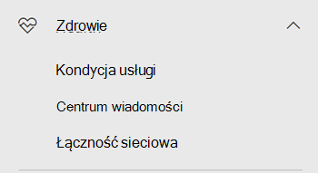
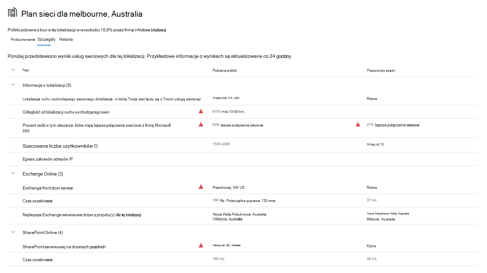

# Łączność sieciowa w Administracja Microsoft 365 center

Centrum Administracja Microsoft 365 zawiera teraz zagregowane metryki łączności sieciowej zbierane z Twojej dzierżawy usługi Microsoft 365 i dostępne tylko dla użytkowników administracyjnych w Twojej dzierżawie.

> [!div class="mx-imgBorder"]
> 

**Oceny sieci** i **szczegółowe informacje o sieci** są wyświetlane w Centrum Administracja Microsoft 365 w obszarze **Kondycja | Łączność sieciowa**.

> [!div class="mx-imgBorder"]
> 

>[!NOTE]
>Łączność sieciowa w Centrum administracyjnym obsługuje dzierżawy w WW Commercial i Germany, ale nie obsługuje GCC średniej, GCC High, DoD lub China.

Po pierwszym przechodzeniu do strony wydajności sieci musisz skonfigurować swoje lokalizacje, aby wyświetlić mapę globalnej wydajności sieci, ocenę sieci zawęgową dla całej dzierżawy, procent użytkowników pracujących zdalnie, a także listę bieżących problemów do podjęcia działań i/lub dalszego wyszukiwania informacji. W okienku przeglądu możesz przejść do szczegółów, aby wyświetlić konkretne metryki wydajności sieci i problemy według lokalizacji. Aby uzyskać więcej informacji, zobacz [Omówienie wydajności sieci w Centrum Administracja Microsoft 365 sieci](#network-connectivity-overview-in-the-microsoft-365-admin-center).

Możesz zostać poproszony o dołączenie do publicznej wersji zapoznawczej tej funkcji w imieniu swojej organizacji. Akceptacja zazwyczaj odbywa się natychmiast, po czym zostanie wyświetlony strona łączność sieciowa.

Aby uzyskać dostęp do strony łączności sieciowej, musisz być administratorem organizacji w organizacji w Microsoft 365. Rola administracyjna czytnika raportów będzie mieć dostęp do tych informacji. Aby skonfigurować lokalizacje i inne elementy łączności sieciowej, administrator musi mieć rolę administratora pomocy technicznej usługi.

## Wymagania wstępne oceny łączności sieciowej

Aby rozpocząć pracę, włącz ustawienie zgody na lokalizację w celu automatycznego zbierania danych z urządzeń korzystających z usług lokalizacji usługi Windows, przejdź do listy Lokalizacje, aby dodać lub przekazać dane lokalizacji, lub uruchom test łączności sieciowej usługi Microsoft 365 z lokalizacji biura. Podczas gdy łączność sieciowa może być oceniana w całej organizacji, konieczne będzie ulepszenie projektu sieci dla określonych lokalizacji biura. Informacje o łączności sieciowej są udostępniane dla każdej lokalizacji biura, gdy te lokalizacje można ustalić. Dostępne są trzy opcje przeprowadzania oceny sieci z lokalizacji biura:

### 1. Włączanie Windows lokalizacji

Dla tej opcji musisz mieć co najmniej dwa komputery uruchomione w każdej lokalizacji biura, które obsługują wymagania wstępne. OneDrive dla Windows muszą być aktualne i zainstalowane na każdym komputerze. Aby uzyskać więcej informacji OneDrive wersji, zobacz informacje o OneDrive [wersji](https://support.office.com/article/onedrive-release-notes-845dcf18-f921-435e-bf28-4e24b95e5fc0). Planuje się dodanie miar sieci do innych aplikacji Office 365 w niedalekiej przyszłości.

Windows lokalizacji musi być wyrażenie zgody na komputery. Możesz to sprawdzić, uruchamiając aplikację **Mapy** i lokalizując siebie. Można ją włączyć na jednym komputerze **z Ustawienia | Zasady zachowania | Lokalizacja**, w _której musi być włączone ustawienie Zezwalaj aplikacjom_ na uzyskiwanie dostępu do twojej lokalizacji. Windows lokalizacji można wdrożyć na komputerach przy użyciu usługi MDM lub usługi zasady grupy z ustawieniem _LetAppsAccessLocation_.

Ta metoda nie wymaga dodawania lokalizacji w Centrum administracyjnym, ponieważ są one automatycznie identyfikowane przy użyciu rozdzielczości miasta. Wiele lokalizacji biur w tym samym mieście nie będzie wyświetlanych w przypadku korzystania Windows lokalizacji. Informacje o lokalizacji są zaokrąglane do najbliższej odległości 300 m na 300 metrów, dzięki czemu nie można uzyskać dostępu do bardziej precyzyjnych informacji o lokalizacji.

Komputery powinny mieć sieć Wi-Fi sieciową, a nie kabel Ethernet. Komputery z kablem Ethernet nie mają dokładnych informacji o lokalizacji.

Próbki pomiarów i lokalizacje biur powinny pojawiać się po 24 godzinach od ich spełnionego wymagania wstępnego.

### 2. Dodawanie lokalizacji i podanie informacji o podsieci sieci LAN

W przypadku tej opcji nie są Windows ani usługi Wi-Fi nie są wymagane. Twoja OneDrive dla Windows musi być najnowsza i zainstalowana na co najmniej jednym komputerze w lokalizacji.

Upewnij się, że dodasz lokalizacje na stronie **lokalizacji lub** zaimportujesz je z pliku CSV. Dodane lokalizacje muszą zawierać informacje o podsieci sieci lokalnej pakietu Office. W oknie dialogowym dodawania lub edytowania lokalizacji możesz określić liczbę podsieci lan i liczbę publicznych podsieci IP punktów wychodzącej. Podsieci sieci LAN są wymagane i jedna z nich musi odpowiadać atrybutowi podsieci LAN w otrzymanej ocenie sieci, aby wyniki były wyświetlane. Super nets are not supported so the LAN subnet must match exactly.

Należy pamiętać, że zwykle podsieci sieci LAN są prywatnymi zakresami adresów IP zdefiniowanymi w dokumencie RFC1918, w związku z tym użycie publicznych adresów IP jako podsieci sieci LAN może być niepoprawne. W tym oknie dialogowym zostaną wyświetlone sugestie podsieci sieci LAN widziane w ostatnich testach oceny sieci dla organizacji, aby można było wybrać tę opcję.

W przypadku dodania publicznych adresów IP sieci wychodzącej są one używane jako pomocniczy rozróżnić i są przeznaczone do sytuacji, gdy masz wiele witryn korzystających z tych samych zakresów adresów IP podsieci LAN. Aby upewnić się, że wyniki testów są wyświetlane, należy rozpocząć od pozostawienia pustych zakresów publicznych adresów IP adresów IP dla adresów wychodzących. Jeśli zostaną uwzględnione, wyniki testu muszą być zgodne zarówno z jednym z zakresów adresów IP podsieci LAN, jak i z jednym z zakresów adresów IP sieci wychodzącej.

Ta opcja umożliwia zdefiniowanie wielu biur w obrębie miasta.

Wszystkie pomiary testowe z komputerów klienckich zawierają informacje o podsieci sieci LAN, które są skorelowane z wprowadzonymi szczegółami lokalizacji biura. Próbki pomiarów i lokalizacje biur powinny pojawiać się po 24 godzinach od ich spełnionego wymagania wstępnego.

### 3. Ręczne zbieranie raportów testowych za pomocą narzędzia Microsoft 365 testowego łączności sieciowej

W przypadku tej opcji musisz zidentyfikować osobę w każdej lokalizacji. Poproś ją o przejrzenie [testu Microsoft 365 sieciowego](https://connectivity.office.com) na komputerze Windows, na którym ma uprawnienia administracyjne. W witrynie internetowej muszą oni zalogować się do swojego konta Office 365 dla tej samej organizacji, dla której chcesz wyświetlić wyniki. Następnie należy kliknąć pozycję **Uruchom test**. Podczas testu został pobrany plik EXE test łączności. Muszą otworzyć i wykonać to polecenie. Po zakończeniu testów wynik testu jest przekazywany do Centrum administracyjnego.

Raporty testowe są połączone z lokalizacją, jeśli zostały dodane z informacjami podsieci LAN, w przeciwnym razie są wyświetlane tylko w lokalizacji miasta.

Próbki pomiarów i lokalizacje biur powinny pojawiać się po 2–3 minutach od ukończenia raportu testowego. Aby uzyskać więcej informacji, [zobacz Microsoft 365 test łączności sieciowej](office-365-network-mac-perf-onboarding-tool.md).

> [!NOTE]
> Obecnie podczas dodawania lokalizacji biura do usługi Microsoft 365 w sieci centrum administracyjne platformy Microsoft 365 możesz podać tylko adresy IPv4 dla podsieci sieci LAN. Egress IP muszą używać protokołu IPv4.

## Jak używać tych informacji?

**Szczegółowe informacje o sieci**, związane z nimi zalecenia dotyczące wydajności i oceny sieci są przeznaczone do pomocy w projektowaniu obwodów sieci dla lokalizacji biurowych. Każda informacja zawiera szczegółowe informacje na temat charakterystyk wydajności konkretnego wspólnego problemu z siecią dla każdej lokalizacji geograficznej, w której użytkownicy mają dostęp do dzierżawy. **Zalecenia dotyczące** wydajności dla każdej szczegółowej informacji o sieci oferują określone zmiany w architekturze sieci, które można wprowadzić, aby usprawnić środowisko użytkownika związane z Microsoft 365 siecią. W ramach oceny sieci można sprawdzić, jaki wpływ na środowisko użytkownika ma łączność sieciowa, umożliwiając porównanie różnych połączeń sieciowych lokalizacji użytkowników.

**Ocenianie** sieci jako zagregowanej z wielu metryk wydajności sieci jest migawką kondycji sieci przedsiębiorstwa reprezentowaną przez wartość punktową z lat 0–100. Oceny sieci są zakresowe zarówno dla całej dzierżawy, jak i każdej lokalizacji geograficznej, z której użytkownicy łączą się z dzierżawą, zapewniając administratorom programu Microsoft 365 łatwy sposób natychmiastowego zrozumienia kondycji sieci przedsiębiorstwa i szybkiego przechodzenia do szczegółów szczegółowego raportu dla dowolnej globalnej lokalizacji biura.

W złożonych przedsiębiorstwach z wieloma lokalizacjami biur i nieujemną architekturą obwodu sieci mogą korzystać z tych informacji podczas początkowego dołączania do Microsoft 365 lub rozwiązywania problemów z wydajnością sieci wykrytych ze względu na wzrost użycia. Zazwyczaj nie jest to konieczne w przypadku małych firm korzystających Microsoft 365 ani żadnych przedsiębiorstw, które już mają prostą i bezpośrednią łączność sieciową. Przedsiębiorstwa z ponad 500 użytkownikami i wieloma lokalizacjami biur powinny być najbardziej skorzystają.

>[!IMPORTANT]
>Szczegółowe informacje o sieci, zalecenia dotyczące wydajności i oceny w centrum Administracja Microsoft 365 są obecnie w stanie podglądu i są dostępne tylko dla dzierżaw usługi Microsoft 365, które zostały zarejestrowane w programie podglądu funkcji.

## Enterprise wyzwania związane z łącznością sieciową

> [!div class="mx-imgBorder"]
> 

Wiele przedsiębiorstw ma konfiguracje sieci obwodowej, które rosną z czasem i są zaprojektowane przede wszystkim w celu dostosowania dostępu do witryn internetowych pracowników, gdzie większość witryn sieci Web nie jest wcześniej znana i nie jest niezaufana. W przypadku takich nieznanych witryn internetowych nie należy się skupić na atakach złośliwego oprogramowania i wyłudzania informacji. Ta strategia konfiguracji sieci, choć pomocna ze względów bezpieczeństwa, może spowodować pogorszenie Microsoft 365 wydajności i wydajności użytkownika.

## Jak możemy rozwiązać te problemy

Przedsiębiorstwa mogą ulepszyć ogólne środowisko użytkownika i zabezpieczyć swoje  środowisko, stosując się Office 365 i zasad łączności sieciowej oraz korzystając z funkcji łączności sieciowej Administracja Microsoft 365 Center. W większości przypadków zasady ogólne mają istotne, dodatni wpływ na opóźnienia użytkowników końcowych, niezawodność usług i ogólną wydajność Microsoft 365.

Firma Microsoft jest czasami proszona o badanie problemów z wydajnością sieci Microsoft 365 w przypadku dużych klientów korporacyjnych, a te często mają główną przyczynę związaną z infrastrukturą obwodową sieci klienta. Gdy znaleziono zwykłą przyczynę problemu z obwodem sieci klienta, chcemy zidentyfikować proste wymiary testowe, które identyfikują ten błąd. Test z progiem miar określającym określony problem jest cenny, ponieważ możemy przetestować te same pomiary w dowolnej lokalizacji, stwierdzić, czy tam występuje ta główna przyczyna, i udostępnić go administratorowi jako szczegółowe informacje o sieci.

Niektóre szczegółowe informacje o sieci wskazują jedynie problem, który wymaga dalszego badania. Szczegółowe informacje o sieci, w przypadku których mamy wystarczającą ilość testów, aby wyświetlić konkretną akcję zaradczą w celu poprawienia głównej przyczyny, jest wymieniona jako **zalecana akcja**. Te zalecenia, oparte na metrykach na żywo, które pokazują wartości, które nie mogą przekraczać wstępnie ustalonego progu, są znacznie bardziej wartościowe niż ogólne porady dotyczące najlepszych rozwiązań, ponieważ są specyficzne dla Twojego środowiska i będą pokazywać rzeczywiste ulepszenie po wkroczeniu zalecanych zmian.

## Omówienie łączności sieciowej w Centrum Administracja Microsoft 365 sieci

Firma Microsoft dysponuje istniejącymi pomiarami sieci z Office klientów komputerowych i sieci Web, które obsługują Microsoft 365. Te miary są teraz używane w celu zapewnienia szczegółowych informacji o projekcie architektury sieci i oceny sieci, które są widoczne  na stronie Łączność sieciowa w Centrum Administracja Microsoft 365 sieci.

Domyślnie informacje przybliżone o lokalizacji skojarzone z pomiarami sieci identyfikują miasto, w którym znajdują się urządzenia klienckie. Ocena sieci w każdej lokalizacji jest wyświetlana za pomocą koloru, a względna liczba użytkowników w każdej lokalizacji jest reprezentowana przez rozmiar koła.

> [!div class="mx-imgBorder"]
> 

Na stronie przeglądu pokazano również ocenę sieci dla klienta jako średnią ważoną we wszystkich lokalizacjach biur.

> [!div class="mx-imgBorder"]
> 

Na karcie Lokalizacje można wyświetlić widok tabeli lokalizacji, w których można je filtrować, sortować **i edytować.** Lokalizacje z określonymi zaleceniami mogą również obejmować szacowane potencjalne opóźnienie(-a). Jest to obliczane przez umieszczenie mediany czasu oczekiwania użytkowników w organizacji i odjęcie opóźnienia mediany dla wszystkich organizacji w tym samym mieście.

> [!div class="mx-imgBorder"]
> 

## Ocena pracowników zdalnych i metryki połączeń użytkowników

Klasyfikujemy dzienniki ruchu sieciowego jako użytkowników zdalnych lub użytkowników w miejscu, a ich wartości procentowe są wyświetlane w sekcji Metryki połączenia użytkownika w okienku przeglądu. W przypadku miast, w których masz użytkowników zdalnych, po otwarciu strony tej lokalizacji znajdziesz wynik oceny sieci zdalnej dla określonej lokalizacji. Lista lokalizacji będzie zawierała zarówno lokalizacje biur, jak i miasta pracowników zdalnych, które można filtrować i sortować. Zapewniamy ocenę zdalną pracownika z podziałem punktów na Exchange, SharePoint i Teams.

Informacje dotyczące sieci użytkowników domowych są agregowane i raportowane na poziomie miasta i ograniczone do miast z co najmniej 5 pracownikami zdalnymi. Nie identyfikujemy poszczególnych pracowników pracujących w domu.

Lokalizacje są automatycznie klasyfikowane jako "lokacje" lub "zdalne", jednak możesz ręcznie wprowadzić wszystkie adresy IP punktów wychodzących w miejscu, aby zapewnić klasyfikację 100%. Jeśli zdecydujesz się przejść tą trasą, musisz ręcznie sprawdzić pole wyboru Wprowadź wszystkie adresy IP ruchu wychodzącego u klienta w wysuwanej pozycji Lokalizacje Ustawienia po dodaniu wszystkich adresów **IP** ruchu wychodzącego. Gdy to zrobisz, wszystkie dzienniki ruchu sieciowego z adresów IP ruchu wychodzącego oznaczone przez Ciebie jako "u nas" będą zawsze klasyfikowane jako biura, a co drugi adres IP ruchu wychodzącego będzie klasyfikowany jako zdalny.

## Podsumowanie wydajności sieci i szczegółowe informacje dotyczące konkretnej lokalizacji biura

Wybranie lokalizacji biura powoduje otwarcie strony podsumowania dla danej lokalizacji ze szczegółami ruchu wychodzącego do sieci zidentyfikowanymi na podstawie pomiarów dla danej lokalizacji biura.

> [!div class="mx-imgBorder"]
> 

Mapa sieci obwodowej dla użytkowników organizacji w lokalizacji jest wyświetlana z niektórymi lub wszystkimi tymi elementami:

- **Office lokalizacji** — lokalizacja biura strony, która jest obecnie
- **Obwod sieci** — lokalizacja źródłowego adresu IP dla połączeń z lokalizacji biura. Zależy to od dokładności baz danych lokalizacji geograficznych IP
- **Exchange drzwi z przodu** usługi — jedna z zalecanych Exchange serwisowych, z którym użytkownicy w tej lokalizacji biura powinni się połączyć
- **Exchange nieostrożnych** drzwi przednich — Exchange serwisowa, do których użytkownicy są połączeni, ale nie jest zalecana
- **SharePoint serwisowych drzwi** z przodu — jedna z zalecanych drzwi SharePoint serwisowych, z które użytkownicy w tej lokalizacji biura powinni łączyć się
- **SharePoint nieostrożna** usługa drzwi frontowych — SharePoint serwisowa, do których użytkownicy są połączeni, ale nie jest zalecana
- **Serwer rekurencyjny** funkcji rozpoznawania nazw DNS — lokalizacja z bazy danych geo ip wykrytego rekurentywnego rozwiązania DNS używanego dla Exchange Online (jeśli jest dostępna)
- **Twój serwer proxy —** lokalizacja z bazy danych geolokalizacji IP wykrytego serwera proxy (jeśli jest dostępna)

Strona podsumowania lokalizacji biura zawiera dodatkowo ocenę sieci lokalizacji, historię oceny sieci, porównanie oceny tej lokalizacji z innymi klientami w tym samym mieście oraz listę szczegółowych informacji i zaleceń, które można podjąć w celu zwiększenia wydajności i niezawodności sieci.

Porównanie klientów w tym samym mieście opiera się na oczekiwaniu, że wszyscy klienci mają jednakowy dostęp do dostawców usług sieciowych, infrastruktury telekomunikacyjnej i pobliskich punktów sieciowych firmy Microsoft.

Nazwy lokalizacji można dostosować podczas dodawania nowej lokalizacji lub edytowania istniejącej lokalizacji w wysuwanych lokalizacjach. Zapewnia to elastyczność dostosowywania nazw lokalizacji w dowolnym momencie. Ponadto podczas dodawania podsieci SIECI LAN bezpośrednio w wysuwanych lokalizacjach jest pokazywana lista rozwijana podsieci sieci LAN, które można wybrać z pozycji "miękkie dopasowanie". Można również dodawać i edytować nazwy obwodów dla określonych adresów IP wychodzącej biura.

Karta szczegóły na stronie lokalizacji biura zawiera szczegółowe wyniki pomiarów użyte do analizy, rekomendacji i oceny sieci. Dzięki temu inżynierowie sieci mogą zweryfikować zalecenia i czynniki we wszelkich ograniczeniach i danych szczegółowych w swoim środowisku. Można również znaleźć szacowaną liczbę użytkowników na próbki z tego miejsca w tym biurze oraz pracowników zdalnych w tym mieście.

> [!div class="mx-imgBorder"]
> 

## Udostępnianie danych oceny sieci firmie Microsoft

Domyślnie oceny sieci dla organizacji i informacje o sieci są udostępniane pracownikom firmy Microsoft. Nie obejmuje to żadnych danych osobowych Twoich pracowników, ale tylko konkretne metryki oceny sieci i szczegółowe informacje o sieci wyświetlane w centrum administracyjnym lokalizacji Twojego biura. Nie zawiera ona również nazw lokalizacji biura ani adresów ulicy, więc musisz im poinformować o mieście i identyfikatorze pomocy technicznej biura, które chcesz omówić. Jeśli ta możliwość jest wyłączona, inżynierowie firmy Microsoft, że omawiane są dyskusje na temat łączności sieciowej, nie mogą wyświetlać żadnych tych informacji. Włączenie tego ustawienia udostępnia dane w przyszłości tylko od dnia włączenia.

## Import plików CSV dla lokalizacji biur w podsieci LAN

W przypadku identyfikacji biura podsieci LAN należy dodać każdą lokalizację z wyprzedzeniem. Zamiast dodawania poszczególnych lokalizacji biur na **karcie Lokalizacje** możesz zaimportować je z pliku CSV. Możesz uzyskać te dane z innych miejsc, w których zostały zapisane, takich jak pulpit nawigacyjny jakości połączeń lub witryny i usługi Active Directory.

W pliku CSV odkryta lokalizacja miasta jest wyświetlana w kolumnie userEntered jako pusta, a ręcznie dodana lokalizacja biura ma wartość 1.

1. W głównym _oknie łączność Microsoft 365_ kliknij **kartę** Lokalizacje.

1. Kliknij **przycisk Importuj** tuż nad listą lokalizacji. Zostanie **wyświetlone wysuwne** wysuwu Import lokalizacji biura.

   > [!div class="mx-imgBorder"]
   > 

1. Kliknij link **Pobierz bieżące** lokalizacje biura (.csv), aby wyeksportować bieżącą listę lokalizacji do pliku CSV i zapisać go na lokalnym dysku twardym. Zapewni ci to poprawnie sformatowany plik CSV z nagłówkami kolumn, do których możesz dodać lokalizacje. Możesz pozostawić istniejące wyeksportowane lokalizacje bez opuszczania ich; nie zostaną one zduplikowane podczas importowania zaktualizowanego pliku CSV. Jeśli chcesz zmienić adres istniejącej lokalizacji, zostanie on zaktualizowany podczas importowania pliku CSV. Nie można zmienić adresu odkrytego miasta.

1. Otwórz plik CSV i dodaj swoje lokalizacje, wypełniając następujące pola w nowym wierszu dla każdej lokalizacji, którą chcesz dodać. Pozostaw wszystkie inne pola puste. wartości w polach innych zostaną zignorowane.

   1. **userEntered** (wymagane): musi mieć wartość 1 dla nowej lokalizacji biura podsieci LAN, która jest dodawana
   1. **Nazwa** (wymagane): nazwa lokalizacji biura
   1. **Adres** (wymagany): fizyczny adres biura
   1. **Szerokość** (opcjonalnie): wypełniona za Bing adresu mapy, jeśli jest pusta
   1. **Długość geograficzna** (opcjonalnie): wypełniona na Bing jest mapowana w odnośniku adresu, jeśli jest pusta
   1. Egress zakresów adresów **IP od 1 do 5** (opcjonalnie): dla każdego zakresu wprowadź nazwę obwodu, a po niej rozdzieloną spacją listę prawidłowych adresów CIDR protokołu IPv4. Te wartości służą do odróżniania wielu lokalizacji biur od tych samych adresów IP podsieci LAN. Egress zakresów adresów IP wszystkie muszą mieć rozmiar sieci /24, a wpis /24 nie jest uwzględniany w danych wejściowych.
   1. **LanIps** (wymagane): należy wyświetlić zakresy podsieci LAN w użyciu w tej lokalizacji biura. Identyfikatory podsieci LAN muszą mieć włączony rozmiar sieci CIDR, przy którym rozmiar sieci może być zerowy /8 i /29. Wiele zakresów podsieci LAN można rozdzielać przecinkami lub średnikami.

1. Po dodaniu lokalizacji biura i zapisaniu pliku kliknij przycisk Przeglądaj obok Upload ukończonego pola i wybierz zapisany  plik CSV.

1. Plik zostanie automatycznie sprawdzony. Jeśli wystąpią błędy sprawdzania poprawności, zostanie wyświetlony komunikat o błędzie: _Plik importu zawiera pewne błędy. Przejrzyj błędy, popraw plik importu, a następnie spróbuj ponownie._ Kliknij link **Otwórz szczegóły błędu** , aby wyświetlić listę określonych błędów sprawdzania poprawności pola.

   > [!div class="mx-imgBorder"]
   > 

1. Jeśli plik nie zawiera żadnych błędów, zostanie wyświetlony komunikat: _Raport jest gotowy. Znaleziono lokalizacje x do dodania oraz lokalizacje x do zaktualizowania._ Kliknij przycisk **Importuj** , aby przekazać plik CSV.

   > [!div class="mx-imgBorder"]
   > 

## Często zadawane pytania

### Co to jest Microsoft 365 front door usługi?

Drzwi Microsoft 365 serwisowych to punkt wejścia globalnej sieci firmy Microsoft, w którym klienci Office usług i klienci zakończyli połączenie sieciowe. W celu zapewnienia optymalnego połączenia sieciowego z Microsoft 365 zalecamy, aby połączenie sieciowe zostało zakończone do najbliższej Microsoft 365 frontowej.

>[!NOTE]
>Microsoft 365 front door usługi serwisowej nie ma bezpośredniej relacji z produktem usługi Azure Front Door Service dostępnym na platformie Azure Marketplace.

### Co to jest optymalna Microsoft 365 front frontu usługi?

Optymalna Microsoft 365 serwisowa to taki, który jest najbliżej punktu ruchu wychodzącego Twojej sieci, na ogół w mieście lub regionie metra. Użyj narzędzia [Microsoft 365 testowego (](office-365-network-mac-perf-onboarding-tool.md)wersja zapoznawcza), aby określić lokalizację swoich Microsoft 365 przednich i optymalnych drzwi przód serwisowych. Jeśli narzędzie określa, że drzwi przednie są optymalne, optymalnie łączysz się z globalną siecią firmy Microsoft.

### Co to jest lokalizacja internetowa ruch wychodzący?

Lokalizacja internetowego ruchu wychodzącego jest lokalizacją, w której ruch sieciowy opuszcza sieć przedsiębiorstwa i łączy się z Internetem. Jest to również identyfikowane jako lokalizacja, w której masz urządzenie do tłumaczenia adresów sieciowych (NAT) i zwykle, w której łączysz się z usługodawcą internetowym (ISP). Jeśli zobaczysz duże odległości między Twoją lokalizacją a twoją lokalizacją internetowego ruchu wychodzącego, może to wskazywać na istotny backhaul sieci WAN.

### Która licencja jest potrzebna dla tej funkcji?

Wymagasz licencji, która zapewnia dostęp do centrum administracyjne platformy Microsoft 365.

## Tematy pokrewne

[Microsoft 365 informacji o sieci](office-365-network-mac-perf-insights.md)

[Microsoft 365 oceny sieci](office-365-network-mac-perf-score.md)

[Microsoft 365 testu łączności](office-365-network-mac-perf-onboarding-tool.md)

[Microsoft 365 lokalizacji łączności sieciowej](office-365-network-mac-location-services.md)
