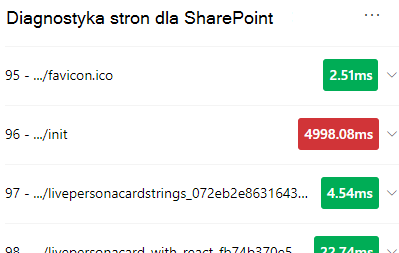
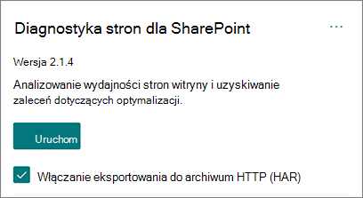
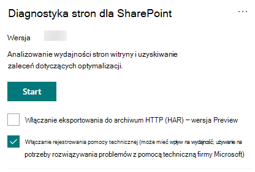

# Korzystanie z narzędzia Diagnostyka strony dla SharePoint

W tym artykule opisano sposób użycia **narzędzia Diagnostyka strony dla SharePoint** do analizowania nowoczesnych i klasycznych stron witryny SharePoint Online pod kątem wstępnie zdefiniowanego zestawu kryteriów wydajności.

Diagnostykę strony dla narzędzia SharePoint można zainstalować w następujących celach:

- **Microsoft Edge** [(rozszerzenie edge)](https://microsoftedge.microsoft.com/addons/detail/ocemkolpnamjcacndljdfmhlpcaoipji)
- **Chrome** [(rozszerzenie chrome)](https://chrome.google.com/webstore/detail/inahogkhlkbkjkkaleonemeijihmfagi)

>[!TIP]
>Wersja **2.0.0** i nowsze obejmują obsługę nowoczesnych stron oprócz klasycznych stron witryny. Jeśli nie masz pewności, której wersji narzędzia używasz, możesz wybrać link **Informacje** lub wielokropek (...), aby zweryfikować wersję. **Zawsze aktualizuj do najnowszej wersji** podczas korzystania z narzędzia.

Narzędzie Diagnostyka strony dla SharePoint jest rozszerzeniem przeglądarki dla nowych Microsoft Edge (https://www.microsoft.com/edge)i przeglądarek Chrome, które analizują zarówno nowoczesne strony SharePoint Online, jak i klasyczne strony witryn publikowania. To narzędzie działa tylko w przypadku usługi SharePoint Online i nie może być używane na stronie systemu SharePoint.

Narzędzie generuje raport dla każdej analizowanej strony pokazujący, jak strona działa względem wstępnie zdefiniowanego zestawu reguł i wyświetla szczegółowe informacje, gdy wyniki testu wykraczają poza wartość punktu odniesienia. SharePoint Administratorzy i projektanci usługi Online mogą używać narzędzia do rozwiązywania problemów z wydajnością i zapewnienia optymalizacji nowych stron przed opublikowaniem.

Narzędzie diagnostyki strony jest przeznaczone do analizowania tylko stron witryny SharePoint, a nie stron systemowych, takich jak *allitems.aspx* lub *sharepoint.aspx*. Jeśli spróbujesz uruchomić narzędzie na stronie systemowej lub innej stronie innej niż witryna, zostanie wyświetlony komunikat o błędzie informujący, że nie można uruchomić narzędzia dla tego typu strony.

> [!div class="mx-imgBorder"]
> 

To nie jest błąd w narzędziu, ponieważ nie ma żadnej wartości w ocenie bibliotek lub stron systemowych. Przejdź do strony witryny SharePoint, aby użyć tego narzędzia. Jeśli ten błąd wystąpi na stronie SharePoint, sprawdź stronę wzorcową, aby upewnić się, że metadane SharePoint nie zostały usunięte.

Aby przekazać opinię na temat narzędzia, wybierz wielokropek w prawym górnym rogu narzędzia, a następnie wybierz pozycję [Przekaż opinię](https://go.microsoft.com/fwlink/?linkid=874109).

> [!div class="mx-imgBorder"]
> 
  
## Instalowanie narzędzia diagnostyki strony dla SharePoint

Procedura instalacji w tej sekcji będzie działać zarówno dla przeglądarek Chrome, jak i Microsoft Edge.

> [!IMPORTANT]
> Firma Microsoft nie odczytuje danych ani zawartości strony, która jest analizowana przez narzędzie Diagnostyka strony dla SharePoint, i nie przechwytujemy żadnych danych osobowych, witryn internetowych ani nie pobieramy informacji. Jedynymi identyfikowalnymi informacjami zarejestrowanymi w firmie Microsoft przez narzędzie jest nazwa dzierżawy, liczba reguł, które uległy awarii, oraz data i godzina uruchomienia narzędzia. Te informacje są używane przez firmę Microsoft do lepszego zrozumienia nowoczesnych portali i publikowania trendów użycia witryn oraz typowych problemów z wydajnością.

1. Zainstaluj narzędzie Diagnostyka strony dla narzędzia SharePoint dla **Microsoft Edge** [(rozszerzenie edge)](https://microsoftedge.microsoft.com/addons/detail/ocemkolpnamjcacndljdfmhlpcaoipji) lub **Chrome** [(rozszerzenie Chrome)](https://chrome.google.com/webstore/detail/inahogkhlkbkjkkaleonemeijihmfagi). Zapoznaj się z zasadami ochrony prywatności użytkowników podanymi na stronie opisu w sklepie. Podczas dodawania narzędzia do przeglądarki zostanie wyświetlone następujące powiadomienie o uprawnieniach.

    > [!div class="mx-imgBorder"]
    > 

    Ta informacja jest w miejscu, ponieważ strona może zawierać zawartość z lokalizacji spoza SharePoint w zależności od składników Web Part i dostosowań na stronie. Oznacza to, że narzędzie odczyta żądania i odpowiedzi po kliknięciu przycisku Start i tylko dla aktywnej karty SharePoint, na której jest uruchomione narzędzie. Te informacje są przechwytywane lokalnie przez przeglądarkę internetową i są dostępne za pośrednictwem przycisku **Eksportuj do formatu JSON** lub **Eksportuj do HAR** na karcie _Śledzenie sieci_ narzędzia. **Informacje nie są wysyłane ani przechwytywane przez firmę Microsoft.** (Narzędzie respektuje zasady ochrony prywatności firmy Microsoft dostępne [tutaj](https://go.microsoft.com/fwlink/p/?linkid=857875)).

    _Uprawnienie Zarządzanie pobieraniem_ obejmuje korzystanie z funkcji **eksportowania narzędzia do formatu JSON**. Przed udostępnieniem pliku JSON poza organizacją postępuj zgodnie z wytycznymi firmy dotyczącymi ochrony prywatności, ponieważ wyniki zawierają adresy URL i mogą być klasyfikowane jako dane osobowe (dane osobowe).
1. Jeśli chcesz użyć narzędzia w trybie Incognito lub InPrivate, postępuj zgodnie z procedurą przeglądarki:
    1. W Microsoft Edge przejdź do pozycji **Rozszerzenia** lub wpisz _edge://extensions_ na pasku adresu URL i wybierz pozycję **Szczegóły** rozszerzenia. W ustawieniach rozszerzenia zaznacz pole wyboru **Zezwalaj w usłudze InPrivate**.
    1. W przeglądarce Chrome przejdź do pozycji **Rozszerzenia** lub wpisz _chrome://extensions_ na pasku adresu URL i wybierz pozycję **Szczegóły** rozszerzenia. W ustawieniach rozszerzenia wybierz suwak **zezwalania w usłudze Incognito**.
1. Przejdź do strony witryny SharePoint w SharePoint Online, którą chcesz przejrzeć. Zezwoliliśmy na "opóźnienie ładowania" elementów na stronach; W związku z tym narzędzie nie zostanie zatrzymane automatycznie (jest to zgodne z projektem w celu uwzględnienia wszystkich scenariuszy ładowania stron). Aby zatrzymać zbieranie, wybierz pozycję **Zatrzymaj**. Upewnij się, że ładowanie strony zostało ukończone przed zatrzymaniem zbierania danych lub że wykonasz tylko częściowy ślad.
1. Kliknij przycisk paska narzędzi rozszerzenia  Aby załadować narzędzie, zostanie wyświetlone następujące okno podręczne rozszerzenia:

    

Wybierz pozycję **Rozpocznij** , aby rozpocząć zbieranie danych do analizy.

## Co zobaczysz w narzędziu Diagnostyka strony dla SharePoint

1. Kliknij wielokropek (...) w prawym górnym rogu narzędzia, aby znaleźć następujące linki:
   1. Link **Dodatkowe zasoby** zawiera ogólne wskazówki i szczegółowe informacje dotyczące narzędzia, w tym link do tego artykułu.
   1. Link **Przekaż opinię** zawiera link do witryny _SharePoint Sites and Collaboration User Voice_.
   1. Link **Informacje** zawiera aktualnie zainstalowaną wersję narzędzia i bezpośredni link do powiadomienia innej firmy narzędzia.  
1. **Identyfikator korelacji, SPRequestDuration, SPIISLatency**, **czas ładowania strony** i szczegóły **adresu URL** są informacyjne i mogą być używane w kilku celach.

    > [!div class="mx-imgBorder"]
    > 

   - **CorrelationID** jest ważnym elementem podczas pracy z pomoc techniczna firmy Microsoft, ponieważ umożliwia zebranie większej ilości danych diagnostycznych dla określonej strony.
   - **SPRequestDuration** to czas potrzebny SharePoint na przetworzenie strony. Nawigacja strukturalna, duże obrazy, wiele wywołań interfejsu API mogą przyczynić się do dłuższego czasu trwania.
   - **SPIISLatency** to czas w milisekundach potrzebny na rozpoczęcie ładowania strony przez usługę SharePoint Online. Ta wartość nie obejmuje czasu potrzebnego aplikacji internetowej na udzielenie odpowiedzi.
   - **Czas ładowania strony** to całkowity czas rejestrowany przez stronę od czasu żądania do czasu odebrania i renderowania odpowiedzi w przeglądarce. Na tę wartość wpływają różne czynniki, w tym opóźnienie sieci, wydajność komputera i czas ładowania strony przez przeglądarkę.
   - **Adres URL strony** (Uniform Resource Locator) to adres internetowy bieżącej strony.

1. Karta [**Testy diagnostyczne**](#how-to-use-the-diagnostic-tests-tab) wyświetla wyniki analizy w trzech kategoriach. **Nie są wymagane żadne działania**, wymagane **są możliwości poprawy** i **uwaga**. Każdy wynik testu jest reprezentowany przez element w jednej z tych kategorii, zgodnie z opisem w poniższej tabeli:

    |Kategoria  |Kolor  |Opis  |
    |---------|---------|---------|
    |**Wymagana uwaga** |Czerwony |Wynik testu wykracza poza wartość punktu odniesienia i wpływa na wydajność strony. Postępuj zgodnie ze wskazówkami dotyczącymi korygowania.|
    |**Możliwości poprawy** |Żółty |Wynik testu wykracza poza wartość bazową i może przyczyniać się do problemów z wydajnością. Mogą być stosowane kryteria specyficzne dla testu.|
    |**Nie jest wymagana żadna akcja** |Zielony |Wynik testu mieści się w wartości bazowej testu.|

    > [!div class="mx-imgBorder"]
    > 

1. Karta [**Śledzenie sieci**](#how-to-use-the-network-trace-tab-and-how-to-export-a-har-file) zawiera szczegółowe informacje o żądaniach kompilacji stron i odpowiedziach.

## Jak używać karty Testy diagnostyczne

Podczas analizowania SharePoint nowoczesnej strony portalu lub klasycznej strony witryny publikowania za pomocą narzędzia Diagnostyka strony dla SharePoint wyniki są analizowane przy użyciu wstępnie zdefiniowanych reguł, które porównują wyniki z wartościami punktu odniesienia i są wyświetlane na karcie **Testy diagnostyczne**. Reguły dla niektórych testów mogą używać różnych wartości punktu odniesienia dla nowoczesnych portali i klasycznych witryn publikowania w zależności od tego, jak określona jest wydajność  cechy różnią się między tymi dwoma cechami.

Wyniki testów, które są wyświetlane w **kategoriach Możliwości poprawy** lub **Wymagana uwaga** , wskazują obszary, które należy przejrzeć pod kątem zalecanych rozwiązań, i można je wybrać, aby wyświetlić dodatkowe informacje o wyniku. Szczegóły poszczególnych elementów zawierają link _Dowiedz się więcej_ , który przeprowadzi Cię bezpośrednio do odpowiednich wskazówek związanych z testem. Wyniki testu wyświetlane w kategorii **Brak wymaganej akcji** wskazują zgodność z odpowiednią regułą i nie wyświetlają dodatkowych szczegółów po wybraniu.

Informacje na karcie Testy diagnostyczne nie informują o sposobie projektowania stron, ale wyróżniają czynniki, które mogą mieć wpływ na wydajność strony. Niektóre funkcje i dostosowania stron mają nieunikniony wpływ na wydajność strony i powinny zostać przejrzane pod kątem potencjalnego korygowania lub pominięcia na stronie, jeśli ich wpływ jest znaczny.

Czerwone lub żółte wyniki mogą również wskazywać składniki Web Part, które zbyt często odświeżają dane. Na przykład wiadomości firmowe nie są aktualizowane co sekundę, ale niestandardowe składniki Web Part są często tworzone w celu pobierania najnowszych wiadomości co sekundę zamiast implementowania elementów buforowania, które mogłyby poprawić ogólne środowisko użytkownika. Podczas dołączania składników Web Part na stronie należy pamiętać, że często istnieją proste sposoby zmniejszenia ich wpływu na wydajność przez ocenę wartości każdego dostępnego parametru, aby upewnić się, że jest on ustawiony odpowiednio do zamierzonego celu.

>[!NOTE]
>Klasyczne witryny zespołu, które nie mają włączonej funkcji publikowania, nie mogą korzystać z sieci CDN. Po uruchomieniu narzędzia w tych witrynach oczekuje się, że test CDN zakończy się niepowodzeniem i może zostać zignorowany, ale wszystkie pozostałe testy mają zastosowanie. Dodatkowe funkcje funkcji publikowania SharePoint mogą wydłużyć czas ładowania strony, dlatego nie należy jej włączać tylko po to, aby umożliwić CDN funkcjonalność.

>[!IMPORTANT]
>Reguły testów są regularnie dodawane i aktualizowane, dlatego zapoznaj się z najnowszą wersją narzędzia, aby uzyskać szczegółowe informacje o bieżących regułach i konkretnych informacjach zawartych w wynikach testów. Możesz zweryfikować wersję, zarządzając rozszerzeniami, a rozszerzenie poinformuje, czy aktualizacja jest dostępna.

## Jak używać karty Śledzenie sieci i jak wyeksportować plik HAR

Karta **Śledzenie sieci** zawiera szczegółowe informacje o obu żądaniach utworzenia strony i odpowiedziach otrzymanych od SharePoint.

1. **Wyszukaj czas ładowania elementów oflagowany jako czerwony**. Każde żądanie i odpowiedź są zakodowane kolorami, aby wskazać jego wpływ na ogólną wydajność strony przy użyciu następujących metryk opóźnienia:
    - Zielony: \< 500ms
    - Żółty: 500-1000ms
    - Czerwony: \> 1000 ms

    > [!div class="mx-imgBorder"]
    > 

    Na ilustracji przedstawionej powyżej czerwony element odnosi się do strony domyślnej. Zawsze będzie wyświetlana czerwona, chyba że strona zostanie załadowana w \< 1000ms (mniej niż 1 sekunda).

2. **Czas ładowania elementu testowego**. W niektórych przypadkach nie będzie czasu ani wskaźnika koloru, ponieważ elementy zostały już buforowane przez przeglądarkę. Aby przetestować to poprawnie, otwórz stronę, wyczyść pamięć podręczną przeglądarki, a następnie kliknij przycisk **Uruchom** , ponieważ spowoduje to wymusżenie "zimnego" obciążenia strony i będzie prawdziwym odzwierciedleniem początkowego ładowania strony. Następnie należy porównać to z "ciepłym" obciążeniem strony, ponieważ pomoże to również określić, które elementy są buforowane na stronie.

3. **Udostępnij odpowiednie szczegóły innym osobom, które mogą pomóc w badaniu problemów**. Aby udostępnić szczegóły lub informacje podane w narzędziu deweloperom lub osobie pomocy technicznej, zaleca się użycie opcji **Włącz eksportowanie do archiwum HTTP (HAR** ). 

   > [!div class="mx-imgBorder"]
   > 

Należy to włączyć przed kliknięciem przycisku Start, co spowoduje włączenie trybu debugowania w przeglądarce. Spowoduje to wygenerowanie pliku archiwum HTTP (HAR), do którego można uzyskać dostęp za pośrednictwem karty "Śledzenie sieci". Kliknij pozycję "Eksportuj do HAR" i pobierze plik na komputer, a następnie możesz go odpowiednio udostępnić. Plik można otworzyć w różnych narzędziach debugowania, takich jak F12 Developer Tools i Fiddler.

> [!div class="mx-imgBorder"]
> 

> [!IMPORTANT]
> Te wyniki zawierają adresy URL, które można sklasyfikować jako dane osobowe (dane osobowe). Przed rozpowszechnieniem tych informacji pamiętaj, aby postępować zgodnie z wytycznymi organizacji.

## Angażowanie się w pomoc techniczna firmy Microsoft

Dodaliśmy **funkcję na poziomie pomoc techniczna firmy Microsoft**, która powinna być używana tylko podczas pracy bezpośrednio w przypadku pomocy technicznej. Korzystanie z tej funkcji nie zapewni żadnych korzyści w przypadku użycia bez zaangażowania zespołu pomocy technicznej i może sprawić, że strona będzie działać znacznie wolniej. Nie ma żadnych dodatkowych informacji podczas korzystania z tej funkcji w narzędziu, ponieważ dodatkowe informacje są dodawane do rejestrowania w usłudze.

Żadna zmiana nie jest widoczna, z tą różnicą, że otrzymasz powiadomienie o jej włączeniu, a wydajność strony zostanie znacznie obniżona o 2–3 razy wolniejszą wydajność, gdy jest włączona. Będzie ona odpowiednia tylko dla określonej strony i tej aktywnej sesji. Z tego powodu należy go używać oszczędnie i tylko wtedy, gdy aktywnie angażuje się w pomoc techniczną.

### Aby włączyć funkcję na poziomie pomoc techniczna firmy Microsoft

1. Otwórz narzędzie Diagnostyka strony dla SharePoint.
2. Na klawiaturze naciśnij klawisz **ALT-Shift-L**. Spowoduje to **wyświetlenie pola wyboru Włącz rejestrowanie pomocy technicznej** .
3. Zaznacz pole wyboru, a następnie kliknij przycisk **Rozpocznij** , aby ponownie załadować stronę i wygenerować pełne rejestrowanie.

   > [!div class="mx-imgBorder"]
   > 
  
    Należy zanotować identyfikator CorrelationID (wyświetlany w górnej części narzędzia) i przekazać go przedstawicielowi pomocy technicznej, aby umożliwić mu zebranie dodatkowych informacji o sesji diagnostycznej.

## Tematy pokrewne

[Dostrajanie wydajności usługi SharePoint Online](tune-sharepoint-online-performance.md)

[Dostrajanie wydajności Office 365](tune-microsoft-365-performance.md)

[Wydajność w nowoczesnym środowisku SharePoint](/sharepoint/modern-experience-performance)

[Sieci dostarczania zawartości](content-delivery-networks.md)

[Używanie Office 365 Content Delivery Network (CDN) z usługą SharePoint Online](use-microsoft-365-cdn-with-spo.md)