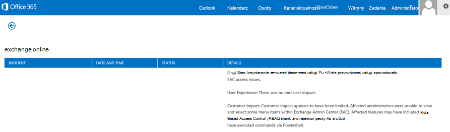
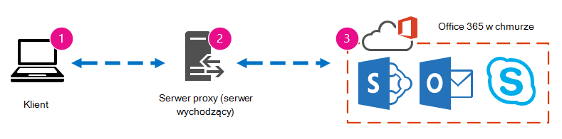
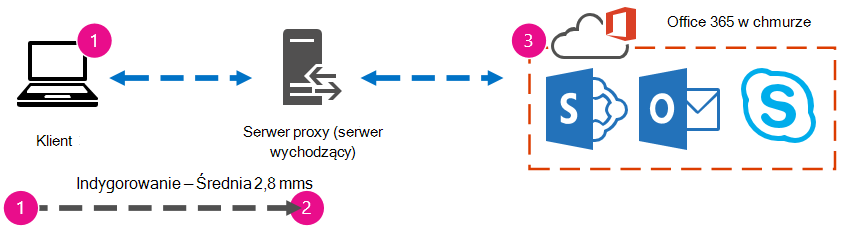

# Office 365 wydajności przy użyciu planu bazowego i historii wydajności

Istnieje kilka prostych sposobów sprawdzenia wydajności połączenia między Office 365 a Twoją firmą, które pozwolą ustalić wstępny plan bazowy Twojej łączności. Znajomość historii wydajności połączeń komputerów klienckich może pomóc we wczesnym wykrywaniu wyłaniających się problemów, w identyfikowaniu problemów i w ich przewidywaniu.
  
Jeśli nie masz jeszcze czasu pracować nad problemami z wydajnością, w tym artykule znajdziesz odpowiedzi na niektóre typowe pytania. Skąd wiadomo, że ten problem jest problemem z wydajnością, a nie zdarzeniem, Office 365 usługą? Jak można zaplanować dobrą wydajność przez dłuższy czas? Jak możesz śledzić wydajność? Jeśli Twój zespół lub Twoi klienci widzą wolne działanie podczas Office 365 i zastanawiasz się nad dowolnym z tych pytań, czytaj dalej.
  
> [!IMPORTANT]
> **Czy właśnie teraz masz problem z wydajnością między klientem a Office 365?** Postępuj zgodnie z instrukcjami w [planie rozwiązywania problemów z wydajnością Office 365](performance-troubleshooting-plan.md). 
    
## Co należy wiedzieć o Office 365 wydajności

Office 365 znajduje się wewnątrz dedykowanej, dedykowanej sieci firmy Microsoft, która jest monitorowana automatyzacją i osobami rzeczywistymi. Elementem konserwacji Office 365 jest dostosowywanie wydajności i usprawnianie, jeśli to możliwe. Klienci chmury Office 365 muszą łączyć się za pośrednictwem Internetu, dlatego nadal trwają prace nad dostosowaniem wydajności różnych Office 365 usług.

Ulepszenia wydajności nigdy nie przestają być zatrzymywane w chmurze, dlatego nie ma doświadczenia w zachowaniu dobrej kondycji i szybkiego działania chmury. W przypadku problemu z wydajnością podczas nawiązywania połączenia z lokalizacją Office 365 siecią, nie warto rozpoczynać od tej sprawy ani czekać na jej uruchomienie. Zamiast tego należy rozpocząć badanie problemu od wewnątrz. To oznacza, że możesz zacząć pracować wewnątrz swojej sieci i pracować z Office 365. Przed otwarciem sprawy przy użyciu pomocy technicznej możesz zebrać dane i podjąć działania, które zbadają i rozwiążą problem.
  
> [!IMPORTANT]
> Należy pamiętać o planowaniu i limitach pojemności w Office 365. Te informacje wywrzesz na ciebie krzywą przy próbie rozwiązania problemu z wydajnością. Oto link do opisów Microsoft 365 [i Office 365 usługi](/office365/servicedescriptions/office-365-service-descriptions-technet-library). Jest to centrum, a wszystkie usługi oferowane przez firmę Office 365 są w tym miejscu linkiem do ich opisów. Oznacza to, że jeśli na przykład chcesz wyświetlić standardowe limity dla usługi SharePoint Online, kliknij pozycję [opis usługi SharePoint Online](/office365/servicedescriptions/sharepoint-online-service-description/sharepoint-online-service-description) i odszukaj sekcję SharePoint limity [online](/office365/servicedescriptions/sharepoint-online-service-description/sharepoint-online-limits).
  
Pamiętaj, aby przejść do rozwiązywania problemów, uwzględniając zrozumienie, że wydajność jest skalą przesuwaną. Nie chodzi o uzyskanie idealnej wartości i trwałe jej utrzymywanie. Od czasu do czasu zadania o dużej przepustowości, takie jak wejechanie do pracy z dużą liczbą użytkowników lub wykonywanie dużych migracji danych,  będą stresujące, dlatego planowanie wpływu na wydajność wpływa na wydajność. Warto mieć wstępny pomysł na swoje cele wydajności, ale wydajność może się różnić w przypadku wielu zmiennych, w związku z tym wydajność może się różnić.
  
Rozwiązywanie problemów z wydajnością nie jest związane z spełnianiem konkretnych celów i utrzymywaniem tych liczb w nieskończoność, czyli ulepszaniem istniejących działań z zachowaniem wszystkich zmiennych. 
  
## Jaki jest problem z wydajnością?

Najpierw musisz się upewnić, że to, z czym masz do czynienia, naprawdę jest problemem z wydajnością, a nie zdarzeniem z usługą. Problem z wydajnością różni się od zdarzenia podczas zdarzenia Office 365. Poniżej opisano, jak je od siebie odróżnić.
  
Zdarzenia związane z usługą zdarzają się Office 365 problemów z samą usługą sieci. W obszarze Bieżąca kondycja w obszarze  bieżąca kondycja w centrum administracyjne platformy Microsoft 365. Możesz zauważyć wydajność na komputerach klienckich łączących się z Office 365 jest wolna. Jeśli na przykład w przypadku raportu Bieżąca kondycja obok przycisku  Exchange jest wyświetlana ikona Badanie, mogą być również odbierane połączenia od osób w organizacji, które skarżą się, że skrzynki pocztowe klientów korzystające z Exchange Online są wolne. W takim przypadku można przyjąć, że wydajność Exchange Online była ofiarą problemów z usługami.
  

  
Na tym etapie administrator usługi powinien sprawdzać Office 365 bieżącą kondycję, a  następnie często wyświetlać szczegóły i historię, aby być na bieżąco z konserwacją systemu. W **celu zaktualizowania** Informacji o zmianach i problemach w usłudze został wprowadzony pulpit nawigacyjny Bieżąca kondycja. Notatki i objaśnienia napisane w historii kondycji administratorów mają pomóc Ci w ich oceny i publikować informacje na temat trwających prac.
  

  
Problem z wydajnością nie jest zdarzeniem podczas usługi, chociaż zdarzenia mogą powodować wolne działanie. Problem z wydajnością wygląda następująco:
  
- Problem z wydajnością występuje niezależnie od tego, co **centrum administracyjne** raportuje bieżącą kondycję usługi.
    
-  Zachowanie używane do przepływu trwa długo lub nigdy nie kończy się.
    
- Możesz także zreplikować problem lub wiedzieć, że tak się stanie, jeśli pominiesz odpowiednią serię kroków.
    
-  Jeśli problem występuje sporadycznie, nadal może brakć wzorca. Na przykład do godziny 10:00 będziesz mieć połączenia od użytkowników, którzy nie zawsze mają dostęp do Office 365. Rozmowy będą się kończyć około południa.
    
Ta lista prawdopodobnie brzmi znajomo; a może zbyt znajomy. Gdy już wiesz, że chodzi o problem z wydajnością, pytanie brzmi "Co zrobić dalej?". Pozostała część tego artykułu ułatwia ustalenie tego dokładnie.
  
## Jak zdefiniować i przetestować problem z wydajnością

Problemy z wydajnością pojawiają się często w czasie, dlatego zdefiniowanie rzeczywistego problemu może być trudne. Utwórz dobre oświadczenie o problemie, gdy dobrym pomysłem będzie kontekst problemu, a następnie konieczne będzie powtarzalne kroki testowania. Oto kilka przykładów opisów problemów, które nie zapewniają wystarczającej ilości informacji:
  
- Przełączanie się z mojej skrzynki odbiorczej do kalendarza było czymś, czego nie było nie zauważyć, a teraz jest to przerwa na kawę. Czy możesz zrobić, żeby działało jak do tej?
    
- Przekazywanie moich plików do usługi SharePoint Online trwa wieki. Dlaczego po południu jest tak wolna, a w innych godzinach jest tak szybko? Czy nie może być tak szybko przez chwilę?
    
Wspomniano o kilku dużych problemach związanych z powyższymi oświadczeniami o problemach. W szczególności należy zająć się zbyt wieloma niejednoznacznościami. Przykład:
  
- Nie jest jasne, jak przełączanie się między Skrzynką odbiorczą i Kalendarzem działało na komputerze przenośnym.
    
- Gdy użytkownik mówi "Czy nie może być tak szybko", co jest "szybkie"?
    
- Jak długo trwa "wieki"? Czy to jest kilka sekund? A może wiele minut? A może użytkownik zjedzy lunch, a akcja zakończy się 10 minut po jego powrocie?
    
Administrator i narzędzie do rozwiązywania problemów nie wiedzą o szczegółach  problemu na przykład w takich ogólnych oświadczeniach. Nie wiedzą na przykład, kiedy zaczął się problem. Narzędzie do rozwiązywania problemów może nie wiedzieć, że użytkownik pracuje z domu i tylko kiedykolwiek widzi powolne przełączanie w swojej sieci domowej. Użytkownik może też uruchamiać na kliencie lokalnym inne aplikacje intensywnie obciążane pamięcią RAM. Administratorzy mogą nie wiedzieć, że użytkownik korzysta ze starszego systemu operacyjnego lub że nie ma ostatnich aktualizacji.
  
Gdy użytkownicy zgłaszają problem z wydajnością, należy zebrać jak najwięcej informacji. Uzyskiwanie i rejestrowanie informacji jest nazywane określaniem zakresu problemu. Poniżej znajduje się podstawowa lista zakresu, za pomocą których możesz zbierać informacje o problemach z wydajnością. Ta lista nie jest wyczerpująca, ale warto zacząć od tego:
  
- W jakim dniu problem dotyczył problemu i o jakiej porze dnia lub nocy?
    
- Jakiego rodzaju klient był przez Ciebie używać i jak łączy się on z siecią biznesową (VPN, przewodowo, bezprzewodowo)?
    
- Czy pracujesz zdalnie, czy jesteś w biurze?
    
- Czy próbowałeś/-asz tych samych akcji na innym komputerze i widzisz to samo zachowanie?
    
- Kroki, które dają trudności, można wykonać, aby zapisać podjęte działania.
    
- Jak wolno działa w sekundach lub minutach?
    
- W którym miejscu na świecie się znajdujesz?
    
Niektóre z tych pytań są bardziej oczywiste niż inne. Większość osób wie, że narzędzie do rozwiązywania problemów wymaga dokładnie tych czynności, aby odtworzyć problem. W końcu jak inaczej możesz zarejestrować problem i jak inaczej możesz sprawdzić, czy problem został rozwiązany? Mniej oczywiste są rzeczy, takie jak "Jakie daty i godzina zostały przez Ciebie podane?", czy "Gdzie na świecie się znajdujesz?" czy informacje, których można użyć razem. W zależności od tego, kiedy użytkownik pracował, kilka godzin różnicy czasu może oznaczać, że już trwa konserwacja części sieci firmowej. Na przykład Twoja firma ma implementację hybrydową, na przykład hybrydową usługę wyszukiwania usługi SharePoint, która może wyszukiwać indeksy zarówno w udatku SharePoint Online, jak i w lokalnym wystąpieniu programu SharePoint Server 2013, dlatego aktualizacje mogą być w trakcie wdrażania aktualizacji w farmie lokalnej. Jeśli Twoja firma jest w chmurze, konserwacja systemu może obejmować dodanie lub usunięcie sprzętu sieciowego, wprowadzenie aktualizacji w całej firmie lub wprowadzenie zmian w systemie DNS lub innej infrastrukturze podstawowej.
  
Podczas rozwiązywania problemów z wydajnością przypomina to miejsce zbrodni, dlatego musisz być dokładny i obserwowany, aby wyciągać wnioski z dowodów. W tym celu należy uzyskać dobry dowód problemu. Powinien on obejmować kontekst komputera, kontekst użytkownika, datę wystąpienia problemu i dokładne czynności, które ujawniono problem z wydajnością. To stwierdzenie o problemie powinno być i powinno pozostać stroną najwyższego poziomu w notatkach. Przechodząc przez kolejne kroki instrukcji dotyczącej problemu po zakończeniu pracy nad jego rozwiązywaniem, należy wykonać odpowiednie czynności w celu przetestowania i udowodnienia, czy podjęte działania zostały rozwiązane. Jest to niezbędne, aby wiedzieć, kiedy twoja praca jest wykonywana.
  
## Czy wiesz, jak wydajność kiedyś wyglądała, gdy była dobra?

Nikt Cię nie wie. Nikt nie miał cyfr. Oznacza to, że nikt nie może odpowiedzieć na proste pytanie "Ile sekund zajęło zebranie skrzynki odbiorczej w programie Office 365?" lub "Ile czasu zajęło spotkanie kierownictwa w usłudze Lync Online?", co jest częstym scenariuszem dla wielu firm.
  
Czego tu brakuje to plan bazowy wydajności?
  
Wartości bazowe zapewniają kontekst dla wydajności. Plan bazowy należy stosować od czasu do czasu do często, w zależności od potrzeb firmy. W przypadku większej firmy Twój zespół operacyjny może już różnić się od planu bazowego dla środowiska lokalnego. Jeśli na przykład poprawki są poprawiane na wszystkich serwerach Exchange w każdy pierwszy poniedziałek miesiąca, a na wszystkich serwerach SharePoint w każdy trzeci poniedziałek, Twój zespół operacyjny prawdopodobnie dysponuje listą zadań i scenariuszy uruchamianych po poprawce, aby udowodnić, że krytyczne funkcje są operacyjne. Na przykład otwarcie skrzynki odbiorczej, kliknięcie pozycji Wyślij/Odbierz i upewnienie się, że foldery są aktualizowane, lub w programie SharePoint przeglądanie strony głównej witryny, przechodząc do strony wyszukiwania w przedsiębiorstwie i wykonując wyszukiwanie, które zwraca wyniki.
  
Jeśli aplikacje znajdują się w programie Office 365, niektóre z najważniejszych podstawowych linii bazowych, jakie można podjąć, zmierzą czas (w milisekundach) od klienta w Twojej sieci do punktu wyjściowego lub punktu, w którym dane opuszczają Twoją sieć i wychodzą do Office 365. Poniżej podano kilka pomocnych linii bazowych, które można zbadać i zarejestrować:
  
- Zidentyfikuj urządzenia między komputerem klienckim a punktem wyjścia, na przykład serwer proxy.
    
  - Musisz znać swoje urządzenia, aby mieć kontekst (adresy IP, typy urządzeń itp.) pojawiające się problemy z wydajnością.
    
  - Serwery proxy są często punktami wychodzącymi, dlatego możesz sprawdzić w przeglądarce sieci Web, jaki serwer proxy został ustawiony do używania (jeśli jest ustawiony).
    
  - Istnieją narzędzia innych firm, które pozwalają wykrywać i mapować sieć, ale najbezpieczniejszym sposobem na to, aby poznać swoje urządzenia, jest sproszę do członka zespołu sieciowego.
    
- Zidentyfikuj usługodawca internetowe (ISP), zapisz ich informacje kontaktowe i zapytaj o to, ile obwodów masz przepustowość.
    
- Wewnątrz firmy zidentyfikuj zasoby urządzeń między klientem a punktem wychodzącym lub zidentyfikuj kontakt dla służb ratunkowych, z którym można porozmawiać o problemach z siecią.
    
Poniżej podano kilka linii bazowych, które proste testowanie za pomocą narzędzi może być dla Ciebie niezbędne:
  
- Czas od klienta do punktu wyjścia (w milisekundach)
    
- Czas od punktu punktu wyjścia do Office 365 (w milisekundach)
    
- Lokalizacja serwera, który rozpozna adresy URL stron Office 365 podczas przeglądania
    
- Szybkość rozpoznawania nazw DNS u swojego dostawcy usług internetowych (w milisekundach), niespójności w nadejściu pakietów (zakłócenia sieci), czasy przekazywania i pobierania (w milisekundach)
    
Jeśli nie wiesz, jak wykonać te czynności, przejdź do bardziej szczegółowych informacji w tym artykule. 
  
## Co to jest plan bazowy?

O tym, jaki wpływ może mieć wpływ, dowiesz się, gdy stanie się ono złe, ale jeśli nie znasz danych historycznych dotyczących wydajności, nie możesz mieć kontekstu, w którym mogą wystąpić negatywne skutki oraz kiedy to możliwe. Więc bez planu bazowego nie masz kluczowej wskazówki, aby rozwiązać puzzle: obraz na pudełku. Podczas rozwiązywania problemów z wydajnością potrzebny jest punkt  *porównania*. Proste planu bazowe wydajności nie są trudne do wykonania. Zespół operacyjny może mieć zadanie do wykonania w harmonogramie. Załóżmy na przykład, że Twoje połączenie wygląda następująco: 
  

  
Oznacza to, że po sprawdzeniu w zespole sieci okazało się, że połączenie z Internetem w firmie jest opuszczane za pośrednictwem serwera proxy i że ten serwer obsługuje wszystkie żądania wysyłane przez klienta do chmury. W takim przypadku należy narysować uproszczoną wersję połączenia, która zawiera listę wszystkich urządzeń, które mogą się do tego do nich zwrócić. Teraz wstaw narzędzia, których można użyć do przetestowania wydajności między klientem, punktem ruchu wychodzącego (punktem, w którym dane opuszczają Twoją sieć i wysyłasz do Internetu) a Office 365 chmurą.
  

  
Te opcje są wyświetlane jako **proste** i zaawansowane **ze** względu na ilość specjalizacji potrzebnej do znalezienia danych dotyczących wydajności. Śledzenie sieci będzie zająć dużo czasu w porównaniu z uruchomionymi narzędziami wiersza polecenia, takich jak PsPing i TraceTCP. Te dwa narzędzia wiersza polecenia zostały wybrane, ponieważ nie używają pakietów ICMP, które zostaną zablokowane przez program Office 365 oraz ponieważ zapewniają czas (w milisekundach), jaki zajmuje opuszczenie klienta lub serwera proxy (jeśli masz dostęp) i dotrą do Office 365. Każdy pojedynczy przeskok z jednego komputera do drugiego zakończy się wartością czasu i to świetnie się stanie w przypadku planu bazowego. Co równie istotne, te narzędzia wiersza polecenia umożliwiają dodanie numeru portu do polecenia, ponieważ jest Office 365 komunikuje się za pośrednictwem portu 443, który jest portem używanym przez protokoły Secure Sockets Layer i Transport Layer Security (SSL i TLS). Jednak narzędzia innych firm mogą być lepszym rozwiązaniem w Twojej sytuacji. Firma Microsoft nie obsługuje wszystkich tych narzędzi, więc jeśli z jakiegoś powodu nie możesz uzyskać narzędzia PsPing i TraceTCP, przejdź do śledzenia sieci za pomocą narzędzia takiego jak Netmon. 
  
Plan bazowy można utworzyć przed godzinami pracy, ponownie w czasie intensywnego użytkowania i ponownie po godzinach pracy. Oznacza to, że na końcu możesz mieć strukturę folderów, która wygląda nieco tak:
  

  
Należy również wybrać konwencję nazewnictwa plików. Oto kilka przykładów:
  
- Feb_09_2015_9amPST_PerfBaseline_Netmon_ClientToEgress_Normal
    
- Jan_10_2015_3pmCST_PerfBaseline_PsPing_ClientToO365_bypassProxy_SLOW
    
- Feb_08_2015_2pmEST_PerfBaseline_BADPerf
    
- Feb_08_2015_8-30amEST_PerfBaseline_GoodPerf
    
Można to zrobić na wiele różnych sposobów, **\<dateTime\>\<what's happening in the test\>** ale warto zacząć od formatowania. Jeśli spróbujemy rozwiązać problemy później, bardzo pomocne będzie ich rozwiązanie. Później dowiesz się, że 8 lutego nabyliśmy dwa wyniki śledzenia, z których jeden miał dobrą wydajność, a jeden złej, więc można je porównać. Jest to pomocne przy rozwiązywaniu problemów. 
  
Historyczne linie bazowe muszą być uporządkowane. W tym przykładzie dzięki prostym metodom zostały uzyskane trzy wyniki wiersza polecenia, a wyniki zostały zebrane w postaci zrzutów ekranu, ale zamiast nich mogą być pliki przechwycone w sieci. Użyj metody, która najbardziej Ci się najlepiej sprawdza. Przechowuj swoje historyczne linie bazowe i odwołuj się do nich w momencie, w którym zauważysz zmiany w zachowaniu usług online. 
  
## Dlaczego warto zbierać dane dotyczące wydajności podczas pilotażu?

Nie ma lepszego czasu na rozpoczęcie tworzenia planu bazowego niż podczas pilotażowego Office 365 usługi. Biuro może mieć tysiące, setki tysięcy lub pięć, ale nawet dla kilku użytkowników można przeprowadzać testy pomiarów wahań wydajności. W dużej firmie reprezentatywną próbkę kilkuset użytkowników pilotażowych programu Office 365 można prognozować na zewnątrz dla kilku tysięcy użytkowników, aby wiedzieć, gdzie mogą się pojawić problemy, zanim się pojawią.
  
W przypadku małej firmy, w której wszyscy użytkownicy przejść do usługi w tym samym czasie i nie ma programu pilotażowego, przechowuj dane o wydajności, aby pokazać je wszystkim osobom, które mogą musieć rozwiązywać problemy z po prostu wykonującą operacją. Na przykład kiedy nagle zauważysz, że średniego rozmiaru grafika, która kiedyś szybko się zdarzała, możesz w tym czasie jść po budynku.
  
## Jak zbierać linie bazowe

W przypadku wszystkich planów rozwiązywania problemów musisz zidentyfikować co najmniej następujące rzeczy:
  
- Komputer kliencki, z których korzystasz (typ komputera lub urządzenia, adres IP i działania, które spowodowały problem)
    
- Miejsce na świecie, w którym znajduje się klient (na przykład: czy użytkownik korzysta z sieci VPN w sieci, pracuje zdalnie, czy w firmowym intranecie)
    
- Punkt ruchu wychodzącego używany przez komputer kliencki w Twojej sieci (punkt, w którym ruch opuszcza Twoją firmę dla internetowego lub internetowego punktu usług internetowych)
    
 Informacje o układzie sieci możesz uzyskać od administratora sieci. Jeśli masz połączenie z małą siecią, przyjrzyj się urządzeniu, które łączysz się z Internetem, i skontaktuj się z nim, jeśli masz pytania dotyczące układu. Utwórz grafikę końcowego układu do własnego potrzeb. 
  
Ta sekcja jest podzielone na proste narzędzia i metody wiersza polecenia oraz bardziej zaawansowane opcje narzędzi. W pierwszej kolejności ominiemy proste metody. Jeśli jednak masz problemy z wydajnością już teraz, warto przejść do zaawansowanych metod i wypróbować przykładowy plan działań rozwiązywania problemów z wydajnością.
  
### Proste metody

Te proste metody mają za zadanie naukę wykonywania, zrozumienia i prawidłowego przechowywania prostych linii bazowych wydajności w czasie, dzięki czemu są Office 365 wydajności. Oto prosty diagram, który jest prosty, jak widać wcześniej:
  

  
> [!NOTE]
> Na tym zarchiwizacji znajduje się narzędzie TraceTCP, ponieważ jest to przydatne narzędzie do pokazywania (w milisekundach) czasu przetwarzania żądania oraz ile przeskoków w sieci, czyli połączeń z jednego komputera do następnego, które wymaga połączenia do miejsca docelowego. Narzędzie TraceTCP może także nadawać nazwy serwerów używanych podczas przeskoków, co może być przydatne dla Microsoft Office 365 do rozwiązywania problemów w pomocy technicznej. > traceTCP mogą być bardzo proste, na przykład: >  `tracetcp.exe outlook.office365.com:443`> Pamiętaj, aby uwzględnić w poleceniu numer portu! > [Śledzenie TraceTCP](https://simulatedsimian.github.io/tracetcp_download.html) jest dostępne do pobrania bezpłatnie, ale jest korzysta z aplikacji Wincap. Wincap to narzędzie, które jest również używane i instalowane przez narzędzie Netmon. Narzędzia Netmon używamy również w sekcji zaawansowanych metod. 
  
 Jeśli masz wiele biur, musisz również przechowywać zestaw danych od klienta w każdej z tych lokalizacji. Ten test mierzy opóźnienie, które w tym przypadku jest wartością liczbową opisującą czas między wysłaniem przez klienta żądania do Office 365 a Office 365 na to żądanie. Testowanie pochodzi wewnątrz Twojej domeny na kliencie i ma na celu mierzenie rundy z Twojej sieci, przez punkt ruchu wychodzącego, przez Internet do Office 365 i z powrotem. 
  
Istnieje kilka sposobów radzenia sobie z punktem wychodzącym, w tym przypadku z serwerem proxy. Można to zrobić za pomocą śledzenia od 1 do 2, a następnie od 2 do 3, a następnie dodać liczby (w milisekundach), aby uzyskać sumę końcową do krawędzi sieci. Możesz też skonfigurować połączenie tak, aby pomijało serwer proxy w Office 365 adresach. W większej sieci z zaporą, odwrotnym serwerem proxy lub ich połączeniem może być konieczne wyjątek na serwerze proxy, aby ruch mógł być przekierowywowyny na wiele adresów URL. Aby uzyskać listę punktów końcowych używanych przez usługę Office 365, zobacz Office 365 [adresy URL i zakresy adresów IP](https://support.office.com/article/8548a211-3fe7-47cb-abb1-355ea5aa88a2). Jeśli masz uwierzytelniający serwer proxy, zacznij od przetestowania wyjątków dla następujących produktów:
  
- Porty 80 i 443
    
- Protokoły TCP i HTTPs
    
- Połączenia wychodzące do dowolnego z tych adresów URL:
    
- \*microsoftonline.com
    
- \*microsoftonline-p.com
    
- \*sharepoint.com
    
- \*outlook.com
    
- \*lync.com
    
- osub.microsoft.com
    
Wszyscy użytkownicy muszą mieć dostęp do tych adresów bez zakłóceń ze strony proxy i bez uwierzytelniania serwera proxy. W mniejszej sieci należy dodać je do listy obejść serwera proxy w przeglądarce internetowej. 
  
Aby dodać je do listy obejść serwera proxy w programie Internet Explorer, przejdź do strony **Narzędzia** \>  \> Opcje internetowe **Ustawienia** sieci **LAN Połączenia** \> \> LAN **— zaawansowane**. Na karcie zaawansowanej znajdziesz także swój serwer proxy i port tego serwera. W celu uzyskania dostępu do przycisku Zaawansowane może być konieczne kliknięcie pola wyboru Użyj serwera proxy dla **sieci** **LAN**. Należy się upewnić, że zaznaczono pole **pomijania serwera proxy w przypadku adresów** lokalnych. Po kliknięciu **przycisku** Zaawansowane zostanie zobaczysz pole tekstowe, w którym możesz wprowadzić wyjątki. Adresy URL z symbolami wieloznacznymi wymienione powyżej rozdziel średnikami, na przykład:
  
\*microsoftonline.com; \*sharepoint.com
  
Po obejście serwera proxy powinno być możliwe użycie polecenia ping lub polecenia PsPing bezpośrednio z adresu URL serwera Office 365 URL. Następnym krokiem jest przetestowanie polecenia ping **w outlook.office365.com**. W przypadku używania programu PsPing lub innego narzędzia, które pozwoli podać numer portu polecenia (narzędzie **PsPing** względem programu portal.microsoftonline.com:443) w celu zobaczenia średniego czasu rundy (w milisekundach). 
  
Czas rundy (RTT) to wartość liczbowa oznaczaca, jak długo trwa wysłanie żądania HTTP do serwera, takiego jak program outlook.office365.com, w celu uzyskania odpowiedzi, która potwierdza, że serwer za pomocą tego żądania został zweryfikowany. Czasami ten skrót jest oznaczany RTT. Czas ten powinien być względnie krótki.
  
Aby wykonać ten test, należy użyć narzędzia [PSPing](/sysinternals/downloads/psping) lub innego narzędzia, które nie używa pakietów ICMP blokowanych przez program Office 365. 
  
 **Jak uzyskać całkowity czas rundy (w milisekundach) bezpośrednio z adresu URL Office 365 PsPing**
  
1. Uruchom wiersz polecenia z podwyższonym poziomem uprawnień, wykonując następujące czynności:
    
1. Kliknij przycisk **Start**.
    
2. W polu **Rozpocznij wyszukiwanie** wpisz cmd, a następnie naciśnij klawisze CTRL+SHIFT+ENTER.
    
3. Jeśli zostanie **wyświetlone okno dialogowe** Kontrola konta użytkownika, potwierdź, że wyświetlana akcja jest przez Ciebie wyświetlana, a następnie kliknij przycisk **Kontynuuj**.
    
2. Przejdź do folderu, w którym zainstalowano narzędzie (w tym przypadku PsPing), i przetestuj następujące Office 365 URL:
    
  - psping admin.microsoft.com:443
    
  - psping microsoft-my.sharepoint.com:443
    
  - psping outlook.office365.com:443
    
  - psping www.yammer.com:443
    
    
  
Pamiętaj, aby uwzględnić numer portu 443. Pamiętaj, Office 365 działa w zaszyfrowanym kanale. Jeśli rozpoczniesz psPing bez numeru portu, Twoje żądanie nie powiedzie się. Po pingowaniu krótkiej listy poszukaj średniego czasu (Average) w milisekundach (ms). To jest właśnie ten rekord, który należy nagrać!
  

  
Jeśli nie wiesz, co to jest obejście serwera proxy, i wolisz zrobić to krok po kroku, musisz najpierw dowiedzieć się, jaka jest nazwa serwera proxy. W programie Internet Explorer **przejdź do narzędzia** \> **Opcje internetowe Połączenia** \> **Ustawienia** \> **sieci LAN Zaawansowane**\>. Na **karcie** Zaawansowane jest wyświetlony serwer proxy. Zbadaj ten serwer proxy za pomocą polecenia ping w wierszu polecenia, wykonując to zadanie: 
  
 **Aby wysłać żądanie ping do serwera proxy i uzyskać wartość czasu rundy (w milisekundach) dla etapu od 1 do 2**
  
1. Uruchom wiersz polecenia z podwyższonym poziomem uprawnień, wykonując następujące czynności:
    
1. Kliknij przycisk **Start**.
    
2. W polu **Rozpocznij wyszukiwanie** wpisz cmd, a następnie naciśnij klawisze CTRL+SHIFT+ENTER.
    
3. Jeśli zostanie **wyświetlone okno dialogowe** Kontrola konta użytkownika, potwierdź, że wyświetlana akcja jest przez Ciebie wyświetlana, a następnie kliknij przycisk **Kontynuuj**.
    
2. Wpisz ping \<the name of the proxy server your browser uses, or the IP address of the proxy server\> i naciśnij klawisz ENTER. Jeśli masz zainstalowany program PsPing lub inne narzędzie, możesz go użyć zamiast narzędzia PsPing. 
    
    Polecenie może wyglądać podobnie do każdego z tych przykładów: 
    
  - polecenie ping ourproxy.ourdomain.industry.business.com
    
  - ping 155.55.121.55
    
  - ping naszeproxy
    
  - psping ourproxy.ourdomain.industry.business.com:80
    
  - psping 155.55.121.55:80
    
  - psping naszeproxy:80
    
3. Gdy śledzenie przestanie wysyłać pakiety testowe, zostanie dodane małe podsumowanie z listą wartości średniej (w milisekundach) i jest to wartość, po upływie których jesteś. Zrzut ekranu przedstawiający monit i zapisz go przy użyciu konwencji nazewnictwa. Na tym etapie może również ułatwić wypełnianie diagramu wartością.
    
Być może śledzenie zostały wykonane wcześnie rano i klient szybko nacisną połączenie z serwerem proxy (lub z innym serwerem wyjściowym z Internetu). W takim przypadku liczby mogą wyglądać tak:
  

  
Jeśli twój klient jest jednym z kilku użytkowników z dostępem do serwera proxy (lub serwera wychodzącego), możesz uruchomić następny etap testu, łącząc się zdalnie z tym komputerem i uruchamiając w tym programie wiersz polecenia z programem PsPing do adresu URL programu Office 365. Jeśli nie masz dostępu do tego komputera, możesz skontaktować się z zasobami sieciowym w celu uzyskania pomocy dotyczącej następnego noga i uzyskania dokładnie tych liczb. Jeśli nie jest to możliwe, wykonaj polecenie PsPing względem adresu URL programu Office 365 i porównaj go z czasem polecenia PsPing lub ping względem serwera proxy. 
  
Jeśli na przykład czas z klienta do adresu URL programu Office 365 wynosi 51,84 milisekundy, a czas z klienta do serwera proxy (lub punktu wyjścia) wynosi 2,8 milisekundy, to czas z punktu wychodzącego do serwera Office 365 wynosi 49,04 milisekundy. Podobnie, jeśli w ciągu godziny z klienta do serwera proxy jest psPing o wartości 12,25 milisekundy i 62,01 milisekundy od klienta do adresu URL serwera Office 365, to wartość średnia dla wychodzącego serwera proxy do adresu URL serwera Office 365 wynosi 49,76 milisekundy.
  

  
Podczas rozwiązywania problemów zachowanie tych linii bazowych może okazać się interesujące. Jeśli na przykład wiadomo, że ogólnie od serwera proxy lub punktu wyjściowego do adresu URL serwera Office 365 ma od około 40 milisekund do 59 milisekund opóźnienia (w zależności od ruchu sieciowego wyświetlanego w tym czasie), będziesz mieć pewność, że problem będzie problematyczny, jeśli ostatni trzech klientów będzie wyświetlał serwer proxy lub wyjściowe punkty bazowe. z opóźnieniem 45 milisekund.
  
### Metody zaawansowane

Jeśli naprawdę chcesz się dowiedzieć, co się dzieje z Twoimi żądaniami internetowymi do Office 365, musisz zapoznać się ze śledzeniem sieci. Nie ma znaczenia, które narzędzia preferujesz dla tych śledzenia, HTTPWatch, Netmon, Analizator komunikatów, Wireshark, Fiddler, Narzędzie pulpitu nawigacyjnego dewelopera lub jakichkolwiek innych, o ile narzędzie to może przechwytywać i filtrować ruch sieciowy. W tej sekcji zobaczysz, że korzystne może być uruchomienie więcej niż jednego z tych narzędzi w celu uzyskania pełniejszego obrazu problemu. Podczas testowania niektóre z tych narzędzi działają również jako serwerów proxy po własnego prawa. Narzędzia użyte w artykule towarzyszącym[, Plan](performance-troubleshooting-plan.md) rozwiązywania problemów z wydajnością Office 365 narzędzia to [Netmon 3.4](https://www.microsoft.com/download/details.aspx?id=4865), [HTTPWatch](https://www.httpwatch.com/download/) lub [WireShark](https://www.wireshark.org/).
  
Wykonanie planu bazowego wydajności jest prostą częścią tej metody, a wiele czynności jest takich samych jak podczas rozwiązywania problemów z wydajnością. Bardziej zaawansowane metody tworzenia planu bazowego wydajności wymagają wykonania śledzenia sieci i zapisania ich wyników. W większości przykładów w tym artykule używa się usługi SharePoint Online, ale należy opracować listę typowych akcji w różnych subskrybowanych Office 365 usługach do testowania i nagrywania. Oto przykład planu bazowego:
  
- Lista planu bazowego dla usługi SPO — ** Krok 1: ** Przejdź na stronę główną witryny internetowej usługi SPO i przeszukaj dane śledzenia sieci. Zapisz śledzenie. 
    
- Lista planu bazowego dla usługi SPO — Krok **2.** Wyszukaj termin (na przykład nazwę twojej firmy) za pomocą usługi Enterprise Wyszukaj i przeszukaj dane śledzenia sieci. Zapisz śledzenie. 
    
- Lista planu bazowego dla usługi SPO — **krok 3. Upload** duży plik do biblioteki dokumentów usługi SharePoint Online i przeszukaj dane śledzenia sieci. Zapisz śledzenie. 
    
- Lista planu bazowego dla usługi SPO — **Krok 4.** Przejdź na stronę główną witryny OneDrive sieci Web i przeszukaj dane śledzenia sieci. Zapisz śledzenie. 
    
Ta lista powinna zawierać najważniejsze typowe działania podejmowane przez użytkowników w stosunku do usługi SharePoint Online. Zwróć uwagę, że ostatni krok — śledzenie śledzenia przechodzących do usługi OneDrive dla Firm — tworzy porównanie między ładowaniem strony głównej usługi SharePoint Online (która jest często dostosowywana przez firmy) i strony głównej usługi OneDrive dla Firm (która jest rzadko dostosowana). Jest to podstawowy test w przypadku powolnego ładowania SharePoint Online. Rekord z tymi różnicami można dodać do testów.
  
Wiele czynności, które należy wykonać w przypadku wystąpienia problemu z wydajnością, jest takich samych jak przy sporządzaniu planu bazowego. Śledzenie sieci staje się bardzo ważne, dlatego w następnej  stronie zostanie zajmą się tym, jak należy je śledzić. 
  
Aby rozwiązać problem z wydajnością  *już teraz*, konieczne jest wykonanie śledzenia w czasie, w którym występuje problem z wydajnością. Potrzebne są odpowiednie narzędzia do zbierania dzienników, potrzebny jest plan działań, czyli lista działań rozwiązywania problemów do podjęcia w celu zebrania możliwie najlepszych informacji. Najpierw należy zarejestrować datę i datę testu, tak aby pliki można było zapisać w folderze, który odzwierciedla chronometraż. Następnie należy zawęzić zakres samych kroków problemu. Są to dokładne kroki, które należy wykonać w celu przeprowadzenia testów. Nie zapomnij o podstawowych zagadnieniach: jeśli problem dotyczy tylko usługi Outlook, zanotuj, że problem występuje tylko w jednej Office 365 usługi. Zawężenie zakresu tego problemu pomoże skoncentrować się na czymś, co można rozwiązać. 
  
## Zobacz też

[Zarządzanie Office 365 punktami końcowymi](https://support.office.com/article/99cab9d4-ef59-4207-9f2b-3728eb46bf9a)