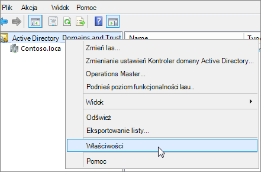

# <a name="prepare-a-non-routable-domain-for-directory-synchronization"></a>Jak przygotować domenę bez routingu do synchronizacji katalogów

Podczas synchronizowania katalogu lokalnego z Microsoft 365 musisz mieć zweryfikowaną domenę w usłudze Azure Active Directory (Azure AD). Synchronizowane są tylko główne nazwy użytkownika (UPN) skojarzone z domeną usług lokalna usługa Active Directory Domain Services (AD DS). Jednak każda nazwa UPN zawierająca domenę bez routingu, taką jak ".local" (na przykład billa@contoso.local), zostanie zsynchronizowana z domeną .onmicrosoft.com (na przykład: billa@contoso.onmicrosoft.com). 

Jeśli obecnie używasz domeny ".local" dla kont użytkowników w usługach AD DS, zaleca się ich zmianę w celu używania zweryfikowanej domeny, takiej jak billa@contoso.com, w celu prawidłowej synchronizacji z domeną Microsoft 365.
  
## <a name="what-if-i-only-have-a-local-on-premises-domain"></a>Co zrobić, jeśli mam tylko domenę lokalną ".local"?

Usługa Azure AD Połączenie służy do synchronizowania usług AD DS z dzierżawą usługi Azure AD dzierżawy Microsoft 365. Aby uzyskać więcej informacji, zobacz [Integrowanie tożsamości lokalnych z usługą Azure AD](/azure/architecture/reference-architectures/identity/azure-ad).
  
Usługa Azure AD Połączenie synchronizuje nazwę UPN i hasło użytkowników, dzięki czemu użytkownicy mogą logować się przy użyciu tych samych poświadczeń, których używają lokalnie. Jednak usługa Azure AD Połączenie synchronizuje tylko użytkowników z domenami zweryfikowanymi przez Microsoft 365. Oznacza to, że domena jest również weryfikowana przez usługę Azure AD, ponieważ tożsamości Microsoft 365 są zarządzane przez usługę Azure AD. Innymi słowy, domena musi być prawidłową domeną internetową (np. .com, .org, .net, .us). Jeśli wewnętrzne usługi AD DS używają tylko domeny bez routingu (na przykład ".local"), nie może to być zgodne ze zweryfikowaną domeną dla dzierżawy Microsoft 365. Ten problem można rozwiązać, zmieniając domenę podstawową w lokalnych usługach AD DS lub dodając co najmniej jeden sufiks nazwy UPN.
  
### <a name="change-your-primary-domain"></a>Zmienianie domeny podstawowej

Zmień domenę podstawową na domenę zweryfikowaną w Microsoft 365, na przykład contoso.com. Każdy użytkownik z domeną contoso.local jest następnie aktualizowany do contoso.com. Jest to jednak zaangażowany proces, a łatwiejsze rozwiązanie opisano w poniższej sekcji.
  
### <a name="add-upn-suffixes-and-update-your-users-to-them"></a>Dodawanie sufiksów nazw UPN i aktualizowanie użytkowników

Problem ".local" można rozwiązać, rejestrując nowy sufiks lub sufiks nazwy UPN w usługach AD DS w celu dopasowania domeny (lub domen) zweryfikowanej w Microsoft 365. Po zarejestrowaniu nowego sufiksu zaktualizuj nazwy UPN użytkownika w celu zastąpienia nazwy ".local" nową nazwą domeny, na przykład tak, aby konto użytkownika wyglądało jak billa@contoso.com.
  
Po zaktualizowaniu nazw UPN w celu używania zweryfikowanej domeny możesz zsynchronizować lokalne usługi AD DS z Microsoft 365.
  
#### <a name="step-1-add-the-new-upn-suffix"></a>Krok 1. Dodawanie nowego sufiksu nazwy UPN**
  
1. Na kontrolerze domeny usług AD DS w Menedżer serwera wybierz pozycję **Narzędzia** \> **Domeny i relacje zaufania usługi Active Directory**.
    
    **Lub, jeśli nie masz Windows Server 2012**
    
    Naciśnij **klawisz Windows + R**, aby otworzyć okno dialogowe **Uruchamianie**, a następnie wpisz plik Domain.msc, a następnie wybierz przycisk **OK**.
    
    
  
2. W oknie **Domeny i relacje zaufania usługi Active Directory** kliknij prawym przyciskiem myszy pozycję **Domeny i relacje zaufania usługi Active Directory**, a następnie wybierz pozycję **Właściwości**.
    
    
  
3. Na karcie **Sufiksy nazwy UPN** w polu **Alternatywne sufiksy nazwy UPN** wpisz sufiks lub sufiks nowej nazwy UPN, a następnie wybierz pozycję **Dodaj** \> **zastosuj**.
    
    
  
    Po zakończeniu dodawania sufiksów wybierz przycisk **OK** . 
    
 #### <a name="step-2-change-the-upn-suffix-for-existing-users"></a>Krok 2. Zmiana sufiksu nazwy UPN dla istniejących użytkowników
  
1. Na kontrolerze domeny usług AD DS w Menedżer serwera wybierz pozycję **Narzędzia** \> **Użytkownicy i komputery usługi Active Directory**.
    
    **Lub, jeśli nie masz Windows Server 2012**
    
    Naciśnij **klawisz Windows + R**, aby otworzyć okno dialogowe **Uruchamianie**, a następnie wpisz plik Dsa.msc, a następnie kliknij przycisk **OK**
    
2. Wybierz użytkownika, kliknij prawym przyciskiem myszy, a następnie wybierz pozycję **Właściwości**.
    
3. Na karcie **Konto** na liście rozwijanej Sufiks nazwy UPN wybierz nowy sufiks nazwy UPN, a następnie wybierz przycisk **OK**.
    
    
  
4. Wykonaj te kroki dla każdego użytkownika.
    
   
### <a name="use-powershell-to-change-the-upn-suffix-for-all-of-your-users"></a>Zmienianie sufiksu nazwy UPN dla wszystkich użytkowników przy użyciu programu PowerShell

Jeśli masz wiele kont użytkowników do zaktualizowania, łatwiej jest użyć programu PowerShell. W poniższym przykładzie użyto poleceń cmdlet [Get-ADUser](/previous-versions/windows/it-pro/windows-server-2008-R2-and-2008/ee617241(v=technet.10)) i [Set-ADUser](/previous-versions/windows/it-pro/windows-server-2008-R2-and-2008/ee617215(v=technet.10)) , aby zmienić wszystkie sufiksy contoso.local na contoso.com w usługach AD DS. 

Na przykład można uruchomić następujące polecenia programu PowerShell, aby zaktualizować wszystkie sufiksy contoso.local do contoso.com:
    
  ```powershell
  $LocalUsers = Get-ADUser -Filter "UserPrincipalName -like '*contoso.local'" -Properties userPrincipalName -ResultSetSize $null
  $LocalUsers | foreach {$newUpn = $_.UserPrincipalName.Replace("@contoso.local","@contoso.com"); $_ | Set-ADUser -UserPrincipalName $newUpn}
  ```

Zobacz [moduł Windows PowerShell usługi Active Directory](/previous-versions/windows/it-pro/windows-server-2008-R2-and-2008/ee617195(v=technet.10)), aby dowiedzieć się więcej na temat korzystania z Windows PowerShell w usługach AD DS.