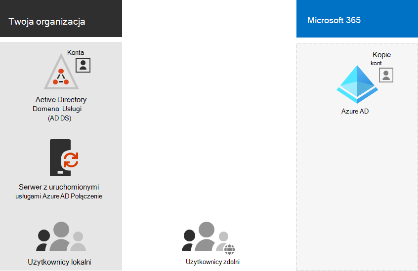

# Konfigurowanie synchronizacji katalogów dla Microsoft 365

*Ten artykuł dotyczy zarówno Microsoft 365 Enterprise, jak i Office 365 Enterprise.*

Microsoft 365 usługi Azure AD korzysta z dzierżawy usługi Azure Active Directory (Azure AD) do przechowywania tożsamości i zarządzania nimi w celu uwierzytelniania i uprawnień dostępu do zasobów opartych na chmurze. 

Jeśli masz lokalną domenę lub las Usługi domenowe w usłudze Active Directory (AD DS), możesz synchronizować swoje konta użytkowników, grupy i kontakty usługi AD DS z dzierżawą usługi Azure AD subskrypcji usługi Microsoft 365. Jest to tożsamość hybrydowa dla Microsoft 365. Oto jego składniki.

Usługa Azure AD Połączenie działa na serwerze lokalnym i synchronizuje AD DS z dzierżawą usługi Azure AD. Oprócz synchronizacji katalogów możesz także określić następujące opcje uwierzytelniania:

- Synchronizacja skrótów haseł (PHS)

  Azure AD wykonuje uwierzytelnianie.

- Uwierzytelnianie pass-through (PTA)

  Usługa Azure AD AD DS przeprowadzić uwierzytelnianie.

- Uwierzytelnianie federowane

  Usługa Azure AD odwołuje się do klienta żądające uwierzytelniania innym dostawcą tożsamości.

Aby [uzyskać więcej informacji, zobacz](plan-for-directory-synchronization.md) Tożsamości hybrydowe.
  
## 1. Przejrzyj wymagania wstępne dotyczące usługi Azure AD Połączenie

Bezpłatną subskrypcję usługi Azure AD otrzymasz w ramach Microsoft 365 subskrypcji usługi Azure AD. Podczas instalacji synchronizacji katalogów program Azure AD Połączenie na jednym z serwerów lokalnych.
  
Aby Microsoft 365, musisz:
  
- Zweryfikuj domenę lokalną. Kreator konfiguracji usługi Azure AD Połączenie cię przez ten proces.
- Uzyskaj nazwy użytkowników i hasła dla kont administratora Twojej dzierżawy usługi Microsoft 365 i AD DS.

Na serwerze lokalnym, na którym jest instalowana usługa Azure AD Połączenie, potrzebne są:
  
|**System operacyjny serwera**|**Inne oprogramowanie**|
|:-----|:-----|
|Windows Server 2012 R2 lub nowszy | — Program PowerShell jest zainstalowany domyślnie, nie jest wymagane żadne działanie.    - Wersje 4.5.1 i nowsze net są oferowane za pośrednictwem Windows aktualizacji. Upewnij się, że zainstalowano najnowsze aktualizacje dla Windows Server w Panelu sterowania. |
|Windows Server 2008 R2 z dodatkiem Service Pack 1 (SP1)** lub Windows Server 2012 | - Najnowsza wersja programu PowerShell jest dostępna w Windows Management Framework 4.0. Wyszukaj go w [Centrum pobierania Microsoft](https://go.microsoft.com/fwlink/p/?LinkId=717996).    - Program .Net 4.5.1 i jego nowsze wersje są dostępne w [Centrum pobierania Microsoft](https://go.microsoft.com/fwlink/p/?LinkId=717996). |
|Windows Server 2008 | - Najnowsza obsługiwana wersja programu PowerShell jest dostępna w Windows Management Framework 3.0, dostępnej w [Centrum pobierania Microsoft](https://go.microsoft.com/fwlink/p/?LinkId=717996).    - Program .Net 4.5.1 i jego nowsze wersje są dostępne w [Centrum pobierania Microsoft](https://go.microsoft.com/fwlink/p/?LinkId=717996). |

Zobacz [Wymagania wstępne programu Azure Active Directory Połączenie](/azure/active-directory/hybrid/how-to-connect-install-prerequisites), aby uzyskać szczegółowe informacje o wymaganiach dotyczących sprzętu, oprogramowania, konta i uprawnień, wymagań certyfikatu SSL i limitów obiektów dla usługi Azure AD Połączenie.
  
Możesz również zapoznać się z historią wersji Połączenie usługi Azure  AD, aby sprawdzić, co jest zawarte i rozwiązane w poszczególnych wersjach.

## 2. Instalowanie usługi Azure AD Połączenie i konfigurowanie synchronizacji katalogów

Przed rozpoczęciem upewnij się, że masz:

- Nazwa użytkownika i hasło administratora Microsoft 365 globalnego
- Nazwa użytkownika i hasło administratora AD DS domeny
- Która metoda uwierzytelniania (PHS, PTA, federowana)
- Czy chcesz używać bezproblemowego logowania [jednokrotnego w usłudze Azure AD](/azure/active-directory/hybrid/how-to-connect-sso)

Wykonaj następujące czynności:

1. Zaloguj się [do centrum administracyjne platformy Microsoft 365 nawigacji](https://admin.microsoft.com) (https://admin.microsoft.com) i wybierz **pozycję Aktywni** \> **użytkownicy użytkownicy** po lewej stronie nawigacji.
2. Na stronie **Aktywni użytkownicy** wybierz pozycję **Więcej** (trzy kropki) Synchronizacja \> **katalogów**.
  
3. Na stronie **Azure Active Directory** narzędzi do przygotowywania wybierz pozycję Przejdź do Centrum pobierania, aby uzyskać link narzędzia narzędzi Połączenie **Azure AD**, aby rozpocząć pracę. 
4. Postępuj zgodnie z instrukcjami w przewodniku [instalacji usługi Azure AD Połączenie i Azure AD Połączenie Health](/azure/active-directory/hybrid/how-to-connect-install-roadmap).

## 3. Zakończ konfigurowanie domen

Wykonaj czynności opisane w [tece Tworzenie rekordów DNS dla Microsoft 365 zarządzasz](/office365/admin/get-help-with-domains/create-dns-records-at-any-dns-hosting-provider) rekordami DNS, aby zakończyć konfigurowanie swoich domen.

## Następny krok

[Przypisywanie licencji do kont użytkowników](assign-licenses-to-user-accounts.md)