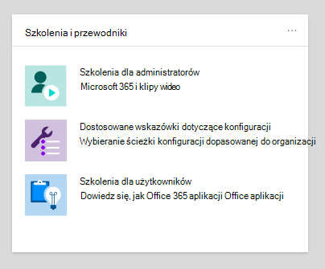
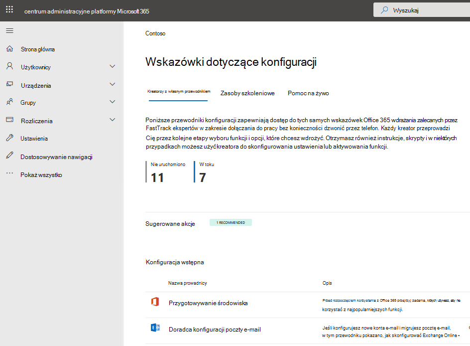

# Przewodniki konfiguracji dla usług Microsoft 365 i Office 365

przewodniki konfiguracji Microsoft 365 i Office 365 zapewniają dostosowane wskazówki i zasoby dotyczące planowania i wdrażania dzierżawy, aplikacji i usług. Te przewodniki są tworzone przy użyciu tych samych najlepszych rozwiązań, które [Microsoft 365 FastTrack](https://www.microsoft.com/fasttrack/microsoft-365) specjalistów od dołączania w poszczególnych interakcjach i są dostępne dla wszystkich administratorów w ramach Centrum administracyjne platformy Microsoft 365. Udostępniają informacje o konfiguracji produktu, włączaniu funkcji zabezpieczeń, wdrażaniu narzędzi do współpracy i udostępniają skrypty przyspieszające zaawansowane wdrożenia.

> [!NOTE]
> Aby uzyskać dostęp do przewodników konfiguracji Microsoft 365, musisz mieć przypisaną rolę administratora, taką jak Czytelnik globalny. Tylko administratorzy z rolą administratora globalnego mogą używać przewodników do zmiany ustawień w dzierżawie.

## Jak uzyskać dostęp do przewodników konfiguracji w Centrum administracyjne platformy Microsoft 365

Przewodniki konfiguracji są dostępne na stronie [Wskazówki dotyczące konfiguracji](https://aka.ms/setupguidance) w Centrum administracyjne platformy Microsoft 365. Możesz śledzić stan postępu i wrócić w dowolnym momencie, aby ukończyć przewodnik. Aby uzyskać dostęp do strony **wskazówek dotyczących konfiguracji** :

1. W [Centrum administracyjne platformy Microsoft 365](https://admin.microsoft.com/) przejdź do strony **głównej**.

2. Znajdź kartę **Przewodniki szkoleniowe &** .

   

3. Wybierz pozycję **Zaawansowane przewodniki wdrażania,** a następnie wybierz pozycję **Wszystkie przewodniki**.

   

## Przewodniki dotyczące konfiguracji początkowej

### Przygotowywanie środowiska

Przewodnik [Przygotowywanie środowiska](https://aka.ms/prepareyourenvironment) ułatwia przygotowanie środowiska organizacji do obsługi usług Microsoft 365 i Office 365. Niezależnie od celów należy wykonać zadania, które należy wykonać, aby zapewnić pomyślne wdrożenie. Aby uniknąć błędów podczas przygotowywania środowiska, otrzymasz instrukcje krok po kroku dotyczące łączenia domeny, dodawania użytkowników, przypisywania licencji, konfigurowania poczty e-mail z Exchange Online oraz instalowania lub wdrażania aplikacji Office.

### Przewodnik konfiguracji poczty e-mail

[Przewodnik konfiguracji poczty e-mail](https://aka.ms/office365setup) zawiera szczegółowe wskazówki dotyczące konfigurowania Exchange Online dla organizacji. Te wskazówki obejmują konfigurowanie nowych kont e-mail, migrowanie poczty e-mail i konfigurowanie ochrony poczty e-mail. Aby pomyślnie skonfigurować pocztę e-mail, użyj tego doradcy i otrzymasz zalecaną metodę migracji na podstawie bieżącego systemu poczty w organizacji, liczby migrowanych skrzynek pocztowych oraz sposobu zarządzania użytkownikami i ich dostępem.

### Migrowanie kontaktów i elementów kalendarza usługi Gmail

Podczas migracji skrzynki pocztowej użytkownika gmaila do Microsoft 365 wiadomości e-mail są migrowane, ale kontakty i elementy kalendarza nie są. Kontakt [gmail i doradca kalendarza](https://aka.ms/gmailcontactscalendar) zawiera kroki importowania kontaktów Google i elementów kalendarza Google w celu Microsoft 365 przy użyciu metod importu i eksportu z Outlook.com, klienta Outlook lub programu PowerShell.

### przewodnik konfiguracji Microsoft 365

[Przewodnik konfiguracji Microsoft 365](https://aka.ms/microsoft365setupguide) zawiera wskazówki dotyczące konfigurowania narzędzi zwiększających produktywność, zasad zabezpieczeń i możliwości zarządzania urządzeniami. Korzystając z Microsoft 365 Business Premium lub Microsoft 365 dla subskrypcji przedsiębiorstwa, możesz użyć tego doradcy do konfigurowania i konfigurowania urządzeń organizacji.

Otrzymasz wskazówki i dostęp do zasobów, aby włączyć usługi w chmurze, zaktualizować urządzenia do najnowszej obsługiwanej wersji Windows 10 i dołączyć urządzenia do Azure Active Directory (Azure AD), wszystkie w jednej centralnej lokalizacji.

### Przewodnik konfiguracji pracy zdalnej

[Przewodnik konfiguracji pracy zdalnej](https://aka.ms/remoteworksetup) udostępnia organizacjom porady i zasoby potrzebne do zapewnienia użytkownikom możliwości zdalnej pracy, bezpieczeństwa danych i ochrony poświadczeń użytkowników.

Otrzymasz wskazówki dotyczące optymalizacji ruchu urządzeń pracowników zdalnych zarówno do Microsoft 365 zasobów w chmurze, jak i sieci organizacji, co zmniejszy obciążenie infrastruktury sieci VPN dostępu zdalnego.

### przewodnik konfiguracji Microsoft Edge

Microsoft Edge została utworzona od podstaw, aby zapewnić światowej klasy zgodność i wydajność, bezpieczeństwo i prywatność, na które zasługujesz, oraz nowe funkcje zaprojektowane tak, aby zapewnić najlepsze działanie sieci Web.

[Przewodnik konfiguracji Microsoft Edge](https://aka.ms/edgeadvisoradmin) pomoże Ci skonfigurować Enterprise odnajdywania witryn, aby sprawdzić, do których witryn dostęp w organizacji może być konieczne korzystanie z trybu IE, przeglądanie i konfigurowanie ważnych funkcji zabezpieczeń, konfigurowanie zasad ochrony prywatności i zasad zgodności w celu spełnienia wymagań organizacji oraz zarządzanie dostępem do Internetu na urządzeniach. Możesz pobrać Microsoft Edge na poszczególne urządzenia lub pokażemy Ci, jak wdrożyć wielu użytkowników w organizacji przy użyciu zasady grupy, Configuration Manager lub Microsoft Intune.

### Konfigurowanie trybu IE dla Microsoft Edge

Jeśli już wdrożono Microsoft Edge i chcesz skonfigurować tylko tryb IE, [przewodnik Konfigurowanie trybu IE dla Microsoft Edge](https://aka.ms/configureiemodeadmin) udostępni skrypty automatyzujące konfigurację Enterprise odnajdywania lokacji. Otrzymasz również zalecenia dotyczące trybu IE z narzędzia opartego na chmurze, które pomoże Ci utworzyć listę witryn trybu Enterprise do wdrożenia dla użytkowników.

### przewodnik konfiguracji Microsoft Search

Microsoft Search pomaga twojej organizacji znaleźć to, czego potrzebuje, aby ukończyć to, nad czym pracuje. Niezależnie od tego, czy szukasz osób, plików, schematów organizacyjnych, witryn, czy odpowiedzi na typowe pytania, organizacja może korzystać z Microsoft Search przez cały dzień roboczy, aby uzyskać odpowiedzi.

[Przewodnik konfiguracji Microsoft Search](https://aka.ms/MicrosoftSearchSetup) pomaga skonfigurować Microsoft Search, czy chcesz go pilotować grupie użytkowników, czy wdrożyć go dla wszystkich w organizacji. Przypiszesz administratorów wyszukiwania i edytory wyszukiwania, a następnie dostosujesz środowisko wyszukiwania dla użytkowników z odpowiedziami i dodatkowymi opcjami, takimi jak dodanie rozszerzenia Bing do przeglądarki Chrome lub ustawienie Bing jako domyślnej wyszukiwarki.

## Przewodniki dotyczące uwierzytelniania i dostępu

### Konfigurowanie uwierzytelniania wieloskładnikowego (MFA)

[Przewodnik Konfigurowanie uwierzytelniania wieloskładnikowego (MFA)](https://admin.microsoft.com/Adminportal/Home?source=applauncher#/featureexplorer/security/ConditionalAccess) zawiera informacje zabezpieczające organizację przed naruszeniami z powodu utraty lub kradzieży poświadczeń. Uwierzytelnianie wieloskładnikowe natychmiast zwiększa bezpieczeństwo konta, monitując o przeprowadzenie wielu form weryfikacji w celu potwierdzenia tożsamości użytkownika podczas logowania się do aplikacji lub innego zasobu firmy. Może to być monit o wprowadzenie kodu na urządzeniu przenośnym użytkownika lub podanie skanowania odciskiem palca. Uwierzytelnianie wieloskładnikowe jest włączone za pośrednictwem dostępu warunkowego, ustawień domyślnych zabezpieczeń lub uwierzytelniania wieloskładnikowego dla poszczególnych użytkowników. Ten przewodnik zawiera zalecaną opcję uwierzytelniania wieloskładnikowego dla organizacji na podstawie licencji i istniejącej konfiguracji.

### Zabezpieczenia tożsamości dla Teams

[Przewodnik Dotyczący zabezpieczeń tożsamości dla zespołów](https://admin.microsoft.com/Adminportal/Home?source=applauncher#/teamsidentity) pomaga wykonać kilka podstawowych kroków zabezpieczeń, które można wykonać, aby zapewnić użytkownikom bezpieczeństwo i najbardziej produktywny czas korzystania z **Teams**.

### Dodawanie lub synchronizowanie użytkowników do Microsoft 365

[Ten przewodnik](https://admin.microsoft.com/Adminportal/Home?source=applauncher#/modernonboarding/identitywizard) pomoże usprawnić proces konfigurowania kont użytkowników w **Microsoft 365**. W zależności od środowiska i potrzeb możesz indywidualnie dodawać użytkowników, migrować katalog lokalny za pomocą Azure AD synchronizacji w chmurze lub Azure AD Połączenie lub rozwiązywać istniejące problemy z synchronizacją w razie potrzeby.

### przewodnik konfiguracji Azure AD

[Przewodnik konfiguracji Azure AD](https://aka.ms/aadpguidance) zawiera informacje zapewniające, że Organizacja ma silne podstawy zabezpieczeń. W tym przewodniku skonfigurujesz funkcje początkowe, takie jak kontrola dostępu oparta na rolach (RBAC) platformy Azure dla administratorów, Azure AD Połączenie dla katalogu lokalnego i Azure AD Połączenie Health, dzięki czemu możesz monitorować kondycję tożsamości hybrydowej podczas zautomatyzowanych synchronizacji.

Zawiera ona również podstawowe informacje dotyczące włączania samoobsługowego resetowania haseł, dostępu warunkowego i zintegrowanego logowania innych firm, w tym opcjonalnej zaawansowanej ochrony tożsamości i automatyzacji aprowizacji użytkowników.

### Synchronizowanie użytkowników z Windows Server Active Directory

Przewodnik [Synchronizuj użytkowników z Windows Server Active Directory](https://aka.ms/directorysyncsetup) przeprowadzi Cię przez włączanie synchronizacji katalogów. Synchronizacja katalogów łączy tożsamości lokalne i w chmurze w celu ułatwienia dostępu i uproszczonego zarządzania. Odblokuj nowe możliwości, takie jak logowanie jednokrotne, opcje samoobsługowe, automatyczna aprowizowanie konta, kontrola dostępu warunkowego i zasady zgodności. Te możliwości zapewniają użytkownikom dostęp do zasobów, których potrzebują z dowolnego miejsca.

### Planowanie wdrożenia bez hasła

Uaktualnij do alternatywnego podejścia do logowania, które umożliwia użytkownikom bezpieczny dostęp do urządzeń przy użyciu jednej z następujących metod uwierzytelniania bez hasła:

- Windows Hello dla firm
- Aplikacja Microsoft Authenticator
- Klucze zabezpieczeń

Skorzystaj z przewodnika [planowania wdrażania bez hasła](https://aka.ms/passwordlesssetup) , aby znaleźć najlepsze metody uwierzytelniania bez hasła do użycia i otrzymać wskazówki dotyczące sposobu ich wdrażania.

### Integrowanie aplikacji w chmurze innej firmy z aplikacją Azure AD

[Ten przewodnik](https://admin.microsoft.com/Adminportal/Home?source=applauncher#/azureadappintegration) ułatwia administratorom IT wybieranie i konfigurowanie aplikacji.

### Planowanie wdrożenia samoobsługowego resetowania haseł

Zapewnij użytkownikom możliwość samodzielnej zmiany lub zresetowania hasła, jeśli ich konto jest zablokowane lub zapomną hasła bez konieczności kontaktowania się z inżynierem pomocy technicznej.

Skorzystaj z przewodnika wdrażania planowania [samoobsługowego resetowania haseł](https://aka.ms/SSPRSetupGuide), aby otrzymywać odpowiednie artykuły i instrukcje dotyczące konfigurowania odpowiednich opcji Azure Portal ułatwiających wdrażanie samoobsługowego resetowania haseł w środowisku.

### doradca wdrażania Active Directory Federation Services (AD FS)

[Doradca wdrażania usług AD FS](https://aka.ms/adfsguidance) udostępnia szczegółowe wskazówki dotyczące wdrażania lokalnej infrastruktury usług AD FS, która uwierzytelnia użytkowników w usługach Microsoft 365 i Office 365. Dzięki temu przewodnikowi Twoja organizacja może przeglądać składniki i wymagania usług AD FS, uzyskiwać i instalować certyfikaty SSL niezbędne do wdrożenia oraz zainstalować wymagany serwer proxy aplikacji internetowej.

## Przewodniki dotyczące zabezpieczeń i zgodności

### Analizator zabezpieczeń

[Analizator zabezpieczeń](https://aka.ms/securityanalyzer) przeprowadzi analizę twojego podejścia do zabezpieczeń i przedstawi zintegrowane rozwiązania firmy Microsoft w zakresie zabezpieczeń i zgodności, które mogą poprawić stan bezpieczeństwa. Poznasz zaawansowane funkcje, takie jak zarządzanie tożsamościami i pomaganie w ochronie przed nowoczesnymi atakami. Następnie możesz zarejestrować się w celu uzyskania subskrypcji wersji próbnej i wskazać odpowiednie wskazówki dotyczące konfiguracji dla każdego rozwiązania.

### przewodnik konfiguracji Microsoft Intune

Konfigurowanie Microsoft Intune do zarządzania urządzeniami w organizacji. Aby uzyskać pełną kontrolę nad urządzeniami firmowymi, użyjesz funkcji zarządzania urządzeniami przenośnymi (MDM) Intune. Aby zarządzać danymi organizacji na urządzeniach udostępnionych i osobistych, możesz użyć funkcji zarządzania aplikacjami mobilnymi (MAM) Intune.

W [przewodniku konfiguracji Microsoft Intune](https://aka.ms/intunesetupguide) skonfigurujesz zasady zgodności urządzeń i aplikacji, przypiszesz zasady ochrony aplikacji oraz będziesz monitorować stan urządzenia i ochrony aplikacji.

### przewodnik konfiguracji Ochrona punktu końcowego w usłudze Microsoft Defender

[Przewodnik konfiguracji Ochrona punktu końcowego w usłudze Microsoft Defender](https://aka.ms/mdatpsetup) zawiera instrukcje, które pomogą twojej sieci przedsiębiorstwa zapobiegać zaawansowanym zagrożeniom, wykrywać i badać je oraz reagować na nie. Dokonaj świadomej oceny luk w zabezpieczeniach organizacji i zdecyduj, który pakiet wdrożeniowy i metody konfiguracji są najlepsze.

> [!NOTE]
> Licencja zbiorcza firmy Microsoft jest wymagana dla Ochrona punktu końcowego w usłudze Microsoft Defender.

### przewodnik konfiguracji Exchange Online Protection

Microsoft Exchange Online Protection (EOP) to oparta na chmurze usługa filtrowania poczty e-mail w celu ochrony przed spamem i złośliwym oprogramowaniem, która zapewnia ochronę organizacji przed naruszeniami zasad obsługi komunikatów.

Skorzystaj z [przewodnika konfiguracji Exchange Online Protection](https://aka.ms/EOPguidance), aby skonfigurować funkcję EOP, wybierając, który z trzech scenariuszy&mdash; wdrażaniakonfiguruje lokalne skrzynki pocztowe, skrzynki pocztowe hybrydowe (połączenie lokalnych i chmurowych) lub wszystkie skrzynki pocztowe w chmurzepasują&mdash; twoją organizację. Przewodnik zawiera informacje i zasoby służące do konfigurowania i przeglądania licencjonowania użytkownika, przypisywania uprawnień w Centrum administracyjne platformy Microsoft 365 oraz konfigurowania zasad ochrony przed złośliwym oprogramowaniem i spamem w Centrum zgodności & zabezpieczeń.

### Przewodnik konfiguracji ochrony usługi Office 365 w usłudze Microsoft Defender

[Przewodnik konfiguracji Ochrona usługi Office 365 w usłudze Microsoft Defender](https://aka.ms/oatpsetup) chroni organizację przed złośliwymi zagrożeniami, które środowisko może natknąć się za pośrednictwem wiadomości e-mail, linków i narzędzi do współpracy innych firm. Ten przewodnik zawiera zasoby i informacje ułatwiające przygotowanie i zidentyfikowanie planu Ochrona usługi Office 365 w usłudze Defender zgodnie z potrzebami organizacji.

### przewodnik konfiguracji Microsoft Defender for Identity

[Przewodnik konfiguracji Microsoft Defender for Identity](https://aka.ms/DefenderforIdentitysetup) zawiera wskazówki dotyczące konfigurowania rozwiązań zabezpieczeń umożliwiające identyfikowanie, wykrywanie i badanie zaawansowanych zagrożeń, które mogą naruszać tożsamości użytkowników. Obejmują one wykrywanie podejrzanych działań użytkowników i złośliwych akcji niejawnych testerów skierowanych do Organizacji. Utworzysz wystąpienie usługi Defender for Identity, połączysz się z usługą Active Directory organizacji, a następnie skonfigurujesz czujniki, alerty, powiadomienia i skonfigurujesz unikatowe preferencje portalu.

### Przewodnik konfiguracji rozwiązań ryzyka dla niejawnych testerów

[Przewodnik po konfiguracji rozwiązań do analizy ryzyka dla niejawnych testerów](https://aka.ms/Insiderrisksetup) pomaga chronić organizację przed zagrożeniami wewnętrznymi, które mogą być trudne do zidentyfikowania i trudne do wyeliminowania. Zagrożenia wewnętrzne występują w różnych obszarach i mogą powodować poważne problemy dla organizacji, od utraty własności intelektualnej po nękanie w miejscu pracy i nie tylko.

Rozwiązania w tym przewodniku pomogą Ci uzyskać wgląd w działania użytkowników, akcje i komunikację za pomocą natywnych sygnałów i wzbogaceń z całej organizacji:

* Dzięki rozwiązaniu do zapewniania zgodności z komunikacją można identyfikować zagrożenia komunikacyjne i działać na ich podstawie w przypadku takich elementów jak przemoc w miejscu pracy, wykorzystywanie informacji poufnych, nękanie, kodeks postępowania i naruszenia zgodności z przepisami.
* Rozwiązanie do zarządzania ryzykiem wewnętrznym pomaga identyfikować, badać i podejmować działania dotyczące ryzyka kradzieży własności intelektualnej, wycieków poufnych danych, naruszeń zabezpieczeń, wycieków danych i naruszeń poufności.

### przewodnik konfiguracji Microsoft Purview Information Protection

Zapoznaj się z omówieniem możliwości, które można zastosować do strategii ochrony informacji, aby mieć pewność, że informacje poufne są chronione. Użyj 4-etapowego podejścia do cyklu życia, w którym będzie można odkrywać, klasyfikować, chronić i monitorować informacje poufne. [Przewodnik konfiguracji Microsoft Purview Information Protection](https://aka.ms/microsoftpurviewinformationprotectionsetupguide) zawiera wskazówki dotyczące ukończenia każdego z tych etapów.

### przewodnik konfiguracji zarządzanie cyklem życia danych Microsoft Purview

[Przewodnik konfiguracji zarządzanie cyklem życia danych Microsoft Purview](https://aka.ms/migsetupguide) zawiera informacje potrzebne do skonfigurowania strategii ładu organizacji i zarządzania nimi, aby upewnić się, że dane są klasyfikowane i zarządzane zgodnie z określonymi wytycznymi dotyczącymi cyklu życia. W tym przewodniku dowiesz się, jak tworzyć, automatycznie stosować lub publikować etykiety przechowywania, zasady etykiet przechowywania i zasady przechowywania, które są stosowane do rekordów zawartości i zgodności organizacji. Uzyskasz również informacje na temat importowania plików CSV z planem plików dla scenariuszy zbiorczych lub ich ręcznego stosowania do poszczególnych dokumentów.

### przewodnik konfiguracji Microsoft Defender for Cloud Apps

[Przewodnik konfiguracji Microsoft Defender for Cloud Apps](https://aka.ms/cloudappsecuritysetup) zapewnia łatwe do wykonania wskazówki dotyczące wdrażania i zarządzania w celu skonfigurowania rozwiązania Cloud Discovery. Dzięki usłudze Cloud Discovery zintegrujesz obsługiwane aplikacje zabezpieczeń, a następnie użyjesz dzienników ruchu, aby dynamicznie odnajdywać i analizować aplikacje w chmurze używane przez organizację. Skonfigurujesz również funkcje dostępne za pośrednictwem rozwiązania Defender dla Chmury Apps, w tym zasady wykrywania zagrożeń w celu identyfikowania użycia wysokiego ryzyka, zasady ochrony informacji do definiowania dostępu i kontrolki sesji w czasie rzeczywistym w celu monitorowania aktywności. Dzięki tym funkcjom środowisko uzyskuje lepszą widoczność, kontrolę nad przenoszeniem danych i analizę w celu identyfikowania i zwalczania cyberodzyskiwsty we wszystkich usługach firmy Microsoft i innych firm w chmurze.

## Przewodniki dotyczące współpracy

### Tworzenie środowiska pracowników

Przekształć sposób współpracy pracowników z [pulpitem nawigacyjnym Środowisko pracowników](https://aka.ms/EmployeeExperienceDashboard). Aby zapewnić bezproblemową pracę zespołową, użyj Microsoft 365, aby tworzyć produktywne, dopasowane zespoły i utrzymywać zaangażowanie pracowników w kierownictwo i resztę organizacji. Pomóż pracownikom być skutecznym we wszystkich działaniach służbowych. Te przewodniki zawierają instrukcje dotyczące sposobu używania SharePoint, Teams i Yammer do tworzenia współpracy w organizacji, aby zwiększyć produktywność.

### przewodnik konfiguracji Aplikacje Microsoft 365

[Przewodnik konfiguracji Aplikacje Microsoft 365](https://aka.ms/OPPquickstartguide) ułatwia uruchamianie urządzeń użytkowników z najnowszą wersją produktów Office, takich jak Word, Excel, PowerPoint i OneNote. Uzyskasz wskazówki dotyczące różnych metod wdrażania, które obejmują łatwe opcje samodzielnej instalacji wdrożeń w przedsiębiorstwie za pomocą narzędzi do zarządzania. Instrukcje pomogą Ci ocenić środowisko, ustalić określone wymagania dotyczące wdrożenia i zaimplementować niezbędne narzędzia pomocy technicznej, aby zapewnić pomyślną instalację.

### Przewodnik konfiguracji aplikacji mobilnych

[Przewodnik konfiguracji aplikacji mobilnych](https://aka.ms/officeappguidance) zawiera instrukcje dotyczące pobierania i instalowania aplikacji Office na urządzeniach przenośnych Windows, iOS i Android. Ten przewodnik zawiera szczegółowe informacje dotyczące pobierania i instalowania aplikacji Microsoft 365 i Office 365 na telefonie i tablecie.

### przewodnik konfiguracji Microsoft Teams

[Przewodnik konfiguracji Microsoft Teams](https://aka.ms/teamsguidance) zapewnia organizacji wskazówki dotyczące konfigurowania obszarów roboczych zespołu, które hostują konwersacje w czasie rzeczywistym za pośrednictwem wiadomości, połączeń oraz spotkań audio lub wideo dla komunikacji zespołowej i prywatnej. Użyj narzędzi w tym przewodniku, aby skonfigurować dostęp gościa, ustawić, kto może tworzyć zespoły i dodawać członków zespołu z pliku .csv, a wszystko to bez konieczności otwierania sesji programu PowerShell. Otrzymasz również najlepsze rozwiązania dotyczące określania wymagań sieciowych organizacji i zapewniania pomyślnego wdrożenia Teams.

### przewodnik konfiguracji Teams Telefon

[Przewodnik konfiguracji Teams Telefon](https://aka.ms/teamsphonesetupguide) pomaga pozostać w kontakcie z używaniem nowoczesnych rozwiązań wywołujących. Zastosuj kluczowe możliwości za pomocą opartego na chmurze systemu kontroli połączeń, który obsługuje obciążenie telefonii dla Teams. Możesz wybrać i wdrożyć funkcje z dostępnych opcji łączności publicznej przełączanej sieci telefonicznej (PSTN). Możesz również znaleźć pomoc dotyczącą innych funkcji, takich jak automatyczna asystentka, kolejki połączeń, Konferencje głosowe, identyfikator wywołujący i wydarzenia na żywo.

### przewodnik konfiguracji SharePoint

[Przewodnik konfiguracji SharePoint](https://aka.ms/spoguidance) ułatwia konfigurowanie SharePoint zarządzania magazynem dokumentów i zawartością, tworzenie witryn, konfigurowanie udostępniania zewnętrznego, migrowanie danych i konfigurowanie zaawansowanych ustawień oraz zwiększanie zaangażowania użytkowników i komunikacji w organizacji. Wykonasz kroki konfigurowania zasad uprawnień do udostępniania zawartości, wybierz narzędzia synchronizacji migracji i włącz ustawienia zabezpieczeń dla środowiska SharePoint.

### przewodnik konfiguracji OneDrive

Skorzystaj z [przewodnika konfiguracji OneDrive](https://aka.ms/ODfBquickstartguide), aby rozpocząć pracę z funkcjami OneDrive magazynu plików, udostępniania, współpracy i synchronizacji. OneDrive udostępnia centralną lokalizację, w której użytkownicy mogą synchronizować swoje pliki Aplikacje Microsoft 365, konfigurować udostępnianie zewnętrzne, migrować dane użytkowników oraz konfigurować zaawansowane ustawienia zabezpieczeń i dostępu do urządzeń. Przewodnik konfiguracji OneDrive można wdrożyć przy użyciu subskrypcji OneDrive lub autonomicznego planu OneDrive.

### doradca wdrażania Yammer

Połączenie i skontaktuj się z Yammer w całej organizacji. [Doradca wdrażania Yammer](https://aka.ms/yammerdeploymentguide) przygotowuje sieć Yammer, dodając domeny, definiując administratorów i łącząc sieci Yammer. Otrzymasz wskazówki dotyczące wdrażania Yammer, a następnie dostosowywania wyglądu, konfigurowania zabezpieczeń i zgodności oraz uściślania ustawień.

## Przewodniki zaawansowane

### Uaktualnianie w miejscu za pomocą Configuration Manager

Uaktualnianie w [miejscu z przewodnikiem Configuration Manager](https://aka.ms/win10upgradedemo) podczas uaktualniania urządzeń Windows 7 i Windows 8.1 do najnowszej wersji Windows 10. Użyjesz dostarczonego skryptu, aby sprawdzić wymagania wstępne i automatycznie skonfigurować uaktualnienie w miejscu.

### Wdrażanie Office dla użytkowników

Wdrażanie Office aplikacji z chmury przy użyciu narzędzia do wdrażania Office. [Przewodnik Wdrażanie Office dla użytkowników](https://aka.ms/proplusodt) ułatwia tworzenie niestandardowej konfiguracji Office z ustawieniami zaawansowanymi lub użycie wstępnie utworzonej zalecanej konfiguracji. Niezależnie od tego, czy użytkownicy przeprowadzają samodzielną instalację, czy wdrażasz dla użytkowników indywidualnie lub zbiorczo, ten zaawansowany przewodnik zawiera instrukcje krok po kroku, aby zapewnić użytkownikom Office instalację dostosowaną do organizacji.

### Wdrażanie Office dla użytkowników zdalnych

Teraz, gdy praca zdalna jest normą, użytkownicy muszą otrzymywać ustawienia Office organizacji, gdy nie są połączeni z siecią wewnętrzną lub podczas korzystania z własnych urządzeń.

[Przewodnik Wdrażanie Office dla użytkowników zdalnych](https://aka.ms/officeremoteinstall) umożliwia utworzenie niestandardowej instalacji Office, a następnie wysłanie użytkownikom wygenerowanego skryptu programu PowerShell, który będzie bezproblemowo instalować Office z konfiguracją.

### Wdrażanie i aktualizowanie Aplikacje Microsoft 365 przy użyciu Configuration Manager

W przypadku organizacji korzystających z Configuration Manager można użyć [Aplikacje Microsoft 365 Wdrażanie i aktualizowanie z doradcą Configuration Manager](https://aka.ms/oppinstall) w celu wygenerowania skryptu, który automatycznie skonfiguruje Aplikacje Microsoft 365  wdrożenie przy użyciu najlepszych rozwiązań zalecanych przez inżynierów FastTrack. Skorzystaj z tego przewodnika, aby utworzyć grupy wdrożeń, dostosować Office aplikacje i funkcje, skonfigurować instalacje dynamiczne lub lean, a następnie uruchomić skrypt, aby utworzyć aplikacje, reguły wdrażania automatycznego i kolekcje urządzeń potrzebne do wdrożenia.

### przewodnik konfiguracji współzarządzania Intune Configuration Manager

Użyj [przewodnika konfiguracji współzarządzania Intune Configuration Manager](https://aka.ms/comanagementsetup), aby skonfigurować istniejące Configuration Manager urządzenia klienckie i nowe urządzenia internetowe, które organizacja chce współzarządzać zarówno przy użyciu Microsoft Intune, jak i Configuration Manager. Współzarządzanie umożliwia zarządzanie urządzeniami Windows 10 i dodawanie nowych funkcji do urządzeń organizacji przy jednoczesnym korzystaniu z zalet obu rozwiązań.
