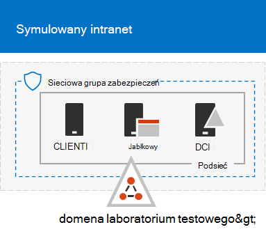

# <a name="the-simulated-enterprise-base-configuration"></a>Symulowana konfiguracja bazy przedsiębiorstwa

*Ten przewodnik laboratorium testowego może być używany zarówno w przypadku Microsoft 365 przedsiębiorstwa, Office 365 Enterprise testowych.*

W tym artykule opisano, jak utworzyć uproszczone środowisko dla Microsoft 365 dla przedsiębiorstw, które zawiera:

- Subskrypcja Microsoft 365 E5 próbna lub płatna.
- Uproszczony intranet organizacji połączony z Internetem składający się z trzech maszyn wirtualnych w sieci wirtualnej platformy Azure (DC1, APP1 i CLIENT1).
 


Tworzenie uproszczonego środowiska testowego obejmuje dwie fazy:
- [Etap 1. Tworzenie symulowanego intranetu](#phase-1-create-a-simulated-intranet)
- [Etap 2. Tworzenie subskrypcji Microsoft 365 E5 firmowej](#phase-2-create-your-microsoft-365-e5-subscription)

Za pomocą środowiska wynikowego można przetestować funkcje programu Microsoft 365 [przedsiębiorstwa](https://www.microsoft.com/microsoft-365/enterprise) za pomocą dodatkowych przewodników laboratorium testowego [](m365-enterprise-test-lab-guides.md) lub samodzielnie.


> [!TIP]
> Aby uzyskać wizualną mapę do wszystkich artykułów w stosie przewodników laboratorium testowego Microsoft 365 dla przedsiębiorstw, przejdź do tematu Microsoft 365 — przewodnik laboratorium testowego w [przedsiębiorstwie](../downloads/Microsoft365EnterpriseTLGStack.pdf).

## <a name="phase-1-create-a-simulated-intranet"></a>Etap 1. Tworzenie symulowanego intranetu

W tej fazie skompilowanie symulowanego intranetu w usługach infrastruktury platformy Azure, który obejmuje Usługi domenowe w usłudze Active Directory domeny (AD DS), serwer aplikacji i komputer kliencki.

Te komputery będą używać w dodatkowych przewodnikach laboratorium Microsoft 365 [dla](m365-enterprise-test-lab-guides.md) przedsiębiorstw w celu skonfigurowania i zaprezentowania tożsamości hybrydowej oraz innych możliwości.

### <a name="method-1-build-your-simulated-intranet-with-an-azure-resource-manager-template"></a>Metoda 1. Tworzenie symulowanego intranetu za pomocą szablonu usługi Azure Resource Manager

W przypadku tej metody użyj szablonu usługi Azure Resource Manager, aby utworzyć symulowany intranet. Szablony w usłudze Azure Resource Manager zawierają wszystkie instrukcje tworzenia infrastruktury sieciowej platformy Azure, maszyn wirtualnych i ich konfiguracji.

Przed wdrożeniem szablonu przeczytaj stronę [szablonu README i](https://github.com/maxskunkworks/TLG/tree/master/tlg-base-config_3-vm.m365-ems) przygotuj następujące informacje:

- Nazwa publicznej domeny DNS środowiska testowego (testlab\<*your public domain*>.). Tę nazwę wprowadź w polu **Nazwa domeny** na stronie **Wdrożenie** niestandardowe.
- Prefiks etykiety DNS dla adresów URL publicznych adresów IP Twoich maszyn wirtualnych. Musisz wprowadzić tę etykietę w polu Prefiks etykiety **DNS** na **stronie Wdrożenie** niestandardowe.

Po przeczytaniu instrukcji wybierz pozycję Wdeksuj na platformie **Azure** na [stronie szablonu README](https://github.com/maxskunkworks/TLG/tree/master/tlg-base-config_3-vm.m365-ems) , aby rozpocząć.

>[!Note]
>Symulowany intranet zbudowany za pomocą szablonu Azure Resource Manager wymaga płatnej subskrypcji platformy Azure.

Po zakończeniu pracy szablonu konfiguracja wygląda następująco:



### <a name="method-2-build-your-simulated-intranet-with-azure-powershell"></a>Metoda 2. Tworzenie symulowanego intranetu przy użyciu Azure PowerShell

W tej metodzie używasz modułu Windows PowerShell i modułu Azure PowerShell do tworzenia infrastruktury sieci, maszyn wirtualnych i ich konfiguracji.

Użyj tej metody, jeśli chcesz uzyskać doświadczenie w tworzeniu elementów infrastruktury platformy Azure krok po kroku za pomocą programu PowerShell. Następnie możesz dostosować bloki poleceń programu PowerShell na własny sposób wdrożenia innych maszyn wirtualnych na platformie Azure.

#### <a name="step-1-create-dc1"></a>Krok 1. Tworzenie dc1

W tym kroku utworzysz sieć wirtualną platformy Azure i dodasz DC1, czyli maszynę wirtualną, która jest kontrolerem domeny dla domeny AD DS domeny.

Najpierw uruchom wiersz Windows PowerShell na komputerze lokalnym.
  
> [!NOTE]
> W poniższych zestawach poleceń jest dostępna najnowsza wersja Azure PowerShell. Zobacz [Wprowadzenie do Azure PowerShell cmdlet](/powershell/azureps-cmdlets-docs/). 
  
Zaloguj się do swojego konta Azure za pomocą następującego polecenia.
  
```powershell
Connect-AzAccount
```

Uzyskaj nazwę subskrypcji za pomocą następującego polecenia.
  
```powershell
Get-AzSubscription | Sort Name | Select Name
```

Ustaw subskrypcję platformy Azure. Zamień wszystkie znaki cudzysłowu, łącznie z nawiasami kąta ("<" i ">") właściwą nazwą.
  
```powershell
$subscr="<subscription name>"
Get-AzSubscription -SubscriptionName $subscr | Select-AzSubscription
```

Następnie utwórz nową grupę zasobów dla symulowanego laboratorium testowego przedsiębiorstwa. Aby określić unikatową nazwę grupy zasobów, użyj tego polecenia, aby wyświetlić listę istniejących grup zasobów.
  
```powershell
Get-AzResourceGroup | Sort ResourceGroupName | Select ResourceGroupName
```

Za pomocą tych poleceń utwórz nową grupę zasobów. Zamień wszystkie cudzysłowy, łącznie z nawiasami kąta, na poprawne nazwy.
  
```powershell
$rgName="<resource group name>"
$locName="<location name, such as West US>"
New-AzResourceGroup -Name $rgName -Location $locName
```

Następnie utwórz sieć wirtualną TestLab, która hostuje podsieci firmowe w symulowanym środowisku przedsiębiorstwa i chroni ją za pomocą grupy zabezpieczeń sieci. Wpisz nazwę grupy zasobów i uruchom te polecenia w wierszu polecenia programu PowerShell na komputerze lokalnym.
  
```powershell
$rgName="<name of your new resource group>"
$locName=(Get-AzResourceGroup -Name $rgName).Location
$corpnetSubnet=New-AzVirtualNetworkSubnetConfig -Name Corpnet -AddressPrefix 10.0.0.0/24
New-AzVirtualNetwork -Name TestLab -ResourceGroupName $rgName -Location $locName -AddressPrefix 10.0.0.0/8 -Subnet $corpnetSubnet -DNSServer 10.0.0.4
$rule1=New-AzNetworkSecurityRuleConfig -Name "RDPTraffic" -Description "Allow RDP to all VMs on the subnet" -Access Allow -Protocol Tcp -Direction Inbound -Priority 100 -SourceAddressPrefix Internet -SourcePortRange * -DestinationAddressPrefix * -DestinationPortRange 3389
New-AzNetworkSecurityGroup -Name Corpnet -ResourceGroupName $rgName -Location $locName -SecurityRules $rule1
$vnet=Get-AzVirtualNetwork -ResourceGroupName $rgName -Name TestLab
$nsg=Get-AzNetworkSecurityGroup -Name Corpnet -ResourceGroupName $rgName
Set-AzVirtualNetworkSubnetConfig -VirtualNetwork $vnet -Name Corpnet -AddressPrefix "10.0.0.0/24" -NetworkSecurityGroup $nsg
$vnet | Set-AzVirtualNetwork
```

Następnie należy utworzyć maszynę wirtualną DC1 i skonfigurować ją jako kontroler domeny dla **testlabu.**\<your public domain> AD DS domeny i serwera DNS dla maszyn wirtualnych sieci wirtualnej TestLab. Jeśli na przykład twoja nazwa domeny publicznej to **<span>contoso.com</span>**, maszyną wirtualną DC1 będzie kontroler domeny dla domeny **<span>testlab.contoso.com</span>**.
  
Aby utworzyć maszynę wirtualną platformy Azure dla dc1, wpisz nazwę grupy zasobów i uruchom te polecenia w wierszu polecenia programu PowerShell na komputerze lokalnym.
  
```powershell
$rgName="<resource group name>"
$locName=(Get-AzResourceGroup -Name $rgName).Location
$vnet=Get-AzVirtualNetwork -Name TestLab -ResourceGroupName $rgName
$pip=New-AzPublicIpAddress -Name DC1-PIP -ResourceGroupName $rgName -Location $locName -AllocationMethod Dynamic
$nic=New-AzNetworkInterface -Name DC1-NIC -ResourceGroupName $rgName -Location $locName -SubnetId $vnet.Subnets[0].Id -PublicIpAddressId $pip.Id -PrivateIpAddress 10.0.0.4
$vm=New-AzVMConfig -VMName DC1 -VMSize Standard_A2_V2
$cred=Get-Credential -Message "Type the name and password of the local administrator account for DC1."
$vm=Set-AzVMOperatingSystem -VM $vm -Windows -ComputerName DC1 -Credential $cred -ProvisionVMAgent -EnableAutoUpdate
$vm=Set-AzVMSourceImage -VM $vm -PublisherName MicrosoftWindowsServer -Offer WindowsServer -Skus 2016-Datacenter -Version "latest"
$vm=Add-AzVMNetworkInterface -VM $vm -Id $nic.Id
$vm=Set-AzVMOSDisk -VM $vm -Name "DC1-OS" -DiskSizeInGB 128 -CreateOption FromImage
$diskConfig=New-AzDiskConfig -AccountType "Standard_LRS" -Location $locName -CreateOption Empty -DiskSizeGB 20
$dataDisk1=New-AzDisk -DiskName "DC1-DataDisk1" -Disk $diskConfig -ResourceGroupName $rgName
$vm=Add-AzVMDataDisk -VM $vm -Name "DC1-DataDisk1" -CreateOption Attach -ManagedDiskId $dataDisk1.Id -Lun 1
New-AzVM -ResourceGroupName $rgName -Location $locName -VM $vm
```

Zostanie wyświetlony monit o nazwę użytkownika i hasło dla konta administratora lokalnego w dc1. Użyj silnego hasła i zanotuj zarówno nazwę, jak i hasło w bezpiecznym miejscu.
  
Następnie połącz się z maszyną wirtualną DC1:
  
1. W portalu [Azure wybierz](https://portal.azure.com) pozycję **Grupy** zasobów > <nazwę nowej grupy zasobów ***_> > _* DC1** >  **Połączenie**.
    
2. W otwartym okienku wybierz pozycję **Pobierz plik RDP**. Otwórz pobrany plik DC1.rdp, a następnie wybierz pozycję **Połączenie**.
    
3. Określ nazwę konta administratora lokalnego DC1:
    
   - Dla Windows 7:
    
     W **oknie Zabezpieczenia Windows** wybierz pozycję **Użyj innego konta**. W **imieniu użytkownika** wprowadź **dc1local\\**< *administrator account name*>.
    
   - W Windows 8 lub Windows 10:
    
     W **oknie Zabezpieczenia Windows** wybierz pozycję **Więcej** opcji, a następnie wybierz **pozycję Użyj innego konta**. W **imieniu użytkownika** wprowadź **dc1local\\**< *administrator account name*>.
    
4. W **polecej** Hasło wprowadź hasło konta administratora lokalnego, a następnie wybierz przycisk **OK**.
    
5. Po wyświetleniu monitu wybierz pozycję **Tak**.
    
Następnie dodaj dodatkowy dysk danych jako nowy wolumin z literą dysku F: za pomocą tego polecenia w wierszu polecenia na poziomie administratora Windows PowerShell w dniu DC1.
  
```powershell
Get-Disk | Where PartitionStyle -eq "RAW" | Initialize-Disk -PartitionStyle MBR -PassThru | New-Partition -AssignDriveLetter -UseMaximumSize | Format-Volume -FileSystem NTFS -NewFileSystemLabel "WSAD Data"
```

Następnie skonfiguruj dc1 jako kontroler domeny i serwer DNS dla **testlab.**\<*your public domain*> domenę. Określ nazwę domeny publicznej, usuń nawiasy kątowe, a następnie uruchom te polecenia w wierszu polecenia na poziomie administratora Windows PowerShell w dc1.
  
```powershell
$yourDomain="<your public domain>"
Install-WindowsFeature AD-Domain-Services -IncludeManagementTools
Install-ADDSForest -DomainName testlab.$yourDomain -DatabasePath "F:\NTDS" -SysvolPath "F:\SYSVOL" -LogPath "F:\Logs"
```
Należy określić hasło administratora w trybie awaryjnym. Przechowuj to hasło w bezpiecznym miejscu.
  
Pamiętaj, że ukończenie tych poleceń może potrwać kilka minut.
  
Po ponownym uruchomieniu dc1 ponownie połącz się z maszyną wirtualną DC1.
  
1. W portalu [Azure wybierz](https://portal.azure.com) pozycję **Grupy** zasobów, > <*nazwę grupy* zasobów> > **DC1** >  **Połączenie**.
    
2. Uruchom pobrany plik DC1.rdp, a następnie wybierz pozycję **Połączenie**.
    
3. W **Zabezpieczenia Windows** wybierz pozycję **Użyj innego konta**. W **imieniu użytkownika** wprowadź **testLABlocal\\**< *administrator account name* (Nazwa użytkownika) i>.
    
4. W **polu** Hasło wprowadź hasło do konta administratora lokalnego, a następnie wybierz przycisk **OK**.
    
5. Po wyświetleniu monitu wybierz pozycję **Tak**.
    
Następnie utwórz konto użytkownika w usłudze Active Directory, które będzie używane podczas logowania się na komputerach członków domeny TESTLAB. Uruchom to polecenie w wierszu polecenia Windows PowerShell na poziomie administratora.
  
```powershell
New-ADUser -SamAccountName User1 -AccountPassword (read-host "Set user password" -assecurestring) -name "User1" -enabled $true -PasswordNeverExpires $true -ChangePasswordAtLogon $false
```

To polecenie monituje o podaniem hasła do konta użytkownika Użytkownik1. To konto będzie używane do połączeń pulpitu zdalnego dla wszystkich komputerów członków domeny TESTLAB, więc wybierz silne hasło. Zanotuj hasło do konta użytkownika User1 i przechowuj je w lokalizacji zabezpieczonej.
  
Następnie skonfiguruj nowe konto User1 jako administratora domeny, przedsiębiorstwa i schematu. Uruchom to polecenie na poziomie administratora Windows PowerShell wiersza polecenia.
  
```powershell
$yourDomain="<your public domain>"
$domainName = "testlab."+$yourDomain
$userName="user1@" + $domainName
$userSID=(New-Object System.Security.Principal.NTAccount($userName)).Translate([System.Security.Principal.SecurityIdentifier]).Value
$groupNames=@("Domain Admins","Enterprise Admins","Schema Admins")
ForEach ($name in $groupNames) {Add-ADPrincipalGroupMembership -Identity $userSID -MemberOf (Get-ADGroup -Identity $name).SID.Value}
```

Zamknij sesję pulpitu zdalnego z dc1, a następnie ponownie połącz się przy użyciu konta TESTLABUser1\\.
  
Następnie, aby zezwolić na ruch dla narzędzia Ping, uruchom to polecenie w wierszu Windows PowerShell administratora.
  
```powershell
Set-NetFirewallRule -DisplayName "File and Printer Sharing (Echo Request - ICMPv4-In)" -enabled True
```

Bieżąca konfiguracja wygląda następująco:
  

  
#### <a name="step-2-configure-app1"></a>Krok 2. Konfigurowanie aplikacji APP1

W tym kroku utworzysz i skonfigurujesz aplikację APP1, która jest serwerem aplikacji, który początkowo oferuje usługi udostępniania plików i sieci Web.

Aby utworzyć maszynę wirtualną azure dla aplikacji APP1, wpisz nazwę grupy zasobów i uruchom te polecenia w wierszu polecenia na komputerze lokalnym.
  
```powershell
$rgName="<resource group name>"
$locName=(Get-AzResourceGroup -Name $rgName).Location
$vnet=Get-AzVirtualNetwork -Name TestLab -ResourceGroupName $rgName
$pip=New-AzPublicIpAddress -Name APP1-PIP -ResourceGroupName $rgName -Location $locName -AllocationMethod Dynamic
$nic=New-AzNetworkInterface -Name APP1-NIC -ResourceGroupName $rgName -Location $locName -SubnetId $vnet.Subnets[0].Id -PublicIpAddressId $pip.Id
$vm=New-AzVMConfig -VMName APP1 -VMSize Standard_A2_V2
$cred=Get-Credential -Message "Type the name and password of the local administrator account for APP1."
$vm=Set-AzVMOperatingSystem -VM $vm -Windows -ComputerName APP1 -Credential $cred -ProvisionVMAgent -EnableAutoUpdate
$vm=Set-AzVMSourceImage -VM $vm -PublisherName MicrosoftWindowsServer -Offer WindowsServer -Skus 2016-Datacenter -Version "latest"
$vm=Add-AzVMNetworkInterface -VM $vm -Id $nic.Id
$vm=Set-AzVMOSDisk -VM $vm -Name "APP1-OS" -DiskSizeInGB 128 -CreateOption FromImage
New-AzVM -ResourceGroupName $rgName -Location $locName -VM $vm
```

Następnie połącz się z maszyną wirtualną APP1, używając nazwy i hasła konta administratora lokalnego APP1, a następnie otwórz Windows PowerShell wiersza polecenia aplikacji.
  
Aby sprawdzić rozdzielczość nazw i komunikację sieciową między app1 i DC1, uruchom polecenie **ping dc1.testlab.**\<*your public domain name*> i sprawdź, czy są cztery odpowiedzi.
  
Następnie dołącz maszynę wirtualną APP1 do domeny TESTLAB za pomocą tych poleceń w wierszu Windows PowerShell wiersza polecenia.
  
```powershell
$yourDomain="<your public domain name>"
Add-Computer -DomainName ("testlab." + $yourDomain)
Restart-Computer
```

Pamiętaj, że po uruchomieniu polecenia **Dodaj komputer** musisz podać poświadczenia konta domeny TESTLABUser1\\.
  
Po ponownym uruchomieniu aplikacji APP1 połącz się z nim przy użyciu konta TESTLABUser1\\, a następnie otwórz wiersz polecenia Windows PowerShell administratora.
  
Następnie nadaj aplikacji APP1 uprawnienia serwera sieci Web z tym poleceniem na poziomie administratora i Windows PowerShell wierszu polecenia w aplikacji APP1.
  
```powershell
Install-WindowsFeature Web-WebServer -IncludeManagementTools
```

Następnie utwórz folder udostępniony i plik tekstowy w folderze w aplikacji APP1 za pomocą tych poleceń programu PowerShell.
  
```powershell
New-Item -path c:\files -type directory
Write-Output "This is a shared file." | out-file c:\files\example.txt
New-SmbShare -name files -path c:\files -changeaccess TESTLAB\User1
```

Bieżąca konfiguracja wygląda następująco:
  

  
#### <a name="step-3-configure-client1"></a>Krok 3. Konfigurowanie klienta1

W tym kroku utworzysz i skonfigurujesz klienta CLIENT1, który pełni funkcję typowego laptopa, tabletu lub komputera stacjonarnego w intranecie.

> [!NOTE]  
> Poniższy zestaw poleceń tworzy klienta1 działającego Windows Server 2016 Centrum danych, które można wykonać dla wszystkich typów subskrypcji platformy Azure. Jeśli masz subskrypcję Visual Studio Azure, możesz utworzyć CLIENT1 z uruchomionym Windows 10 Azure [Portal](https://portal.azure.com).
  
Aby utworzyć maszynę wirtualną azure dla klienta CLIENT1, wpisz nazwę grupy zasobów i uruchom te polecenia w wierszu polecenia na komputerze lokalnym.
  
```powershell
$rgName="<resource group name>"
$locName=(Get-AzResourceGroup -Name $rgName).Location
$vnet=Get-AzVirtualNetwork -Name TestLab -ResourceGroupName $rgName
$pip=New-AzPublicIpAddress -Name CLIENT1-PIP -ResourceGroupName $rgName -Location $locName -AllocationMethod Dynamic
$nic=New-AzNetworkInterface -Name CLIENT1-NIC -ResourceGroupName $rgName -Location $locName -SubnetId $vnet.Subnets[0].Id -PublicIpAddressId $pip.Id
$vm=New-AzVMConfig -VMName CLIENT1 -VMSize Standard_A2_V2
$cred=Get-Credential -Message "Type the name and password of the local administrator account for CLIENT1."
$vm=Set-AzVMOperatingSystem -VM $vm -Windows -ComputerName CLIENT1 -Credential $cred -ProvisionVMAgent -EnableAutoUpdate
$vm=Set-AzVMSourceImage -VM $vm -PublisherName MicrosoftWindowsServer -Offer WindowsServer -Skus 2016-Datacenter -Version "latest"
$vm=Add-AzVMNetworkInterface -VM $vm -Id $nic.Id
$vm=Set-AzVMOSDisk -VM $vm -Name "CLIENT1-OS" -DiskSizeInGB 128 -CreateOption FromImage
New-AzVM -ResourceGroupName $rgName -Location $locName -VM $vm
```

Następnie połącz się z maszyną wirtualną CLIENT1, używając nazwy i hasła konta administratora lokalnego CLIENT1, a następnie otwórz wiersz polecenia Windows PowerShell administratora.
  
Aby sprawdzić rozdzielczość nazw i komunikację sieciową między client1 i DC1, uruchom polecenie **ping dc1.testlab.**\<*your public domain name*> w wierszu Windows PowerShell i sprawdź, czy są cztery odpowiedzi.
  
Następnie dołącz maszynę wirtualną CLIENT1 do domeny TESTLAB za pomocą tych poleceń w wierszu Windows PowerShell wiersza polecenia.
  
```powershell
$yourDomain="<your public domain name>"
Add-Computer -DomainName ("testlab." + $yourDomain)
Restart-Computer
```

Pamiętaj, że poświadczenia konta domeny TESTLABUser1\\ należy podać po uruchomieniu **polecenia Dodaj** komputer.
  
Po ponownym uruchomieniu klienta CLIENT1 połącz się z nim przy użyciu nazwy konta TESTLABUser1\\ i hasła, a następnie otwórz wiersz polecenia Windows PowerShell na poziomie administratora.
  
Następnie sprawdź, czy możesz uzyskać dostęp do zasobów udostępniania plików i sieci Web w aplikacji APP1 z klienta CLIENT1.
  
1. W menedżerze serwera w drzewie okienka wybierz pozycję **Serwer lokalny**.
    
2. W **oknie Właściwości dla klienta1** wybierz pozycję **Wł** obok opcji Konfiguracja **rozszerzonych zabezpieczeń programu IE**.
    
3. W **oknie Konfiguracja rozszerzonych zabezpieczeń programu Internet Explorer** wybierz pozycję **Wyłączone dla** **administratorów i** **użytkowników**, a następnie wybierz przycisk **OK**.
    
4. Na ekranie startowym wybierz pozycję **Internet Explorer**, a następnie wybierz przycisk **OK**.
    
5. Na pasku adresu wprowadź ciąg **http <span>://</span>app1.testab,**\<*your public domain name*>**/** a następnie naciśnij klawisz **Enter**. Powinna zostać wyświetlony domyślna strona Internet Information Services sieci Web app1.
    
6. Na pasku zadań na pulpicie wybierz ikonę Eksplorator plików.
    
7. Na pasku adresu wprowadź tekst **\\\\app1Files\\**, a następnie naciśnij klawisz **Enter**. Powinno zostać otwarte okno folderu z zawartością folderu udostępnionego Pliki.
    
8. W **oknie** Folder udostępniony Pliki kliknij dwukrotnie **Example.txt** pliku. Powinna zostać wyświetlony zawartość tego Example.txt pliku.
    
9. Zamknijexample.txt **— Notatnik** i **okna Folder** udostępniony Pliki.
    
Bieżąca konfiguracja wygląda następująco:
  


## <a name="phase-2-create-your-microsoft-365-e5-subscription"></a>Etap 2. Tworzenie subskrypcji Microsoft 365 E5 firmowej

W tym etapie tworzysz nową subskrypcję usługi Microsoft 365 E5, która korzysta z nowej dzierżawy usługi Azure AD, która jest odrębna od subskrypcji produkcyjnej. Możesz to zrobić na dwa sposoby:

- Użyj subskrypcji próbnej usługi Microsoft 365 E5.

  Subskrypcja Microsoft 365 E5 próbna wynosi 30 dni, którą można łatwo wydłużyć do 60 dni. Gdy subskrypcja wersji próbnej wygaśnie, musisz przekonwertować ją na płatną subskrypcję lub utworzyć nową subskrypcję wersji próbnej. Utworzenie nowych subskrypcji wersji próbnej oznacza, że opuścisz konfigurację, co może obejmować złożone scenariusze, które zostaną w tyle.  

- Użyj osobnej subskrypcji produkcyjnej Microsoft 365 E5 z małą liczbą licencji.

  Jest to dodatkowy koszt, ale zapewnia, że masz środowisko testowe pracy, które nie wygasa; w nim możesz wypróbować funkcje, konfiguracje i scenariusze. W dłuższym okresie można używać tego samego środowiska testowego do celów dowodowych koncepcji, pokazu dla współpracowników i zarządzania oraz tworzenia i testowania aplikacji. Jest to zalecana metoda.

### <a name="sign-up-for-an-office-365-e5-trial-subscription"></a>Zarejestruj się w celu subskryb Office 365 E5 próbnej

W portalu Azure połącz się z klientem CLIENT1 za pomocą konta CORP\User1.

Aby utworzyć nową subskrypcję Office 365 E5 próbnej, wykonaj instrukcje z fazy [1](lightweight-base-configuration-microsoft-365-enterprise.md#phase-1-create-your-microsoft-365-e5-subscription) przewodnika laboratorium testowego konfiguracji podstawowej.

Aby skonfigurować nową subskrypcję Office 365 E5 próbną, wykonaj instrukcje z kroku [2](lightweight-base-configuration-microsoft-365-enterprise.md#phase-2-configure-your-office-365-trial-subscription) podstawowego przewodnika laboratorium testowego konfiguracji podstawowej.

#### <a name="using-an-office-365-e5-test-environment"></a>Używanie Office 365 E5 testowego

Jeśli potrzebujesz tylko Office 365 testowego, nie musisz czytać pozostałej części tego artykułu.

Aby uzyskać dodatkowe przewodniki laboratorium testowego dotyczące produktów Microsoft 365 i Office 365, zobacz Microsoft 365 przewodników laboratorium [testowego dla przedsiębiorstw](m365-enterprise-test-lab-guides.md).

### <a name="add-a-microsoft-365-e5-trial-subscription"></a>Dodawanie subskrypcji Microsoft 365 E5 próbnej

Aby dodać subskrypcję wersji Microsoft 365 E5 próbnej i skonfigurować konta użytkowników z licencjami, wykonaj instrukcje z fazy [3](lightweight-base-configuration-microsoft-365-enterprise.md#phase-3-add-a-microsoft-365-e5-trial-subscription) przewodnika laboratorium testowego konfiguracji podstawowej.

  
## <a name="results"></a>Wyniki

Twoje środowisko testowe oferuje teraz:
  
- Microsoft 365 E5 wersji próbnej.
- Wszystkie odpowiednie konta użytkowników mogą korzystać z Microsoft 365 E5.
- Symulowany i uproszczony intranet.
    
Ostateczna konfiguracja wygląda następująco:
  

  
Możesz teraz poeksperymentować z dodatkowymi funkcjami usługi [Microsoft 365 dla przedsiębiorstw](https://www.microsoft.com/microsoft-365/enterprise).
  
## <a name="next-steps"></a>Następne kroki

Zapoznaj się z tymi dodatkowymi zestawami przewodników laboratorium testowego:
  
- [Tożsamości](m365-enterprise-test-lab-guides.md#identity)
- [Zarządzanie urządzeniami przenośnymi](m365-enterprise-test-lab-guides.md#mobile-device-management)
- [Ochrona informacji](m365-enterprise-test-lab-guides.md#information-protection)

## <a name="see-also"></a>Zobacz też

[Microsoft 365 laboratorium testowego dla przedsiębiorstw](m365-enterprise-test-lab-guides.md)

[Omówienie Microsoft 365 dla przedsiębiorstw](microsoft-365-overview.md)

[Microsoft 365 dla przedsiębiorstw](/microsoft-365-enterprise/)