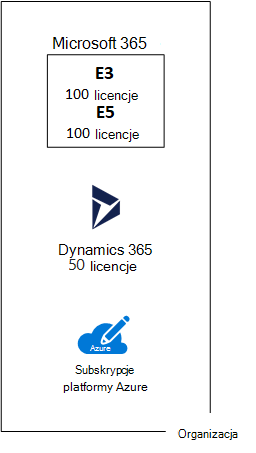

# Subskrypcje, licencje, konta i dzierżawy dla ofert firmy Microsoft w chmurze

Firma Microsoft udostępnia hierarchię organizacji, subskrypcji, licencji i kont użytkowników w celu spójnego korzystania z tożsamości i rozliczeń w ramach ofert w chmurze:
  
- Microsoft 365 i Microsoft Office 365
- Microsoft Azure
- Microsoft Dynamics 365

## Elementy hierarchii

Oto elementy hierarchii:
  
### Organizacji

Organizacja reprezentuje jednostkę biznesową korzystającą z ofert firmy Microsoft w chmurze, zwykle identyfikowaną przez co najmniej jedną nazwę domeny publicznego systemu nazw domen (DNS), taką jak contoso.com. Organizacja jest kontenerem dla subskrypcji.
  
### Subskrypcji

Subskrypcja to umowa z firmą Microsoft dotycząca korzystania z co najmniej jednej platformy lub usług w chmurze firmy Microsoft, dla których opłaty są naliczane na podstawie opłaty licencyjnej za użytkownika lub użycia zasobów w chmurze. 

- Oferty firmy Microsoft w chmurze oparte na oprogramowaniu jako usłudze (SaaS) (Microsoft 365 i Dynamics 365) pobierają opłaty licencyjne za użytkownika. 
- Opłaty za oferty platformy jako usługi (PaaS) i infrastruktury jako usługi (IaaS) firmy Microsoft w chmurze (Azure) są naliczane na podstawie zużycia zasobów w chmurze.
 
Możesz również użyć subskrypcji próbnej, ale subskrypcja wygasa po upływie określonego czasu lub opłat za użycie. Subskrypcję próbną można przekonwertować na subskrypcję płatną.
  
Organizacje mogą mieć wiele subskrypcji ofert firmy Microsoft w chmurze. Rysunek 1 przedstawia jedną organizację, która ma wiele subskrypcji Microsoft 365, subskrypcję usługi Dynamics 365 i wiele subskrypcji platformy Azure.

**Rysunek 1. Przykład wielu subskrypcji dla organizacji**

  
### Licencje

W przypadku ofert firmy Microsoft w chmurze SaaS licencja umożliwia określonemu kontu użytkownika korzystanie z usług oferty w chmurze. W ramach subskrypcji naliczona jest stała opłata miesięczna. Administratorzy przypisują licencje do poszczególnych kont użytkowników w subskrypcji. Na przykład na rysunku 2 firma Contoso Corporation ma subskrypcję Microsoft 365 E5 ze 100 licencjami, co umożliwia maksymalnie 100 indywidualnym kontom użytkowników korzystanie z Microsoft 365 E5 funkcji i usług.
  
**Rysunek 2. Licencje w ramach subskrypcji opartych na systemie SaaS dla organizacji**

>[!Note]
>Najlepszym rozwiązaniem w zakresie zabezpieczeń jest użycie oddzielnych kont użytkowników, do których przypisano określone role funkcji administracyjnych. Te dedykowane konta administratorów nie muszą mieć przypisanej licencji na usługi w chmurze, którymi zarządzają. Na przykład konto administratora SharePoint nie musi mieć przypisanej licencji Microsoft 365.
>

W przypadku usług w chmurze opartych na usłudze Azure PaaS licencje na oprogramowanie są wbudowane w cennik usługi.
  
W przypadku maszyn wirtualnych opartych na usłudze Azure IaaS mogą być wymagane dodatkowe licencje na korzystanie z oprogramowania lub aplikacji zainstalowanej na obrazie maszyny wirtualnej. Niektóre obrazy maszyn wirtualnych mają zainstalowane licencjonowane wersje oprogramowania, a koszt jest uwzględniany w stawce za minutę dla serwera. Przykłady to obrazy maszyn wirtualnych dla SQL Server 2014 i SQL Server 2016. 
  
Niektóre obrazy maszyn wirtualnych mają zainstalowane wersje próbne aplikacji i wymagają dodatkowych licencji aplikacji do użycia poza okresem próbnym. Na przykład obraz maszyny wirtualnej SharePoint Server 2016 Trial zawiera wstępnie zainstalowaną wersję próbną SharePoint Server 2016. Aby kontynuować korzystanie z programu SharePoint Server 2016 po dacie wygaśnięcia wersji próbnej, musisz kupić licencję SharePoint Server 2016 i licencje klienta od firmy Microsoft. Opłaty te są oddzielone od subskrypcji platformy Azure, a stawka za minutę uruchamiania maszyny wirtualnej nadal ma zastosowanie.
  
### Konta użytkowników

Konta użytkowników dla wszystkich ofert firmy Microsoft w chmurze są przechowywane w dzierżawie Azure Active Directory (Azure AD), która zawiera konta użytkowników i grupy. Dzierżawę usługi Azure AD można zsynchronizować z istniejącymi kontami Active Directory Domain Services (AD DS) przy użyciu usługi Azure AD Połączenie, Windows usługi opartej na serwerze. Jest to nazywane synchronizacją katalogów.
  
Rysunek 3 przedstawia przykład wielu subskrypcji organizacji korzystających ze wspólnej dzierżawy usługi Azure AD, która zawiera konta organizacji.
  
**Rysunek 3. Wiele subskrypcji organizacji korzystających z tej samej dzierżawy usługi Azure AD**

  
### Najemców

W przypadku ofert chmurowych SaaS dzierżawa to lokalizacja regionalna, w których znajdują się serwery świadczące usługi w chmurze. Na przykład firma Contoso Corporation wybrała region europejski do hostowania subskrypcji Microsoft 365, EMS i Dynamics 365 dla 15 000 pracowników w ich siedzibie w Paryżu.
  
Usługi Azure PaaS i obciążenia oparte na maszynach wirtualnych hostowane w usłudze Azure IaaS mogą mieć dzierżawę w dowolnym centrum danych platformy Azure na całym świecie. Centrum danych platformy Azure, znane jako lokalizacja, należy określić podczas tworzenia aplikacji lub usługi Azure PaaS lub elementu obciążenia IaaS.
  
Dzierżawa usługi Azure AD to określone wystąpienie usługi Azure AD zawierające konta i grupy. Płatne lub próbne subskrypcje Microsoft 365 lub Dynamics 365 obejmują bezpłatną dzierżawę usługi Azure AD. Ta dzierżawa usługi Azure AD nie obejmuje innych usług platformy Azure i nie jest taka sama jak wersja próbna platformy Azure lub płatna subskrypcja.
  
### Podsumowanie hierarchii

Oto krótkie podsumowanie:
  
- Organizacja może mieć wiele subskrypcji
    
  - Subskrypcja może mieć wiele licencji
    
  - Licencje można przypisać do poszczególnych kont użytkowników
    
  - Konta użytkowników są przechowywane w dzierżawie usługi Azure AD
    
Oto przykład relacji organizacji, subskrypcji, licencji i kont użytkowników:
  
- Organizacja zidentyfikowana przez nazwę domeny publicznej.
    
  - Subskrypcja Microsoft 365 E3 z licencjami użytkowników.
    
    Subskrypcja Microsoft 365 E5 z licencjami użytkowników.
    
    Subskrypcja usługi Dynamics 365 z licencjami użytkowników.
    
    Wiele subskrypcji platformy Azure.
    
  - Konta użytkowników organizacji w wspólnej dzierżawie usługi Azure AD.
    
Wiele subskrypcji ofert w chmurze firmy Microsoft może korzystać z tej samej dzierżawy usługi Azure AD, która działa jako typowy dostawca tożsamości. Centralna dzierżawa usługi Azure AD zawierająca zsynchronizowane konta lokalnych usług AD DS zapewnia usługę Identity as a Service (IDaaS) opartą na chmurze dla organizacji. 
  
**Rysunek 4. Zsynchronizowane konta lokalne i usługi IDaaS dla organizacji**

  
Rysunek 4 pokazuje, jak typowa dzierżawa usługi Azure AD jest używana przez oferty firmy Microsoft w chmurze SaaS, aplikacje PaaS platformy Azure i maszyny wirtualne w usłudze Azure IaaS korzystające z usług Azure AD Domain Services. Usługa Azure AD Połączenie synchronizuje lokalny las usług AD DS z dzierżawą usługi Azure AD.
  
## Łączenie subskrypcji dla wielu ofert firmy Microsoft w chmurze

W poniższej tabeli opisano sposób łączenia wielu ofert w chmurze firmy Microsoft w oparciu o subskrypcję dla jednego typu oferty w chmurze (etykiety przechodzące w dół pierwszej kolumny) i dodawania subskrypcji dla innej oferty w chmurze (przechodzącej przez kolumny).
  
||**Microsoft 365**|**Azure**|**Dynamics 365**|
|:-----|:-----|:-----|:-----|:-----|
|**Microsoft 365**   |NA    |Subskrypcję platformy Azure można dodać do swojej organizacji z Azure Portal.    |Subskrypcję usługi Dynamics 365 można dodać do swojej organizacji z poziomu Centrum administracyjne platformy Microsoft 365.    |
|**Azure**   |Dodasz subskrypcję Microsoft 365 do swojej organizacji.    |NA    |Dodasz subskrypcję usługi Dynamics 365 do swojej organizacji.    |
|**Dynamics 365**   |Dodasz subskrypcję Microsoft 365 do swojej organizacji.    |Subskrypcję platformy Azure można dodać do swojej organizacji z Azure Portal.    |NA    |
   
Łatwym sposobem dodawania subskrypcji do organizacji dla usług opartych na usłudze Microsoft SaaS jest użycie centrum administracyjnego:
  
1. Zaloguj się do Centrum administracyjne platformy Microsoft 365 ([https://admin.microsoft.com](https://admin.microsoft.com)) przy użyciu **konta administratora użytkownika** lub **administratora globalnego**.
    
2. Na lewym pasku nawigacyjnym strony głównej **Centrum administracyjnego** kliknij pozycję **Rozliczenia**, a następnie **pozycję Kup usługi**.
    
3. Na stronie **Zakup usług** kup nowe subskrypcje.
    
Centrum administracyjne przypisuje organizację i dzierżawę usługi Azure AD subskrypcji Microsoft 365 do nowych subskrypcji ofert chmurowych opartych na usłudze SaaS.
  
Aby dodać subskrypcję platformy Azure z tą samą organizacją i dzierżawą usługi Azure AD co subskrypcja Microsoft 365:
  
1. Zaloguj się do Azure Portal ([https://portal.azure.com](https://portal.azure.com)) przy użyciu Microsoft 365 **administratora kontrolera domeny usługi Azure AD** lub konta **administratora globalnego**.
    
2. W obszarze nawigacji po lewej stronie kliknij pozycję **Subskrypcje**, a następnie kliknij pozycję **Dodaj**.
    
3. Na stronie **Dodawanie subskrypcji** wybierz ofertę i uzupełnij informacje o płatności oraz umowę.
    
Jeśli subskrypcje platformy Azure i Microsoft 365 zostały zakupione oddzielnie i chcesz uzyskać dostęp do Microsoft 365 dzierżawy usługi Azure AD z subskrypcji platformy Azure, zapoznaj się z instrukcjami w temacie [Dodawanie istniejącej subskrypcji platformy Azure do dzierżawy Azure Active Directory](/azure/active-directory/fundamentals/active-directory-how-subscriptions-associated-directory).
 
## Zobacz też

[Ilustracje dotyczące chmury firmy Microsoft dla architektów przedsiębiorstw](../solutions/cloud-architecture-models.md)
  
[Modele architektoniczne dla programów SharePoint, Exchange, Skype dla firm i Lync](architectural-models-for-sharepoint-exchange-skype-for-business-and-lync.md)
  
[Rozwiązania hybrydowe](hybrid-solutions.md)

## Następny krok

[Ocena łączności sieciowej na platformie Microsoft 365](assessing-network-connectivity.md)
