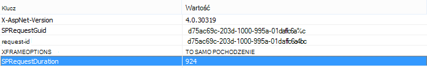

# Używanie składnika Web Part wyszukiwania zawartości zamiast składnika Web Part zapytania o zawartość w celu zwiększenia wydajności w SharePoint Online

W tym artykule opisano sposób zwiększania wydajności przez zastąpienie składnika Web Part kwerendy zawartości składnikiem Web Part wyszukiwania zawartości w SharePoint Server 2013 i SharePoint Online.
  
Jedną z najbardziej zaawansowanych nowych funkcji SharePoint Server 2013 i SharePoint Online jest składnik Web Part wyszukiwania zawartości (CSWP). Ten składnik Web Part używa indeksu wyszukiwania do szybkiego pobierania wyników, które są wyświetlane użytkownikowi. Użyj składnika Web Part wyszukiwania zawartości zamiast składnika Web Part zapytania o zawartość (CQWP) na stronach, aby zwiększyć wydajność użytkowników.
  
Użycie składnika Web Part wyszukiwania zawartości za pośrednictwem składnika Web Part zapytania o zawartość prawie zawsze spowoduje lepszą wydajność ładowania stron w SharePoint Online. Istnieje nieco dodatkowa konfiguracja umożliwiająca uzyskanie odpowiedniego zapytania, ale nagrody to lepsza wydajność i szczęśliwsi użytkownicy.
  
## Porównanie korzyści wydajności uzyskiwanych z używania składnika Web Part wyszukiwania zawartości zamiast składnika Web Part zapytania o zawartość

W poniższych przykładach przedstawiono względny wzrost wydajności, który może zostać wyświetlony podczas korzystania ze składnika Web Part wyszukiwania zawartości zamiast składnika Web Part zapytania o zawartość. Efekty są bardziej oczywiste w przypadku złożonej struktury witryny i zapytań o szeroką zawartość.
  
Ta przykładowa witryna ma następujące cechy:
  
- 8 poziomów podwitryn.
    
- Wyświetla listę przy użyciu niestandardowego typu zawartości "owocowej".
    
- W składniku Web Part zapytanie o zawartość jest szerokie i zwraca wszystkie elementy o typie zawartości "fruit".
    
- W przykładzie użyto tylko 50 elementów w 8 witrynach. Efekty będą jeszcze bardziej widoczne dla witryn z większą ilością zawartości.
    
Oto zrzut ekranu przedstawiający wyniki składnika Web Part zapytania o zawartość.
  

  
W programie Internet Explorer użyj karty **Sieć** narzędzi deweloperskich F12, aby zapoznać się ze szczegółami nagłówka odpowiedzi. Na poniższym zrzucie ekranu wartość **parametru SPRequestDuration** dla tego obciążenia strony wynosi 924 milisekundy. 
  

  
 **SpRequestDuration** wskazuje ilość pracy wykonanej na serwerze w celu przygotowania strony. Przełączanie zawartości według składników Web Part zapytań z zawartością według składników Web Part wyszukiwania znacznie skraca czas renderowania strony. Natomiast strona z równoważnym składnikiem Web Part wyszukiwania zawartości zwracająca taką samą liczbę wyników ma wartość **SPRequestDuration** wynoszącą 106 milisekund, jak pokazano na tym zrzucie ekranu: 
  

  
## Dodawanie składnika Web Part wyszukiwania zawartości w usłudze SharePoint Online

Dodawanie składnika Web Part wyszukiwania zawartości jest podobne do zwykłego składnika Web Part zapytania o zawartość. Zobacz *sekcję "Dodawanie składnika Web Part wyszukiwania zawartości"* w artykule [Konfigurowanie składnika Web Part wyszukiwania zawartości w SharePoint](https://support.office.com/article/Configure-a-Content-Search-Web-Part-in-SharePoint-0dc16de1-dbe4-462b-babb-bf8338c36c9a).
  
## Tworzenie odpowiedniego zapytania wyszukiwania dla składnika Web Part wyszukiwania zawartości

Po dodaniu składnika Web Part wyszukiwania zawartości możesz uściślić wyszukiwanie i zwrócić żądane elementy. Aby uzyskać szczegółowe instrukcje dotyczące tego sposobu, zobacz sekcję *"Wyświetlanie zawartości przez skonfigurowanie zaawansowanego zapytania w składniku Web Part wyszukiwania zawartości"* w [temacie Konfigurowanie składnika Web Part wyszukiwania zawartości w SharePoint](https://support.office.com/article/Configure-a-Content-Search-Web-Part-in-SharePoint-0dc16de1-dbe4-462b-babb-bf8338c36c9a).
  
## Narzędzie do tworzenia i testowania zapytań

Aby uzyskać narzędzie do tworzenia i testowania złożonych zapytań, zobacz [Narzędzie do wyszukiwania zapytań](https://github.com/pnp/PnP-Tools/tree/master/Solutions/SharePoint.Search.QueryTool#download-the-tool).
  

