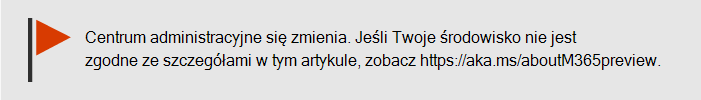
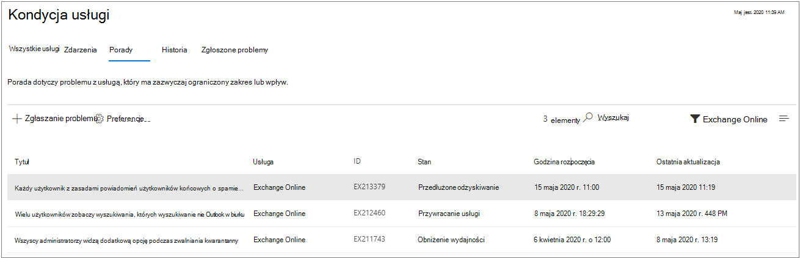

# Jak sprawdzić Microsoft 365 kondycji usługi

Kondycję swoich usług, takich usługi firmy Microsoft, Office w sieci Web, Yammer, Microsoft Dynamics CRM i zarządzanie urządzeniami przenośnymi,  [możesz wyświetlić na stronie Kondycja usługi w centrum administracyjne platformy Microsoft 365](https://go.microsoft.com/fwlink/p/?linkid=2024339). If you are experiencing problems with a cloud service, you can check the service health to determine whether this is a known issue with a resolution in progress before you call support or spend time troubleshooting.

Jeśli nie możesz zalogować się do centrum administracyjnego, możesz za pomocą strony stanu  usługi sprawdzić, czy nie ma znanych problemów uniemożliwiających zalogowanie się do dzierżawy.  Zarejestruj się, aby nas obserwować na [stronie @MSFT365status](https://twitter.com/MSFT365Status) w serwisie Twitter w celu zobaczenia informacji o określonych zdarzeniach.

## Jak sprawdzić kondycję usługi

1. Przejdź do centrum administracyjne platformy Microsoft 365 stronie [https://admin.microsoft.com](https://go.microsoft.com/fwlink/p/?linkid=2024339), a następnie zaloguj się przy użyciu konta administratora.

    > [!NOTE]
    > Kondycja usługi może być przeglądana przez osoby z przypisaną rolą administratora globalnego lub pomocy technicznej usługi. Aby umożliwić administratorom programu Exchange, programu SharePoint i programu Skype dla firm wyświetlanie kondycji usługi, należy do nich również przypisać rolę administratora usługi. Aby uzyskać więcej informacji o rolach, które mogą wyświetlać kondycję usługi, zobacz [Informacje o rolach administratorów](../admin/add-users/about-admin-roles.md?preserve-view=true&view=o365-worldwide#commonly-used-microsoft-365-admin-center-roles).

2. Aby wyświetlić kondycję usługi, w centrum administracyjnym przejdź do pozycji Kondycja  usługi **HealthService** >  lub wybierz kartę Kondycja usługi na głównym **pulpicie nawigacyjnym**. Karta pulpitu nawigacyjnego zawiera informacje o tym, czy występuje aktywny problem z usługą, oraz linki do strony ze **szczegółowymi informacjami na temat kondycji** usługi.

3. Na stronie **Kondycja** usługi stan kondycji każdej usługi w chmurze jest wyświetlany w formacie tabeli.

   

Karta **Wszystkie usługi** (widok domyślny) zawiera wszystkie usługi, ich bieżący stan kondycji oraz wszystkie aktywne zdarzenia i doradcy. Ikona i stan w kolumnie **Kondycja** wskazują stan każdej usługi.

W przypadku aktywnego zdarzenia lub porady dotyczącej usługi są one wymienione bezpośrednio pod nazwą usługi w tabeli zagnieżdżonych. Możesz zwinąć tabelę zagnieżdżoną, aby ukryć zdarzenia lub doradcy w tym widoku, klikając ikonę chevronu z lewej strony nazwy usługi.

Aby przefiltrować widok w celu wyświetlenia tylko wszystkich aktywnych zdarzeń, wybierz kartę Zdarzenia u góry strony. Wybranie karty **Doradcy** spowoduje wyświetlanie tylko aktywnych opublikowanych porad.

Karta **Historia** zawiera wszystkie zdarzenia i poradniki, które zostały rozwiązane w ciągu ostatnich siedmiu lub 30 dni.

Jeśli występuje problem z usługą Microsoft 365 i nie widzisz jej na stronie Kondycja usługi, poinformuj nas o tym, wybierając pozycję  Zgłoś problem i wypełniając krótki formularz. Przyjrzymy się powiązanym danych i raportom z innych organizacji, aby dowiedzieć się, jak powszechnie dotyczy to problemu i czy pochodzi on z naszej usługi. Jeśli tak, dodamy je jako nowe zdarzenie lub poradę na stronie Kondycja usługi,  gdzie można śledzić jego rozwiązanie. Na **stronie Zgłoszone problemy** będą wyświetlane wszystkie problemy zgłoszone przez dzierżawę z tego formularza oraz ich stan.

Aby dostosować widok usług, które są wyświetlane na pulpicie nawigacyjnym, wybierz pozycję **PreferencesCustom** >  view (Preferencje), a następnie wyczyść pola wyboru dla usług, które mają zostać odfiltrowane, z widoku pulpitu nawigacyjnego kondycji usługi. Upewnij się, że pole wyboru jest zaznaczone dla każdej usługi, którą chcesz monitorować.

Aby zarejestrować się w celu wysyłania wiadomości e-mail z powiadomieniami o nowych zdarzeniach mających wpływ na dzierżawę i zmianie stanu aktywnego zdarzenia,  >  wybierz pozycję **PreferencjePo poczty e-mail**, kliknij pozycję Wyślij powiadomienia poczty e-mail dotyczące poczty **e-mail**, a następnie określ:

- Maksymalnie dwa adresy e-mail.
- Czy chcesz otrzymywać powiadomienia o incydentach lub poradach
- Usługi, dla których chcesz uzyskać powiadomienie

Możesz również subskrybować powiadomienia e-mail dotyczące poszczególnych zdarzeń zamiast wszystkich zdarzeń usługi. W tym celu wybierz aktywny problem, dla którego chcesz otrzymywać aktualizacje z powiadomieniami e-mail, wybierz pozycję Zarządzaj powiadomieniami o **tym** problemie, a następnie określ:

- Maksymalnie dwa adresy e-mail.

> [!NOTE]
> Każdy administrator może mieć ustawione preferencje i dla każdego konta administratora jest ustawiony powyższy limit dwóch adresów e-mail.

> [!TIP]
> Kondycja usługi można [Administracja Microsoft 365](https://go.microsoft.com/fwlink/p/?linkid=627216) za pomocą aplikacji mobilnej, która jest doskonałym sposobem na pozostawanie na stanie bieżących informacji za pomocą powiadomień wypychanych.

### Wyświetlanie szczegółów opublikowanej kondycji usługi

W widoku **Wszystkie** usługi wybierz tytuł problemu, aby wyświetlić stronę ze szczegółami problemu, która zawiera więcej informacji o problemie, w tym kanał informacyjny wszystkich wiadomości opublikowanych podczas pracy nad rozwiązaniem.

W podsumowaniu porady lub zdarzenia podane są następujące informacje:

- **Tytuł** — podsumowanie problemu.
- **Identyfikator** — identyfikator numeryczny problemu.
- **Service** (Usługa) — nazwa usługi, na która ma wpływ ta usługa.
- **Ostatnia aktualizacja** — godzina ostatniej aktualizacji komunikatu o kondycji usługi.
- **Szacowany czas rozpoczęcia —** szacowany czas rozpoczęcia problemu.
- **Stan** — jaki wpływ na usługę ma ten problem.
- **Wpływ na** użytkownika — krótki opis wpływu tego problemu na użytkownika końcowego.
- **Wszystkie aktualizacje** — często publikujemy wiadomości z informacji o postępie jego realizacji w zakresie stosowania rozwiązania.

### Tłumaczenie szczegółów kondycji usługi

Używamy tłumaczenia maszynowego do automatycznego wyświetlania wiadomości w preferowanym języku. Aby [uzyskać więcej informacji na](lang-service-health.md) temat sposobu ustawienia języka, przeczytaj tłumaczenie językowe pulpitu nawigacyjnego kondycji usługi.

### Definicje

W większości przypadków usługi będą wyświetlane jako dobrej kondycji bez dodatkowych informacji. Bieżący problem z usługą, jest określony jako porada lub zdarzenie i jest wyświetlony jego bieżący stan.

> [!TIP]
> Zdarzenia planowanej konserwacji nie są wyświetlane na stronie Kondycja usługi. Możesz śledzić zdarzenia planowanej konserwacji, obserwując na bieżąco **Centrum wiadomości**. Za pomocą filtru wyświetl wiadomości z kategorii Planowanie na wypadek zmiany, aby dowiedzieć się, kiedy zmiana zostanie wprowadzona, jakie będą jej efekty i jak się do niej przygotować. Zobacz [Centrum wiadomości w Microsoft 365](https://support.office.com/article/38fb3333-bfcc-4340-a37b-deda509c2093), aby uzyskać więcej informacji.

### Zdarzenia i porady

| Ikona | Opis |
|:-----|:-----|
||Jeśli dla usługi jest wyświetlona porada, wiemy o problemie zakłócającym pracę niektórych użytkowników, ale usługa jest mimo to dostępna. W poradzie jest często podane obejście problemu. Problem może być sporadyczny lub mieć ograniczony zakres i wpływ na użytkowników.    |
||Jeśli dla usługi jest wyświetlone aktywne zdarzenie, występuje problem krytyczny i usługa lub główna funkcja usługi jest niedostępna. Na przykład użytkownicy mogą nie mieć możliwości wysyłania i odbierania wiadomości e-mail lub zalogowania się. Zdarzenia będą miały zauważalny wpływ na użytkowników. Gdy zdarzenie jest w toku, będziemy udostępniać aktualizacje dotyczące badania, podjętych prób złagodzenia wpływu i potwierdzenia rozwiązania na pulpicie nawigacyjnym kondycji usługi.    |

### Definicje stanów

| Stan | Definicja |
|:-----|:-----|
|**Badanie** | Wiemy o potencjalnym problemie i zbieramy dodatkowe informacje na temat bieżącej sytuacji i zakresu jej wpływu. |
|**Obniżenie wydajności usługi** | Potwierdziliśmy występowanie problemu, który może zakłócać korzystanie z usługi lub funkcji. Ten status może być wyświetlany, jeśli na przykład usługa działa wolniej niż zwykle, występują sporadyczne przerwy w świadczeniu usługi lub określona funkcja nie działa. |
|**Przerwa w świadczeniu usługi** | Ten status zostanie wyświetlony, jeśli ustalimy, że problem uniemożliwia użytkownikom uzyskanie dostępu do usługi. W tym przypadku problem jest istotny i może być spójnie odtworzony. |
|**Przywracanie usługi** | Przyczyna problemu została zidentyfikowana, wiemy, jaką akcję naprawczą należy podjąć, i jesteśmy w trakcie procesu przywracania stanu dobrej kondycji usługi. |
|**Przedłużone odzyskiwanie usługi** | Ten stan oznacza, że akcja naprawcza trwa, aby przywrócić usługę dla większości użytkowników, ale usunięcie problemu względem wszystkich systemów zajmie trochę czasu. Ten stan może być również widoczny, jeśli wprowadziliśmy tymczasową poprawkę w celu zmniejszenia wpływu, gdy czekamy na zastosowanie trwałej poprawki. |
|**Wstrzymano badanie problemu** | Ten stan zostanie wyświetlony, jeśli wynikiem naszego szczegółowego badania potencjalnego problemu jest prośba o dodatkowe informacje od klientów, aby można było przeprowadzić dalsze badania. Jeśli konieczne jest działanie z Twojej strony, powiadomimy Cię, jakie dane lub dzienniki są nam potrzebne. |
|**Usługa została przywrócona** | Potwierdziliśmy, że akcja naprawcza rozwiązała podstawowy problem i przywrócono stan dobrej kondycji usługi. Aby dowiedzieć się, na czym polegał problem, wyświetl szczegóły problemu. |
|**Wynik fałszywie dodatni** | Po szczegółowym analizie potwierdziliśmy, że usługa jest w dobrej kondycji i działa zgodnie z zamysłem. Nie zaobserwowano żadnego wpływu na usługę ani przyczyna zdarzenia pochodziła poza usługę. Zdarzenia i doradcy dotyczące tego stanu są wyświetlane w widoku historii do momentu ich wygaśnięcia (po upływie okresu podanego w końcowym wpisie dla tego wydarzenia). |
|**Opublikowano raport po zdarzeniu** | Opublikowaliśmy raport po zdarzeniu, który zawiera informacje o głównych przyczynach, i kolejne kroki w celu zapewnienia, że podobny problem nie wystąpi ponownie. |

### Typy wpisów wiadomości

| Wpisać | Definicja |
|:-----|:-----|
|**Szybka aktualizacja** | Krótkie i częste aktualizacje przyrostowe dotyczące bardzo wywłaszanych zdarzeń, dostępne dla wszystkich klientów. |
|**Dodatkowe szczegóły** | Te dodatkowe wpisy będą dostarczać bardziej rozbudowane szczegóły techniczne i dotyczące rozwiązywania problemów, co zapewni im bardziej szczegółowe informacje na temat postępowania z incydentami. Jest to dostępne dla dzierżaw, które spełniają te same wymagania opisane Exchange Online [monitorowanie](/microsoft-365/enterprise/microsoft-365-exchange-monitoring#requirements) |

### Historia

Kondycja usługi umożliwia wyświetlenie bieżącego stanu kondycji i wyświetlenie historii wszystkich porad i zdarzeń, które wpłynęły na dzierżawę w ciągu ostatnich 30 dni. Aby wyświetlić historię kondycji wszystkich usług, wybierz **pozycję Widok** historii.

Aby uzyskać więcej informacji na temat naszego zaangażowania w działanie bezadysownego działania, zobacz [Transparentne działania Microsoft 365](/office365/servicedescriptions/office-365-platform-service-description/service-health-and-continuity).

## Tematy pokrewne

- [Raporty aktywności w centrum administracyjne platformy Microsoft 365](https://support.office.com/article/0d6dfb17-8582-4172-a9a9-aed798150263)
- [Preferencje centrum wiadomości](../admin/manage/message-center.md?preserve-view=true&view=o365-worldwide#preferences)
- [Jak sprawdzić kondycję Windows wersji w centrum administracyjnym](/windows/deployment/update/check-release-health)
