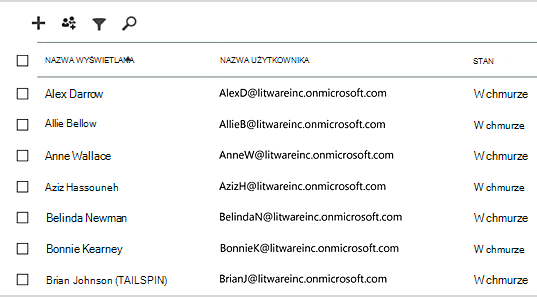
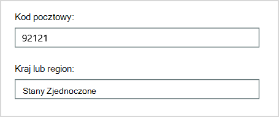
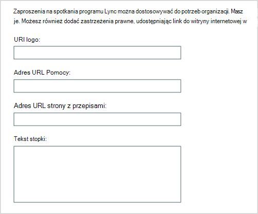
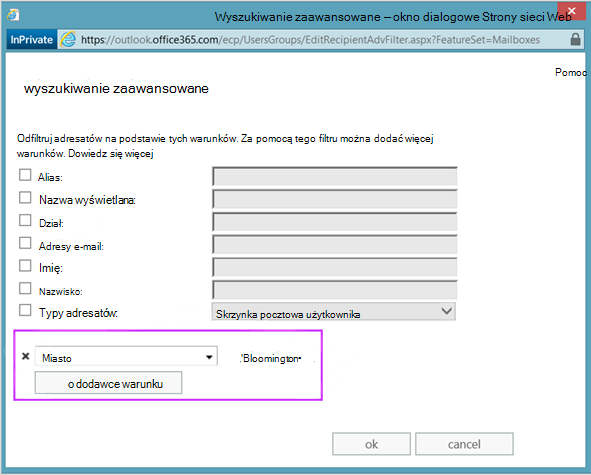
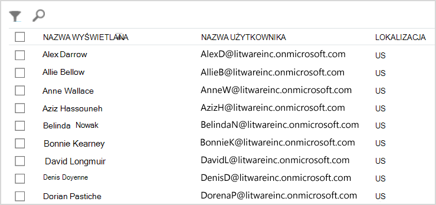
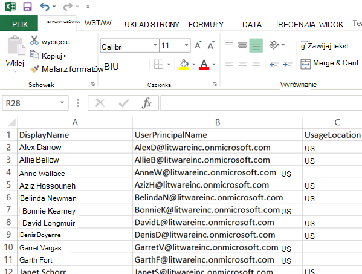

# <a name="why-you-need-to-use-powershell-for-microsoft-365"></a>Dlaczego należy używać programu PowerShell dla Microsoft 365

*Ten artykuł dotyczy zarówno Microsoft 365 Enterprise, jak i Office 365 Enterprise.*

Za pomocą centrum administracyjne platformy Microsoft 365 możesz zarządzać swoimi kontami Microsoft 365 użytkownikami i licencjami. Możesz również zarządzać swoimi Microsoft 365, takimi jak Exchange Online, Teams i SharePoint Online. Jeśli do zarządzania tymi usługami używasz programu PowerShell, możesz korzystać ze środowiska języka wiersza polecenia i skryptów w celu szybkiego, automatyzacji i dodatkowych możliwości.

W tym artykule pokazano, jak za pomocą programu PowerShell zarządzać Microsoft 365 do:

- Wyświetlanie dodatkowych informacji, których nie widać w centrum administracyjne platformy Microsoft 365

- Konfigurowanie funkcji i ustawień możliwe tylko w programie PowerShell

- Operacje zbiorcze

- Filtrowanie danych

- Drukowanie lub zapisywanie danych

- Zarządzanie wszystkimi usługami

Pamiętaj, że program PowerShell dla programu Microsoft 365 to zestaw modułów dla programu Windows PowerShell, który jest środowiskiem wiersza polecenia dla Windows usług i platform opartych na wierszach polecenia. To środowisko tworzy język powłoki polecenia, który można rozszerzyć o dodatkowe moduły. Umożliwia wykonywanie prostych lub złożonych poleceń oraz skryptów. Na przykład po zainstalowaniu programu PowerShell dla programu Microsoft 365 i nawiązania połączenia z subskrypcją programu Microsoft 365 można uruchomić następujące polecenie, aby wyświetlić listę wszystkich skrzynek pocztowych użytkowników dla Microsoft Exchange Online:

```powershell
Get-Mailbox
```

Możesz również uzyskać listę skrzynek pocztowych przy użyciu narzędzia centrum administracyjne platformy Microsoft 365 ale zliczanie elementów na wszystkich listach dla wszystkich witryn wszystkich aplikacji sieci Web nie jest łatwe.

Program PowerShell dla Microsoft 365 ma na celu pomoc w zarządzaniu Microsoft 365, a nie zastępowanie centrum administracyjne platformy Microsoft 365. Administratorzy muszą mieć możliwość korzystania z programu PowerShell dla systemu Microsoft 365 ponieważ istnieje kilka procedur konfiguracji, które można wykonać tylko za pomocą programu PowerShell w celu Microsoft 365 poleceń. W takich przypadkach musisz wiedzieć, jak to zrobić:

- Instalowanie programu PowerShell dla Microsoft 365 (wykonywane tylko raz dla każdego komputera administratora).

- Połączenie subskrypcji Microsoft 365 (jedna dla każdej sesji programu PowerShell).

- Zbierz informacje potrzebne do uruchomienia programu PowerShell wymaganego do Microsoft 365 poleceń.

- Uruchom program PowerShell, aby Microsoft 365 polecenia.

Gdy nauczysz się korzystać z tych podstawowych umiejętności, nie musisz po liście użytkowników skrzynek pocztowych używać polecenia **Get-Mailbox** . Nie musisz również zrozumieć, jak utworzyć nowe polecenie, takie jak poprzednio cytowane polecenie, aby zliczyć wszystkie elementy na wszystkich listach we wszystkich witrynach wszystkich aplikacji sieci Web. Firma Microsoft i społeczność administratorów mogą w razie potrzeby ułatwić wykonywanie takich zadań.

## <a name="powershell-for-microsoft-365-can-reveal-information-that-you-cant-see-with-the-microsoft-365-admin-center"></a>Program PowerShell dla Microsoft 365 może ujawniać informacje, których nie widać w centrum administracyjne platformy Microsoft 365

Wyświetlany centrum administracyjne platformy Microsoft 365 wiele przydatnych informacji. Nie są jednak wyświetlane wszystkie możliwe informacje Microsoft 365 dotyczące użytkowników, licencji, skrzynek pocztowych i witryn. Oto przykład dla użytkowników *i grup w* centrum administracyjne platformy Microsoft 365:



Ten widok zawiera informacje, których potrzebujesz w wielu przypadkach. Jednak w innych momentach jest ich więcej. Na przykład Microsoft 365 licencji (a Microsoft 365 funkcje dostępne dla użytkownika) zależą w części od lokalizacji geograficznej użytkownika. Zasady i funkcje, które można rozszerzyć na użytkowników w Stanach Zjednoczonych, mogą być inne niż te, które można rozszerzyć na użytkowników w Indiach lub w Belgia. Aby określić lokalizację geograficzną centrum administracyjne platformy Microsoft 365 wykonaj poniższe czynności w centrum administracyjne platformy Microsoft 365 lokalizacji geograficznej użytkownika:

1. Kliknij dwukrotnie nazwę **wyświetlaną użytkownika**.

2. W okienku wyświetlania właściwości użytkownika wybierz pozycję **szczegóły**.

3. W wyświetlanym szczegółów wybierz **dodatkowe szczegóły**.

4. Przewijaj w dół, aż znajdziesz nagłówek **Kraj lub region**:

     

5. Wpisz nazwę wyświetlaną i lokalizację użytkownika na kartce papieru lub skopiuj i wklej go do Notatnik.

Tę procedurę należy powtórzyć dla każdego użytkownika. Jeśli masz wielu użytkowników, ten proces może być pracochłonny. W programie PowerShell Microsoft 365 dla komputerów z siecią możesz wyświetlić te informacje dla wszystkich użytkowników, używając następującego polecenia:

```powershell
Get-AzureADUser | Select DisplayName, UsageLocation
```


>[!Note]
>Program PowerShell Core nie obsługuje modułu Microsoft Azure Active Directory dla programu Windows PowerShell i poleceń cmdlet, których *nazwa zawiera Msol*. Musisz uruchomić te polecenia cmdlet z Windows PowerShell.
>

Oto przykładowe wyniki:

```powershell
DisplayName                               UsageLocation
-----------                               -------------
Bonnie Kearney                            GB
Fabrice Canel                             BR
Brian Johnson (TAILSPIN)                  US
Anne Wallace                              US
Alex Darrow                               US
David Longmuir                            BR
```

Interpretacja tego polecenia programu PowerShell to: Pobierz wszystkich użytkowników w bieżącej subskrypcji programu Microsoft 365 (**Get-AzureADUser**), ale wyświetlaj tylko nazwę i lokalizację dla każdego użytkownika (Wybierz nazwę wyświetlaną **, Lokalizacja** użytkowania).

Ponieważ program PowerShell Microsoft 365 obsługuje język powłoki poleceń, można dodatkowo modyfikować informacje uzyskane za pomocą polecenia **Get-AzureADUser**. Na przykład możesz chcieć posortować tych użytkowników według ich lokalizacji, zgrupować wszystkich użytkowników brazylijskich, wszystkich użytkowników w Stanach Zjednoczonych i tak dalej. Oto polecenie:

```powershell
Get-AzureADUser | Select DisplayName, UsageLocation | Sort UsageLocation, DisplayName
```

Oto przykładowe wyniki:

```powershell
DisplayName                                 UsageLocation
-----------                                 -------------
David Longmuir                              BR
Fabrice Canel                               BR
Bonnie Kearney                              GB
Alex Darrow                                 US
Anne Wallace                                US
Brian Johnson (TAILSPIN)                    US
```

Interpretacja tego polecenia programu PowerShell to: Pobierz wszystkich użytkowników w bieżącej subskrypcji programu Microsoft 365, ale wyświetlaj tylko nazwę i lokalizację każdego użytkownika, a następnie najpierw sortuj ich według lokalizacji, a następnie nazwy (Lokalizacja sortowania użycia **, Nazwa wyświetlana**).

Możesz również użyć dodatkowego filtrowania. Jeśli na przykład chcesz wyświetlić informacje o użytkownikach w Brazylii, użyj tego polecenia:

```powershell
Get-AzureADUser | Where {$_.UsageLocation -eq "BR"} | Select DisplayName, UsageLocation
```

Oto przykładowe wyniki:

```powershell
DisplayName                                           UsageLocation
-----------                                           -------------
David Longmuir                                        BR
Fabrice Canel                                         BR
```

Interpretacja tego polecenia programu PowerShell to: Pobierz wszystkich użytkowników w bieżącej subskrypcji usługi Microsoft 365, których lokalizacja to Brazylia (**Where {$\_). UsageLocation -eq "BR"}**), a następnie wyświetl nazwę i lokalizację dla każdego użytkownika.

 **Uwaga na temat dużych domen**

Jeśli masz dużą domenę z dziesiątkami tysięcy użytkowników, wypróbowanie niektórych przykładów z tego artykułu może prowadzić do ograniczania. W oparciu o czynniki, takie jak obliczanie zasilania i dostępna przepustowość sieci, możesz próbować zrobić za dużo jednocześnie. Duże organizacje mogą podzielić niektóre z tych operacji programu PowerShell na dwa polecenia.

Na przykład następujące polecenie zwraca wszystkie konta użytkowników oraz pokazuje nazwę i lokalizację dla każdego z nich:

```powershell
Get-AzureADUser | Select DisplayName, UsageLocation
```

Sprawdza się to najlepiej w przypadku mniejszych domen. Jednak w dużej organizacji można podzielić operację na dwa polecenia: jedno do przechowywania informacji o koncie użytkownika w zmiennej, a drugie do wyświetlania potrzebnych informacji. Oto przykład:

```powershell
$x = Get-AzureADUser
$x | Select DisplayName, UsageLocation
```

Interpretacja tego zestawu poleceń programu PowerShell jest taka:
1. Uzyskaj wszystkich użytkowników w bieżącej subskrypcji usługi Microsoft 365 i przechowuj informacje w zmiennej o nazwie $x (**$x = Get-AzureADUser**).
1.  Wyświetlanie zawartości zmiennej w *$x*, ale uwzględnia tylko nazwę i lokalizację każdego użytkownika (**$x | Wybierz pozycję DisplayName, UsageLocation**).

## <a name="microsoft-365-has-features-that-you-can-only-configure-with-powershell-for-microsoft-365"></a>Microsoft 365 funkcje, które można konfigurować tylko za pomocą programu PowerShell dla Microsoft 365

Celem centrum administracyjne platformy Microsoft 365 dostępu do typowych, przydatnych zadań administracyjnych wykonywanych w większości środowisk. Innymi słowy typowa centrum administracyjne platformy Microsoft 365 została zaprojektowana tak, aby typowy administrator mógł wykonywać najczęściej wykonywane zadania zarządzania. Są jednak zadania, których nie można wykonać w centrum administracyjnym.

Na przykład centrum administracyjne usługi Skype dla firm Online udostępnia kilka opcji tworzenia niestandardowych zaproszeń na spotkania:



Za pomocą tych ustawień możesz dodać do zaproszeń na spotkania odrobinę personalizacji i profesjonalności. Ustawienia konfiguracji spotkania to jednak nie wszystko niż tylko tworzenie niestandardowych zaproszeń na spotkania. Na przykład spotkania umożliwiają:

- Użytkownicy anonimowi mogą automatycznie uzyskać dostęp do poszczególnych spotkań.

- Uczestnicy mogą nagrać spotkanie.

- Wszyscy użytkownicy z Twojej organizacji, którzy dołączają do spotkania, mogą zostać wyznaczeni na osoby prezenterów.

Te ustawienia nie są dostępne w centrum administracyjnym usługi Skype dla firm Online. Można je kontrolować w programie PowerShell dla Microsoft 365. Oto polecenie, które wyłącza te trzy ustawienia:

```powershell
Set-CsMeetingConfiguration -AdmitAnonymousUsersByDefault $False -AllowConferenceRecording $False -DesignateAsPresenter "None"
```

> [!NOTE]
> Aby uruchomić to polecenie, musisz zainstalować moduł [Skype dla firm PowerShell online](https://www.microsoft.com/download/details.aspx?id=39366).

Interpretacja tego polecenia programu PowerShell jest taka:

1. W ustawieniach nowych spotkań usługi Skype dla firm Online (**Set-CsMeetingConfiguration**) wyłącz zezwolenie użytkownikom anonimowym na automatyczne dostęp do spotkań (**-AdmitAnonymousUsersByDefault $False**).
2.  Wyłącz możliwość nagrywania spotkań przez uczestników (**-AllowConferenceRecording $False**).
3. Nie należy wyznaczać wszystkich użytkowników z organizacji na osoby prezenterów (**-DesignateAsPresenter "None"**).

Aby przywrócić te ustawienia domyślne (włączyć opcje), uruchom następujące polecenie:

```powershell
Set-CsMeetingConfiguration -AdmitAnonymousUsersByDefault $True -AllowConferenceRecording $True -DesignateAsPresenter "Company"
```

Istnieją również inne podobne scenariusze, dlatego administratorzy powinni wiedzieć, jak uruchamiać program PowerShell Microsoft 365 polecenia.

## <a name="powershell-for-microsoft-365-is-great-for-bulk-operations"></a>Program PowerShell dla Microsoft 365 świetnie się do operacji zbiorczych

Interfejsy wizualne, takie centrum administracyjne platformy Microsoft 365 są najcenniejsze, gdy masz do wykonać jedną operację. Jeśli na przykład chcesz wyłączyć jedno konto użytkownika, możesz użyć centrum administracyjnego, aby szybko zlokalizować i wyczyścić pole wyboru. Może to być łatwiejsze niż wykonanie podobnej operacji w programie PowerShell.

Jeśli jednak musisz zmienić wiele rzeczy lub niektóre zaznaczone elementy w dużym zestawie innych rzeczy, centrum administracyjne platformy Microsoft 365 może nie być najlepszym narzędziem. Załóżmy na przykład, że trzeba zmienić prefiks tysięcy numerów telefonów lub usunąć określonego użytkownika *Ken Myer* ze wszystkich witryn SharePoint Online. Jak można to zrobić w centrum administracyjne platformy Microsoft 365?

W ostatnim przykładzie załóżmy, że masz kilkaset SharePoint witryn online i nie wiesz, do których z nich należy M. W przypadku każdej witryny należy zacząć od centrum administracyjne platformy Microsoft 365, a następnie wykonać tę procedurę:

1. Wybierz **adres URL** witryny.

2. W **polu właściwości zbioru witryn** wybierz link Adres witryny sieci **Web** , aby otworzyć witrynę.

3. W witrynie wybierz pozycję **Udostępnij**.

4. W **oknie** dialogowym Udostępnianie wybierz link, który wyświetla wszystkich użytkowników z uprawnieniami do witryny:

     

5. W **oknie dialogowym Udostępnione** dla wybierz pozycję **Zaawansowane**.

6. Przewiń w dół listę użytkowników, znajdź i wybierz pozycję Ken Myer (zakładając, że ma uprawnienia do witryny), a następnie wybierz **pozycję Usuń uprawnienia użytkowników**.

W przypadku *kilkuset* witryn może to zająć dużo czasu.

Alternatywą jest uruchomienie w programie PowerShell dla programu Microsoft 365 następującego polecenia w celu usunięcia użytkownika Ken Myer ze wszystkich witryn:

```powershell
Get-SPOSite | ForEach {Remove-SPOUser -Site $_.Url -LoginName "kenmyer@litwareinc.com"}
```

> [!NOTE]
> To polecenie wymaga zainstalowania modułu [SharePoint Online PowerShell](/powershell/sharepoint/sharepoint-online/connect-sharepoint-online).

Interpretacja tego polecenia programu PowerShell jest taka: Pobierz wszystkie witryny programu SharePoint w bieżącej subskrypcji programu Microsoft 365 (**Get-SPOSite**) i usuń z listy użytkowników, którzy mogą uzyskać do niego dostęp dla każdej witryny (**ForEach {Remove-SPOUser -Site $\_). Url -LoginName "kenmyer\@ litwareinc.com"}**).

Mówimy Microsoft 365, aby usunąć Kena  Niego z każdej witryny, łącznie z tymi, do których ten nie ma dostępu. W wynikach będą więc wyświetlane błędy dla tych witryn, do których nie ma dostępu. Możemy użyć dodatkowego warunku dla tego polecenia, aby usunąć Kena  Niego tylko z witryn, które mają go na swojej liście logowania. Zwracane błędy nie są jednak szkodliwe dla samych witryn. To polecenie może potrwać kilka minut w przypadku setek witryn, a nie godzin pracy nad centrum administracyjne platformy Microsoft 365.

Oto kolejny przykład operacji zbiorczej. Użyj tego polecenia, aby *dodać Bonnie Kearney*, nowego SharePoint administratora witryny, do wszystkich witryn w organizacji:

```powershell
Get-SPOSite | ForEach {Add-SPOUser -Site $_.Url -LoginName "bkearney@litwareinc.com" -Group "Members"}
```

Interpretacja tego polecenia programu PowerShell jest taka: Pobierz wszystkie witryny programu SharePoint w bieżącej subskrypcji programu Microsoft 365 i dla każdej witryny zezwalają Bonnie Kearney na dostęp, dodając jej nazwę logowania do grupy Członkowie witryny (**ForEach {Add-SPOUser -Site $\_). Url -LoginName "bkearney\@ litwareinc.com" -Group "Members"}**).

## <a name="powershell-for-microsoft-365-is-great-at-filtering-data"></a>Program PowerShell dla Microsoft 365 świetnie się podczas filtrowania danych

Ten centrum administracyjne platformy Microsoft 365 udostępnia kilka sposobów filtrowania danych w celu łatwego znajdowania kierowanego podzbioru informacji. Na przykład Exchange ułatwia filtrowanie według wszelkiej właściwości skrzynki pocztowej użytkownika. Oto przykładowa lista skrzynek pocztowych dla wszystkich użytkowników zamieszkałych w mieście Bloomington:



Centrum <a href="https://go.microsoft.com/fwlink/p/?linkid=2059104" target="_blank">Exchange umożliwia</a> również łączenie kryteriów filtrowania. Skrzynki pocztowe można na przykład znaleźć dla wszystkich osób, które mieszkają w Bloomington i pracują w dziale finansów.

Istnieją jednak ograniczenia dotyczące tego, co można robić w centrum Exchange administracyjnego. Nie możesz na przykład tak łatwo znaleźć skrzynek pocztowych osób, które mieszkają w *Bloomington lub* SanIngton, albo skrzynek pocztowych dla wszystkich osób, które nie mieszkają w Bloomington.

Za pomocą następującego polecenia programu PowerShell Microsoft 365 listę skrzynek pocztowych dla wszystkich osób zamieszkałych w Bloomington lub SanAndo:

```powershell
Get-User | Where {$_.RecipientTypeDetails -eq "UserMailbox" -and ($_.City -eq "San Diego" -or $_.City -eq "Bloomington")} | Select DisplayName, City
```

Oto przykładowe wyniki:

```powershell
DisplayName                              City
-----------                              ----
Alex Darrow                              San Diego
Bonnie Kearney                           San Diego
Julian Isla                              Bloomington
Rob Young                                Bloomington
```

Interpretacja tego polecenia programu PowerShell to: Pobierz wszystkich użytkowników bieżącej subskrypcji programu Microsoft 365, którzy mają skrzynkę pocztową na mieście SanAndo lub Bloomington (**Where {$\_). RecipientTypeDetails -eq "UserMailbox" -and ($\_. City -eq "San Warszawa" -or $\_. City -eq "Bloomington")}**), a następnie wyświetl nazwę i miasto dla każdego z nich (**Wybierz DisplayName, City**).

A oto polecenie, aby wyświetlić listę wszystkich skrzynek pocztowych dla osób, które mieszkają w dowolnym miejscu z wyjątkiem Bloomington:

```powershell
Get-User | Where {$_.RecipientTypeDetails -eq "UserMailbox" -and $_.City -ne "Bloomington"} | Select DisplayName, City
```

Oto przykładowe wyniki:

```powershell
DisplayName                               City
-----------                               ----
MOD Administrator                         Redmond
Alex Darrow                               San Diego
Allie Bellew                              Bellevue
Anne Wallace                              Louisville
Aziz Hassouneh                            Cairo
Belinda Newman                            Charlotte
Bonnie Kearney                            San Diego
David Longmuir                            Waukesha
Denis Dehenne                             Birmingham
Garret Vargas                             Seattle
Garth Fort                                Tulsa
Janet Schorr                              Bellevue
```

Interpretacja tego polecenia programu PowerShell to: Pobierz wszystkich użytkowników bieżącej subskrypcji usługi Microsoft 365, którzy mają skrzynkę pocztową, która nie znajduje się w mieście Bloomington (**Where {$\_). RecipientTypeDetails -eq "UserMailbox" -and $\_. City -ne "Bloomington"}**), a następnie wyświetl nazwę i miasto każdego z nich.

### <a name="use-wildcards"></a>Używanie symboli wieloznacznych

W filtrach programu PowerShell można także używać symboli wieloznacznych w celu dopasowania części nazwy. Załóżmy na przykład, że szukasz konta użytkownika. Pamiętasz tylko, że nazwisko użytkownika to *Anderson* , a może *Henderson* lub *Jorgenson*.

Możesz wyszukać tego użytkownika w centrum administracyjne platformy Microsoft 365 za pomocą narzędzia wyszukiwania i przeprowadzać trzy różne wyszukiwania:

- One dla  *Anderson*

- Jedna dla  *Hendersona*

- Jeden dla  *Jorgensona*

Ponieważ wszystkie te imiona i nazwiska kończą się na "syn", można powiedzieć programowi PowerShell, aby wyświetlał wszystkich użytkowników, których imię i nazwisko kończy się "syn". Oto polecenie:

```powershell
Get-User -Filter '{LastName -like "*son"}'
```

Interpretacja tego polecenia programu PowerShell to: Pobierz wszystkich użytkowników w bieżącej subskrypcji programu Microsoft 365, ale użyj filtru, który tylko wyświetla listę użytkowników, których nazwiska kończą się na "syn" (**-Filter '{LastName -like "\*son"}'**). Oznacza \* każdy zestaw znaków, czyli litery w nazwisku użytkownika.

## <a name="powershell-for-microsoft-365-makes-it-easy-to-print-or-save-data"></a>Program PowerShell Microsoft 365 ułatwia drukowanie lub zapisywanie danych

Lista centrum administracyjne platformy Microsoft 365 umożliwia wyświetlanie list danych. Oto przykład centrum administracyjnego usługi Skype dla firm Online z listą użytkowników, dla których włączono usługę Skype dla firm Online:



Aby zapisać te informacje w pliku, musisz wkleić je do dokumentu Microsoft Excel arkusza. W obu przypadkach może być wymagane dodatkowe formatowanie. Ponadto centrum administracyjne platformy Microsoft 365 nie umożliwia bezpośredniego drukowania wyświetlanej listy.

Na szczęście za pomocą programu PowerShell można nie tylko wyświetlić listę, ale także zapisać ją w pliku, który można łatwo zaimportować do Excel. Oto przykładowe polecenie zapisywania danych użytkownika usługi Skype dla firm Online w pliku wartości rozdzielanych przecinkami (CSV), który można następnie łatwo zaimportować jako tabelę w arkuszu Excel danych:

```powershell
Get-CsOnlineUser | Select DisplayName, UserPrincipalName, UsageLocation | Export-Csv -Path "C:\Logs\SfBUsers.csv" -NoTypeInformation
```

Oto przykładowe wyniki:



Interpretacja tego polecenia programu PowerShell to: Pobierz wszystkich użytkowników usługi Skype dla firm Online w bieżącej subskrypcji usługi Microsoft 365 (**Get-CsOnlineUser**), uzyskaj tylko nazwę użytkownika, nazwę UPN i lokalizację (wybierz pozycję Nazwa wyświetlana **, UserPrincipalName, UsageLocation**), a następnie zapisz te informacje w pliku CSV o nazwie C:\\Logs\\SfBUsers.csv (**Export-Csv -Path "C:\\Logs\\SfBUsers.csv" -NoTypeInformation**).

Możesz również użyć opcji, aby zapisać tę listę jako plik XML lub jako stronę HTML. Dzięki dodatkowym poleceniam programu PowerShell można zapisać go bezpośrednio jako plik Excel z dowolnym formatowaniem niestandardowym.

Możesz również wysłać dane wyjściowe polecenia programu PowerShell, które wyświetla listę bezpośrednio do drukarki domyślnej w programie Windows. Oto przykładowe polecenie:

```powershell
Get-CsOnlineUser | Select DisplayName, UserPrincipalName, UsageLocation | Out-Printer
```

Oto jak będzie wyglądał wydrukowany dokument:


Interpretacja tego polecenia programu PowerShell to: Pobierz wszystkich użytkowników usługi Skype dla firm Online w bieżącej subskrypcji programu Microsoft 365, uzyskaj tylko nazwę użytkownika, nazwę upn i lokalizację, a następnie wyślij te informacje do domyślnej drukarki Windows (**Out-Printer**).

Wydrukowany dokument ma takie samo proste formatowanie jak format wyświetlany w oknie poleceń programu PowerShell. Aby uzyskać kopię, po **prostu dodaj | Out-Printer** to the end of the command.

## <a name="powershell-for-microsoft-365-lets-you-manage-across-server-products"></a>Program PowerShell dla Microsoft 365 umożliwia zarządzanie produktami na różnych serwerach

Składniki, które się Microsoft 365, są zaprojektowane do współpracy. Załóżmy na przykład, że dodasz nowego użytkownika do Microsoft 365 i określisz takie informacje jak dział i numer telefonu użytkownika. Te informacje będą następnie dostępne, jeśli uzyskujesz dostęp do informacji użytkownika w dowolnej z usług firmy Microsoft 365: Skype dla firm Online, Exchange lub SharePoint.

Jednak są to typowe informacje obejmujące pakiet produktów. Informacje dotyczące produktu, takie jak informacje o skrzynce Exchange pocztowej użytkownika, nie są zazwyczaj dostępne w całym pakiecie. Na przykład informacje o tym, czy skrzynka pocztowa użytkownika jest włączona, czy nie, jest dostępna tylko w centrum Exchange administracyjnego.

Załóżmy, że chcesz zrobić raport, który zawiera następujące informacje dla wszystkich użytkowników:

- Nazwa wyświetlana użytkownika

- Czy użytkownik ma licencję na Microsoft 365

- Czy skrzynka pocztowa Exchange została włączona

- Czy dla użytkownika włączono usługę Skype dla firm Online

W takim przypadku nie można łatwo utworzyć takiego raportu w centrum administracyjne platformy Microsoft 365. Zamiast tego należy utworzyć osobny dokument do przechowywania informacji, na przykład arkusz Excel arkusza. Następnie uzyskaj wszystkie nazwy użytkowników i informacje o licencjonowaniu z usługi centrum administracyjne platformy Microsoft 365, uzyskaj informacje o skrzynce pocztowej z centrum <a href="https://go.microsoft.com/fwlink/p/?linkid=2059104" target="_blank">administracyjnego programu Exchange</a>, uzyskaj dostęp do informacji usługi Skype dla firm Online z centrum Skype dla firm  Centrum administracyjne online, a następnie połącz te informacje.

Alternatywą jest skompilowanie raportu za pomocą skryptu programu PowerShell.

Poniższy przykładowy skrypt jest bardziej skomplikowany niż polecenia widoczne do tej pory w tym artykule. Pokazuje jednak możliwość używania programu PowerShell do tworzenia widoków informacji, które trudno uzyskać w inny sposób. Oto skrypt do kompilowania i wyświetlania potrzebnej listy:

```powershell
$x = Get-AzureADUser

foreach ($i in $x)
    {
      $y = Get-Mailbox -Identity $i.UserPrincipalName
      $i | Add-Member -MemberType NoteProperty -Name IsMailboxEnabled -Value $y.IsMailboxEnabled

      $y = Get-CsOnlineUser -Identity $i.UserPrincipalName
      $i | Add-Member -MemberType NoteProperty -Name EnabledForSfB -Value $y.Enabled
    }

$x | Select DisplayName, IsLicensed, IsMailboxEnabled, EnabledforSfB
```

Oto przykładowe wyniki:

```powershell
DisplayName             IsLicensed   IsMailboxEnabled   EnabledForSfB
-----------             ----------   ----------------   --------------
Bonnie Kearney          True         True               True
Fabrice Canel           True         True               True
Brian Johnson           False        True               False
Anne Wallace            True         True               True
Alex Darrow             True         True               True
David Longmuir          True         True               True
Katy Jordan             False        True               False
Molly Dempsey           False        True               False
```

Interpretacja tego skryptu programu PowerShell jest taka:

1. Uzyskaj wszystkich użytkowników w bieżącej subskrypcji usługi Microsoft 365 i przechowuj informacje w zmiennej o nazwie *$x* (**$x = Get-AzureADUser**).
1. Rozpocznij pętlę, która będzie uruchamiana przez wszystkich użytkowników w zmiennej $x (**foreach ($i w $x)**).
1. Definiowanie zmiennej o *nazwie $y* i przechowywanie w nim informacji o skrzynce pocztowej użytkownika (**$y = Get-Mailbox -Identity $i.UserPrincipalName**).
1. Dodaj nową właściwość do informacji o użytkowniku o nazwie *IsMailBoxEnabled*. Ustaw ją na wartość właściwości IsMailBoxEnabled skrzynki pocztowej użytkownika (**$i | Add-Member -MemberType NoteProperty -Name IsMailboxEnabled -Value $y.IsMailboxEnabled**).
1. Zdefiniuj zmienną *o nazwie $y* i przechowuj w nim informacje usługi Skype dla firm Online użytkownika (**$y = Get-CsOnlineUser -Identity $i.UserPrincipalName**).
1. Dodaj nową właściwość do informacji o użytkowniku o nazwie *EnabledForSfB*. Ustaw ją na wartość właściwości Enabled właściwości Skype dla firm Online użytkownika (**$i | Add-Member -MemberType NoteProperty -Name EnabledForSfB -Value $y.Enabled**).
1. Wyświetl listę użytkowników, ale uwzględnij tylko ich nazwy i nazwy oraz dwie nowe właściwości wskazujące, czy ich skrzynka pocztowa jest włączona i czy jest włączona dla usługi Skype dla firm Online (**$x | Wybierz pozycję DisplayName, IsLicensed, IsMailboxEnabled, EnabledforSfB**).

## <a name="see-also"></a>Zobacz też

[Wprowadzenie do programu PowerShell dla Microsoft 365](getting-started-with-microsoft-365-powershell.md)

[Zarządzanie Microsoft 365 użytkownikami, licencjami i grupami za pomocą programu PowerShell](manage-user-accounts-and-licenses-with-microsoft-365-powershell.md)

[Tworzenie Windows PowerShell w aplikacji Microsoft 365](use-windows-powershell-to-create-reports-in-microsoft-365.md)