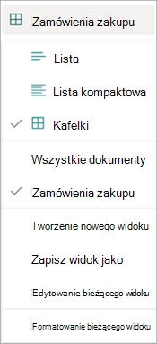

Istnieje wiele sposobów wyświetlania informacji w bibliotece dokumentów SharePoint. Widok w bibliotece dokumentów można zmienić tak, aby odpowiadał potrzebom lub preferencjom.

Aby zmienić widok na stronie biblioteki, wybierz menu rozwijane widoku, aby wyświetlić opcje, a następnie wybierz widok, którego chcesz użyć.

    

Jeśli na przykład **wybierzesz pozycję Kafelki** z listy, strona będzie wyświetlana w sposób pokazany.

    

W widoku **Kafelki** jest wyświetlanych maksymalnie osiem pól utworzonych przez użytkownika. Jeśli jest ich mniej niż osiem, wyświetlane są maksymalnie cztery pola generowane przez system: Poufność (jeśli jest dostępna), Przechowywanie (jeśli jest dostępne), Typ zawartości, Data modyfikacji, Zmodyfikowana przez i Data klasyfikacji.

Aby edytować bieżący widok, z menu rozwijanego widoku wybierz pozycję **Edytuj bieżący widok**.
