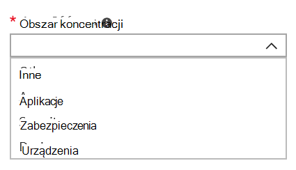

# Dodawanie i weryfikowanie kontaktów administratora w portalu administracyjnym

Istnieje kilka sposobów komunikacji Microsoft Managed Desktop z klientami. Aby usprawnić komunikację i zagwarantować, że kontakty są sprawdzane z właściwymi osobami, musisz podać zestaw kontaktów administratora. Microsoft Managed Desktop it będzie kontaktować się z tymi osobami w celu uzyskania pomocy w rozwiązywaniu problemów.

> [!IMPORTANT]
> Być może już dodano te kontakty w portalu administracyjnym. Jeśli tak, poczekaj chwilę, aby dokładnie sprawdzić, czy lista kontaktów jest dokładna, ponieważ Microsoft Managed Desktop będzie  można się z nią skontaktować w razie poważnego zdarzenia.

## Obszary fokusu kontaktów administratora

Kontakty administratora powinny być najlepszą osobą lub grupą, która może odpowiadać na pytania i podejmować decyzje dotyczące różnych obszarów zainteresowania. **Microsoft Managed Desktop kontaktuje się z tymi kontaktami administratora w przypadku pytań dotyczących wniosku o pomoc techniczną składanych przez klienta.** Te kontakty administratora będą otrzymywać powiadomienia o aktualizacjach wniosku o pomoc techniczną i o nowych wiadomościach. Są to następujące obszary:

| Obszar koncentracji | W przypadku pytań dotyczących |
| ----- | ----- |
| Opakowanie aplikacji | Rozwiązywanie problemów z pakowaniem aplikacji. |
| Urządzenia | Kondycja urządzeń, rozwiązywanie problemów z Microsoft Managed Desktop urządzeniami. |
| Bezpieczeństwo | Rozwiązywanie problemów z zabezpieczeniami na Microsoft Managed Desktop urządzeniach. |
| Pomoc it | W przypadkach, gdy nasz personel pomocy technicznej sprawuje kontrolę nad biletami użytkowników Microsoft Managed Desktop obszarów pomocy technicznej. |
| Inne | W przypadku problemów, które nie są objęte innymi obszarami. |

> [!IMPORTANT]
> **Niezależnie od tego, kto wybierzesz dla tych kontaktów, musi mieć wiedzę i uprawnienia do podejmowania decyzji dotyczących Microsoft Managed Desktop środowiska.**

Po dodaniu środowiska Microsoft Managed Desktop jest wyświetlany monit o dodanie kontaktów dla lokalnego działu pomocy technicznej i zabezpieczeń.

Kontakty administratora są wymagane podczas [przesyłania wniosku o pomoc techniczną](../service-description/support.md). Musisz mieć kontakt administratora w obszarze fokusu wniosku o pomoc techniczną.

**Aby dodać kontakty administratora:**

1. Zaloguj się, [aby Microsoft Endpoint Manager](https://endpoint.microsoft.com).
1. W **obszarze Administracja** dzierżawą w **Microsoft Managed Desktop** wybierz pozycję **Kontakty administratora**.
1. Wybierz opcję **Dodaj**.
1. Wybierz obszar **koncentracji i** wprowadź informacje dotyczące kontaktu.

    

1. Powtórz te czynności dla każdego obszaru fokusu.

## Procedura rozpoczynania pracy z Microsoft Managed Desktop

1. Portalu [administracyjnego programu](access-admin-portal.md) Access.
1. Dodaj i zweryfikuj kontakty administratora w portalu administracyjnym (ten artykuł).
1. [Dostosuj ustawienia po rejestracji](conditional-access.md).
1. Wdrażanie i [przypisywanie Intune — Portal firmy](company-portal.md).
1. [Przypisywanie licencji](assign-licenses.md).
1. [Wdychuj aplikacje](deploy-apps.md).
1. [Przygotowywanie urządzeń](Prepare-devices.md).
1. Skonfiguruj środowisko [pierwszego uruchomienia za pomocą rozwiązania Autopilot i strony stanu rejestracji](esp-first-run.md).
1. [Włączanie funkcji pomocy technicznej dla użytkowników](enable-support.md).
1. [Przygotuj użytkowników do korzystania z urządzeń](get-started-devices.md).
1. [Wprowadzenie do sterowania aplikacją](get-started-app-control.md).
