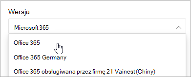
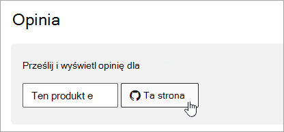

# Microsoft 365 nawigacji do dokumentów

W tym temacie przedstawiono kilka porad i wskazówek dotyczących nawigowania po Microsoft 365 dokumentacji technicznej.  

## Strona Centrum

Strona Microsoft 365 centrum znajduje się na [https://aka.ms/microsoft365docs](./index.yml) stronie centrum i stanowi punkt wejścia do znajdowania Microsoft 365 zawartości.

Zawsze możesz wrócić do tej strony, wybierając pozycję **Microsoft 365** w nagłówku u góry każdej strony w zestawie Microsoft 365 technicznych:

## Wyszukiwanie w tok 
Na docs.microsoft.com możesz przeszukiwać zawartość spisu treści, korzystając z pola wyszukiwania filtru u góry:

## Filtr wersji
Dokumentacja techniczna Microsoft 365 udostępnia zawartość dotyczącą dodatkowych produktów, w tym Office 365 w Niemczech i Office 365 obsługiwanej przez firmę 21 Vianet (Chiny). Funkcje mogą się różnić między tymi wersjami i w związku z tym może się różnić sama zawartość.

Możesz użyć filtru wersji, aby upewnić się, że jest dostępna zawartość dla odpowiedniej wersji pakietu Microsoft 365:

## Breadcrumbs

Link do stron nadrzędnych znajduje się poniżej nagłówka i powyżej spisu treści, a także wskazuje, gdzie w tym spisie treści znajduje się bieżący artykuł.  Nie tylko pomoże to ustawić kontekst do tego, jaki typ zawartości czytasz, ale także umożliwia przejście z powrotem do drzewa spisu treści:

## Nawigacja po sekcjach artykułów

Okienko nawigacji po prawej stronie umożliwia szybkie przechodzenie do sekcji w artykule, a także identyfikowanie lokalizacji w tym artykule.  

## Przesyłanie opinii dotyczącej dokumentów

Jeśli znajdziesz coś nie tak w artykule, możesz przesłać opinię do zespołu SQL Content team for the article, przewijając w dół strony i wybierając pozycję **Opinia o zawartości**.

## Współtwoer Microsoft 365 dokumentów

Czy wiesz, że możesz edytować zawartość w oknie docs.microsoft.com siebie? Jeśli to zrobisz, będziemy nie tylko ulepszać naszą dokumentację, ale również zostaniesz współautorem tej strony. Aby rozpocząć, zobacz:

- [Przewodnik współautora dokumentów firmy Microsoft](/contribute/)

## Następne kroki

- Wprowadzenie do [dokumentacji Microsoft 365 technicznej](index.yml).