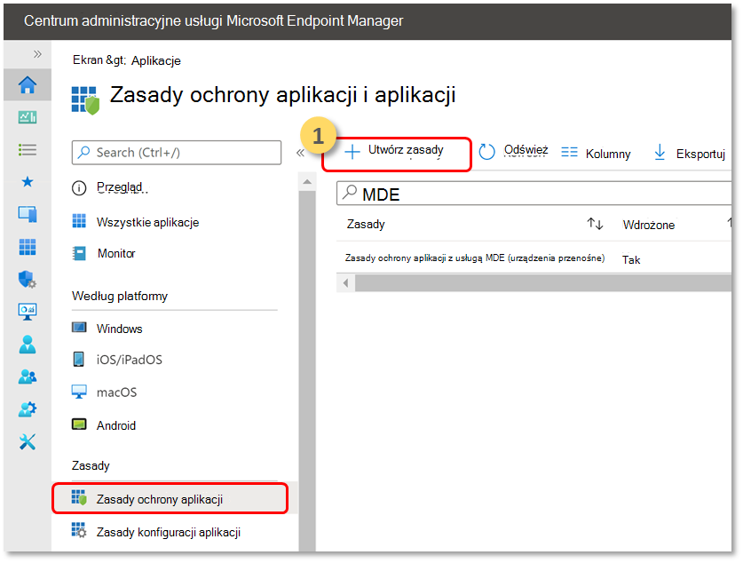
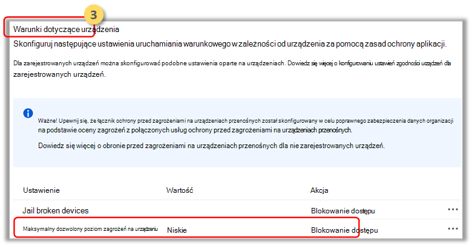
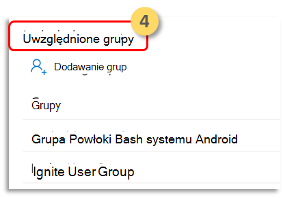

# Konfigurowanie programu Microsoft Defender pod celu używania sygnałów ryzyka dla punktu końcowego przy użyciu zasad ochrony aplikacji (MAM)

[!INCLUDE [Microsoft 365 Defender rebranding](../../includes/microsoft-defender.md)]

**Dotyczy:**
- [Microsoft Defender for Endpoint Plan 1](https://go.microsoft.com/fwlink/p/?linkid=2154037)
- [Microsoft Defender for Endpoint Plan 2](https://go.microsoft.com/fwlink/p/?linkid=2154037)
- [Microsoft 365 Defender](https://go.microsoft.com/fwlink/?linkid=2118804)

Program Microsoft Defender for Endpoint w systemie Android, który już chroni użytkowników przedsiębiorstwa w scenariuszach zarządzania urządzeniami przenośnymi (MDM), teraz obsługuje zarządzanie aplikacjami mobilnymi (MAM) dla urządzeń, które nie są zarejestrowane przy użyciu zarządzania urządzeniami przenośnymi Intune (MDM). Obejmuje to również klientów korzystających z innych rozwiązań do zarządzania mobilnością w przedsiębiorstwie, jednocześnie używających usługi Intune do zarządzania aplikacjami mobilnymi (MAM). Ta funkcja umożliwia zabezpieczanie danych organizacji i zarządzanie nimi w obrębie aplikacji.

Program Microsoft Defender for Endpoint w informacjach o zagrożeniach w systemie Android korzysta z zasad ochrony aplikacji Intune w celu ochrony tych aplikacji. Zasady ochrony aplikacji (APP) to reguły, które zapewniają, że dane organizacji pozostają bezpieczne lub znajdują się w zarządzanej aplikacji. Aplikacja zarządzana ma zastosowane zasady ochrony aplikacji i może być zarządzana przez usługę Intune.  

Program Microsoft Defender for Endpoint w systemie Android obsługuje obie konfiguracje mam
- **Intune MDM + MAM**: administratorzy IT mogą zarządzać aplikacjami tylko za pomocą zasad ochrony aplikacji na urządzeniach zarejestrowanych za pomocą zarządzania urządzeniami przenośnymi Intune (MDM).
- **MAM bez rejestracji urządzeń**: MAM bez rejestracji urządzenia lub MAM-WE, umożliwia administratorom informatycznym zarządzanie aplikacjami przy  użyciu zasad ochrony aplikacji na urządzeniach, które nie zostały zarejestrowane za pomocą usługi Intune MDM. Oznacza to, że aplikacjami można zarządzać w usłudze Intune na urządzeniach zarejestrowanych u dostawców usług EMM innych firm. Aby zarządzać aplikacjami przy użyciu obu powyższych konfiguracji, klienci powinni używać usługi Intune w centrum [Microsoft Endpoint Manager administracyjnego](https://go.microsoft.com/fwlink/?linkid=2109431)

Aby włączyć tę funkcję, administrator musi skonfigurować połączenie między usługą Microsoft Defender for Endpoint i Intune, utworzyć zasady ochrony aplikacji i zastosować je na urządzeniach i aplikacjach ukierunkowanych. 
 
Użytkownicy końcowi muszą również wykonać kroki instalacji programu Microsoft Defender dla punktu końcowego na swoim urządzeniu i aktywowania przepływu dołączania.

## Wymagania wstępne administratorów

- **Sprawdzanie, czy jest włączony łącznik Endpoint-Intune Microsoft Defender**

  a. Przejdź do security.microsoft.com. 

  b. Wybierz **Ustawienia > punktów końcowych> > Microsoft Intune włączona** połączenie.

  c. Jeśli połączenie nie jest włączone, wybierz przełącznik, aby go włączyć, a następnie wybierz pozycję **Zapisz preferencje**.

  

  d. Przejdź do **Microsoft Endpoint Manager (Intune)** i Sprawdź, czy program Microsoft Defender dla Endpoint-Intune jest włączony.

  

- **Włączanie programu Microsoft Defender dla punktu końcowego w łączniku systemu Android dla zasad ochrony aplikacji (APP)**
  
  Skonfiguruj łącznik w usłudze Intune Microsoft Endpoint Manager zasady ochrony aplikacji:

  a. Przejdź do **administracji dzierżawy, > łączniki i tokeny > programie Microsoft Defender for Endpoint**.

  b. Włącz przełącznik zasad ochrony aplikacji dla systemu Android (jak pokazano na poniższym zrzucie ekranu).

  c. Wybierz **Zapisz**.

  

- **Tworzenie zasad ochrony aplikacji** 
 
Blokowanie dostępu lub czyszczenie danych aplikacji zarządzanej w oparciu o usługę Microsoft Defender dla punktów końcowych sygnalizuje przez utworzenie zasad ochrony aplikacji.
Program Microsoft Defender for Endpoint można skonfigurować do wysyłania sygnałów zagrożeń, które mają być używane w zasadach ochrony aplikacji (APP, znaną także jako MAM). Dzięki tej funkcji można chronić zarządzane aplikacje za pomocą programu Microsoft Defender for Endpoint.

1. Tworzenie zasad  
Zasady ochrony aplikacji (APP) to reguły, które zapewniają, że dane organizacji pozostają bezpieczne lub znajdują się w zarządzanej aplikacji. Zasady mogą być regułą wymuszaną podczas próby uzyskania dostępu do danych firmowych lub przenoszenia ich przez użytkownika albo zestawem działań zabronionych lub monitorowanych, gdy użytkownik znajduje się w aplikacji. 

2. Dodawanie aplikacji  
    a. Wybierz sposób stosowania tych zasad do aplikacji na różnych urządzeniach. Następnie dodaj co najmniej jedną aplikację.  
    Użyj tej opcji, aby określić, czy te zasady mają zastosowanie do urządzeń niezamanektowych. W przypadku systemu Android możesz określić zasady dotyczące systemu Android Enterprise, Administratora urządzeń lub Urządzeń niezamanektowych. Możesz także kierować zasady do aplikacji na urządzeniach o dowolnym stanie zarządzania.
Ponieważ zarządzanie aplikacją mobilną nie wymaga zarządzania urządzeniami, możesz chronić dane firmowe zarówno na urządzeniach zarządzanych, jak i nieza zarządzania. Zarządzanie jest wyśrodkowane na tożsamości użytkownika, co usuwa wymaganie zarządzania urządzeniami. Firmy mogą jednocześnie korzystać z zasad ochrony aplikacji z usługą MDM lub bez nich. Rozważ na przykład pracownika, który używa zarówno telefonu wystawionego przez firmę, jak i własnego tabletu osobistego. Telefon firmowy jest zarejestrowany w usłudze MDM i chroniony za pomocą zasad ochrony aplikacji, natomiast urządzenie osobiste jest chronione tylko przez zasady ochrony aplikacji.

    b. Wybierz aplikacje 
    Aplikacja zarządzana to aplikacja, do która ma zastosowane zasady ochrony aplikacji i może być zarządzana przez usługę Intune. Każdą aplikację, która została zintegrowana z zestawem [SDK usługi Intune](/mem/intune/developer/app-sdk) lub zawijona przez App Wrapping Tool [Intune](/mem/intune/developer/apps-prepare-mobile-application-management), można zarządzać przy użyciu zasad ochrony aplikacji Intune. Zapoznaj się z oficjalna [listą Microsoft Intune aplikacji](/mem/intune/apps/apps-supported-intune-apps) chronionych, które zostały stworzone przy użyciu tych narzędzi i są dostępne do użytku publicznego.

    *Przykład: Outlook jako aplikacja zarządzana*

    

 3. Ustaw wymagania dotyczące zabezpieczeń logowania dla zasad ochrony.  
Wybierz **pozycję > maksymalny dozwolony poziom zagrożeń** urządzenia w warunkach **urządzenia** i wprowadź wartość. Następnie wybierz  **pozycję Akcja: "Blokuj dostęp"**. Program Microsoft Defender for Endpoint w systemie Android udostępnia ten poziom zagrożeń urządzeń.

    

- **Przypisz grupy użytkowników, do których mają zostać zastosowane zasady.** 
  Wybierz **pozycję Uwzględnione grupy**. Następnie dodaj odpowiednie grupy. 

    

## Wymagania wstępne użytkowników końcowych
- Aplikacja brokera musi być zainstalowana
    - Intune — Portal firmy
    
- Użytkownicy mają wymagane licencje dla aplikacji zarządzanej i mają zainstalowaną aplikację

### Dołączanie użytkowników końcowych 

1. Zaloguj się do aplikacji zarządzanej, na przykład w Outlook. Urządzenie zostanie zarejestrowane, a zasady ochrony aplikacji zsynchronizowane z urządzeniem. Zasady ochrony aplikacji rozpoznają stan kondycji urządzenia.  

2. Wybierz **pozycję Kontynuuj**. Zostanie przedstawiony ekran, który zaleca pobranie i skonfigurowanie programu Microsoft Defender for Endpoint w aplikacji dla systemu Android.

3. Wybierz **pozycję Pobierz**. Nastąpi przekierowanie do sklepu z aplikacjami (Google Play). 

4.  Zainstaluj aplikację Microsoft Defender for Endpoint (Mobile) i uruchom ponownie ekran dołączania aplikacji zarządzanej.

  

5.  Kliknij **przycisk Kontynuuj > Uruchom**. Proces dołączania/aktywowania aplikacji Microsoft Defender for Endpoint jest inicjowany. Postępuj zgodnie z instrukcjami, aby ukończyć dołączanie. Nastąpi automatyczne przekierowanie z powrotem do ekranu wnoszeń aplikacji zarządzanych, który teraz wskazuje, że urządzenie jest w dobrej kondycji.

6. Wybierz **pozycję Kontynuuj** , aby zalogować się do aplikacji zarządzanej. 

## Tematy pokrewne

- [Omówienie programu Microsoft Defender dla punktu końcowego w systemie Android](microsoft-defender-endpoint-android.md)
- [Wdrażanie programu Microsoft Defender dla punktu końcowego w systemie Android za pomocą Microsoft Intune](android-intune.md)
