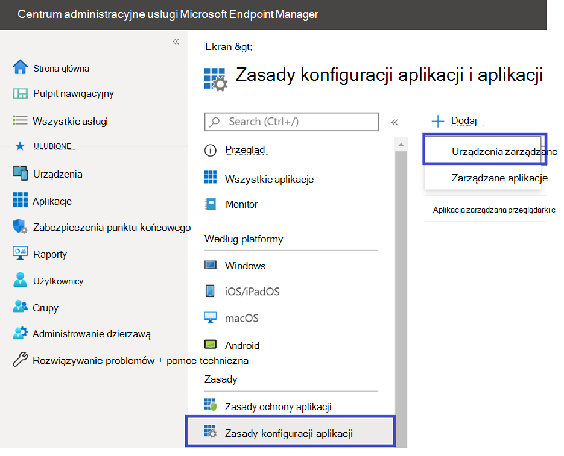

# Konfiguruj ochronę punktu końcowego w usłudze Microsoft Defender w opcjach systemu Android

[!INCLUDE [Microsoft 365 Defender rebranding](../../includes/microsoft-defender.md)]

**Dotyczy:**
- [Ochrona punktu końcowego w usłudze Microsoft Defender (plan 1)](https://go.microsoft.com/fwlink/p/?linkid=2154037)
- [Ochrona punktu końcowego w usłudze Microsoft Defender (plan 2)](https://go.microsoft.com/fwlink/p/?linkid=2154037) 
- [Microsoft 365 Defender](https://go.microsoft.com/fwlink/?linkid=2118804)

## Dostęp warunkowy za pomocą usługi Defender dla punktu końcowego w systemie Android

Ochrona punktu końcowego w usłudze Microsoft Defender w systemie Android wraz z usługami Microsoft Intune i Azure Active Directory umożliwiają wymuszanie zasad zgodności urządzeń i dostępu warunkowego na podstawie poziomów ryzyka urządzenia. Defender for Endpoint to rozwiązanie usługi Mobile Threat Defense (MTD), które można wdrożyć w celu wykorzystania tej możliwości za pośrednictwem Intune.

Aby uzyskać więcej informacji na temat konfigurowania usługi Defender for Endpoint w systemie Android i dostępu warunkowego, zobacz [Defender for Endpoint i Intune](/mem/intune/protect/advanced-threat-protection).

## Konfigurowanie niestandardowych wskaźników

> [!NOTE]
> Usługa Defender for Endpoint w systemie Android obsługuje tylko tworzenie niestandardowych wskaźników adresów IP i adresów URL/domen.

Usługa Defender for Endpoint w systemie Android umożliwia administratorom konfigurowanie niestandardowych wskaźników do obsługi urządzeń z systemem Android. Aby uzyskać więcej informacji na temat konfigurowania wskaźników niestandardowych, zobacz [Zarządzanie wskaźnikami](manage-indicators.md).

## Konfigurowanie ochrony w Internecie
Usługa Defender for Endpoint w systemie Android umożliwia administratorom IT konfigurowanie funkcji ochrony w Internecie. Ta funkcja jest dostępna w centrum Endpoint Manager Administracja firmy Microsoft.

> [!NOTE]
> Usługa Defender for Endpoint w systemie Android będzie używać sieci VPN w celu zapewnienia funkcji ochrony sieci Web. Nie jest to zwykła sieć VPN i jest lokalną/samopętlaną siecią VPN, która nie przyjmuje ruchu poza urządzeniem.
> Aby uzyskać więcej informacji, zobacz [Konfigurowanie ochrony w Internecie na urządzeniach z systemem Android](/mem/intune/protect/advanced-threat-protection-manage-android).

## Ochrona sieci
>[!NOTE]
>Ochrona sieci w Ochrona punktu końcowego w usłudze Microsoft Defender jest teraz dostępna w publicznej wersji zapoznawczej. Poniższe informacje dotyczą wstępnie wydanego produktu, który może zostać znacząco zmodyfikowany przed jego komercyjną premierą. Firma Microsoft nie udziela żadnych gwarancji, wyraźnych ani dorozumianych, w odniesieniu do podanych tutaj informacji.

Ta funkcja zapewnia ochronę przed nieautoryzowanymi zagrożeniami Wi-Fi i nieautoryzowanymi certyfikatami, które są głównym wektorem ataku dla sieci Wi-Fi. Administratorzy mogą wyświetlić listę certyfikatów głównego urzędu certyfikacji (CA) i prywatnego głównego urzędu certyfikacji w centrum Endpoint Manager Administracja firmy Microsoft i ustanowić zaufanie z punktami końcowymi. Zapewnia użytkownikowi środowisko z przewodnikiem, aby nawiązać połączenie z bezpiecznymi sieciami, a także powiadamia go o wykryciu powiązanego zagrożenia. 

Obejmuje ona kilka kontrolek administratora zapewniających elastyczność, takich jak możliwość konfigurowania funkcji z poziomu centrum Endpoint Manager Administracja firmy Microsoft, a także dodawanie zaufanych certyfikatów. Administratorzy mogą również włączyć [mechanizmy kontroli prywatności](/microsoft-365/security/defender-endpoint/android-configure#privacy-controls) , aby skonfigurować dane wysyłane przez usługę Defender for Endpoint z urządzeń z systemem Android.

Ochrona sieci w usłudze Microsoft Defender dla punktu końcowego jest domyślnie włączona. Administratorzy mogą wykonać następujące kroki, aby **skonfigurować ochronę sieci na urządzeniach z systemem Android.**

1. W usłudze Microsoft Endpoint Manager Administracja przejdź do obszaru Aplikacje > Zasady konfiguracji aplikacji. Utwórz nowe zasady konfiguracji aplikacji.
    > [!div class="mx-imgBorder"]
    > 
1. Podaj nazwę i opis, aby jednoznacznie zidentyfikować zasady. Wybierz **pozycję "Android Enterprise"** jako platformę i **"Tylko profil służbowy należący do użytkownika"** jako typ profilu i **"Microsoft Defender"** jako aplikację docelową.
    > [!div class="mx-imgBorder"]
    > 
1. Na stronie Ustawienia wybierz pozycję **"Użyj projektanta konfiguracji"** i dodaj **opcję "Włącz ochronę sieci w usłudze Microsoft Defender"** jako klucz i wartość **"0",** aby wyłączyć ochronę sieci. (Ochrona sieci jest domyślnie włączona)
    > [!div class="mx-imgBorder"]
    > 
    
    > [!div class="mx-imgBorder"]
    > 
1. Jeśli Twoja organizacja korzysta z głównych urzędów certyfikacji, które mogą mieć charakter prywatny, należy ustanowić jawne zaufanie między Intune (rozwiązanie MDM) a urządzeniami użytkownika, aby usługa Defender nie wykrywała ich jako nieuczciwych certyfikatów.  

    Aby ustanowić relację zaufania dla głównych urzędów certyfikacji, użyj **opcji "Lista certyfikatów zaufanego urzędu certyfikacji dla ochrony sieci (wersja zapoznawcza)"** jako klucza i wartości dodaj **"rozdzielaną przecinkami listę odcisków palca certyfikatu"**.
    > [!div class="mx-imgBorder"]
    > 

1. W przypadku innych konfiguracji związanych z ochroną sieci dodaj następujące klucze i odpowiednią odpowiednią wartość.
 

    | Klucz konfiguracji| Opis|
    |---|---|
    |Włącz prywatność ochrony sieci|1 — Włącz , 0 — Wyłącz ; To ustawienie jest zarządzane przez administratorów IT w celu włączenia lub wyłączenia prywatności w ochronie sieci.|
    |Włączanie użytkownikom zaufania do sieci i certyfikatów|1 — Włącz , 0 — Wyłącz ; To ustawienie jest używane przez administratorów IT do włączania lub wyłączania środowiska użytkownika końcowego w aplikacji, aby ufać niezabezpieczonym i podejrzanym sieciom oraz złośliwym certyfikatom oraz ufać im.|
    |Automatyczne korygowanie alertów ochrony sieci|1 — Włącz , 0 — Wyłącz ; To ustawienie jest używane przez administratorów IT do włączania lub wyłączania alertów korygowania wysyłanych, gdy użytkownik wykonuje działania korygujące, takie jak przełączanie na bezpieczniejsze punkty dostępu Wi-Fi lub usuwanie podejrzanych certyfikatów wykrytych przez usługę Defender|
1. Dodaj wymagane grupy, dla których zasady będą musiały zostać zastosowane. Przejrzyj i utwórz zasady.

## Mechanizmy kontroli prywatności

> [!IMPORTANT]
> Mechanizmy kontroli prywatności dla Ochrona punktu końcowego w usłudze Microsoft Defender w systemie Android są w wersji zapoznawczej. Poniższe informacje dotyczą wstępnie wydanego produktu, który może zostać znacząco zmodyfikowany przed jego komercyjną premierą. Firma Microsoft nie udziela żadnych gwarancji, wyraźnych ani dorozumianych, w odniesieniu do podanych tutaj informacji.

Do konfigurowania danych wysyłanych przez usługę Defender for Endpoint z urządzeń z systemem Android są dostępne następujące mechanizmy kontroli prywatności:

|Raport zagrożeń     |Szczegóły      |
|--------------------|-------------|
|Raport o złośliwym oprogramowaniu |Administratorzy mogą skonfigurować kontrolę prywatności dla raportu o złośliwym oprogramowaniu — jeśli prywatność jest włączona, usługa Defender for Endpoint nie wyśle nazwy aplikacji złośliwego oprogramowania ani innych szczegółów aplikacji w ramach raportu alertów o złośliwym oprogramowaniu |
|Raport phish |Administratorzy mogą skonfigurować kontrolę prywatności dla raportu phish — jeśli prywatność jest włączona, usługa Defender for Endpoint nie wyśle nazwy domeny ani szczegółów niebezpiecznej witryny internetowej w ramach raportu alertów phish |
|Ocena luk w zabezpieczeniach aplikacji (tylko dla systemu Android) |Domyślnie tylko informacje o aplikacjach zainstalowanych w profilu służbowym są wysyłane do oceny luk w zabezpieczeniach. Administratorzy mogą wyłączyć prywatność, aby uwzględnić aplikacje osobiste|
|Ochrona sieci (wersja zapoznawcza)| Administratorzy mogą włączyć lub wyłączyć prywatność w ochronie sieci — jeśli jest włączona, usługa Defender nie będzie wysyłać szczegółów sieci.|

## Konfigurowanie oceny luk w zabezpieczeniach aplikacji dla urządzeń BYOD

W wersji 1.0.3425.0303 Ochrona punktu końcowego w usłudze Microsoft Defender w systemie Android będzie można przeprowadzić ocenę luk w zabezpieczeniach systemu operacyjnego i aplikacji zainstalowanych na dołączonych urządzeniach przenośnych.

> [!NOTE]
> Ocena luk w zabezpieczeniach jest częścią [Zarządzanie lukami w zabezpieczeniach w usłudze Microsoft Defender](../defender-vulnerability-management/defender-vulnerability-management.md) w Ochrona punktu końcowego w usłudze Microsoft Defender. 

**Uwagi dotyczące prywatności związanej z aplikacjami z urządzeń osobistych (BYOD):**

- W przypadku systemu Android Enterprise z profilem służbowym obsługiwane będą tylko aplikacje zainstalowane w profilu służbowym.
- W przypadku innych trybów BYOD domyślnie ocena luk w zabezpieczeniach aplikacji **nie** zostanie włączona. Jednak gdy urządzenie jest w trybie administratora, administratorzy mogą jawnie włączyć tę funkcję za pośrednictwem usługi Microsoft Endpoint Manager, aby uzyskać listę aplikacji zainstalowanych na urządzeniu. Aby uzyskać więcej informacji, zobacz szczegóły poniżej.

### Konfigurowanie prywatności dla trybu administratora urządzenia

Wykonaj poniższe kroki, aby **włączyć ocenę luk w zabezpieczeniach aplikacji** z urządzeń w trybie **administratora urządzenia** dla użytkowników docelowych. 

> [!NOTE]
> Domyślnie jest to wyłączone w przypadku urządzeń zarejestrowanych w trybie administratora urządzenia.

1. W [centrum administracyjnym firmy Microsoft Endpoint Manager](https://go.microsoft.com/fwlink/?linkid=2109431) przejdź do pozycji Profile  > **konfiguracji** **urządzeń** > **Utwórz profil** i wprowadź następujące ustawienia:

   - **Platforma**: wybierz pozycję Administrator urządzenia z systemem Android
   - **Profil**: wybierz pozycję "Niestandardowe" i kliknij pozycję Utwórz

2. W sekcji **Podstawy** określ nazwę i opis profilu.

3. W **obszarze Ustawienia konfiguracji** wybierz pozycję Dodaj ustawienie **OMA-URI** :

   - **Nazwa**: wprowadź unikatową nazwę i opis tego ustawienia OMA-URI, aby można było je łatwo znaleźć później.
   - OMA-URI: **./Vendor/MSFT/DefenderATP/DefenderTVMPrivacyMode**
   - Typ danych: wybierz pozycję Liczba całkowita na liście rozwijanej.
   - Wartość: wprowadź wartość 0, aby wyłączyć ustawienie prywatności (domyślnie wartość to 1)

4. Kliknij przycisk **Dalej** i przypisz ten profil do urządzeń/użytkowników docelowych.

### Konfigurowanie prywatności dla profilu służbowego systemu Android Enterprise

Usługa Defender for Endpoint obsługuje ocenę luk w zabezpieczeniach aplikacji w profilu służbowym. Jeśli jednak chcesz wyłączyć tę funkcję dla użytkowników docelowych, możesz wykonać następujące kroki:

1. W [centrum administracyjnym firmy Microsoft Endpoint Manager](https://go.microsoft.com/fwlink/?linkid=2109431) i przejdź do **pozycji Zasady** >  konfiguracji aplikacji **Aplikacje** > **Dodaj** > **zarządzane urządzenia**.
2. Nadaj zasadom nazwę; **Platforma > Android Enterprise**; wybierz typ profilu.
3. Wybierz **Ochrona punktu końcowego w usłudze Microsoft Defender** jako aplikację docelową.
4. Na stronie Ustawienia wybierz pozycję **Użyj projektanta konfiguracji** i dodaj wartość **DefenderTVMPrivacyMode** jako typ klucza i wartości jako liczbę **całkowitą**
   - Aby wyłączyć lukę w zabezpieczeniach aplikacji w profilu służbowym, wprowadź wartość jako `1` i przypisz te zasady użytkownikom. Domyślnie ta wartość jest ustawiona na `0`.
   - W przypadku użytkowników z kluczem ustawionym jako `0`usługa Defender dla punktu końcowego wyśle listę aplikacji z profilu służbowego do usługi zaplecza w celu oceny luk w zabezpieczeniach.
5. Kliknij przycisk **Dalej** i przypisz ten profil do urządzeń/użytkowników docelowych.

Włączenie lub wyłączenie powyższych mechanizmów kontroli prywatności nie wpłynie na sprawdzanie zgodności urządzeń ani dostęp warunkowy.

## Konfigurowanie prywatności na potrzeby raportu alertów wyłudzania informacji

Kontrola prywatności dla raportu phish może służyć do wyłączania zbierania nazwy domeny lub informacji o witrynie internetowej w raporcie zagrożeń phish. Zapewnia to organizacjom elastyczność wyboru, czy chce ona zbierać nazwę domeny, gdy złośliwa lub phish witryna internetowa zostanie wykryta i zablokowana przez usługę Defender for Endpoint.

### Skonfiguruj prywatność dla raportu alertu wyłudzania informacji na urządzeniach zarejestrowanych przez administratora urządzeń z systemem Android:

Wykonaj następujące kroki, aby włączyć ją dla użytkowników docelowych:

1. W [centrum administracyjnym firmy Microsoft Endpoint Manager](https://go.microsoft.com/fwlink/?linkid=2109431) przejdź do pozycji Profile  > **konfiguracji** **urządzeń** > **Utwórz profil** i wprowadź następujące ustawienia:

   - **Platforma**: wybierz pozycję Administrator urządzenia z systemem Android.
   - **Profil**: wybierz pozycję "Niestandardowe", a następnie kliknij pozycję **Utwórz**.

2. W sekcji **Podstawy** określ nazwę i opis profilu.

3. W **obszarze Ustawienia konfiguracji** wybierz pozycję Dodaj ustawienie **OMA-URI** :

   - **Nazwa**: wprowadź unikatową nazwę i opis tego ustawienia OMA-URI, aby można było je łatwo znaleźć później.
   - OMA-URI: **./Vendor/MSFT/DefenderATP/DefenderExcludeURLInReport**
   - Typ danych: wybierz pozycję Liczba całkowita na liście rozwijanej.
   - Wartość: wprowadź wartość 1, aby włączyć ustawienie prywatności. Wartość domyślna to 0.

4. Kliknij przycisk **Dalej** i przypisz ten profil do urządzeń/użytkowników docelowych.

Użycie tej kontroli prywatności nie będzie miało wpływu na sprawdzanie zgodności urządzeń ani dostęp warunkowy.

### Konfigurowanie prywatności na potrzeby raportu alertu wyłudzania informacji w profilu służbowym systemu Android Enterprise

Wykonaj następujące kroki, aby włączyć prywatność dla użytkowników docelowych w profilu służbowym:

1. W [centrum administracyjnym firmy Microsoft Endpoint Manager](https://go.microsoft.com/fwlink/?linkid=2109431) i przejdź do **pozycji Zasady** >  konfiguracji aplikacji **Aplikacje** > **Dodaj** > **zarządzane urządzenia**.
2. Nadaj zasadom nazwę **Platform > Android Enterprise**, wybierz typ profilu.
3. Wybierz **Ochrona punktu końcowego w usłudze Microsoft Defender** jako aplikację docelową.
4. Na stronie Ustawienia wybierz pozycję **Użyj projektanta konfiguracji** i dodaj wartość **DefenderExcludeURLInReport** jako typ klucza i wartości jako liczbę **całkowitą**.
   - Wprowadź **wartość 1, aby włączyć prywatność**. Wartość domyślna to 0.
5. Kliknij przycisk **Dalej** i przypisz ten profil do urządzeń/użytkowników docelowych.

Włączenie lub wyłączenie powyższych mechanizmów kontroli prywatności nie wpłynie na sprawdzanie zgodności urządzeń ani dostęp warunkowy.

## Konfigurowanie prywatności dla raportu zagrożeń związanych ze złośliwym oprogramowaniem

Kontrola prywatności dla raportu zagrożeń przed złośliwym oprogramowaniem może służyć do wyłączania z raportu o zagrożeniach złośliwego oprogramowania kolekcji szczegółów aplikacji (informacji o nazwie i pakiecie). Dzięki temu organizacje mogą wybrać, czy chcą zebrać nazwę aplikacji po wykryciu złośliwej aplikacji.

### Skonfiguruj raport dotyczący alertów o ochronie prywatności dla złośliwego oprogramowania na urządzeniach zarejestrowanych przez administratora urządzeń z systemem Android:

Wykonaj następujące kroki, aby włączyć ją dla użytkowników docelowych:

1. W [centrum administracyjnym firmy Microsoft Endpoint Manager](https://go.microsoft.com/fwlink/?linkid=2109431) przejdź do pozycji Profile  > **konfiguracji** **urządzeń** > **Utwórz profil** i wprowadź następujące ustawienia:

   - **Platforma**: wybierz pozycję Administrator urządzenia z systemem Android.
   - **Profil**: wybierz pozycję "Niestandardowe", a następnie kliknij pozycję **Utwórz**.

2. W sekcji **Podstawy** określ nazwę i opis profilu.

3. W **obszarze Ustawienia konfiguracji** wybierz pozycję Dodaj ustawienie **OMA-URI** :

   - **Nazwa**: wprowadź unikatową nazwę i opis tego ustawienia OMA-URI, aby można było je łatwo znaleźć później.
   - OMA-URI: **./Vendor/MSFT/DefenderATP/DefenderExcludeAppInReport**
   - Typ danych: wybierz pozycję Liczba całkowita na liście rozwijanej.
   - Wartość: wprowadź wartość 1, aby włączyć ustawienie prywatności. Wartość domyślna to 0.

4. Kliknij przycisk **Dalej** i przypisz ten profil do urządzeń/użytkowników docelowych.

Użycie tej kontroli prywatności nie będzie miało wpływu na sprawdzanie zgodności urządzeń ani dostęp warunkowy. Na przykład urządzenia ze złośliwą aplikacją zawsze będą miały poziom ryzyka "Średni".

### Konfigurowanie prywatności dla raportu alertów o złośliwym oprogramowaniu w profilu służbowym systemu Android Enterprise

Wykonaj następujące kroki, aby włączyć prywatność dla użytkowników docelowych w profilu służbowym:

1. W [centrum administracyjnym firmy Microsoft Endpoint Manager](https://go.microsoft.com/fwlink/?linkid=2109431) i przejdź do **pozycji Zasady** >  konfiguracji aplikacji **Aplikacje** > **Dodaj** > **zarządzane urządzenia**.
2. Nadaj zasadom nazwę **Platform > Android Enterprise**, wybierz typ profilu.
3. Wybierz **Ochrona punktu końcowego w usłudze Microsoft Defender** jako aplikację docelową.
4. Na stronie Ustawienia wybierz pozycję **Użyj projektanta konfiguracji** i dodaj **wartość DefenderExcludeAppInReport** jako typ klucza i wartości jako liczbę **całkowitą**
   - Wprowadź **wartość 1, aby włączyć prywatność**. Wartość domyślna to 0.
5. Kliknij przycisk **Dalej** i przypisz ten profil do urządzeń/użytkowników docelowych.

Użycie tej kontroli prywatności nie będzie miało wpływu na sprawdzanie zgodności urządzeń ani dostęp warunkowy. Na przykład urządzenia ze złośliwą aplikacją zawsze będą miały poziom ryzyka "Średni".

## Tematy pokrewne

- [Omówienie usługi ochrony punktu końcowego w usłudze Microsoft Defender w systemie Android](microsoft-defender-endpoint-android.md)
- [Wdrażaj usługę ochrony punktu końcowego w usłudze Microsoft Defender w systemie Android za pomocą usługi Microsoft Intune](android-intune.md)
