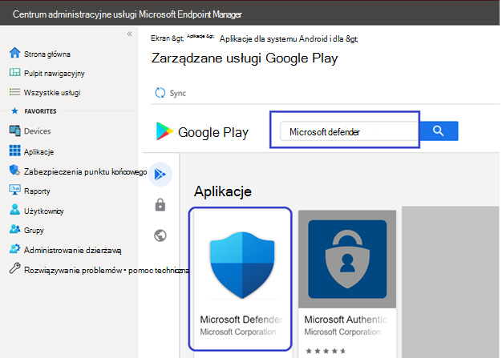
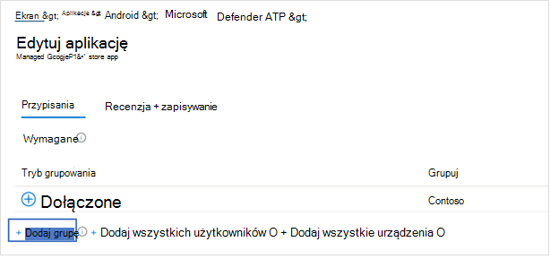

# Wdrażanie programu Microsoft Defender dla punktu końcowego w systemie Android za pomocą Microsoft Intune

[!INCLUDE [Microsoft 365 Defender rebranding](../../includes/microsoft-defender.md)]

**Dotyczy:**
- [Microsoft Defender for Endpoint Plan 1](https://go.microsoft.com/fwlink/p/?linkid=2154037)
- [Microsoft Defender for Endpoint Plan 2](https://go.microsoft.com/fwlink/p/?linkid=2154037)
- [Microsoft 365 Defender](https://go.microsoft.com/fwlink/?linkid=2118804)

> Chcesz mieć dostęp do programu Microsoft Defender dla punktu końcowego? [Zarejestruj się, aby korzystać z bezpłatnej wersji próbnej.](https://signup.microsoft.com/create-account/signup?products=7f379fee-c4f9-4278-b0a1-e4c8c2fcdf7e&ru=https://aka.ms/MDEp2OpenTrial?ocid=docs-wdatp-exposedapis-abovefoldlink)

Dowiedz się, jak wdrożyć usługę Defender for Endpoint w systemie Android Intune — Portal firmy zarejestrowanych urządzeniach. Aby uzyskać więcej informacji na temat rejestrowania urządzenia w usłudze Intune, [zobacz Rejestrowanie urządzenia](/mem/intune/user-help/enroll-device-android-company-portal).

> [!NOTE]
> **Usługa Defender for Endpoint w systemie Android jest teraz dostępna w [sklepie Google Play](https://play.google.com/store/apps/details?id=com.microsoft.scmx)**
>
> Z usługi Intune możesz połączyć się ze sklepem Google Play, aby wdrożyć aplikację Defender dla punktu końcowego w trybach rejestracji Enterprise urządzenia i Android.
>
> Aktualizacje aplikacji są automatyczne dostępne za pośrednictwem sklepu Google Play.

## Wdrażanie na urządzeniach zarejestrowanych przez administratora urządzeń

**Wdrażanie usługi Defender dla punktu końcowego w systemie Android Intune — Portal firmy — zarejestrowane urządzenia przez administratora urządzeń**

Dowiedz się, jak wdrożyć usługę Defender for Endpoint w systemie Android Intune — Portal firmy — zarejestrowanych urządzeń przez administratora urządzeń.

### Dodaj jako aplikację ze Sklepu Android

1. W [Microsoft Endpoint Manager administracyjnym](https://go.microsoft.com/fwlink/?linkid=2109431) przejdź do  \> pozycji Aplikacje **Systemu Android Dodaj** \> **aplikację \> ze sklepu Android i** wybierz pozycję **Wybierz**.

   :::image type="content" alt-text="Obraz Microsoft Endpoint Manager administracyjnego dodaj aplikację sklepu z systemem Android." source="images/mda-addandroidstoreapp.png" lightbox="images/mda-addandroidstoreapp.png":::

2. Na stronie **Dodawanie aplikacji** i w sekcji *Informacje o aplikacji* wprowadź:

   - **Nazwa**
   - **Opis**
   - **Publisher** jako microsoft.
   - **Adres URL sklepu App Store** jako https://play.google.com/store/apps/details?id=com.microsoft.scmx (Defender dla aplikacji końcowej Google Play Adres URL sklepu Google Play)

   Inne pola są opcjonalne. Wybierz pozycję **Dalej**.

   :::image type="content" alt-text="Obraz Microsoft Endpoint Manager administracyjnego dodawanie informacji o aplikacji." source="images/mda-addappinfo.png" lightbox="images/mda-addappinfo.png":::

3. W *sekcji Zadania przejdź* do sekcji **Wymagane i wybierz** pozycję **Dodaj grupę.** Następnie możesz wybrać grupy użytkowników, do których chcesz kierować element Defender dla punktu końcowego w aplikacji dla systemu Android. Wybierz **pozycję Wybierz** , a następnie **przycisk Dalej**.

    > [!NOTE]
    > Wybrana grupa użytkowników powinna zawierać zarejestrowanych użytkowników usługi Intune.
    >
    > :::image type="content" alt-text="Obraz wybranych grup Microsoft Endpoint Manager administracyjnego." source="images/363bf30f7d69a94db578e8af0ddd044b.png" lightbox="images/363bf30f7d69a94db578e8af0ddd044b.png":::

4. W sekcji **Recenzja+Tworzenie** sprawdź, czy wszystkie wprowadzone informacje są poprawne, a następnie wybierz pozycję **Utwórz**.

    W chwilę pomyślnie utworzono aplikację Defender for Endpoint i w prawym górnym rogu strony było wyświetlane powiadomienie.

    :::image type="content" alt-text="Obraz powiadomienia Microsoft Endpoint Manager administracyjnego usługi Defender dla aplikacji Endpoint." source="images/86cbe56f88bb6e93e9c63303397fc24f.png" lightbox="images/86cbe56f88bb6e93e9c63303397fc24f.png":::

5. Na wyświetlonej stronie z informacjami o aplikacji w sekcji **Monitor** wybierz pozycję Stan  instalacji urządzenia, aby sprawdzić, czy instalacja urządzenia została ukończona pomyślnie.

    :::image type="content" alt-text="Obraz instalacji Microsoft Endpoint Manager Centrum administracyjnego." source="images/513cf5d59eaaef5d2b5bc122715b5844.png" lightbox="images/513cf5d59eaaef5d2b5bc122715b5844.png":::

### Zakończenie dołączania i sprawdzanie stanu

1. Po zainstalowaniu na urządzeniu programu Defender dla punktu końcowego systemu Android zobaczysz ikonę aplikacji.

    

2. Naciśnij ikonę aplikacji Microsoft Defender for Endpoint i postępuj zgodnie z wyświetlanymi na ekranie instrukcjami, aby ukończyć dołączanie aplikacji. Szczegóły obejmują akceptowanie przez użytkownika końcowego uprawnień systemu Android wymaganych przez program Defender dla punktu końcowego w systemie Android.

3. Po pomyślnym rozpoczęciu dołączania urządzenie pojawi się na liście Urządzenia w Microsoft 365 Defender sieci.

    :::image type="content" alt-text="Obraz urządzenia w portalu programu Defender for Endpoint." source="images/9fe378a1dce0f143005c3aa53d8c4f51.png" lightbox="images/9fe378a1dce0f143005c3aa53d8c4f51.png":::

## Wdrażanie na zarejestrowanych Enterprise Android

Program Defender dla punktu końcowego w systemie Android obsługuje Enterprise Urządzenia z systemem Android.

Aby uzyskać więcej informacji na temat opcji rejestracji obsługiwanych przez usługę Intune, zobacz [Opcje rejestracji](/mem/intune/enrollment/android-enroll).

**Obecnie urządzenia będące własnością użytkownika z profilem służbowym i w pełni zarządzanymi rejestracjami urządzeń użytkowników są obsługiwane w celu wdrożenia.**

## Dodawanie programu Microsoft Defender for Endpoint w systemie Android jako aplikacji zarządzanej Google Play

Wykonaj poniższe czynności, aby dodać aplikację Microsoft Defender for Endpoint do zarządzanej usługi Google Play.

1. W [Microsoft Endpoint Manager administracyjnym](https://go.microsoft.com/fwlink/?linkid=2109431) przejdź do **pozycji** \> Aplikacje **Android Aplikacje** \> **Dodaj** i wybierz pozycję Aplikacja **zarządzana Google Play**.

    :::image type="content" alt-text="Obraz Microsoft Endpoint Manager zarządzanej przez sklep Google Play." source="images/579ff59f31f599414cedf63051628b2e.png" lightbox="images/579ff59f31f599414cedf63051628b2e.png":::

2. Na zarządzanej stronie Google Play, która zostanie ładowana później, przejdź do pola wyszukiwania i wpisz .`Microsoft Defender` Podczas wyszukiwania aplikacja Microsoft Defender for Endpoint powinna być wyświetlana w zarządzanej usłudze Google Play. Kliknij aplikację Microsoft Defender for Endpoint w wynikach wyszukiwania Aplikacji.

    

3. Na stronie Opis aplikacji, która zostanie wyświetlony następny, powinny być możliwe wyświetlanie szczegółów aplikacji w programie Defender for Endpoint. Przejrzyj informacje na stronie, a następnie wybierz pozycję **Zatwierdź**.

    > [!div class="mx-imgBorder"]
    > 

4. Otrzymasz uprawnienia, które do działania tej usługi uzyskuje program Defender for Endpoint. Przejrzyj je, a następnie wybierz pozycję **Zatwierdź**.

    

5. Zostanie przedstawiona strona Ustawienia zatwierdzania. Strona potwierdza preferencje obsługi nowych uprawnień aplikacji, o które może prosić program Defender dla punktu końcowego systemu Android. Przejrzyj wybrane opcje i wybierz preferowaną opcję. Wybierz pozycję **Gotowe**.

    Domyślnie zarządzane usługi Google Play wybiera opcję Zachowaj **zatwierdzone, gdy aplikacja zażąda nowych uprawnień**.

    > [!div class="mx-imgBorder"]
    > 

6. Po wybraniu opcji obsługi uprawnień wybierz pozycję Synchronizuj, aby zsynchronizować usługę Microsoft Defender for Endpoint z listą aplikacji.

    > [!div class="mx-imgBorder"]
    > 

7. Synchronizacja zostanie ukończona za kilka minut.

    :::image type="content" alt-text="Obraz aplikacji dla systemu Android." source="images/9fc07ffc150171f169dc6e57fe6f1c74.png" lightbox="images/9fc07ffc150171f169dc6e57fe6f1c74.png":::

8. Wybierz przycisk **Odśwież** na ekranie aplikacji systemu Android, a program Microsoft Defender for Endpoint powinien być widoczny na liście aplikacji.

    :::image type="content" alt-text="Obraz listy aplikacji dla systemu Android." source="images/fa4ac18a6333335db3775630b8e6b353.png" lightbox="images/fa4ac18a6333335db3775630b8e6b353.png":::

9. Program Defender for Endpoint obsługuje zasady konfiguracji aplikacji dla urządzeń zarządzanych za pośrednictwem usługi Intune. Funkcji tej można używać do automatycznego wykonywania uprawnień systemu Android, więc użytkownik nie musi akceptować tych uprawnień.

    1. Na stronie **Aplikacje** przejdź do strony **Zasady > zasady konfiguracji aplikacji i > dodaj > urządzenia zarządzane**.

       :::image type="content" alt-text="Obraz Microsoft Endpoint Manager administracyjnego urządzeń zarządzanych w systemie Android." source="images/android-mem.png":::

    1. Na stronie **Tworzenie zasad konfiguracji aplikacji** wprowadź następujące szczegóły:

        - Nazwa: Program Microsoft Defender dla punktu końcowego.
        - Wybierz **pozycję Android Enterprise** jako platformę.
        - Wybierz **pozycję Profil służbowy tylko** jako Typ profilu.
        - Kliknij **pozycję Wybierz aplikację**, wybierz pozycję **Microsoft Defender ATP**, wybierz przycisk **OK** , a następnie przycisk **Dalej**.

        :::image type="content" alt-text="Obraz strony Tworzenie zasad konfiguracji aplikacji." source="images/android-create-app.png" lightbox="images/android-create-app.png":::

    1. Na stronie **Ustawienia** przejdź do sekcji Uprawnienia, kliknij pozycję Dodaj, aby wyświetlić listę obsługiwanych uprawnień. W sekcji Dodawanie uprawnień wybierz następujące uprawnienia:

       - Pamięć zewnętrzna (odczyt)
       - Pamięć zewnętrzna (zapis)

       Następnie wybierz przycisk **OK**.

       :::image type="content" alt-text="Obraz zasad tworzenia aplikacji dla systemu Android." source="images/android-create-app-config.png" lightbox="images/android-create-app-config.png":::

    1. Teraz na liście powinny być wyświetlane zarówno uprawnienia, jak i autograntowanie. W tym celu wybierz pozycję Autogrant z listy rozwijanej Stan uprawnień, a następnie wybierz pozycję **Dalej**.

       :::image type="content" alt-text="Obraz automatycznego przyznawania uprawnień systemu Android — tworzenie zasad konfiguracji aplikacji." source="images/android-auto-grant.png" lightbox="images/android-auto-grant.png":::

    1. Na **stronie Zadania** wybierz grupę użytkowników, do której zostaną przypisane te zasady konfiguracji aplikacji. Kliknij **pozycję Wybierz grupy, aby dołączyć** i wybrać odpowiednie grupy, a następnie wybierz pozycję **Dalej**. Grupa wybrana w tym miejscu jest zwykle taką samą grupą, do której należy przypisać usługę Microsoft Defender dla aplikacji dla systemu Android.

       :::image type="content" alt-text="Obraz zasad tworzenia aplikacji." source="images/android-select-group.png" lightbox="images/android-select-group.png":::

    1. Na **następnej stronie Recenzja +** Utwórz przejrzyj wszystkie informacje, a następnie wybierz pozycję **Utwórz**.

        Zasady konfiguracji aplikacji dla usługi Defender dla punktu końcowego automatycznego przesyłania uprawnień magazynu są teraz przypisywane do wybranej grupy użytkowników.

        > [!div class="mx-imgBorder"]
        > 

10. Na liście Właściwości Zadań  \>  \> \> Edytuj wybierz aplikację **Microsoft Defender ATP****.**

    :::image type="content" alt-text="Obraz listy aplikacji." source="images/mda-properties.png" lightbox="images/mda-properties.png":::

11. Przypisz aplikację jako *wymaganą* do grupy użytkowników. Jest on automatycznie instalowany w *profilu służbowym* podczas następnej synchronizacji urządzenia za pośrednictwem Portal firmy aplikacji. To zadanie można wykonać, przechodząc do sekcji *Wymagane,* \> **dodaj grupę,** wybierając grupę użytkowników i klikając pozycję **Wybierz**.

    > [!div class="mx-imgBorder"]
    > 

12. Na stronie **Edytowanie aplikacji** przejrzyj wszystkie informacje wprowadzone powyżej. Następnie wybierz pozycję **Recenzja + Zapisz, a** następnie **ponownie zapisz,** aby rozpocząć zadanie.

### Automatyczna konfiguracja always-on VPN

Program Defender for Endpoint obsługuje zasady konfiguracji urządzeń dla urządzeń zarządzanych za pośrednictwem usługi Intune. Tę funkcję można wykorzystać do automatycznej konfiguracji zawsze włączonych sieci **VPN** na Enterprise Android Enterprise zarejestrowanych urządzeniach, więc użytkownik końcowy nie musi skonfigurować usługi VPN podczas dołączania.

1. Na **urządzeniach** wybierz **pozycję Profile konfiguracji Utwórz** \> **platformę** \> **profilu dla** \> **systemu Android Enterprise**

   W **zależności od** typu rejestracji urządzenia wybierz ograniczenia dotyczące urządzeń w jednym z następujących obszarze:
   - **W pełni zarządzany, dedykowany i Corporate-Owned służbowy**
   - **Profil służbowy użytkownika**

   Wybierz pozycję **Utwórz**.

   :::image type="content" alt-text="Obraz profilu konfiguracji urządzeń Utwórz." source="images/1autosetupofvpn.png":::

2. **Konfiguracja Ustawienia** podaj **nazwę i** **opis,** aby jednoznacznie zidentyfikować profil konfiguracji.

   :::image type="content" alt-text="Obraz profilu konfiguracji urządzeń Nazwa i opis." source="images/2autosetupofvpn.png":::

3. Wybierz **pozycję Łączność** i skonfiguruj sieć VPN:

   - Włącz **opcję Zawsze w sieci VPN**

     Skonfiguruj klienta VPN w profilu służbowym, aby automatycznie łączył się z siecią VPN i nawiązywał z siecią VPN, jeśli to możliwe. Na danym urządzeniu można skonfigurować tylko jednego klienta VPN dla zawsze na danym urządzeniu, dlatego upewnij się, że na jednym urządzeniu nie wdrożono więcej niż jednej zawsze wdrażanych zasad VPN.

   - Wybierz **pozycję Niestandardowe** na liście rozwijanej klienta sieci VPN

     W tym przypadku niestandardowa sieć VPN to usługa Defender for Endpoint VPN, która jest używana do zapewnienia funkcji ochrony sieci Web.

     > [!NOTE]
     > Aplikacja Microsoft Defender dla punktu końcowego musi być zainstalowana na urządzeniu użytkownika, aby umożliwić działanie automatycznej konfiguracji tego połączenia VPN.

   - Wprowadź **identyfikator pakietu aplikacji** Microsoft Defender for Endpoint w sklepie Google Play. W przypadku adresu URL <https://play.google.com/store/apps/details?id=com.microsoft.scmx>aplikacji Defender identyfikator pakietu to **com.microsoft.scmx**

   - **Tryb blokowania** Nieskonfigurowane (domyślne)

     
      :::image type="content" alt-text="Obraz profilu konfiguracji urządzeń umożliwiających opcję Zawsze przy sieci VPN." source="images/3autosetupofvpn.png":::

4. **Zadanie**

   Na **stronie Zadania** wybierz grupę użytkowników, do której zostaną przypisane te zasady konfiguracji aplikacji. Wybierz **pozycję Wybierz grupy** do dołączyć i wybrać odpowiednie grupy, a następnie wybierz przycisk **Dalej**. Grupa wybrana w tym miejscu jest zwykle taką samą grupą, do której należy przypisać usługę Microsoft Defender dla aplikacji dla systemu Android.

   

5. Na **następnej stronie Recenzja +** Utwórz przejrzyj wszystkie informacje, a następnie wybierz pozycję **Utwórz**.
Profil konfiguracji urządzenia zostanie przypisany do wybranej grupy użytkowników.

   

## Sprawdzanie stanu i pełne dołączanie

1. Potwierdź stan instalacji programu Microsoft Defender for Endpoint w systemie Android, klikając **stan instalacji urządzenia**. Sprawdź, czy urządzenie jest wyświetlane w tym miejscu.

    > [!div class="mx-imgBorder"]
    > 

2. Na urządzeniu możesz sprawdzić stan dołączania, przechodząc do **profilu służbowego**. Upewnij się, że program Defender for Endpoint jest dostępny i że jesteś zarejestrowany na urządzeniach należących **do Ciebie z profilem służbowym**. Jeśli korzystasz z w pełni zarządzanego urządzenia użytkownika należącego do firmy, będziesz mieć pojedynczy profil na urządzeniu **,** na którym możesz potwierdzić, że program Defender for Endpoint jest dostępny.

    

3. Po zainstalowaniu aplikacji otwórz ją i zaakceptuj odpowiednie uprawnienia, a wówczas dołączanie powinno się powiodło.

    

4. Na tym etapie urządzenie jest pomyślnie dołączane do programu Defender dla punktu końcowego w systemie Android. Możesz to sprawdzić w portalu [Microsoft 365 Defender,](https://security.microsoft.com) przechodząc do strony **Spis** urządzeń.

    :::image type="content" alt-text="Obraz portalu programu Microsoft Defender for Endpoint." source="images/9fe378a1dce0f143005c3aa53d8c4f51.png" lightbox="images/9fe378a1dce0f143005c3aa53d8c4f51.png":::

## Tematy pokrewne

- [Omówienie programu Microsoft Defender dla punktu końcowego w systemie Android](microsoft-defender-endpoint-android.md)
- [Konfigurowanie programu Microsoft Defender dla funkcji punktu końcowego w systemie Android](android-configure.md)
