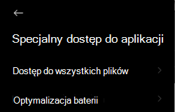

# Rozwiązywanie problemów dotyczących programu Microsoft Defender dla punktu końcowego w systemie Android

[!INCLUDE [Microsoft 365 Defender rebranding](../../includes/microsoft-defender.md)]

**Dotyczy:**
- [Microsoft Defender for Endpoint Plan 1](https://go.microsoft.com/fwlink/p/?linkid=2154037)
- [Microsoft Defender for Endpoint Plan 2](https://go.microsoft.com/fwlink/p/?linkid=2154037)
- [Microsoft 365 Defender](https://go.microsoft.com/fwlink/?linkid=2118804)

> Chcesz mieć dostęp do programu Microsoft Defender dla punktu końcowego? [Zarejestruj się, aby korzystać z bezpłatnej wersji próbnej.](https://signup.microsoft.com/create-account/signup?products=7f379fee-c4f9-4278-b0a1-e4c8c2fcdf7e&ru=https://aka.ms/MDEp2OpenTrial?ocid=docs-wdatp-exposedapis-abovefoldlink)

Podczas dołączania do urządzenia po zainstalowaniu aplikacji mogą pojawić się problemy z logowaniem.

Podczas dołączania po zainstalowaniu aplikacji na urządzeniu mogą wystąpić problemy z logowaniem.

W tym artykule przedstawiono rozwiązania problemów z logowaniem.

## Logowanie nie powiodło się — nieoczekiwany błąd

**Logowanie nie powiodło się: Nieoczekiwany** *błąd, spróbuj później*

:::image type="content" alt-text="Obraz błędu logowania Nieoczekiwany błąd." source="images/f9c3bad127d636c1f150d79814f35d4c.png":::

**Komunikat:**

Nieoczekiwany błąd, spróbuj później

**Przyczyna:**

Na urządzeniu jest zainstalowana starsza wersja aplikacji "Microsoft Authenticator".

**Rozwiązanie:**

Zainstaluj najnowszą wersję i [najnowszą Microsoft Authenticator](https://play.google.com/store/apps/details?id=com.azure.authenticator) ze Sklepu Google Play i spróbuj ponownie.

## Logowanie nie powiodło się — nieprawidłowa licencja

**Logowanie nie powiodło się:** *Nieprawidłowa licencja, skontaktuj się z administratorem*

:::image type="content" alt-text="Obraz: logowanie nie powiodło się, skontaktuj się z administratorem." source="images/920e433f440fa1d3d298e6a2a43d4811.png":::

**Komunikat: Nieprawidłowa** *licencja, skontaktuj się z administratorem*

**Przyczyna:**

Nie masz przypisanej Microsoft 365 lub Twoja organizacja nie ma licencji na usługę Microsoft 365 Enterprise subskrypcji.

**Rozwiązanie:**

Aby uzyskać pomoc, skontaktuj się z administratorem.

## Zgłoś niebezpieczną witrynę

Witryny wyłudzujące informacje spersonifikują zaufane witryny internetowe w celu uzyskania informacji osobistych lub finansowych. Odwiedź stronę [Opinie na temat ochrony sieci](https://www.microsoft.com/wdsi/filesubmission/exploitguard/networkprotection) , jeśli chcesz zgłosić witrynę internetową, która może być witryną wyłudzającą informacje.

## Strony wyłudzania informacji nie są blokowane na niektórych urządzeniach OEM

**Dotyczy:** Tylko konkretne OEM

- **Xiaomi**

Wyłudzanie informacji i niebezpieczne zagrożenia w sieci Web wykrywane przez usługę Defender dla punktu końcowego systemu Android nie są blokowane na niektórych urządzeniach Xiaomi. Poniższe funkcje nie działają na tych urządzeniach.

**Przyczyna:**

Urządzenia Xiaomi zawierają nowy model uprawnień. Zapobiega to wyświetlaniu wyskakujących okien programu Defender dla punktu końcowego systemu Android, gdy działa w tle.

Uprawnienia urządzeń Xiaomi: "Wyświetlanie okien podręcznych podczas pracy w tle".

**Rozwiązanie:**

Włącz wymagane uprawnienia na urządzeniach Xiaomi.

- Wyświetlanie wyskakujących okien podczas pracy w tle.

## Nie można zezwolić na uprawnienie do "Trwałej ochrony" podczas dołączania na niektórych urządzeniach OEM

**Dotyczy:** Tylko określone urządzenia OEM.

- **Xiaomi z systemem Android 11**

Aplikacja Defender pyta o uprawnienia optymalizacji baterii/trwałej ochrony na urządzeniach w ramach dołączania aplikacji, a  wybranie opcji Zezwalaj zwraca błąd, że nie można ustawić uprawnienia. Dotyczy ona tylko ostatniego uprawnienia o nazwie "Trwała ochrona". 

**Przyczyna:**

Firma Xiaomi zmieniła uprawnienia do optymalizacji baterii w systemie Android 11. Program Defender for Endpoint nie może skonfigurować tego ustawienia w celu ignorowania optymalizacji baterii.

**Rozwiązanie:**

Współpracujemy z producentem OEM nad znalezieniem rozwiązania umożliwiającego włączenie tego uprawnienia z poziomu ekranu dołączania aplikacji. Zaktualizujemy dokumentację, gdy problem zostanie rozwiązany.
Użytkownicy mogą wykonać następujące czynności, aby włączyć te same uprawnienia z poziomu ustawień urządzenia: 

1. Przejdź do **Ustawienia** urządzenia.

2. Wyszukaj i wybierz pozycję **Optymalizacja baterii**.

   

3. W **special app access (Specjalny dostęp do** aplikacji) wybierz **pozycję Battery Optimization (Optymalizacja baterii**).

   

4. Zmień menu rozwijane, aby wyświetlić **wszystkie aplikacje**.

   

   

5. Znajdź pozycję "Microsoft Defender for Endpoint" (Program Microsoft Defender dla punktu końcowego) i wybierz **pozycję Don't Optimize (Nie optymalizuj**).

   

Wróć do ekranu dołączania do programu Microsoft Defender for Endpoint, wybierz pozycję **Zezwalaj**, a nastąpi przekierowanie do ekranu pulpitu nawigacyjnego.

## Wysyłanie opinii w aplikacji

Jeśli użytkownik napotyka problem, który nie został jeszcze rozwiązany w powyższych sekcjach lub nie może rozwiązać problemu przy użyciu wymienionych czynności, może przekazać opinię w aplikacji wraz z danymi **diagnostycznmi**. Nasz zespół może następnie zbadać dzienniki w celu podania odpowiedniego rozwiązania. Użytkownicy mogą wykonać te same czynności:

1.  Otwórz aplikację **MDE na** urządzeniu i kliknij **ikonę** profilu w lewym górnym rogu.

    :::image type="content" alt-text="Kliknij ikonę profilu." source="images/select-profile-icon-1.jpg":::

2.  Wybierz pozycję "Pomoc &".

    :::image type="content" alt-text="Wybierz pomoc i opinie." source="images/selecthelpandfeedback2.png":::

3.  Wybierz pozycję "Wyślij opinię do firmy Microsoft".

    :::image type="content" alt-text="Wybierz pozycję Wyślij opinię do firmy Microsoft." source="images/send-feedback-to-microsoft-3.jpg":::

4.  Wybierz jedną z dostępnych opcji. Aby zgłosić problem, wybierz pozycję "Chcę zgłosić problem".

    :::image type="content" alt-text="Zgłaszanie problemu." source="images/report-issue-4.jpg":::

5.  Podaj szczegóły problemu, z którym masz do czynienia, i zaznacz pole wyboru "Wyślij dane diagnostyczne". Zalecamy skorzystanie z ustawienia "Uwzględnij swój adres e-mail", aby zespół może się z Toem wrócić do Ciebie w celu rozwiązania lub rozwiązania problemu.

    :::image type="content" alt-text="Dodaj szczegóły i dołącz dane diagnostyczne." source="images/finalsubmit5.png":::

6.  Kliknij pozycję "Prześlij", aby pomyślnie wysłać opinię.
