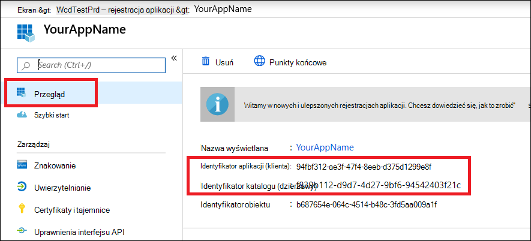

# <a name="microsoft-defender-for-endpoint-api---hello-world"></a>Microsoft Defender for Endpoint API — Hello World

[!INCLUDE [Microsoft 365 Defender rebranding](../../includes/microsoft-defender.md)]


**Dotyczy:**
- [Microsoft Defender for Endpoint Plan 1](https://go.microsoft.com/fwlink/?linkid=2154037)
- [Microsoft Defender for Endpoint Plan 2](https://go.microsoft.com/fwlink/?linkid=2154037)


>Chcesz mieć dostęp do programu Microsoft Defender dla punktu końcowego? [Zarejestruj się, aby korzystać z bezpłatnej wersji próbnej.](https://signup.microsoft.com/create-account/signup?products=7f379fee-c4f9-4278-b0a1-e4c8c2fcdf7e&ru=https://aka.ms/MDEp2OpenTrial?ocid=docs-wdatp-exposedapis-abovefoldlink)

[!include[Microsoft Defender for Endpoint API URIs for US Government](../../includes/microsoft-defender-api-usgov.md)]

[!include[Improve request performance](../../includes/improve-request-performance.md)]


## <a name="get-alerts-using-a-simple-powershell-script"></a>Uzyskiwanie alertów przy użyciu prostego skryptu programu PowerShell

### <a name="how-long-it-takes-to-go-through-this-example"></a>Ile trwa przebycie tego przykładu?

Procedura trwa tylko 5 minut w dwóch krokach:

- Rejestracja aplikacji
- Przykłady: wymaga tylko kopiowania/wklejania krótkiego skryptu programu PowerShell

### <a name="do-i-need-a-permission-to-connect"></a>Czy potrzebuję uprawnienia do nawiązywania połączenia?

Na etapie rejestracji aplikacji musisz mieć rolę **administratora** globalnego w dzierżawie usługi Azure Active Directory (Azure AD).

### <a name="step-1---create-an-app-in-azure-active-directory"></a>Krok 1. Tworzenie aplikacji w aplikacji Azure Active Directory

1. Zaloguj się do [platformy Azure](https://portal.azure.com) u użytkownika **administratora globalnego** .

2. Przejdź do **Azure Active Directory** \> **Rejestracja aplikacji Nowa** \> **rejestracja**.

   :::image type="content" alt-text="Obraz Microsoft Azure nawigacji do rejestracji aplikacji." source="images/atp-azure-new-app2.png" lightbox="images/atp-azure-new-app2.png":::

3. W formularzu rejestracji wybierz nazwę aplikacji, a następnie kliknij pozycję **Zarejestruj**.

4. Zezwalaj aplikacji na dostęp do usługi Defender for Endpoint i przypisz jej **uprawnienie "Czytaj wszystkie alerty** ":

   - Na stronie aplikacji kliknij pozycję Uprawnienia **interfejsów API** Dodaj interfejsy **API**  \> \> uprawnień używane przez moją organizację, > **wpisz WindowsDefenderATP**, a następnie kliknij pozycję **WindowsDefenderATP**.

     > [!NOTE]
     > Funkcja WindowsDefenderATP nie jest wyświetlana na oryginalnej liście. Aby tekst był wyświetlany, musisz rozpocząć pisanie jego nazwy w polu tekstowym.

     :::image type="content" alt-text="Obraz dostępu do interfejsu API i wybranego interfejsu API1." source="images/add-permission.png" lightbox="images/add-permission.png":::

   - Wybierz **pozycję Alert uprawnień** **aplikacji.Odczyt**\>.> kliknij **pozycję Dodaj uprawnienia**.

     :::image type="content" alt-text="Obraz dostępu do interfejsu API i wybranego interfejsu API2." source="images/application-permissions.png" lightbox="images/application-permissions.png":::

     > [!IMPORTANT]
     > Należy wybrać odpowiednie uprawnienia. "Czytaj wszystkie alerty" to tylko przykład!

     Przykład:

     - Aby [uruchomić zapytania zaawansowane](run-advanced-query-api.md), wybierz uprawnienie Uruchamianie zapytań zaawansowanych.
     - Aby [odizolować komputer](isolate-machine.md), wybierz uprawnienie "Wyizoluj komputer".
     - Aby ustalić, jakich uprawnień potrzebujesz, zapoznaj się z sekcją **Uprawnienia** w interfejsie API, który chcesz wywołać.

5. Kliknij **pozycję Ut przyznaj zgodę**.

   > [!NOTE]
   > Za każdym razem, gdy dodajesz uprawnienie, musisz **kliknąć pozycję** Udawaj zgodę, aby nowe uprawnienie było skuteczne.

   

6. Dodaj do aplikacji klucz tajny.

    Kliknij **pozycję Certyfikaty & sekrety**, dodaj opis do tajemnicy, a następnie kliknij przycisk **Dodaj**.

    > [!IMPORTANT]
    > Po kliknięciu przycisku Dodaj **skopiuj wygenerowaną wartość tajnych**. Po opuszczeniu programu nie będzie można ich odzyskać!

    

7. Zategolij swój identyfikator aplikacji i identyfikator dzierżawy.

   Na stronie aplikacji przejdź do strony **Omówienie i** skopiuj następujące elementy:

   

Ukończono! Aplikacja została pomyślnie zarejestrowana!

### <a name="step-2---get-a-token-using-the-app-and-use-this-token-to-access-the-api"></a>Krok 2. Uzyskaj token za pomocą aplikacji i użyj go, aby uzyskać dostęp do interfejsu API.

- Skopiuj poniższy skrypt do środowiska PowerShell ISE lub edytora tekstów i zapisz **go jakoGet-Token.ps1**.
- Uruchomienie tego skryptu spowoduje wygenerowanie tokenu i zapisanie go w folderze roboczy pod nazwą **Latest-token.txt**.

   ```powershell
   # That code gets the App Context Token and save it to a file named "Latest-token.txt" under the current directory
   # Paste below your Tenant ID, App ID and App Secret (App key).

   $tenantId = '' ### Paste your tenant ID here
   $appId = '' ### Paste your Application ID here
   $appSecret = '' ### Paste your Application secret here

   $resourceAppIdUri = 'https://api.securitycenter.microsoft.com'
   $oAuthUri = "https://login.microsoftonline.com/$TenantId/oauth2/token"
   $authBody = [Ordered] @{
       resource = "$resourceAppIdUri"
       client_id = "$appId"
       client_secret = "$appSecret"
       grant_type = 'client_credentials'
   }
   $authResponse = Invoke-RestMethod -Method Post -Uri $oAuthUri -Body $authBody -ErrorAction Stop
   $token = $authResponse.access_token
   Out-File -FilePath "./Latest-token.txt" -InputObject $token
   return $token
   ```

- Sprawdzanie sanity:
  - Uruchom skrypt.
  - W przeglądarce przejdź do: <https://jwt.ms/>.
  - Skopiuj token (zawartość pliku Latest-token.txt).
  - Wklej w górnym polu.
  - Odszukaj sekcję "role". Znajdź rolę _Alert.Read.All_ .

  :::image type="content" alt-text="Obraz jwt.ms." source="images/api-jwt-ms.png" lightbox="images/api-jwt-ms.png":::

### <a name="lets-get-the-alerts"></a>Pozwala na uzyskiwanie alertów!

- Poniższy skrypt **użyje polecenia** Get-Token.ps1dostępu do interfejsu API i otrzyma alerty z ostatnich 48 godzin.
- Zapisz ten skrypt w tym samym folderze, w którym został zapisany **poprzedniGet-Token.ps1**.
- Skrypt tworzy dwa pliki (json i csv) z danymi w tym samym folderze co skrypty.

  ```powershell
  # Returns Alerts created in the past 48 hours.

  $token = ./Get-Token.ps1       #run the script Get-Token.ps1  - make sure you are running this script from the same folder of Get-Token.ps1

  # Get Alert from the last 48 hours. Make sure you have alerts in that time frame.
  $dateTime = (Get-Date).ToUniversalTime().AddHours(-48).ToString("o")

  # The URL contains the type of query and the time filter we create above
  # Read more about other query options and filters at   Https://TBD- add the documentation link
  $url = "https://api.securitycenter.microsoft.com/api/alerts?`$filter=alertCreationTime ge $dateTime"

  # Set the WebRequest headers
  $headers = @{
      'Content-Type' = 'application/json'
      Accept = 'application/json'
      Authorization = "Bearer $token"
  }

  # Send the webrequest and get the results.
  $response = Invoke-WebRequest -Method Get -Uri $url -Headers $headers -ErrorAction Stop

  # Extract the alerts from the results.
  $alerts =  ($response | ConvertFrom-Json).value | ConvertTo-Json

  # Get string with the execution time. We concatenate that string to the output file to avoid overwrite the file
  $dateTimeForFileName = Get-Date -Format o | foreach {$_ -replace ":", "."}

  # Save the result as json and as csv
  $outputJsonPath = "./Latest Alerts $dateTimeForFileName.json"
  $outputCsvPath = "./Latest Alerts $dateTimeForFileName.csv"

  Out-File -FilePath $outputJsonPath -InputObject $alerts
  ($alerts | ConvertFrom-Json) | Export-CSV $outputCsvPath -NoTypeInformation
  ```

Wszystko gotowe! Udało Ci się:

- Utworzono, zarejestrowano i utworzono aplikację
- Nadała tej aplikacji uprawnienie do czytania alertów
- Połączony interfejs API
- Zwracanie alertów utworzonych w ciągu ostatnich 48 godzin za pomocą skryptu programu PowerShell

## <a name="related-topic"></a>Temat pokrewny

- [Interfejsy API programu Microsoft Defender dla punktów końcowych](exposed-apis-list.md)
- [Uzyskiwanie dostępu do programu Microsoft Defender dla punktu końcowego w kontekście aplikacji](exposed-apis-create-app-webapp.md)
- [Dostęp do programu Microsoft Defender dla punktu końcowego z kontekstem użytkownika](exposed-apis-create-app-nativeapp.md)
