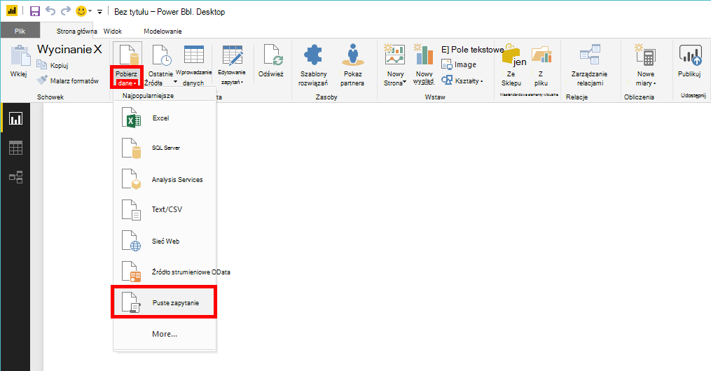
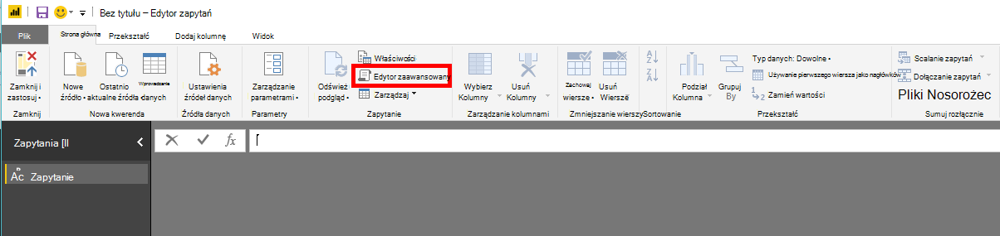
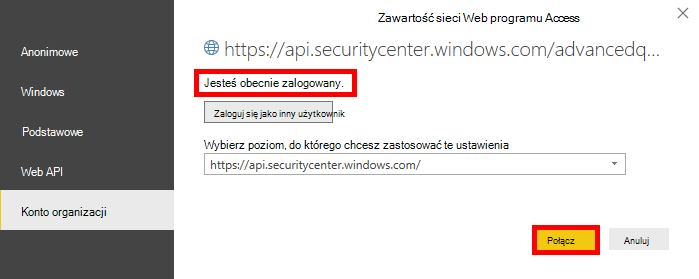

# <a name="create-custom-reports-using-power-bi"></a>Tworzenie raportów niestandardowych przy użyciu Power BI

[!INCLUDE [Microsoft 365 Defender rebranding](../../includes/microsoft-defender.md)]

**Dotyczy:**
- [Microsoft Defender for Endpoint Plan 2](https://go.microsoft.com/fwlink/p/?linkid=2154037)
- [Microsoft 365 Defender](https://go.microsoft.com/fwlink/?linkid=2118804)


- Chcesz mieć dostęp do programu Microsoft Defender dla punktu końcowego? [Zarejestruj się, aby korzystać z bezpłatnej wersji próbnej.](https://signup.microsoft.com/create-account/signup?products=7f379fee-c4f9-4278-b0a1-e4c8c2fcdf7e&ru=https://aka.ms/MDEp2OpenTrial?ocid=docs-wdatp-exposedapis-abovefoldlink)

[!include[Microsoft Defender for Endpoint API URIs for US Government](../../includes/microsoft-defender-api-usgov.md)]

[!include[Improve request performance](../../includes/improve-request-performance.md)]

W tej sekcji dowiesz się, jak utworzyć raport Power BI usługi Defender dla interfejsów API punktów końcowych.

W pierwszym przykładzie pokazano, jak połączyć program Power BI z interfejsem API zaawansowanego wyszukiwania, a drugi przykład przedstawia połączenie z naszymi interfejsami API OData, takimi jak akcje komputera lub alerty.

## <a name="connect-power-bi-to-advanced-hunting-api"></a>Połączenie Power BI interfejsu API zaawansowanego wyszukiwania

- Otwórz usługę Microsoft Power BI

- Kliknij **pozycję Pobierz puste** \> **zapytanie danych**

  

- Kliknij **pozycję Edytor zaawansowany**

  

- Skopiuj poniższe polecenie i wklej je w edytorze:

```
    let
        AdvancedHuntingQuery = "DeviceEvents | where ActionType contains 'Anti' | limit 20",

        HuntingUrl = "https://api.securitycenter.microsoft.com/api/advancedqueries",

        Response = Json.Document(Web.Contents(HuntingUrl, [Query=[key=AdvancedHuntingQuery]])),

        TypeMap = #table(
            { "Type", "PowerBiType" },
            {
                { "Double",   Double.Type },
                { "Int64",    Int64.Type },
                { "Int32",    Int32.Type },
                { "Int16",    Int16.Type },
                { "UInt64",   Number.Type },
                { "UInt32",   Number.Type },
                { "UInt16",   Number.Type },
                { "Byte",     Byte.Type },
                { "Single",   Single.Type },
                { "Decimal",  Decimal.Type },
                { "TimeSpan", Duration.Type },
                { "DateTime", DateTimeZone.Type },
                { "String",   Text.Type },
                { "Boolean",  Logical.Type },
                { "SByte",    Logical.Type },
                { "Guid",     Text.Type }
            }),

        Schema = Table.FromRecords(Response[Schema]),
        TypedSchema = Table.Join(Table.SelectColumns(Schema, {"Name", "Type"}), {"Type"}, TypeMap , {"Type"}),
        Results = Response[Results],
        Rows = Table.FromRecords(Results, Schema[Name]),
        Table = Table.TransformColumnTypes(Rows, Table.ToList(TypedSchema, (c) => {c{0}, c{2}}))

    in Table
```

- Kliknij **przycisk Gotowe.**

- Kliknij **pozycję Edytuj poświadczenia**

    

- Wybierz **konto organizacji Zaloguj** \> **się**

    

- Wprowadź poświadczenia i poczekaj na zalogowanie się

- Kliknij **Połączenie**

    

- Teraz wyniki zapytania będą wyświetlane jako tabela i będzie można na nim tworzyć wizualizacje.

- Możesz zduplikować tę tabelę, zmienić jej nazwę i edytować wewnątrz zapytanie zaawansowanego wyszukiwania, aby uzyskać dowolne dane.

## <a name="connect-power-bi-to-odata-apis"></a>Połączenie Power BI interfejsów API OData

- Jedyna różnica w  względem powyższego przykładu to zapytanie wewnątrz edytora.

- Skopiuj poniższe polecenie i wklej je w edytorze, aby przeciągnąć **wszystkie akcje komputera** z Twojej organizacji:

```
    let

        Query = "MachineActions",

        Source = OData.Feed("https://api.securitycenter.microsoft.com/api/" & Query, null, [Implementation="2.0", MoreColumns=true])
    in
        Source
```

- W przypadku alertów **i komputerów** możesz to **zrobić tak samo**.
- Zapytania OData można też używać do filtrowania zapytań — zobacz [Korzystanie z zapytań OData.](exposed-apis-odata-samples.md)

## <a name="power-bi-dashboard-samples-in-github"></a>Power BI pulpitu nawigacyjnego w programie GitHub

Aby uzyskać więcej informacji, [zobacz Power BI szablonów raportów](https://github.com/microsoft/MicrosoftDefenderATP-PowerBI).

## <a name="sample-reports"></a>Przykładowe raporty

Zobacz przykłady raportów programu Microsoft Defender dla Power BI końcowych. Aby uzyskać więcej informacji, zobacz [Przeglądanie przykładowych kodów](/samples/browse/?products=mdatp).

## <a name="related-topics"></a>Tematy pokrewne

- [Interfejsy API usługi Defender dla punktów końcowych](apis-intro.md)
- [Zaawansowany interfejs API łowiectwo](run-advanced-query-api.md)
- [Używanie zapytań OData](exposed-apis-odata-samples.md)
