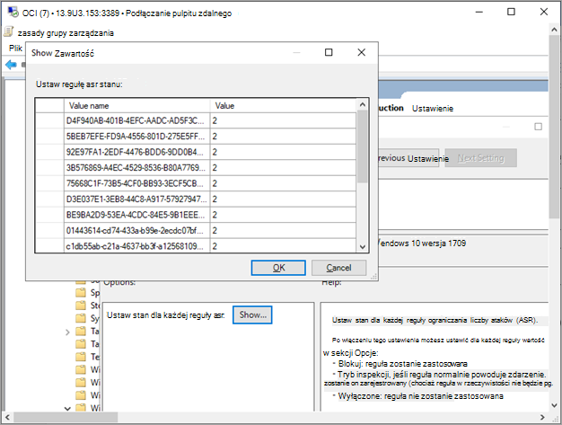

# Na urządzeniach Windows przy użyciu aplikacji zasady grupy 

[!INCLUDE [Microsoft 365 Defender rebranding](../../includes/microsoft-defender.md)]

[!include[Prerelease information](../../includes/prerelease.md)]

**Dotyczy:**

- zasady grupy
- [Microsoft Defender for Endpoint Plan 2](https://go.microsoft.com/fwlink/p/?linkid=2154037)
- [Microsoft 365 Defender](https://go.microsoft.com/fwlink/?linkid=2118804)

> Chcesz mieć dostęp do usługi Defender dla punktu końcowego? [Zarejestruj się, aby korzystać z bezpłatnej wersji próbnej.](https://signup.microsoft.com/create-account/signup?products=7f379fee-c4f9-4278-b0a1-e4c8c2fcdf7e&ru=https://aka.ms/MDEp2OpenTrial?ocid=docs-wdatp-configureendpointsgp-abovefoldlink)

> [!NOTE]
> Aby wdrożyć zasady grupy GP, musisz korzystać z programu Windows Server 2008 R2 lub nowszego.
>
> W przypadku Windows Server 2019 i Windows Server 2022 może być konieczne zastąpienie katalogu NT AUTHORITY\Well-Known-System-Account zarządzaniem NT AUTHORITY\SYSTEM pliku XML, który jest zasady grupy preferencji serwera.

> [!NOTE]
> Jeśli używasz nowego, ujednoliconego rozwiązania Microsoft Defender for Endpoint dla wersji Windows Server 2012 R2 i 2016, upewnij się, że używasz najnowszych plików ADMX w Twoim centralnym magazynie, aby uzyskać dostęp do odpowiednich opcji zasad programu Microsoft Defender dla punktu końcowego. Informacje na [temat tworzenia i](/troubleshoot/windows-client/group-policy/create-and-manage-central-store) zarządzania centralną magazynem witryn zasady grupy administracyjnego w programie Windows oraz pobierania najnowszych plików do używania z **Windows 10.**

Zapoznaj się z [plikiem PDF](https://download.microsoft.com/download/5/6/0/5609001f-b8ae-412f-89eb-643976f6b79c/mde-deployment-strategy.pdf) [Visio](https://download.microsoft.com/download/5/6/0/5609001f-b8ae-412f-89eb-643976f6b79c/mde-deployment-strategy.vsdx) aby zobaczyć różne ścieżki wdrożenia programu Defender dla punktu końcowego.

1. Otwórz plik pakietu konfiguracji GP (`WindowsDefenderATPOnboardingPackage.zip`), który został pobrany z kreatora dołączania usługi. Możesz również pobrać pakiet z portalu <a href="https://go.microsoft.com/fwlink/p/?linkid=2077139" target="_blank">Microsoft 365 Defender witryny</a>:

    1. W okienku nawigacji wybierz pozycję **Ustawienia** >  **EndpointsDevice** >  **managementOnboarding**  > .

    1. Wybierz system operacyjny.

    1. W polu **Metoda wdrażania** wybierz pozycję **Zasady grupy**.

    1. Kliknij **pozycję Pobierz pakiet** i zapisz .zip pliku.

2. Wyodrębnianie zawartości pliku .zip do udostępnionej lokalizacji tylko do odczytu, do której dostęp jest możliwy na urządzeniu. Powinien mieć folder o nazwie *OptionalParamsPolicy* i plik *WindowsDefenderATPOnboardingScript.cmd*.

3. Aby utworzyć nowy obiekt zasad grupy, otwórz zasady grupy [zarządzania](/internet-explorer/ie11-deploy-guide/group-policy-and-group-policy-mgmt-console-ie11) danymi (GPMC), kliknij prawym przyciskiem myszy zasady grupy **obiekty** , które chcesz skonfigurować, a następnie kliknij pozycję **Nowy**. Wprowadź nazwę nowego serwera zasad grupy w wyświetlonym oknie dialogowym i kliknij przycisk **OK**.

4. Otwórz [konsolę zasady grupy zarządzania](/internet-explorer/ie11-deploy-guide/group-policy-and-group-policy-mgmt-console-ie11) (GPMC), kliknij prawym przyciskiem myszy obiekt zasady grupy obiekt (GPO), który chcesz skonfigurować, a następnie kliknij polecenie **Edytuj**.

5. W **edytorze zasady grupy zarządzaniem** przejdź do opcji Konfiguracja **komputera,** Preferencje **, a** następnie **Ustawienia Panelu sterowania**.

6. Kliknij prawym przyciskiem **myszy pozycję Zaplanowane zadania**, wskaż pozycję **Nowe**, a następnie kliknij pozycję **Zadanie natychmiastowe (co najmniej Windows 7).**

7. W **oknie** Zadanie, które zostanie otwarte, przejdź do **karty** Ogólne. W **obszarze Opcje zabezpieczeń** kliknij **pozycję Zmień użytkownika lub grupę** i wpisz SYSTEM, a następnie kliknij pozycję **Sprawdź nazwy** , a następnie kliknij **przycisk OK**. Nt AUTHORITY\SYSTEM pojawi się jako konto użytkownika, jako które będzie działać zadanie.

8. Zaznacz **pole wyboru Uruchom** niezależnie od tego, czy użytkownik jest zalogowany, i zaznacz **pole wyboru Uruchom z najwyższymi uprawnieniami** .

9. W polu Nazwa wpisz odpowiednią nazwę dla zaplanowanego zadania (na przykład Defender do wdrożenia punktu końcowego).

10. Przejdź do karty **Akcje** i wybierz pozycję **Nowy...** Upewnij się **, że w** polu Akcja jest wybrana opcja **Uruchom program.** Wprowadź ścieżkę UNC, używając w pełni kwalifikowanej nazwy domeny (FQDN) serwera plików udostępnionego pliku *WindowsDefenderATPOnboardingScript.cmd* .

11. Wybierz **przycisk OK** i zamknij wszystkie otwarte okna GPMC.

12. Aby połączyć element zasad grupy z jednostką jednostki organizacyjnej, kliknij prawym przyciskiem myszy i wybierz polecenie **Połącz istniejący element zasad grupy**. W wyświetlonym oknie dialogowym wybierz obiekt, zasady grupy, który chcesz połączyć. Kliknij przycisk **OK**.

> [!TIP]
> Po włoceniu urządzenia możesz uruchomić test wykrywania w celu sprawdzenia, czy urządzenie jest prawidłowo podłączone do usługi. Aby uzyskać więcej informacji, zobacz Uruchamianie testu wykrywania na nowo włodarzony [program Defender dla urządzenia końcowego](run-detection-test.md).

## Dodatkowe ustawienia konfiguracji programu Defender dla punktu końcowego

Dla każdego urządzenia możesz określić, czy próbki mogą być pobierane z urządzenia w przypadku złożenia żądania Microsoft 365 Defender w celu przesłanie pliku do dogłębnej analizy.

Możesz użyć funkcji zasady grupy (GP) do skonfigurowania ustawień, takich jak ustawienia udostępniania przykładowego używanego w funkcji analizy dogłębnej.

### Konfigurowanie ustawień kolekcji przykładowych

1. Na urządzeniu do zarządzania GP skopiuj z pakietu konfiguracyjne następujące pliki:

    - Kopiowanie _pliku AtpConfiguration.admx_ do _pliku C:\\Windows\\ PolicyDefinitions_

    - Kopiowanie _pliku AtpConfiguration.adml_ do _pliku C:\\Windows\\ PolicyDefinitionsen-US\\_

    Jeśli korzystasz z magazynu centralnego do [zasady grupy administracyjnych](https://support.microsoft.com/help/3087759/how-to-create-and-manage-the-central-store-for-group-policy-administra), skopiuj następujące pliki z pakietu konfiguracji:

    - Kopiowanie _pliku AtpConfiguration.admx do_ _narzędzia\\\<forest.root\>\\\\ SysVolPoliciesPolicyDefinitions\\\<forest.root\>\\\\_

    - Kopiowanie _pliku AtpConfiguration.adml_ do pliku _\\\<forest.root\>\\\\SysVolPoliciesPolicyDefinitionsen-US\\\<forest.root\>\\\\\\_

2. Otwórz zasady grupy [zarządzania usługami](/internet-explorer/ie11-deploy-guide/group-policy-and-group-policy-mgmt-console-ie11), kliknij prawym przyciskiem myszy odpowiedni serwer zasad grupy, a następnie kliknij polecenie **Edytuj**.

3. W zasady grupy **zarządzania przejdź** do **konfiguracja komputera**.

4. Kliknij **pozycję Zasady**, **a następnie pozycję Szablony administracyjne**.

5. Kliknij **Windows,** a następnie kliknij **Windows Defender ATP**.

6. Wybierz, aby włączyć lub wyłączyć przykładowe udostępnianie na swoich urządzeniach.

> [!NOTE]
> Jeśli nie ustawisz wartości, wartość domyślna to włączenie przykładowej kolekcji.

## Inne zalecane ustawienia konfiguracji

### Aktualizowanie konfiguracji ochrony punktu końcowego

Po skonfigurowaniu skryptu dołączania kontynuuj edytowanie tych samych zasad grupy, aby dodać konfiguracje ochrony punktu końcowego. Przekonuj edycję zasad grupy z systemu z systemem Windows 10 lub Server 2019, Windows 11 lub Windows Server 2022, aby mieć pewność, że masz wszystkie wymagane funkcje Program antywirusowy Microsoft Defender. W celu zarejestrowania ustawień konfiguracji usługi Defender ATP może być konieczne zamknięcie i ponowne otwarcie obiektu zasad grupy.

Wszystkie zasady znajdują się w obszarze `Computer Configuration\Policies\Administrative Templates`.

**Lokalizacja zasad:** \Windows Components\Windows Defender ATP

Zasady|Ustawienie
---|---
Enable\Disable Sample collection|Włączony — zaznaczona opcja "Włącz przykładową kolekcję na komputerach"

 

**Lokalizacja zasad:** \Windows Components\Program antywirusowy Microsoft Defender

Zasady|Ustawienie
---|---
Konfigurowanie wykrywania dla potencjalnie niechcianych aplikacji|Włączony, Zablokuj

 

**Lokalizacja zasad:** \Windows Components\Program antywirusowy Microsoft Defender\MAPS

Zasady|Ustawienie
---|---
Dołączanie do aplikacji Microsoft MAPS|Włączone, MAPY zaawansowane
Wysyłanie próbek plików w razie potrzeby dalszej analizy | Włączone, Wyślij bezpieczne próbki

 

**Lokalizacja zasad:** \Windows Components\Program antywirusowy Microsoft Defender\Ochrona w czasie rzeczywistym

Zasady|Ustawienie
---|---
Wyłączanie ochrony w czasie rzeczywistym|Wyłączone
Włączanie monitorowania zachowania|Włączone
Skanowanie wszystkich pobranych plików i załączników|Włączone
Monitorowanie aktywności dotyczącej plików i programów na komputerze|Włączone

 

**Lokalizacja zasad:** \Windows Components\Program antywirusowy Microsoft Defender\Scan

Te ustawienia konfigurują okresowe skany punktu końcowego. Zalecamy wykonanie cotygodniowego szybkiego skanowania, z dozwolonym wydajnością.

Zasady|Ustawienie
---|---
Sprawdzanie, czy przed uruchomieniem zaplanowanego skanowania jest sprawdzana, czy są dostępne najnowsze funkcje analizy zabezpieczeń programów szpiegujących i wirusów |Włączone

 

**Lokalizacja zasad:** \Windows Components\Program antywirusowy Microsoft Defender\Microsoft Defender Exploit Guard\Attack Surface Reduction

Pobierz bieżącą listę reguł zmniejszania powierzchni ataków, ds identyfikatory GUID z wdrożenia reguł ograniczania powierzchni ataków [Krok 3: Implementowanie reguł ASR](attack-surface-reduction-rules-deployment-implement.md). Aby uzyskać dodatkowe informacje na temat reguł, zobacz [Informacje dotyczące reguł ograniczania powierzchni ataków](attack-surface-reduction-rules-reference.md)

1. Otwórz zasady **Konfigurowania zmniejszania powierzchni ataków** .

1. Wybierz **pozycję Włączone**.

1. Wybierz przycisk **Pokaż** .

1. Dodaj każdy identyfikator GUID w **polu Nazwa wartości** o wartości 2.

   Spowoduje to skonfigurowanie każdej z nich tylko do inspekcji.

   

Zasady|Lokalizacja|Ustawienie
---|---|---
Konfigurowanie kontrolowanego dostępu do folderu| \Windows Components\Program antywirusowy Microsoft Defender\Microsoft Defender Exploit Guard\Controlled Folder Access| Włączony, tryb inspekcji

## Uruchamianie testu wykrywania w celu zweryfikowania do uruchomienia

Po włoceniu urządzenia możesz uruchomić test wykrywania w celu sprawdzenia, czy urządzenie jest prawidłowo podłączone do usługi. Aby uzyskać więcej informacji, zobacz Uruchamianie testu wykrywania na nowo włodarzony [program Microsoft Defender dla urządzenia końcowego](run-detection-test.md).

## Urządzenia wye korzystające z zasady grupy

Ze względów bezpieczeństwa pakiet używany na urządzeniach offboardowych wygaśnie po 30 dniach od daty jego pobrania. Pakiety wynoszące wygasłe wysłane na urządzenie zostaną odrzucone. Podczas pobierania pakietu wynegocjowanego otrzymasz powiadomienie o dacie wygaśnięcia pakietów oraz zostanie on także uwzględniony w nazwie pakietu.

> [!NOTE]
> Zasad wnoszeń i wynoszeń nie można wdrażać jednocześnie na tym samym urządzeniu, w przeciwnym razie spowoduje to nieprzewidywalne błędy.

1. Pobierz pakiet wynosze z portalu <a href="https://go.microsoft.com/fwlink/p/?linkid=2077139" target="_blank">Microsoft 365 Defender aplikacji</a>:

    1. W okienku nawigacji wybierz pozycję **Ustawienia** >  **EndpointsDevice** >  **managementOffboarding** > .

    1. Wybierz system operacyjny.
    
    1. W polu **Metoda wdrażania** wybierz pozycję **Zasady grupy**.

    1. Kliknij **pozycję Pobierz pakiet** i zapisz .zip pliku.

2. Wyodrębnianie zawartości pliku .zip do udostępnionej lokalizacji tylko do odczytu, do której dostęp jest możliwy na urządzeniu. Plik powinien mieć nazwę *: WindowsDefenderATPOffboardingScript_valid_until_YYYY-MM-DD.cmd*.

3. Otwórz [konsolę zasady grupy zarządzania](/internet-explorer/ie11-deploy-guide/group-policy-and-group-policy-mgmt-console-ie11) (GPMC), kliknij prawym przyciskiem myszy obiekt zasady grupy obiekt (GPO), który chcesz skonfigurować, a następnie kliknij polecenie **Edytuj**.

4. W **oknie zasady grupy zarządzania** przejdź do opcji Konfiguracja komputera **,** Preferencje **, a** następnie **Ustawienia Panelu sterowania**.

5. Kliknij prawym przyciskiem myszy **pozycję Zaplanowane zadania**, wskaż pozycję **Nowe**, a następnie kliknij pozycję **Zadanie natychmiastowe**.

6. W **oknie** Zadanie, które zostanie otwarte, przejdź do **karty** Ogólne. Wybierz lokalne konto użytkownika SYSTEMU (BUILTIN\SYSTEM) w **obszarze Opcje zabezpieczeń**.

7. Zaznacz **pole wyboru Uruchom** niezależnie od tego, czy użytkownik jest zalogowany, i zaznacz **pole wyboru Uruchom z najwyższymi** uprawnieniami.

8. W polu Nazwa wpisz odpowiednią nazwę dla zaplanowanego zadania (na przykład Defender do wdrożenia punktu końcowego).

9. Przejdź do karty **Akcje** i wybierz pozycję **Nowy...**. Upewnij się **, że w** polu Akcja jest wybrana opcja **Uruchom program.** Wprowadź ścieżkę UNC, używając w pełni kwalifikowanej nazwy domeny (FQDN) serwera plików w pliku udostępnionym *WindowsDefenderATPOffboardingScript_valid_until_YYYY-MM-DD.cmd* .

10. Wybierz **przycisk OK** i zamknij wszystkie otwarte okna GPMC.

> [!IMPORTANT]
> Wynoszenie powoduje, że urządzenie przestaje wysyłać dane czujnika do portalu, ale dane z urządzenia, w tym odwołania do wszelkich posiadanych alertów, będą przechowywane przez maksymalnie 6 miesięcy.

## Monitorowanie konfiguracji urządzenia

Dzięki zasady grupy nie ma opcji monitorowania wdrażania zasad na urządzeniach. Monitorowanie można monitorować bezpośrednio w portalu lub przy użyciu różnych narzędzi wdrożeniowych.

## Monitorowanie urządzeń za pomocą portalu

1. Przejdź do <a href="https://go.microsoft.com/fwlink/p/?linkid=2077139" target="_blank">Microsoft 365 Defender witryny</a>.
2. Kliknij pozycję **Spis urządzeń**.
3. Sprawdź, czy urządzenia są wyświetlane.

> [!NOTE]
> Może mi potrwać kilka dni, aby urządzenia zaczynały być wyświetlane na **liście Urządzenia**. Obejmuje to czas, przez który zasady mają być rozpowszechniane na urządzeniu, czas, który zajmuje zanim użytkownik się zaloguje, oraz czas, przez który punkt końcowy ma rozpocząć raportowanie.

## Konfigurowanie zasad audio/wideo programu Defender

Utwórz nową zasady grupy lub pogrupuj te ustawienia z innymi zasadami. Zależy to od środowiska klientów i sposobu, w jaki chcą oni ująć usługę w celu kierowania jej do różnych jednostek organizacyjnych.

1. Gdy wybierzesz gp lub utworzysz nowe, edytuj gp.

2. Przejdź do **strony Computer** **ConfigurationPoliciesAdministrative** >  >  **Templates** >  **Windows Components** >  **Program antywirusowy Microsoft Defender** >  **Ochrona w czasie rzeczywistym**.

    :::image type="content" source="images/realtime-protect.png" alt-text="ochrony w czasie rzeczywistym.":::

1. W folderze Kwarantanna skonfiguruj usuwanie elementów z folderu kwarantanny.

    :::image type="content" source="images/removal-items-quarantine1.png" alt-text="usuwanie elementów w folderze kwarantanny.":::

    :::image type="content" source="images/config-removal-items-quarantine2.png" alt-text="po usunięciu kwarantanny przez usunięcie konfiguracji.":::

4. W folderze Skanowanie skonfiguruj ustawienia skanowania.

    :::image type="content" source="images/gpo-scans.png" alt-text="skany gpo.":::

### Monitorowanie wszystkich plików w ochronie w czasie rzeczywistym

Przejdź do **szablonów administracyjnych zasad** \>  \> konfiguracji **komputera** \> **i Windows składników Program antywirusowy Microsoft Defender** \>  \> **ochrony w czasie rzeczywistym**.

 Ponieważ wartość ustawienia "Skanuj pliki przychodzące i wychodzące" wynosi 0, zasady grupy dotyczące ustawienia "Konfigurowanie monitorowania przychodzącego i wychodzącego pliku i działania programu" dla ustawienia "pełny dostęp dwukierunkowy" zostaną wyłączone.

:::image type="content" source="images/config-monitor-incoming-outgoing-file-act.png" alt-text="konfigurowanie monitorowania przychodzącej aktywności dotyczącej plików wychodzących.":::

### Konfigurowanie Windows Defender SmartScreen

1. Przejdź do **strony Szablony administracyjne** **zasad** \> konfiguracji \> **komputera** \> **i Windows składników Windows Defender** \> **SmartScreen** \> **Explorer**.

    :::image type="content" source="images/config-windows-def-smartscr-explorer.png" alt-text="config windows defender smart screen explorer.":::
 
2. Przejdź do **strony Computer** **ConfigurationPoliciesAdministrative** >  >  **Templates** >  **Windows Components** >  **Windows Defender SmartScreen** >  **Microsoft Edge**.

    :::image type="content" source="images/config-windows-def-smartscr-explorer.png" alt-text="config windows defender smart screen Edge.":::

### Konfigurowanie potencjalnie niechcianych aplikacji

Przejdź do **strony Szablony** **administracyjne zasad konfiguracji** \> \> **komputera** \> **Windows składniki Program antywirusowy Microsoft Defender**\>.

:::image type="content" source="images/config-potential-unwanted-apps.png" alt-text="config potential unwanted app.":::

:::image type="content" source="images/config-potential-unwanted-apps2.png" alt-text="możliwości konfiguracji.":::

### Konfigurowanie ochrony przed dostarczaniem w chmurze i automatyczne wysyłanie próbek

 Przejdź do **strony Szablony** **administracyjne** \> zasad konfiguracji \> **komputera** \> **Windows składniki Program antywirusowy Microsoft Defender** \> \> **MAPY**.

:::image type="content" source="images/gpo-maps1.png" alt-text="mapy.":::

:::image type="content" source="images/gpo-maps-block-atfirst-sight.png" alt-text="bloku na pierwszy rzut oka.":::

:::image type="content" source="images/gpo-maps-join-ms-maps.png" alt-text="dołączanie do aplikacji Mapy Microsoft.":::

:::image type="content" source="images/send-file-sample-further-analysis-require.png" alt-text="wyślij próbkę pliku, gdy jest wymagana dalsza analiza.":::

### Sprawdzanie aktualizacji podpisu

Przejdź do **strony Szablony administracyjne** **zasad** \> konfiguracji \> **komputera** \> **i Windows składniki Program antywirusowy Microsoft Defender** \>  \> **aktualizacje analizy zabezpieczeń**.

:::image type="content" source="images/signature-update-1.png" alt-text="aktualizowanie podpisu.":::

:::image type="content" source="images/signature-update-2.png" alt-text="aktualizacja definicji podpisu.":::

### Konfigurowanie limitu czasu i poziomu ochrony przed dostarczaniem w chmurze

Przejdź do **strony Szablony administracyjne zasad** \>  \> konfiguracji  **komputera** \> **Windows składniki Program antywirusowy Microsoft Defender** \> \> **MpEngine**.
Skonfigurowanie zasad na poziomie ochrony w chmurze do **domyślnego Program antywirusowy Microsoft Defender blokowania zasad** spowoduje ich wyłączenie. Jest to wymagane do ustawienia domyślnego poziomu ochrony dla okien.

:::image type="content" source="images/config-extended-cloud-check.png" alt-text="rozszerzona kontrola konfiguracji w chmurze.":::

:::image type="content" source="images/cloud-protection-level.png" alt-text="poziom ochrony chmury.":::

## Tematy pokrewne
- [Na urządzeniach Windows urządzeniach przy użyciu Microsoft Endpoint Configuration Manager](configure-endpoints-sccm.md)
- [Na urządzeniach Windows urządzeniach przenośnych za pomocą narzędzi do zarządzania urządzeniami przenośnymi](configure-endpoints-mdm.md)
- [Dołączanie Windows przy użyciu skryptu lokalnego](configure-endpoints-script.md)
- [Dołączanie nietrwałych urządzeń infrastruktury pulpitów wirtualnych (VDI, Non-persistent Virtual Desktop Infrastructure)](configure-endpoints-vdi.md)
- [Uruchamianie testu wykrywania na nowo w urządzeniu z uruchomionym programem Microsoft Defender dla urządzeń z punktami końcowymi](run-detection-test.md)
- [Rozwiązywanie problemów z dołączaniem do programu Microsoft Defender for Endpoint](troubleshoot-onboarding.md)
