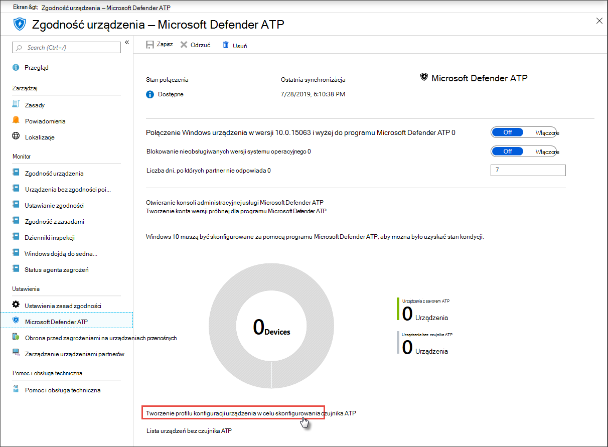

# Uzyskiwanie urządzeń podłączonych do programu Microsoft Defender dla punktu końcowego

[!INCLUDE [Microsoft 365 Defender rebranding](../../includes/microsoft-defender.md)]

**Dotyczy:**
- [Microsoft Defender for Endpoint Plan 1](https://go.microsoft.com/fwlink/p/?linkid=2154037)
- [Microsoft Defender for Endpoint Plan 2](https://go.microsoft.com/fwlink/p/?linkid=2154037)
- [Microsoft 365 Defender](https://go.microsoft.com/fwlink/?linkid=2118804)

> Chcesz mieć dostęp do programu Microsoft Defender dla punktu końcowego? [Zarejestruj się, aby korzystać z bezpłatnej wersji próbnej.](https://signup.microsoft.com/create-account/signup?products=7f379fee-c4f9-4278-b0a1-e4c8c2fcdf7e&ru=https://aka.ms/MDEp2OpenTrial?ocid=docs-wdatp-onboardconfigure-abovefoldlink)

Każde urządzenie włoowane dodaje dodatkowy wykrywanie i reagowanie w punktach końcowych (EDR) i zwiększa widoczność działań naruszenia bezpieczeństwa w Twojej sieci. Ponadto w trakcie wbierania urządzenia można sprawdzać, czy są na nie narażone składniki, a także czy nie są one związane z konfiguracją zabezpieczeń, a podczas ataków mogą być podejmowane krytyczne działania naprawcze.

Zanim będzie można śledzić dołączanie urządzeń i zarządzać nimi:

- [Rejestrowanie urządzeń w zarządzaniu usługą Intune](configure-machines.md#enroll-devices-to-intune-management)
- [Upewnij się, że masz niezbędne uprawnienia](configure-machines.md#obtain-required-permissions)

## Odnajdowanie i śledzenie urządzeń niechronionych

Karta  wnoszona zawiera ogólne informacje o tempie dołączania przez porównanie liczby urządzeń Windows, które w rzeczywistości zostały podłączone do usługi Defender for Endpoint, z całkowitą liczbą urządzeń zarządzanych Windows Intune.

*Karta przedstawiająca urządzenia podłączone do urządzenia w porównaniu z całkowitą liczbą urządzeń zarządzanych Windows Intune*

> [!NOTE]
> W przypadku użycia Menedżer konfiguracji, skryptu dołączania lub innych metod dołączania, które nie korzystają z profilów usługi Intune, mogą wystąpić rozbieżność danych. Aby rozwiązać te niezgodności, utwórz odpowiedni profil konfiguracji usługi Intune dla dołączania do punktu końcowego programu Defender i przypisz ten profil do swoich urządzeń.

## Więcej urządzeń dzięki profilom usługi Intune

Program Defender for Endpoint udostępnia kilka wygodnych opcji [dołączania Windows urządzeniach](onboard-configure.md). Jednak w przypadku urządzeń zarządzanych w usłudze Intune możesz korzystać z profilów usługi Intune, aby wygodnie wdrażać czujnik Defender for Endpoint w celu wybierania urządzeń i efektywnego wdrażania tych urządzeń do usługi.

Na karcie **dołączania wybierz** pozycję Więcej urządzeń, aby utworzyć i przypisać profil w usłudze Intune. Link umożliwia dostęp do strony zgodności urządzenia w usłudze Intune, która zawiera podobny przegląd stanu dołączania.

*Strona zgodności usługi Microsoft Defender for Endpoint urządzenia w zarządzaniu urządzeniami w usłudze Intune*

> [!TIP]
> Możesz również przejść do strony zgodności przy dołączaniu do programu Defender for Endpoint w [portalu usługi Microsoft Azure](https://portal.azure.com/) w witrynie Wszystkie usługi **> Intune > Zgodność urządzenia > Microsoft Defender ATP**.

> [!NOTE]
> Jeśli chcesz wyświetlić najbardziej aktualne dane urządzenia, kliknij pozycję **Lista urządzeń bez czujnika ATP**.

Na stronie zgodności urządzenia utwórz profil konfiguracji przeznaczony specjalnie do wdrożenia czujnika Defender for Endpoint i przypisz ten profil do urządzeń, które chcesz dodać. W tym celu możesz wykonać jedną z tych:

- Wybierz **pozycję Utwórz profil konfiguracji urządzenia, aby skonfigurować czujnik ATP** , aby zaczynał się od wstępnie zdefiniowanego profilu konfiguracji urządzenia.
- Utwórz profil konfiguracji urządzenia od podstaw.

Aby uzyskać więcej informacji, [przeczytaj o chmurze dotyczącej korzystania z profilów konfiguracji urządzeń usługi Intune w celu korzystania z urządzeń w usłudze Defender for Endpoint](/intune/advanced-threat-protection#onboard-devices-by-using-a-configuration-profile).

> Chcesz mieć dostęp do programu Microsoft Defender dla punktu końcowego? [Zarejestruj się, aby korzystać z bezpłatnej wersji próbnej.](https://signup.microsoft.com/create-account/signup?products=7f379fee-c4f9-4278-b0a1-e4c8c2fcdf7e&ru=https://aka.ms/MDEp2OpenTrial?ocid=docs-wdatp-onboardconfigure-belowfoldlink)

## Tematy pokrewne

- [Upewnij się, że urządzenia są poprawnie skonfigurowane](configure-machines.md)
- [Zwiększanie zgodności z planem bazowym zabezpieczeń programu Defender for Endpoint](configure-machines-security-baseline.md)
- [Optymalizowanie wdrażania reguł asr i wykrywanie](configure-machines-asr.md)
