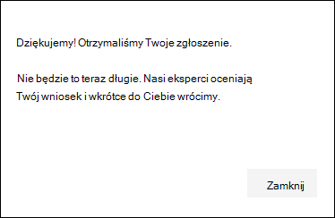

# Konfigurowanie funkcji zarządzania Microsoft Threat Experts i zarządzanie nimi

[!INCLUDE [Microsoft 365 Defender rebranding](../../includes/microsoft-defender.md)]

**Dotyczy:**
- [Microsoft Defender for Endpoint Plan 2](https://go.microsoft.com/fwlink/p/?linkid=2154037)
- [Microsoft 365 Defender](https://go.microsoft.com/fwlink/?linkid=2118804)

> Chcesz mieć dostęp do usługi Defender dla punktu końcowego? [Zarejestruj się, aby korzystać z bezpłatnej wersji próbnej.](https://signup.microsoft.com/create-account/signup?products=7f379fee-c4f9-4278-b0a1-e4c8c2fcdf7e&ru=https://aka.ms/MDEp2OpenTrial?ocid=docs-wdatp-assignaccess-abovefoldlink)

## Przed rozpoczęciem

> [!NOTE]
> Przed zastosowaniem do programu Microsoft Threat Experts — powiadomienie o atakach kierowanej usługi wyszukiwania zagrożeń omówij wymagania dotyczące uprawnień z dostawcą usług technicznych firmy Microsoft i zespołem konta.

Upewnij się, że w Twoim środowisku wdrożono usługę Defender for Endpoint, która ma zarejestrowane urządzenia, a nie tylko w sposób zapewniający jej konfigurowanie.

Jeśli jesteś klientem usługi Defender for Endpoint, musisz zastosować dla usługi **Microsoft Threat Experts —** powiadomienia o atakach kierowanego, aby uzyskać specjalne szczegółowe informacje i analizy pomocne w zidentyfikowaniu najważniejszych zagrożeń, dzięki czemu możesz szybko na nie odpowiedzieć. Skontaktuj się ze swoim zespołem ds. klientów lub przedstawicielem firmy Microsoft, aby zasubskrybować usługę **Microsoft Threat Experts — Experts on Demand**, aby skonsultować się z ekspertami ds. zagrożeń w sprawie odpowiednich wykryciy i adwersarzy.

## Zastosuj do Microsoft Threat Experts — usługa powiadomień o atakach ukierunkowanych

Jeśli jesteś już klientem programu Defender dla punktu końcowego, możesz aplikować za pośrednictwem Microsoft 365 Defender sieci Web.

1. W okienku nawigacji przejdź do Ustawienia > **Ogólne > zaawansowane funkcje > Microsoft Threat Experts — powiadomienia o atakach ukierunkowanych**.

2. Kliknij przycisk **Zastosuj**.

    

3. Wprowadź swoją nazwę i adres e-mail, aby firma Microsoft może wrócić do Ciebie w aplikacji.

    

4. Przeczytaj zasady [zachowania poufności informacji](https://privacy.microsoft.com/privacystatement), a **następnie po pracy** kliknij przycisk Prześlij. Po zatwierdzeniu aplikacji otrzymasz powitaną wiadomość e-mail.

    

Po zaakceptowaniu otrzymasz powitaną wiadomość e-mail i zobaczysz, że  przycisk Zastosuj zmienia się w przełącznik, który jest "wł". Jeśli chcesz usunąć się z usługi powiadomień ukierunkowanych ataków, przesuń przełącznik "wyłączone" i kliknij pozycję Preferencje zapisywania u dołu strony.

## Miejsce, w którym są wyświetlane powiadomienia o atakach ukierunkowanych z aplikacji Microsoft Threat Experts

Możesz otrzymywać powiadomienia o atakach ukierunkowanych od Microsoft Threat Experts za pośrednictwem następujących średnich:

- Strona Zdarzenia portalu usługi Defender for Endpoint 
- Pulpit nawigacyjny alertów portalu usługi Defender for **Endpoint**
- Interfejs API alertów  OData i [interfejs API rest](/windows/security/threat-protection/microsoft-defender-atp/pull-alerts-using-rest-api)
- [DeviceAlertEvents](/windows/security/threat-protection/microsoft-defender-atp/advanced-hunting-devicealertevents-table) table in Advanced hunting
- Adres e-mail, jeśli zdecydujesz się go skonfigurować

Aby otrzymywać powiadomienia o atakach ukierunkowanych za pośrednictwem poczty e-mail, utwórz regułę powiadomień e-mail.

### Tworzenie reguły powiadomienia e-mail

Możesz utworzyć reguły w celu wysyłania powiadomień e-mail do adresatów powiadomień. Aby  [uzyskać szczegółowe informacje, zobacz Konfigurowanie powiadomień alertów](configure-email-notifications.md) w celu tworzenia, edytowania, usuwania i rozwiązywania problemów z powiadomieniami e-mail.

## Wyświetlanie powiadomienia o ataków kierowanej

Po skonfigurowaniu systemu do odbierania wiadomości e-mail z powiadomieniem o Microsoft Threat Experts e-mail zaczniesz otrzymywać powiadomienia o ukierunkowanych atakach od innych osób.

1. Kliknij link w wiadomości e-mail, aby przejść do odpowiedniego kontekstu alertu na pulpicie nawigacyjnym oznaczonym **ekspertami** ds. zagrożeń.

2. Z pulpitu nawigacyjnego wybierz ten sam temat alertu, który został podany w wiadomości e-mail, aby wyświetlić szczegóły.

## Subskrybuj Microsoft Threat Experts — Eksperci na żądanie

Ta usługa jest dostępna jako usługa subskrypcji. Jeśli jesteś już klientem usługi Defender for Endpoint, możesz skontaktować się z przedstawicielem firmy Microsoft w celu zasubskrybowania usługi Microsoft Threat Experts — Experts on Demand.

## Skonsultuj się z ekspertem ds. zagrożeń firmy Microsoft w sprawie podejrzanych działań chłonianych w Twojej organizacji

Możesz współpracuje z innymi Microsoft Threat Experts, którzy mogą być zaangażowani bezpośrednio z poziomu portalu Microsoft 365 Defender w celu terminowej i dokładnej odpowiedzi. Eksperci dostarczają szczegółowych informacji, aby lepiej zrozumieć złożone zagrożenia, powiadomienia o atakach kierowane, które otrzymasz, lub jeśli potrzebujesz więcej informacji na temat alertów, potencjalnie naruszonego urządzenia lub kontekstu analizy zagrożeń wyświetlanego na pulpicie nawigacyjnym portalu.

> [!NOTE]
>
> - Zapytania alertów dotyczące dostosowanych danych analizy zagrożeń twojej organizacji nie są obecnie obsługiwane. Aby uzyskać szczegółowe informacje, skonsultuj się z zespołem ds. zabezpieczeń lub zespołu reagowania na incydenty.
> - Aby móc przesłać zapytanie  "Skonsultuj się z ekspertem ds. zagrożeń", musisz mieć uprawnienie Zarządzanie ustawieniami zabezpieczeń w portalu Microsoft 365 Defender.

1. Przejdź do strony portalu z odpowiednimi informacjami, które chcesz zbadać, na **przykład do strony** Zdarzenie. Przed wysłaniem żądania badania upewnij się, że strona odpowiedniego alertu lub urządzenia jest w widoku.

2. W prawym górnym menu po prawej stronie kliknij **ikonę ?** . Następnie wybierz opcję **Skonsultuj się z ekspertem ds. zagrożeń**.

    

    Zostanie otwarty wysuwny ekran. Na poniższym obrazie pokazano, kiedy masz subskrypcję wersji próbnej.

    

    Na poniższym obrazie przedstawiono pełną subskrypcję usługi Microsoft Threat Experts — Subskrypcja usługi Experts on-Demand.

    

    Pole **Temat zapytania** jest wstępnie wypełnione linkiem do odpowiedniej strony dla twojego żądania badania. Może to być na przykład link do zdarzenia, alertu lub strony ze szczegółami urządzenia, które było widać podczas wywłasniania wniosku.

3. W następnym polu podaj wystarczającą ilość informacji, aby Microsoft Threat Experts kontekst do rozpoczęcia badania.

4. Wprowadź adres e-mail, z który chcesz się korespondować Microsoft Threat Experts.

> [!NOTE]
> Jeśli chcesz śledzić stan spraw ekspertów na żądanie za pośrednictwem centrum Usług Firmy Microsoft, strzygniesz się z menedżerem klienta ds. klientów i kontem produktywnych spraw.

Ten klip wideo zawiera krótkie omówienie Centrum usług firmy Microsoft.

> [!VIDEO https://www.microsoft.com/videoplayer/embed/RE4pk9f]

## Przykładowe tematy badania, które można sprawdzić w Microsoft Threat Experts — Eksperci na żądanie

### Informacje alertu

- Widzimy nowy typ alertu dla binarnego pliku binarnego: [AlertID]. Czy możesz nam powiedzieć coś więcej na temat tego alertu i w jaki sposób możemy przeprowadzić dalsze badania?
- Zauważyliśmy dwie podobne ataki, w których próbowaliśmy wykonywać złośliwe skrypty programu PowerShell, ale generować inne alerty. Jeden z nich to "wiersz polecenia programu PowerShell", a drugi to "Wykryto złośliwy plik na podstawie wskazania dostarczonego przez usługę O365". Jaka jest różnica?
- Dzisiaj otrzymuję nietypowy alert z nieprawidłowymi liczbami nieudanych logowania z urządzenia użytkownika o wysokim profilu. Nie mogę znaleźć żadnych dodatkowych dowodów wokół tych prób logowania. Jak program Defender for Endpoint widzi te próby? Jakie typy logowania są monitorowane?
- Czy możesz dać więcej kontekstu lub szczegółowych informacji na temat tego alertu: "Obserwowane podejrzane zachowanie przez narzędzie systemowe".

### Możliwe złamanie komputera

- Czy możesz udzielić odpowiedzi na pytanie, dlaczego obserwujemy "Nieznany proces?" Ten komunikat lub alert jest często wyświetlany na wielu urządzeniach. Dziękujemy za wszelkie dane wejściowe w celu wyjaśnienia, czy te wiadomości lub alerty są związane ze złośliwą aktywnością.
- Czy możesz pomóc w weryfikacji możliwego naruszenia zabezpieczeń następującego systemu w dniu [date] przy zachowaniu podobnym do wykrywania złośliwego oprogramowania w poprzednim [nazwa złośliwego oprogramowania] w tym samym systemie w [miesiąc]?

### Szczegóły analizy zagrożeń

- Wykryliśmy wiadomość e-mail wyłudzającą informacje, która dostarczyć użytkownikowi złośliwy dokument programu Word. Złośliwy dokument programu Word spowodował serię podejrzanych zdarzeń, w wyniku których wyzwoliło wiele alertów usługi Defender for Endpoint dotyczących złośliwego oprogramowania [nazwa złośliwego oprogramowania]. Czy masz jakieś informacje o tym złośliwym oprogramowaniu? Jeśli tak, czy możesz wysłać mi link?
- Ostatnio pojawił się wpis [informacje dotyczące mediów społecznościowych, na przykład Twitter lub blog] o zagrożeń, które są przeznaczone dla mojej branży. Czy możesz pomóc mi zrozumieć, jaką ochronę zapewnia program Defender dla punktu końcowego przed tym podmiotem zagrożenia?

### Microsoft Threat Experts alertów użytkownika

- Czy Twój zespół reagowania na incydenty może pomóc nam w odpowiedzi na powiadomienie o docelowym ataków, które dostaliśmy?
- To powiadomienie dotyczące ataku kierowanego otrzymano od Microsoft Threat Experts. Nie mamy własnego zespołu reagowania na incydenty. Co możemy teraz zrobić i jak możemy się z nim pomylić?
- Otrzymano powiadomienie o ukierunkowanych atakach od Microsoft Threat Experts. Jakie dane możesz nam przekazać, które możemy przekazać naszemu zespołowi reagowania na incydenty?

  > [!NOTE]
  > Microsoft Threat Experts to zarządzana służba schowek, a nie służba reagowania na incydenty. Możesz jednak współpracować ze swoim zespołem reagowania na incydenty w celu rozwiązania problemów wymagających reakcji na incydent. Jeśli nie masz własnego zespołu reagowania na incydenty i potrzebujesz pomocy firmy Microsoft, możesz zaangażować się w zespół odpowiedzi css na zdarzenia (CIRT, CSS Incident Response Team). Mogą oni utworzyć bilet, aby pomóc w zaadresować Twoje zapytanie.

## Scenariusz

### Otrzymywanie raportu o postępie w śledztwie zarządzanym

Odpowiedź z Microsoft Threat Experts różni się w zależności od zapytania. W ciągu dwóch dni ta wiadomość e-mail będzie  wysyłać do Ciebie raport z postępów badań na temat tego, czy nie skonsultuje się z ekspertem ds. zagrożeń, aby przekazać stan badania z następujących kategorii:

- Więcej informacji jest potrzebnych do kontynuowania badania
- Do określenia kontekstu technicznego potrzebny jest plik lub kilka przykładów plików
- Badanie wymaga więcej czasu
- Początkowe informacje wystarczyły do prowadzonego badania

Szybkie reagowanie w celu utrzymania prowadzonych badań jest niezwykle ważne.

## Temat pokrewny

- [Microsoft Threat Experts omówienie](microsoft-threat-experts.md)
- [Microsoft Threat Experts w Microsoft 365 omówienie Microsoft 365 aplikacji](/microsoft-365/security/mtp/microsoft-threat-experts)
