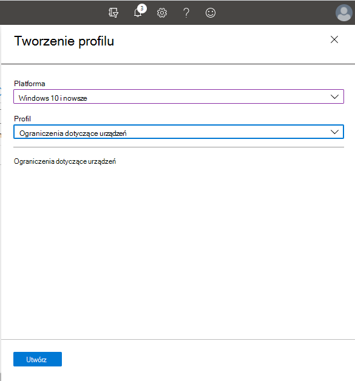
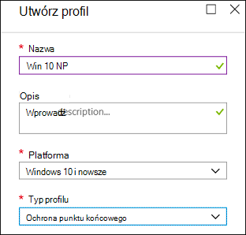

# <a name="how-to-control-usb-devices-and-other-removable-media-using-microsoft-defender-for-endpoint"></a>Jak sterować urządzeniami USB i innymi nośnikami wymiennymi przy użyciu programu Microsoft Defender for Endpoint

**Dotyczy: Program** [Microsoft Defender for Endpoint](https://go.microsoft.com/fwlink/p/?linkid=2069559)

Firma Microsoft zaleca stosowanie warstwowego rozwiązania do zabezpieczania nośników wymiennych [, a](https://aka.ms/devicecontrolblog) program Microsoft Defender for Endpoint oferuje wiele funkcji monitorowania i kontroli w celu zapobiegania zagrożeniam w nieautoryzowanych urządzeniach peryferyjnych:

1. [Odkryj podłącz i odtwarzaj połączone zdarzenia dla urządzeń peryferyjnych w programie Microsoft Defender for Endpoint advanced hunting](#discover-plug-and-play-connected-events). Identyfikuj lub badaj podejrzane działania dotyczące użycia.

2. Konfigurowanie zezwalania lub blokowania tylko niektórych urządzeń wymiennych i zapobiegania zagrożeniam.
    1. [Zezwalaj lub blokuj](#allow-or-block-removable-devices) urządzenia wymienne na podstawie szczegółowej konfiguracji, aby zablokować dostęp do zapisu dysków wymiennych i zatwierdzać lub odrzucać urządzenia za pomocą identyfikatorów urządzeń USB. Elastyczne zasady przypisywania ustawień instalacji urządzeń do indywidualnych lub grup użytkowników i Azure Active Directory (Azure AD).

    2. [Zapobiegaj zagrożeńom wymiennym](#prevent-threats-from-removable-storage) , wprowadzonym przez wymienne urządzenia magazynulne, włączając:
        - Program antywirusowy Microsoft Defender ochrony w czasie rzeczywistym (RTP), aby przeskanować pamięć wymienną w poszukiwaniu złośliwego oprogramowania.
        - Reguła zmniejszenie powierzchni ataków (ASR, Attack Surface Reduction) w celu zablokowania niezaufanych i niepodpisanych procesów uruchamianych z usb.
        - Ustawienia ochrony programu Direct Memory Access (DMA) w celu załagodniania ataków dmA, takich jak Kernel DMA Protection for Debian i blokujące DMA do czasu, gdy użytkownik się nie założy.

3. [Twórz dostosowane alerty](#create-customized-alerts-and-response-actions) i akcje odpowiedzi, aby monitorować użycie urządzeń wymiennych na podstawie tych zdarzeń wtyczki i odtwarzania lub innych zdarzeń usługi Microsoft Defender for Endpoint z niestandardowymi regułami [wykrywania](/microsoft-365/security/defender-endpoint/custom-detection-rules).

4. [Odpowiadaj na zagrożenia z](#respond-to-threats) urządzeń peryferyjnych w czasie rzeczywistym na podstawie właściwości zgłoszonych przez poszczególne urządzenia zewnętrzne.

> [!NOTE]
> Te środki ograniczania zagrożeń pomagają zapobiec dopadniu złośliwego oprogramowania do Twojego środowiska. Aby chronić dane przedsiębiorstwa przed opuszczeniem środowiska, możesz również skonfigurować środki ochrony przed utratą danych. Na przykład na urządzeniach z systemem Windows 10 możesz skonfigurować [usługę BitLocker](/windows/security/information-protection/bitlocker/bitlocker-overview.md) i usługę [Windows Information Protection](/windows/security/information-protection/create-wip-policy-using-intune-azure.md), która szyfruje firmowe dane, nawet jeśli są przechowywane na urządzeniu osobistym, lub za pomocą narzędzia [Storage/RemovableAccessDenyWriteAccess CSP](/windows/client-management/mdm/policy-csp-storage#storage-removablediskdenywriteaccess) odmawia dostępu do zapisu dysków wymiennych. Ponadto możesz klasyfikować [i](/windows/security/threat-protection/windows-defender-atp/information-protection-in-windows-overview) chronić pliki na Windows (w tym także ich montowanych urządzeniach USB) przy użyciu programu Microsoft Defender for Endpoint i usługi Azure Information Protection.

## <a name="discover-plug-and-play-connected-events"></a>Odkrywanie zdarzeń połączonych ze wtyczką i odtwarzanie ich

W programie Microsoft Defender for Endpoint możesz wyświetlać połączone zdarzenia i odtwarzać je w celu identyfikowania podejrzanych aktywności związanych z użyciem lub wykonywania wewnętrznych badań.
Aby uzyskać przykłady zaawansowanych zapytań wyszukiwania dla programu Defender for Endpoint, zobacz zapytania wyszukiwania punktu końcowego [programu Microsoft Defender GitHub ponowne.](https://github.com/Microsoft/WindowsDefenderATP-Hunting-Queries)

Przykładowe Power BI raportów są dostępne dla programu Microsoft Defender dla punktu końcowego, który można używać do zaawansowanych zapytań myśliwnych. Dzięki tym przykładowym szablonom, w tym szablonowi do sterowania urządzeniem, możesz zintegrować możliwości zaawansowanego wyszukiwania na Power BI. Zobacz [repozytorium GitHub szablonów Power BI,](https://github.com/microsoft/MDATP-PowerBI-Templates) aby uzyskać więcej informacji. Zobacz [Tworzenie niestandardowych raportów przy Power BI](/microsoft-365/security/defender-endpoint/api-power-bi), aby dowiedzieć się więcej o Power BI danych.

## <a name="allow-or-block-removable-devices"></a>Zezwalanie lub blokowanie urządzeń wymiennych
W poniższej tabeli opisano, jak usługa Microsoft Defender for Endpoint może zezwalać na urządzenia przenośne lub blokować je w zależności od konfiguracji szczegółowej.

<br>

****

|Kontrolka|Opis|
|---|---|
|[Ograniczanie dysków USB i innych urządzeń peryferyjnych](#restrict-usb-drives-and-other-peripherals)|Możesz zezwolić na instalację/uniemożliwić użytkownikom instalowanie tylko dysków USB i innych urządzeń peryferyjnych uwzględnionych na liście autoryzowanych/nieautoryzowanych urządzeń lub typów urządzeń.|
|[Blokowanie instalacji i użycia magazynu wymiennych](#block-installation-and-usage-of-removable-storage)|Nie można zainstalować ani używać magazynu wymiennych.|
|[Zezwalaj na instalację i używanie specjalnie zatwierdzonych urządzeń peryferyjnych](#allow-installation-and-usage-of-specifically-approved-peripherals)|Możesz instalować i używać tylko zatwierdzonych urządzeń peryferyjnych, które zgłaszają określone właściwości w oprogramowaniu układowym.|
|[Zapobieganie instalacji wyraźnie zabronionych urządzeń peryferyjnych](#prevent-installation-of-specifically-prohibited-peripherals)|Nie można instalować ani używać urządzeń peryferyjnych, które zgłaszają określone właściwości oprogramowania układowego.|
|[Zezwalaj na instalację i użycie specjalnie zatwierdzonych urządzeń peryferyjnych z pasującymi identyfikatorami wystąpień urządzeń](#allow-installation-and-usage-of-specifically-approved-peripherals-with-matching-device-instance-ids)|Możesz instalować i używać tylko zatwierdzonych urządzeń peryferyjnych, które pasują do dowolnego z tych identyfikatorów wystąpień urządzenia.|
|[Zapobieganie instalacji i używaniu wyraźnie zabronionych urządzeń peryferyjnych z pasującymi identyfikatorami wystąpień urządzeń](#prevent-installation-and-usage-of-specifically-prohibited-peripherals-with-matching-device-instance-ids)|Nie można instalować ani używać zabronionych urządzeń peryferyjnych, które są zgodne z dowolnymi identyfikatorami wystąpień tych urządzeń.|
|[Ograniczanie usług, które korzystają z Bluetooth](#limit-services-that-use-bluetooth)|Możesz ograniczyć usługi, które mogą korzystać z Bluetooth.|
|

### <a name="restrict-usb-drives-and-other-peripherals"></a>Ograniczanie dysków USB i innych urządzeń peryferyjnych

Aby zapobiec utracie danych lub złośliwego oprogramowania, organizacja może ograniczyć dyski USB i inne urządzenia zewnętrzne. W poniższej tabeli opisano sposoby, w jakie usługa Microsoft Defender for Endpoint może zapobiec instalacji i używaniu dysków USB i innych urządzeń peryferyjnych.

<br>

****

|Kontrolka|Opis
|---|---|
|[Zezwalaj na instalację i użycie dysków USB i innych urządzeń peryferyjnych](#allow-installation-and-usage-of-usb-drives-and-other-peripherals)|Zezwalaj użytkownikom na instalowanie tylko dysków USB i innych urządzeń peryferyjnych uwzględnionych na liście autoryzowanych urządzeń lub typów urządzeń|
|[Zapobieganie instalacji i używaniu dysków USB i innych urządzeń peryferyjnych](#prevent-installation-and-usage-of-usb-drives-and-other-peripherals)|Uniemożliwianie użytkownikom instalowania dysków USB i innych urządzeń peryferyjnych uwzględnionych na liście nieautoryzowanych urządzeń i typów urządzeń|
|

Wszystkie powyższe kontrolki można skonfigurować za pomocą szablonów administracyjnych [usługi](/intune/administrative-templates-windows) Intune. Odpowiednie zasady znajdują się tutaj w szablonach administratora usługi Intune:


> [!NOTE]
> Za pomocą usługi Intune możesz zastosować zasady konfiguracji urządzeń do użytkowników i/lub grup urządzeń usługi Azure AD.
Powyższe zasady można również skonfigurować za pomocą ustawień [CSP instalacji urządzenia](/windows/client-management/mdm/policy-csp-deviceinstallation) i [zasad instalacji urządzeń](/previous-versions/dotnet/articles/bb530324(v=msdn.10)).
>
> Zawsze testuj i dopracuj te ustawienia w pilotażowej grupie użytkowników i urządzeń przed ich zastosowaniem w środowisku produkcyjnym.
Aby uzyskać więcej informacji na temat kontrolowania urządzeń USB, zobacz blog programu [Microsoft Defender for Endpoint](https://www.microsoft.com/security/blog/2018/12/19/windows-defender-atp-has-protections-for-usb-and-removable-devices/).

#### <a name="allow-installation-and-usage-of-usb-drives-and-other-peripherals"></a>Zezwalaj na instalację i użycie dysków USB i innych urządzeń peryferyjnych

Jednym ze sposobów na pozwolenie na instalację i użycie dysków USB i innych urządzeń peryferyjnych jest rozpoczęcie od umożliwienia wszystkiego. Później możesz zacząć zmniejszać dopuszczalne sterowniki USB i inne urządzenia zewnętrzne.

> [!NOTE]
> Ponieważ nieautoryzowane urządzenie zewnętrzne USB może mieć oprogramowanie układowe, które podszywuje się pod jego właściwości USB, zalecamy zezwolenie tylko na specjalnie zatwierdzone urządzenia zewnętrzne USB i ograniczenie dostępu do nich użytkownikom.

1. Włącz **opcję Zapobiegaj instalacji urządzeń, które nie zostały opisane przez inne ustawienia zasad,** wszystkim użytkownikom.
2. Włącz **opcję Zezwalaj na instalację urządzeń przy użyciu sterowników, które są zgodne z tymi klasami konfiguracji** urządzenia dla [wszystkich klas konfiguracji urządzenia](/windows-hardware/drivers/install/system-defined-device-setup-classes-available-to-vendors).

Aby wymusić zasady dla już zainstalowanych urządzeń, zastosuj zasady zapobiegania, które mają to ustawienie.

Podczas konfigurowania zasad zezwalania na instalację urządzenia musisz także zezwolić na wszystkie atrybuty nadrzędne. Możesz wyświetlić rodziców urządzenia, otwierając Menedżera urządzeń i wyświetlać je według połączenia.


W tym przykładzie należy dodać następujące klasy: HID, Keyboard i {36fc9e60-c465-11cf-8056-444553540000}. Aby [uzyskać więcej informacji, zobacz Sterowniki USB dostarczone](/windows-hardware/drivers/usbcon/supported-usb-classes) przez firmę Microsoft.


Jeśli chcesz ograniczyć się do niektórych urządzeń, usuń klasę konfiguracji urządzenia zewnętrznego, którą chcesz ograniczyć. Następnie dodaj identyfikator urządzenia, który chcesz dodać. Identyfikator urządzenia jest oparty na identyfikatorze dostawcy i wartości identyfikatora produktu urządzenia. Aby uzyskać informacje na temat formatów identyfikatorów urządzeń, zobacz [Standardowe identyfikatory USB](/windows-hardware/drivers/install/standard-usb-identifiers).

Aby znaleźć identyfikatory urządzenia, zobacz [Wyszukiwanie identyfikatora urządzenia](#look-up-device-id).

Przykład:

1. Usuń urządzenie USBDevice klasy z ustawienia **Zezwalaj na instalację urządzeń przy użyciu sterowników, które są zgodne z konfiguracją tych urządzeń**.
2. Dodaj identyfikator urządzenia, aby zezwolić na instalację urządzenia w dowolnym z tych **identyfikatorów**.

#### <a name="prevent-installation-and-usage-of-usb-drives-and-other-peripherals"></a>Zapobieganie instalacji i używaniu dysków USB i innych urządzeń peryferyjnych

Jeśli chcesz zapobiec instalacji klasy urządzenia lub określonych urządzeń, możesz użyć zasad uniemożliwiania instalacji urządzeń:

1. Włącz **opcję Zapobiegaj instalacji urządzeń, które pasują do** dowolnego z tych identyfikatorów urządzeń, i dodaj te urządzenia do listy.
2. Włącz **opcję Zapobiegaj instalacji urządzeń przy użyciu sterowników, które są zgodne z tymi klasami konfiguracji urządzenia**.

> [!NOTE]
> Zasady uniemożliwiania instalacji urządzeń mają priorytet nad zasadami zezwalania na instalację urządzeń.

Zasady **Uniemożliwiaj instalację urządzeń**, które są zgodne z dowolną z tych zasad identyfikatorów urządzeń, umożliwiają określenie listy urządzeń, których instalacja Windows jest zablokowana.

Aby zapobiec instalacji urządzeń, które są zgodne z dowolnym z tych identyfikatorów urządzeń:

1. [Poszukaj identyfikatora urządzenia dla](#look-up-device-id) urządzeń, których zainstalowanie Windows chcesz uniemożliwić.

   

2. Włącz **opcję Zapobiegaj instalacji urządzeń, które są zgodne z** dowolnym z tych identyfikatorów urządzeń, i dodaj do listy identyfikatory dostawców lub produktów.

    

#### <a name="look-up-device-id"></a>Sprawdź identyfikator urządzenia

Za pomocą Menedżera urządzeń możesz znaleźć identyfikator urządzenia.

1. Otwórz Menedżera urządzeń.
2. Kliknij **pozycję Wyświetl** i **wybierz pozycję Urządzenia według połączenia**.
3. W drzewie kliknij prawym przyciskiem myszy urządzenie i wybierz polecenie **Właściwości**.
4. W oknie dialogowym wybranego urządzenia kliknij **kartę** Szczegóły.
5. Kliknij listę **rozwijaną** Właściwość i wybierz pozycję **Identyfikatory sprzętu**.
6. Kliknij prawym przyciskiem myszy górną wartość identyfikatora i wybierz polecenie **Kopiuj**.

Aby uzyskać informacje na temat formatów identyfikatorów urządzeń, zobacz [Standardowe identyfikatory USB](/windows-hardware/drivers/install/standard-usb-identifiers).

Aby uzyskać informacje na temat identyfikatorów dostawców, zobacz [Członkowie usb](https://www.usb.org/members).

Poniżej przedstawiono przykład, w którym identyfikator dostawcy urządzenia lub identyfikator produktu (który jest częścią identyfikatora urządzenia) przy użyciu programu PowerShell:

```powershell
Get-WMIObject -Class Win32_DiskDrive | Select-Object -Property *
```

Zasady **Zapobiegaj instalacji urządzeń za pomocą** sterowników, które są zgodne z tymi zasadami klasy konfiguracji urządzenia, umożliwiają określenie klas konfiguracji urządzenia, Windows których instalacja nie będzie Windows.

Aby zapobiec instalacji konkretnych klas urządzeń:

1. Identyfikator GUID klasy konfiguracji urządzenia można znaleźć na stronie Klasa konfiguracji urządzenia [zdefiniowana przez system, która jest dostępna dla dostawców](/windows-hardware/drivers/install/system-defined-device-setup-classes-available-to-vendors).

2. Włącz **opcję Zapobiegaj instalacji urządzeń przy użyciu sterowników, które pasują** do tych klas konfiguracji urządzenia, i dodaj do listy identyfikator GUID klasy.

    > [!div class="mx-imgBorder"]
    > 

### <a name="block-installation-and-usage-of-removable-storage"></a>Blokowanie instalacji i użycia magazynu wymiennych

1. Zaloguj się do [centrum administracyjnego programu Microsoft Endpoint Manager](https://endpoint.microsoft.com/).

2. Kliknij **pozycję Profile** \> **konfiguracji urządzeń** \> **Utwórz profil**.

    > [!div class="mx-imgBorder"]
    > 

3. Użyj następujących ustawień:
   - Nazwa: Wpisz nazwę profilu.
   - Opis: Wpisz opis
   - Platforma: Windows 10 i nowsze
   - Typ profilu: Ograniczenia dotyczące urządzeń

   > [!div class="mx-imgBorder"]
   > 

4. Kliknij **pozycję Konfiguruj** \> **ogólne**.

5. W **przypadku pamięci wymiennych** **i połączenia USB (tylko na urządzeniu przenośnym)** wybierz pozycję **Zablokuj**. **Pamięć wymienna** zawiera dyski USB, natomiast połączenie **USB (** tylko dla urządzeń przenośnych) nie obejmuje ładowania USB, ale obejmuje tylko inne połączenia USB na urządzeniach przenośnych.

   

6. Kliknij **przycisk OK,** **aby zamknąć ustawienia** ogólne i **Ograniczenia dotyczące urządzeń**.

7. Kliknij **pozycję Utwórz** , aby zapisać profil.

### <a name="allow-installation-and-usage-of-specifically-approved-peripherals"></a>Zezwalaj na instalację i używanie specjalnie zatwierdzonych urządzeń peryferyjnych

Urządzenia zewnętrzne, które mogą być instalowane, można określić za pomocą ich [tożsamości sprzętowej](/windows-hardware/drivers/install/device-identification-strings). Aby uzyskać listę typowych struktur identyfikatorów, zobacz [Formaty identyfikatorów urządzeń](/windows-hardware/drivers/install/device-identifier-formats). Przetestuj konfigurację przed jej rozpoczęciem, aby upewnić się, że blokuje ona i zezwala na urządzenia. Najlepiej przetestować różne wystąpienia sprzętu. Na przykład przetestuj wiele klawiszy USB zamiast tylko jednego.

Aby uzyskać przykład języka SyncML umożliwiający instalację określonych identyfikatorów urządzeń, zobacz [DeviceInstallation/AllowInstallationOfMatchingDeviceIDs CSP](/windows/client-management/mdm/policy-csp-deviceinstallation#deviceinstallation-allowinstallationofmatchingdeviceids). Aby zezwolić na określone klasy urządzeń, zobacz [DeviceInstallation/AllowInstallationOfMatchingDeviceSetupClasses CSP](/windows/client-management/mdm/policy-csp-deviceinstallation#deviceinstallation-allowinstallationofmatchingdevicesetupclasses).
Zezwolenie na instalację określonych urządzeń wymaga również włączenia [funkcji DeviceInstallation/PreventInstallationOfDevicesNotDescribedByOtherPolicySettings](/windows/client-management/mdm/policy-csp-deviceinstallation#deviceinstallation-preventinstallationofdevicesnotdescribedbyotherpolicysettings).

### <a name="prevent-installation-of-specifically-prohibited-peripherals"></a>Zapobieganie instalacji wyraźnie zabronionych urządzeń peryferyjnych

Program Microsoft Defender for Endpoint blokuje instalowanie i używanie zabronionych urządzeń peryferyjnych przy użyciu jednej z tych opcji:

- [Szablony administracyjne mogą](/intune/administrative-templates-windows) blokować każde urządzenie z pasującymi identyfikatorami sprzętu lub klasą konfiguracji.
- [Ustawienia programu CSP instalacji urządzenia z](/windows/client-management/mdm/policy-csp-deviceinstallation) profilem niestandardowym w usłudze Intune. Możesz [zapobiec instalacji określonych identyfikatorów urządzeń](/windows/client-management/mdm/policy-csp-deviceinstallation#deviceinstallation-preventinstallationofmatchingdeviceids) lub [uniemożliwić określone klasy urządzeń](/windows/client-management/mdm/policy-csp-deviceinstallation#deviceinstallation-preventinstallationofmatchingdevicesetupclasses).

### <a name="allow-installation-and-usage-of-specifically-approved-peripherals-with-matching-device-instance-ids"></a>Zezwalaj na instalację i użycie specjalnie zatwierdzonych urządzeń peryferyjnych z pasującymi identyfikatorami wystąpień urządzeń

Urządzenia zewnętrzne, które mogą być instalowane, można określić za pomocą [identyfikatorów wystąpień urządzenia](/windows-hardware/drivers/install/device-instance-ids). Przetestuj konfigurację przed jej rozpoczęciem, aby upewnić się, że zezwala ona na urządzenia, których oczekujesz. Najlepiej przetestować różne wystąpienia sprzętu. Na przykład przetestuj wiele klawiszy USB zamiast tylko jednego.

Konfigurowanie ustawienia zasad [DeviceInstallation/AllowInstallationOfMatchingDeviceInstanceIDs (InstalowanieInstalacji/AllowInstallationOfMatchingDeviceInstanceIDs](/windows/client-management/mdm/policy-csp-deviceinstallation#deviceinstallation-allowinstallationofmatchingdeviceinstanceids) ) pozwala na instalację i użycie zatwierdzonych urządzeń peryferyjnych z pasującymi identyfikatorami wystąpień urządzeń.

### <a name="prevent-installation-and-usage-of-specifically-prohibited-peripherals-with-matching-device-instance-ids"></a>Zapobieganie instalacji i używaniu wyraźnie zabronionych urządzeń peryferyjnych z pasującymi identyfikatorami wystąpień urządzeń

Urządzenia zewnętrzne, których instalacji nie zabrania się, mogą być określone przez [identyfikatory wystąpień urządzeń](/windows-hardware/drivers/install/device-instance-ids). Przetestuj konfigurację przed jej rozpoczęciem, aby upewnić się, że zezwala ona na urządzenia, których oczekujesz. Najlepiej przetestować różne wystąpienia sprzętu. Na przykład przetestuj wiele klawiszy USB zamiast tylko jednego.

Możesz zapobiec instalacji zabronionych urządzeń peryferyjnych z pasującymi identyfikatorami wystąpień urządzeń, konfigurując ustawienie zasad [DeviceInstallation/PreventInstallationOfMatchingDeviceInstanceIDs](/windows/client-management/mdm/policy-csp-deviceinstallation#deviceinstallation-preventinstallationofmatchingdeviceinstanceids) .

### <a name="limit-services-that-use-bluetooth"></a>Ograniczanie usług, które korzystają z Bluetooth

Za pomocą usługi Intune możesz ograniczyć usługi, które mogą Bluetooth za pośrednictwem ["Bluetooth dozwolonych usług"](/windows/client-management/mdm/policy-csp-bluetooth#servicesallowedlist-usage-guide). Domyślny stan ustawień "Bluetooth dozwolonych usług" oznacza, że wszystko jest dozwolone.  Po dodaniu usługi staje się ona listą dozwolonych. Jeśli klient doda wartości klawiatur i myszy i nie doda identyfikatorów GUID transferu plików, transfer plików powinien być zablokowany.

> [!div class="mx-imgBorder"]
> 

## <a name="prevent-threats-from-removable-storage"></a>Zapobieganie wymiennym magazynom zagrożeń

Urządzenia przenośne mogą wprowadzać dodatkowe zagrożenia bezpieczeństwa dla organizacji. Program Microsoft Defender for Endpoint może ułatwić identyfikowanie i blokowanie złośliwych plików na wymiennych urządzeniach magazynujących.

Program Microsoft Defender for Endpoint może również zapobiegać urządzeniu z urządzeniami z peryferiami USB w celu zapobiegania zagrożeniam zewnętrznym. Robi się to za pomocą właściwości zgłoszonych przez urządzenia peryferyjne USB w celu określenia, czy można je instalować i używać na urządzeniu.

Pamiętaj, że jeśli blokujesz urządzenia USB lub inne klasy urządzeń przy użyciu zasad instalacji urządzeń, urządzenia połączone, takie jak telefony, nadal mogą być ładowane.

> [!NOTE]
> Zawsze testuj i dopracuj te ustawienia w pilotażowej grupie użytkowników i urządzeń, zanim zostaną one szeroko rozpowszechnione w Twojej organizacji.

W poniższej tabeli opisano sposoby, w jakie usługa Microsoft Defender for Endpoint może zapobiegać zagrożeń wymiennych magazynach.

Aby uzyskać więcej informacji na temat kontrolowania urządzeń USB, zobacz blog programu [Microsoft Defender for Endpoint](https://aka.ms/devicecontrolblog).

<br>

****

|Kontrolka|Opis|
|---|---|
|[Włączanie Program antywirusowy Microsoft Defender skanowania](#enable-microsoft-defender-antivirus-scanning)|Włącz Program antywirusowy Microsoft Defender skanowania w celu ochrony w czasie rzeczywistym lub zaplanowanych skanów.|
|[Blokowanie niezaufanych i niepodpisanych procesów na urządzeniach peryferyjnych USB](#block-untrusted-and-unsigned-processes-on-usb-peripherals)|Blokowanie plików USB, które są niepodpisane lub niezaufane.|
|[Ochrona przed atakami programu Direct Memory Access (DMA)](#protect-against-direct-memory-access-dma-attacks)|Konfigurowanie ustawień w celu ochrony przed atakami DMA.|
|

> [!NOTE]
> Ponieważ nieautoryzowane urządzenie zewnętrzne USB może mieć oprogramowanie układowe, które podszywuje się pod jego właściwości USB, zalecamy zezwolenie tylko na specjalnie zatwierdzone urządzenia zewnętrzne USB i ograniczenie dostępu do nich użytkownikom.

### <a name="enable-microsoft-defender-antivirus-scanning"></a>Włączanie Program antywirusowy Microsoft Defender skanowania

Ochrona autoryzowanego magazynu wymiennego za [Program antywirusowy Microsoft Defender wymaga włączenia](/microsoft-365/security/defender-endpoint/configure-real-time-protection-microsoft-defender-antivirus) ochrony w czasie rzeczywistym lub planowania skanów i konfigurowania dysków wymiennych na skanach.

- Jeśli jest włączona ochrona w czasie rzeczywistym, pliki są skanowane, zanim będą dostępne i wykonane. Zakres skanowania obejmuje wszystkie pliki, w tym pliki na montowanych urządzeniach wymiennych, takich jak dyski USB. Opcjonalnie można uruchomić skrypt programu [PowerShell](/samples/browse/?redirectedfrom=TechNet-Gallery) w celu przeprowadzenia niestandardowego skanowania dysku USB po jego montażu, tak aby program Program antywirusowy Microsoft Defender rozpoczynał skanowanie wszystkich plików na urządzeniu wymiennym po dołączeniu urządzenia przenośnego. Jednak zalecamy włączenie ochrony w czasie rzeczywistym w celu poprawy wydajności skanowania, zwłaszcza w przypadku dużych urządzeń magazynujących.

- Jeśli są używane zaplanowane skanowania, należy wyłączyć ustawienie DisableRemovableDriveSkanowanie (domyślnie włączone), aby przeskanować urządzenie wymienne podczas pełnego skanowania. Urządzenia wymienne są skanowane podczas szybkiego lub niestandardowego skanowania bez względu na ustawienie DisableRemovableDriveNaświetlanie.

> [!NOTE]
> Zalecamy włączenie monitorowania w czasie rzeczywistym w celu skanowania. W usłudze Intune możesz włączyć monitorowanie  w czasie rzeczywistym pod **Windows 10 w ograniczeniach** \> dotyczących urządzeń **Konfiguruj** \> \> Program antywirusowy Microsoft Defender **monitorowanie w czasie rzeczywistym**.

<!-- Need to build out point in the preceding note.
-->

### <a name="block-untrusted-and-unsigned-processes-on-usb-peripherals"></a>Blokowanie niezaufanych i niepodpisanych procesów na urządzeniach peryferyjnych USB

Użytkownicy końcowi mogą podłączyć urządzenia wymienne, które zostały zainfekowane złośliwym oprogramowaniem.
Aby zapobiec zablokowaniu, firma może blokować pliki USB, które nie są podpisane lub niezaufane.
Firmy mogą również korzystać z funkcji inspekcji reguł zmniejszania powierzchni [](/microsoft-365/security/defender-endpoint/attack-surface-reduction) ataków w celu monitorowania aktywności niezaufanych i niepodpisanych procesów wykonywanych na peryferiach USB.
Można to zrobić, ustawiając dla procesów niezaufanych i niepodpisanych, które  działają z **portu USB** odpowiednio jako Zablokowane lub Tylko inspekcja.
Przy użyciu tej reguły administratorzy mogą zapobiegać uruchamianiu niepodpisanych lub niezaufanych plików wykonywalnych na wymiennych dyskach USB, w tym na kartach SD, oraz insymbować te pliki.
Dotyczy to plików wykonywalnych (takich jak .exe, .dll lub scr) i skryptów, takich jak pliki programu PowerShell (ps), pliki języka VisualBasic (vbs) lub JavaScript (.js).

Te ustawienia wymagają [włączenia ochrony w czasie rzeczywistym](/microsoft-365/security/defender-endpoint/configure-real-time-protection-microsoft-defender-antivirus).

1. Zaloguj się do [Microsoft Endpoint Manager](https://endpoint.microsoft.com/).

2. Kliknij **pozycję Urządzenia** \> **Windows** \> **Utwórz** \> **profil w zasadach konfiguracji**.

    

3. Użyj następujących ustawień:
   - Platforma: Windows 10 i nowsze
   - Typ profilu: Ograniczenia dotyczące urządzeń

   > [!div class="mx-imgBorder"]
   > 

4. Kliknij **przycisk Utwórz**.

5. W **przypadku niepodpisanych i niezaufanych procesów uruchamianych z usb** wybierz pozycję **Zablokuj**.

   

6. Kliknij **przycisk OK,** aby zamknąć ustawienia **i Ograniczenia dotyczące urządzeń**.

### <a name="protect-against-direct-memory-access-dma-attacks"></a>Ochrona przed atakami programu Direct Memory Access (DMA)

Ataki DMA mogą prowadzić do ujawnienia informacji poufnych znajdujących się na komputerze, a nawet do podania złośliwego oprogramowania, które umożliwia atakującym ominięcie ekranu blokady lub zdalne sterowanie komputerami. Poniższe ustawienia pomagają zapobiegać atakom DMA:

1. Począwszy od Windows 10 1803 firma Microsoft wprowadziła [kernel DMA Protection for Jednak](/windows/security/information-protection/kernel-dma-protection-for-thunderbolt.md) w celu zapewnienia natywnej ochrony przed atakami DMA za pośrednictwem portów. Kernel DMA Protection for Debian jest włączany przez producentów systemu i nie może być włączany ani wyłączany przez użytkowników.

   Począwszy od Windows 10 1809, można dostosować poziom ochrony DMA Kernel DMA, konfigurując program [CSP DMA Guard](/windows/client-management/mdm/policy-csp-dmaguard#dmaguard-deviceenumerationpolicy). Jest to dodatkowa kontrolka dla urządzeń peryferyjnych, które nie obsługują izolacji pamięci urządzenia (zwaną również DMA-remapping). Izolacji pamięci umożliwia systemowi operacyjnego korzystanie z jednostki zarządzania pamięcią I/O (IOMMU) urządzenia w celu zablokowania niedozwolonego dostępu we/Wy lub pamięci za pomocą urządzenia zewnętrznego (piaskownicy pamięci). Innymi słowy system operacyjny przypisuje określony zakres pamięci do urządzenia zewnętrznego. Jeśli urządzenie zewnętrzne spróbuje odczytać/zapisać w pamięci poza przypisanym zakresem, system operacyjny go blokuje.

   Urządzenia zewnętrzne, które obsługują izolacji pamięci urządzenia, zawsze mogą się połączyć. Urządzenia zewnętrzne, które nie mogą być blokowane, dozwolone ani dozwolone tylko po zakończeniu (domyślnie) przez użytkownika.

2. W Windows 10 systemach, które nie obsługują obsługi kernelu DMA Protection, można:

   - [Blokowanie dmA do momentu, gdy użytkownik się nie załozy](/windows/client-management/mdm/policy-csp-dataprotection#dataprotection-allowdirectmemoryaccess)
   - [Blokuj wszystkie połączenia przez porty Apple (w tym urządzenia USB)](https://support.microsoft.com/help/2516445/blocking-the-sbp-2-driver-and-thunderbolt-controllers-to-reduce-1394-d)

## <a name="create-customized-alerts-and-response-actions"></a>Tworzenie dostosowanych alertów i akcji odpowiedzi

Za pomocą łącznika WDATP i niestandardowych reguł wykrywania można tworzyć alerty niestandardowe i akcje odpowiedzi:

**Akcje odpowiedzi łącznika Wdatp:**

**Badanie:** Inicjowanie badań, zbieranie pakietu badania i odizolowanie komputera.

**Skanowanie zagrożeń na** urządzeniach USB.

**Ograniczanie wykonywania wszystkich aplikacji na** komputerze z wyjątkiem wstępnie zdefiniowanego zestawu

Łącznik MDATP jest jednym z ponad 200 wstępnie zdefiniowanych łączników, takich jak Outlook, Teams Slack itp. Można tworzyć łączniki niestandardowe.

- [Więcej informacji na temat akcji odpowiedzi łącznika WDATP](/connectors/wdatp/)

**Akcja odpowiedzi reguł wykrywania niestandardowego:**

Można stosować zarówno akcje na poziomie komputera, jak i pliku.

- [Więcej informacji na temat akcji odpowiedzi reguł wykrywania niestandardowego](/microsoft-365/security/defender-endpoint/custom-detection-rules)

Aby uzyskać informacje na temat sterowania urządzeniami w związku z zaawansowanymi zdarzeniami łowiectw i przykłady tworzenia alertów niestandardowych, zobacz Zaawansowane aktualizacje chłoń [: wydarzenia USB,](https://techcommunity.microsoft.com/t5/Microsoft-Defender-ATP/Advanced-hunting-updates-USB-events-machine-level-actions-and/ba-p/824152) akcje na poziomie komputera i zmiany schematu.

## <a name="respond-to-threats"></a>Reagowanie na zagrożenia

Za pomocą programu [Microsoft Defender for Endpoint Custom Detection Rules](/microsoft-365/security/defender-endpoint/custom-detection-rules) można tworzyć alerty niestandardowe i akcje odpowiedzi automatycznych. Akcje odpowiedzi w ramach wykrywania niestandardowego obejmują zarówno akcje na poziomie komputera, jak i pliku. Możesz również tworzyć alerty i akcje odpowiedzi automatycznych, [Power Apps](https://powerapps.microsoft.com/) [i Flow](https://flow.microsoft.com/) za pomocą [łącznika programu Microsoft Defender for Endpoint](/connectors/wdatp/). Łącznik obsługuje akcje związane z badaniem, skanowaniem zagrożeń i ograniczanie uruchomionych aplikacji. Jest to jeden z ponad 200 wstępnie zdefiniowanych łączników, między innymi Outlook, Teams Slack. Można również tworzyć łączniki niestandardowe. Zobacz [Łączniki,](/connectors/) aby dowiedzieć się więcej o łącznikach.

Na przykład przy użyciu obu tych podejście można automatycznie uruchamiać Program antywirusowy Microsoft Defender, gdy urządzenie USB jest montowane na komputerze.

## <a name="related-topics"></a>Tematy pokrewne

- [Konfigurowanie ochrony w czasie rzeczywistym dla Program antywirusowy Microsoft Defender](/microsoft-365/security/defender-endpoint/configure-real-time-protection-microsoft-defender-antivirus)
- [Defender/AllowFullScanRemovableDriveSzybki dysk](/windows/client-management/mdm/policy-csp-defender#defender-allowfullscanremovabledrivescanning)
- [CSP zasad/instalacji urządzenia](/windows/client-management/mdm/policy-csp-deviceinstallation)
- [Wykonywanie niestandardowego skanowania urządzenia przenośnego](/samples/browse/?redirectedfrom=TechNet-Gallery)
- [Szablon sterowania urządzeniem Power BI do raportowania niestandardowego](https://github.com/microsoft/MDATP-PowerBI-Templates)
- [BitLocker](/windows/security/information-protection/bitlocker/bitlocker-overview.md)
- [Windows informacji](/windows/security/information-protection/windows-information-protection/create-wip-policy-using-intune-azure.md)
