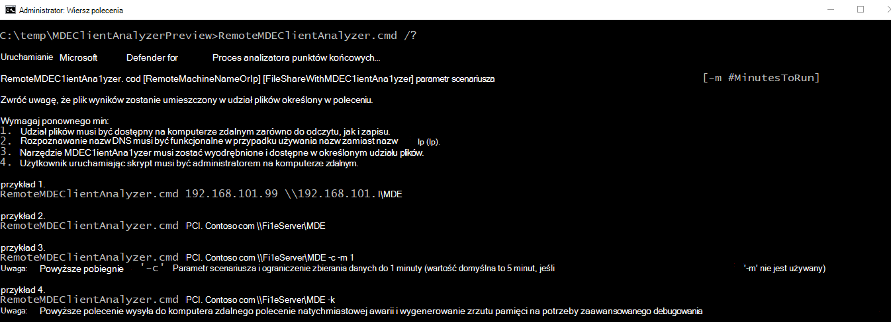

# Zbieranie danych na potrzeby zaawansowanego rozwiązywania problemów na Windows

**Dotyczy:**
- [Microsoft Defender for Endpoint Plan 1](https://go.microsoft.com/fwlink/p/?linkid=2154037)
- [Microsoft Defender for Endpoint Plan 2](https://go.microsoft.com/fwlink/p/?linkid=2154037)

Podczas współpracy z specjalistami pomocy technicznej firmy Microsoft możesz zostać poproszony o użycie analizatora klienta do zbierania danych na potrzeby rozwiązywania bardziej złożonych scenariuszy. Skrypt analizatora obsługuje inne parametry w tym celu i może zbierać konkretny zestaw dzienników na podstawie obserwowanych symptomów, które należy zbadać.

Uruchom polecenie **"MDEClientAnalyzer.cmd /?**' aby wyświetlić listę dostępnych parametrów i ich opis:

> [!NOTE]
> Gdy zostanie użyty dowolny parametr zaawansowanego rozwiązywania problemów, analizator także dzwoni MpCmdRun.exew celu zbierania Program antywirusowy Microsoft Defender powiązanych dzienników pomocy technicznej.

**-h** - Rozmowy z [rejestratorem Windows](/windows-hardware/test/wpt/wpr-command-line-options) wydajności w celu zebrania szczegółowego ogólnego śledzenia wydajności poza standardowym zestawem dzienników.

**-l** — połączenia z wbudowanym [monitorem Windows wydajności](/windows-server/remote/remote-desktop-services/rds-rdsh-performance-counters), aby zbierać uproszczone dane śledzenia z monitorem wydajności. Może to być przydatne w przypadku diagnozowania problemów z obniżeniem wydajności, które występują w czasie, ale trudnych do odtworzenia na żądanie.

**-c** — połączenia z [monitorem procesu w](/sysinternals/downloads/procmon) celu zaawansowanego monitorowania systemu plików w czasie rzeczywistym, rejestru oraz aktywności procesu/wątku. Jest to szczególnie przydatne podczas rozwiązywania problemów z różnymi scenariuszami zgodności aplikacji.

**-i** — Połączenia za pomocą wbudowanego [netsh.exesłużącego](/windows/win32/winsock/netsh-exe) do uruchamiania śledzenia sieci i zapory systemu Windows, które jest przydatne podczas rozwiązywania różnych problemów związanych z siecią.

**-b** — taki sam jak "-c", ale śledzenie monitora procesu zostanie zainicjowane podczas następnego rozruchu i zatrzymane tylko wtedy, gdy ponownie zostanie użyty znacznik -b.

**-a** - Rozmowy z [rejestratorem Windows](/windows-hardware/test/wpt/wpr-command-line-options) wydajności w celu zebrania szczegółowego śledzenia wydajności odnoszącego się do analizy dużych problemów z procesorem związanych z procesem antywirusowym (MsMpEng.exe).

**-v** — używaMpCmdRun.exe [ wiersza polecenia z](/windows/security/threat-protection/microsoft-defender-antivirus/command-line-arguments-microsoft-defender-antivirus) najbardziej szczegółową flagą -trace.

**-t** — uruchamia szczegółowe śledzenia wszystkich składników po stronie klienta, które są związane z zasadą DLP punktu końcowego. Jest to przydatne w sytuacjach, w [których akcje funkcji DLP](/microsoft-365/compliance/endpoint-dlp-learn-about#endpoint-activities-you-can-monitor-and-take-action-on) nie są w przypadku plików dzieje się zgodnie z oczekiwaniami.

**-q** — wywołuje skrypt DLPDiagnose.ps1 z katalogu analizatora "Tools", który sprawdza podstawową konfigurację i wymagania dotyczące funkcji DLP punktu końcowego.

**-d** — gromadzi zrzuty pamięci z technologii **MsSenseS**.exe (proces czujnika na Windows Server 2016 starszego systemu operacyjnego) i powiązane procesy.

- \* Tej flagi można używać w połączeniu z powyższymi flagami.
- \*\* Przechwytywanie zrzutu pamięci chronionego procesów [PPL](/windows-hardware/drivers/install/early-launch-antimalware) , takich MsSense.exe lub MsMpEng.exe, nie jest obecnie obsługiwane przez analizatora.

**-z** - Konfiguruje klucze rejestru na komputerze w celu przygotowania ich do zbierania całych maszynowych zrzutów pamięci za pośrednictwem [CrashOnCtrlScroll](/windows-hardware/drivers/debugger/forcing-a-system-crash-from-the-keyboard). Może to być przydatne do analizy problemów z blokowaniem się komputerów.

\* Przytrzymaj naciśnięty prawy klawisz CTRL i naciśnij dwukrotnie klawisz SCROLL LOCK.

**-k** — używa [narzędzia NotMyFault w](/sysinternals/downloads/notmyfault) celu wymuszenia awarii systemu i wygenerowania zrzutu pamięci komputera. Może to być przydatne do analizy różnych problemów ze stabilnością systemu operacyjnego.

Analizator i wszystkie powyższe flagi scenariuszy można zainicjować zdalnie, uruchamiając polecenie "RemoteMDEClientAnalyzer.cmd", które jest także powiązane z zestawem narzędzi analizatora:

> [!NOTE]
>
> - Podczas korzystania z pliku RemoteMDEClientAnalyzer.cmd zwraca się do psexec w celu pobrania narzędzia ze skonfigurowanego udziału plików, a następnie uruchomienia go lokalnie za pośrednictwem PsExec.exe.
    Skrypt CMD używa flagi "-r" w celu określenia, że działa on zdalnie w kontekście systemu i dlatego nie zostanie wyświetlony żaden monit do użytkownika.
> - Tej samej flagi można użyć z wartością MDEClientAnalyzer.cmd w celu uniknięcia monitu użytkownika żądającego określenia liczby minut na zbieranie danych. Przykład:
>
>    **MDEClientAnalyzer.cmd -r -i -m 5**
>
>   - **-r** — wskazuje, że narzędzie jest uruchamiane ze zdalnego (lub nieakcyjnego kontekstu)
>   - **-i** — Flaga scenariusza dla zbierania śledzenia sieci wraz z innymi powiązanymi dziennikami
>   - **- m** \# — liczba minut do uruchomienia (5 minut w powyższym przykładzie)
