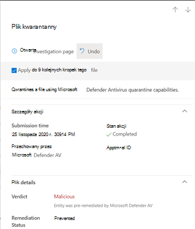

# <a name="address-false-positivesnegatives-in-microsoft-defender-for-endpoint"></a>Adres dodatnich/ujemnych wyników fałszywie dodatnich w programie Microsoft Defender dla punktu końcowego

[!INCLUDE [Microsoft 365 Defender rebranding](../../includes/microsoft-defender.md)]

**Dotyczy:**

- [Microsoft Defender for Endpoint Plan 2](https://go.microsoft.com/fwlink/p/?linkid=2154037)

W rozwiązaniach ochrony punktów końcowych wartość fałszywie dodatnia jest jednostką, taką jak plik lub proces, który został wykryty i zidentyfikowany jako złośliwy, nawet jeśli w rzeczywistości nie jest to zagrożenie. Wartość fałszywa ujemna to podmiot, który nie został wykryty jako zagrożenie, mimo że w rzeczywistości jest złośliwy. Wyniki fałszywie dodatnie/ujemne mogą występować w przypadku dowolnego rozwiązania ochrony przed zagrożeniami, łącznie z [programem Microsoft Defender for Endpoint](microsoft-defender-endpoint.md).


Na szczęście można wykonać kroki w celu rozwiązania i zmniejszenia tego typu problemów. Jeśli w programie Microsoft 365 Defender są dodatnie/ujemne wyniki fałszywie dodatnie[, operacje](/microsoft-365/security/defender/microsoft-365-defender) zabezpieczeń mogą podjąć odpowiednie kroki, korzystając z następującego procesu:

1. [Przeglądanie i klasyfikowanie alertów](#part-1-review-and-classify-alerts)
2. [Przeglądanie działań naprawczych, które zostały wykonane](#part-2-review-remediation-actions)
3. [Przeglądanie i definiowanie wykluczeń](#part-3-review-or-define-exclusions)
4. [Przesyłanie jednostki do analizy](#part-4-submit-a-file-for-analysis)
5. [Przeglądanie i dostosowywanie ustawień ochrony przed zagrożeniami](#part-5-review-and-adjust-your-threat-protection-settings)

Jeśli po wykonaniu zadań opisanych w tym artykule nadal występują problemy z wynikami fałszywie dodatnimi/ujemnymi, możesz uzyskać pomoc. Zobacz [Nadal potrzebujesz pomocy?](#still-need-help)


> [!NOTE]
> Ten artykuł jest przeznaczony jako wskazówki dla operatorów zabezpieczeń i administratorów zabezpieczeń korzystających z programu [Microsoft Defender for Endpoint](microsoft-defender-endpoint.md).

## <a name="part-1-review-and-classify-alerts"></a>Część 1. Przeglądanie i klasyfikowanie alertów

Jeśli zobaczysz [alert, który](alerts.md) został wyzwolony, ponieważ został wykryty jako złośliwy lub podejrzany, który nie powinien być, możesz pominąć alert dla tej jednostki. Można także pominąć alerty, które niekoniecznie są wynikami fałszywie dodatnimi, ale są niearchiwistne. Zalecamy także klasyfikowanie alertów.

Zarządzanie alertami i klasyfikowanie wyników fałszywie dodatnich pomaga w przeszkoliniu rozwiązania w zakresie ochrony przed zagrożeniami i zmniejszaniu liczby wyników fałszywie dodatnich lub wyników fałszywie ujemnych w czasie. Te kroki pomagają też zmniejszyć szum na pulpicie nawigacyjnym operacji zabezpieczeń, dzięki czemu zespół zabezpieczeń może skoncentrować się na elementach pracy o wyższym priorytecie.

### <a name="determine-whether-an-alert-is-accurate"></a>Określanie, czy alert jest dokładny

Zanim sklasyfikuje się lub pominie alert, określ, czy jest on dokładny, dodatni, czy też chłonący.

1. Przejdź do Microsoft 365 Defender konta ([https://security.microsoft.com](https://security.microsoft.com)) i zaloguj się.

2. W okienku nawigacji wybierz pozycję **Kolejka alertów**.

3. Wybierz alert, aby uzyskać więcej szczegółów dotyczących tego alertu. (Zobacz Przeglądanie [alertów w programie Microsoft Defender dla punktu końcowego](review-alerts.md)).

4. W zależności od stanu alertu, zrób tak, jak to opisano w poniższej tabeli:

   |Stan alertu|Co należy zrobić|
   |---|---|
   |Alert jest dokładny|Przypisz alert, a następnie [przejdę jego dalsze](investigate-alerts.md) badanie.|
   |Alert jest fałszywie dodatni|1. [Sklasyfikuj alert](#classify-an-alert) jako wynik fałszywie dodatni.<br/><br/>2. [Pomiń alert](#suppress-an-alert).<br/><br/>3. [Tworzenie wskaźnika dla programu](#indicators-for-microsoft-defender-for-endpoint) Microsoft Defender dla punktu końcowego.<br/><br/>4. [Prześlij plik do firmy Microsoft w celu analizy](#part-4-submit-a-file-for-analysis).|
   |Alert jest dokładny, ale niedokładny (nieistotny)|[Sklasyfikowanie alertu](#classify-an-alert) jako prawdziwego dodatniego, a następnie pominięcie [alertu](#suppress-an-alert).|

### <a name="classify-an-alert"></a>Klasyfikowanie alertu

Alerty mogą być klasyfikowane jako wynik fałszywie dodatni lub jako prawdziwe Microsoft 365 Defender. Klasyfikowanie alertów ułatwia przeszkolić usługę Microsoft Defender w witrynie Endpoint, dzięki czemu z czasem będziesz widzieć więcej prawdziwych alertów i mniej fałszywych alertów.

1. Przejdź do Microsoft 365 Defender konta ([https://security.microsoft.com](https://security.microsoft.com)) i zaloguj się.

2. Wybierz **pozycję Kolejka** alertów, a następnie wybierz alert.

3. Dla wybranego alertu wybierz pozycję **Akcje** \> **Zarządzaj alertem**. Zostanie otwarte okienko wysuwu.

4. W sekcji **Zarządzanie alertami** wybierz pozycję Alert **prawda** lub **Alert fałsz**. (Użyj **alertu Fałsz,** aby sklasyfikować wyniki fałszywie dodatnie).

> [!TIP]
> Aby uzyskać więcej informacji o pomijaniu alertów, zobacz [Zarządzanie alertami programu Microsoft Defender dla punktu końcowego](/microsoft-365/security/defender-endpoint/manage-alerts). Jeśli Twoja organizacja korzysta z serwera informacji o zabezpieczeniach i zarządzania zdarzeniami (SIEM, security information and event management), również tam zdefiniuj regułę konfiguracji.

### <a name="suppress-an-alert"></a>Pomijanie alertu

W przypadku alertów o wynikach fałszywie dodatnich lub wynikach dodatnich, ale w przypadku zdarzeń niemportantowych można pominąć te alerty w Microsoft 365 Defender. Pomiń alerty, aby zmniejszyć szum na pulpicie nawigacyjnym operacji zabezpieczeń.

1. Przejdź do Microsoft 365 Defender konta ([https://security.microsoft.com](https://security.microsoft.com)) i zaloguj się.

2. W okienku nawigacji wybierz pozycję **Kolejka alertów**.

3. Zaznacz alert, który ma zostać pominięty, aby otworzyć **jego okienko** Szczegóły.

4. W **okienku** Szczegóły wybierz wielokropek (**...**), a następnie pozycję **Utwórz regułę odwętą**.

5. Określ wszystkie ustawienia reguły reguły reguły, a następnie wybierz przycisk **Zapisz**.

> [!TIP]
> Potrzebujesz pomocy dotyczącej reguł reguł reguł? Zobacz [Pomiń alert i utwórz nową regułę odgłodzania](/microsoft-365/security/defender-endpoint/manage-alerts#suppress-an-alert-and-create-a-new-suppression-rule).

## <a name="part-2-review-remediation-actions"></a>Część 2. Przegląd działań naprawczych

[Akcje naprawcze](manage-auto-investigation.md#remediation-actions), takie jak wysyłanie pliku do kwarantanny lub zatrzymanie procesu, są podejmowane w jednostkach (takich jak pliki) wykrytych jako zagrożenia. Kilka typów działań naprawczych jest prowadzonych automatycznie w ramach automatycznego badania i Program antywirusowy Microsoft Defender:

- Poddaj plikowi kwarantannę
- Usuwanie klucza rejestru
- Zaśmieć proces
- Zatrzymywanie usługi
- Wyłączanie sterownika
- Usuwanie zaplanowanego zadania

Inne akcje, takie jak uruchomienie skanowania antywirusowego lub zbierania pakietu badania, występują ręcznie lub za pośrednictwem usługi [Live Response](live-response.md). Akcji podejmowane w ramach funkcji Live Response nie można cofnąć.

Kolejnym krokiem po przejrzeniu alertów jest przejrzenie [działań naprawczych](manage-auto-investigation.md). Jeśli jakiekolwiek działania zostały wykonane w wyniku wyników fałszywie dodatnich, można cofnąć większość rodzajów działań naprawczych. W szczególności możesz:

- [Przywracanie pliku poddanego kwarantannie z Centrum akcji](#restore-a-quarantined-file-from-the-action-center)
- [Cofanie wielu akcji jednocześnie](#undo-multiple-actions-at-one-time)
- [Usuwanie pliku z kwarantanny na wielu urządzeniach](#remove-a-file-from-quarantine-across-multiple-devices). i
- [Przywracanie pliku z kwarantanny](#restore-file-from-quarantine)

Po przejrzeniu i cofeniu akcji, które zostały wykonane w wyniku wyników wyników fałszywie dodatnich, przejdź do przeglądania lub [definiowania wykluczeń](#part-3-review-or-define-exclusions).

### <a name="review-completed-actions"></a>Przejrzyj wykonane akcje

1. W lewym okienku nawigacji w portalu <a href="https://go.microsoft.com/fwlink/p/?linkid=2077139" target="_blank">Microsoft 365 Defender kliknij</a> pozycję **Centrum akcji**.

2. Wybierz **kartę** Historia, aby wyświetlić listę działań, które zostały wykonane.

3. Wybierz element, aby wyświetlić więcej szczegółów dotyczących wykonanej akcji zaradczej.

### <a name="restore-a-quarantined-file-from-the-action-center"></a>Przywracanie pliku poddanego kwarantannie z Centrum akcji

1. W lewym okienku nawigacji w portalu Microsoft 365 Defender kliknij pozycję **Centrum akcji**.

2. Na **karcie Historia** wybierz akcję, którą chcesz cofnąć.

3. W wysuwanych okienkach wybierz pozycję **Cofnij**. Jeśli tej metody nie można cofnąć, przycisk Cofnij **nie będzie** wyświetlony. (Aby dowiedzieć się więcej, zobacz [Cofanie zakończonych akcji](manage-auto-investigation.md#undo-completed-actions)).

### <a name="undo-multiple-actions-at-one-time"></a>Cofanie wielu akcji jednocześnie

1. W lewym okienku nawigacji w portalu <a href="https://go.microsoft.com/fwlink/p/?linkid=2077139" target="_blank">Microsoft 365 Defender kliknij</a> pozycję **Centrum akcji**.

2. Na **karcie Historia** wybierz akcje, które chcesz cofnąć.

3. W okienku po prawej stronie ekranu wybierz pozycję **Cofnij**.

### <a name="remove-a-file-from-quarantine-across-multiple-devices"></a>Usuwanie pliku z kwarantanny na wielu urządzeniach

> [!div class="mx-imgBorder"]
> 

1. W lewym okienku nawigacji w portalu <a href="https://go.microsoft.com/fwlink/p/?linkid=2077139" target="_blank">Microsoft 365 Defender kliknij</a> pozycję **Centrum akcji**.

2. Na **karcie Historia** wybierz plik, który ma typ akcji **Kwarantanna.**

3. W okienku po prawej stronie ekranu wybierz pozycję Zastosuj do X większej liczby wystąpień **tego** pliku, a następnie wybierz pozycję **Cofnij**.

### <a name="restore-file-from-quarantine"></a>Przywracanie pliku z kwarantanny

Możesz wycofać i usunąć plik z kwarantanny, jeśli określono, że jest on oczyszczani po zakończeniu badania. Uruchom następujące polecenie na każdym urządzeniu, na którym plik został poddany kwarantannie.

1. Otwórz wiersz polecenia z podwyższonym poziomem uprawnień na urządzeniu:

   1. Przejdź do **przycisku Start** i wpisz _cmd_.
   2. Kliknij prawym przyciskiem myszy **pozycję Wiersz polecenia i** wybierz **pozycję Uruchom jako administrator**.

2. Wprowadź następujące polecenie i naciśnij klawisz **Enter**:

    ```console
    "ProgramFiles%\Windows Defender\MpCmdRun.exe" -Restore -Name EUS:Win32/CustomEnterpriseBlock -All
    ```

    > [!IMPORTANT]
    > W niektórych scenariuszach **nazwa zagrożenia** może być wyświetlana jako `EUS:Win32/CustomEnterpriseBlock!cl`. Program Defender for Endpoint przywróci wszystkie niestandardowe zablokowane pliki, które zostały poddane kwarantannie na tym urządzeniu w ciągu ostatnich 30 dni.
    >
    > Plik poddany kwarantannie jako potencjalne zagrożenie sieci może nie być odzyskiwalny. Jeśli użytkownik spróbuje przywrócić plik po kwarantannie, może to oznaczać, że ten plik jest niedostępny. Może to być spowodowane tym, że system nie ma już poświadczeń sieciowych, aby uzyskać dostęp do pliku. Zazwyczaj jest to wynik tymczasowego zalogowania się do folderu systemowego lub udostępnionego i tokeny dostępu wygasły.

3. W okienku po prawej stronie ekranu wybierz pozycję Zastosuj do X większej liczby wystąpień **tego** pliku, a następnie wybierz pozycję **Cofnij**.

## <a name="part-3-review-or-define-exclusions"></a>Część 3. Przeglądanie lub definiowanie wykluczeń

Wyjątkiem są jednostki, takie jak plik lub adres URL, określone jako wyjątek do działań naprawczych. Wykluczona jednostka może być wykrywana, ale w jej encji nie są podejmowane żadne działania naprawcze. Oznacza to, że wykryty plik lub proces nie zostanie zatrzymany, wysłany do kwarantanny, usunięty ani w inny sposób zmieniony przez usługę Microsoft Defender for Endpoint.

Aby zdefiniować wykluczenia w programie Microsoft Defender for Endpoint, wykonaj następujące zadania:

- [Definiowanie wykluczeń dla Program antywirusowy Microsoft Defender](#exclusions-for-microsoft-defender-antivirus)
- [Tworzenie wskaźników "zezwalania" dla programu Microsoft Defender dla punktu końcowego](#indicators-for-microsoft-defender-for-endpoint)

> [!NOTE]
> Program antywirusowy Microsoft Defender wykluczeń dotyczą tylko ochrony antywirusowej, a nie innych funkcji programu Microsoft Defender for Endpoint. Aby ogólnie wykluczyć pliki, użyj wykluczeń Program antywirusowy Microsoft Defender wskaźników [niestandardowych](/microsoft-365/security/defender-endpoint/manage-indicators) dla programu Microsoft Defender for Endpoint.

Procedury w tej sekcji opisują sposób definiowania wykluczeń i wskaźników.

### <a name="exclusions-for-microsoft-defender-antivirus"></a>Wykluczenia dotyczące Program antywirusowy Microsoft Defender

Ogólnie nie należy definiować wykluczeń dla Program antywirusowy Microsoft Defender. Należy pamiętać, aby oszczędnie definiować wykluczenia i uwzględniać tylko pliki, foldery, procesy i pliki otwierane w procesie, których wynikiem są wyniki fałszywie dodatnie. Ponadto należy regularnie przeglądać zdefiniowane wykluczenia. Zalecamy używanie programu [Microsoft Endpoint Manager](/mem/endpoint-manager-overview) do definiowania i edytowania wykluczeń oprogramowania antywirusowego, ale możesz używać innych metod, takich jak [zasady grupy](/azure/active-directory-domain-services/manage-group-policy) (zobacz Zarządzanie [programem Microsoft Defender dla punktu końcowego](manage-mde-post-migration.md).

> [!TIP]
> Potrzebujesz pomocy dotyczącej wykluczeń oprogramowania antywirusowego? Zobacz [Konfigurowanie i weryfikowanie wykluczeń Program antywirusowy Microsoft Defender skanowania.](configure-exclusions-microsoft-defender-antivirus.md)

#### <a name="use-microsoft-endpoint-manager-to-manage-antivirus-exclusions-for-existing-policies"></a>Zarządzanie Microsoft Endpoint Manager antywirusowymi (w przypadku istniejących zasad) przy użyciu programu Microsoft Endpoint Manager wykluczeń antywirusowych

1. Przejdź do Microsoft Endpoint Manager administracyjnego (<https://endpoint.microsoft.com>) i zaloguj się.

2. Wybierz **pozycję Endpoint security** \> **Antivirus (Zabezpieczenia punktu końcowego**), a następnie wybierz istniejące zasady. (Jeśli nie masz istniejących zasad lub chcesz utworzyć nowe zasady, przejdź do [następnej procedury](#use-microsoft-endpoint-manager-to-create-a-new-antivirus-policy-with-exclusions)).

3. Wybierz **pozycję Właściwości**, a następnie obok **przycisku Ustawienia konfiguracji** wybierz pozycję **Edytuj**.

4. **Rozwiń Program antywirusowy Microsoft Defender wykluczeń**, a następnie określ wykluczenia.

5. Wybierz **pozycję Recenzja + zapisywanie**, a następnie wybierz **pozycję Zapisz**.

#### <a name="use-microsoft-endpoint-manager-to-create-a-new-antivirus-policy-with-exclusions"></a>Tworzenie Microsoft Endpoint Manager oprogramowania antywirusowego z wykluczeniami za pomocą programu antywirusowego

1. Przejdź do Microsoft Endpoint Manager administracyjnego (<https://endpoint.microsoft.com>) i zaloguj się.

2. Wybierz **pozycję Zabezpieczenia punktu końcowego** \> **oprogramowania** \> **antywirusowego + Utwórz zasady**.

3. Wybierz platformę (na przykład Windows 10 **lub nowszy**, **macOS** lub Windows 10 **i Windows Server**).

4. W **przypadku opcji** Profil **wybierz Program antywirusowy Microsoft Defender wykluczeń**, a następnie wybierz pozycję **Utwórz**.

5. Określ nazwę i opis profilu, a następnie wybierz przycisk **Dalej**.

6. Na karcie **Ustawienia konfiguracji** określ wykluczenia oprogramowania antywirusowego, a następnie wybierz przycisk **Dalej**.

7. Jeśli w **organizacji** używasz tagów zakresów, na karcie Tagi zakresu określ tagi zakresów dla tworzyć tworzyć zasady. (Zobacz [Tagi zakresu](/mem/intune/fundamentals/scope-tags)).

8. Na **karcie Zadania określ** użytkowników i grupy, do których mają być stosowane zasady, a następnie wybierz pozycję **Dalej**. (Jeśli potrzebujesz pomocy w przypisywaniu zadań, zobacz Przypisywanie profilów użytkowników i urządzeń [w programie Microsoft Intune](/mem/intune/configuration/device-profile-assign)).

9. Na karcie **Recenzja + tworzenie** przejrzyj ustawienia, a następnie wybierz pozycję **Utwórz**.

### <a name="indicators-for-microsoft-defender-for-endpoint"></a>Wskaźniki dla programu Microsoft Defender dla punktu końcowego

[Wskaźniki](/microsoft-365/security/defender-endpoint/manage-indicators) (w szczególności wskaźniki naruszenia bezpieczeństwa lub IOCs) umożliwiają Twojemu zespołowi operacyjnemu ds. zabezpieczeń definiowanie wykrywania, zapobiegania i wykluczania jednostek. Możesz na przykład określić, że określone pliki mają być pominięte w skanach i działaniach naprawczych w programie Microsoft Defender for Endpoint. Wskaźników można też używać do generowania alertów dla określonych plików, adresów IP lub adresów URL.

Aby określić jednostki jako wykluczenia dla programu Microsoft Defender dla punktu końcowego, utwórz wskaźniki "zezwalaj" dla tych jednostek. Takie wskaźniki "zezwalania" w programie Microsoft Defender dla punktu końcowego dotyczą ochrony następnej [generacji, wykrywanie i reagowanie w punktach końcowych](microsoft-defender-antivirus-in-windows-10.md) [i automatycznego](overview-endpoint-detection-response.md) badania & [rozwiązywania problemów](/microsoft-365/security/defender-endpoint/automated-investigations).

Wskaźniki "Zezwalaj" można utworzyć dla:

- [Pliki](#indicators-for-files)
- [Adresy IP, adresy URL i domeny](#indicators-for-ip-addresses-urls-or-domains)
- [Certyfikaty aplikacji](#indicators-for-application-certificates)


#### <a name="indicators-for-files"></a>Wskaźniki plików

Utworzenie wskaźnika ["zezwalania"](/microsoft-365/security/defender-endpoint/indicator-file) dla pliku, takiego jak plik wykonywalny, pomaga zapobiec blokowaniu plików, z których korzysta twoja organizacja. Pliki mogą zawierać przenośne pliki wykonywalne (PE), takie jak `.exe` i `.dll` pliki.

Przed utworzeniem wskaźników dla plików upewnij się, że są spełnione następujące wymagania:

- Program antywirusowy Microsoft Defender z włączoną ochroną opartą na chmurze (zobacz [Zarządzanie ochroną opartą na chmurze](/windows/security/threat-protection/microsoft-defender-antivirus/deploy-manage-report-microsoft-defender-antivirus))
- Wersja klienta ochrony przed złośliwym oprogramowaniem to 4.18.1901.x lub nowsza
- Na urządzeniach działa Windows 10, wersja 1703 lub nowsza albo Windows 11; Windows Server 2016, lub Windows Server 2019 lub Windows Server 2022
- Funkcja [Blokuj lub zezwalaj jest włączona](/microsoft-365/security/defender-endpoint/advanced-features)

#### <a name="indicators-for-ip-addresses-urls-or-domains"></a>Wskaźniki adresów IP, adresów URL lub domen

Utworzenie wskaźnika ["zezwalaj" dla adresu IP, adresu URL](/microsoft-365/security/defender-endpoint/indicator-ip-domain) lub domeny pomaga zapobiec blokowaniu witryn lub adresów IP, z których korzysta Twoja organizacja.

Przed utworzeniem wskaźników dla adresów IP, adresów URL lub domen upewnij się, że są spełnione następujące wymagania:

- Ochrona sieci w programie Defender dla punktu końcowego jest włączona w trybie blokowania (zobacz [Włączanie ochrony sieci](/microsoft-365/security/defender-endpoint/enable-network-protection))
- Wersja klienta ochrony przed złośliwym oprogramowaniem to 4.18.1906.x lub nowsza
- Na urządzeniach działa Windows 10, wersja 1709 lub nowsza albo Windows 11

Niestandardowe wskaźniki sieci są włączone [w Microsoft 365 Defender.](/microsoft-365/security/defender/microsoft-365-defender) Aby dowiedzieć się więcej, zobacz [Funkcje zaawansowane](/microsoft-365/security/defender-endpoint/advanced-features).

#### <a name="indicators-for-application-certificates"></a>Wskaźniki certyfikatów aplikacji

Utworzenie wskaźnika ["zezwalaj"](/microsoft-365/security/defender-endpoint/indicator-certificates) dla certyfikatu aplikacji pomaga zapobiec blokowaniu aplikacji, takich jak wewnętrznie opracowane aplikacje, z których twoja organizacja korzysta. `.CER` lub `.PEM` rozszerzenia plików są obsługiwane.

Przed utworzeniem wskaźników dla certyfikatów aplikacji upewnij się, że są spełnione następujące wymagania:

- Program antywirusowy Microsoft Defender z włączoną ochroną opartą na chmurze (zobacz [Zarządzanie ochroną opartą na chmurze).](deploy-manage-report-microsoft-defender-antivirus.md)
- Wersja klienta ochrony przed złośliwym oprogramowaniem to 4.18.1901.x lub nowsza
- Na urządzeniach działa Windows 10, wersja 1703 lub nowsza albo Windows 11; Windows Server 2016, lub Windows Server 2019 lub Windows Server 2022
- Definicje ochrony przed wirusami i zagrożeniami są aktualne

> [!TIP]
> Po utworzeniu wskaźników można zdefiniować je jeden po jednym lub zaimportować wiele elementów jednocześnie. Pamiętaj, że istnieje limit 15 000 wskaźników dla jednej dzierżawy. Być może trzeba będzie najpierw zebrać pewne szczegóły, na przykład informacje o skrótach plików. Przed utworzeniem wskaźników przejrzyj wymagania [wstępne](manage-indicators.md).

## <a name="part-4-submit-a-file-for-analysis"></a>Część 4. Przesyłanie pliku do analizy

Jednostki, takie jak pliki i wykrywanie bez plików, można przesyłać do firmy Microsoft w celu analizy. Analizują one wszystkie zgłoszenia, a ich wyniki pomagają w przekazywaniu informacji o możliwościach ochrony przed zagrożeniami w programie Microsoft Defender dla punktów końcowych. Po zalogowaniu się w witrynie przesyłania możesz śledzić swoje zgłoszenia.

### <a name="submit-a-file-for-analysis"></a>Przesyłanie pliku do analizy

Jeśli masz plik, który został błędnie wykryty jako złośliwy lub nieodebrany, wykonaj poniższe czynności, aby przesłać plik do analizy.

1. Przejrzyj wskazówki tutaj: [Przesyłanie plików do analizy](/windows/security/threat-protection/intelligence/submission-guide).

2. Odwiedź [witrynę Microsoft Security Intelligence przesyłania](https://www.microsoft.com/wdsi/filesubmission) (https://www.microsoft.com/wdsi/filesubmission)i prześlij pliki).

### <a name="submit-a-fileless-detection-for-analysis"></a>Przesyłanie wykrywania bez pliku do analizy

Jeśli na podstawie zachowania coś zostało wykryte jako złośliwe oprogramowanie, a nie masz pliku, `Mpsupport.cab` możesz przesłać plik do analizy. Plik można *pobrać.cabza* pomocą narzędzia Microsoft Malware Protection Command-Line Utility (MPCmdRun.exe) na Windows 10 lub Windows 11.

1. Przejdź do ` C:\ProgramData\Microsoft\Windows Defender\Platform\<version>`, a następnie uruchom jako `MpCmdRun.exe` administrator.

2. Wpisz `mpcmdrun.exe -GetFiles`, a następnie naciśnij klawisz **Enter**.

   Zostanie wygenerowany plik .cab zawierający różne dzienniki diagnostyczne. Lokalizacja pliku jest określona w wyniku wiersza polecenia. Domyślna lokalizacja to `C:\ProgramData\Microsoft\Microsoft Defender\Support\MpSupportFiles.cab`.

3. Przejrzyj wskazówki tutaj: [Przesyłanie plików do analizy](/windows/security/threat-protection/intelligence/submission-guide).

4. Odwiedź [witrynę Microsoft Security Intelligence przesyłania](https://www.microsoft.com/wdsi/filesubmission) (https://www.microsoft.com/wdsi/filesubmission)i prześlij swoje .cab pliki.

### <a name="what-happens-after-a-file-is-submitted"></a>Co się dzieje po przesłaniu pliku?

Twoje zgłoszenia są natychmiast skanowane przez nasze systemy, aby dać Ci najnowsze wyznaczanie jeszcze przed rozpoczęciem postępowania przez analityka nad sprawą. Możliwe, że plik mógł już zostać przesłany i przetworzony przez analityka. W takich przypadkach określenie jest dokonywane szybko.

W przypadku przesyłania, które nie zostało jeszcze przetworzone, mają one priorytety analizy:

- Rozpowszechnione pliki, które mogą mieć wpływ na duże liczby komputerów, mają wyższy priorytet.
- Uwierzytelnieni klienci, zwłaszcza klienci w przedsiębiorstwach z prawidłowymi [identyfikatorami Software Assurance (SAIDS),](https://www.microsoft.com/licensing/licensing-programs/software-assurance-default.aspx) mają wyższy priorytet.
- Zgłoszenia oznaczone jako o wysokim priorytecie przez właścicieli said są natychmiast przyciągane uwagę.

Aby sprawdzić aktualizacje dotyczące przesyłania, zaloguj się w Microsoft Security Intelligence [przesyłania](https://www.microsoft.com/wdsi/filesubmission).

> [!TIP]
> Aby dowiedzieć się więcej, zobacz [Przesyłanie plików do analizy](/windows/security/threat-protection/intelligence/submission-guide#how-does-microsoft-prioritize-submissions).

## <a name="part-5-review-and-adjust-your-threat-protection-settings"></a>Część 5. Przeglądanie i dostosowywanie ustawień ochrony przed zagrożeniami

Program Microsoft Defender for Endpoint oferuje wiele różnych opcji, w tym możliwość dostosowania ustawień dla różnych funkcji i możliwości. Jeśli wyniki fałszywie dodatnie są liczne, należy zapoznać się z ustawieniami ochrony przed zagrożeniami w organizacji. Może być konieczne dostosowanie:

- [Ochrona w chmurze](#cloud-delivered-protection)
- [Działania naprawcze dotyczące potencjalnie niechcianych aplikacji](#remediation-for-potentially-unwanted-applications)
- [Zautomatyzowane badanie i rozwiązywanie problemów](#automated-investigation-and-remediation)

### <a name="cloud-delivered-protection"></a>Ochrona w chmurze

Sprawdź, czy poziom ochrony przed wiadomościami e-Program antywirusowy Microsoft Defender jest Program antywirusowy Microsoft Defender. Domyślnie ochrona dostarczana w chmurze jest ustawiona na wartość Nieskonfigurowane **, która** odpowiada normalnemu poziomowi ochrony dla większości organizacji. Jeśli ochrona dostarczana w chmurze ma ustawioną wartość Równanie **wysokie,** **Wysokie +** lub **Zero** tolerancji, może wystąpić większa liczba wyników fałszywie dodatnich.

> [!TIP]
> Aby dowiedzieć się więcej o konfigurowaniu ochrony w chmurze, zobacz Określanie poziomu ochrony przed wiadomościami [w chmurze](/windows/security/threat-protection/microsoft-defender-antivirus/specify-cloud-protection-level-microsoft-defender-antivirus).

Zalecamy edytowanie [Microsoft Endpoint Manager](/mem/endpoint-manager-overview) ustawień ochrony w chmurze przy użyciu programu Microsoft Endpoint Manager, ale możesz używać innych metod, takich jak [program zasady grupy](/azure/active-directory-domain-services/manage-group-policy) (zobacz Zarządzanie [programem Microsoft Defender dla punktu końcowego](manage-mde-post-migration.md)).

#### <a name="use-microsoft-endpoint-manager-to-review-and-edit-cloud-delivered-protection-settings-for-existing-policies"></a>Przeglądanie Microsoft Endpoint Manager i edytowanie ustawień ochrony w chmurze (dla istniejących zasad)

1. Przejdź do Microsoft Endpoint Manager administracyjnego (<https://endpoint.microsoft.com>) i zaloguj się.

2. Wybierz **pozycję Zabezpieczenia punktu końcowego** \> **oprogramowania** antywirusowego, a następnie wybierz istniejące zasady. (Jeśli nie masz istniejących zasad lub chcesz utworzyć nowe zasady, przejdź do [następnej procedury](#use-microsoft-endpoint-manager-to-set-cloud-delivered-protection-settings-for-a-new-policy)).

3. W **obszarze Zarządzanie** wybierz pozycję **Właściwości**. Następnie obok ustawień **konfiguracji wybierz** pozycję **Edytuj**.

4. **Rozwiń program Ochrona w** chmurze i przejrzyj bieżące ustawienie w wierszu **Poziom ochrony w** chmurze. Zalecamy ustawienie ochrony w chmurze na wartość Nieskonfigurowane, co zapewnia silną ochronę przy jednoczesnym ograniczaniu ryzyka uzyskania wyników fałszywie dodatnich.

5. Wybierz **pozycję Recenzja + zapisywanie**, a następnie **pozycję Zapisz**.

#### <a name="use-microsoft-endpoint-manager-to-set-cloud-delivered-protection-settings-for-a-new-policy"></a>Użyj Microsoft Endpoint Manager, aby skonfigurować ustawienia ochrony w chmurze (dla nowych zasad)

1. Przejdź do Microsoft Endpoint Manager administracyjnego (<https://endpoint.microsoft.com>) i zaloguj się.

2. Wybierz **pozycję Zabezpieczenia punktu końcowego** \> **oprogramowania antywirusowego** \> **+ Utwórz zasady**.

3. W **przypadku opcji Platforma** wybierz opcję, a następnie dla opcji Profil wybierz pozycję **Oprogramowanie antywirusowe** **lub** Program antywirusowy Microsoft Defender (konkretną opcję zależy od tego, co wybrano dla **opcji Platforma**). Następnie wybierz **pozycję Utwórz**.

4. Na karcie **Podstawy** określ nazwę i opis zasad. Następnie wybierz przycisk **Dalej**.

5. Na karcie **Ustawienia konfiguracji** rozwiń pozycję **Ochrona w chmurze** i określ następujące ustawienia:

   - Ustaw **opcję Włącz ochronę w chmurze na** **wartość Tak**.
   - Ustaw **poziom ochrony w chmurze** na **Wartość Nieskonfigurowane**. (Ten poziom domyślnie zapewnia wysoki poziom ochrony przy jednoczesnym ograniczaniu prawdopodobieństwo uzyskania wyników fałszywie dodatnich).

6. Jeśli w **organizacji** używasz tagów zakresów, na karcie Tagi zakresu określ tagi zakresów dla zasad. (Zobacz [Tagi zakresu](/mem/intune/fundamentals/scope-tags)).

7. Na **karcie Zadania określ** użytkowników i grupy, do których mają być stosowane zasady, a następnie wybierz pozycję **Dalej**. (Jeśli potrzebujesz pomocy w przypisywaniu zadań, zobacz Przypisywanie profilów użytkowników i urządzeń [w programie Microsoft Intune](/mem/intune/configuration/device-profile-assign)).

8. Na karcie **Recenzja + tworzenie** przejrzyj ustawienia, a następnie wybierz pozycję **Utwórz**.

### <a name="remediation-for-potentially-unwanted-applications"></a>Działania naprawcze dotyczące potencjalnie niechcianych aplikacji

Potencjalnie niechciane aplikacje (PUA) to kategoria oprogramowania, która może powodować powolne uruchamianie urządzeń, wyświetlanie nieoczekiwanych reklam lub instalowanie innego oprogramowania, które może być nieoczekiwane lub niechciane. Do zasad pua należą oprogramowanie reklamowe, oprogramowanie do tworzenie pakietów i oprogramowanie do tworzenie pakietów, które działa inaczej z produktami zabezpieczającymi. Mimo że pakiet PUA nie jest uważany za złośliwe oprogramowanie, niektóre rodzaje oprogramowania są pua na podstawie ich zachowania i reputacji.

> [!TIP]
> Aby dowiedzieć się więcej na temat programu PUA, zobacz [Wykrywanie i blokowanie potencjalnie niechcianych aplikacji](/windows/security/threat-protection/microsoft-defender-antivirus/detect-block-potentially-unwanted-apps-microsoft-defender-antivirus).

W zależności od aplikacji, z których korzysta Twoja organizacja, w wyniku ustawień ochrony pua mogą być wynikiem wyników fałszywie dodatnich. Jeśli to konieczne, rozważ zastosowanie ochrony przed uruchomieniem funkcji pua w trybie inspekcji przez jakiś czas lub zastosowanie ochrony za pobłędzie do podzestawu urządzeń w organizacji. Ochronę za pomocą zabezpieczeń po stronie użytkownika można skonfigurować na Microsoft Edge przeglądarkach i na Program antywirusowy Microsoft Defender.

Zalecamy edytowanie [Microsoft Endpoint Manager](/mem/endpoint-manager-overview) ustawień ochrony za pomocą funkcji PUA, jednak możesz używać innych metod, takich jak [zasady grupy](/azure/active-directory-domain-services/manage-group-policy) (zobacz Zarządzanie [programem Microsoft Defender dla punktu końcowego](manage-mde-post-migration.md)).

#### <a name="use-microsoft-endpoint-manager-to-edit-pua-protection-for-existing-configuration-profiles"></a>Edytowanie Microsoft Endpoint Manager poziomu zabezpieczeń (dla istniejących profilów konfiguracji)

1. Przejdź do Microsoft Endpoint Manager administracyjnego (<https://endpoint.microsoft.com>) i zaloguj się.

2. Wybierz **pozycję Profile** \> **konfiguracji urządzeń**, a następnie wybierz istniejące zasady. (Jeśli nie masz istniejących zasad lub chcesz utworzyć nowe zasady, przejdź do [następnej procedury](#use-microsoft-endpoint-manager-to-set-pua-protection-for-a-new-configuration-profile)).

3. W **obszarze** Zarządzanie wybierz **pozycję Właściwości**, a następnie obok **przycisku Ustawienia konfiguracji** wybierz pozycję **Edytuj**.

4. Na karcie **Ustawienia konfiguracji** przewiń w dół i rozwiń **Program antywirusowy Microsoft Defender**.

5. Ustaw **dla ustawienia Wykryj potencjalnie niechciane aplikacje** wartość **Inspekcja**. (Możesz go wyłączyć, ale w trybie inspekcji będzie można zobaczyć wykrywanie).

6. Wybierz **pozycję Recenzja + zapisywanie**, a następnie wybierz **pozycję Zapisz**.

#### <a name="use-microsoft-endpoint-manager-to-set-pua-protection-for-a-new-configuration-profile"></a>Użyj Microsoft Endpoint Manager, aby ustawić ochronę przed zabezpieczeniami klienta (dla nowego profilu konfiguracji)

1. Przejdź do Microsoft Endpoint Manager administracyjnego (<https://endpoint.microsoft.com>) i zaloguj się.

2. Wybierz **pozycję Urządzenia** \> **Profile konfiguracji** \> **+ Utwórz profil**.

3. W przypadku **platformy** wybierz pozycję Windows 10 **lub nowszej**, a w **przypadku** profilu wybierz **pozycję Ograniczenia dotyczące urządzeń**.

4. Na karcie **Podstawy** określ nazwę i opis zasad. Następnie wybierz przycisk **Dalej**.

5. Na karcie **Ustawienia konfiguracji** przewiń w dół i rozwiń **Program antywirusowy Microsoft Defender**.

6. Ustaw **pozycję Wykryj potencjalnie niechciane aplikacje** na **wartość Inspekcja**, a następnie wybierz przycisk **Dalej**. (Możesz wyłączyć ochronę za pomocą funkcji PUA, ale w trybie inspekcji będzie można zobaczyć wykrywanie).

7. Na **karcie Zadania określ** użytkowników i grupy, do których mają być stosowane zasady, a następnie wybierz pozycję **Dalej**. (Jeśli potrzebujesz pomocy w przypisywaniu zadań, zobacz Przypisywanie profilów użytkowników i urządzeń [w programie Microsoft Intune](/mem/intune/configuration/device-profile-assign)).

8. Na karcie **Reguły stosowania** określ wersje systemu operacyjnego, które mają być dołączane do zasad lub wykluczane z nich. Na przykład możesz skonfigurować zasady, które będą stosowane do wszystkich urządzeń w określonych wersjach Windows 10. Następnie wybierz przycisk **Dalej**.

9. Na karcie **Recenzja + tworzenie** przejrzyj ustawienia, a następnie wybierz pozycję **Utwórz**.

### <a name="automated-investigation-and-remediation"></a>Zautomatyzowane badanie i rozwiązywanie problemów

[Funkcje automatycznego badania i rozwiązywania](automated-investigations.md) problemów (AIR) zaprojektowano w celu badania alertów i natychmiastowego podejmowania działań w celu rozwiązania naruszeń. W związku z wyzwalanie alertów i uruchomieniem automatycznego badania jest generowany werdykt dla każdego dowodu, który został zbadany. Werdykty mogą być *złośliwe*, *podejrzane* lub *Nie można odnaleźć zagrożeń*.

W zależności od poziomu zestawu [automatyzacji](/microsoft-365/security/defender-endpoint/automation-levels) dla organizacji i innych ustawień zabezpieczeń akcje naprawcze są podejmowane na artefaktach, które są uznawane za złośliwe lub  *podejrzane*. W niektórych przypadkach działania naprawcze są podejmowane automatycznie. w innych przypadkach działania naprawcze są wykonywane ręcznie lub tylko po zatwierdzeniu ich przez zespół operacyjny bezpieczeństwa.

- [Dowiedz się więcej o poziomach automatyzacji](/microsoft-365/security/defender-endpoint/automation-levels). , a następnie wybierz pozycję
- [Konfigurowanie funkcji AIR w programie Defender dla punktu końcowego](/microsoft-365/security/defender-endpoint/configure-automated-investigations-remediation).

> [!IMPORTANT]
> Zalecamy stosowanie *pełnej automatyzacji* w celu automatycznego badania i rozwiązywania problemów. Nie wyłączaj tych funkcji z powodu wyników fałszywie dodatnich. Zamiast tego należy [używać wskaźników "zezwalania"](#indicators-for-microsoft-defender-for-endpoint) do definiowania wyjątków i skonfigurować automatyczne badania i działania naprawcze w celu automatycznego podejmowania odpowiednich działań. Poniższe [wskazówki pomagają](automation-levels.md#levels-of-automation) zmniejszyć liczbę alertów, które zespół operacyjny zabezpieczeń musi obsłużyć.

## <a name="still-need-help"></a>Nadal potrzebujesz pomocy?

Jeśli wszystkie kroki opisane w tym artykule zostały już przez Ciebie opisane i nadal potrzebujesz pomocy, skontaktuj się z pomocą techniczną.

1. Przejdź do <a href="https://go.microsoft.com/fwlink/p/?linkid=2077139" target="_blank">Microsoft 365 Defender</a> i zaloguj się.

2. W prawym górnym rogu wybierz znak zapytania (**?**), a następnie wybierz pozycję **Pomoc techniczna Microsoft**.

3. W **oknie Asystent pomocy** technicznej opisz problem, a następnie wyślij wiadomość. W tym miejscu możesz otworzyć żądanie usługi.

## <a name="see-also"></a>Zobacz też

[Zarządzanie usługą Microsoft Defender dla punktu końcowego](manage-mde-post-migration.md)

[Omówienie portalu Microsoft 365 Defender użytkowników](/microsoft-365/security/defender-endpoint/use)
