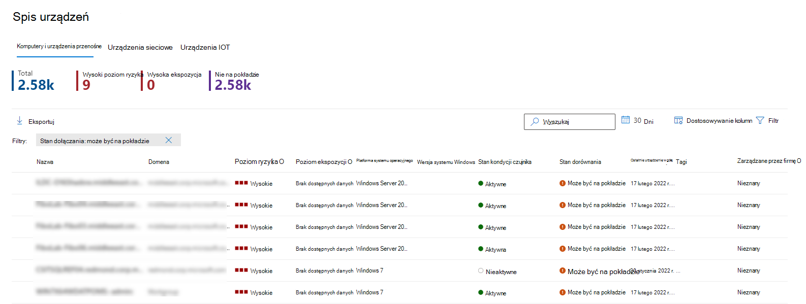

# <a name="device-discovery-overview"></a>Omówienie odnajdowania urządzeń

[!INCLUDE [Microsoft 365 Defender rebranding](../../includes/microsoft-defender.md)]

**Dotyczy:**
- [Microsoft Defender for Endpoint Plan 2](https://go.microsoft.com/fwlink/p/?linkid=2154037)
- [Microsoft 365 Defender](https://go.microsoft.com/fwlink/?linkid=2118804)

Ochrona środowiska wymaga spisu urządzeń dostępnych w sieci. Jednak urządzenia do mapowania w sieci często mogą być kosztowne, trudne i czasochłonne.

Program Microsoft Defender dla punktu końcowego oferuje funkcję odnajdowania urządzeń, która ułatwia znajdowanie nieza zarządzania urządzeniami połączonymi z siecią firmową bez konieczności obsługi dodatkowych urządzeń czy uciążliwych zmian w procesach. Odnajdowanie urządzeń używa w sieci nowych punktów końcowych do zbierania, skanowania lub skanowania sieci w celu odnalezienia urządzeń niezakierowanych. Funkcja odnajdowania urządzeń umożliwia odnajdowanie:

- Enterprise punktów końcowych (stacji roboczych, serwerów i urządzeń przenośnych), które nie są jeszcze podłączone do programu Microsoft Defender for Endpoint
- Urządzenia sieciowe, takie jak routery i przełączniki
- Urządzenia IoT, takie jak drukarki i kamery

Nieznane i niezakierowane urządzenia mogą stanowić istotne ryzyko dla sieci — niezależnie od tego, czy jest to drukarka bez wysyłki, urządzenia sieciowe z słabymi konfiguracjami zabezpieczeń, czy serwer bez kontroli zabezpieczeń. Po odnalezioniu urządzeń możesz:

- Wdowywają nieza zarządzania punktami końcowymi usługi, zwiększając widoczność zabezpieczeń na tych usługach.
- Zmniejsz powierzchnię ataków, identyfikując i oceniając luki w zabezpieczeniach oraz wykrywając luki w konfiguracji.

Obejrzyj ten klip wideo, aby szybko dowiedzieć się, jak odnajdować urządzenia:

> [!VIDEO https://www.microsoft.com/en-us/videoplayer/embed/RWORdQ]

W połączeniu z tą funkcją w ramach istniejącego rozwiązania do obsługi programu Microsoft Defender for Endpoint jest dostępne Zarządzanie zagrożeniami i lukami zabezpieczeń.

## <a name="discovery-methods"></a>Metody odnajdowania

Możesz wybrać tryb odnajdowania, który ma być używany przez urządzenia dołączane. Tryb steruje poziomem widoczności, który możesz uzyskać dla urządzeń niezawiązywnych w Twojej sieci firmowej.

Dostępne są dwa tryby odnajdowania:

- **Podstawowe odnajdowanie**: W tym trybie punkty końcowe będą pasywnie zbierać zdarzenia w Twojej sieci i wyodrębniać z nich informacje o urządzeniach. Podstawowe odnajdowanie używa danych binarnych SenseNDR.exe pasywnego zbierania danych sieciowych i ruch sieciowy nie zostanie zainicjowany. Punkty końcowe będą po prostu wyodrębniać dane z każdego ruchu sieciowego widocznego na urządzeniu wewnegłym. W przypadku podstawowego odnajdowania uzyskasz tylko ograniczoną widoczność nieza zarządzania punktami końcowymi w Twojej sieci.

- **Odnajdowanie standardowe** (zalecane): Ten tryb umożliwia punktom końcowym aktywnie znajdowanie urządzeń w Twojej sieci w celu wzbogacenia zebranych danych i znalezienia większej liczby urządzeń — pomaga w budowaniu niezawodnego i spójnego spisu urządzeń. Oprócz urządzeń obserwowanych przy użyciu metody pasywnej tryb standardowy korzysta również z typowych protokołów odnajdowania, które korzystają z zapytań wielocastowych w sieci, aby znaleźć jeszcze więcej urządzeń. W trybie standardowym są używane inteligentne, aktywne funkcje  probowania w celu odnajdowania dodatkowych informacji o obserwowanych urządzeniach w celu wzbogacenia istniejących informacji o urządzeniach. Po włączeniu trybu standardowego aktywność sieciowa wygenerowana przez czujnik odnajdowania może być niewielka i generowana przez ten czujnik, co może być obserwowane przez narzędzia do monitorowania sieci w organizacji.

Możesz zmienić i dostosować ustawienia odnajdowania, aby uzyskać więcej informacji, zobacz Konfigurowanie [odnajdowania urządzeń](configure-device-discovery.md).

> [!IMPORTANT]
> Odnajdowanie standardowe to tryb domyślny dla wszystkich klientów rozpoczynających się 19 lipca 2021 r. Możesz zmienić tę konfigurację na podstawową za pośrednictwem strony ustawień. W przypadku wybrania trybu podstawowego uzyskasz tylko ograniczoną widoczność nieza zarządzania punktami końcowymi w Twojej sieci.

> [!NOTE]
> Aparat odnajdowania rozróżnia zdarzenia sieciowe odbierane w sieci firmowej, a nie poza siecią firmową. Urządzenia, które nie są połączone z sieciami firmowymi, nie zostaną wykryte ani nie będą wymienione w spisie urządzeń.

## <a name="device-inventory"></a>Spis urządzeń

Urządzenia, które zostały odkryte, ale nie zostały jeszcze naniesone i zabezpieczone przez program Microsoft Defender for Endpoint, będą wymienione w spisie urządzeń na karcie Komputery i urządzenia przenośne.

Aby ocenić te urządzenia, możesz użyć filtru na liście zasobów urządzeń o nazwie Stan dołączania, który może mieć dowolną z następujących wartości:

- Onboarded: Punkt końcowy jest dołączany do programu Microsoft Defender for Endpoint.
- Może zostać wnoszony: Punkt końcowy został wykryty w sieci, a system operacyjny został zidentyfikowany jako obsługiwany przez usługę Microsoft Defender for Endpoint, ale obecnie nie jest on dołączany. Zdecydowanie zalecamy dołączanie tych urządzeń.
- Nieobsługiwane: Punkt końcowy został wykryty w sieci, ale nie jest obsługiwany przez program Microsoft Defender for Endpoint.
- Za mało informacji: System nie mógł określić możliwości obsługi urządzenia. Włączenie standardowego odnajdowania na większej liczby urządzeń w sieci może wzbogacić wykryte atrybuty.



> [!TIP]
> Zawsze możesz zastosować filtry, aby wykluczyć urządzenia nieza zarządzanie z listy zasobów w spisie urządzeń. Możesz również użyć kolumny stanu dołączania w zapytaniach interfejsu API, aby odfiltrować urządzenia nieza zarządzanie.

Aby uzyskać więcej informacji, zobacz [Spis urządzeń](machines-view-overview.md).

## <a name="network-device-discovery"></a>Odnajdowanie urządzeń sieciowych

Duża liczba niezamanektowanych urządzeń sieciowych wdrożonych w organizacji jest dużym obszarem ataków i stanowi istotne ryzyko dla całego przedsiębiorstwa. Program Microsoft Defender for Endpoint, funkcje odnajdowania sieci pomagają zagwarantować, że urządzenia sieciowe zostaną odkryte, dokładnie klasyfikowane i dodane do spisu zasobów.

Urządzenia sieciowe nie są zarządzane jako standardowe punkty końcowe, ponieważ program Defender for Endpoint nie ma wbudowanego czujnika w urządzenia sieciowe. Te typy urządzeń wymagają podejścia bez agenta, w którym skanowanie zdalne uzyska niezbędne informacje z urządzeń. W tym celu w każdym segmencie sieci zostanie użyty wskazany program Microsoft Defender for Endpoint device do wykonywania okresowych uwierzytelnionych skanów wstępnie skonfigurowanych urządzeń sieciowych. Po odkrytiu funkcje łączności usługi Defender for Endpoint Zarządzanie zagrożeniami i lukami zintegrowanych przepływów pracy w celu zabezpieczenia przełączników, routerów, kontrolerów WLAN, zapór i bram VPN.

Aby uzyskać więcej informacji, zobacz [Urządzenia sieciowe](network-devices.md).

## <a name="device-discovery-integrations"></a>Integracje odnajdowania urządzeń

Aby rozwiązać problem uzyskania wystarczającej widoczności w celu zlokalizowania, zidentyfikowania i zabezpieczenia pełnego spisu zasobów usług OT/IOT usługa Microsoft Defender for Endpoint obsługuje teraz następujące funkcje integracji:

- **Corelight**: Firma Microsoft współpracuje z firmą Corelight, aby odbierać dane z urządzeń sieciowych corelight. Zapewnia to Microsoft 365 Defender lepszą widoczność działań sieciowych urządzeń niezawiązyanych, w tym komunikacji z innymi urządzeniami niezamanektowymi lub sieciami zewnętrznymi. Aby uzyskać więcej informacji, zobacz [Włączanie integracji danych z programem Corelight](corelight-integration.md).

- **Microsoft Defender for IoT**: Ta integracja łączy program Microsoft Defender for Endpoint z możliwościami odnajdowania urządzeń i bez agenta usługi Microsoft Defender dla IoT, aby zabezpieczyć urządzenia IoT przedsiębiorstwa połączone z siecią IT (na przykład VoIP, Voice over Internet Protocol), drukarki i inteligentne telewizory. Aby uzyskać więcej informacji, zobacz [Włączanie integracji z usługą Microsoft Defender dla IoT](enable-microsoft-defender-for-iot-integration.md).

## <a name="vulnerability-assessment-on-discovered-devices"></a>Ocena luk w zabezpieczeniach wykrytych urządzeń

Luki w zabezpieczeniach i czynniki ryzyka związane z urządzeniami, a także inne odkryte urządzenia w sieci, które nie są niezawiązane, są częścią bieżących przepływów telewizyjnych w ramach "Zabezpieczenia Rekomendacje" i reprezentujących je na stronach encji w portalu.
Wyszukaj zalecenia dotyczące zabezpieczeń związane z SSH, aby znaleźć luki w zabezpieczeniach związane z zabezpieczeniami SSH, które są związane z urządzeniami nieza zarządzaniem i zarządzanymi.


## <a name="use-advanced-hunting-on-discovered-devices"></a>Użyj zaawansowanego wyszukiwania na wykrytych urządzeniach

Za pomocą zapytań wyszukiwania zaawansowanego możesz uzyskać widoczność na wykrytych urządzeniach.
Szczegółowe informacje o wykrytych punktach końcowych znajdziesz w tabeli DeviceInfo lub informacje o tych urządzeniach powiązane z siecią w tabeli DeviceNetworkInfo.


Odnajdowanie urządzeń korzysta z usługi Microsoft Defender dla urządzeń onboarded Endpoint jako sieciowego źródła danych do atrybutów działań dla urządzeń niewnienych. Oznacza to, że jeśli urządzenie w onboarded programu Microsoft Defender for Endpoint jest komunikowane z urządzeniem niewłokim, działania na urządzeniu niewłokim są widoczne na osi czasu i w tabeli Zaawansowane chłonie DeviceNetworkEvents.

Nowe zdarzenia są oparte na połączeniach TCP (Transmission Control Protocol) i będą dopasowane do bieżącego schematu DeviceNetworkEvents. Ruch tcp do urządzenia z włączonym programem Microsoft Defender dla punktu końcowego z urządzeń innych niż Program Microsoft Defender dla punktu końcowego włączonego.

Dodano również następujące typy akcji:

- ConnectionAttempt — próba nawiązania połączenia TCP (syn)
- ConnectionAcknowledged — potwierdzenie, że połączenie TCP zostało zaakceptowane (syn\ack)

Możesz wypróbować to zapytanie przykładowe:

```text
DeviceNetworkEvents
| where ActionType == "ConnectionAcknowledged" or ActionType == "ConnectionAttempt"
| take 10
```

## <a name="next-steps"></a>Następne kroki

- [Konfigurowanie odnajdowania urządzeń](configure-device-discovery.md)
- [Odnajdowanie urządzeń : często zadawane pytania](device-discovery-faq.md)
