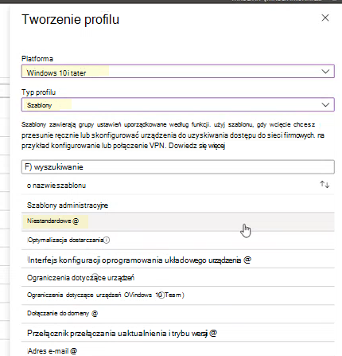

# <a name="enable-attack-surface-reduction-rules"></a>Włączanie reguł ograniczania powierzchni ataków

**Dotyczy:**

- [Microsoft Defender for Endpoint Plan 2](https://go.microsoft.com/fwlink/p/?linkid=2154037)
- [Microsoft 365 Defender](https://go.microsoft.com/fwlink/?linkid=2118804)

> [!TIP]
> Chcesz mieć dostęp do usługi Defender dla punktu końcowego? [Zarejestruj się, aby korzystać z bezpłatnej wersji próbnej.](https://signup.microsoft.com/create-account/signup?products=7f379fee-c4f9-4278-b0a1-e4c8c2fcdf7e&ru=https://aka.ms/MDEp2OpenTrial?ocid=docs-wdatp-assignaccess-abovefoldlink)

[Reguły ograniczania powierzchni ataków](attack-surface-reduction.md) (ASR) pomagają zapobiegać działaniom, które złośliwe oprogramowanie często nadużywa do naruszenia bezpieczeństwa urządzeń i sieci.

## <a name="requirements"></a>Wymagania

Funkcje zmniejszania powierzchni ataków w Windows wersjach

Możesz ustawić reguły zmniejszania powierzchni ataków dla urządzeń z dowolną z następujących wersji i wersji programu Windows:

- Windows 10 Pro, [wersja 1709](/windows/whats-new/whats-new-windows-10-version-1709) lub nowsza
- Windows 10 Enterprise, [wersja 1709](/windows/whats-new/whats-new-windows-10-version-1709) lub nowsza
- Windows Server w [wersji 1803 (półroczny kanał)](/windows-server/get-started/whats-new-in-windows-server-1803) lub nowszej
- [Windows Server 2019](/windows-server/get-started-19/whats-new-19)
- [Windows Server 2016](/windows-server/get-started/whats-new-in-windows-server-2016)
- [Windows Server 2012 R2](/windows/win32/srvnodes/what-s-new-for-windows-server-2012-r2)
- Windows Server 2022

Aby użyć całego zestawu funkcji reguł zmniejszania obszarów ataków, potrzebne są:

- Program antywirusowy Windows Defender jako podstawowa audio/wideo (wł. ochrona w czasie rzeczywistym)
- [Ochrona przed dostarczaniem w](/windows/security/threat-protection/microsoft-defender-antivirus/enable-cloud-protection-microsoft-defender-antivirus) chmurze w dniu (niektóre reguły wymagają tego)
- Windows 10 Enterprise E5 lub E3

Mimo że reguły zmniejszania powierzchni ataków nie wymagają licencji [Windows E5](/windows/deployment/deploy-enterprise-licenses), z licencją Windows E5, możesz uzyskać zaawansowane funkcje zarządzania, w tym monitorowanie, analizy i przepływy pracy dostępne w programie Defender dla punktu końcowego, a także funkcje raportowania i konfiguracji w portalu <a href="https://go.microsoft.com/fwlink/p/?linkid=2077139" target="_blank">usługi Microsoft 365 Defender</a>. Te zaawansowane funkcje nie są dostępne w licencji E3, ale mimo to możesz za pomocą podglądu zdarzeń przeglądać zdarzenia zmniejszania powierzchni ataków.

Każda reguła asr zawiera jedno z czterech ustawień:

- **Nieskonfigurowane** |  **Wyłączone**: wyłącz regułę asr
- **Blokuj**: Włączanie reguły asr
- **Inspekcja**: Oceń wpływ reguły asr na organizację, jeśli jest włączona
- **Ostrzegaj**: Włącz regułę asr, ale zezwalaj użytkownikowi końcoweowi na obejście bloku

> [!IMPORTANT]
> Obecnie tryb ostrzegania nie jest obsługiwany dla trzech reguł asr podczas konfigurowania reguł asr w programie Microsoft Endpoint Manager (MEM). Aby dowiedzieć się więcej, [zobacz Przypadki, w których tryb ostrzegania nie jest obsługiwany](attack-surface-reduction.md#cases-where-warn-mode-is-not-supported).

Zalecamy używanie reguł ASR z licencją Windows E5 (lub podobną licencją SKU), aby skorzystać z zaawansowanych możliwości monitorowania i raportowania dostępnych w programie [Microsoft Defender for Endpoint](microsoft-defender-endpoint.md) (Defender for Endpoint). Jeśli jednak masz inną licencję, na przykład Windows Professional lub Windows E3, która nie obejmuje zaawansowanych możliwości monitorowania i raportowania, możesz opracować własne narzędzia do monitorowania i raportowania poza zdarzeniami generowanymi w każdym punkcie końcowym w przypadku uruchomienia reguł zaawansowanego monitorowania i raportowania (na przykład Przesyłanie dalej zdarzeń).

> [!TIP]
> Aby dowiedzieć się więcej o licencjonowaniu Windows, zobacz Windows 10 [Licencjonowanie zbiorowe](https://www.microsoft.com/licensing/product-licensing/windows10?activetab=windows10-pivot:primaryr5) i uzyskaj przewodnik [licencjonowania zbiorowego dla Windows 10](https://download.microsoft.com/download/2/D/1/2D14FE17-66C2-4D4C-AF73-E122930B60F6/Windows-10-Volume-Licensing-Guide.pdf).

Reguły ograniczania powierzchni ataków można włączyć, używając dowolnej z tych metod:

- [Microsoft Intune](#intune)
- [Zarządzanie urządzeniami przenośnymi](#mdm)
- [Microsoft Endpoint Configuration Manager](#microsoft-endpoint-configuration-manager)
- [zasady grupy](#group-policy)
- [PowerShell](#powershell)

Enterprise, takie jak Intune czy Microsoft Endpoint Manager, jest zalecane. Enterprise zarządzania na poziomie komputera zastąpi wszelkie ustawienia programu zasady grupy lub PowerShell podczas uruchamiania.

## <a name="exclude-files-and-folders-from-asr-rules"></a>Wyklucz pliki i foldery z reguł ASR

Możesz wykluczyć pliki i foldery z oceny przez większość reguł ograniczania powierzchni ataków. Oznacza to, że nawet jeśli reguła asr określi, że plik lub folder zawiera złośliwe zachowanie, nie zablokuje możliwości jego uruchamiania. Może to potencjalnie umożliwić uruchamianie i zainfekowanie urządzeń niebezpiecznymi plikami.

Możesz również wykluczyć reguły asr z wyzwalania na podstawie certyfikatu i skrótów plików, zezwalając na określony program Defender dla pliku punktu końcowego i wskaźników certyfikatu. (Zobacz [Zarządzanie wskaźnikami](manage-indicators.md)).

> [!IMPORTANT]
> Wykluczenie plików lub folderów może znacznie zmniejszyć ochronę zapewnianą przez reguły asr. Pliki wykluczone mogą być uruchamiane i nie będą rejestrowane żadne raporty ani zdarzenia.
> Jeśli reguły ASR wykryją pliki, które uważasz, że nie powinny zostać wykryte, najpierw przetestuj regułę [w trybie inspekcji](evaluate-attack-surface-reduction.md).

Możesz określić pojedyncze pliki lub foldery (używając ścieżek folderów lub w pełni kwalifikowanych nazw zasobów), ale nie możesz określić reguł, których będą dotyczyć wykluczenia. Wykluczenie jest stosowane tylko w momencie uruchamiania aplikacji lub usługi wykluczonych. Jeśli na przykład dodasz wykluczenie dla usługi aktualizacji, która jest już uruchomiona, usługa aktualizacji będzie nadal wyzwalać zdarzenia do momentu zatrzymania i ponownego uruchomienia usługi.

Reguły ASR obsługują zmienne środowiskowe i symbole wieloznaczne. Aby uzyskać informacje dotyczące używania symboli wieloznacznych, zobacz Używanie symboli wieloznacznych w nazwach plików [i ścieżkach folderów lub na listach wykluczeń rozszerzenia](configure-extension-file-exclusions-microsoft-defender-antivirus.md#use-wildcards-in-the-file-name-and-folder-path-or-extension-exclusion-lists).

## <a name="policy-conflict"></a>Konflikt zasad

1. Jeśli zasady powodujące konflikty są stosowane za pośrednictwem usługi MDM i GP, ustawienie stosowane z usługi MDM ma pierwszeństwo.

2. Reguły ograniczania powierzchni ataków dla urządzeń zarządzanych przez MEM obsługują teraz zachowanie w przypadku fuzji ustawień z różnych zasad w celu utworzenia nowego zestawu zasad dla każdego urządzenia. Scalane są tylko ustawienia, które nie są w konflikcie, natomiast te, które są w konflikcie, nie są dodawane do zestawu reguł. Wcześniej, jeśli dwie zasady uwzględniały konflikty dotyczące jednego ustawienia, obie zasady zostały oflagowane jako powodujące konflikt i nie wdrożono żadnych ustawień z żadnego z tych profilów. Zachowanie scalania zasady zmniejszania powierzchni ataków jest następujące:
   - Reguły zmniejszania powierzchni ataków z następujących profilów są obliczane dla każdego urządzenia, do którego są stosowane:
     - Urządzenia > konfiguracji > profilu ochrony punktu końcowego > **Microsoft Defender Exploit Guard** >  [Attack Surface Reduction](/mem/intune/protect/endpoint-protection-windows-10#attack-surface-reduction-rules).
     - Zabezpieczenia punktu końcowego > **Zasady ograniczania powierzchni** >  [atakówZałącz reguły ograniczania powierzchni](/mem/intune/protect/endpoint-security-asr-policy#devices-managed-by-intune).
     - Zabezpieczenia punktu końcowego > podstawowych zabezpieczeń > **Microsoft Defender ATP BaselineAttack** >  [Surface Reduction Rules](/mem/intune/protect/security-baseline-settings-defender-atp#attack-surface-reduction-rules).
   - Ustawienia, które nie mają konfliktów, są dodawane do nadsyłki zasad dla urządzenia.
   - Jeśli co najmniej dwie zasady mają ustawienia powodujące konflikt, ustawienia powodujące konflikty nie są dodawane do połączonych zasad, natomiast ustawienia, które nie kolidują z konfliktem, są dodawane do zasad zestawu superset dotyczących urządzenia.
   - Wsypuje się tylko konfiguracje ustawień powodujące konflikt.

## <a name="configuration-methods"></a>Metody konfiguracji

Ta sekcja zawiera szczegółowe informacje o konfiguracji następujących metod konfiguracji:

- [Intune](#intune)
- [MEM](#mem)
- [MDM](#mdm)
- [Microsoft Endpoint Configuration Manager](#microsoft-endpoint-configuration-manager)
- [zasady grupy](#group-policy)
- [PowerShell](#powershell)

Poniższe procedury włączania reguł ASR zawierają instrukcje dotyczące wykluczania plików i folderów.

### <a name="intune"></a>Intune

#### <a name="device-configuration-profiles"></a>Profile konfiguracji urządzenia

1. Wybierz **pozycję Profile konfiguracji** \> **urządzenia**. Wybierz istniejący profil ochrony punktu końcowego lub utwórz nowy. Aby utworzyć nowy profil, wybierz **pozycję Utwórz profil** i wprowadź informacje dotyczące tego profilu. W **przypadku opcji Typ profilu** wybierz pozycję **Ochrona punktu końcowego**. Jeśli wybrano istniejący profil, wybierz pozycję **Właściwości**, a następnie wybierz pozycję **Ustawienia**.

2. W **okienku Ochrona punktu** końcowego wybierz pozycję **Windows Defender Exploit Guard**, a następnie wybierz **pozycję Zmniejszenie powierzchni ataków**. Wybierz odpowiednie ustawienie dla każdej reguły asr.

3. W **obszarze Wyjątki od zmniejszania powierzchni ataków** wprowadź pojedyncze pliki i foldery. Możesz również wybrać pozycję **Importuj,** aby zaimportować plik CSV zawierający pliki i foldery do wykluczenia z reguł ASR. Każdy wiersz w pliku CSV powinien być sformatowany w następujący sposób:

   `C:\folder`, `%ProgramFiles%\folder\file`, `C:\path`

4. Wybierz **przycisk OK** w trzech okienkach konfiguracji. Następnie wybierz **pozycję Utwórz**, jeśli tworzysz nowy plik ochrony punktu końcowego, lub Zapisz, jeśli edytujesz istniejący.

#### <a name="endpoint-security-policy"></a>Zasady zabezpieczeń punktu końcowego**

1. Wybierz zmniejszenie **powierzchni ataków na** \> **zabezpieczenia punktów końcowych**. Wybierz istniejącą regułę asr lub utwórz nową. Aby utworzyć nową, wybierz **pozycję Utwórz zasady** i wprowadź informacje dla tego profilu. Dla **opcji Typ profilu** wybierz **pozycję Reguły zmniejszania powierzchni ataków**. Jeśli wybrano istniejący profil, wybierz pozycję **Właściwości**, a następnie wybierz pozycję **Ustawienia**.

2. W **okienku Ustawienia konfiguracji** wybierz pozycję **Zmniejszenie powierzchni** ataków, a następnie wybierz odpowiednie ustawienie dla każdej reguły asr.

3. W **obszarze Lista dodatkowych** **folderów, które** muszą być **chronione, Lista** aplikacji, które mają dostęp do folderów chronionych i Wyklucz pliki i ścieżki z reguł ograniczania obszarów ataków wprowadź poszczególne pliki i foldery. Możesz również wybrać pozycję **Importuj,** aby zaimportować plik CSV zawierający pliki i foldery do wykluczenia z reguł ASR. Każdy wiersz w pliku CSV powinien być sformatowany w następujący sposób:

   `C:\folder`, `%ProgramFiles%\folder\file`, `C:\path`

4. Wybierz **pozycję Dalej** w trzech okienkach konfiguracji, a następnie  wybierz pozycję Utwórz, jeśli tworzysz nowe zasady,  lub pozycję Zapisz, jeśli edytujesz istniejące zasady.

### <a name="mem"></a>MEM

Za pomocą interfejsu Microsoft Endpoint Manager OMA-URI możesz skonfigurować niestandardowe reguły ASR. W poniższej procedurze użyto w tym przykładzie [reguły Blokuj nadużycie wykorzystującego podpisane](attack-surface-reduction-rules-reference.md#block-abuse-of-exploited-vulnerable-signed-drivers) sterowniki.

1. Otwórz centrum Microsoft Endpoint Manager administracyjnego programu PowerPoint. W menu **Narzędzia** główne kliknij pozycję  **Urządzenia**, wybierz pozycję **Profile konfiguracji**, a następnie kliknij **pozycję Utwórz profil**.

   > [!div class="mx-imgBorder"]
   > 

2. W **menu Utwórz** profil na dwóch następujących listach rozwijanych wybierz następujące elementy:

   - Na **platformie** wybierz pozycję **Windows 10 lub nowsze**
   - W **typie profilu** wybierz pozycję **Szablony**
   - Jeśli reguły asr są już ustawione przy użyciu opcji Zabezpieczenia punktu końcowego, w **typie profilu** wybierz pozycję **Ustawienia usługi**.

   Wybierz **pozycję Niestandardowe**, a następnie wybierz **pozycję Utwórz**.

   > [!div class="mx-imgBorder"]
   > 

3. Narzędzie Szablon niestandardowy zawiera krok **1 — podstawy**. W **polu 1 Podstawy** **w polu Nazwa** wpisz nazwę szablonu, a w polu Opis możesz wpisać opis  (opcjonalnie).

   > [!div class="mx-imgBorder"]
   > 

4. Kliknij **Dalej**. Zostanie **otwarty krok 2 Ustawienia konfiguracji** . W przypadku Ustawienia OMA-URI kliknij przycisk **Dodaj**. Zostaną wyświetlone dwie opcje: **Dodaj i** **Eksportuj**.

   > [!div class="mx-imgBorder"]
   > 

5. Kliknij **ponownie przycisk Dodaj** . Zostanie **otwarte okno Ustawienia OMA-URI** Dodaj wiersz. W **programie Add Row** (Dodaj wiersz) wykonaj następujące czynności:

   - **W imieniu** użytkownika wpisz nazwę reguły.
   - W **polu** Opis wpisz krótki opis.
   - W **oknie OMA-URI** wpisz lub wklej określony link OMA-URI dla reguły, która dodajesz. Zapoznaj się z sekcją MDM w tym artykule, aby zapoznać się z regułą OMA-URI, która ma być przykładem. Aby uzyskać informacje na temat reguł ograniczania powierzchni ataków, zobacz [Opisy poszczególnych reguł](attack-surface-reduction-rules-reference.md#per-rule-descriptions) w temacie: Reguły ograniczania powierzchni ataków.
   - W **polecej** Typ danych wybierz pozycję **Ciąg**.
   - W **obszarze Wartość** wpisz lub wklej wartość GUID, znak \= i wartość Województwo bez spacji (_GUID=Wartość Województwa_). Gdzie:

     - 0: Wyłącz (wyłącz regułę asr)
     - 1: Blok (włącz regułę ASR)
     - 2: Inspekcja (oceń wpływ reguły asr na organizację, jeśli jest włączona)
     - 6: Ostrzegaj (włącz regułę asr, ale zezwalaj użytkownikowi końcoweowi na obejście bloku)

   > [!div class="mx-imgBorder"]
   > 

6. Wybierz **Zapisz**. **Przycisk Dodaj** wiersz jest zamykany. W **niestandardowych**, wybierz **Dalej**. W kroku **3 Tagi zakresu** są opcjonalne. Wykonaj jeden z następujących kroków:

   - Wybierz **pozycję Wybierz tagi zakresu**, wybierz tag zakresu (opcjonalnie), a następnie wybierz pozycję **Dalej**.
   - Lub wybierz pozycję **Dalej**

7. W kroku **4 Zadania** **w grupie Uwzględnione** dla grup, które mają być stosowane przez tę regułę, wybierz jedną z następujących opcji:

   - **Dodawanie grup**
   - **Dodaj wszystkich użytkowników**
   - **Dodaj wszystkie urządzenia**

   > [!div class="mx-imgBorder"]
   > 

8. W **wykluczanych grupach** zaznacz wszystkie grupy, które chcesz wykluczyć z tej reguły, a następnie wybierz przycisk **Dalej**.

9. W kroku **5 Reguły stosowania** dla następujących ustawień wykonaj następujące czynności:

   - W **regułach** wybierz **opcję Przypisz profil, jeśli** lub **Nie przypisz profilu, jeśli**
   - We **właściwości** wybierz właściwość, do której chcesz zastosować tę regułę.
   - W **wartość** wprowadź odpowiednie wartości lub zakres wartości.

   > [!div class="mx-imgBorder"]
   > 

10. Wybierz pozycję **Dalej**. W kroku **6 Przeglądanie + tworzenie** przejrzyj ustawienia i informacje, które zostały wybrane i wprowadzone, a następnie wybierz pozycję **Utwórz**.

    > [!div class="mx-imgBorder"]
    > 

    > [!NOTE]
    > Reguły są aktywne i dostępne w ciągu kilku minut.

> [!NOTE]
> Obsługa konfliktów:
>
> Jeśli przypiszesz urządzenie do dwóch różnych zasad asr, sposobem rozwiązywania konfliktów są reguły, do których są przypisywane różne stany, nie istnieje żadne zarządzanie konfliktami, a wynikiem jest błąd.
>
> Reguły, które nie kolidowały ze sobą, nie będą powodować błędu i reguła zostanie zastosowana poprawnie. W efekcie stosowana jest pierwsza reguła, a kolejne reguły nie powodujące konfliktu są scalane z zasadami.

### <a name="mdm"></a>MDM

Użyj [konfiguracji ./Vendor/MSFT/Policy/Config/Defender/AttackSurfaceReductionRules](/windows/client-management/mdm/policy-csp-defender#defender-attacksurfacereductionrules) usługodawca (CSP), aby osobno włączyć i ustawić tryb dla każdej reguły.

Poniżej przedstawiono przykładowy przykład do użycia z wartościami GUID dla odwołania [do reguł](attack-surface-reduction-rules-reference.md) zmniejszania powierzchni ataków.

`OMA-URI path: ./Vendor/MSFT/Policy/Config/Defender/AttackSurfaceReductionRules`

`Value: 75668c1f-73b5-4cf0-bb93-3ecf5cb7cc84=2|3b576869-a4ec-4529-8536-b80a7769e899=1|d4f940ab-401b-4efc-aadc-ad5f3c50688a=2|d3e037e1-3eb8-44c8-a917-57927947596d=1|5beb7efe-fd9a-4556-801d-275e5ffc04cc=0|be9ba2d9-53ea-4cdc-84e5-9b1eeee46550=1`

Wartości, które należy włączyć (Zablokować), wyłączyć, ostrzegać lub włączyć w trybie inspekcji to:

- 0: Wyłącz (wyłącz regułę asr)
- 1: Blok (włącz regułę ASR)
- 2: Inspekcja (oceń wpływ reguły asr na organizację, jeśli jest włączona)
- 6: Ostrzegaj (włącz regułę asr, ale zezwalaj użytkownikowi końcoweowi na obejście bloku). Tryb ostrzegania jest dostępny dla większości reguł asr.

Aby dodać wykluczenia, użyj konfiguracji [./Vendor/MSFT/Policy/Config/Defender/AttackSurfaceReductionOnlyExclusions](/windows/client-management/mdm/policy-csp-defender#defender-attacksurfacereductiononlyexclusions) usługodawca (CSP).

Przykład:

`OMA-URI path: ./Vendor/MSFT/Policy/Config/Defender/AttackSurfaceReductionOnlyExclusions`

`Value: c:\path|e:\path|c:\Exclusions.exe`

> [!NOTE]
> Pamiętaj o wprowadzeniu wartości OMA-URI bez spacji.

### <a name="microsoft-endpoint-configuration-manager"></a>Microsoft Endpoint Configuration Manager

1. W Microsoft Endpoint Configuration Manager przejdź do zasobów i **zgodności w** \> **Endpoint Protection** \> **Windows Defender Exploit Guard**.

2. Wybierz **pozycję Zasady Exploit** \> **Guard dla użytkowników domowych.**

3. Wprowadź nazwę i opis, wybierz pozycję **Zmniejszenie powierzchni w** przypadku ataków i wybierz pozycję **Dalej**.

4. Wybierz reguły blokowania lub inspekcji akcji, a następnie wybierz pozycję **Dalej**.

5. Przejrzyj ustawienia i wybierz pozycję **Dalej** , aby utworzyć zasady.

6. Po utworzeniu zasad wybierz pozycję **Zamknij**.

### <a name="group-policy"></a>zasady grupy

> [!WARNING]
> Jeśli zarządzasz komputerami i urządzeniami za pomocą usługi Intune, Menedżer konfiguracji lub innej platformy zarządzania na poziomie przedsiębiorstwa, oprogramowanie do zarządzania zastąpi wszelkie ustawienia zasady grupy podczas uruchamiania.

1. Na komputerze zasady grupy zarządzania usługami otwórz konsolę zarządzania usługami [zasady grupy, kliknij](https://technet.microsoft.com/library/cc731212.aspx) prawym przyciskiem myszy zasady grupy obiekt, który chcesz skonfigurować, a następnie wybierz pozycję **Edytuj**.

2. W **edytorze zasady grupy zarządzaniem** przejdź do **strony Konfiguracja komputera** i wybierz pozycję **Szablony administracyjne**.

3. Rozwiń drzewo, **aby Windows składniki Program antywirusowy Microsoft Defender** \>  \> **Microsoft Defender Exploit Guard** \> **zmniejszenie powierzchni ataków**.

4. Wybierz **pozycję Konfiguruj reguły zmniejszania powierzchni ataków i** wybierz pozycję **Włączone**. Następnie możesz ustawić poszczególne województwa dla każdej reguły w sekcji opcji. Wybierz **pozycję Pokaż i** wprowadź identyfikator reguły w kolumnie Nazwa  wartości oraz wybrany stan w kolumnie Wartość w następujący  sposób:

   - 0: Wyłącz (wyłącz regułę asr)
   - 1: Blok (włącz regułę ASR)
   - 2: Inspekcja (oceń wpływ reguły asr na organizację, jeśli jest włączona)
   - 6: Ostrzegaj (włącz regułę asr, ale zezwalaj użytkownikowi końcoweowi na obejście bloku)

   :::image type="content" source="images/asr-rules-gp.png" alt-text="Reguły asr w programie zasady grupy.":::

5. Aby wykluczyć pliki i foldery z reguł ASR,  wybierz ustawienie Wyklucz pliki i ścieżki z reguł zmniejszania powierzchni ataków i ustaw dla tej opcji wartość **Włączone**. Wybierz **pozycję** Pokaż i wprowadź każdy plik lub folder w **kolumnie Nazwa** wartości. Wprowadź **wartość 0** w **kolumnie Wartość** dla każdego elementu.

   > [!WARNING]
   > Cudzysłowów nie należy używać, ponieważ nie są obsługiwane  w przypadku kolumny Nazwa wartości ani **dla kolumny** Wartość.

### <a name="powershell"></a>PowerShell

> [!WARNING]
> Jeśli zarządzasz komputerami i urządzeniami za pomocą usługi Intune, Menedżer konfiguracji lub innej platformy zarządzania na poziomie przedsiębiorstwa, oprogramowanie zarządzania zastąpi wszelkie ustawienia programu PowerShell powodujące konflikt podczas uruchamiania. Aby umożliwić użytkownikom definiowanie wartości przy użyciu programu PowerShell, użyj opcji "Zdefiniowane przez użytkownika" dla reguły na platformie zarządzania.
> Reguła "Zdefiniowana przez użytkownika" umożliwia użytkownikowi lokalnemu skonfigurowanie reguły.
> Ustawienie opcji Zdefiniowane przez użytkownika jest wyświetlane na poniższej ilustracji.

> [!div class="mx-imgBorder"]
> 

1. Wpisz **tekst powershell** w menu Start kliknij prawym **przyciskiem myszy Windows PowerShell** a następnie wybierz **pozycję Uruchom jako administrator**.

2. Wpisz jeden z następujących cmdlet. (Aby uzyskać więcej [szczegółowych informacji](attack-surface-reduction-rules-reference.md) , takich jak identyfikator reguły, zobacz Informacje o regułach ograniczania powierzchni ataków).

    ```PowerShell
    Set-MpPreference -AttackSurfaceReductionRules_Ids <rule ID> -AttackSurfaceReductionRules_Actions Enabled
    ```

    Aby włączyć reguły asr w trybie inspekcji, użyj następującego polecenia cmdlet:

    ```PowerShell
    Add-MpPreference -AttackSurfaceReductionRules_Ids <rule ID> -AttackSurfaceReductionRules_Actions AuditMode
    ```

    Aby włączyć reguły ASR w trybie ostrzegania, użyj następującego polecenia cmdlet:

    ```PowerShell
    Add-MpPreference -AttackSurfaceReductionRules_Ids <rule ID> -AttackSurfaceReductionRules_Actions Warn
    ```

    Aby włączyć asr Block abuse of exploited vulnerable signed drivers, użyj następującego polecenia cmdlet:

   ```PowerShell
   Add-MpPreference -AttackSurfaceReductionRules_Ids 56a863a9-875e-4185-98a7-b882c64b5ce5 -AttackSurfaceReductionRules_Actions Enabled
   ```

    Aby wyłączyć reguły ASR, użyj następującego polecenia cmdlet:

    ```PowerShell
    Add-MpPreference -AttackSurfaceReductionRules_Ids <rule ID> -AttackSurfaceReductionRules_Actions Disabled
    ```

    > [!IMPORTANT]
    > Stan każdej reguły należy określić osobno, ale reguły i stany można łączyć w listę rozdzielaną przecinkami.
    >
    > W poniższym przykładzie zostaną włączone pierwsze dwie reguły, trzecia reguła zostanie wyłączona, a czwarta reguła zostanie włączona w trybie inspekcji:
    >
    > ```PowerShell
    > Set-MpPreference -AttackSurfaceReductionRules_Ids <rule ID 1>,<rule ID 2>,<rule ID 3>,<rule ID 4> -AttackSurfaceReductionRules_Actions Enabled, Enabled, Disabled, AuditMode
    > ```

    Możesz także użyć czasownika `Add-MpPreference` programu PowerShell, aby dodać nowe reguły do istniejącej listy.

    > [!WARNING]
    > `Set-MpPreference` zawsze zastąpi istniejący zestaw reguł. Jeśli chcesz dodać go do istniejącego zestawu, użyj go `Add-MpPreference` zamiast niego.
    > Listę reguł i ich bieżący stan można uzyskać za pomocą .`Get-MpPreference`

3. Aby wykluczyć pliki i foldery z reguł ASR, użyj następującego polecenia cmdlet:

    ```PowerShell
    Add-MpPreference -AttackSurfaceReductionOnlyExclusions "<fully qualified path or resource>"
    ```

    Nadal używaj dodawania `Add-MpPreference -AttackSurfaceReductionOnlyExclusions` kolejnych plików i folderów do listy.

    > [!IMPORTANT]
    > Użyj, `Add-MpPreference` aby dołączyć aplikacje do listy lub dodać je do listy. Użycie polecenia `Set-MpPreference` cmdlet spowoduje zastąpienie istniejącej listy.

## <a name="related-articles"></a>Artykuły pokrewne

- [Informacje dotyczące reguł zmniejszania powierzchni ataków](attack-surface-reduction-rules-reference.md)
- [Szacowanie zmniejszenia powierzchni ataków](evaluate-attack-surface-reduction.md)
- [Zmniejszenie powierzchni ataków — często zadawane pytania](attack-surface-reduction.md)
