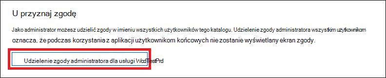

# <a name="create-an-app-to-access-microsoft-defender-for-endpoint-without-a-user"></a>Tworzenie aplikacji w celu uzyskania dostępu do programu Microsoft Defender dla punktu końcowego bez użytkownika

[!INCLUDE [Microsoft 365 Defender rebranding](../../includes/microsoft-defender.md)]


**Dotyczy:** 
- [Microsoft Defender for Endpoint Plan 2](https://go.microsoft.com/fwlink/?linkid=2154037)

> Chcesz mieć dostęp do programu Microsoft Defender dla punktu końcowego? [Zarejestruj się, aby korzystać z bezpłatnej wersji próbnej.](https://signup.microsoft.com/create-account/signup?products=7f379fee-c4f9-4278-b0a1-e4c8c2fcdf7e&ru=https://aka.ms/MDEp2OpenTrial?ocid=docs-wdatp-exposedapis-abovefoldlink)

[!include[Microsoft Defender for Endpoint API URIs for US Government](../../includes/microsoft-defender-api-usgov.md)]

[!include[Improve request performance](../../includes/improve-request-performance.md)]

Na tej stronie opisano, jak utworzyć aplikację w celu uzyskania dostępu programowego do usługi Defender for Endpoint bez użytkownika. Jeśli potrzebujesz dostępu programowego do usługi Defender for Endpoint w imieniu użytkownika, zobacz Uzyskiwanie [dostępu z kontekstem użytkownika](exposed-apis-create-app-nativeapp.md). Jeśli nie masz pewności, którego dostępu potrzebujesz, zobacz [Wprowadzenie](apis-intro.md).

Program Microsoft Defender for Endpoint udostępnia większość danych i akcji za pośrednictwem zestawu programistycznych interfejsów API. Te interfejsy API pomogą Ci zautomatyzować przepływy robocze i wprowadzać innowacje w oparciu o możliwości usługi Defender for Endpoint. Dostęp do interfejsu API wymaga uwierzytelniania OAuth2.0. Aby uzyskać więcej informacji, zobacz [Kod autoryzacji protokołu OAuth 2.0 Flow](/azure/active-directory/develop/active-directory-v2-protocols-oauth-code).

Aby korzystać z interfejsów API, musisz wykonać następujące czynności:
- Utwórz aplikację usługi Azure Active Directory (Azure AD).
- Uzyskaj token dostępu przy użyciu tej aplikacji.
- Użyj tego tokenu, aby uzyskać dostęp do usługi Defender for Endpoint API.

W tym artykule wyjaśniono, jak utworzyć aplikację usługi Azure AD, uzyskać token dostępu do programu Microsoft Defender dla punktu końcowego i zweryfikować token.

## <a name="create-an-app"></a>Tworzenie aplikacji

1. Zaloguj się do [platformy Azure](https://portal.azure.com) przy użyciu użytkownika z rolą **administratora globalnego** .

2. Przejdź do **Azure Active Directory** \> **Rejestracja aplikacji Nowa** \> **rejestracja**. 

    :::image type="content" alt-text="Obraz Microsoft Azure nawigacji do rejestracji aplikacji." source="images/atp-azure-new-app2.png" lightbox="images/atp-azure-new-app2.png":::

3. W formularzu rejestracji wybierz nazwę aplikacji, a następnie wybierz pozycję **Zarejestruj**.

4. Aby umożliwić aplikacji dostęp do usługi Defender dla punktu końcowego i przypisać jej uprawnienie **"** Odczyt wszystkich alertów", na stronie aplikacji wybierz pozycję Uprawnienia interfejsów API Dodaj interfejsy  **API** \> \> uprawnień, z których korzysta moja organizacja >, wpisz **WindowsDefenderATP**, a następnie wybierz **pozycję WindowsDefenderATP**.

   > [!NOTE]
   > *Funkcja WindowsDefenderATP* nie jest wyświetlana na oryginalnej liście. Zacznij pisać jego nazwę w polu tekstowym, aby ją wyświetlić.

   :::image type="content" alt-text="dodaj uprawnienie." source="images/add-permission.png" lightbox="images/add-permission.png":::

   Wybierz **pozycję Uprawnienia aplikacji** \> **Alert.Odczyt.Wszystko**, a następnie wybierz **pozycję Dodaj uprawnienia**.

   :::image type="content" alt-text="uprawnienia aplikacji." source="images/application-permissions.png" lightbox="images/application-permissions.png":::

     Należy wybrać odpowiednie uprawnienia. "Czytaj wszystkie alerty" to tylko przykład. Przykład:

     - Aby [uruchomić zapytania zaawansowane](run-advanced-query-api.md), wybierz uprawnienie Uruchamianie zapytań zaawansowanych.
     - Aby [odizolować urządzenie](isolate-machine.md), wybierz uprawnienie "Wyizoluj komputer".
     - Aby ustalić, jakich uprawnień potrzebujesz, zobacz **sekcję Uprawnienia** w interfejsie API, który chcesz wywołać.

5. Wybierz **pozycję Ut przyznaj zgodę**.

     > [!NOTE]
     > Za każdym razem, gdy dodajesz uprawnienie, musisz **wybrać pozycję** Udawaj zgodę, aby nowe uprawnienie było skuteczne.

    

6. Aby dodać do aplikacji klucz tajny, wybierz pozycję Certyfikaty **& sekretów**, dodaj opis do tajemnicy, a następnie wybierz pozycję **Dodaj**.

    > [!NOTE]
    > Po wybraniu **przycisku Dodaj** wybierz **pozycję kopiuj wygenerowaną wartość tajnych**. Po opuszczeniu tej wartości nie będzie można jej pobrać.

    

7. Zategolij swój identyfikator aplikacji i identyfikator dzierżawy. Na stronie aplikacji przejdź do strony **Omówienie i** skopiuj następujące informacje.

   :::image type="content" alt-text="Obraz utworzonego identyfikatora aplikacji." source="images/app-and-tenant-ids.png" lightbox="images/app-and-tenant-ids.png":::

8. **Tylko dla programu Microsoft Defender dla partnerów punktu końcowego**. Ustaw aplikację jako wielodostępną (dostępną we wszystkich dzierżawach po zgodzie). Jest to **wymagane** w przypadku aplikacji innych firm (na przykład w przypadku tworzenia aplikacji przeznaczonej do uruchamiania w dzierżawie wielu klientów). Nie **jest to** wymagane, jeśli utworzysz usługę, którą chcesz uruchomić tylko w dzierżawie (na przykład jeśli utworzysz aplikację do własnego użycia, która będzie wchodzić w interakcje tylko z Twoimi danymi). Aby ustawić aplikację jako wielodostępną:

    - Przejdź do **uwierzytelniania** i dodaj jako `https://portal.azure.com` redirect **URI (Przekieruj URI**).

    - U dołu strony w obszarze Obsługiwane **typy kont** wybierz opcję Konta w dowolnej  aplikacji katalogu organizacyjnego dla aplikacji z wieloma dzierżawami.

    Twoja aplikacja musi zostać zatwierdzona w każdej dzierżawie, w której zamierzasz jej używać. Jest to spowodowane tym, że Aplikacja komunikuje się z usługą Defender dla punktu końcowego w imieniu klienta.

    Ty (lub Twój klient, jeśli piszesz aplikację innej firmy) musisz wybrać link zgody i zatwierdzić aplikację. Zgoda powinna być udzielana użytkownikowi z uprawnieniami administracyjnymi w usłudze Active Directory.

    Link zgody jest formularzowany w następujący sposób: 

    ```https
    https://login.microsoftonline.com/common/oauth2/authorize?prompt=consent&client_id=00000000-0000-0000-0000-000000000000&response_type=code&sso_reload=true
    ```

    Gdzie 00000000-0000-0000-0000-0000000000000 zostanie zastąpiony Twoim identyfikatorem aplikacji.


**Ukończono!** Aplikacja została pomyślnie zarejestrowana! Zobacz poniższe przykłady dotyczące pozyskiwania i sprawdzania poprawności tokenu.

## <a name="get-an-access-token"></a>Uzyskiwanie tokenu dostępu

Aby uzyskać więcej informacji na temat tokenów usługi Azure AD, zobacz [samouczek dotyczący usługi Azure AD](/azure/active-directory/develop/active-directory-v2-protocols-oauth-client-creds).

### <a name="use-powershell"></a>Używanie programu PowerShell

```powershell
# This script acquires the App Context Token and stores it in the variable $token for later use in the script.
# Paste your Tenant ID, App ID, and App Secret (App key) into the indicated quotes below.

$tenantId = '' ### Paste your tenant ID here
$appId = '' ### Paste your Application ID here
$appSecret = '' ### Paste your Application key here

$resourceAppIdUri = 'https://api.securitycenter.microsoft.com'
$oAuthUri = "https://login.microsoftonline.com/$TenantId/oauth2/token"
$authBody = [Ordered] @{
    resource = "$resourceAppIdUri"
    client_id = "$appId"
    client_secret = "$appSecret"
    grant_type = 'client_credentials'
}
$authResponse = Invoke-RestMethod -Method Post -Uri $oAuthUri -Body $authBody -ErrorAction Stop
$token = $authResponse.access_token
```

### <a name="use-c"></a>Użyj języka C#:

Poniższy kod został przetestowany w programie NuGet Microsoft.IdentityModel.Clients.ActiveDirectory 3.19.8.

1. Utwórz nową aplikację konsoli.
1. Zainstaluj NuGet [witryny Microsoft.IdentityModel.Clients.ActiveDirectory](https://www.nuget.org/packages/Microsoft.IdentityModel.Clients.ActiveDirectory/).
1. Dodaj następujące informacje:

    ```csharp
    using Microsoft.IdentityModel.Clients.ActiveDirectory;
    ```

1. Skopiuj i wklej następujący kod w aplikacji (nie zapomnij zaktualizować trzech zmiennych: ```tenantId, appId, appSecret```):

    ```csharp
    string tenantId = "00000000-0000-0000-0000-000000000000"; // Paste your own tenant ID here
    string appId = "11111111-1111-1111-1111-111111111111"; // Paste your own app ID here
    string appSecret = "22222222-2222-2222-2222-222222222222"; // Paste your own app secret here for a test, and then store it in a safe place! 

    const string authority = "https://login.microsoftonline.com";
    const string wdatpResourceId = "https://api.securitycenter.microsoft.com";

    AuthenticationContext auth = new AuthenticationContext($"{authority}/{tenantId}/");
    ClientCredential clientCredential = new ClientCredential(appId, appSecret);
    AuthenticationResult authenticationResult = auth.AcquireTokenAsync(wdatpResourceId, clientCredential).GetAwaiter().GetResult();
    string token = authenticationResult.AccessToken;
    ```


### <a name="use-python"></a>Używanie języka Python

Zobacz [Uzyskiwanie tokenu za pomocą języka Python](run-advanced-query-sample-python.md#get-token).

### <a name="use-curl"></a>Używanie zwijania

> [!NOTE]
> W poniższej procedurze przyjęto, że program Curl for Windows jest już zainstalowany na komputerze.

1. Otwórz wiersz polecenia i ustaw dla CLIENT_ID azure identyfikator aplikacji.
1. Ustaw CLIENT_SECRET klucz tajny aplikacji platformy Azure.
1. Ustaw TENANT_ID azure identyfikator dzierżawy klienta, który chce uzyskać dostęp do usługi Defender dla punktu końcowego za pomocą twojej aplikacji.
1. Uruchom następujące polecenie:

    ```console
    curl -i -X POST -H "Content-Type:application/x-www-form-urlencoded" -d "grant_type=client_credentials" -d "client_id=%CLIENT_ID%" -d "scope=https://securitycenter.onmicrosoft.com/windowsatpservice/.default" -d "client_secret=%CLIENT_SECRET%" "https://login.microsoftonline.com/%TENANT_ID%/oauth2/v2.0/token" -k
    ```
    
    Odpowiedź otrzymasz w następującym formularzu:
    
    ```console
    {"token_type":"Bearer","expires_in":3599,"ext_expires_in":0,"access_token":"eyJ0eXAiOiJKV1QiLCJhbGciOiJSUzI1NiIsIn <truncated> aWReH7P0s0tjTBX8wGWqJUdDA"}
    ```
    
## <a name="validate-the-token"></a>Sprawdź poprawność tokenu

Upewnij się, że masz poprawny token:

1. Skopiuj i wklej token z poprzedniego kroku do aplikacji [JWT](https://jwt.ms) , aby go odkodować.

1. Sprawdź, czy masz "role" z wymaganymi uprawnieniami.

   Na poniższej ilustracji widać dekodowany token pozyskany z aplikacji z uprawnieniami do wszystkich ról programu Microsoft Defender dla punktu końcowego:

   :::image type="content" alt-text="Obraz sprawdzania poprawności tokenu." source="images/webapp-decoded-token.png" lightbox="images/webapp-decoded-token.png":::

## <a name="use-the-token-to-access-microsoft-defender-for-endpoint-api"></a>Korzystanie z tokenu w celu uzyskania dostępu do programu Microsoft Defender for Endpoint API

1. Wybierz interfejs API, którego chcesz użyć. Aby uzyskać więcej informacji, zobacz [Obsługiwany program Defender dla interfejsów API punktów końcowych](exposed-apis-list.md).
1. Ustaw nagłówek autoryzacji w żądaniu http, które wysyłasz na adres "Bearer {token}" (Bearer jest schematem autoryzacji).
1. Czas wygaśnięcia tokenu to godzina. Możesz wysłać więcej niż jedno żądanie z tym samym tokenem.

Poniżej przedstawiono przykład wysyłania żądania uzyskania listy alertów przy użyciu języka **C#**:

```csharp
var httpClient = new HttpClient();

var request = new HttpRequestMessage(HttpMethod.Get, "https://api.securitycenter.microsoft.com/api/alerts");

request.Headers.Authorization = new AuthenticationHeaderValue("Bearer", token);

var response = httpClient.SendAsync(request).GetAwaiter().GetResult();

// Do something useful with the response
```

## <a name="see-also"></a>Zobacz też
- [Obsługiwana usługa Microsoft Defender dla interfejsów API punktów końcowych](exposed-apis-list.md)
- [Uzyskiwanie dostępu do programu Microsoft Defender dla punktu końcowego w imieniu użytkownika](exposed-apis-create-app-nativeapp.md)
