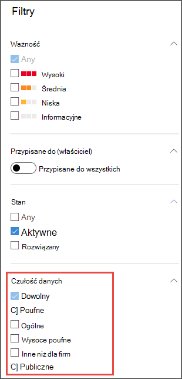

# Określanie priorytetów reakcji na zdarzenia przy użyciu etykiet wrażliwości

[!INCLUDE [Microsoft 365 Defender rebranding](../../includes/microsoft-defender.md)]

**Dotyczy:**
- [Microsoft Defender for Endpoint Plan 1](https://go.microsoft.com/fwlink/p/?linkid=2154037)
- [Microsoft Defender for Endpoint Plan 2](https://go.microsoft.com/fwlink/p/?linkid=2154037)
- [Microsoft 365 Defender](https://go.microsoft.com/fwlink/?linkid=2118804)

> Chcesz mieć dostęp do usługi Defender dla punktu końcowego? [Zarejestruj się, aby korzystać z bezpłatnej wersji próbnej.](https://signup.microsoft.com/create-account/signup?products=7f379fee-c4f9-4278-b0a1-e4c8c2fcdf7e&ru=https://aka.ms/MDEp2OpenTrial?ocid=docs-wdatp-exposedapis-abovefoldlink)

Typowy zaawansowany, trwały cykl życia zagrożeń obejmuje eksekwację danych. W przypadku zdarzeń dotyczących zabezpieczeń ważne jest, aby mieć możliwość ustalania priorytetów w przypadkach, gdy poufne pliki mogą stanowić zagrożenie dla danych firmowych i informacji.

Program Defender for Endpoint ułatwia ustalanie priorytetów zdarzeń zabezpieczających o wiele prostsze dzięki użyciu etykiet wrażliwości. Etykiety poufności szybko identyfikują zdarzenia, które mogą obejmować urządzenia z informacjami poufnymi, takimi jak informacje poufne.

## Badanie zdarzeń dotyczących danych poufnych

Dowiedz się, jak używać etykiet wrażliwości danych w celu ustalania priorytetów analizy zdarzeń.

> [!NOTE]
> Etykiety są wykrywane Windows 10, wersja 1809 lub nowszej, a Windows 11.

1. W Microsoft 365 Defender wiadomości wybierz pozycję **Zdarzenia i & Alerty** \> **o zdarzeniach**.

2. Przewiń w prawo, aby wyświetlić **kolumnę Czułość** danych. Ta kolumna zawiera etykiety wrażliwości obserwowane na urządzeniach w związku z zdarzeniami, ze wskazaniem, czy zdarzenia mogą dotyczyć poufnych plików.

    

    Możesz również filtrować według wrażliwości **na dane**

    

3. Otwórz stronę zdarzenia w celu dalszego zbadania.

    

4. Wybierz **kartę Urządzenia,** aby zidentyfikować urządzenia przechowujące pliki za pomocą etykiet wrażliwości.

    

5. Wybierz urządzenia przechowujące poufne dane i przeszukaj oś czasu, aby określić, których plików może to wpłynąć, a następnie podjąć odpowiednie działania w celu zapewnienia ochrony danych.

   Zdarzenia wyświetlane na osi czasu urządzenia można zawęzić, wyszukując etykiety wrażliwości danych. Spowoduje to pokazanie tylko zdarzeń skojarzonych z plikami o nazwie etykiety.

    

> [!TIP]
> Te punkty danych są również widoczne dzięki "DeviceFileEvents" w zaawansowanym chłoniu, dzięki czemu zaawansowane zapytania i planowanie wykrywania mogą uwzględniać etykiety wrażliwości i stan ochrony plików.
