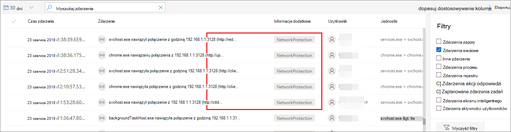

# <a name="investigate-connection-events-that-occur-behind-forward-proxies"></a>Badanie zdarzeń połączenia, które występują za serwerów proxy przesyłania dalej

[!INCLUDE [Microsoft 365 Defender rebranding](../../includes/microsoft-defender.md)]

**Dotyczy:**
- [Microsoft Defender for Endpoint Plan 2](https://go.microsoft.com/fwlink/p/?linkid=2154037)
- [Microsoft 365 Defender](https://go.microsoft.com/fwlink/?linkid=2118804)

> Chcesz mieć dostęp do usługi Defender dla punktu końcowego? [Zarejestruj się, aby korzystać z bezpłatnej wersji próbnej.](https://signup.microsoft.com/create-account/signup?products=7f379fee-c4f9-4278-b0a1-e4c8c2fcdf7e&ru=https://aka.ms/MDEp2OpenTrial?ocid=docs-wdatp-investigatemachines-abovefoldlink)

Program Defender for Endpoint obsługuje monitorowanie połączenia sieciowego z różnych poziomów stosu sieci. Trudnym zadaniem jest użycie przez sieć serwera proxy przesyłania dalej jako bramy do Internetu.

Serwer proxy działa tak, jakby był punktem końcowym. W takich przypadkach proste monitory połączeń sieciowych będą inspekcją połączeń z prawidłowym serwerem proxy, ale mają niższą wartość badania.

Program Defender for Endpoint obsługuje zaawansowane monitorowanie poziomu HTTP za pośrednictwem ochrony sieci. Gdy jest włączona, jest uwidoczniona nowa typ zdarzenia, która ujawnia rzeczywiste nazwy domen docelowych.

## <a name="use-network-protection-to-monitor-network-connection-behind-a-firewall"></a>Monitorowanie połączenia sieciowego za zaporą za pomocą ochrony sieci

Monitorowanie połączenia sieciowego za serwerem proxy przesyłania dalej jest możliwe ze względu na inne zdarzenia sieciowe, które pochodzą z ochrony sieci. Aby wyświetlić je na osi czasu urządzenia, włącz ochronę sieci (co najmniej w trybie inspekcji).

Ochronę sieci można kontrolować w następujących trybach:

- **Blokowanie**: Użytkownicy lub aplikacje mają zablokowaną opcję łączenia się z niebezpiecznymi domenami. To działanie będzie można zobaczyć w programie Microsoft 365 Defender.
- **Inspekcja**: Użytkownicy i aplikacje nie będą mieć zablokowanych połączeń z niebezpiecznymi domenami. Jednak to działanie będzie nadal dla Ciebie Microsoft 365 Defender.


Wyłączenie ochrony sieci nie będzie blokowane użytkownikom ani aplikacjom na nawiązywanie połączeń z niebezpiecznymi domenami. W sieci nie zobaczysz żadnych aktywności sieciowych w Microsoft 365 Defender.

Jeśli go nie skonfigurujesz, blokowanie sieci zostanie domyślnie wyłączone.

Aby uzyskać więcej informacji, zobacz [Włączanie ochrony sieci](enable-network-protection.md).

## <a name="investigation-impact"></a>Wpływ badania

Gdy ochrona sieci jest włączona, na osi czasu urządzenia adres IP będzie nadal reprezentował serwer proxy, podczas gdy zostanie wyświetlony rzeczywisty adres docelowy.



Inne zdarzenia wyzwalane przez warstwę ochrony sieci są teraz dostępne do powierzchni rzeczywistych nazw domen nawet za serwerem proxy.

Informacje o zdarzeniu:


## <a name="hunt-for-connection-events-using-advanced-hunting"></a>Wyszukiwanie wydarzeń na połączeniach przy użyciu zaawansowanego wyszukiwania

Dostępne są wszystkie nowe zdarzenia dotyczące połączeń, dzięki których możesz również poszukać na czas szukania zaawansowanego. Zdarzenia te są zdarzeniami połączenia, więc można je znaleźć w tabeli DeviceNetworkEvents pod typem `ConnecionSuccess` akcji.

Za pomocą tego prostego zapytania zostaną pokazanie wszystkich istotnych zdarzeń:

```console
DeviceNetworkEvents
| where ActionType == "ConnectionSuccess"
| take 10
```


Możesz również filtrować zdarzenia związane z połączeniem z samym serwerem proxy.

Użyj następującego zapytania, aby odfiltrować połączenia z serwerem proxy:

```console
DeviceNetworkEvents
| where ActionType == "ConnectionSuccess" and RemoteIP != "ProxyIP"
| take 10
```

## <a name="related-topics"></a>Tematy pokrewne

- [Stosowanie ochrony sieci za pomocą usługi GP — CSP zasad](/windows/client-management/mdm/policy-csp-defender#defender-enablenetworkprotection)
