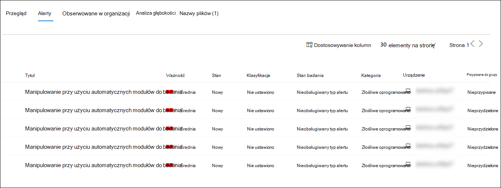
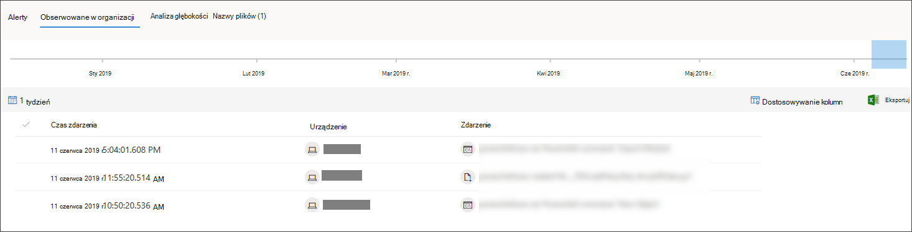

# Badanie pliku skojarzonego z alertem programu Microsoft Defender dla punktu końcowego

[!INCLUDE [Microsoft 365 Defender rebranding](../../includes/microsoft-defender.md)]

**Dotyczy:**
- [Microsoft Defender for Endpoint Plan 1](https://go.microsoft.com/fwlink/p/?linkid=2154037)
- [Microsoft Defender for Endpoint Plan 2](https://go.microsoft.com/fwlink/p/?linkid=2154037)
- [Microsoft 365 Defender](https://go.microsoft.com/fwlink/?linkid=2118804)

> Chcesz mieć dostęp do usługi Defender dla punktu końcowego? [Zarejestruj się, aby korzystać z bezpłatnej wersji próbnej.](https://signup.microsoft.com/create-account/signup?products=7f379fee-c4f9-4278-b0a1-e4c8c2fcdf7e&ru=https://aka.ms/MDEp2OpenTrial?ocid=docs-wdatp-investigatefiles-abovefoldlink)

Badanie szczegółów pliku skojarzonego z określonym alertem, zachowaniem lub zdarzeniem w celu ustalenia, czy plik zawiera złośliwe działania, zidentyfikuje motywację ataków i zrozumienie potencjalnego zakresu naruszenia.

Istnieje wiele sposobów uzyskiwania dostępu do strony szczegółowego profilu określonego pliku. Możesz na przykład użyć funkcji wyszukiwania, kliknąć link w drzewie procesu **alertu****, wykres** **zdarzenia, oś** czasu Artefakt lub wybrać zdarzenie wymienione na osi **czasu urządzenia**.

Gdy znajdziesz się na stronie ze szczegółowymi informacjami o profilu, możesz przełączać się między nowym i starym układem strony, przełączać się między nową **stroną Plik**. W dalszej części tego artykułu opisano nowsze układy stron.

W widoku pliku można uzyskać informacje z następujących sekcji:

- Szczegóły pliku, Wykrywanie złośliwego oprogramowania, Ochrona plików
- Analiza głębokości
- Alerty
- Obserwowane w organizacji
- Analiza głębokości
- Nazwy plików

Na tej stronie możesz także podjąć działania na pliku.

## Akcje pliku

U góry strony profilu nad kartami z informacjami o plikach. Oto akcje, które można wykonać w tym miejscu:

- Zatrzymywanie i kwarantanna
- Wskaźnik dodawania/edytowania
- Pobierz plik
- Skonsultuj się z ekspertem ds. zagrożeń
- Centrum akcji

Aby uzyskać więcej informacji na temat tych akcji, zobacz [Akcje odpowiedzi dotyczące pliku](respond-file-alerts.md).

## Szczegóły pliku, wykrywanie złośliwego oprogramowania i ochrona pliku

Na kartach szczegółów pliku, zdarzeń, złośliwego oprogramowania i kart pamięci są wyświetlane różne atrybuty pliku.

Zobaczysz szczegółowe informacje, takie jak md5 pliku, współczynnik wykrywania liczby wirusów i wykrywanie audio/wideo programu Microsoft Defender, jeśli jest dostępny, oraz informacje na temat tego pliku.

Karta z wizytówką pliku pokazuje miejsce, w którym plik był widoczny na urządzeniach w organizacji i na całym świecie.

> [!NOTE]
> Różne użytkownicy mogą zobaczyć różne wartości na urządzeniach w sekcji organizacji  na karcie kart treści pliku. Wynika to z tego, że na karcie są wyświetlane informacje na podstawie zakresu RBAC posiadanych przez użytkownika. Oznacza to, że jeśli użytkownikowi udzielono widoczności na określonym zestawie urządzeń, zobaczy on tylko plik organizacji na tych urządzeniach.

## Alerty

Karta **Alerty** zawiera listę alertów skojarzonych z plikiem. Na tej liście zasłania się wiele informacji dostępnych w kolejce alertów, z wyjątkiem grupy urządzeń, do której należy dane urządzenie (jeśli taka grupa jest). Możesz wybrać rodzaj informacji, które mają być wyświetlane, wybierając pozycję Dostosuj **kolumny** na pasku narzędzi powyżej nagłówków kolumn.

## Obserwowane w organizacji

Karta **Obserwowane** w organizacji umożliwia określenie zakresu dat w celu określenia, które urządzenia zostały obserwowane w pliku.

> [!NOTE]
> Na tej karcie jest pokazywanych maksymalnie 100 urządzeń. Aby wyświetlić _wszystkie_ urządzenia z plikiem, wyeksportuj kartę do pliku  CSV, wybierając pozycję Eksportuj z menu akcji powyżej nagłówków kolumn na karcie.

Za pomocą suwaka lub selektora zakresów możesz szybko określić przedział czasu, w którym chcesz sprawdzić, czy zdarzenia związane z plikiem mają być sprawdzane. Możesz określić okres tak mały, jak jeden dzień. Umożliwi to wyświetlanie tylko plików, które wówczas komunikowały się z tym adresem IP, znacząco zmniejszając niepotrzebne przewijanie i wyszukiwanie.

## Analiza głębokości

Karta **Analiza głębokości** umożliwia przesłanie pliku do szczegółowej [analizy, odkrycie](respond-file-alerts.md#deep-analysis) szczegółowych informacji na temat zachowania pliku oraz jego wpływu na działanie tego pliku w organizacji. Po przesłaniu pliku po ich zaznaczeniu na tej karcie pojawi się raport z analizą głębokości. Jeśli podczas dogłębnej analizy nic nie znajdzie, raport będzie pusty, a obszar wyników pozostanie pusty.

## Nazwy plików

Karta **Nazwy plików** zawiera listę wszystkich nazw obserwowanych w celu użycia pliku w Twojej organizacji.

## Tematy pokrewne

- [Wyświetlanie i organizowanie kolejki programu Microsoft Defender dla punktu końcowego](alerts-queue.md)
- [Zarządzanie alertami programu Microsoft Defender dla punktów końcowych](manage-alerts.md)
- [Badanie alertów programu Microsoft Defender dla punktów końcowych](investigate-alerts.md)
- [Badanie urządzeń na liście programu Microsoft Defender dla urządzeń końcowych](investigate-machines.md)
- [Badanie adresu IP skojarzonego z alertem programu Microsoft Defender dla punktu końcowego](investigate-ip.md)
- [Badanie domeny skojarzonej z alertem programu Microsoft Defender dla punktu końcowego](investigate-domain.md)
- [Badanie konta użytkownika w programie Microsoft Defender dla punktu końcowego](investigate-user.md)
- [Akcje odpowiedzi dotyczące pliku](respond-file-alerts.md)
