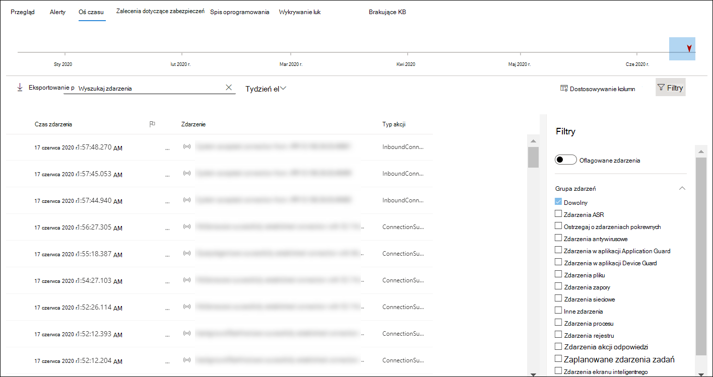
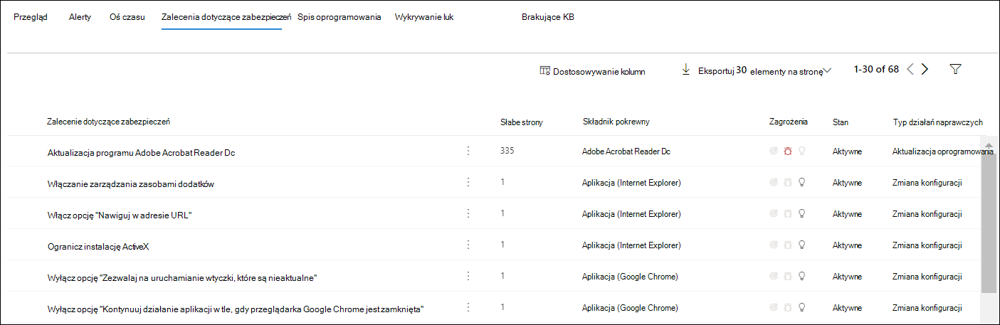
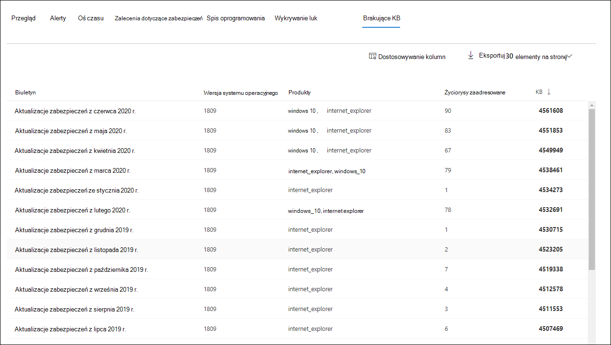
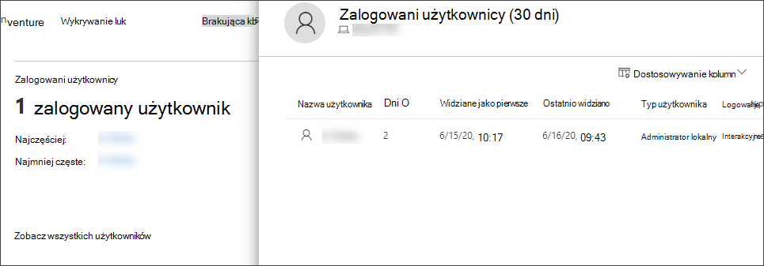

# Badanie urządzeń na liście programu Microsoft Defender dla urządzeń końcowych

[!INCLUDE [Microsoft 365 Defender rebranding](../../includes/microsoft-defender.md)]

**Dotyczy:**
- [Microsoft Defender for Endpoint Plan 2](https://go.microsoft.com/fwlink/p/?linkid=2154037)
- [Microsoft 365 Defender](https://go.microsoft.com/fwlink/?linkid=2118804)

> Chcesz mieć dostęp do usługi Defender dla punktu końcowego? [Zarejestruj się, aby korzystać z bezpłatnej wersji próbnej.](https://signup.microsoft.com/create-account/signup?products=7f379fee-c4f9-4278-b0a1-e4c8c2fcdf7e&ru=https://aka.ms/MDEp2OpenTrial?ocid=docs-wdatp-investigatemachines-abovefoldlink)

Badanie szczegółów alertu podniesionego na określonym urządzeniu w celu zidentyfikowania innych zachowań lub zdarzeń, które mogą być związane z alertem lub potencjalnym zakresem naruszenia.

> [!NOTE]
> W ramach procesu badania lub odpowiedzi możesz zebrać pakiet badania z urządzenia. Poniżej opisano, jak to zrobić: [Zbierz pakiet badania z urządzeń](/microsoft-365/security/defender-endpoint/respond-machine-alerts#collect-investigation-package-from-devices).

Możesz klikać urządzenia, których dotyczy problem, gdy znajdziesz je w portalu, aby otworzyć szczegółowy raport o tym urządzeniu. Urządzenia, których dotyczy problem, są identyfikowane w następujących obszarach:

- [Lista Urządzeń](investigate-machines.md)
- [Kolejka alertów](alerts-queue.md)
- [Pulpit nawigacyjny operacji zabezpieczeń](security-operations-dashboard.md)
- Dowolny pojedynczy alert
- Dowolny pojedynczy widok szczegółów pliku
- Dowolny adres IP lub widok szczegółów domeny

Podczas zbadania określonego urządzenia zobaczysz:

- Szczegóły urządzenia
- Akcje odpowiedzi
- Karty (omówienie, alerty, oś czasu, zalecenia dotyczące zabezpieczeń, spis oprogramowania, wykrytych luk, brakujące KB)
- Karty (aktywne alerty, zalogowani użytkownicy, ocena zabezpieczeń)

> [!NOTE]
> Ze względu na ograniczenia związane z produktem profil urządzenia nie uwzględnia żadnych dowodów cyberprzedażeń podczas określania ramy czasowej ostatnio widzianej (jak widać również na stronie urządzenia).
> Na przykład wartość "Ostatnio widziany" na stronie Urządzenie może pokazywać starszy okres, nawet jeśli na osi czasu komputera są dostępne najnowsze alerty lub dane.

## Szczegóły urządzenia

Sekcja szczegółów urządzenia zawiera informacje, takie jak domena, system operacyjny i stan kondycji urządzenia. Jeśli na urządzeniu jest dostępny pakiet badania, zobaczysz link umożliwiający pobranie pakietu.

## Akcje odpowiedzi

Akcje odpowiedzi są uruchamiane wzdłuż górnej części strony określonego urządzenia i obejmują:

- Zarządzanie tagami
- Wyizoluj urządzenie
- Ograniczanie wykonywania aplikacji
- Uruchom skanowanie antywirusowe
- Zbierz pakiet badania
- Inicjowanie sesji odpowiedzi na żywo
- Inicjowanie automatycznego badania
- Skonsultuj się z ekspertem ds. zagrożeń
- Centrum akcji

Możesz podjąć działania związane z odpowiedziami w Centrum akcji, na konkretnej stronie urządzenia lub na konkretnej stronie pliku.

Aby uzyskać więcej informacji o tym, jak podjąć działanie na urządzeniu, zobacz Akcje [odpowiedzi na urządzeniu](respond-machine-alerts.md).

Aby uzyskać więcej informacji, zobacz [Badanie jednostek użytkowników](investigate-user.md).

## Karty

Karty te zawierają istotne informacje dotyczące ochrony przed zagrożeniami i związane z tym urządzeniem. Na poszczególnych kartach możesz dostosować wyświetlane kolumny, wybierając pozycję Dostosuj kolumny na pasku nad nagłówkami kolumn.

### Omówienie

Na **karcie Omówienie** są wyświetlane [karty aktywnych](#cards) alertów, zalogowanych użytkowników i oceny zabezpieczeń.

### Alerty

Karta **Alerty** zawiera listę alertów skojarzonych z urządzeniem. Ta lista jest filtrowaną wersją kolejki alertów i zawiera krótki opis alertu, ważności (wysoki, średni, niski, informacyjny), stanu w kolejce (nowy, w toku, rozwiązany), klasyfikacja (nie ustawiona, alert fałsz, alert prawda), stan badania, kategoria alertu, kto jest adresowany do alertu i ostatnie działanie. Możesz również filtrować alerty.

Po wybraniu ikony koła z lewej strony alertu pojawi się wysuw. W tym panelu możesz zarządzać alertem i wyświetlać więcej szczegółowych informacji, takich jak numer zdarzenia i urządzenia pokrewne. Jednocześnie można wybrać wiele alertów.

Aby wyświetlić widok pełnej strony alertu, w tym wykres zdarzenia i drzewo procesu, wybierz tytuł alertu.

### Oś czasu

Karta **Oś** czasu zawiera chronologiczny widok wydarzeń i skojarzonych z nimi alertów, które zostały obserwowane na urządzeniu. Może to ułatwić skorelowanie wszystkich zdarzeń, plików i adresów IP w odniesieniu do urządzenia.

Oś czasu pozwala także selektywnie przejść do szczegółów zdarzeń, które wystąpiły w danym okresie. Można wyświetlić sekwencję czasową zdarzeń, które wystąpiły na urządzeniu w wybranym okresie. Aby bardziej kontrolować widok, możesz filtrować według grup zdarzeń lub dostosować kolumny.

> [!NOTE]
> Aby wyświetlić zdarzenia zapory, należy włączyć zasady inspekcji, zobacz Połączenie z platformą [filtrowania inspekcji](/windows/security/threat-protection/auditing/audit-filtering-platform-connection).
>
> Zapora obejmuje następujące zdarzenia:
>
> - [5025 —](/windows/security/threat-protection/auditing/event-5025) usługa zapory została zatrzymana
> - [5031](/windows/security/threat-protection/auditing/event-5031) — aplikacja zablokowana z zaakceptowaniem połączeń przychodzących w sieci
> - [5157](/windows/security/threat-protection/auditing/event-5157) — zablokowane połączenie

Niektóre funkcje są dostępne:

- Wyszukiwanie określonych zdarzeń
  - Użyj paska wyszukiwania, aby wyszukać konkretne zdarzenia osi czasu.
- Filtrowanie zdarzeń z określonej daty
  - Wybierz ikonę kalendarza w lewym górnym rogu tabeli, aby wyświetlić zdarzenia z ostatniego dnia, tygodnia, 30 dni lub zakresu niestandardowego. Domyślnie na osi czasu urządzenia są wyświetlane zdarzenia z ostatnich 30 dni.
  - Użyj osi czasu, aby przejść do określonego momentu w czasie, wyróżniając sekcję. Strzałki na osi czasu z automatycznymi badaniami
- Eksportowanie szczegółowych zdarzeń osi czasu urządzenia
  - Wyeksportuj oś czasu urządzenia dla bieżącej daty lub określonego zakresu dat do siedmiu dni.

Więcej informacji o określonych zdarzeniach podano w **sekcji Informacje** dodatkowe. Te szczegóły różnią się w zależności od typu wydarzenia, na przykład:

- Zawarty w programie Application Guard — zdarzenie przeglądarki sieci Web zostało ograniczone przez odizolowany kontener
- Wykryto aktywne zagrożenia — wykrywanie zagrożeń miało miejsce w czasie działania zagrożenia
- Działania naprawcze nie powiodło się — próba rozwiązania problemów ze wykrytym zagrożeniem została wywołana, ale nie powiodła się
- Działania naprawcze zakończyły się pomyślnie — wykryty zagrożenia został zatrzymany i wyczyszczony
- Ostrzeżenie pomijane przez użytkownika — ostrzeżenie filtru SmartScreen Windows Defender zostało odrzucone i zastąpione przez użytkownika
- Wykryto podejrzany skrypt — odnaleziono potencjalnie złośliwy skrypt
- Kategoria alertu — jeśli zdarzenie spowodowało generowanie alertu, podano kategorię alertów (na przykład "Ruch lateralny"

#### Szczegóły zdarzenia

Wybierz zdarzenie, aby wyświetlić odpowiednie szczegóły dotyczące tego zdarzenia. Zostanie wyświetlony panel z ogólnymi informacjami o zdarzeniu. Jeśli mają zastosowanie i są dostępne dane, jest również wyświetlany wykres przedstawiający powiązane jednostki i ich relacje.

Aby dokładniej sprawdzić wydarzenia i powiązane wydarzenia, możesz szybko uruchomić zaawansowane zapytanie  myśliwskie, wybierając pozycję Wyszukiwanie **powiązanych wydarzeń**. Zapytanie zwróci wybrane zdarzenie i listę innych zdarzeń, które wystąpiły w tym samym czasie w tym samym punkcie końcowym.

### Zalecenia dotyczące zabezpieczeń

**Zalecenia dotyczące** zabezpieczeń są generowane z programu Microsoft Defender dla funkcji zarządzania zagrożeniami [&](tvm-dashboard-insights.md) punktów końcowych. Wybranie zalecenia spowoduje wyświetlenie panelu, w którym można wyświetlić odpowiednie szczegóły, takie jak opis zalecenia i potencjalne zagrożenia związane z nieuchwaloną treścią. Aby [uzyskać szczegółowe informacje, zobacz](tvm-security-recommendation.md) Zalecenia dotyczące zabezpieczeń.

### Spis oprogramowania

Karta **Spis** oprogramowania umożliwia wyświetlanie oprogramowania na urządzeniu wraz z jego wadami i zagrożeniami. Wybranie nazwy oprogramowania spowoduje wyświetlenie strony szczegółów oprogramowania, na której można przeglądać zalecenia dotyczące zabezpieczeń, wykryć luki w zabezpieczeniach, zainstalowane urządzenia i rozpowszechniać wersje. Aby [uzyskać szczegółowe informacje,](tvm-software-inventory.md) zobacz Spis oprogramowania

### Wykrywanie luk

Karta **Wykryte luki** w zabezpieczeniach zawiera nazwę, ważność i informacje o zagrożeniach dotyczące wykrytych luk na urządzeniu. Wybranie konkretnych luk spowoduje pokazanie opisu i szczegółów.

### Brakujące KB
Karta **Brakujące kb/kb zawiera** listę brakujących aktualizacji zabezpieczeń dla urządzenia.

## Karty

### Aktywne alerty

Na **karcie Zaawansowana ochrona przed** zagrożeniami w usłudze Azure zostanie ogólne omówienie alertów dotyczących urządzenia i ich poziomu ryzyka, o ile włączono funkcję Usługi Microsoft Defender dla tożsamości i są aktywne alerty. Więcej informacji na ten temat zawiera temat "Alerty".

> [!NOTE]
> Aby korzystać z tej funkcji, należy włączyć integrację zarówno z usługą Microsoft Defender for Identity, jak i Usługą Defender for Endpoint. W programie Defender for Endpoint możesz włączyć tę funkcję w zaawansowanych funkcjach. Aby uzyskać więcej informacji na temat włączania funkcji zaawansowanych, zobacz [Włączanie funkcji zaawansowanych](advanced-features.md).

### Zalogowani użytkownicy

Karta **Zalogowani użytkownicy** zawiera informacje o tym, ilu użytkowników zalogowało się w ciągu ostatnich 30 dni, oraz użytkowników, którzy są najczęściej i najczęstsi. Wybranie linku "Zobacz wszystkich użytkowników" spowoduje otwarcie okienka szczegółów, w którym są wyświetlane informacje, takie jak typ użytkownika, typ logowania oraz czas pierwszego i ostatniego wyświetlenie użytkownika. Aby uzyskać więcej informacji, zobacz [Badanie jednostek użytkowników](investigate-user.md).

> [!NOTE]
> Wartość "najczęściej odwiedzanych" użytkowników jest obliczana tylko na podstawie dowodów użytkowników, którzy pomyślnie zalogowali się interakcyjnie.
> Jednak okienko boczne "Wszyscy użytkownicy" oblicza wszelkiego rodzaju logowania użytkowników, dlatego w okienku bocznym powinno być więcej użytkowników, ponieważ mogą nie być interakcyjne.

### Oceny zabezpieczeń

Karta **Oceny zabezpieczeń zawiera** informacje o ogólnym poziomie ochrony, zaleceniach dotyczących zabezpieczeń, zainstalowanym oprogramowaniu i wykrytych lukach. Poziom ekspozycji urządzenia jest ustalany na podstawie skumulowanego wpływu jego oczekujących zaleceń dotyczących zabezpieczeń.

## Tematy pokrewne

- [Wyświetlanie i organizowanie kolejki alertów programu Microsoft Defender dla punktu końcowego](alerts-queue.md)
- [Zarządzanie alertami programu Microsoft Defender dla punktów końcowych](manage-alerts.md)
- [Badanie alertów programu Microsoft Defender dla punktów końcowych](investigate-alerts.md)
- [Badanie pliku skojarzonego z alertem programu Defender dla punktu końcowego](investigate-files.md)
- [Badanie adresu IP skojarzonego z alertem programu Defender dla punktu końcowego](investigate-ip.md)
- [Badanie domeny skojarzonej z alertem programu Defender dla punktu końcowego](investigate-domain.md)
- [Badanie konta użytkownika w programie Defender dla punktu końcowego](investigate-user.md)
- [Zalecenie dotyczące zabezpieczeń](tvm-security-recommendation.md)
- [Spis oprogramowania](tvm-software-inventory.md)
