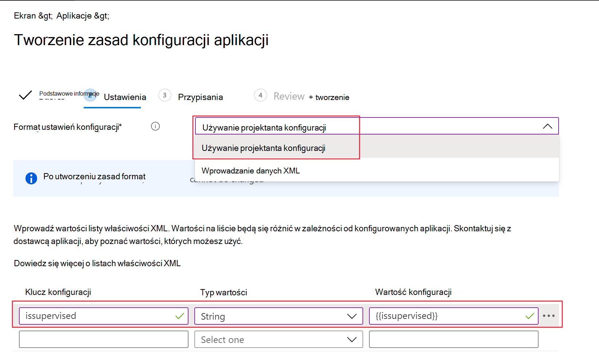

# Wdrażanie Ochrona punktu końcowego w usłudze Microsoft Defender w systemie iOS

[!INCLUDE [Microsoft 365 Defender rebranding](../../includes/microsoft-defender.md)]

**Dotyczy:**
- [Ochrona punktu końcowego w usłudze Microsoft Defender plan 1](https://go.microsoft.com/fwlink/p/?linkid=2154037)
- [Ochrona punktu końcowego w usłudze Microsoft Defender (plan 2)](https://go.microsoft.com/fwlink/p/?linkid=2154037) 
- [Microsoft 365 Defender](https://go.microsoft.com/fwlink/?linkid=2118804)

> Chcesz poznać usługę Defender for Endpoint? [Utwórz konto bezpłatnej wersji próbnej.](https://signup.microsoft.com/create-account/signup?products=7f379fee-c4f9-4278-b0a1-e4c8c2fcdf7e&ru=https://aka.ms/MDEp2OpenTrial?ocid=docs-wdatp-investigateip-abovefoldlink)

W tym temacie opisano wdrażanie usługi Defender for Endpoint w systemie iOS na Intune — Portal firmy zarejestrowanych urządzeniach. Aby uzyskać więcej informacji na temat rejestracji urządzeń Intune, zobacz [Rejestrowanie urządzeń z systemem iOS/iPadOS w Intune](/mem/intune/enrollment/ios-enroll).

## Przed rozpoczęciem

- Upewnij się, że masz dostęp do [centrum administracyjnego programu Microsoft Endpoint Manager](https://go.microsoft.com/fwlink/?linkid=2109431).

- Upewnij się, że rejestracja w systemie iOS została wykonana dla użytkowników. Aby korzystać z usługi Defender for Endpoint w systemie iOS, użytkownicy muszą mieć przypisaną licencję usługi Defender for Endpoint. Aby uzyskać instrukcje dotyczące przypisywania [licencji, zobacz Przypisywanie licencji użytkownikom](/azure/active-directory/users-groups-roles/licensing-groups-assign) .

> [!NOTE]
> Ochrona punktu końcowego w usłudze Microsoft Defender w systemie iOS jest dostępna w [App Store firmy Apple](https://aka.ms/mdatpiosappstore).

## Kroki wdrażania

Wdróż usługę Defender for Endpoint w systemie iOS za pośrednictwem Intune — Portal firmy.

### Dodawanie aplikacji ze sklepu dla systemu iOS

1. W [centrum administracyjnym programu Microsoft Endpoint Manager](https://go.microsoft.com/fwlink/?linkid=2109431) przejdź do pozycji **AplikacjeiOS** -> **/iPadOSAddiOS** ->  ->  **store app** i kliknij pozycję **Wybierz**.

    > [!div class="mx-imgBorder"]
    > :::image type="content" source="images/ios-deploy-1.png" alt-text="Karta Dodawanie aplikacji w Centrum administracyjnym Microsoft Endpoint Manager" lightbox="images/ios-deploy-1.png":::

1. Na stronie **Dodawanie aplikacji** kliknij pozycję **Wyszukaj App Store** i wpisz **Ochrona punktu końcowego w usłudze Microsoft Defender** na pasku wyszukiwania. W sekcji wyników wyszukiwania kliknij *pozycję Ochrona punktu końcowego w usłudze Microsoft Defender* i kliknij pozycję **Wybierz**.

1. Wybierz system **iOS 11.0** jako minimalny system operacyjny. Przejrzyj pozostałe informacje o aplikacji i kliknij przycisk **Dalej**.

1. W sekcji **Przypisania** przejdź do sekcji **Wymagane** i wybierz pozycję **Dodaj grupę**. Następnie możesz wybrać grupy użytkowników, dla których chcesz kierować usługę Defender for Endpoint w aplikacji systemu iOS. Kliknij **pozycję Wybierz,** a następnie **pozycję Dalej**.

    > [!NOTE]
    > Wybrana grupa użytkowników powinna składać się z Intune zarejestrowanych użytkowników.

    > [!div class="mx-imgBorder"]
    > :::image type="content" source="images/ios-deploy-2.png" alt-text="Karta Dodawanie grupy w Centrum administracyjnym Microsoft Endpoint Manager" lightbox="images/ios-deploy-2.png":::

1. W sekcji *Przeglądanie i tworzenie* sprawdź, czy wszystkie wprowadzone informacje są poprawne, a następnie wybierz pozycję **Utwórz**. Za kilka chwil aplikacja Defender for Endpoint powinna zostać utworzona pomyślnie, a powiadomienie powinno zostać wyświetlone w prawym górnym rogu strony.

1. Na wyświetlonej stronie informacji o aplikacji w sekcji **Monitorowanie** wybierz pozycję **Stan instalacji urządzenia** , aby sprawdzić, czy instalacja urządzenia zakończyła się pomyślnie.

    > [!div class="mx-imgBorder"]
    > :::image type="content" source="images/ios-deploy-3.png" alt-text="Strona Stan instalacji urządzenia" lightbox="images/ios-deploy-3.png":::

## Pełne wdrożenie dla urządzeń nadzorowanych

Ochrona punktu końcowego w usłudze Microsoft Defender w aplikacji systemu iOS ma wyspecjalizowane możliwości na nadzorowanych urządzeniach z systemem iOS/iPadOS, biorąc pod uwagę zwiększone możliwości zarządzania zapewniane przez platformę na tego typu urządzeniach. Może również zapewnić ochronę sieci Web **bez konfigurowania lokalnej sieci VPN na urządzeniu**. Zapewnia to użytkownikom końcowym bezproblemowe środowisko, a jednocześnie jest chronione przed wyłudzaniem informacji i innymi atakami internetowymi.

### Konfigurowanie trybu nadzorowanego za pośrednictwem Intune

Następnie skonfiguruj tryb nadzorowany dla aplikacji Defender for Endpoint za pomocą zasad App Configuration.

   > [!NOTE]
   > Te zasady konfiguracji aplikacji dla urządzeń nadzorowanych mają zastosowanie tylko do urządzeń zarządzanych i powinny być przeznaczone dla wszystkich zarządzanych urządzeń z systemem iOS jako najlepsze rozwiązanie.

1. Zaloguj się do [centrum administracyjnego Microsoft Endpoint Manager](https://go.microsoft.com/fwlink/?linkid=2109431) i przejdź do obszaru **Zasady** \> konfiguracji aplikacji **Aplikacje** \> **Dodaj**. Wybierz pozycję **Urządzenia zarządzane**.

    > [!div class="mx-imgBorder"]
    > 

1. Na stronie *Tworzenie zasad konfiguracji aplikacji* podaj następujące informacje:
    - Nazwa zasad
    - Platforma: wybierz pozycję iOS/iPadOS
    - Aplikacja docelowa: wybierz **pozycję Ochrona punktu końcowego w usłudze Microsoft Defender** z listy

    > [!div class="mx-imgBorder"]
    > 

1. Na następnym ekranie wybierz pozycję **Użyj projektanta konfiguracji** jako formatu. Określ następującą właściwość:
    - Kluczkonfiguracjia
    - Typ wartości: Ciąg
    - Wartość konfiguracji: {{issupervised}}

    > [!div class="mx-imgBorder"]
    > 

1. Wybierz pozycję **Dalej** , aby otworzyć stronę **Tagi zakresu** . Tagi zakresu są opcjonalne. Wybierz przycisk **Dalej**, aby kontynuować.

1. Na stronie **Przypisania** wybierz grupy, które otrzymają ten profil. W tym scenariuszu najlepszym rozwiązaniem jest ukierunkowanie na **wszystkie urządzenia**. Aby uzyskać więcej informacji na temat przypisywania profilów, zobacz [Przypisywanie profilów użytkowników i urządzeń](/mem/intune/configuration/device-profile-assign).

   Podczas wdrażania w grupach użytkownik musi zalogować się do urządzenia, zanim zostaną zastosowane zasady.

   Kliknij **Dalej**.

1. Na stronie **Przeglądanie + tworzenie** po zakończeniu wybierz pozycję **Utwórz**. Nowy profil zostanie wyświetlony na liście profilów konfiguracji.

1. Następnie należy wdrożyć profil niestandardowy na nadzorowanych urządzeniach z systemem iOS. Dotyczy to rozszerzonych możliwości ochrony przed wyłudzaniem informacji. Wykonaj poniższe kroki:

    - Pobierz profil konfiguracji z [https://aka.ms/mdeiosprofilesupervised](https://aka.ms/mdeiosprofilesupervised)
    - Przejdź do **pozycji UrządzeniaiOS** -> **/iPadOSProfile** ->  **konfiguracjiUtwórz** ->  profil

    > [!div class="mx-imgBorder"]
    > 
    
    - Podaj nazwę profilu. Po wyświetleniu monitu o zaimportowanie pliku profilu konfiguracji wybierz plik pobrany z poprzedniego kroku.
    - W sekcji **Przypisania** wybierz grupę urządzeń, do której chcesz zastosować ten profil. Najlepszym rozwiązaniem jest zastosowanie tego rozwiązania do wszystkich zarządzanych urządzeń z systemem iOS. Wybierz pozycję **Dalej**.
    - Na stronie **Przeglądanie + tworzenie** po zakończeniu wybierz pozycję **Utwórz**. Nowy profil zostanie wyświetlony na liście profilów konfiguracji.

## Automatyczne dołączanie profilu sieci VPN (uproszczone dołączanie)

W przypadku nienadzorowanych urządzeń sieć VPN jest używana w celu zapewnienia funkcji ochrony sieci Web. Nie jest to zwykła sieć VPN i jest lokalną/samopętlaną siecią VPN, która nie przyjmuje ruchu poza urządzeniem.

>[!NOTE]
>W przypadku urządzeń nadzorowanych sieć VPN nie jest potrzebna do obsługi funkcji ochrony sieci Web i wymaga od administratorów skonfigurowania profilu konfiguracji na urządzeniach nadzorowanych. Aby skonfigurować dla urządzeń nadzorowanych, wykonaj kroki opisane w sekcji [Kompletne wdrażanie dla urządzeń nadzorowanych](#complete-deployment-for-supervised-devices) .

Administratorzy mogą skonfigurować automatyczną konfigurację profilu sieci VPN. Spowoduje to automatyczne skonfigurowanie profilu sieci VPN usługi Defender for Endpoint bez konieczności dołączania użytkownika. 

Ten krok upraszcza proces dołączania, konfigurując profil sieci VPN. Aby zapoznać się ze środowiskiem bezdotyku lub dyskretnym, zobacz następną sekcję: [Dołączanie bez dotyku](#zero-touch-onboarding-of-microsoft-defender-for-endpoint).

1. W [centrum administracyjnym programu Microsoft Endpoint Manager](https://go.microsoft.com/fwlink/?linkid=2109431) przejdź do pozycji **UrządzeniaProfile** ->  **konfiguracjiUtwórz** ->  profil.
1. Wybierz **pozycję Platforma** jako system **iOS/iPadOS** i **typ profilu** jako **sieć VPN**. Kliknij **pozycję Utwórz**.
1. Wpisz nazwę profilu i kliknij przycisk **Dalej**.
1. Wybierz pozycję **Niestandardowa sieć VPN** dla pozycji Typ połączenia i w sekcji **Podstawowa sieć VPN** wprowadź następujące elementy:
    - Nazwa połączenia = Ochrona punktu końcowego w usłudze Microsoft Defender
    - Adres serwera sieci VPN = 127.0.0.1
    - Metoda uwierzytelniania = "Nazwa użytkownika i hasło"
    - Dzielenie tunelowania = wyłączenie
    - Identyfikator sieci VPN = com.microsoft.scmx
    - W parach klucz-wartość wprowadź **autoonboard** klucza i ustaw wartość **true**.
    - Typ automatycznej sieci VPN = sieć VPN na żądanie
    - Kliknij **pozycję Dodaj** dla **reguł na żądanie** i wybierz **pozycję Chcę wykonać następujące czynności = Ustanawianie sieci VPN**, **do których chcę ograniczyć wartość = Wszystkie domeny**.

    :::image type="content" source="images/ios-deploy-8.png" alt-text="Karta Ustawienia konfiguracji profilu sieci VPN" lightbox="images/ios-deploy-8.png":::

1. Kliknij przycisk Dalej i przypisz profil do użytkowników docelowych.
1. W sekcji *Przeglądanie i tworzenie* sprawdź, czy wszystkie wprowadzone informacje są poprawne, a następnie wybierz pozycję **Utwórz**.

## Bezdotykowe dołączanie Ochrona punktu końcowego w usłudze Microsoft Defender

> [!NOTE]
> Nie można skonfigurować bezdotyku na urządzeniach z systemem iOS zarejestrowanych bez koligacji użytkownika (urządzeń bez użytkowników lub urządzeń udostępnionych).

Administratorzy mogą skonfigurować Ochrona punktu końcowego w usłudze Microsoft Defender do wdrażania i aktywacji w trybie dyskretnym. W tym przepływie administrator tworzy profil wdrożenia, a użytkownik jest po prostu powiadamiany o instalacji. Usługa Defender for Endpoint jest instalowana automatycznie bez konieczności otwierania aplikacji przez użytkownika. Wykonaj poniższe kroki, aby skonfigurować wdrożenie usługi Defender for Endpoint bez dotyku lub dyskretne na zarejestrowanych urządzeniach z systemem iOS:

1. W [centrum administracyjnym programu Microsoft Endpoint Manager](https://go.microsoft.com/fwlink/?linkid=2109431) przejdź do pozycji **UrządzeniaProfile** >  **konfiguracjiUtwórz** >  profil.
1. Wybierz **pozycję Platforma** jako system **iOS/iPadOS** i **typ profilu** jako **sieć VPN**. Wybierz pozycję **Utwórz**.
1. Wpisz nazwę profilu i wybierz pozycję **Dalej**.
1. Wybierz pozycję **Niestandardowa sieć VPN** dla pozycji Typ połączenia i w sekcji **Podstawowa sieć VPN** wprowadź następujące elementy:
    - Nazwa połączenia = Ochrona punktu końcowego w usłudze Microsoft Defender
    - Adres serwera sieci VPN = 127.0.0.1
    - Metoda uwierzytelniania = "Nazwa użytkownika i hasło"
    - Dzielenie tunelowania = wyłączenie
    - Identyfikator sieci VPN = com.microsoft.scmx
    - W parach klucz-wartość wprowadź klucz **SilentOnboard** i ustaw wartość **true**.
    - Typ automatycznej sieci VPN = sieć VPN na żądanie
    - Wybierz pozycję **Dodaj** dla **reguł na żądanie** i wybierz **pozycję Chcę wykonać następujące czynności = Ustanawianie sieci VPN**, **do których chcę ograniczyć wartość = Wszystkie domeny**.

    :::image type="content" source="images/ios-deploy-9.png" alt-text="Strona Konfiguracja profilu sieci VPN" lightbox="images/ios-deploy-9.png":::

1. Wybierz pozycję **Dalej** i przypisz profil do użytkowników docelowych.
1. W sekcji *Przeglądanie i tworzenie* sprawdź, czy wszystkie wprowadzone informacje są poprawne, a następnie wybierz pozycję **Utwórz**.

Po zakończeniu i zsynchronizowania powyższej konfiguracji z urządzeniem na docelowych urządzeniach z systemem iOS są wykonywane następujące akcje:
    - Ochrona punktu końcowego w usłudze Microsoft Defender zostaną wdrożone i dołączone w trybie dyskretnym, a urządzenie będzie widoczne w portalu usługi Defender for Endpoint.
    - Tymczasowe powiadomienie zostanie wysłane do urządzenia użytkownika.
    - Usługa Web Protection i inne funkcje zostaną aktywowane.

   > [!NOTE]
   > W przypadku urządzeń nadzorowanych, mimo że profil sieci VPN nie jest wymagany, administratorzy nadal mogą skonfigurować dołączanie bezdotyku, konfigurując profil sieci VPN usługi Defender for Endpoint za pośrednictwem Intune. Profil sieci VPN zostanie wdrożony na urządzeniu, ale będzie obecny na urządzeniu tylko jako profil przekazywania i można go usunąć po początkowym dołączeniu.

## Zakończ dołączanie i sprawdź stan

1. Po zainstalowaniu usługi Defender for Endpoint w systemie iOS na urządzeniu zostanie wyświetlona ikona aplikacji.

    :::image type="content" source="images/41627a709700c324849bf7e13510c516.png" alt-text="Automatycznie wygenerowany opis telefonu inteligentnego" lightbox="images/41627a709700c324849bf7e13510c516.png":::

2. Naciśnij ikonę aplikacji Defender for Endpoint (MSDefender) i postępuj zgodnie z instrukcjami wyświetlanymi na ekranie, aby wykonać kroki dołączania. Szczegóły obejmują akceptację przez użytkownika końcowego uprawnień systemu iOS wymaganych przez usługę Defender for Endpoint w systemie iOS.

3. Po pomyślnym dołączeniu urządzenie zostanie wyświetlone na liście Urządzenia w portalu Microsoft 365 Defender.

    > [!div class="mx-imgBorder"]
    > :::image type="content" source="images/device-inventory-screen.png" alt-text="Strona Spis urządzeń" lightbox="images/device-inventory-screen.png":::

## Konfigurowanie Ochrona punktu końcowego w usłudze Microsoft Defender dla trybu nadzorowanego

Ochrona punktu końcowego w usłudze Microsoft Defender w aplikacji systemu iOS ma wyspecjalizowane możliwości na nadzorowanych urządzeniach z systemem iOS/iPadOS, biorąc pod uwagę zwiększone możliwości zarządzania zapewniane przez platformę na tego typu urządzeniach. Aby skorzystać z tych możliwości, aplikacja Defender for Endpoint musi wiedzieć, czy urządzenie jest w trybie nadzorowanym.

### Konfigurowanie trybu nadzorowanego za pośrednictwem Intune

Intune umożliwia skonfigurowanie aplikacji Defender dla systemu iOS za pomocą zasad App Configuration.

   > [!NOTE]
   > Te zasady konfiguracji aplikacji dla urządzeń nadzorowanych mają zastosowanie tylko do urządzeń zarządzanych i powinny być przeznaczone dla wszystkich zarządzanych urządzeń z systemem iOS jako najlepsze rozwiązanie.

1. Zaloguj się do [centrum administracyjnego Microsoft Endpoint Manager](https://go.microsoft.com/fwlink/?linkid=2109431) i przejdź do obszaru **Zasady** \> konfiguracji aplikacji **Aplikacje** \> **Dodaj**. Kliknij pozycję **Urządzenia zarządzane**.

    > [!div class="mx-imgBorder"]
    > :::image type="content" source="images/ios-deploy-4.png" alt-text="Opcja Urządzenia zarządzane" lightbox="images/ios-deploy-4.png":::

1. Na stronie *Tworzenie zasad konfiguracji aplikacji* podaj następujące informacje:
    - Nazwa zasad
    - Platforma: wybierz pozycję iOS/iPadOS
    - Aplikacja docelowa: wybierz **pozycję Ochrona punktu końcowego w usłudze Microsoft Defender** z listy

    > [!div class="mx-imgBorder"]
    > :::image type="content" source="images/ios-deploy-5.png" alt-text="Podstawowe pola zasad konfiguracji aplikacji" lightbox="images/ios-deploy-5.png":::

1. Na następnym ekranie wybierz pozycję **Użyj projektanta konfiguracji** jako formatu. Określ następującą właściwość:
    - Kluczkonfiguracjia
    - Typ wartości: Ciąg
    - Wartość konfiguracji: {{issupervised}}

    > [!div class="mx-imgBorder"]
    > :::image type="content" source="images/ios-deploy-6.png" alt-text="Strona, na której ma zostać wybrany format ustawień konfiguracji zasad" lightbox="images/ios-deploy-6.png":::

1. Kliknij przycisk **Dalej** , aby otworzyć stronę **Tagi zakresu** . Tagi zakresu są opcjonalne. Kliknij przycisk **Dalej**, aby kontynuować.

1. Na stronie **Przypisania** wybierz grupy, które otrzymają ten profil. W tym scenariuszu najlepszym rozwiązaniem jest ukierunkowanie na **wszystkie urządzenia**. Aby uzyskać więcej informacji na temat przypisywania profilów, zobacz [Przypisywanie profilów użytkowników i urządzeń](/mem/intune/configuration/device-profile-assign).

   Podczas wdrażania w grupach użytkownik musi zalogować się do urządzenia, zanim zostaną zastosowane zasady.

   Kliknij **Dalej**.

1. Na stronie **Przeglądanie + tworzenie** po zakończeniu wybierz pozycję **Utwórz**. Nowy profil zostanie wyświetlony na liście profilów konfiguracji.

## Następne kroki

- [Konfigurowanie zasad ochrony aplikacji w celu uwzględnienia sygnałów ryzyka usługi Defender for Endpoint (MAM)](ios-install-unmanaged.md)
- [Konfigurowanie usługi Defender dla punktu końcowego w funkcjach systemu iOS](ios-configure-features.md)
