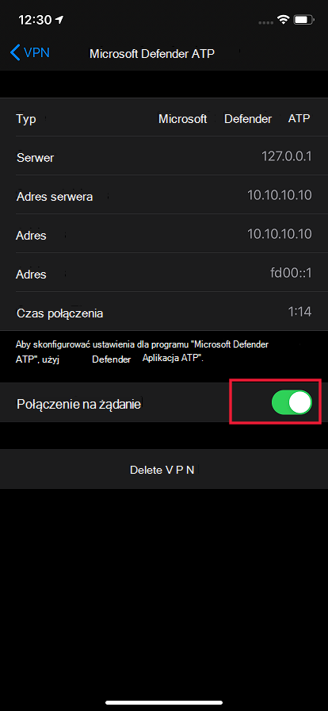

# Rozwiązywanie problemów i znajdowanie odpowiedzi na często zadawane pytania dotyczące programu Microsoft Defender dla punktu końcowego w systemie iOS

[!INCLUDE [Microsoft 365 Defender rebranding](../../includes/microsoft-defender.md)]

**Dotyczy:**
- [Microsoft Defender for Endpoint Plan 1](https://go.microsoft.com/fwlink/p/?linkid=2154037)
- [Microsoft Defender for Endpoint Plan 2](https://go.microsoft.com/fwlink/p/?linkid=2154037)
- [Microsoft 365 Defender](https://go.microsoft.com/fwlink/?linkid=2118804)

> Chcesz mieć dostęp do usługi Defender dla punktu końcowego? [Zarejestruj się, aby korzystać z bezpłatnej wersji próbnej.](https://signup.microsoft.com/create-account/signup?products=7f379fee-c4f9-4278-b0a1-e4c8c2fcdf7e&ru=https://aka.ms/MDEp2OpenTrial?ocid=docs-wdatp-exposedapis-abovefoldlink)

Ten temat zawiera informacje dotyczące rozwiązywania problemów, które mogą się pojawić podczas używania programu Microsoft Defender for Endpoint w systemie iOS.

> [!NOTE]
> Usługa Defender for Endpoint w systemie iOS korzysta z połączenia VPN w celu zapewnienia funkcji ochrony sieci Web. Nie jest to zwykły sieci VPN i jest to lokalny/samopętny vpn, który nie przejmuje ruchu poza urządzenie.

## Aplikacje nie działają, gdy jest włączona sieć VPN
Niektóre aplikacje przestają działać po wykryciu aktywnego połączenia VPN. W czasie korzystania z takich aplikacji możesz wyłączyć sieć VPN. 

Domyślnie program Defender for Endpoint w systemie iOS zawiera i włącza funkcję ochrony sieci Web. [Ochrona sieci Web](web-protection-overview.md) pomaga zabezpieczyć urządzenia przed zagrożeniami internetowymi i chronić użytkowników przed atakami wyłudzających informacje. W celu zapewnienia tej ochrony usługa Defender for Endpoint w systemie iOS używa połączenia VPN. Zwróć uwagę, że jest to lokalny interfejs VPN i w przeciwieństwie do tradycyjnych sieci VPN ruch sieciowy nie jest wysyłany poza urządzenie.

Gdy ta funkcja jest domyślnie włączona, może być konieczne wyłączenie połączenia VPN w niektórych przypadkach. Na przykład chcesz uruchomić niektóre aplikacje, które nie działają po skonfigurowaniu połączenia VPN. W takich przypadkach możesz wyłączyć sieć VPN bezpośrednio z aplikacji Defender for Endpoint lub wykonać następujące czynności:

1. Na urządzeniu z systemem iOS otwórz aplikację sieci **Ustawienia**, kliknij lub naciśnij pozycję **Ogólne**, a następnie pozycję **VPN**.
1. Kliknij lub naciśnij przycisk "i" dla programu Microsoft Defender dla punktu końcowego.
1. Aby wyłączyć sieć **VPN Połączenie na** żądanie.

    > [!div class="mx-imgBorder"]
    > 

> [!NOTE]
> Ochrona sieci Web nie będzie dostępna po wyłączeniu połączenia VPN. Aby ponownie włączyć ochronę sieci Web, otwórz na urządzeniu aplikację Microsoft Defender for Endpoint i włącz ochronę sieci Web.

## Współistnienie z wieloma profilami VPN

System Apple iOS nie **obsługuje jednoczesnego** działania wielu sieci VPN dla całego urządzenia. Na urządzeniu może istnieć wiele profilów VPN, ale tylko jeden z nich może być aktywny jednocześnie. Jeśli chcesz korzystać z innego połączenia VPN na urządzeniu, możesz wyłączyć usługę Defender for Endpoint VPN podczas korzystania z innego połączenia VPN.

## Zużycie baterii

Aby zapewnić Ci zawsze ochronę przed zagrożeniami internetowymi, usługa Microsoft Defender for Endpoint musi cały czas działać w tle. Może to powodować niewielkie zwiększenie ogólnego zużycia baterii w Twoim urządzeniu. W przypadku znacznej wymiany baterii prześlij nam opinię, a my przejdę do badania.

Ponadto w aplikacji Ustawienia system iOS pokazuje zużycie baterii tylko w przypadku aplikacji widocznych dla użytkownika przez określony czas. Zużycie baterii przez aplikacje wyświetlane na ekranie dotyczy tylko tego czasu i jest obliczane przez system iOS na podstawie różnych czynników, takich jak procesor i użycie sieci. Program Microsoft Defender for Endpoint używa sieci VPN lokalnej/pętli w tle do sprawdzania ruchu w sieci Web pod każdym złośliwymi witrynami internetowymi lub połączeniami. Pakiety sieciowe z dowolnej aplikacji przejść przez ten proces sprawdzania, co powoduje nieprawidłowe obliczenie użycia baterii programu Microsoft Defender dla punktu końcowego. Rzeczywiste zużycie baterii w programie Microsoft Defender dla punktu końcowego jest mniejsze niż to, co jest widoczne na stronie baterii Ustawienia na urządzeniu.

Pamiętaj, że używany interfejs VPN to lokalny vpn, a w przeciwieństwie do tradycyjnego połączenia VPN ruch sieciowy nie jest wysyłany poza urządzenie.

## Zużycie danych

Program Microsoft Defender for Endpoint używa sieci VPN typu lokalnego/pętli zwrotnego do sprawdzania ruchu w sieci Web pod każdym złośliwym witrynami internetowymi lub połączeniami. Z tego powodu użycie danych programu Microsoft Defender for Endpoint może być niedokładnie uwzględnione. Zauważyliśmy również, że jeśli urządzenie działa tylko w sieci komórkowej, użycie danych zgłoszonych przez usługę usługodawca jest bardzo zbliżone do rzeczywistego zużycia, natomiast w aplikacji Ustawienia firma Apple pokazuje od 1,5 do 2x rzeczywistych zużywanych danych.

Mamy podobne spostrzeżenia również w przypadku innych usług VPN i zgłaszaliśmy to do firmy Apple.

Ponadto usługa Microsoft Defender for Endpoint musi być na bieżąco z naszymi usługami zaplecza, aby zapewnić lepszą ochronę.

## Zgłoś niebezpieczną witrynę

Witryny internetowe wyłudzujące informacje spersonifikują zaufane witryny internetowe w celu uzyskania informacji osobistych lub finansowych. Odwiedź stronę [Podaj opinię na temat ochrony sieci](https://www.microsoft.com/wdsi/support/report-unsafe-site) , aby zgłosić witrynę internetową, która może być witryną wyłudzającą informacje.

## Wykryto złośliwą witrynę

Program Microsoft Defender for Endpoint chroni Cię przed wyłudzaniem informacji i innymi atakami internetowymi. W przypadku wykrycia złośliwej witryny połączenie zostanie zablokowane i do portalu sieci Microsoft 365 Defender organizacji zostanie wysłany alert. Alert zawiera nazwę domeny połączenia, zdalny adres IP i szczegóły urządzenia.

Ponadto powiadomienie jest wyświetlane na urządzeniu z systemem iOS. Naciśnięcie powiadomienia spowoduje otwarcie następującego ekranu, na który użytkownik może przejrzeć szczegóły.

> [!div class="mx-imgBorder"]
> 

## Urządzenie nie jest widoczne w programie Defender dla konsoli końcowej po włoce.

Po dojechanie urządzenia do spisu urządzeń w konsoli zabezpieczeń Programu Defender for Endpoint może mi potrwać kilka godzin. Upewnij się też, że urządzenie zostało poprawnie zarejestrowane w u Azure Active Directory i ma łączność z Internetem. Aby można było pomyślnie wboardować urządzenie, musi zostać zarejestrowane za pośrednictwem programu Microsoft Authenticator lub Intune — Portal firmy i użytkownik musi zalogować się przy użyciu tego samego konta, na którym jest zarejestrowane urządzenie w usłudze Azure AD.

> [!NOTE]
> Czasami nazwa urządzenia jest z nim spójna w Microsoft Endpoint Manager (Intune). Nazwa urządzenia w programie Defender dla konsoli końcowej ma format <username_iPhone/iPad i>. Za pomocą identyfikatora urządzenia usługi Azure AD możesz także zidentyfikować urządzenie w programie Defender for Endpoint console.

## Dane i prywatność

Aby uzyskać szczegółowe informacje na temat zbieranych danych i prywatności, zobacz [Informacje o ochronie prywatności — program Microsoft Defender for Endpoint w systemie iOS](ios-privacy.md).

## Problem z łącznością w sieci komórkowej

Jeśli masz problemy z łącznością z Internetem w sieci komórkowej, sprawdź, czy usługa Microsoft Defender dla punktu końcowego ma włączoną obsługę danych komórkowych: Otwórz aplikację Ustawienia > MS Defender > upewnij się, że dla usługi MS Defender włączono obsługę danych komórkowych.

Jeśli nadal masz problemy z łącznością, sprawdź, czy włączenie/wyłączenie trybu samolotowego pomaga rozwiązać ten problem. Jeśli problem będzie nadal występował, [wyślij nam dzienniki](ios-troubleshoot.md#send-in-app-feedback).

## Problemy na urządzeniach nadzorowanych z zainstalowanym profilem filtru zawartości

Występuje problem na urządzeniach nadzorowanych z zainstalowanym filtrem zawartości programu Defender for Endpoint. Jeśli obserwujesz opóźnienie lub opóźnienie łączności internetowej na takich urządzeniach, odinstaluj lub usuń profil filtru zawartości z urządzenia. Pracujemy nad rozwiązaniem tego problemu i zaktualizujemy to miejsce, gdy będziemy mieć rozwiązanie. 

## Problemy podczas aktualizacji aplikacji ze sklepu z aplikacjami

Jeśli obserwujesz problemy, gdy aplikacja jest aktualizowana za pośrednictwem sklepu z aplikacjami (automatyczne lub ręczne aktualizacje), może być konieczne ponowne uruchomienie urządzenia. Jeśli to nie rozwiąże problemu, możesz wyłączyć sieć VPN programu Defender i przeprowadzić aktualizację aplikacji. Możesz również przekazać opinię w aplikacji, aby zgłosić ten problem.

## Wysyłanie opinii w aplikacji

Jeśli użytkownik napotyka problem, który nie został jeszcze rozwiązany w powyższych sekcjach lub nie może rozwiązać problemu przy użyciu wymienionych czynności, może przekazać opinię w aplikacji wraz z danymi diagnostycznmi. Nasz zespół przeszuka dzienniki w celu podania odpowiedniego rozwiązania. Użytkownicy mogą przesyłać opinie, wykonać następujące czynności:

  - Otwórz aplikację MSDefender na urządzeniu z systemem iOS/iPadOS.
  - Naciśnij pozycję Menu (ikona profilu) w lewym górnym rogu.
  - Naciśnij **pozycję Wyślij opinię**.
  - Wybierz jedną z dostępnych opcji. Aby zgłosić problem, wybierz **pozycję Coś mi się nie podoba**.
  - Podaj szczegóły problemu, z którym masz do czynienia, i zaznacz pole **wyboru Wyślij dane diagnostyczne**. Zalecamy, aby dołączyć swój adres e-mail, aby zespół skontaktował się z Tobą w celu rozwiązania lub rozwiązania problemu.
  - Naciśnij **pozycję Prześlij** , aby pomyślnie wysłać opinię.
