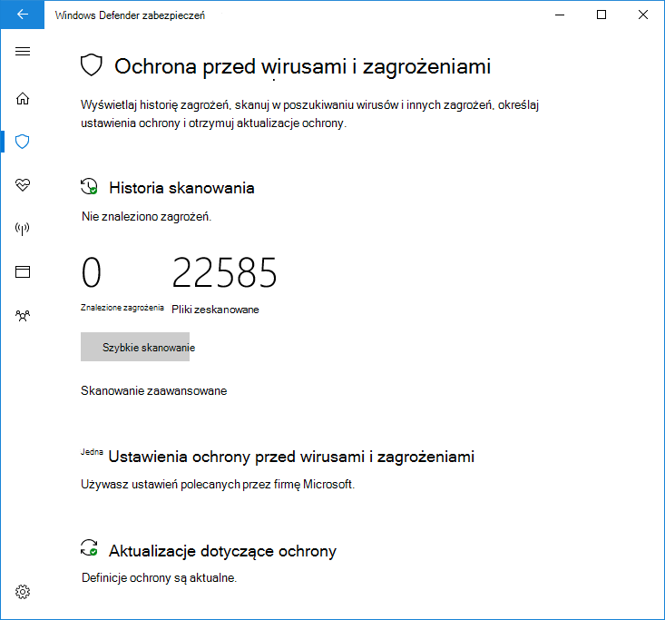

# Ograniczone skanowanie okresowe w programie Program antywirusowy Microsoft Defender

[!INCLUDE [Microsoft 365 Defender rebranding](../../includes/microsoft-defender.md)]

**Dotyczy:**

- [Microsoft Defender for Endpoint Plan 1](https://go.microsoft.com/fwlink/p/?linkid=2154037)
- [Microsoft Defender for Endpoint Plan 2](https://go.microsoft.com/fwlink/p/?linkid=2154037)

Ograniczone skanowanie okresowe to specjalny typ wykrywania zagrożeń i środków zaradczych, które można włączyć po zainstalowaniu innego produktu antywirusowego na urządzeniu z systemem Windows 10 lub Windows 11.

Tę funkcję można włączyć tylko w określonych sytuacjach. Aby uzyskać więcej informacji na temat ograniczonego skanowania okresowego i Program antywirusowy Microsoft Defender z innymi produktami antywirusowymi, zobacz Program antywirusowy Microsoft Defender [zgodności](microsoft-defender-antivirus-compatibility.md).

**Firma Microsoft nie zaleca używania tej funkcji w środowiskach przedsiębiorstwa. Ta funkcja jest przeznaczona głównie dla klientów indywidualnych.** Ta funkcja korzysta tylko z ograniczonego podzestawu funkcji Program antywirusowy Microsoft Defender do wykrywania złośliwego oprogramowania i nie będzie w stanie wykryć większości złośliwego oprogramowania ani potencjalnie niechcianego oprogramowania. Ponadto będą ograniczone możliwości zarządzania i raportowania. Firma Microsoft zaleca przedsiębiorstwom wybranie podstawowego rozwiązania antywirusowego i używanie go na wyłączność.

## Jak włączyć ograniczone skanowanie okresowe

Domyślnie program Program antywirusowy Microsoft Defender włączy się na urządzeniu z systemem Windows 10 lub Windows 11, jeśli nie ma zainstalowanego innego produktu antywirusowego lub jeśli inny produkt jest nieaktualny, wygasł lub nie działa poprawnie.

Jeśli Program antywirusowy Microsoft Defender jest włączone, zostaną wyświetlone opcje zwykłego konfigurowania na tym urządzeniu:

Jeśli inny produkt antywirusowy jest zainstalowany i działa poprawnie, Program antywirusowy Microsoft Defender zostanie automatycznie wyłączone. Aplikacja Zabezpieczenia Windows zmieni sekcję Ochrona przed wirusami & **zagrożeniami** w celu pokazania stanu produktu audio/wideo i udostępni link do opcji konfiguracji produktu.

Pod każdymi produktami audio/wideo innych firm nowy link będzie wyświetlany **jako Program antywirusowy Microsoft Defender audio/wideo**. Kliknięcie tego linku spowoduje rozwinięcie tego linku w celu pokazania przełącznika umożliwiającego ograniczone skanowanie okresowe. Należy pamiętać, że opcja ograniczonego okresowego skanowania jest przełącznikiem umożliwiającym włączenie lub wyłączenie skanowania okresowego. 

Przesuwając przełącznik w **stronę Wł.,** będą wyświetlane standardowe opcje audio/wideo programu Microsoft Defender pod produktem audio/wideo innej firmy. U dołu strony pojawi się opcja ograniczonego skanowania okresowego.

## Artykuły pokrewne

- [Konfigurowanie ochrony zachowanie, heuristic i w czasie rzeczywistym](configure-protection-features-microsoft-defender-antivirus.md)
- [Program antywirusowy Microsoft Defender w programie Windows 10](microsoft-defender-antivirus-in-windows-10.md)