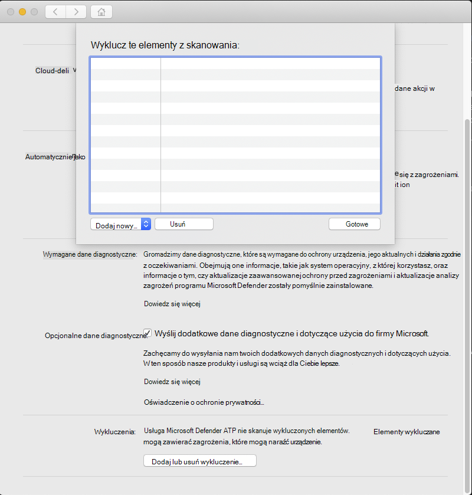

# <a name="configure-and-validate-exclusions-for-microsoft-defender-for-endpoint-on-macos"></a>Konfigurowanie i weryfikowanie wykluczeń programu Microsoft Defender dla punktu końcowego w systemie macOS

[!INCLUDE [Microsoft 365 Defender rebranding](../../includes/microsoft-defender.md)]


**Dotyczy:**
- [Microsoft Defender for Endpoint Plan 1](https://go.microsoft.com/fwlink/p/?linkid=2154037)
- [Microsoft Defender for Endpoint Plan 2](https://go.microsoft.com/fwlink/p/?linkid=2154037)
- [Microsoft 365 Defender](https://go.microsoft.com/fwlink/?linkid=2118804)

> Chcesz mieć dostęp do usługi Defender dla punktu końcowego? [Zarejestruj się, aby korzystać z bezpłatnej wersji próbnej.](https://signup.microsoft.com/create-account/signup?products=7f379fee-c4f9-4278-b0a1-e4c8c2fcdf7e&ru=https://aka.ms/MDEp2OpenTrial?ocid=docs-wdatp-investigateip-abovefoldlink)

Ten artykuł zawiera informacje na temat definiowania wykluczeń dotyczących skanowania na żądanie oraz ochrony i monitorowania w czasie rzeczywistym.

> [!IMPORTANT]
> Wykluczenia opisane w tym artykule nie dotyczą innych funkcji programu Defender dla punktu końcowego na komputerze Mac, w tym do programu wykrywanie i reagowanie w punktach końcowych (EDR). Pliki wykluczone przy użyciu metod opisanych w tym artykule nadal mogą wyzwalać alerty EDR innych wykrycia.

Możesz wykluczyć określone pliki, foldery, procesy i pliki otwarte w procesie z programu Defender for Endpoint na komputerach Mac.

Wykluczenia mogą być przydatne w celu uniknięcia nieprawidłowych wykrywanie plików lub oprogramowania, które są unikatowe lub dostosowane do potrzeb organizacji. Mogą być również pomocne w ograniczania problemów z wydajnością powodowane przez program Defender for Endpoint na komputerze Mac.

> [!WARNING]
> Zdefiniowanie wykluczeń obniża ochronę oferowaną przez usługę Defender for Endpoint na komputerze Mac. Zawsze należy oceniać ryzyko związane z implementowanie wykluczeń, a nie uwzględniać tylko plików, które na pewno nie są złośliwe.

## <a name="supported-exclusion-types"></a>Obsługiwane typy wykluczeń

W poniższej tabeli przedstawiono typy wykluczeń obsługiwane przez program Defender for Endpoint na komputerze Mac.

Wykluczenie|Definicja|Przykłady
---|---|---
Rozszerzenie pliku|Wszystkie pliki z rozszerzeniem w dowolnym miejscu na komputerze|`.test`
Plik|Określony plik oznaczony pełną ścieżką|`/var/log/test.log` <p> `/var/log/*.log` <p> `/var/log/install.?.log`
Folder|Wszystkie pliki w określonym folderze (cyklicznie)|`/var/log/` <p> `/var/*/`
Proces|Określony proces (określony przez pełną ścieżkę lub nazwę pliku) i wszystkie otwarte przez niego pliki|`/bin/cat` <p> `cat` <p> `c?t`

Wykluczenia plików, folderów i procesów obsługują następujące symbole wieloznaczne:

Symbol wieloznaczny|Opis|Przykład|Dopasowania|Nie jest zgodne
---|---|---|---|---
\*|Zastępuje dowolną liczbę dowolnych znaków z uwzględnieniem znaków brak (zwróć uwagę, że jeśli ta symbol wieloznaczny zostanie użyty w ścieżce, zastąpi tylko jeden folder)|`/var/*/*.log`|`/var/log/system.log`|`/var/log/nested/system.log`
?|Dopasowuje dowolny pojedynczy znak.|`file?.log`|`file1.log` <p> `file2.log`|`file123.log`

> [!NOTE]
> Podczas oceny wykluczeń produkt próbuje rozwiązać problemy z połączeniami firm. Rozwiązanie problemu z firmlinkami nie działa, gdy wykluczenie zawiera symbole wieloznaczne lub plik docelowy ( `Data` w ilości danych) nie istnieje.

## <a name="how-to-configure-the-list-of-exclusions"></a>Jak skonfigurować listę wykluczeń

### <a name="from-the-management-console"></a>Z konsoli zarządzania

Aby uzyskać więcej informacji na temat konfigurowania wykluczeń z usługi JAMF, Intune lub innej konsoli zarządzania, zobacz Ustawianie preferencji usługi Defender dla punktu końcowego na [komputerze Mac](mac-preferences.md).

### <a name="from-the-user-interface"></a>Z interfejsu użytkownika

Otwórz aplikację Defender for Endpoint i przejdź do strony **Zarządzaj** \> ustawieniami **Dodaj lub** usuń wykluczenie..., jak pokazano na poniższym zrzucie ekranu:



Wybierz typ wykluczenia, który chcesz dodać, i postępuj zgodnie z monitami.

## <a name="validate-exclusions-lists-with-the-eicar-test-file"></a>Sprawdzanie poprawności list wykluczeń przy użyciu pliku testowego EICAR

Możesz sprawdzić, czy listy wykluczeń działają, pobierając `curl` plik testowy.

W poniższym fragmencie `test.txt` Bash zastąp plik zgodny z regułami wykluczeń. Na przykład jeśli wykluczono rozszerzenie `.testing` , zamień je na `test.txt` `test.testing`. Jeśli testuje się ścieżkę, upewnij się, że uruchamiasz polecenie w tej ścieżce.

```bash
curl -o test.txt https://www.eicar.org/download/eicar.com.txt
```

Jeśli program Defender dla punktu końcowego na komputerze Mac zgłasza złośliwe oprogramowanie, reguła nie działa. Jeśli nie ma żadnego raportu o złośliwym oprogramowaniu, a pobrany plik już istnieje, wówczas wykluczenie działa. Można otworzyć plik w celu potwierdzenia, że jego zawartość jest taka sama jak w przypadku informacji opisanych w witrynie [internetowej pliku testowego EICAR](http://2016.eicar.org/86-0-Intended-use.html).

Jeśli nie masz dostępu do Internetu, możesz utworzyć własny plik testowy EICAR. Wpisz ciąg EICAR w nowym pliku tekstowym za pomocą następującego polecenia Bash:

```bash
echo 'X5O!P%@AP[4\PZX54(P^)7CC)7}$EICAR-STANDARD-ANTIVIRUS-TEST-FILE!$H+H*' > test.txt
```

Możesz również skopiować ciąg do pustego pliku tekstowego i spróbować zapisać go pod nazwą pliku lub w folderze, który próbujesz wykluczyć.

## <a name="allow-threats"></a>Zezwalaj na zagrożenia

Oprócz wykluczenia skanowania określonej zawartości, możesz również skonfigurować produkt tak, aby nie wykrywał niektórych klas zagrożeń (oznaczonych nazwą zagrożenia). Podczas korzystania z tej funkcji należy zachować ostrożność, ponieważ może ona pozostawić urządzenie niechronione.

Aby dodać nazwę zagrożenia do listy dozwolonych, wykonaj następujące polecenie:

```bash
mdatp threat allowed add --name [threat-name]
```

Nazwę zagrożenia skojarzoną z wykrywaniem w urządzeniu można uzyskać przy użyciu następującego polecenia:

```bash
mdatp threat list
```

Aby na przykład dodać `EICAR-Test-File (not a virus)` (nazwę zagrożenia skojarzoną z wykrywaniem EICAR) do listy dozwolonych, wykonaj następujące polecenie:

```bash
mdatp threat allowed add --name "EICAR-Test-File (not a virus)"
```
