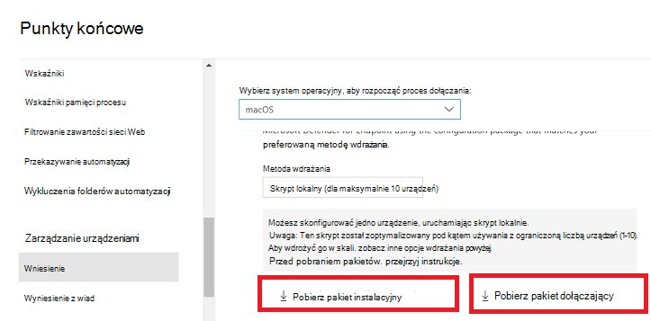
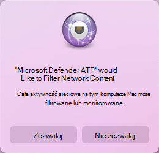
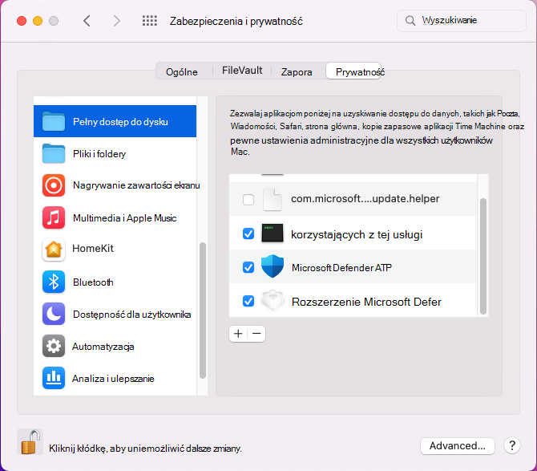

# <a name="manual-deployment-for-microsoft-defender-for-endpoint-on-macos"></a>Ręczne wdrażanie programu Microsoft Defender for Endpoint w systemie macOS

[!INCLUDE [Microsoft 365 Defender rebranding](../../includes/microsoft-defender.md)]

**Dotyczy:**
- [Microsoft Defender for Endpoint Plan 1](https://go.microsoft.com/fwlink/p/?linkid=2154037)
- [Microsoft Defender for Endpoint Plan 2](https://go.microsoft.com/fwlink/p/?linkid=2154037)
- [Microsoft 365 Defender](https://go.microsoft.com/fwlink/?linkid=2118804)

> Chcesz mieć dostęp do usługi Defender dla punktu końcowego? [Zarejestruj się, aby korzystać z bezpłatnej wersji próbnej](https://signup.microsoft.com/create-account/signup?products=7f379fee-c4f9-4278-b0a1-e4c8c2fcdf7e&ru=https://aka.ms/MDEp2OpenTrial?ocid=docs-wdatp-investigateip-abovefoldlink).

W tym temacie opisano, jak ręcznie wdrożyć program Microsoft Defender for Endpoint w systemie macOS. Pomyślne wdrożenie wymaga wykonania wszystkich następujących kroków:

- [Pobieranie pakietów instalacyjnych i pakietów dołączania](#download-installation-and-onboarding-packages)
- [Instalacja aplikacji (macOS 10.15)](#application-installation-macos-1015)
- [Instalacja aplikacji (macOS 11 i nowsze wersje)](#application-installation-macos-11-and-newer-versions)
- [Konfiguracja klienta](#client-configuration)

## <a name="prerequisites-and-system-requirements"></a>Wymagania wstępne i wymagania systemowe

Przed rozpoczęciem zapoznaj się z główną stroną programu [Microsoft Defender for Endpoint na stronie macOS](microsoft-defender-endpoint-mac.md) , aby uzyskać opis wymagań wstępnych i wymagań systemowych bieżącej wersji oprogramowania.

## <a name="download-installation-and-onboarding-packages"></a>Pobieranie pakietów instalacyjnych i pakietów dołączania

Pobierz pakiety instalacyjne i pakiety dołączania z Microsoft 365 Defender sieci:

1. W <a href="https://go.microsoft.com/fwlink/p/?linkid=2077139" target="_blank">Microsoft 365 Defender przejdź</a> do Ustawienia > Punkty końcowe > **zarządzanie urządzeniami > dołączanie**.
2. W sekcji 1 strony ustaw dla systemu operacyjnego wartość **macOS** i metodę wdrażania na **skrypt lokalny**.
3. W sekcji 2 strony wybierz pozycję **Pobierz pakiet instalacyjny**. Zapisz plik jako wdav.pkg w katalogu lokalnym.
4. W sekcji 2 strony wybierz pozycję **Pobierz pakiet dołączający**. Zapisz go jako WindowsDefenderATPOnboardingPackage.zip w tym samym katalogu.

    

5. W wierszu polecenia sprawdź, czy masz te dwa pliki.

## <a name="application-installation-macos-1015"></a>Instalacja aplikacji (macOS 10.15)

Aby zakończyć ten proces, musisz mieć uprawnienia administratora na urządzeniu.

1. Przejdź do pobranego pliku wdav.pkg w programie Finder i otwórz go.

    

2. Wybierz **pozycję Kontynuuj**, zgadzam się z postanowieniami licencyjnym i po wyświetleniu monitu wprowadź hasło.

    

   > [!IMPORTANT]
   > Zostanie wyświetlony monit, aby zezwolić na zainstalowanie sterownika firmy Microsoft (albo "Rozszerzenie systemowe zablokowane", albo "Instalacja znajduje się w miejscu" lub obie te metody. Może być zainstalowany sterownik.

   

3. Wybierz **pozycję Otwórz preferencje zabezpieczeń** lub **Otwórz preferencje systemowe > pozycję & prywatności**. Wybierz **pozycję Zezwalaj**:

    

   Instalacja będzie kontynuowana.

   > [!CAUTION]
   > Jeśli nie wybierzesz opcji **Zezwalaj**, instalacja rozpocznie się po 5 minutach. Usługa Microsoft Defender for Endpoint zostanie załadowana, ale niektóre funkcje, takie jak ochrona w czasie rzeczywistym, zostaną wyłączone. Zobacz [Rozwiązywanie problemów z rozszerzeniem kernel](mac-support-kext.md) , aby uzyskać informacje na temat sposobu rozwiązania tego problemu.

> [!NOTE]
> System macOS może zażądać ponownego uruchomienia urządzenia podczas pierwszej instalacji programu Microsoft Defender for Endpoint. Ochrona w czasie rzeczywistym nie będzie dostępna do momentu ponownego uruchomienia urządzenia.

## <a name="application-installation-macos-11-and-newer-versions"></a>Instalacja aplikacji (macOS 11 i nowsze wersje)

Aby zakończyć ten proces, musisz mieć uprawnienia administratora na urządzeniu.

1. Przejdź do pobranego pliku wdav.pkg w programie Finder i otwórz go.

    

2. Wybierz **pozycję Kontynuuj**, zgadzam się z postanowieniami licencyjnym i po wyświetleniu monitu wprowadź hasło.

3. Pod koniec procesu instalacji zostanie promowane zatwierdzanie rozszerzeń systemowych używanych przez produkt. Wybierz **pozycję Otwórz preferencje zabezpieczeń**.

    

4. W **oknie & zabezpieczeń i prywatności** wybierz pozycję **Zezwalaj**.

    

5. Powtórz kroki 3 & 4 dla wszystkich rozszerzeń systemowych rozpowszechnianych za pomocą programu Microsoft Defender for Endpoint na komputerze Mac.

6. W ramach funkcji wykrywania punktu końcowego i odpowiedzi usługa Microsoft Defender for Endpoint na komputerze Mac sprawdza ruch sieciowy i raportuje te informacje w portalu usługi Microsoft 365 Defender sieci. Po wyświetleniu monitu o udzielenie u programowi Microsoft Defender uprawnień punktu końcowego do filtrowania ruchu sieciowego wybierz pozycję **Zezwalaj**.

    

7. Otwórz **okno Preferencje** \> **systemowe Security & Privacy** (Prywatność), a  następnie przejdź do karty  Prywatność. Nadaj uprawnienia Pełny dostęp do dysku **programowi Microsoft Defender** i **programowi Microsoft Defenders Endpoint Security Extension**.

    

## <a name="client-configuration"></a>Konfiguracja klienta

1. Skopiuj wdav.pkg i MicrosoftDefenderATPOnboardingMacOs.py do urządzenia, na którym wdrożono program Microsoft Defender dla punktu końcowego w systemie macOS.

    Urządzenie klienckie nie jest skojarzone z org_id. Zwróć uwagę, *że org_id* jest pusty.

    ```bash
    mdatp health --field org_id
    ```

2. Uruchom skrypt języka Python, aby zainstalować plik konfiguracji:

    ```bash
    /usr/bin/python MicrosoftDefenderATPOnboardingMacOs.py
    ```

3. Sprawdź, czy urządzenie jest teraz skojarzone z Twoją organizacją, i zdaj raport o prawidłowym identyfikatorze organizacji:

    ```bash
    mdatp health --field org_id
    ```

    Po zakończeniu instalacji w prawym górnym rogu zobaczysz ikonę programu Microsoft Defender na pasku stanu systemu macOS.

    > [!div class="mx-imgBorder"]
    > 

## <a name="how-to-allow-full-disk-access"></a>Jak zezwolić na pełny dostęp do dysku

> [!CAUTION]
> System macOS 10.15 (Catalina) zawiera nowe udoskonalenia zabezpieczeń i prywatności. Począwszy od tej wersji aplikacje nie mogą domyślnie uzyskać dostępu do określonych lokalizacji na dysku (takich jak Dokumenty, Pliki do pobrania, Pulpit itp.) bez wyraźnej zgody. W przypadku braku tej zgody usługa Microsoft Defender for Endpoint nie może w pełni chronić Twojego urządzenia.

1. Aby udzielić zgody, otwórz **okno Preferencje** \> **systemowe Security & Prywatność Prywatność** \> **Pełny** \> **dostęp na dysku**. Kliknij ikonę kłódki, aby wprowadzić zmiany (na dole okna dialogowego). Wybierz pozycję Microsoft Defender dla punktu końcowego.

2. Uruchom test wykrywania audio/wideo, aby sprawdzić, czy urządzenie jest poprawnie zainstalowane i że zgłasza do usługi. Wykonaj następujące czynności na nowo włodowym urządzeniu:

    1. Zapewnienie włączonej ochrony w czasie rzeczywistym (oznaczonej wynikiem 1 uruchomienia następującego polecenia):

        ```bash
        mdatp health --field real_time_protection_enabled
        ```

    1. Otwórz okno aplikacji Terminal. Skopiuj i wykonaj następujące polecenie:

        ```bash
        curl -o ~/Downloads/eicar.com.txt https://www.eicar.org/download/eicar.com.txt
        ```

    1. Plik powinien zostać poddany kwarantannie przez program Defender for Endpoint na komputerze Mac. Użyj następującego polecenia, aby wyświetlić listę wszystkich wykrytych zagrożeń:

        ```bash
        mdatp threat list
        ```

3. Uruchom test EDR wykrywania, aby sprawdzić, czy urządzenie jest prawidłowo zainstalowane i podlega usłudze. Wykonaj następujące czynności na nowo włodowym urządzeniu:

   1. W przeglądarce, na przykład w Microsoft Edge dla komputerów Mac lub Safari.

   1. Pobierz aplikację MDATP dla systemu MacOS DIY.zip z https://aka.ms/mdatpmacosdiy i wyodrębnij.

      Może zostać wyświetlony monit:

      > Czy chcesz zezwolić na pobieranie na stronie "mdatpclientanalyzer.blob.core.windows.net"?<br/>
      > Możesz zmienić witryny internetowe, które mogą pobierać pliki, w preferencjach witryn internetowych.

4. Kliknij **przycisk Zezwalaj**.

5. Otwórz **okno Pliki do pobrania**.

6. Powinien zostać wyświetlony **MDATP macOS DIY**.

   > [!TIP]
   > Jeśli klikniesz dwukrotnie, zostanie wyświetlony następujący komunikat:
   >
   > > **Nie można otworzyć funkcji "MDATP DIY systemu MacOS", ponieważ nie można weryfikatora dewelopera.**<br/>
   > > System macOS nie może sprawdzić, czy ta aplikacja jest wolny od złośliwego oprogramowania.<br/>
   > > **\[Przenieś do Kosza Anuluj\]** **\[\]**

7. Kliknij przycisk **Anuluj**.

8. Kliknij prawym przyciskiem myszy **pozycję MDATP w systemie MacOS DIY**, a następnie kliknij polecenie **Otwórz**.

    W systemie powinien zostać wyświetlony następujący komunikat:

    > **System macOS nie może zweryfikować dewelopera usługi MDATP w systemie MacOS DIY. Czy na pewno chcesz go otworzyć?**<br/>
    > Otwierając tę aplikację, zostanie zastąpione zabezpieczenia systemu, które może narazić komputer i informacje osobiste na złośliwe oprogramowanie, które może uszkodzić komputer Mac lub narazić Twoją prywatność.

9. Kliknij **przycisk Otwórz**.

    W systemie powinien zostać wyświetlony następujący komunikat:

    > Program Microsoft Defender for Endpoint — plik testowy DIY EDR macOS<br/>
    > Odpowiedni alert będzie dostępny w portalu MDATP.

10. Kliknij **przycisk Otwórz**.

    W ciągu kilku minut powinien zostać podniesiony alert o nazwie "alert testowy EDR macOS".

11. Przejdź do Microsoft 365 Defender (https://security.microsoft.com/).

12. Przejdź do kolejki alertów.

    :::image type="content" source="images/b8db76c2-c368-49ad-970f-dcb87534d9be.png" alt-text="Przykład alertu testowego w systemie macOS EDR, który pokazuje ważność, kategorię, źródło wykrywania i zwinięte menu akcji.":::

    Przyjrzyj się szczegółom alertu i osi czasu urządzenia i wykonaj normalne kroki badania.

## <a name="logging-installation-issues"></a>Problemy z instalacją rejestrowania

Zobacz [Problemy z instalacją rejestrowania](mac-resources.md#logging-installation-issues) , aby uzyskać więcej informacji na temat sposobu znalezienia automatycznie wygenerowanego dziennika, który jest tworzony przez instalatora w przypadku wystąpienia błędu.

## <a name="uninstallation"></a>Dezinstalacja

Aby [uzyskać szczegółowe informacje na](mac-resources.md#uninstalling) temat usuwania programu Microsoft Defender dla punktu końcowego w systemie macOS z urządzeń klienckich, zobacz Odinstalowywanie.
