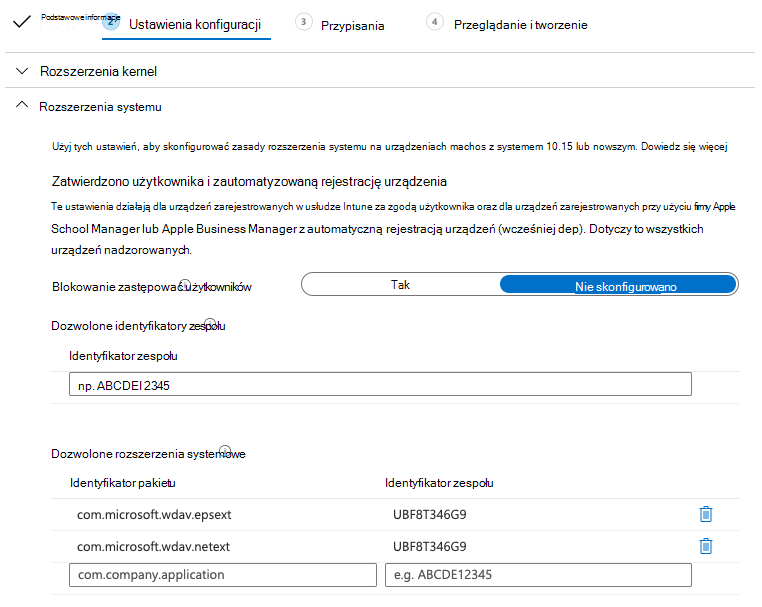
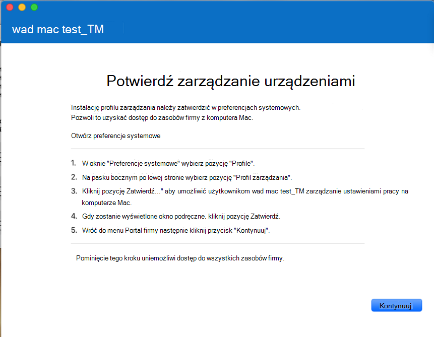

# <a name="intune-based-deployment-for-microsoft-defender-for-endpoint-on-macos"></a>Wdrożenie oparte na usłudze Intune dla programu Microsoft Defender for Endpoint w systemie macOS

[!INCLUDE [Microsoft 365 Defender rebranding](../../includes/microsoft-defender.md)]

**Dotyczy:**

- [Program Microsoft Defender for Endpoint w systemie macOS](microsoft-defender-endpoint-mac.md)
- [Microsoft Defender for Endpoint Plan 1](https://go.microsoft.com/fwlink/p/?linkid=2154037)
- [Microsoft Defender for Endpoint Plan 2](https://go.microsoft.com/fwlink/p/?linkid=2154037)

W tym temacie opisano sposób wdrażania programu Microsoft Defender dla punktu końcowego w systemie macOS za pośrednictwem usługi Intune. Pomyślne wdrożenie wymaga wykonania wszystkich następujących kroków:

1. [Pobierz pakiet dołączający](#download-the-onboarding-package)
1. [Konfiguracja urządzenia klienckiego](#client-device-setup)
1. [Zatwierdzanie rozszerzeń systemu](#approve-system-extensions)
1. [Tworzenie profilów konfiguracji systemu](#create-system-configuration-profiles)
1. [Publikowanie aplikacji](#publish-application)

## <a name="prerequisites-and-system-requirements"></a>Wymagania wstępne i wymagania systemowe

Przed rozpoczęciem zapoznaj się z główną stroną programu [Microsoft Defender for Endpoint na stronie macOS](microsoft-defender-endpoint-mac.md) , aby uzyskać opis wymagań wstępnych i wymagań systemowych bieżącej wersji oprogramowania.

## <a name="overview"></a>Omówienie

W poniższej tabeli podsumowano czynności, które należy wykonać, aby wdrożyć program Microsoft Defender dla punktu końcowego na komputerach Mac i zarządzać nimi za pośrednictwem usługi Intune. Bardziej szczegółowe instrukcje przedstawiono poniżej.

<br>

****

|Krok|Przykładowe nazwy plików|BundleIdentifier|
|---|---|---|
|[Pobierz pakiet dołączający](#download-the-onboarding-package)|WindowsDefenderATPOnboarding__MDATP_wdav.atp.xml|com.microsoft.wdav.atp|
|[Zatwierdź rozszerzenie systemu dla programu Microsoft Defender dla punktu końcowego](#approve-system-extensions)|MDATP_SysExt.xml|Nie dotyczy|
|[Zatwierdź rozszerzenie Kernel dla programu Microsoft Defender dla punktu końcowego](#download-the-onboarding-package)|MDATP_KExt.xml|Nie dotyczy|
|[Udzielanie pełnego dostępu dysku do programu Microsoft Defender dla punktu końcowego](#full-disk-access)|MDATP_tcc_Catalina_or_newer.xml|com.microsoft.wdav.tcc|
|[Zasady rozszerzenia sieci](#network-filter)|MDATP_NetExt.xml|Nie dotyczy|
|[Konfigurowanie programu Microsoft AutoUpdate (MAU)](mac-updates.md#intune)|MDATP_Microsoft_AutoUpdate.xml|com.microsoft.autoupdate2|
|[Ustawienia konfiguracji programu Microsoft Defender dla punktu końcowego](mac-preferences.md#intune-full-profile) <p> **Uwaga:** Jeśli planujesz uruchomienie innej firmy audio/wideo dla systemu macOS, ustaw wartość `passiveMode` `true`.|MDATP_WDAV_and_exclusion_settings_Preferences.xml|com.microsoft.wdav|
|[Konfigurowanie programu Microsoft Defender dla powiadomień programu Endpoint i MS AutoUpdate (MAU)](mac-updates.md)|MDATP_MDAV_Tray_and_AutoUpdate2.mobileconfig|com.microsoft.autoupdate2 lub com.microsoft.wdav.tray|
|

## <a name="download-the-onboarding-package"></a>Pobierz pakiet dołączający

Pobierz pakiety dołączania z Microsoft 365 Defender sieci:

1. W Microsoft 365 Defender sieci Web przejdź do **Ustawienia** \> **Do punktów końcowych** \> **Dołączanie** \> **urządzeń do zarządzania urządzeniami**.

2. Ustaw system operacyjny na **macOS** i metodę wdrażania na Zarządzanie urządzeniami przenośnymi **/ Microsoft Intune**.

    

3. Wybierz **pozycję Pobierz pakiet dołączający**. Zapisz jako _WindowsDefenderATPOnboardingPackage.zip_ w tym samym katalogu.

4. Wyodrębnianie zawartości pliku .zip pliku:

    ```bash
    unzip WindowsDefenderATPOnboardingPackage.zip
    ```

    ```Output
    Archive:  WindowsDefenderATPOnboardingPackage.zip
    warning:  WindowsDefenderATPOnboardingPackage.zip appears to use backslashes as path separators
      inflating: intune/kext.xml
      inflating: intune/WindowsDefenderATPOnboarding.xml
      inflating: jamf/WindowsDefenderATPOnboarding.plist
    ```

## <a name="create-system-configuration-profiles"></a>Tworzenie profilów konfiguracji systemu

Następnym krokiem jest utworzenie profilów konfiguracji systemu, których potrzebuje program Microsoft Defender dla punktu końcowego.
W centrum [Microsoft Endpoint Manager otwórz](https://endpoint.microsoft.com/) **pozycję Profile** \> **konfiguracji urządzeń**.

### <a name="onboarding-blob"></a>Obiekt blob dołączania

Ten profil zawiera informacje o licencji usługi Microsoft Defender for Endpoint. Bez tego profilu usługa Microsoft Defender for Endpoint będzie zgłaszać, że nie jest licencjonowana.

1. Wybierz **pozycję Utwórz profil w** **obszarze Profile konfiguracji**.
1. Wybierz **PlatformmacOS**=, **Profile** **typeTemplates**=. **Nazwa szablonu**= **Niestandardowe**. Kliknij **przycisk Utwórz**.

    > [!div class="mx-imgBorder"]
    > 

1. Wybierz nazwę profilu, na przykład "Defender for Cloud or Endpoint onboarding for macOS". Kliknij **Dalej**.

    > [!div class="mx-imgBorder"]
    > 

1. Wybierz nazwę dla nazwy profilu konfiguracji, na przykład "Defender for Endpoint onboarding for macOS".
1. Wybierz kanał [wdrożenia](/mem/intune/fundamentals/whats-new#new-deployment-channel-setting-for-custom-device-configuration-profiles-on-macos-devices).
1. Wybierz pozycję intune/WindowsDefenderATPOnboarding.xml wyodrębniona z powyższego pakietu dołączania jako plik profilu konfiguracji.

    > [!div class="mx-imgBorder"]
    > 

1. Kliknij **Dalej**.
1. Przypisz urządzenia na **karcie Zadanie** . Kliknij przycisk **Dalej**.

    > [!div class="mx-imgBorder"]
    > 

1. Przejrzyj i **utwórz**.
1. Otwórz **profile** \> **konfiguracji urządzeń**. Tam możesz wyświetlić utworzony profil.

    > [!div class="mx-imgBorder"]
    > 

### <a name="approve-system-extensions"></a>Zatwierdź rozszerzenia systemowe

Ten profil jest potrzebny dla systemu macOS 10.15 (Catalina) lub nowszego. W starszych systemach macOS są ignorowane.

1. Wybierz **pozycję Utwórz profil w** **obszarze Profile konfiguracji**.
1. Wybierz **PlatformmacOS**=, **Profile** **typeTemplates**=. **Nazwa szablonu**= **Rozszerzenia**. Kliknij **przycisk Utwórz**.
1. Na karcie **Podstawy** nadaj nazwę temu noweowi profilowi.
1. Na karcie **Ustawienia konfiguracji** rozwiń **pozycję Rozszerzenia** systemowe, a następnie dodaj następujące wpisy w sekcji **Dozwolone rozszerzenia** systemowe:

    |Identyfikator pakietu|Identyfikator zespołu|
    |---|---|
    |com.microsoft.wdav.epsext|UBF8T346G9|
    |com.microsoft.wdav.netext|UBF8T346G9|

    > [!div class="mx-imgBorder"]
    > 

1. Na karcie **Zadania przypisz** ten profil wszystkim użytkownikom i **& wszystkich urządzeniach**.
1. Przejrzyj i utwórz ten profil konfiguracji.

### <a name="kernel-extensions"></a>Rozszerzenia kernelów

Ten profil jest potrzebny dla systemu macOS 10.15 (Catalina) lub starszego. W przypadku nowszego systemu macOS zostanie on zignorowany.

> [!CAUTION]
> Urządzenia apple Silicon (M1) nie obsługują doc. Instalacja profilu konfiguracji składającego się z zasad KEXT nie powiedzie się na tych urządzeniach.

1. Wybierz **pozycję Utwórz profil w** **obszarze Profile konfiguracji**.
1. Wybierz **PlatformmacOS**=, **Profile** **typeTemplates**=. **Nazwa szablonu**= **Rozszerzenia**. Kliknij **przycisk Utwórz**.
1. Na karcie **Podstawy** nadaj nazwę temu noweowi profilowi.
1. Na karcie **Ustawienia konfiguracji** rozwiń pozycję **Rozszerzenia kernel.**
1. Ustaw **identyfikator zespołu** **na UBF8T346G9** i kliknij przycisk **Dalej**.

    > [!div class="mx-imgBorder"]
    > 

1. Na karcie **Zadania przypisz** ten profil wszystkim użytkownikom i **& wszystkich urządzeniach**.
1. Przejrzyj i utwórz ten profil konfiguracji.

### <a name="full-disk-access"></a>Pełny dostęp do dysku

   > [!CAUTION]
   > System macOS 10.15 (Catalina) zawiera nowe udoskonalenia zabezpieczeń i prywatności. Począwszy od tej wersji aplikacje nie mogą domyślnie uzyskać dostępu do określonych lokalizacji na dysku (takich jak Dokumenty, Pliki do pobrania, Pulpit itp.) bez wyraźnej zgody. W przypadku braku tej zgody usługa Microsoft Defender for Endpoint nie może w pełni chronić Twojego urządzenia.
   >
   > Ten profil konfiguracji udziela pełnego dostępu na dysku do programu Microsoft Defender dla punktu końcowego. Jeśli wcześniej skonfigurowano usługę Microsoft Defender dla punktu końcowego za pośrednictwem usługi Intune, zalecamy zaktualizowanie wdrożenia przy użyciu tego profilu konfiguracji.

Pobierz [**plik fullconfig.mobileconfig**](https://raw.githubusercontent.com/microsoft/mdatp-xplat/master/macos/mobileconfig/profiles/fulldisk.mobileconfig) z [GitHub repozytorium aplikacji](https://github.com/microsoft/mdatp-xplat/tree/master/macos/mobileconfig/profiles).

Postępuj zgodnie z instrukcjami dotyczącymi obiektu [blob](#onboarding-blob) dołączania z powyższej strony, używając jako nazwy profilu "Defender for Endpoint Full Disk Access" i **pobranego pliku fullconfig.mobileconfig** jako nazwy profilu konfiguracji.

### <a name="network-filter"></a>Filtr sieci

W ramach funkcji wykrywania punktu końcowego i odpowiedzi usługa Microsoft Defender for Endpoint w systemie macOS sprawdza ruch sieciowy i raportuje te informacje w portalu usługi Microsoft 365 Defender sieci. Poniższe zasady pozwalają na korzystanie z tej funkcji przez rozszerzenie sieci.

Pobierz [**plik netfilter.mobileconfig**](https://raw.githubusercontent.com/microsoft/mdatp-xplat/master/macos/mobileconfig/profiles/netfilter.mobileconfig) z [GitHub repozytorium.](https://github.com/microsoft/mdatp-xplat/tree/master/macos/mobileconfig/profiles)

Wykonaj instrukcje dotyczące obiektu [blob dołączania](#onboarding-blob) z powyższej strony, używając jako nazwy profilu "Defender for Endpoint Network Filter" i pobranego **pliku netfilter.mobileconfig** jako nazwy profilu konfiguracji.

### <a name="notifications"></a>Powiadomienia

Ten profil jest używany do zezwalania programowi Microsoft Defender for Endpoint w systemie macOS i u usługi Microsoft Auto Update na wyświetlanie powiadomień w interfejsie użytkownika systemu macOS 10.15 (Catalina) lub nowszego.

Pobierz [**plik notif.mobileconfig**](https://raw.githubusercontent.com/microsoft/mdatp-xplat/master/macos/mobileconfig/profiles/notif.mobileconfig) z [GitHub repozytorium](https://github.com/microsoft/mdatp-xplat/tree/master/macos/mobileconfig/profiles).

Postępuj zgodnie z instrukcjami dotyczącymi obiektu [blob](#onboarding-blob) dołączania z powyższej strony, używając jako nazwy profilu "Defender for Endpoint Notifications" i **pobranego pliku notif.mobileconfig** jako nazwy profilu konfiguracji.

### <a name="view-status"></a>Wyświetl stan

Po propagacji zmian w usłudze Intune na zarejestrowanych urządzeniach możesz je wyświetlić w obszarze **Monitorowanie** \> **stanu urządzenia**:

> [!div class="mx-imgBorder"]
> 

## <a name="publish-application"></a>Publikowanie aplikacji

Ten krok umożliwia wdrożenie programu Microsoft Defender for Endpoint na zarejestrowanych komputerach.

1. W centrum [Microsoft Endpoint Manager otwórz](https://endpoint.microsoft.com/) pozycję **Aplikacje**.

    > [!div class="mx-imgBorder"]
    > 

1. Wybierz pozycję Według platformy > systemie macOS > Dodaj.
1. Wybierz **pozycję Typ** **aplikacjimacOS**= i kliknij pozycję **Wybierz**.

    > [!div class="mx-imgBorder"]
    > 

1. Zachowaj wartości domyślne, kliknij przycisk **Dalej**.

    > [!div class="mx-imgBorder"]
    > 

1. Dodaj zadania i kliknij przycisk **Dalej**.

    > [!div class="mx-imgBorder"]
    > 

1. Przejrzyj i **utwórz**.
1. Możesz odwiedzić stronę **Aplikacje** \> **według platformy** \> **macOS** , aby wyświetlić ją na liście wszystkich aplikacji.

    > [!div class="mx-imgBorder"]
    > 

Aby uzyskać więcej informacji, zobacz [Dodawanie programu Microsoft Defender for Endpoint do urządzeń z systemem macOS Microsoft Intune](/mem/intune/apps/apps-advanced-threat-protection-macos)).

   > [!CAUTION]
   > Należy utworzyć wszystkie wymagane profile konfiguracji i wypchnąć je na wszystkie komputery, jak wyjaśniono powyżej.

## <a name="client-device-setup"></a>Konfiguracja urządzenia klienckiego

Nie potrzebujesz żadnej specjalnej obsługi administracyjnej dla komputerów Mac poza standardową Portal firmy [instalacji](/intune-user-help/enroll-your-device-in-intune-macos-cp).

1. Potwierdź zarządzanie urządzeniami.

    > [!div class="mx-imgBorder"]
    > 

    Wybierz **pozycję Otwórz preferencje systemowe**, **zlokalizuj pozycję Profil** zarządzania na liście i wybierz pozycję **Zatwierdź...**. Twój profil zarządzania będzie wyświetlany jako **Zweryfikowany**:

    

2. Wybierz **pozycję Kontynuuj** i ukończ rejestrację.

   Możesz teraz zarejestrować więcej urządzeń. Możesz je również zarejestrować później po zakończeniu inicjowania obsługi administracyjnej pakietów aplikacji i konfiguracji systemu.

3. W usłudze Intune otwórz **okno Zarządzaj urządzeniami** \>  \> **Wszystkie urządzenia**. Tutaj możesz zobaczyć swoje urządzenie spośród wymienionych na liście:

   > [!div class="mx-imgBorder"]
   > 

## <a name="verify-client-device-state"></a>Weryfikowanie stanu urządzenia klienckiego

1. Po wdrożeniu profilów konfiguracji na twoich urządzeniach otwórz profile **preferencji systemowych** \> **na urządzeniu** Mac.

    > [!div class="mx-imgBorder"]
    > 

    

2. Sprawdź, czy są obecne i zainstalowane następujące profile konfiguracji. Profil **zarządzania powinien** być profilem systemu Intune. _Wdav-config_ _i wdav-kext_ to profile konfiguracji systemu, które zostały dodane w usłudze Intune:

    

3. W prawym górnym rogu powinna również być wyświetlana ikona programu Microsoft Defender for Endpoint:

    > [!div class="mx-imgBorder"]
    > 

## <a name="troubleshooting"></a>Rozwiązywanie problemów

Problem: Nie znaleziono licencji.

Rozwiązanie: Wykonaj powyższe czynności, aby utworzyć profil urządzenia przy użyciu WindowsDefenderATPOnboarding.xml.

## <a name="logging-installation-issues"></a>Problemy z instalacją rejestrowania

Aby uzyskać więcej informacji na temat sposobu znalezienia automatycznie wygenerowanego dziennika, który jest tworzony przez instalatora w przypadku wystąpienia błędu, zobacz Rejestrowanie [problemów z instalacją](mac-resources.md#logging-installation-issues).

## <a name="uninstallation"></a>Dezinstalacja

Aby [uzyskać szczegółowe informacje na](mac-resources.md#uninstalling) temat usuwania programu Microsoft Defender dla punktu końcowego w systemie macOS z urządzeń klienckich, zobacz Odinstalowywanie.
