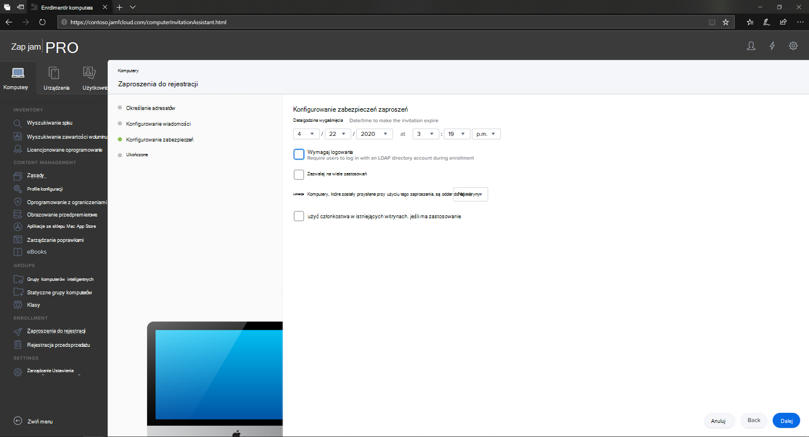
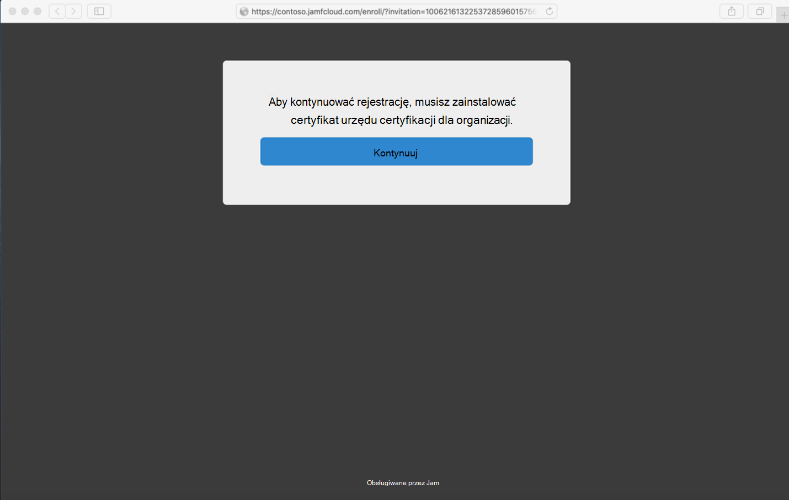
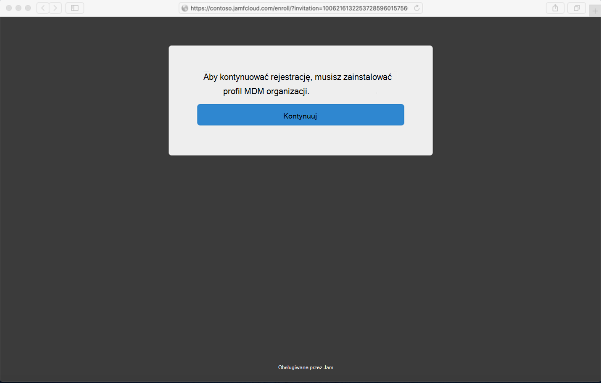

# Zarejestruj program Microsoft Defender dla punktu końcowego na urządzeniach z systemem macOS do usługi Jamf Pro

[!INCLUDE [Microsoft 365 Defender rebranding](../../includes/microsoft-defender.md)]

**Dotyczy:**
- [Microsoft Defender for Endpoint Plan 1](https://go.microsoft.com/fwlink/p/?linkid=2154037)
- [Microsoft Defender for Endpoint Plan 2](https://go.microsoft.com/fwlink/p/?linkid=2154037)
- [Microsoft 365 Defender](https://go.microsoft.com/fwlink/?linkid=2118804)

> Chcesz mieć dostęp do usługi Defender dla punktu końcowego? [Zarejestruj się, aby korzystać z bezpłatnej wersji próbnej.](https://signup.microsoft.com/create-account/signup?products=7f379fee-c4f9-4278-b0a1-e4c8c2fcdf7e&ru=https://aka.ms/MDEp2OpenTrial?ocid=docs-wdatp-investigateip-abovefoldlink)

## Zarejestruj urządzenia z systemem macOS

Istnieje wiele metod zarejestrowania się w programie JamF.

W tym artykule podano dwie metody:

- [Metoda 1. Zaproszenia do rejestracji](#enrollment-method-1-enrollment-invitations)
- [Metoda 2. Rejestracja w przedsprzedażu](#enrollment-method-2-prestage-enrollments)

Aby uzyskać pełną listę, zobacz [Informacje o rejestracji komputera](https://docs.jamf.com/9.9/casper-suite/administrator-guide/About_Computer_Enrollment.html).

## Metoda rejestracji 1: Zaproszenia do rejestracji

1. Na pulpicie nawigacyjnym Pro Jamf przejdź do **strony Zaproszenia do rejestracji**.

    

2. Wybierz **pozycję + Nowy**.

    

3. W **obszarze Określ adresatów dla zaproszenia** > w obszarze Adresy  e-mail wprowadź adresy e-mail adresatów.

    

    

    Na przykład: janedoe@contoso.com

    

4. Skonfiguruj wiadomość dla zaproszenia.

    

    

    

    

## Metoda rejestracji 2: rejestracja w przedsprzedażu

1. Na pulpicie nawigacyjnym usługi Jamf Pro przejdź do strony **Rejestracja w przedsprzedażu**.

    

2. Postępuj zgodnie z instrukcjami [w tece Rejestracja na komputerze w przedsprzedażu](https://docs.jamf.com/9.9/casper-suite/administrator-guide/Computer_PreStage_Enrollments.html).

## Zarejestruj urządzenie z systemem macOS

1. Wybierz **pozycję Kontynuuj** i zainstaluj certyfikat urzędu certyfikacji w **oknie Preferencje** systemowe.

    

2. Po zainstalowaniu certyfikatu urzędu certyfikacji wróć do okna przeglądarki i wybierz pozycję **Kontynuuj** i zainstaluj profil MDM.

    

3. Wybierz **pozycję Zezwalaj** , aby pobierać pliki z jamf.

    

4. Wybierz **pozycję Kontynuuj** , aby kontynuować instalację profilu MDM.

    

5. Wybierz **pozycję Kontynuuj** , aby zainstalować profil MDM.

    

6. Wybierz **pozycję Kontynuuj**  , aby ukończyć konfigurację.

    
