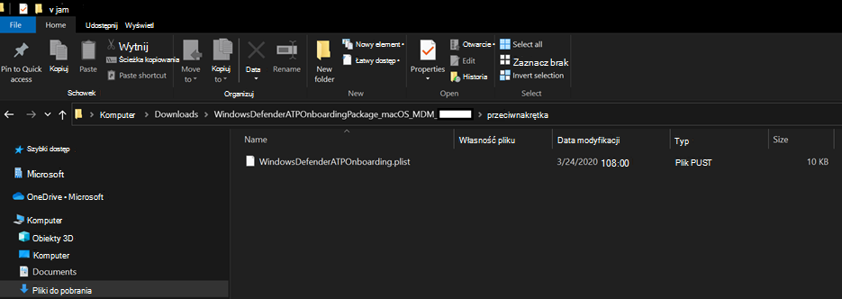
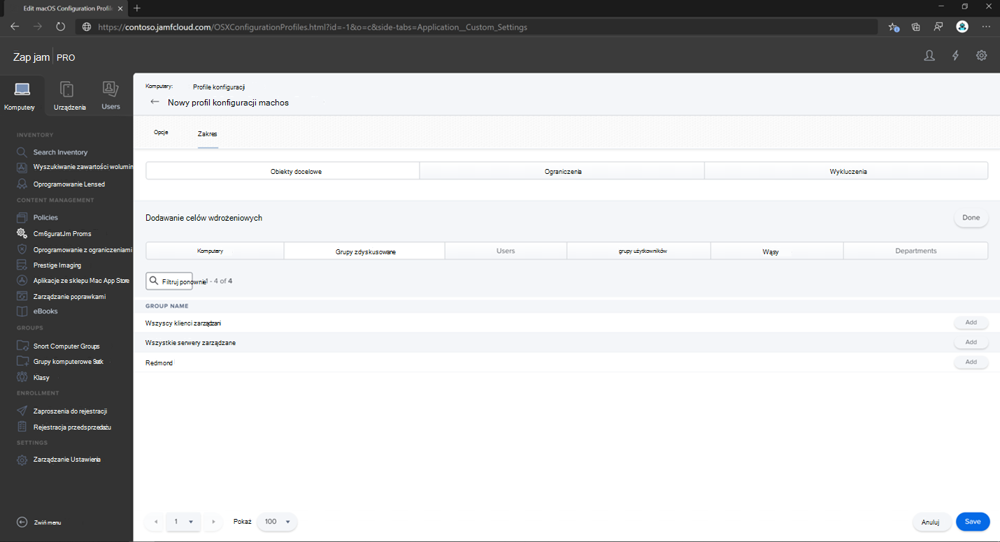
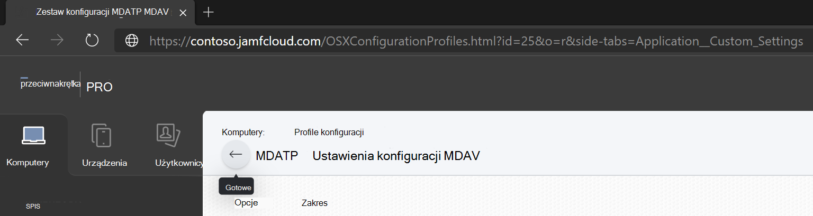
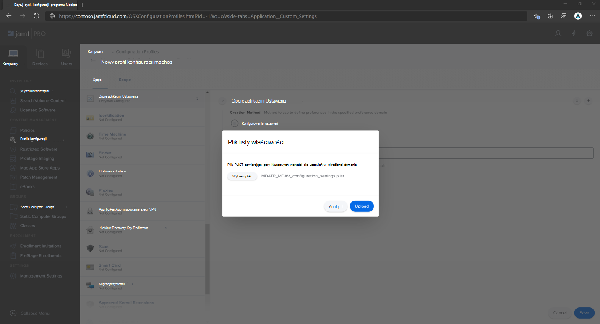
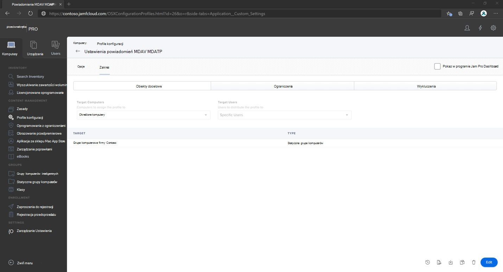
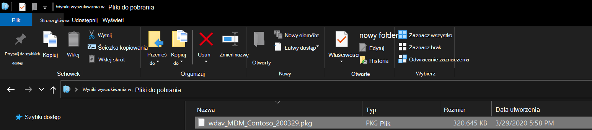
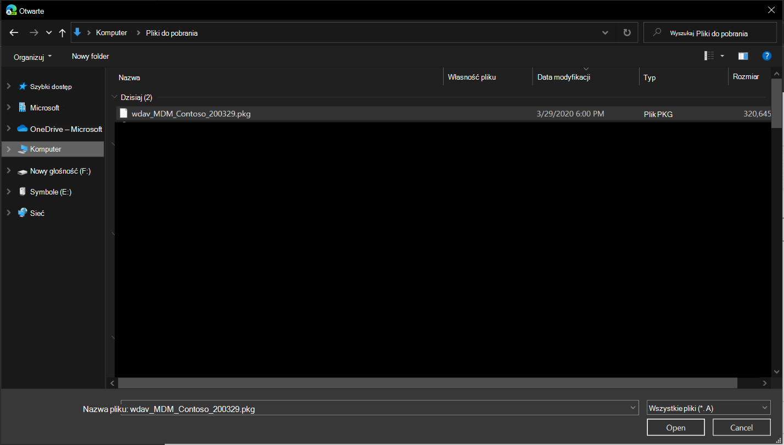
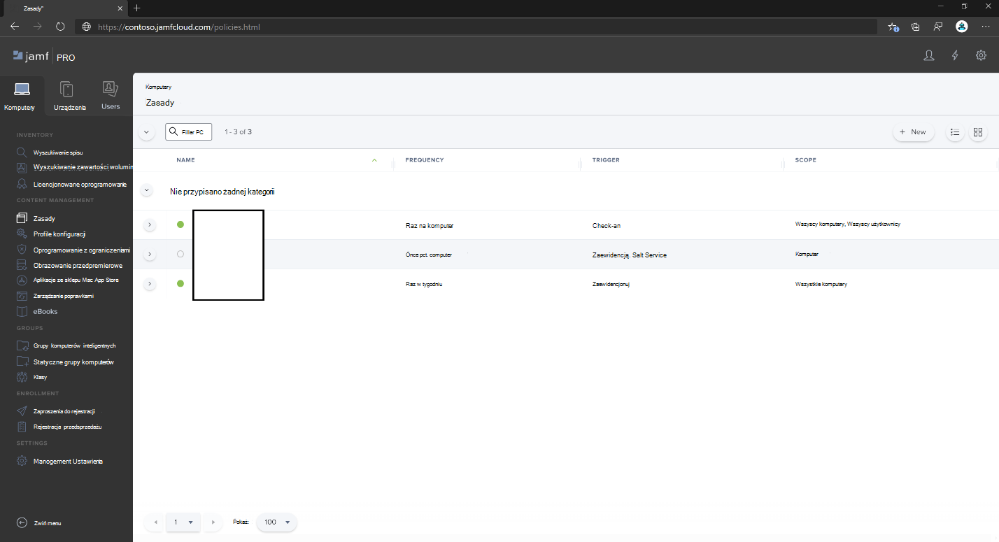

# <a name="set-up-the-microsoft-defender-for-endpoint-on-macos-policies-in-jamf-pro"></a>Konfigurowanie programu Microsoft Defender for Endpoint w zasadach macOS w programie Jamf Pro

[!INCLUDE [Microsoft 365 Defender rebranding](../../includes/microsoft-defender.md)]


**Dotyczy:**
- [Program Defender dla punktu końcowego na komputerze Mac](microsoft-defender-endpoint-mac.md)
- [Microsoft Defender for Endpoint Plan 1](https://go.microsoft.com/fwlink/p/?linkid=2154037)
- [Microsoft Defender for Endpoint Plan 2](https://go.microsoft.com/fwlink/p/?linkid=2154037)

Ta strona zawiera instrukcje niezbędne do skonfigurowania zasad macOS w programie Jamf Pro.

Musisz wykonać następujące czynności:

1. [Uzyskaj pakiet dołączania do programu Microsoft Defender for Endpoint](#step-1-get-the-microsoft-defender-for-endpoint-onboarding-package)
2. [Tworzenie profilu konfiguracji w programie Jamf Pro przy użyciu pakietu dołączania](#step-2-create-a-configuration-profile-in-jamf-pro-using-the-onboarding-package)
3. [Konfigurowanie programu Microsoft Defender dla ustawień punktu końcowego](#step-3-configure-microsoft-defender-for-endpoint-settings)
4. [Konfigurowanie ustawień powiadomień programu Microsoft Defender dla punktu końcowego](#step-4-configure-notifications-settings)
5. [Konfigurowanie programu Microsoft AutoUpdate (MAU)](#step-5-configure-microsoft-autoupdate-mau)
6. [Udzielanie pełnego dostępu dysku do programu Microsoft Defender dla punktu końcowego](#step-6-grant-full-disk-access-to-microsoft-defender-for-endpoint)
7. [Zatwierdź rozszerzenie Kernel dla programu Microsoft Defender dla punktu końcowego](#step-7-approve-kernel-extension-for-microsoft-defender-for-endpoint)
8. [Zatwierdzanie rozszerzeń systemowych dla programu Microsoft Defender dla punktu końcowego](#step-8-approve-system-extensions-for-microsoft-defender-for-endpoint)
9. [Konfigurowanie rozszerzenia sieci](#step-9-configure-network-extension)
10. [Planowanie skanowania za pomocą programu Microsoft Defender for Endpoint w systemie macOS](/windows/security/threat-protection/microsoft-defender-atp/mac-schedule-scan-atp)
11. [Wdrażanie programu Microsoft Defender dla punktu końcowego w systemie macOS](#step-11-deploy-microsoft-defender-for-endpoint-on-macos)

## <a name="step-1-get-the-microsoft-defender-for-endpoint-onboarding-package"></a>Krok 1. Uzyskaj pakiet dołączania do programu Microsoft Defender for Endpoint

1. W [Microsoft 365 Defender](https://security.microsoft.com) przejdź do Ustawienia > **punktów końcowych > dołączanie**.

2. Wybierz system macOS jako system operacyjny i zarządzanie urządzeniami przenośnymi / Microsoft Intune jako metodę wdrażania.

    

3. Wybierz **pozycję Pobierz pakiet dołączający** (WindowsDefenderATPOnboardingPackage.zip).

4. Wyodrębnij `WindowsDefenderATPOnboardingPackage.zip`.

5. Skopiuj plik do preferowanej lokalizacji. Na przykład `C:\Users\JaneDoe_or_JohnDoe.contoso\Downloads\WindowsDefenderATPOnboardingPackage_macOS_MDM_contoso\jamf\WindowsDefenderATPOnboarding.plist`.

## <a name="step-2-create-a-configuration-profile-in-jamf-pro-using-the-onboarding-package"></a>Krok 2. Tworzenie profilu konfiguracji w programie Jamf Pro przy użyciu pakietu dołączania

1. Znajdź plik z `WindowsDefenderATPOnboarding.plist` poprzedniej sekcji.

   

2. Zaloguj się do usługi Jamf Pro do **opcji** **KomputeryKonfiguracja** >  Profile i wybierz pozycję **Nowy**.

    

3. Wprowadź następujące szczegóły:

   **Informacje ogólne**:

   - Nazwa: Dołączanie do usługi MDE dla systemu macOS
   - Opis: dołączanie do EDR MDE dla systemu macOS
   - Kategoria: Brak
   - Metoda dystrybucji: automatyczne instalowanie
   - Poziom: Poziom komputera

4.  Przejdź do strony **& niestandardowej Ustawienia** i wybierz **pozycję Upload** >  **Add**.

    

5. Wybierz **Upload Plik (plik PLIST),** a następnie w **preferencjach Domena wprowadź**: `com.microsoft.wdav.atp`.

    

    

6. Wybierz **pozycję** Otwórz i wybierz plik dołączania.

    

7. Wybierz **Upload**.

    

8. Wybierz **kartę Zakres** .

    

9. Wybierz komputery docelowe.

    

    

10. Wybierz **Zapisz**.

    

    

11. Wybierz pozycję **Gotowe**.

    

    

## <a name="step-3-configure-microsoft-defender-for-endpoint-settings"></a>Krok 3. Konfigurowanie programu Microsoft Defender dla ustawień punktu końcowego

Możesz użyć graficznego interfejsu użytkownika usługi JAMF Pro do edytowania poszczególnych ustawień programu Microsoft Defender for Endpoint konfiguracji lub użyć starszej metody, tworząc listę konfiguracji w edytorze tekstów i przesyłając ją do usługi JAMF Pro.

Zwróć uwagę, że należy dokładnie użyć domeny `com.microsoft.wdav` **preferencji**, a program Microsoft Defender for Endpoint `com.microsoft.wdav.ext` używa tylko tej nazwy i do ładowania jej ustawień zarządzanych.

Ta wersja `com.microsoft.wdav.ext` może być używana w rzadkich przypadkach, gdy wolisz używać metody graficznego interfejsu użytkownika, ale musisz też skonfigurować ustawienie, które nie zostało jeszcze dodane do schematu.

### <a name="gui-method"></a>Metoda graficznego interfejsu użytkownika

1. Pobierz plik schema.json z repozytorium GitHub [Defender i](https://github.com/microsoft/mdatp-xplat/tree/master/macos/schema) zapisz go w pliku lokalnym:

    ```bash
    curl -o ~/Documents/schema.json https://raw.githubusercontent.com/microsoft/mdatp-xplat/master/macos/schema/schema.json
    ```

2. Utwórz nowy profil konfiguracji w obszarze Komputery > profilów konfiguracji wprowadź następujące szczegóły na **karcie** Ogólne:

    

    - Nazwa: Ustawienia konfiguracji MDAV MDAV USŁUGI MDATP
    - Opis:\<blank\>
    - Kategoria: Brak (domyślna)
    - Poziom: Poziom komputera (domyślny)
    - Metoda dystrybucji: Instalacja automatycznie (domyślna)

3. Przewiń w dół do **karty & Niestandardowe Ustawienia** aplikacji, wybierz pozycję Aplikacje **zewnętrzne, kliknij** pozycję Dodaj  i użyj schematu  niestandardowego jako źródła do użycia w domenie preferencji.

    

4. Wprowadź `com.microsoft.wdav` jako domenę preferencji, kliknij pozycję **Dodaj schemat** **i Upload** plik schema.json pobrany w kroku 1. Kliknij **Zapisz**.

    

5. Poniżej w obszarze Preference Domain Properties (Właściwości domeny preferencji) możesz zobaczyć wszystkie obsługiwane ustawienia konfiguracji programu Microsoft Defender **for Endpoint**. Kliknij **pozycję Dodaj/Usuń właściwości** , aby wybrać ustawienia, które mają być zarządzane, a następnie kliknij przycisk **OK** , aby zapisać zmiany. (Ustawienia pozostawione niewybrane nie zostaną uwzględnione w konfiguracji zarządzanej, użytkownik końcowy będzie mógł skonfigurować te ustawienia na swoich komputerach.

    

6. Zmień wartości ustawień na żądane wartości. Możesz kliknąć pozycję **Więcej informacji,** aby uzyskać dokumentację dla określonego ustawienia. (Możesz kliknąć pozycję **Podgląd listy,** aby sprawdzić, jak będzie wyglądała lista plist konfiguracji. Kliknij **pozycję Edytor formularzy** , aby powrócić do edytora wizualnego).

    

7. Wybierz **kartę Zakres** .

    

8. Wybierz **pozycję Grupa komputerowa firmy Contoso**.

9. Wybierz **pozycję Dodaj**, a następnie wybierz **pozycję Zapisz**.

    

    

10. Wybierz pozycję **Gotowe**. Zostanie wyświetlony nowy profil **konfiguracji**.

    

Program Microsoft Defender for Endpoint dodaje z czasem nowe ustawienia. Te nowe ustawienia zostaną dodane do schematu i nowa wersja zostanie opublikowana w witrynie Github.
Aby mieć aktualizacje, wystarczy pobrać zaktualizowany schemat, edytować istniejący profil konfiguracji i pozycję Edytuj schemat na karcie Niestandardowy &  **Ustawienia** aplikacji.

### <a name="legacy-method"></a>Starsza metoda

1. Użyj następujących ustawień konfiguracji programu Microsoft Defender for Endpoint:

    - enableRealTimeProtection
    - passiveMode

    > [!NOTE]
    > Domyślnie nie włączone, jeśli planujesz uruchomienie innej firmy audio/wideo dla systemu macOS, ustaw ją na `true`.

    - wykluczenia
    - excludedPath
    - excludedFileExtension (Wykluczanie pliku)
    - excludedFileName
    - exclusionsMergePolicy
    - allowedThreats

    > [!NOTE]
    > Jeżeli test dotyczy dowodu koncepcji, należy go usunąć, szczególnie jeśli test jest testem EICAR.

    - disallowedThreatActions
    - potentially_unwanted_application
    - archive_bomb
    - cloudService
    - automaticSampleSubmission
    - tagi
    - hideStatusMenuIcon

     Aby uzyskać informacje, zobacz [Lista właściwości dla pełnego profilu konfiguracji usługi JAMF](mac-preferences.md#property-list-for-jamf-full-configuration-profile).

     ```XML
     <?xml version="1.0" encoding="UTF-8"?>
     <!DOCTYPE plist PUBLIC "-//Apple//DTD PLIST 1.0//EN" "http://www.apple.com/DTDs/PropertyList-1.0.dtd">
     <plist version="1.0">
     <dict>
         <key>antivirusEngine</key>
         <dict>
             <key>enableRealTimeProtection</key>
             <true/>
             <key>passiveMode</key>
             <false/>
             <key>exclusions</key>
             <array>
                 <dict>
                     <key>$type</key>
                     <string>excludedPath</string>
                     <key>isDirectory</key>
                     <false/>
                     <key>path</key>
                     <string>/var/log/system.log</string>
                 </dict>
                 <dict>
                     <key>$type</key>
                     <string>excludedPath</string>
                     <key>isDirectory</key>
                     <true/>
                     <key>path</key>
                     <string>/home</string>
                 </dict>
                 <dict>
                     <key>$type</key>
                     <string>excludedFileExtension</string>
                     <key>extension</key>
                     <string>pdf</string>
                 </dict>
                 <dict>
                     <key>$type</key>
                     <string>excludedFileName</string>
                     <key>name</key>
                     <string>cat</string>
                 </dict>
             </array>
             <key>exclusionsMergePolicy</key>
             <string>merge</string>
             <key>allowedThreats</key>
             <array>
                 <string>EICAR-Test-File (not a virus)</string>
             </array>
             <key>disallowedThreatActions</key>
             <array>
                 <string>allow</string>
                 <string>restore</string>
             </array>
             <key>threatTypeSettings</key>
             <array>
                 <dict>
                     <key>key</key>
                     <string>potentially_unwanted_application</string>
                     <key>value</key>
                     <string>block</string>
                 </dict>
                 <dict>
                     <key>key</key>
                     <string>archive_bomb</string>
                     <key>value</key>
                     <string>audit</string>
                 </dict>
             </array>
             <key>threatTypeSettingsMergePolicy</key>
             <string>merge</string>
         </dict>
         <key>cloudService</key>
         <dict>
             <key>enabled</key>
             <true/>
             <key>diagnosticLevel</key>
             <string>optional</string>
             <key>automaticSampleSubmission</key>
             <true/>
         </dict>
         <key>edr</key>
         <dict>
             <key>tags</key>
             <array>
                 <dict>
                     <key>key</key>
                     <string>GROUP</string>
                     <key>value</key>
                     <string>ExampleTag</string>
                 </dict>
             </array>
         </dict>
         <key>userInterface</key>
         <dict>
             <key>hideStatusMenuIcon</key>
             <false/>
         </dict>
     </dict>
     </plist>
     ```

2. Zapisz plik jako `MDATP_MDAV_configuration_settings.plist`.

3. Na pulpicie nawigacyjnym usługi Pro Jamf otwórz **okno Komputery** i ich **profile konfiguracji**. Kliknij **pozycję** Nowy i przejdź do **karty** Ogólne.

    

4. Wprowadź następujące szczegóły:

    **Ogólne**

    - Nazwa: Ustawienia konfiguracji MDAV MDAV USŁUGI MDATP
    - Opis:\<blank\>
    - Kategoria: Brak (domyślna)
    - Metoda dystrybucji: Zainstaluj automatycznie(domyślnie)
    - Poziom: Poziom komputera(domyślnie)

    

5. W **czacie & Pozycję Ustawienia** pozycję **Konfiguruj**.

    

6. Wybierz **Upload plik (PLIST**).

    

7. W **oknie Preferencje** w domenie wpisz `com.microsoft.wdav`, a **następnie Upload plik PLIST**.

    

8. Wybierz **pozycję Wybierz plik**.

    

9. Wybierz pozycję **MDATP_MDAV_configuration_settings.plist**, a następnie wybierz pozycję **Otwórz**.

    

10. Wybierz **Upload**.

    

    

    > [!NOTE]
    > Jeśli się zdarzy, że przekażesz plik intune, zostanie wyświetlany następujący błąd:
    >
    >

11. Wybierz **Zapisz**.

    

12. Plik zostanie przekazany.

    

    

13. Wybierz **kartę Zakres** .

    

14. Wybierz **pozycję Grupa komputerowa firmy Contoso**.

15. Wybierz **pozycję Dodaj**, a następnie wybierz **pozycję Zapisz**.

    

    

16. Wybierz pozycję **Gotowe**. Zostanie wyświetlony nowy profil **konfiguracji**.

    

## <a name="step-4-configure-notifications-settings"></a>Krok 4. Konfigurowanie ustawień powiadomień

Te kroki mają zastosowanie do systemu macOS 10.15 (Catalina) lub nowszego.

1. Na pulpicie nawigacyjnym usługi Pro Jamf wybierz pozycję **Komputery**, a następnie **pozycję Profile konfiguracji**.

2. Kliknij **pozycję** Nowy i wprowadź następujące **szczegóły opcji:**

    - Karta **Ogólne**:
        - **Nazwa**: Ustawienia powiadomień MDAV MDAV MDATP
        - **Opis**: macOS 10.15 (Catalina) lub nowsze
        - **Kategoria**: Brak *(domyślna)*
        - **Metoda dystrybucji**: Instalacja automatycznie *(domyślna)*
        - **Poziom**: Poziom komputera *(domyślny)*

        

    - Powiadomienia **na karcie** Kliknij przycisk **Dodaj** i wprowadź następujące wartości:
        - **Identyfikator pakietu**: `com.microsoft.wdav.tray`
        - **Alerty krytyczne**: kliknij **pozycję Wyłącz**
        - **Powiadomienia**: Kliknij pozycję **Włącz.**
        - **Typ alertu na banerze**: Wybierz **pozycję Dołącz** **i Tymczasowy** *(domyślny)*
        - **Powiadomienia na ekranie blokady**: Kliknij pozycję **Ukryj**
        - **Powiadomienia w Centrum powiadomień**: Kliknij pozycję **Wyświetlanie**
        - **Ikona aplikacji znaczek**: kliknij pozycję **Wyświetlanie**

        

    - Powiadomienia **na karcie** kliknij **pozycję Dodaj** jeszcze raz, przewiń w dół do **menu Nowe powiadomienia Ustawienia**
        - **Identyfikator pakietu**: `com.microsoft.autoupdate2`
        - Skonfiguruj pozostałe ustawienia na takie same wartości jak powyżej

        

        Zauważ, że teraz masz dwie "tabele" z konfiguracjami powiadomień: jedną dla identyfikatora pakietu **: com.microsoft.wdav.tray**, a drugą dla identyfikatora pakietu **: com.microsoft.autoupdate2**. Chociaż możesz skonfigurować ustawienia alertów zgodnie z wymaganiami, identyfikatory pakietów muszą być dokładnie takie same, jak opisano wcześniej, a przełącznik Dołącz  musi być włączony dla **powiadomień**.

3. Wybierz **kartę Zakres** , a następnie wybierz pozycję **Dodaj**.

    

4. Wybierz **pozycję Grupa komputerowa firmy Contoso**.

5. Wybierz **pozycję Dodaj**, a następnie wybierz **pozycję Zapisz**.

    

    

6. Wybierz pozycję **Gotowe**. Zostanie wyświetlony nowy profil **konfiguracji**.

    

## <a name="step-5-configure-microsoft-autoupdate-mau"></a>Krok 5. Konfigurowanie programu Microsoft AutoUpdate (MAU)

1. Użyj następujących ustawień konfiguracji programu Microsoft Defender for Endpoint:

      ```XML
   <?xml version="1.0" encoding="UTF-8"?>
   <!DOCTYPE plist PUBLIC "-//Apple//DTD PLIST 1.0//EN" "http://www.apple.com/DTDs/PropertyList-1.0.dtd">
   <plist version="1.0">
   <dict>
    <key>ChannelName</key>
    <string>Current</string>
    <key>HowToCheck</key>
    <string>AutomaticDownload</string>
    <key>EnableCheckForUpdatesButton</key>
    <true/>
    <key>DisableInsiderCheckbox</key>
    <false/>
    <key>SendAllTelemetryEnabled</key>
    <true/>
   </dict>
   </plist>
   ```

2. Zapisz jako `MDATP_MDAV_MAU_settings.plist`.

3. Na pulpicie nawigacyjnym Pro Jamf wybierz pozycję **Ogólne**.

    

4. Wprowadź następujące szczegóły:

    **Ogólne**

    - Nazwa: Ustawienia MDATP MDAV MAU
    - Opis: Ustawienia programu Microsoft AutoUpdate w układzie MDATP dla systemu macOS
    - Kategoria: Brak (domyślna)
    - Metoda dystrybucji: Zainstaluj automatycznie(domyślnie)
    - Poziom: Poziom komputera(domyślnie)

5. W **czacie & Pozycję Ustawienia** pozycję **Konfiguruj**.

    

6. Wybierz **Upload plik (PLIST**).

    

7. W **preferencjach Domena** wprowadź: `com.microsoft.autoupdate2`, a **następnie Upload plik PLIST**.

    

8. Wybierz **pozycję Wybierz plik**.

    

9. Wybierz **MDATP_MDAV_MAU_settings.plist**.

    

10. Wybierz **Upload**.
    

    

11. Wybierz **Zapisz**.

    

12. Wybierz **kartę Zakres** .

     

13. Wybierz opcję **Dodaj**.

    

    

    

14. Wybierz pozycję **Gotowe**.

    

## <a name="step-6-grant-full-disk-access-to-microsoft-defender-for-endpoint"></a>Krok 6. Udzielanie pełnego dostępu do usługi Microsoft Defender dla punktu końcowego na dysku

1. Na pulpicie nawigacyjnym usługi Pro Jamf wybierz **pozycję Profile konfiguracji**.

    

2. Wybierz **pozycję + Nowy**.

3. Wprowadź następujące szczegóły:

    **Ogólne**
    - Nazwa: MDAV MDAV MDAV — udzielanie pełnego dostępu EDR audio/wideo
    - Opis: W systemie macOS Catalina lub nowszej nowej kontroli zasad preferencji prywatności
    - Kategoria: Brak
    - Metoda dystrybucji: Instalowanie automatycznie
    - Poziom: poziom komputera

    

4. W **oknie Konfigurowanie preferencji prywatności, kontrola zasad wybierz** **pozycję Konfiguruj**.

    

5. W **oknie Kontrola zasad preferencji prywatności** wprowadź następujące szczegóły:

    - Identyfikator: `com.microsoft.wdav`
    - Typ identyfikatora: Identyfikator pakietu
    - Wymaganie kodu: `identifier "com.microsoft.wdav" and anchor apple generic and certificate 1[field.1.2.840.113635.100.6.2.6] /* exists */ and certificate leaf[field.1.2.840.113635.100.6.1.13] /* exists */ and certificate leaf[subject.OU] = UBF8T346G9`

    

6. Wybierz **pozycję + Dodaj**.

    

    - W obszarze Aplikacja lub usługa: Ustaw na **wartość SystemPolicyAllFiles**

    - W obszarze "dostęp": Ustaw na **zezwalanie**

7. Wybierz **pozycję** Zapisz (nie tę u dołu po prawej stronie).

    

8. Kliknij znak `+` obok pozycji **App Access,** aby dodać nową pozycję.

    

9. Wprowadź następujące szczegóły:

    - Identyfikator: `com.microsoft.wdav.epsext`
    - Typ identyfikatora: Identyfikator pakietu
    - Wymaganie kodu: `identifier "com.microsoft.wdav.epsext" and anchor apple generic and certificate 1[field.1.2.840.113635.100.6.2.6] /* exists */ and certificate leaf[field.1.2.840.113635.100.6.1.13] /* exists */ and certificate leaf[subject.OU] = UBF8T346G9`

10. Wybierz **pozycję + Dodaj**.

    

    - W obszarze Aplikacja lub usługa: Ustaw na **wartość SystemPolicyAllFiles**

    - W obszarze "dostęp": Ustaw na **zezwalanie**

11. Wybierz **pozycję** Zapisz (nie tę u dołu po prawej stronie).

    

12. Wybierz **kartę Zakres** .

    

13. Wybierz **pozycję + Dodaj**.

    

14. Wybierz **pozycję Grupy komputerów** > **w obszarze** Nazwa > wybierz pozycję **Grupa maszynowa firmy Contoso**.

    

15. Wybierz opcję **Dodaj**.

16. Wybierz **Zapisz**.

17. Wybierz pozycję **Gotowe**.

    

    

Ewentualnie możesz pobrać [plik fullconfig.mobileconfig](https://github.com/microsoft/mdatp-xplat/blob/master/macos/mobileconfig/profiles/fulldisk.mobileconfig) i przekazać go do profilów konfiguracji usługi JAMF zgodnie z opisem w tece Wdrażania niestandardowych profilów konfiguracji za pomocą usługi [Jamf Pro| Metoda 2. Upload profilu konfiguracji do usługi Jamf Pro](https://www.jamf.com/jamf-nation/articles/648/deploying-custom-configuration-profiles-using-jamf-pro).

## <a name="step-7-approve-kernel-extension-for-microsoft-defender-for-endpoint"></a>Krok 7. Zatwierdzanie rozszerzenia Kernel dla programu Microsoft Defender dla punktu końcowego

> [!CAUTION]
> Urządzenia apple Silicon (M1) nie obsługują doc. Instalacja profilu konfiguracji składającego się z zasad KEXT nie powiedzie się na tych urządzeniach.

1. W profilu **konfiguracji** wybierz pozycję **+ Nowy**.

    

2. Wprowadź następujące szczegóły:

    **Ogólne**

    - Nazwa: Rozszerzenie MDAV MDAV MDAV
    - Opis: rozszerzenie kernelu MDATP (kext)
    - Kategoria: Brak
    - Metoda dystrybucji: automatyczne instalowanie
    - Poziom: Poziom komputera

    

3. W **ustawień Configure Approved Kernel Extensions (Konfiguruj zatwierdzone rozszerzenia kernelu)** wybierz **pozycję Configure (Konfiguruj**).

    

4. W **zatwierdzonych rozszerzeniach kerneli** wprowadź następujące szczegóły:

    - Nazwa wyświetlana: Microsoft Corp.
    - Identyfikator zespołu: UBF8T346G9

    

5. Wybierz **kartę Zakres** .

    

6. Wybierz **pozycję + Dodaj**.

7. Wybierz **pozycję Grupy komputerów** > **obszarze** Nazwa > wybierz pozycję **Grupa komputerów firmy Contoso**.

8. Wybierz **pozycję + Dodaj**.

    

9. Wybierz **Zapisz**.

    

10. Wybierz pozycję **Gotowe**.

    

Ewentualnie możesz pobrać [plik kext.mobileconfig](https://github.com/microsoft/mdatp-xplat/blob/master/macos/mobileconfig/profiles/kext.mobileconfig) i przekazać go do profilów konfiguracji usługi JAMF zgodnie z opisem w tece Wdrażania niestandardowych profilów konfiguracji za pomocą usługi [Jamf Pro| Metoda 2. Upload profilu konfiguracji do usługi Jamf Pro](https://www.jamf.com/jamf-nation/articles/648/deploying-custom-configuration-profiles-using-jamf-pro).

## <a name="step-8-approve-system-extensions-for-microsoft-defender-for-endpoint"></a>Krok 8. Zatwierdzanie rozszerzeń systemowych dla programu Microsoft Defender dla punktu końcowego

1. W profilu **konfiguracji** wybierz pozycję **+ Nowy**.

    

2. Wprowadź następujące szczegóły:

    **Ogólne**

    - Nazwa: Rozszerzenia systemowe MDAV MDATP
    - Opis: Rozszerzenia systemowe MDATP
    - Kategoria: Brak
    - Metoda dystrybucji: automatyczne instalowanie
    - Poziom: Poziom komputera

    

3. W **rozszerzeniach systemu** wybierz **pozycję Konfiguruj**.

   

4. W **rozszerzeniach systemu** wprowadź następujące szczegóły:

   - Nazwa wyświetlana: Microsoft Corp. Rozszerzenia systemu
   - Typy rozszerzeń systemu: dozwolone rozszerzenia systemu
   - Identyfikator zespołu: UBF8T346G9
   - Dozwolone rozszerzenia systemowe:
     - **com.microsoft.wdav.epsext**
     - **com.microsoft.wdav.netext**

    

5. Wybierz **kartę Zakres** .

    

6. Wybierz **pozycję + Dodaj**.

7. Wybierz **pozycję Grupy komputerów** > **obszarze** Nazwa > wybierz pozycję **Grupa komputerów firmy Contoso**.

8. Wybierz **pozycję + Dodaj**.

   

9. Wybierz **Zapisz**.

   

10. Wybierz pozycję **Gotowe**.

    

## <a name="step-9-configure-network-extension"></a>Krok 9. Konfigurowanie rozszerzenia sieci

W ramach funkcji wykrywania punktu końcowego i odpowiedzi usługa Microsoft Defender for Endpoint w systemie macOS sprawdza ruch sieciowy i raportuje te informacje w portalu usługi Microsoft 365 Defender sieci. Poniższe zasady pozwalają na korzystanie z tej funkcji przez rozszerzenie sieci.

Te kroki mają zastosowanie do systemu macOS 10.15 (Catalina) lub nowszego.

1. Na pulpicie nawigacyjnym usługi Pro Jamf wybierz pozycję **Komputery**, a następnie **pozycję Profile konfiguracji**.

2. Kliknij **pozycję** Nowy i wprowadź następujące **szczegóły opcji:**

    - Karta **Ogólne**:
        - **Nazwa**: Rozszerzenie Microsoft Defender Network
        - **Opis**: macOS 10.15 (Catalina) lub nowsze
        - **Kategoria**: Brak *(domyślna)*
        - **Metoda dystrybucji**: Instalacja automatycznie *(domyślna)*
        - **Poziom**: Poziom komputera *(domyślny)*

    - Filtr **zawartości karty**:
        - **Nazwa filtru**: Microsoft Defender Content Filter
        - **Identyfikator**: `com.microsoft.wdav`
        - **Pozostaw pole Adres usługi**, **Organizacja**, **Nazwa użytkownika**, **Hasło**, **Certyfikat** puste (**pole** *Dołącz nie jest* zaznaczone)
        - **Kolejność filtrowania**: Inspektor
        - **Filtr nasadki**: `com.microsoft.wdav.netext`
        - **Wyznaczony wymaganie filtru socketu**: `identifier "com.microsoft.wdav.netext" and anchor apple generic and certificate 1[field.1.2.840.113635.100.6.2.6] /* exists */ and certificate leaf[field.1.2.840.113635.100.6.1.13] /* exists */ and certificate leaf[subject.OU] = UBF8T346G9`
        - **Pozostaw pola filtru** sieci puste (**pole** *Dołącz nie jest* zaznaczone)

        Należy pamiętać, **że identyfikator**, **filtr głaszy** i filtr **socketów mają** określone dokładne wartości określone powyżej.

        
        
 > [!NOTE]
 > Program Jamf obsługuje wbudowane ustawienia filtrowania zawartości, które można ustawiać bezpośrednio za pośrednictwem interfejsu.

3. Wybierz **kartę Zakres** .

   

4. Wybierz **pozycję + Dodaj**.

5. Wybierz **pozycję Grupy komputerów** > **obszarze** Nazwa > wybierz pozycję **Grupa komputerów firmy Contoso**.

6. Wybierz **pozycję + Dodaj**.

    

7. Wybierz **Zapisz**.

    

8. Wybierz pozycję **Gotowe**.

    

Ewentualnie możesz pobrać plik [netfilter.mobileconfig](https://github.com/microsoft/mdatp-xplat/blob/master/macos/mobileconfig/profiles/netfilter.mobileconfig) i przekazać go do profilów konfiguracji usługi JAMF zgodnie z opisem w tece Wdrażania niestandardowych profilów konfiguracji za pomocą usługi [Jamf Pro| Metoda 2. Upload profilu konfiguracji do usługi Jamf Pro](https://www.jamf.com/jamf-nation/articles/648/deploying-custom-configuration-profiles-using-jamf-pro).

## <a name="step-10-schedule-scans-with-microsoft-defender-for-endpoint-on-macos"></a>Krok 10. Planowanie skanowania za pomocą programu Microsoft Defender dla punktu końcowego w systemie macOS

Wykonaj instrukcje z [harmonogramu skanowania za pomocą programu Microsoft Defender dla punktu końcowego w systemie macOS](/windows/security/threat-protection/microsoft-defender-atp/mac-schedule-scan-atp).

## <a name="step-11-deploy-microsoft-defender-for-endpoint-on-macos"></a>Krok 11. Wdrażanie programu Microsoft Defender dla punktu końcowego w systemie macOS

1. Przejdź do miejsca, w którym został zapisany.`wdav.pkg`

    

2. Zmień nazwę na `wdav_MDM_Contoso_200329.pkg`.

    

3. Otwórz pulpit nawigacyjny usługi Jamf Pro jamf.

    

4. Wybierz komputer i kliknij ikonę koła zębatego u góry, a następnie wybierz pozycję **Zarządzanie komputerem**.

    

5. W **pakietuch** wybierz **pozycję + Nowy**.
    

6. W **nowym pakiecie** Wprowadź następujące szczegóły:

    **Karta Ogólne**
    - Nazwa wyświetlana: na razie pozostaw to pole puste. Zostanie on zresetowany po wybraniu Twojego pkg.
    - Kategoria: Brak (domyślna)
    - Nazwa pliku: wybierz pozycję Plik

    

    Otwórz plik i wskaż go lub `wdav.pkg` `wdav_MDM_Contoso_200329.pkg`.

    

7. Wybierz opcję **Otwórz**. Ustaw nazwę **wyświetlaną na** Zaawansowana ochrona przed zagrożeniami w **uchcie microsoft Defender i Program antywirusowy Microsoft Defender**.

    **Plik manifestu** nie jest wymagany. Program Microsoft Defender for Endpoint działa bez pliku manifestu.

    **Karta Opcje**: Zachowaj wartości domyślne.

    **Karta Ograniczenia**: Zachowaj wartości domyślne.

     

8. Wybierz **Zapisz**. Pakiet zostanie przekazany do aplikacji Jamf Pro.

   

   Może potrwać kilka minut, aby pakiet był dostępny do wdrożenia.

   

9. Przejdź do **strony Zasady** .

    

10. Wybierz **pozycję + Nowy** , aby utworzyć nowe zasady.

    


11. **Ogólne Wprowadź** następujące szczegóły:

    - Nazwa wyświetlana: Dołączanie usługi MDATP firmy Contoso 200329 od wersji 100.86.92 do wersji 100.86.92 lub nowszej

    

12. Wybierz **pozycję Sprawdzanie cykliczne**.

    

13. Wybierz **Zapisz**.

14. Wybierz **pozycję Pakiety > Konfigurowanie**.

    

15. Wybierz przycisk **Dodaj** obok usługi **Microsoft Defender Advanced Threat Protection i Program antywirusowy Microsoft Defender**.

    

16. Wybierz **Zapisz**.

    

17. Wybierz **kartę Zakres** .

    

18. Wybierz komputery docelowe.

    

    **Zakres**

    Wybierz opcję **Dodaj**.

    

    

    **Samoobsługowa**

    

19. Wybierz pozycję **Gotowe**.

    

    
