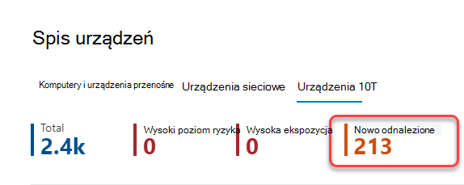
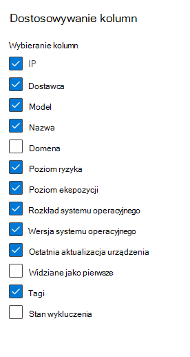
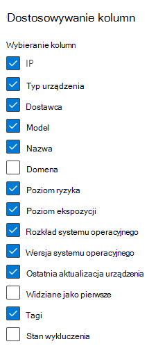

# Spisz urządzeń

[!INCLUDE [Microsoft 365 Defender rebranding](../../includes/microsoft-defender.md)]

**Dotyczy:**

- [Ochrona punktu końcowego w usłudze Microsoft Defender plan 1](https://go.microsoft.com/fwlink/p/?linkid=2154037)
- [Ochrona punktu końcowego w usłudze Microsoft Defender (plan 2)](https://go.microsoft.com/fwlink/p/?linkid=2154037) 
- [Microsoft 365 Defender](https://go.microsoft.com/fwlink/?linkid=2118804)

> Chcesz poznać usługę Defender for Endpoint? [Utwórz konto bezpłatnej wersji próbnej.](https://signup.microsoft.com/create-account/signup?products=7f379fee-c4f9-4278-b0a1-e4c8c2fcdf7e&ru=https://aka.ms/MDEp2OpenTrial?ocid=docs-wdatp-machinesview-abovefoldlink)

**Lista Urządzenia** zawiera listę urządzeń w sieci, dla których wygenerowano alerty. Domyślnie kolejka wyświetla urządzenia widoczne w ciągu ostatnich 30 dni.

W skrócie zobaczysz informacje, takie jak domena, poziom ryzyka, platforma systemu operacyjnego i inne szczegóły ułatwiające identyfikację urządzeń najbardziej zagrożonych.

Istnieje kilka opcji, które można wybrać, aby dostosować widok listy urządzeń. Na górnym pasku nawigacyjnym można:

- Dodawanie lub usuwanie kolumn
- Eksportowanie całej listy w formacie CSV
- Wybierz liczbę elementów do wyświetlenia na stronie
- Stosowanie filtrów

Podczas procesu dołączania **lista Urządzenia** jest stopniowo wypełniana urządzeniami, gdy zaczynają raportować dane czujnika. Ten widok służy do śledzenia dołączonych punktów końcowych w miarę ich przełączania w tryb online lub pobierania pełnej listy punktów końcowych jako pliku CSV do analizy w trybie offline.

> [!NOTE]
> Jeśli wyeksportujesz listę urządzeń, będzie ona zawierać każde urządzenie w organizacji. Pobieranie może zająć dużo czasu, w zależności od tego, jak duża jest twoja organizacja. Eksportowanie listy w formacie CSV powoduje wyświetlenie danych w sposób niefiltrowany. Plik CSV będzie zawierać wszystkie urządzenia w organizacji, niezależnie od filtrowania zastosowanego w samym widoku.

:::image type="content" source="images/device-inventory.png" alt-text="Lista urządzeń" lightbox="images/device-inventory.png":::

## Sortowanie i filtrowanie listy urządzeń

Możesz zastosować następujące filtry, aby ograniczyć listę alertów i uzyskać bardziej skoncentrowany widok.

### Nazwa urządzenia

Podczas procesu dołączania Ochrona punktu końcowego w usłudze Microsoft Defender urządzenia dołączone do rozwiązania MDE są stopniowo wypełniane do spisu urządzeń, gdy zaczynają raportować dane czujników. Następnie spis urządzeń jest wypełniany przez urządzenia odnalezione w sieci za pośrednictwem procesu odnajdywania urządzeń. Spis urządzeń ma trzy karty, które wyświetlają listę urządzeń według:

- **Komputery i urządzenia przenośne**: punkty końcowe Enterprise (stacje robocze, serwery i urządzenia przenośne)
- **Urządzenia sieciowe**: urządzenia takie jak routery i przełączniki
- **Urządzenia IoT**: urządzenia, takie jak drukarki i aparaty fotograficzne

## Przejdź do strony Spis urządzeń

Uzyskaj dostęp do strony spisu urządzeń, wybierając pozycję **Spis urządzeń** z menu nawigacji **Punkty końcowe** w [portalu Microsoft 365 Defender](/defender/microsoft-365-security-center-mde).

## Omówienie spisu urządzeń

Spis urządzeń zostanie otwarty na **karcie Komputery i urządzenia przenośne** . W skrócie zobaczysz informacje, takie jak nazwa urządzenia, domena, poziom ryzyka, poziom narażenia, platforma systemu operacyjnego, stan dołączania, stan kondycji czujnika i inne szczegóły ułatwiające identyfikację urządzeń najbardziej zagrożonych.

Użyj kolumny **Stan dołączania**, aby sortować i filtrować według odnalezionych urządzeń oraz tych, które zostały już dołączone do Ochrona punktu końcowego w usłudze Microsoft Defender.

Na **kartach Urządzenia sieciowe** i **Urządzenia IoT** zobaczysz również informacje, takie jak dostawca, model i typ urządzenia:

W górnej części każdej karty spisu urządzeń można zobaczyć całkowitą liczbę urządzeń, liczbę urządzeń, które nie zostały jeszcze dołączone, oraz liczbę urządzeń, które zostały zidentyfikowane jako większe zagrożenie dla organizacji. Te informacje ułatwiają określanie priorytetów urządzeń pod kątem ulepszeń stanu zabezpieczeń.

Liczba **nowo odnalezionych** urządzeń dla urządzeń sieciowych i urządzeń IoT zawiera liczbę odnalezionych nowych urządzeń w ciągu ostatnich 7 dni wymienionych w bieżącym widoku.

## Eksplorowanie spisu urządzeń

Istnieje kilka opcji dostosowywania widoku spisu urządzeń. Na górnym pasku nawigacyjnym dla każdej karty można:

- Wyszukiwanie urządzenia według nazwy
- Wyszukaj urządzenie według ostatnio używanego prefiksu adresu IP lub adresu IP
- Dodawanie lub usuwanie kolumn
- Eksportowanie całej listy w formacie CSV na potrzeby analizy offline
- Wybierz zakres dat do wyświetlenia
- Stosowanie filtrów

> [!NOTE]
> Jeśli wyeksportujesz listę urządzeń, będzie ona zawierać każde urządzenie w organizacji. Pobieranie może zająć dużo czasu, w zależności od tego, jak duża jest twoja organizacja. Eksportowanie listy w formacie CSV powoduje wyświetlenie danych w sposób niefiltrowany. Plik CSV będzie zawierać wszystkie urządzenia w organizacji, niezależnie od filtrowania zastosowanego w samym widoku.

Możesz użyć funkcji sortowania i filtrowania dostępnej na każdej karcie spisu urządzeń, aby uzyskać bardziej skoncentrowany widok oraz ułatwić ocenę urządzeń w organizacji i zarządzanie nimi.

Liczby na górze każdej karty zostaną zaktualizowane na podstawie bieżącego widoku.

## Dostosowywanie widoków spisu urządzeń przy użyciu filtrów

Filtr | Opis
:---|:---
**Poziom ryzyka**   | Poziom ryzyka odzwierciedla ogólną ocenę ryzyka urządzenia na podstawie kombinacji czynników, w tym typów i ważności aktywnych alertów na urządzeniu. Rozwiązywanie aktywnych alertów, zatwierdzanie działań korygowania i pomijanie kolejnych alertów może obniżyć poziom ryzyka.
**Poziom ekspozycji**   | Poziom narażenia odzwierciedla bieżące narażenie urządzenia na podstawie skumulowanego wpływu oczekujących zaleceń dotyczących zabezpieczeń. Możliwe poziomy są niskie, średnie i wysokie. Niska ekspozycja oznacza, że urządzenia są mniej narażone na eksploatację.     Jeśli poziom ekspozycji mówi "Brak dostępnych danych", istnieje kilka powodów, dla których może tak być: — Urządzenie przestało raportować przez ponad 30 dni. W takim przypadku jest ona uznawana za nieaktywną, a ekspozycja nie jest obliczana. — System operacyjny urządzenia nie jest obsługiwany — zobacz [minimalne wymagania dotyczące Ochrona punktu końcowego w usłudze Microsoft Defender](/microsoft-365/security/defender-endpoint/minimum-requirements). — Urządzenie z nieaktuanym agentem (mało prawdopodobne).
**Tagi**   | Przefiltruj listę na podstawie grupowania i tagowania, które zostały dodane do poszczególnych urządzeń. Zobacz [Tworzenie tagów urządzeń i zarządzanie nimi](machine-tags.md).
**Wartość urządzenia**  | Przefiltruj listę na podstawie tego, czy urządzenie zostało oznaczone jako wartość wysoka, czy niska.
**Stan wykluczenia**   | Przefiltruj listę na podstawie tego, czy urządzenie zostało wykluczone, czy nie. Aby uzyskać więcej informacji, zobacz [Wykluczanie urządzeń](exclude-devices.md).
**Platforma systemu operacyjnego**  | Filtrowanie według platform systemu operacyjnego, które chcesz zbadać   (_Tylko komputery i urządzenia przenośne i IoT_)
**Pierwszy raz widziany**   | Filtruj widok na podstawie tego, kiedy urządzenie było po raz pierwszy widoczne w sieci lub kiedy po raz pierwszy zostało zgłoszone przez czujnik Ochrona punktu końcowego w usłudze Microsoft Defender.  (_Tylko komputery i urządzenia przenośne i IoT_)
**Wersje systemu Windows**   | Filtruj według Windows wersji, które chcesz zbadać.   (_Tylko komputery i urządzenia przenośne_)
**Stan kondycji czujnika**   | Filtruj według następujących stanów kondycji czujnika, aby urządzenia dołączone do Ochrona punktu końcowego w usłudze Microsoft Defender:  - **Aktywne**: urządzenia, które aktywnie zgłaszają dane czujników do usługi.  - **Nieaktywne**: urządzenia, które przestały wysyłać sygnały przez ponad 7 dni.   - **Nieprawidłowa konfiguracja**: urządzenia, które mają ograniczoną komunikację z usługą lub nie mogą wysyłać danych czujnika.   Błędnie skonfigurowane urządzenia można dalej klasyfikować do:    — Brak danych czujnika    - Komunikacja z upośledzoną łącznością    Aby uzyskać więcej informacji na temat rozwiązywania problemów dotyczących nieprawidłowo skonfigurowanych urządzeń, zobacz [Rozwiązywanie problemów z czujnikami w złej kondycji](/microsoft-365/security/defender-endpoint/fix-unhealthy-sensors).   (_Tylko komputery i urządzenia przenośne_)
**Stan dołączania**   | Stan dołączania wskazuje, czy urządzenie jest obecnie dołączone do Ochrona punktu końcowego w usłudze Microsoft Defender czy nie. Możesz filtrować według następujących stanów:   - **Dołączone**: punkt końcowy jest dołączany do Ochrona punktu końcowego w usłudze Microsoft Defender.    - **Można dołączyć**: punkt końcowy został odnaleziony w sieci jako obsługiwane urządzenie, ale nie jest obecnie dołączony. Firma Microsoft zdecydowanie zaleca dołączanie tych urządzeń.   - **Nieobsługiwane**: punkt końcowy został odnaleziony w sieci, ale nie jest obsługiwany przez Ochrona punktu końcowego w usłudze Microsoft Defender.   - **Niewystarczające informacje**: system nie może określić możliwości obsługi urządzenia.   (_Tylko komputery i urządzenia przenośne_)
**Stan programu antywirusowego**   | Filtruj widok na podstawie tego, czy stan programu antywirusowego jest wyłączony, a nie zaktualizowany, czy nieznany.   (_Tylko komputery i urządzenia przenośne_)
**Grupa**   | Przefiltruj listę na podstawie grupy, którą chcesz zbadać.    (_Tylko komputery i urządzenia przenośne_)
**Zarządzane przez**   | Zarządzane przez wskazuje sposób zarządzania urządzeniem. Możesz filtrować według: - Ochrona punktu końcowego w usłudze Microsoft Defender   — Zarządzanie urządzeniami przenośnymi (MDM)  - Nieznane: może to być spowodowane uruchomieniem nieaktualizowanej wersji Windows, obecnościĄ programu SCCM lub zarządzaniem urządzeniami przenośnymi innej firmy.   (_Tylko komputery i urządzenia przenośne_)
**Typ urządzenia**   | Filtruj według typu urządzenia, który chcesz zbadać.   (_Tylko urządzenia IoT_)

## Dostosowywanie widoków spisu urządzeń przy użyciu kolumn

Możesz dodać lub usunąć kolumny z widoku i posortować wpisy, klikając dostępny nagłówek kolumny.

Na karcie **Komputer i urządzenia przenośne** wybierz pozycję **Dostosuj kolumny** , aby wyświetlić dostępne kolumny. Wartości domyślne są zaewidencjonowane na poniższej ilustracji:

Na karcie **Urządzenia sieciowe** wybierz pozycję **Dostosuj kolumny** , aby wyświetlić dostępne kolumny. Wartości domyślne są zaewidencjonowane na poniższej ilustracji:

Na karcie **Urządzenia IoT** wybierz pozycję **Dostosuj kolumny** , aby wyświetlić dostępne kolumny. Wartości domyślne są zaewidencjonowane na poniższej ilustracji:

## Artykuły pokrewne

[Badanie urządzeń na liście urządzeń Ochrona punktu końcowego w usłudze Microsoft Defender](investigate-machines.md)
