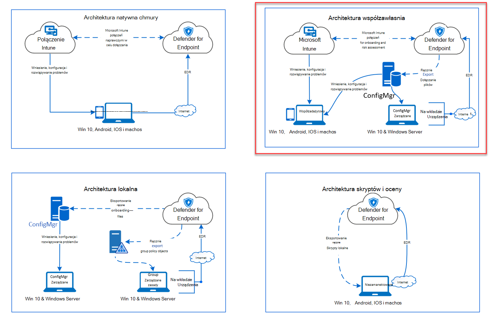
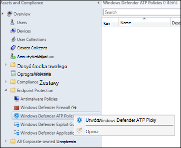
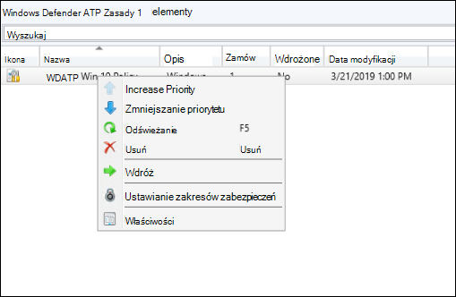
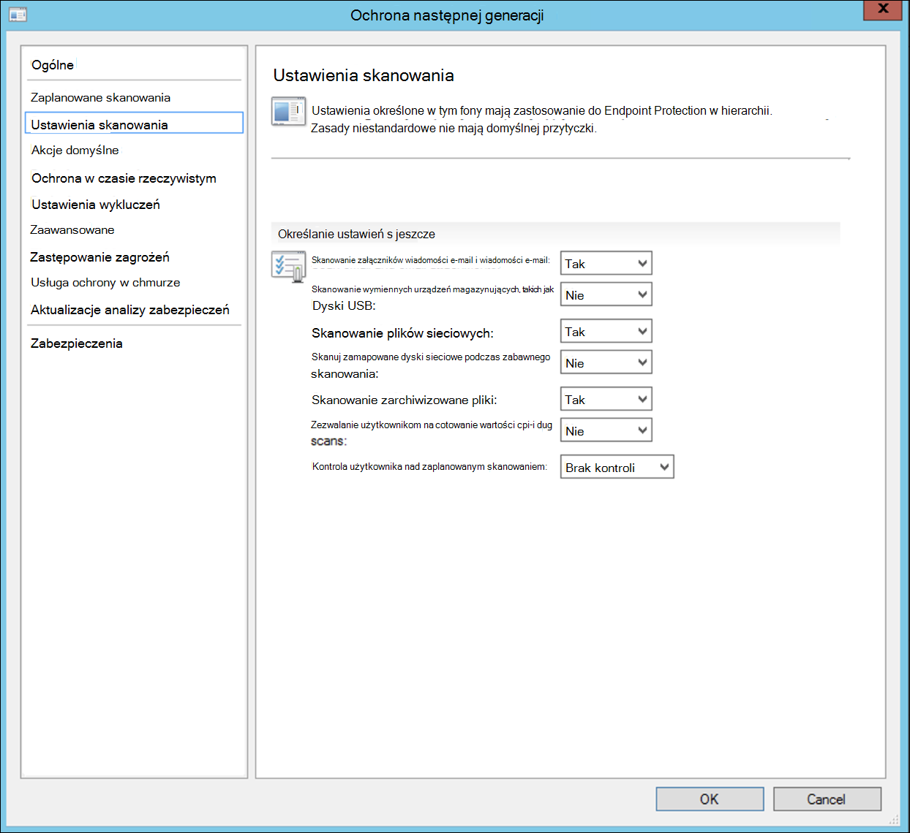
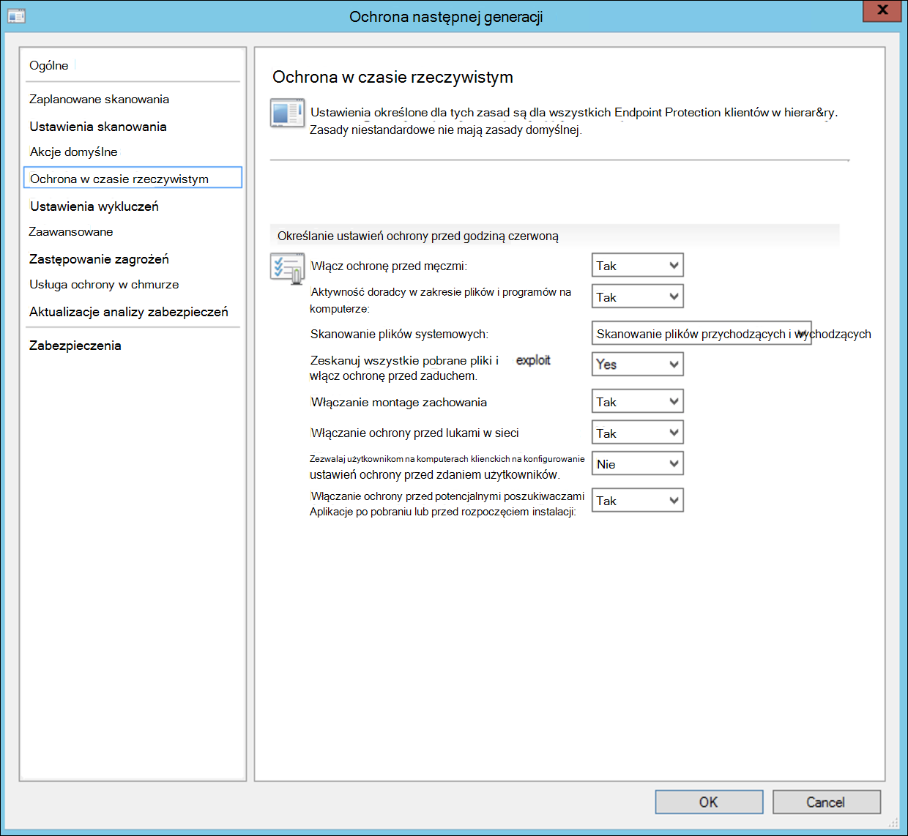
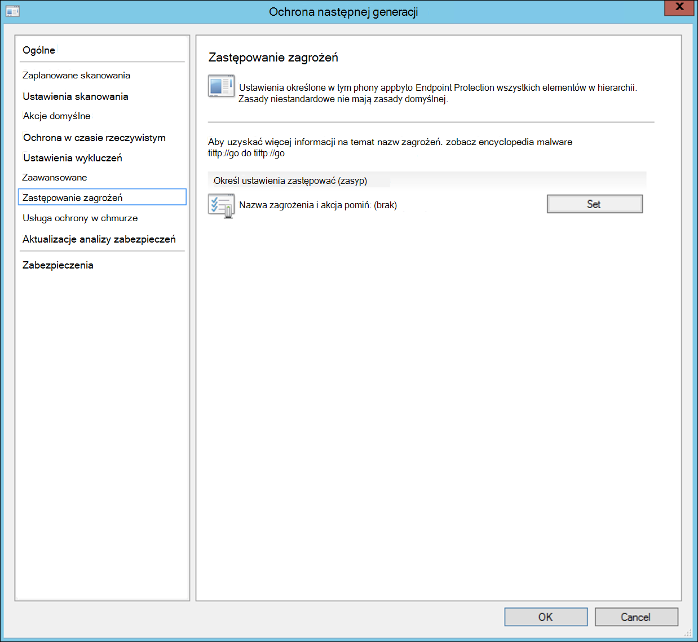
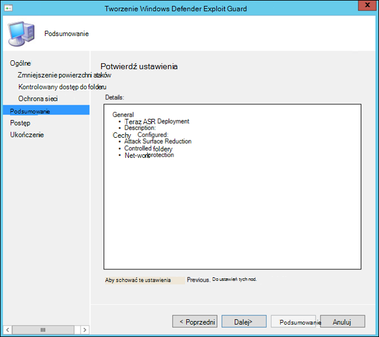
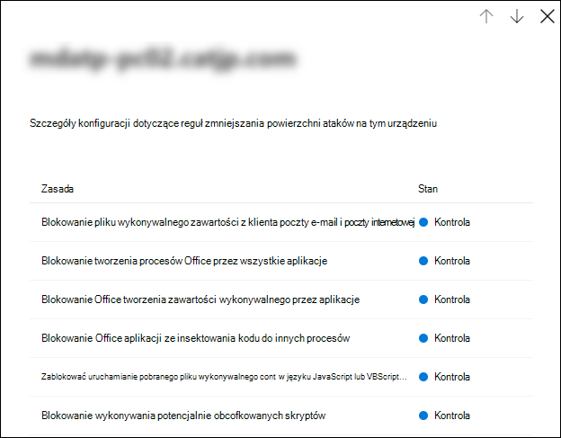

# Dołączanie przy użyciu Microsoft Endpoint Configuration Manager

[!INCLUDE [Microsoft 365 Defender rebranding](../../includes/microsoft-defender.md)]

**Dotyczy:**
- [Microsoft Defender for Endpoint Plan 2](https://go.microsoft.com/fwlink/p/?linkid=2154037)
- [Microsoft 365 Defender](https://go.microsoft.com/fwlink/?linkid=2118804)

> Chcesz mieć dostęp do programu Microsoft Defender dla punktu końcowego? [Zarejestruj się, aby korzystać z bezpłatnej wersji próbnej.](https://signup.microsoft.com/create-account/signup?products=7f379fee-c4f9-4278-b0a1-e4c8c2fcdf7e&ru=https://aka.ms/MDEp2OpenTrial?ocid=docs-wdatp-exposedapis-abovefoldlink)

Ten artykuł jest częścią przewodnika wdrażania i pełni rolę przykładowej metody wdrażania.

W [temacie](deployment-strategy.md) Planowanie zapewniono kilka metod dołączania urządzeń do usługi. W tym temacie omymy architekturę współzawłasniania.

 *Diagram architektury środowiska*

Chociaż program Defender for Endpoint obsługuje dołączanie różnych punktów końcowych i narzędzi, ten artykuł nie obejmuje ich. Aby uzyskać informacje na temat ogólnego wdrażania przy użyciu innych obsługiwanych narzędzi i metod wdrażania, zobacz [Omówienie wdrażania](onboarding.md).

W tym temacie podano dla użytkowników:

- Krok 1. Dołączanie Windows do usługi
- Krok 2. Konfigurowanie funkcji programu Defender dla punktu końcowego

W ramach tych wskazówek dotyczących dołączania należy wykonać następujące podstawowe czynności, które należy wykonać podczas korzystania z Microsoft Endpoint Configuration Manager:

- **Tworzenie kolekcji w aplikacji Microsoft Endpoint Configuration Manager**
- **Konfigurowanie funkcji programu Microsoft Defender dla punktu końcowego przy użyciu Microsoft Endpoint Configuration Manager**

> [!NOTE]
> W Windows przykładowe uwzględnione są tylko Windows urządzenia.

## Krok 1. Na urządzeniach Windows przy użyciu Microsoft Endpoint Configuration Manager

### Tworzenie kolekcji

Aby na Windows urządzeniach Microsoft Endpoint Configuration Manager, wdrożenie może być kierowane do istniejącej kolekcji lub można utworzyć nową kolekcję w celu testowania.

Dołączanie przy użyciu narzędzi, takich jak zasady grupy lub metoda ręczna, nie powoduje zainstalowania żadnego agenta w systemie.

W konsoli Microsoft Endpoint Configuration Manager proces dołączania zostanie skonfigurowany jako część ustawień zgodności w konsoli.

Każdy system, który otrzyma tę wymaganą konfigurację, będzie zachowywał tę konfigurację tak długo, Menedżer konfiguracji będzie nadal otrzymywać te zasady od punktu zarządzania.

Wykonaj poniższe czynności, aby przy użyciu aplikacji Microsoft Endpoint Configuration Manager.

1. W Microsoft Endpoint Configuration Manager przejdź do kolekcji urządzeń z omówieniem **funkcji Zasoby i zgodność \> \>**.

    

2. Kliknij prawym **przyciskiem myszy pozycję Kolekcja urządzeń i** **wybierz polecenie Utwórz kolekcję urządzeń**.

    

3. Podaj nazwę **i** **ogranicz kolekcję**, a następnie wybierz pozycję **Dalej**.

    

4. Wybierz **pozycję Dodaj regułę** i wybierz **pozycję Reguła kwerendy**.

    

5. Kliknij **przycisk Dalej** w **Kreatorze członkostwa bezpośredniego** i kliknij pozycję **Edytuj zestawienie zapytania**.

     

6. Wybierz **pozycję Kryteria** , a następnie wybierz ikonę gwiazdki.

     

7. Zachowaj typ kryterium **jako wartość** prostą, wybierz, gdzie jako **System operacyjny —** numer kompilacji, operator jako większy lub równy oraz wartość **14393** i kliknij przycisk **OK**.

    

8. Wybierz **pozycję Dalej** i **Zamknij**.

    

9. Wybierz pozycję **Dalej**.

    

Po wykonaniu tego zadania masz teraz kolekcję urządzeń ze wszystkimi Windows końcowymi w środowisku.

## Krok 2. Konfigurowanie programu Microsoft Defender pod nr możliwości punktu końcowego

Ta sekcja przeprowadzi Cię przez konfigurowanie następujących funkcji przy użyciu funkcji Microsoft Endpoint Configuration Manager na Windows urządzeniach:

- [**Wykrywanie punktu końcowego i odpowiedź**](#endpoint-detection-and-response)
- [**Ochrona następnej generacji**](#next-generation-protection)
- [**Zmniejszenie powierzchni ataków**](#attack-surface-reduction)

### Wykrywanie punktu końcowego i odpowiedź

#### Windows 10 i Windows 11

Z poziomu portalu Microsoft 365 Defender `.onboarding` można pobrać zasady, za pomocą których można tworzyć zasady w aplikacji System Center Configuration Manager i wdrażać je na urządzeniach z systemem Windows 10 i Windows 11 urządzeniach.

1. W portalu <a href="https://go.microsoft.com/fwlink/p/?linkid=2077139" target="_blank">Microsoft 365 Defender wybierz</a> pozycję Ustawienia [a następnie pozycję Dołączanie](https://security.microsoft.com/preferences2/onboarding).

2. W obszarze Metoda wdrażania wybierz obsługiwaną wersję pakietu **Microsoft Endpoint Configuration Manager**.

    

3. Wybierz **pozycję Pobierz pakiet**.

    

4. Zapisz pakiet w lokalizacji z ułatwieniami dostępu.
5. W Microsoft Endpoint Configuration Manager: Zasoby **i zgodność z zasadami > i > Endpoint Protection > Microsoft Defender ATP**.

6. Kliknij prawym przyciskiem myszy **pozycję Zasady Microsoft Defender ATP i** wybierz **polecenie Utwórz zasady Microsoft Defender ATP**.

    

7. Wprowadź nazwę i opis, sprawdź, czy **wybrano opcję** Dołączanie, a następnie wybierz pozycję **Dalej**.

    

8. Kliknij **przycisk Przeglądaj**.

9. Przejdź do lokalizacji pobranego pliku z kroku 4 powyżej.

10. Kliknij **Dalej**.
11. Skonfiguruj agenta z odpowiednimi przykładami (**brak** lub **wszystkie typy plików**).

    

12. Wybierz odpowiednią telemetrię (**Normalna lub Przyspieszona**), a następnie kliknij przycisk **Dalej**.

    

13. Sprawdź konfigurację, a następnie kliknij przycisk **Dalej**.

     

14. Po **zakończeniu** pracy Kreatora kliknij przycisk Zamknij.

15. W konsoli Microsoft Endpoint Configuration Manager kliknij prawym przyciskiem myszy właśnie utworzone zasady usługi Defender for Endpoint i wybierz pozycję **Wdeksuj**.

     

16. Na prawym panelu wybierz wcześniej utworzoną kolekcję i kliknij przycisk **OK**.

    

#### Poprzednie wersje programu Windows Client (Windows 7 i Windows 8.1)

Wykonaj poniższe czynności, aby zidentyfikować identyfikator programu Defender for Endpoint Workspace i klucz obszaru roboczego, które będą wymagane przy dołączaniu poprzednich wersji programu Windows.

1. W portalu <a href="https://go.microsoft.com/fwlink/p/?linkid=2077139" target="_blank">Microsoft 365 Defender wybierz</a> pozycję **Dołączanie Ustawienia** \> **punktów** \> **końcowych (w** **obszarze Zarządzanie urządzeniami**).

2. W obszarze System operacyjny **wybierz Windows 7 z dodatkiem SP1 i 8.1**.

3. Skopiuj identyfikator **obszaru roboczego i** klawisz **obszaru roboczego,** a następnie zapisz je. Będą one używane w dalszej części tego procesu.

    

4. Zainstaluj Microsoft Monitoring Agent mma.

   Program MMA jest obecnie obsługiwany (od stycznia 2019 r.) w następujących Windows operacyjnych:

   - Jednostki SKU serwera: Windows Server 2008 z dodatkiem SP1 lub Nowsze
   - Jednostki SKU klientów: Windows 7 z dodatkiem SP1 i nowszymi

   Agent MMA musi zostać zainstalowany na Windows urządzeniach. Aby zainstalować agenta, niektóre systemy muszą pobrać aktualizację do obsługi  klienta i telemetrii diagnostycznej w celu zbierania danych za pomocą funkcji MMA. Te wersje systemowe obejmują między innymi:

   - Windows 8.1
   - Windows 7
   - System Windows Server 2016
   - Windows Server 2012 R2
   - Windows Server 2008 R2

   W szczególności w Windows 7 z dodatkiem SP1 należy zainstalować następujące poprawki:

   - Instalowanie [aktualizacji KB4074598](https://support.microsoft.com/help/4074598/windows-7-update-kb4074598)
   - Zainstaluj .NET Framework [4.5](https://www.microsoft.com/download/details.aspx?id=30653) (lub nowszy) **lub** [KB3154518](https://support.microsoft.com/help/3154518/support-for-tls-system-default-versions-included-in-the-net-framework). Nie instaluj obu w tym samym systemie.

5. Jeśli łączysz się z Internetem za pomocą serwera proxy, zobacz sekcję Konfigurowanie ustawień serwera proxy.

Po ukończeniu w ciągu godziny w portalu powinny zostać zobaczyć punktu końcowe wnosone.

### Ochrona następnej generacji

Program antywirusowy Microsoft Defender to wbudowane rozwiązanie ochrony przed złośliwym oprogramowaniem, które zapewnia ochronę komputerów stacjonarnych, przenośnych i serwerów następnej generacji.

1. W konsoli Microsoft Endpoint Configuration Manager **\> \> przejdź do tematu Omówienie zabezpieczeń i zgodności Endpoint Protection \>** zasady ochrony przed złośliwym oprogramowaniem i wybierz pozycję Utwórz zasady ochrony przed **złośliwym oprogramowaniem**.

    

2. Wybierz **pozycję Zaplanowane skanowania****, Ustawienia** **skanowania, Akcje** **domyślne, Ochrona** w czasie **rzeczywistym, Ustawienia** wykluczeń **, Zaawansowane****,** Zastępowanie **zagrożeń, Aktualizacje** analizy zabezpieczeń i usługi ochrony w chmurze, **a następnie wybierz** przycisk **OK**.

    

    W niektórych branżach lub niektórych wybranych klientach przedsiębiorstw może być konieczne skonfigurowanie oprogramowania antywirusowego.

    [Szybkie skanowanie a skanowanie pełne i skanowanie niestandardowe](/windows/security/threat-protection/microsoft-defender-antivirus/scheduled-catch-up-scans-microsoft-defender-antivirus#quick-scan-versus-full-scan-and-custom-scan)

    Aby uzyskać więcej szczegółowych informacji, [Zabezpieczenia Windows konfiguracyjne](/windows/security/threat-protection/windows-security-configuration-framework/windows-security-configuration-framework).
  
    

    

    

    

    

    

    

    

3. Kliknij prawym przyciskiem myszy nowo utworzone zasady ochrony przed złośliwym oprogramowaniem i wybierz pozycję **Wdeksuj**.

    

4. Ustaw nowe zasady ochrony przed złośliwym oprogramowaniem na swojej kolekcji Windows i kliknij przycisk **OK**.

     

Po wykonaniu tego zadania pomyślnie skonfigurowano Program antywirusowy Windows Defender.

### Zmniejszenie powierzchni ataków

Słupek zmniejszania powierzchni ataków usługi Defender for Endpoint zawiera zestaw funkcji dostępny w obszarze Exploit Guard. Reguły zmniejszania powierzchni ataków (ASR, Controlled Folder Access, Network Protection i Exploit Protection).

Wszystkie te funkcje zapewniają tryb inspekcji i tryb blokowania. W trybie inspekcji nie ma wpływu na użytkownika końcowego. Zbierane są jedynie dodatkowe dane telemetryczne, które są udostępniane w portalu Microsoft 365 Defender danych. Wdrożenie ma na celu przeniesienie kontroli zabezpieczeń krok po kroku w tryb blokowy.

Aby ustawić reguły asr w trybie inspekcji:

1. W konsoli Microsoft Endpoint Configuration Manager przejdź **\> \> \>** do tematu Omówienie zasobów i zgodności Endpoint Protection Windows Defender Exploit Guard i wybierz pozycję Utwórz zasady Exploit Guard.

   

2. Wybierz **pozycję Zmniejszenie powierzchni ataków**.

3. Ustaw reguły na wartość **Inspekcja i** kliknij przycisk **Dalej**.

    

4. Potwierdź nowe zasady exploit Guard, klikając przycisk **Dalej**.

    

5. Po utworzeniu zasad kliknij przycisk **Zamknij**.

    

6. Kliknij prawym przyciskiem myszy nowo utworzone zasady i wybierz pozycję **Wdeksuj**.

    

7. Nakieruj zasady na nowo Windows kolekcję i kliknij przycisk **OK**.

    

Po wykonaniu tego zadania pomyślnie skonfigurowano reguły asr w trybie inspekcji.

Poniżej przedstawiono dodatkowe kroki w celu sprawdzenia, czy reguły asr są poprawnie stosowane do punktów końcowych. (Może to potrwać kilka minut)

1. Z przeglądarki internetowej <a href="https://go.microsoft.com/fwlink/p/?linkid=2077139" target="_blank">przejdź do Microsoft 365 Defender</a>.

2. Wybierz **pozycję Zarządzanie konfiguracją** z menu po lewej stronie.

3. Kliknij **pozycję Przejdź, aby przejść do zarządzania powierzchnią ataków** w panelu Zarządzanie powierzchnią ataków.

    

4. Kliknij **kartę Konfiguracja** w raportach reguł zmniejszania powierzchni ataków. Na poszczególnych urządzeniach jest dostępny przegląd konfiguracji reguł asr i stan reguł asr.

    

5. Kliknij każde urządzenie, aby wyświetlać szczegóły konfiguracji reguł asr.

    

Aby [uzyskać więcej szczegółowych informacji](/microsoft-365/security/defender-endpoint/configure-machines-asr) , zobacz Optymalizowanie wdrażania reguł ASR i wykrywanie.

#### Ustawianie reguł ochrony sieci w trybie inspekcji

1. W konsoli Microsoft Endpoint Configuration Manager przejdź **\> \> \>** do tematu Omówienie zasobów i zgodności Endpoint Protection Windows Defender Exploit Guard i wybierz pozycję Utwórz zasady Exploit Guard.

    

2. Wybierz **pozycję Ochrona sieci**.

3. Ustaw ustawienie Inspekcja **i** kliknij przycisk **Dalej**.

    

4. Potwierdź nowe zasady Exploit Guard, klikając przycisk **Dalej**.

    

5. Po utworzeniu zasad kliknij przycisk **Zamknij**.

    

6. Kliknij prawym przyciskiem myszy nowo utworzone zasady i wybierz pozycję **Wdeksuj**.

    

7. Wybierz zasady dla nowo utworzonej kolekcji Windows i wybierz przycisk **OK**.

    

Po wykonaniu tego zadania pomyślnie skonfigurowano ochronę sieci w trybie inspekcji.

#### Aby ustawić reguły kontrolowanego dostępu do folderu w trybie inspekcji

1. W konsoli Microsoft Endpoint Configuration Manager przejdź do strony **Majątek i** **ComplianceOverview** >  >  **Endpoint Protection** >  **Windows Defender Exploit Guard**, a następnie wybierz pozycję **Utwórz zasady Exploit Guard**.

    

2. Wybierz **pozycję Kontrolowany dostęp do folderu**.

3. Ustaw konfigurację na **Inspekcja i** kliknij przycisk **Dalej**.

    

4. Potwierdź nowe zasady Exploit Guard, klikając przycisk **Dalej**.

    

5. Po utworzeniu zasad kliknij przycisk **Zamknij**.

    

6. Kliknij prawym przyciskiem myszy nowo utworzone zasady i wybierz pozycję **Wdeksuj**.

    

7. Nakieruj zasady na nowo Windows kolekcję i kliknij przycisk **OK**.

    

Pomyślnie skonfigurowano kontrolowany dostęp do folderu w trybie inspekcji.

## Temat pokrewny

- [Dołączanie przy użyciu Microsoft Endpoint Manager](onboarding-endpoint-manager.md)
