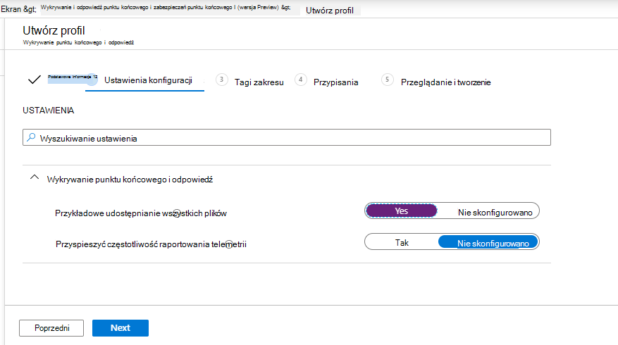
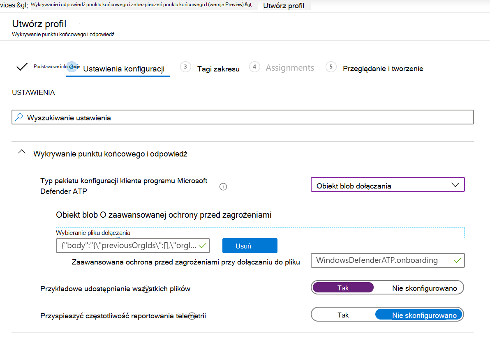
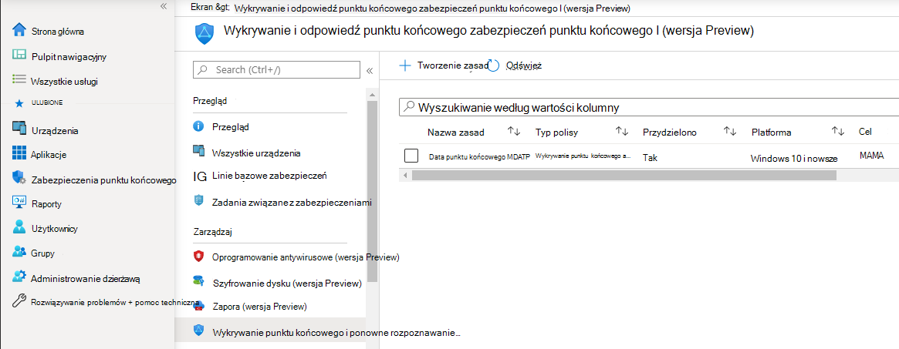
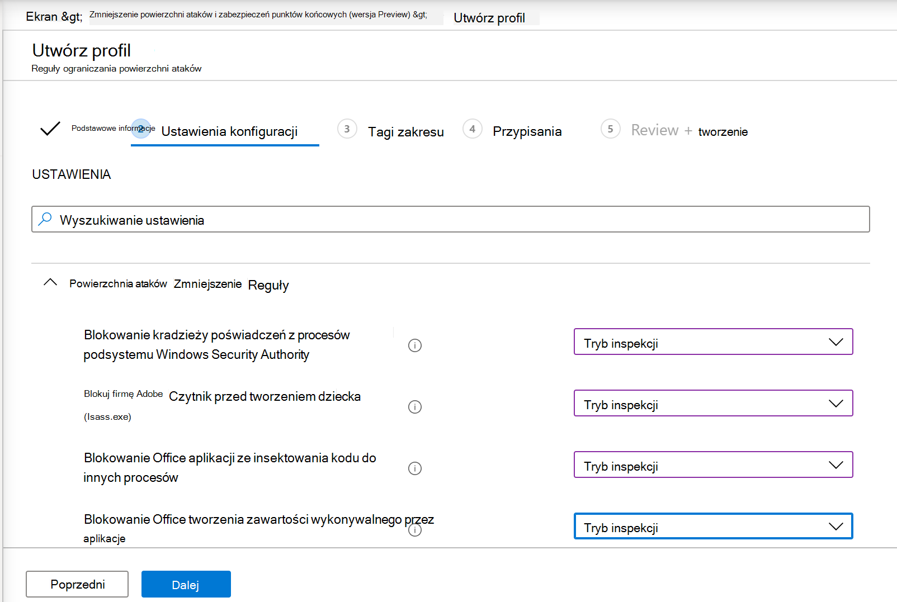
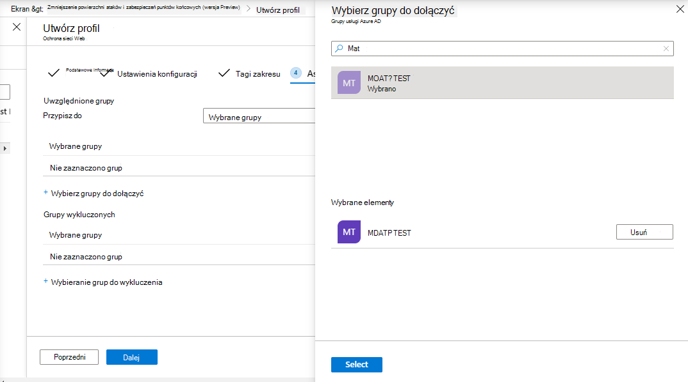
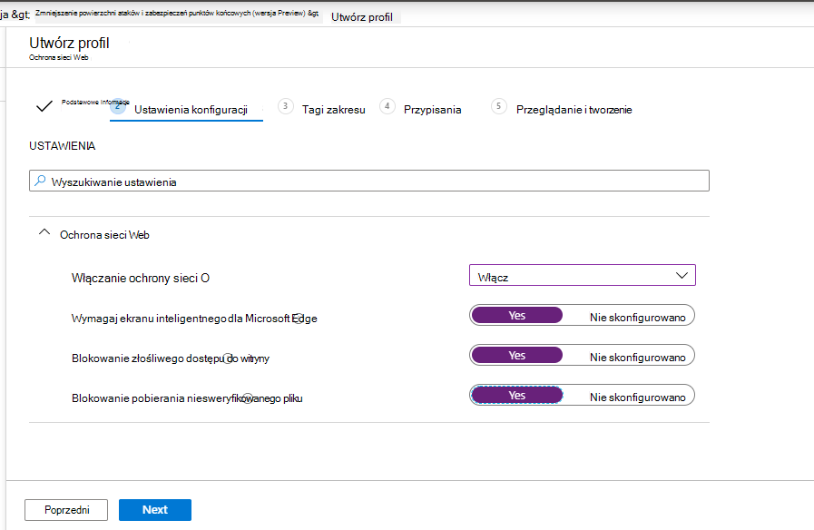
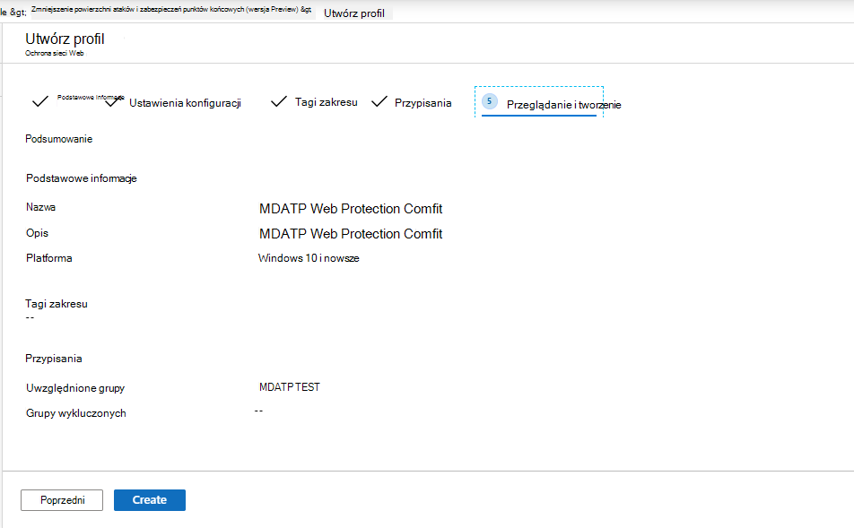

# Dołączanie przy użyciu Microsoft Endpoint Manager

[!INCLUDE [Microsoft 365 Defender rebranding](../../includes/microsoft-defender.md)]

**Dotyczy:**

- [Microsoft Defender for Endpoint Plan 2](https://go.microsoft.com/fwlink/p/?linkid=2154037)
- [Microsoft 365 Defender](https://go.microsoft.com/fwlink/?linkid=2118804)

> Chcesz mieć dostęp do programu Microsoft Defender dla punktu końcowego? [Zarejestruj się, aby korzystać z bezpłatnej wersji próbnej.](https://signup.microsoft.com/create-account/signup?products=7f379fee-c4f9-4278-b0a1-e4c8c2fcdf7e&ru=https://aka.ms/MDEp2OpenTrial?ocid=docs-wdatp-exposedapis-abovefoldlink)

Ten artykuł jest częścią przewodnika wdrażania i pełni rolę przykładowej metody wdrażania.

W [temacie](deployment-strategy.md) Planowanie zapewniono kilka metod dołączania urządzeń do usługi. W tym temacie o zagadnieniach o architekturze natywnej chmury.

 *Diagram architektury środowiska*

Chociaż program Defender for Endpoint obsługuje dołączanie różnych punktów końcowych i narzędzi, ten artykuł nie obejmuje ich. Aby uzyskać informacje na temat ogólnego wdrażania przy użyciu innych obsługiwanych narzędzi i metod wdrażania, zobacz [Omówienie wdrażania](onboarding.md).

[Microsoft Endpoint Manager](/mem/endpoint-manager-overview) rozwiązaniami, które ujednolicono kilka usług. Obejmuje on [Microsoft Intune](/mem/intune/fundamentals/what-is-intune) oparte na urządzeniach.

W tym temacie podano dla użytkowników:

- Krok 1. Dołączanie urządzeń do usługi przez utworzenie grupy w programie Microsoft Endpoint Manager (MEM) do przypisywania konfiguracji w
- Krok 2. Konfigurowanie funkcji programu Defender for Endpoint przy użyciu programu Microsoft Endpoint Manager

W ramach tych wskazówek dotyczących dołączania należy wykonać następujące podstawowe czynności, które należy wykonać podczas korzystania z Microsoft Endpoint Manager:

- [Identyfikowanie urządzeń docelowych lub użytkowników](#identify-target-devices-or-users)
  - Tworzenie grupy Azure Active Directory użytkownika (użytkownika lub urządzenia)
- [Tworzenie profilu konfiguracji](#step-2-create-configuration-policies-to-configure-microsoft-defender-for-endpoint-capabilities)
  - W Microsoft Endpoint Manager tworzymy osobne zasady dla poszczególnych funkcji.

## Zasoby

Oto linki potrzebne do pozostałych części procesu:

- [Portal MEM](https://aka.ms/memac)
- [Microsoft 365 Defender](https://security.microsoft.com)
- [Ustawienia bazowe zabezpieczeń usługi Intune](/mem/intune/protect/security-baseline-settings-defender-atp#microsoft-defender)

Aby uzyskać więcej informacji na Microsoft Endpoint Manager, zapoznaj się z tymi zasobami:

- [Microsoft Endpoint Manager stronie](/mem/)
- [Wpis w blogu poświęcony usłudze Intune i ConfigMgr](https://www.microsoft.com/microsoft-365/blog/2019/11/04/use-the-power-of-cloud-intelligence-to-simplify-and-accelerate-it-and-the-move-to-a-modern-workplace/)
- [Klip wideo wprowadzający na temat MEM](https://www.microsoft.com/microsoft-365/blog/2019/11/04/use-the-power-of-cloud-intelligence-to-simplify-and-accelerate-it-and-the-move-to-a-modern-workplace)

## Krok 1. Na urządzeniach przez utworzenie grupy w programie MEM w celu przypisania konfiguracji do

### Identyfikowanie urządzeń docelowych lub użytkowników

W tej sekcji utworzymy grupę testową, w przypadku których będą przypisywane Konfiguracje.

> [!NOTE]
> W usłudze Intune Azure Active Directory (Azure AD) do zarządzania urządzeniami i użytkownikami. Jako administrator usługi Intune możesz skonfigurować grupy odpowiednio do potrzeb organizacji.
>
> Aby uzyskać więcej informacji, zobacz [Dodawanie grup w celu organizowania użytkowników i urządzeń](/mem/intune/fundamentals/groups-add).

### Tworzenie grupy

1. Otwórz portal MEM.

2. Otwórz **okno Grupy > nowa grupa**.

    > [!div class="mx-imgBorder"]
    > 

3. Wprowadź szczegóły i utwórz nową grupę.

    > [!div class="mx-imgBorder"]
    > 

4. Dodaj użytkownika lub urządzenie testowe.

5. W **okienku > Grupy** otwórz nową grupę.

6. Wybierz  **pozycję Członkowie > Dodaj członków**.

7. Znajdź użytkownika lub urządzenie testowe i wybierz je.

    > [!div class="mx-imgBorder"]
    > 

8. Grupa testów ma teraz członka do przetestowania.

## Krok 2. Tworzenie zasad konfiguracji w celu skonfigurowania programu Microsoft Defender pod zakresie możliwości punktu końcowego

W poniższej sekcji utworzysz szereg zasad konfiguracji.

Po pierwsze, zasady konfiguracji dotyczące wybierania grup użytkowników lub urządzeń, które zostaną włoowane do usługi Defender for Endpoint:

- [Wykrywanie punktu końcowego i odpowiedź](#endpoint-detection-and-response)

Następnie należy kontynuować tworzenie kilku różnych typów zasad zabezpieczeń punktów końcowych:

- [Ochrona następnej generacji](#next-generation-protection)
- [Zmniejszenie powierzchni ataków](#attack-surface-reduction---attack-surface-reduction-rules)

### Wykrywanie punktu końcowego i odpowiedź

1. Otwórz portal MEM.

2. Przejdź do **punktu końcowego wykrywania > odpowiedzi i wykrywania punktu końcowego**. Kliknij pozycję **Utwórz profil**.

    > [!div class="mx-imgBorder"]
    > 

3. W **obszarze Platforma wybierz pozycję Windows 10 i nowszą pozycję Profil — wykrywanie punktu** końcowego i > Utwórz.

4. Wprowadź nazwę i opis, a następnie wybierz pozycję  **Dalej**.

    > [!div class="mx-imgBorder"]
    > 

5. Wybierz ustawienia zgodnie z wymaganiami, a następnie wybierz pozycję  **Dalej**.

    > [!div class="mx-imgBorder"]
    > 

    > [!NOTE]
    > W tym przypadku zostało to automatycznie wypełnione, ponieważ usługa Defender for Endpoint została już zintegrowana z usługą Intune. Aby uzyskać więcej informacji na temat integracji, zobacz [Włączanie programu Microsoft Defender dla punktu końcowego w usłudze Intune](/mem/intune/protect/advanced-threat-protection-configure#to-enable-microsoft-defender-atp).
    >
    > Na poniższej ilustracji przedstawiono przykład tego, co się dzieje, gdy program Microsoft Defender for Endpoint nie jest zintegrowany z usługą Intune:
    >
    > 

6. W razie potrzeby dodaj tagi zakresu, a następnie wybierz pozycję  **Dalej**.

    > [!div class="mx-imgBorder"]
    > 

7. Dodaj grupę testową, klikając pozycję **Wybierz grupy do dołączyć** i wybrać grupę, a następnie wybierz pozycję  **Dalej**.

    > [!div class="mx-imgBorder"]
    > 

8. Przejrzyj i zaakceptuj, a następnie wybierz  **pozycję Utwórz**.

    > [!div class="mx-imgBorder"]
    > 

9. Ukończone zasady możesz wyświetlić.

    > [!div class="mx-imgBorder"]
    > 

### Ochrona następnej generacji

1. Otwórz portal MEM.

2. Przejdź do **punktu końcowego > oprogramowania antywirusowego > Utwórz zasady**.

    > [!div class="mx-imgBorder"]
    > 

3. Wybierz **platformę — Windows 10 lub nowszą — Windows i profil — Program antywirusowy Microsoft Defender > Utwórz**.

4. Wprowadź nazwę i opis, a następnie wybierz pozycję  **Dalej**.

    > [!div class="mx-imgBorder"]
    > 

5. Na stronie **Ustawienia konfiguracji**: Ustaw konfiguracje wymagane dla usługi Program antywirusowy Microsoft Defender (Ochrona chmury, Wykluczenia, Ochrona Real-Time i Działania naprawcze).

    > [!div class="mx-imgBorder"]
    > 

6. W razie potrzeby dodaj tagi zakresu, a następnie wybierz pozycję  **Dalej**.

    > [!div class="mx-imgBorder"]
    > 

7. Wybierz grupy do dołączyć, przypisz je do grupy testowej, a następnie wybierz pozycję  **Dalej**.

    > [!div class="mx-imgBorder"]
    > 

8. Przejrzyj i utwórz, a następnie wybierz  **pozycję Utwórz**.

    > [!div class="mx-imgBorder"]
    > 

9. Zobaczysz utworzone zasady konfiguracji.

    > [!div class="mx-imgBorder"]
    > 

### Zmniejszenie powierzchni ataków — reguły ograniczania powierzchni ataków

1. Otwórz portal MEM.

2. Przejdź do **punktu końcowego i > zmniejszenie powierzchni ataków**.

3. Wybierz  **pozycję Utwórz zasady**.

4. Wybierz **platformę — Windows 10 lub nowszą — Profil — Reguły** ograniczania powierzchni ataków > Utwórz.

    > [!div class="mx-imgBorder"]
    > 

5. Wprowadź nazwę i opis, a następnie wybierz pozycję  **Dalej**.

    > [!div class="mx-imgBorder"]
    > 

6. Na stronie **Ustawienia konfiguracji**: Ustaw konfiguracje wymagane dla reguł zmniejszania powierzchni ataków, a następnie wybierz pozycję  **Dalej**.

    > [!NOTE]
    > Wszystkie reguły ograniczania powierzchni ataków skonfigurujemy na inspekcję.
    >
    > Aby uzyskać więcej informacji, zobacz [Reguły ograniczania powierzchni ataków](attack-surface-reduction.md).

    > [!div class="mx-imgBorder"]
    > 

7. Dodaj tagi zakresu zgodnie z wymaganiami, a następnie wybierz pozycję  **Dalej**.

    > [!div class="mx-imgBorder"]
    > 

8. Wybierz grupy, które chcesz dołączyć i przypisać do grupy testowej, a następnie wybierz pozycję  **Dalej**.

    > [!div class="mx-imgBorder"]
    > 

9. Przejrzyj szczegóły, a następnie wybierz  **pozycję Utwórz**.

    > [!div class="mx-imgBorder"]
    > 

10. Wyświetl zasady.

    > [!div class="mx-imgBorder"]
    > 

### Zmniejszenie tabletu Surface w przypadku ataków — ochrona sieci Web

1. Otwórz portal MEM.

2. Przejdź do **punktu końcowego i > zmniejszenie powierzchni ataków**.

3. Wybierz  **pozycję Utwórz zasady**.

4. Wybierz **pozycję Windows 10 i nowsze — ochrona sieci Web > Utwórz**.

    > [!div class="mx-imgBorder"]
    > 

5. Wprowadź nazwę i opis, a następnie wybierz pozycję  **Dalej**.

    > [!div class="mx-imgBorder"]
    > 

6. Na stronie **Ustawienia konfiguracji**: Ustaw konfiguracje wymagane do ochrony sieci Web, a następnie wybierz pozycję  **Dalej**.

    > [!NOTE]
    > Konfigurujemy ochronę sieci Web w celu blokowania.
    >
    > Aby uzyskać więcej informacji, zobacz [Ochrona sieci Web](web-protection-overview.md).

    > [!div class="mx-imgBorder"]
    > 

7. Dodaj **tagi zakresu jako wymagane do > Dalej**.

    > [!div class="mx-imgBorder"]
    > 

8. Wybierz **pozycję Przypisz, aby przetestować > Dalej**.

    > [!div class="mx-imgBorder"]
    > 

9. Wybierz **pozycję Recenzja i > Utwórz**.

    > [!div class="mx-imgBorder"]
    > 

10. Wyświetl zasady.

    > [!div class="mx-imgBorder"]
    > 

## Sprawdzanie poprawności ustawień konfiguracji

### Potwierdzanie zastosowania zasad

Po przypisaniu zasad konfiguracji zastosowanie ich zajmie trochę czasu.

Aby uzyskać informacje o chronometrażu, zobacz [Informacje o konfiguracji usługi Intune](/mem/intune/configuration/device-profile-troubleshoot#how-long-does-it-take-for-devices-to-get-a-policy-profile-or-app-after-they-are-assigned).

Aby potwierdzić, że zasady konfiguracji zostały zastosowane do urządzenia testowego, wykonaj poniższe czynności dla poszczególnych zasad konfiguracji.

1. Otwórz portal MEM i przejdź do odpowiednich zasad, jak pokazano w powyższych krokach. W poniższym przykładzie pokazano ustawienia ochrony następnej generacji.

    > [!div class="mx-imgBorder"]
    > 

2. Wybierz pozycję **Zasady konfiguracji,** aby wyświetlić stan zasad.

    > [!div class="mx-imgBorder"]
    > 

3. Wybierz  **pozycję Stan urządzenia** , aby wyświetlić stan.

    > [!div class="mx-imgBorder"]
    > 

4. Wybierz  **pozycję Stan użytkownika** , aby wyświetlić stan.

    > [!div class="mx-imgBorder"]
    > 

5. Wybierz  **pozycję Stan ustawienia,** aby wyświetlić stan.

    > [!TIP]
    > Ten widok jest bardzo przydatny do identyfikowania ustawień, które są w konflikcie z innymi zasadami.

    > [!div class="mx-imgBorder"]
    > 

### Potwierdź wykrywanie i reagowanie w punktach końcowych

1. Przed zastosowaniem konfiguracji usługa Defender for Endpoint Protection nie powinna zostać uruchomiona.

    > [!div class="mx-imgBorder"]
    > 

2. Po zastosowaniu konfiguracji usługa Defender for Endpoint Protection powinna zostać uruchomiona.

    > [!div class="mx-imgBorder"]
    > 

3. Po uruchomieniu usług na urządzeniu urządzenie jest wyświetlane w Microsoft 365 Defender sieci.

    > [!div class="mx-imgBorder"]
    > 

### Potwierdzanie ochrony następnej generacji

1. Przed zastosowaniem zasad na urządzeniu testowym powinno być możliwe ręczne zarządzanie ustawieniami, jak pokazano poniżej.

    > [!div class="mx-imgBorder"]
    > 

2. Po zastosowaniu zasad nie można ręcznie zarządzać ustawieniami.

    > [!NOTE]
    > Na poniższej **ilustracji Włączanie ochrony w** chmurze i **Włączanie ochrony w** czasie rzeczywistym są wyświetlane jako zarządzane.

    > [!div class="mx-imgBorder"]
    > 

### Potwierdź zmniejszenie powierzchni ataków — reguły ograniczania powierzchni ataków

1. Przed zastosowaniem zasad na urządzeniu testowym wpisz piórem okno programu PowerShell `Get-MpPreference`.

2. Powinno to odpowiadać w następujących wierszach bez zawartości:

    > AttackSurfaceReductionOnlyExclusions:
    >
    > AttackSurfaceReductionRules_Actions:
    >
    > AttackSurfaceReductionRules_Ids:

    

3. Po zastosowaniu zasad na urządzeniu testowym otwórz okno programu PowerShell i Windows wpisz `Get-MpPreference`.

4. Powinno to odpowiadać na następujące wiersze z zawartością, jak pokazano poniżej:

    

### Potwierdź zmniejszenie powierzchni ataków — ochrona sieci Web

1. Na urządzeniu testowym otwórz program PowerShell i Windows wpisz `(Get-MpPreference).EnableNetworkProtection`.

2. Powinna to być odpowiedź z wartością 0, jak pokazano poniżej.

    

3. Po zastosowaniu zasad otwórz okno programu PowerShell i Windows wpisz `(Get-MpPreference).EnableNetworkProtection`.

4. Powinna to być odpowiedź przy użyciu wartości 1, jak pokazano poniżej.

    
