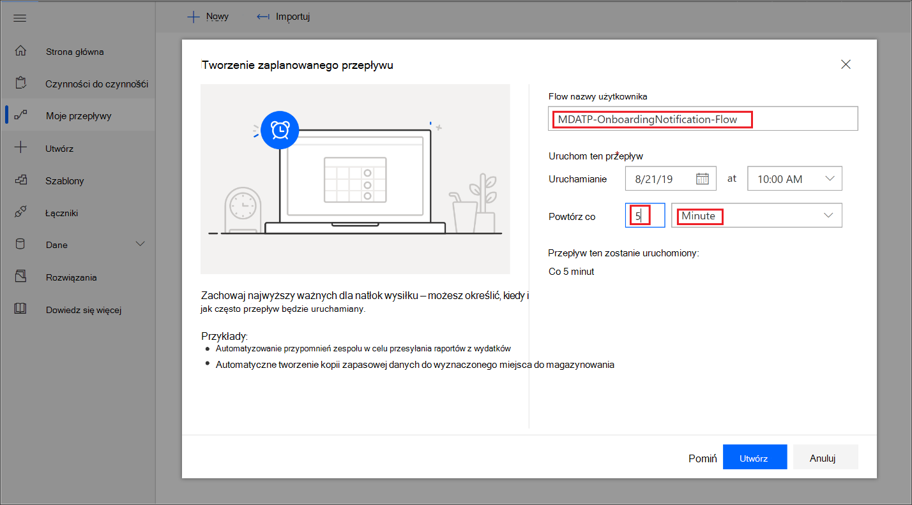
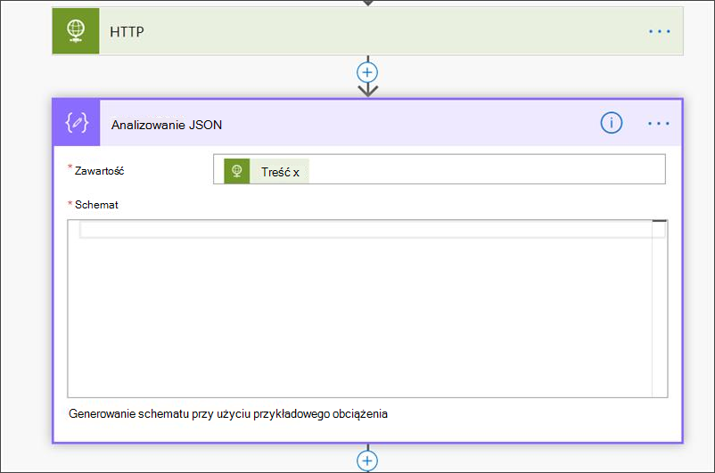

# <a name="create-a-notification-rule-when-a-local-onboarding-or-offboarding-script-is-used"></a>Tworzenie reguły powiadomienia w przypadku korzystania z lokalnego skryptu dołączania lub wybierania

[!INCLUDE [Microsoft 365 Defender rebranding](../../includes/microsoft-defender.md)]


**Dotyczy:**
- [Microsoft Defender for Endpoint Plan 1](https://go.microsoft.com/fwlink/p/?linkid=2154037)
- [Microsoft Defender for Endpoint Plan 2](https://go.microsoft.com/fwlink/p/?linkid=2154037)
- [Microsoft 365 Defender](https://go.microsoft.com/fwlink/?linkid=2118804)

> Chcesz mieć dostęp do programu Microsoft Defender dla punktu końcowego? [Zarejestruj się, aby korzystać z bezpłatnej wersji próbnej.](https://signup.microsoft.com/create-account/signup?products=7f379fee-c4f9-4278-b0a1-e4c8c2fcdf7e&ru=https://aka.ms/MDEp2OpenTrial?ocid=docs-wdatp-exposedapis-abovefoldlink)

[!include[Microsoft Defender for Endpoint API URIs for US Government](../../includes/microsoft-defender-api-usgov.md)]

[!include[Improve request performance](../../includes/improve-request-performance.md)]


Utwórz regułę powiadomień, aby w przypadku korzystania z lokalnego skryptu dołączania lub wybierania powiadomień użytkownik jest powiadamiany o tym.

## <a name="before-you-begin"></a>Przed rozpoczęciem

Musisz mieć dostęp do:

- Power Automate (co najmniej jeden plan dla  użytkowników). Aby uzyskać więcej informacji, [zobacz Power Automate ceny](https://flow.microsoft.com/pricing/).
- Azure Table or SharePoint List or Library /SQL DB.

## <a name="create-the-notification-flow"></a>Tworzenie przepływu powiadomień

1. W [flow.microsoft.com](https://flow.microsoft.com/).

2. Przejdź do **strony Moje przepływy > nowe > zaplanowane — z pustego**.

    

3. Tworzenie zaplanowanego przepływu.
   1. Wprowadź nazwę przepływu.
   2. Określ czas rozpoczęcia i czas.
   3. Określ częstotliwość. Na przykład co 5 minut.

    

4. Wybierz przycisk +, aby dodać nową akcję. Nowa akcja będzie żądaniem HTTP do interfejsu API defender for Endpoint security center. Możesz również zamienić go na dostępny w oknie "WDATP Connector" (akcja: "Komputery — pobierz listę komputerów").

    

5. Wprowadź następujące pola HTTP:

   - Metoda: "POBIERZ" jako wartość, aby uzyskać listę urządzeń.
   - URI: Wprowadź `https://api.securitycenter.microsoft.com/api/machines`.
   - Uwierzytelnianie: Wybierz pozycję "Active Directory OAuth".
   - Dzierżawa: Zaloguj się do usługi i https://portal.azure.com przejdź do **Azure Active Directory > rejestracji** aplikacji i uzyskaj wartość identyfikatora dzierżawy.
   - Odbiorcy: `https://securitycenter.onmicrosoft.com/windowsatpservice\`
   - Identyfikator klienta: Zaloguj się do usługi https://portal.azure.com i przejdź **do Azure Active Directory > rejestracji** aplikacji i uzyskaj wartość identyfikatora klienta.
   - Typ poświadczeń: Wybierz opcję "Tajna".
   - Tajny: Zaloguj się do usługi i https://portal.azure.com przejdź do **Azure Active Directory > rejestracji** aplikacji i uzyskaj wartość Identyfikatora dzierżawy.

    

6. Dodaj nowy krok, wybierając pozycję **Dodaj nową** akcję, a następnie wyszukaj pozycję **Operacje na** danych i **wybierz pozycję Analizowanie JSON**.

    

7. Dodaj treść w **polu** Zawartość.

    

8. Wybierz link **Użyj przykładowego obciążenia do wygenerowania** schematu.

    

9. Skopiuj i wklej następujący fragment kodu JSON:

    ```json
    {
        "type": "object",
        "properties": {
            "@@odata.context": {
                "type": "string"
            },
            "value": {
                "type": "array",
                "items": {
                    "type": "object",
                    "properties": {
                        "id": {
                            "type": "string"
                        },
                        "computerDnsName": {
                            "type": "string"
                        },
                        "firstSeen": {
                            "type": "string"
                        },
                        "lastSeen": {
                            "type": "string"
                        },
                        "osPlatform": {
                            "type": "string"
                        },
                        "osVersion": {},
                        "lastIpAddress": {
                            "type": "string"
                        },
                        "lastExternalIpAddress": {
                            "type": "string"
                        },
                        "agentVersion": {
                            "type": "string"
                        },
                        "osBuild": {
                            "type": "integer"
                        },
                        "healthStatus": {
                            "type": "string"
                        },
                        "riskScore": {
                            "type": "string"
                        },
                        "exposureScore": {
                            "type": "string"
                        },
                        "aadDeviceId": {},
                        "machineTags": {
                            "type": "array"
                        }
                    },
                    "required": [
                        "id",
                        "computerDnsName",
                        "firstSeen",
                        "lastSeen",
                        "osPlatform",
                        "osVersion",
                        "lastIpAddress",
                        "lastExternalIpAddress",
                        "agentVersion",
                        "osBuild",
                        "healthStatus",
                        "rbacGroupId",
                        "rbacGroupName",
                        "riskScore",
                        "exposureScore",
                        "aadDeviceId",
                        "machineTags"
                    ]
                }
            }
        }
    }

    ```

10. Wyodrębnij wartości z połączenia JSON i sprawdź, czy urządzenia wnoszone są / są już zarejestrowane na liście SharePoint przykład:

    - Jeśli tak, powiadomienie nie zostanie wyzwolone
    - Jeśli nie, zarejestruje nowe urządzenia na liście SharePoint, a do administratora punktu końcowego zostanie wysłane powiadomienie.

    

    

11. W **obszarze** Warunek dodaj następujące wyrażenie: "length(body('Get_items')?' wartość'])" i ustaw warunek na wartość 0.

    
    
    
    

## <a name="alert-notification"></a>Powiadomienie alertu

Poniższy obraz zawiera przykład powiadomienia e-mail.


## <a name="tips"></a>Wskazówki

- Możesz filtrować tutaj tylko za pomocą lastSeen:
  - Co 60 min:
    - Weź wszystkie urządzenia ostatnio widziane w ciągu ostatnich 7 dni.

- Dla każdego urządzenia:
  - Jeśli właściwość Ostatnio widziana znajduje się w interwale jednogodzinnym [-7 dni, -7 dni + 60 minut ] -> alert o możliwości wystartowania.
  - Jeśli alert jest widoczny po raz pierwszy w ciągu ostatniej godziny > alert o dołączaniu.

W tym rozwiązaniu nie będą dostępne zduplikowane alerty: Są dzierżawy, które mają wiele urządzeń. Uzyskanie tych wszystkich urządzeń może być bardzo kosztowne i wymagać stronicowania.

Możesz ją podzielić na dwa zapytania:

1. W przypadku wywęzienia należy użyć tylko tego interwału przy użyciu $filter OData i tylko sprawdzić, czy warunki są spełnione.
2. Przejmij wszystkie urządzenia ostatnio widziane w ciągu ostatniej godziny i sprawdź dla nich właściwość First seen (jeśli właściwość First seen (Widziana jako pierwsza) jest w przeszłości, ostatnio widziane także tam jest.
