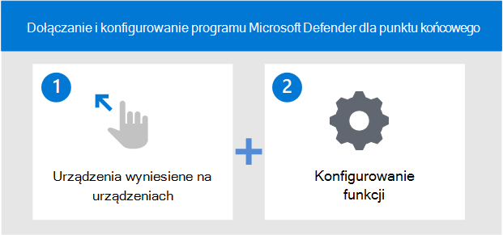

# Wdowa do usługi Microsoft Defender for Endpoint

[!INCLUDE [Microsoft 365 Defender rebranding](../../includes/microsoft-defender.md)]

**Dotyczy:**
- [Microsoft Defender for Endpoint Plan 2](https://go.microsoft.com/fwlink/p/?linkid=2154037)
- [Microsoft 365 Defender](https://go.microsoft.com/fwlink/?linkid=2118804)

> Chcesz mieć dostęp do programu Microsoft Defender dla punktu końcowego? [Zarejestruj się, aby korzystać z bezpłatnej wersji próbnej.](https://signup.microsoft.com/create-account/signup?products=7f379fee-c4f9-4278-b0a1-e4c8c2fcdf7e&ru=https://aka.ms/MDEp2OpenTrial?ocid=docs-wdatp-exposedapis-abovefoldlink)

Poznaj różne fazy wdrażania programu Microsoft Defender dla punktu końcowego i dowiedz się, jak skonfigurować funkcje w ramach rozwiązania.

Oto czynności, które należy wykonać, aby wdrożyć usługę Defender dla punktu końcowego:

- Krok 1. Dołączanie punktów końcowych do usługi
- Krok 2. Konfigurowanie funkcji

## Krok 1. Wdowe punkty końcowe przy użyciu dowolnego z obsługiwanych narzędzi do zarządzania

W [temacie Planowanie wdrożenia](deployment-strategy.md) przedstawiono ogólne czynności, które należy wykonać, aby wdrożyć usługę Defender dla punktu końcowego.

Obejrzyj ten klip wideo, aby szybko poznać proces dołączania i poznać dostępne narzędzia i metody.

> [!VIDEO https://www.microsoft.com/videoplayer/embed/RE4bGqr]

Po zidentyfikowaniu architektury musisz zdecydować, której metody wdrażania użyć. Wybór narzędzia wdrażania ma wpływ na sposób wdrożenia punktów końcowych do usługi.

### Opcje narzędzia dołączania

W poniższej tabeli wymieniono dostępne narzędzia na podstawie punktu końcowego, który trzeba do dyspozycji.

| Punkt końcowy     | Opcje narzędzia                       |
|--------------|------------------------------------------|
| **Windows**  |  [Skrypt lokalny (do 10 urządzeń)](configure-endpoints-script.md)    [zasady grupy](configure-endpoints-gp.md)    [Microsoft Endpoint Manager/ Menedżer urządzeń przenośnych](configure-endpoints-mdm.md)   [Microsoft Endpoint Configuration Manager](configure-endpoints-sccm.md)   [Skrypty VDI](configure-endpoints-vdi.md)   [Integracja z usługą Microsoft Defender dla chmury](azure-server-integration.md) |
| **macOS**    | [Skrypty lokalne](mac-install-manually.md)   [Microsoft Endpoint Manager](mac-install-with-intune.md)   [Jamf Pro](mac-install-with-jamf.md)   [Zarządzanie urządzeniami przenośnymi](mac-install-with-other-mdm.md) |
| **Linux Server** | [Skrypt lokalny](linux-install-manually.md)   [Wytłaczenie](linux-install-with-puppet.md)   [Ansible](linux-install-with-ansible.md)|
| **iOS**      | [Microsoft Endpoint Manager](ios-install.md)                                |
| **Android**  | [Microsoft Endpoint Manager](android-intune.md)               | 

## Krok 2. Konfigurowanie funkcji
Po dojechiniu do punktów końcowych skonfigurujesz funkcje. W poniższej tabeli wymieniono składniki, które można skonfigurować. Wybierz składniki, których chcesz użyć, i usuń te, które nie mają zastosowania.

| Funkcja | Opis |
|-|-|
| [Wykrywanie punktu & odpowiedzi (EDR)](overview-endpoint-detection-response.md) | Program Defender for Endpoint wykrywanie i reagowanie w punktach końcowych funkcje zaawansowane wykrywania ataków, które są blisko czasu rzeczywistego i które oferują akcję. Analitycy zabezpieczeń mogą efektywnie określać priorytety alertów, zyskać wgląd w pełny zakres naruszenia zabezpieczeń oraz podjąć działania w celu reagowania na zagrożenia. |
| [Zarządzanie & zagrożeniami i zagrożeniami](next-gen-threat-and-vuln-mgt.md) | Zarządzanie & zagrożeniami i zagrożeniami to składnik programu Microsoft Defender for Endpoint, który zapewnia administratorom zabezpieczeń i zespołom operacji zabezpieczeń unikatową wartość, w tym: — Funkcje analizy w czasie rzeczywistym (wykrywanie i reagowanie w punktach końcowych) (EDR ) szczegółowe informacje skorelowane z lukami w punktach końcowych — nieoceniony kontekst luki w zabezpieczeniach urządzenia podczas badania zdarzeń — wbudowane procesy rozwiązywania problemów za pośrednictwem usług Microsoft Intune i Microsoft System Center Configuration Manager.  |
| [Ochrona następnej generacji (NGP)](microsoft-defender-antivirus-windows.md) | Program antywirusowy Microsoft Defender to wbudowane rozwiązanie ochrony przed złośliwym oprogramowaniem, które zapewnia ochronę komputerów stacjonarnych, przenośnych i serwerów następnej generacji. Program antywirusowy Microsoft Defender zawiera:   - Zapewnianie ochrony w chmurze w celu natychmiastowego wykrywania i blokowania nowych i pojawiających się zagrożeń. Oprócz uczenia maszynowego i inteligentnego Graph ochrona w chmurze jest częścią technologii nowej generacji, które są zaawansowane dla Program antywirusowy Microsoft Defender.    - Skanowanie zawsze przy użyciu zaawansowanego monitorowania zachowania plików i procesów oraz innych funkcji heuristics (nazywanych również "ochroną w czasie rzeczywistym").   - Dedykowane aktualizacje ochrony oparte na uczeniem maszynowym, analizie danych big-data przez ludzi oraz szczegółowe badania nad odpornością na zagrożenia. |
| [Zmniejszenie powierzchni ataków (ASR)](overview-attack-surface-reduction.md) | Funkcje ograniczania powierzchni ataków w programie Microsoft Defender dla punktu końcowego pomagają chronić urządzenia i aplikacje w organizacji przed nowymi i pojawiającymi się zagrożeniami. |
| [Działania naprawcze & autowywiadu (AIR)](automated-investigations.md) | Program Microsoft Defender for Endpoint używa zautomatyzowanych analiz w celu znacznego zmniejszenia liczby alertów, które trzeba zbadać indywidualnie. Funkcja automatycznego badania korzysta z różnych algorytmów inspekcji i procesów używanych przez analityków (takich jak podręczniki) do badania alertów i podejmowania natychmiastowych działań naprawczych w celu rozwiązania naruszeń. Znacząco zmniejsza to liczbę alertów, umożliwiając ekspertom z operacji zabezpieczeń skoncentrowanie się na bardziej zaawansowanych zagrożeniach i innych inicjatywach o wysokich wartościach. |
| [Microsoft Threat Experts (MTE)](microsoft-threat-experts.md) | Microsoft Threat Experts to zarządzana służba chłoń, która zapewnia centrach operacji zabezpieczeń (SOC, Security Operation Center) z specjalistycznej kontroli i analizy, aby zapewnić, że nie przegapisz krytycznych zagrożeń w ich unikatowych środowiskach.      |

Po dojściu do punktów końcowych skonfigurujesz różne funkcje, takie jak wykrywanie i reagowanie w punktach końcowych, ochrona następnej generacji i zmniejszenie obszarów ataków.

## Przykładowe wdrożenia

W tym przewodniku po wdrażaniu opisano sposób korzystania z dwóch narzędzi wdrażania w celu wdrożenia punktów końcowych i konfigurowania możliwości.

Narzędzia w przykładowych wdrożeniach to:

- [Dołączanie przy użyciu Microsoft Endpoint Configuration Manager](onboarding-endpoint-configuration-manager.md)
- [Dołączanie przy użyciu Microsoft Endpoint Manager](onboarding-endpoint-manager.md)

Używając wymienionych powyżej narzędzi wdrażania, otrzymasz  przewodnik podczas konfigurowania następującego programu Defender na temat możliwości punktu końcowego:

- Wykrywanie punktu końcowego i konfiguracja odpowiedzi
- Konfiguracja ochrony następnej generacji
- Konfiguracja zmniejszania powierzchni ataków

## Tematy pokrewne

- [Dołączanie przy użyciu Microsoft Endpoint Configuration Manager](onboarding-endpoint-configuration-manager.md)
- [Dołączanie przy użyciu Microsoft Endpoint Manager](onboarding-endpoint-manager.md)
- [Bezpieczne dokumenty w usłudze Microsoft 365 E5](../office-365-security/safe-docs.md)
