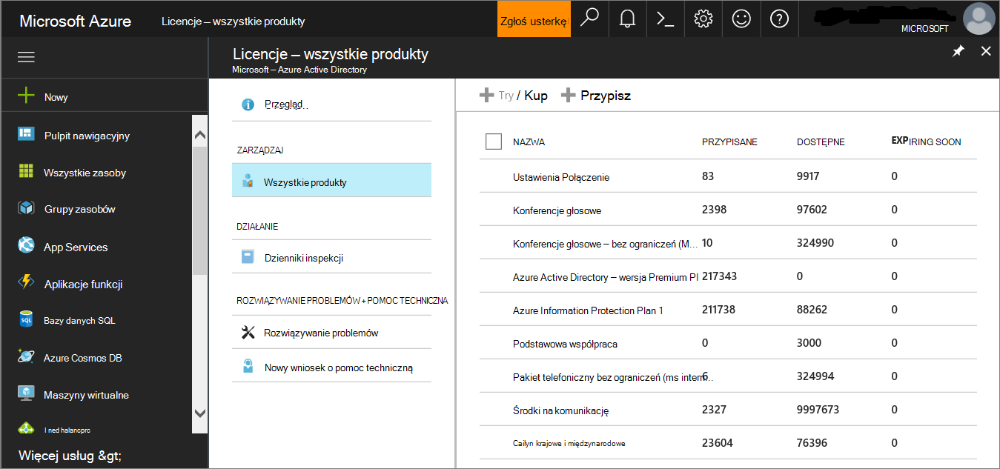
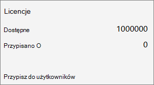

# <a name="set-up-microsoft-defender-for-endpoint-deployment"></a>Konfigurowanie wdrożenia programu Microsoft Defender dla punktu końcowego

[!INCLUDE [Microsoft 365 Defender rebranding](../../includes/microsoft-defender.md)]


**Dotyczy:**
- [Microsoft Defender for Endpoint Plan 2](https://go.microsoft.com/fwlink/p/?linkid=2154037)
- [Microsoft 365 Defender](https://go.microsoft.com/fwlink/?linkid=2118804)

> Chcesz mieć dostęp do programu Microsoft Defender dla punktu końcowego? [Zarejestruj się, aby korzystać z bezpłatnej wersji próbnej.](https://signup.microsoft.com/create-account/signup?products=7f379fee-c4f9-4278-b0a1-e4c8c2fcdf7e&ru=https://aka.ms/MDEp2OpenTrial?ocid=docs-wdatp-exposedapis-abovefoldlink)

Wdrażanie usługi Defender dla punktu końcowego jest procesem trzyfazowym:

|[](prepare-deployment.md)<br>[Etap 1. Przygotowywanie](prepare-deployment.md) | <br>Etap 2. Konfigurowanie | [](onboarding.md)<br>[Etap 3. Wniesienie](onboarding.md)|
|---|---|---|
||*Jesteś tutaj!*||

Jesteś obecnie w fazie projektowania.

W tym scenariuszu wdrażania zostaną Ci opisane następujące kroki:

- Sprawdzanie poprawności licencji
- Konfiguracja dzierżawy
- Konfiguracja sieci

> [!NOTE]
> W celu prowadzenia Cię przez typowe wdrożenie ten scenariusz obejmie tylko wykorzystanie Microsoft Endpoint Configuration Manager. Program Defender for Endpoint obsługuje korzystanie z innych narzędzi wdrażania, ale nie obejmuje tych scenariuszy w przewodniku wdrażania. Aby uzyskać więcej informacji, zobacz [Urządzenia w programie Microsoft Defender dla punktu końcowego](onboard-configure.md).

## <a name="check-license-state"></a>Sprawdź stan licencji

Sprawdzanie stanu licencji i jego poprawnej obsługi administracyjnej jest możliwe za pośrednictwem centrum administracyjnego lub portalu **Microsoft Azure administracyjnego**.

1. Aby wyświetlić licencje, przejdź do portalu **Microsoft Azure i** przejdź do sekcji Microsoft Azure [licencji portalu](https://portal.azure.com/#blade/Microsoft_AAD_IAM/LicensesMenuBlade/Products) internetowego.

   

1. Ewentualnie w centrum administracyjnym przejdź do pozycji **Subskrypcje** **rozliczeniowe**\>.

    Na ekranie zobaczysz wszystkie licencje z inicjowaniem obsługi administracyjnej i ich bieżący **stan**.

    

## <a name="cloud-service-provider-validation"></a>Sprawdzanie poprawności dostawcy usług w chmurze

Aby uzyskać dostęp do licencji, dla których jest zapewniana inicjowanie obsługi administracyjnej Twojej firmy, oraz sprawdzić stan licencji, przejdź do centrum administracyjnego.

1. W portalu **partnerów** wybierz pozycję **Administruj usługami > Office 365**.

2. Kliknięcie linku **Portalu partnerskiego** spowoduje otwarcie opcji **Administrator w** imieniu użytkownika i zapewni Ci dostęp do centrum administracyjnego klientów.

   

## <a name="tenant-configuration"></a>Konfiguracja dzierżawy

Dołączanie do programu Microsoft Defender for Endpoint jest łatwe. Z menu nawigacji wybierz dowolny element w sekcji Punkty końcowe lub dowolną Microsoft 365 Defender, taką jak Zdarzenia, Myśli, Centrum akcji lub Analiza zagrożeń, aby zainicjować proces dołączania.

Z przeglądarki internetowej przejdź do portalu <a href="https://go.microsoft.com/fwlink/p/?linkid=2077139" target="_blank">Microsoft 365 Defender sieci Web</a>.

## <a name="data-center-location"></a>Lokalizacja centrum danych
Program Microsoft Defender for Endpoint będzie przechowywać i przetwarzać dane w tej [samej lokalizacji,](/microsoft-365/security/defender/m365d-enable) w Microsoft 365 Defender. Jeśli usługa Microsoft 365 Defender nie została jeszcze włączona, włączenie do programu Microsoft Defender for Endpoint spowoduje również włączenie programu Microsoft 365 Defender i automatyczne wybrana nowa lokalizacja centrum danych na podstawie lokalizacji aktywnych usług zabezpieczeń usługi Microsoft 365. Wybrana lokalizacja centrum danych zostanie pokazana na ekranie.

## <a name="network-configuration"></a>Konfiguracja sieci

Jeśli organizacja nie wymaga, aby punkty końcowe korzystały z serwera proxy w celu uzyskania dostępu do Internetu, pomiń tę sekcję.

Czujnik programu Microsoft Defender for Endpoint wymaga, Windows Http (WinHTTP) firmy Microsoft do zgłaszania danych czujnika i komunikowania się z usługą Microsoft Defender for Endpoint. Osadzony czujnik programu Microsoft Defender for Endpoint działa w kontekście systemowym przy użyciu konta LocalSystem. Czujnik korzysta z usług Microsoft Windows HTTP (WinHTTP) w celu umożliwienia komunikacji z usługą w chmurze programu Microsoft Defender for Endpoint. Ustawienie konfiguracji WinHTTP jest niezależne od ustawień serwera Windows proxy przeglądania Internetu (WinINet) i może wykrywać tylko serwer proxy przy użyciu następujących metod odnajdowania:

- **Metody wykrywania automatycznego**:
  - Przezroczysty serwer proxy
  - Protokół automatycznego wykrywania proxy sieci Web (WPAD)

  Jeśli w topologii sieci wdrożono przezroczysty serwer proxy lub tablet WPAD, nie ma potrzeby żadnych specjalnych ustawień konfiguracji. Aby uzyskać więcej informacji na temat wykluczeń adresu URL punktu końcowego programu Microsoft Defender na serwerze proxy, zobacz sekcję Adresy URL usługi proxy w tym dokumencie, aby uzyskać listę adresów URL dla adresów [URL](production-deployment.md#proxy-service-urls) i konfigurowanie ustawień serwera proxy i łączności [internetowej](configure-proxy-internet.md#enable-access-to-microsoft-defender-for-endpoint-service-urls-in-the-proxy-server).

- **Ręczna statyczna konfiguracja serwera proxy**:
  - Konfiguracja oparta na rejestrze
  - WinHTTP configured using netsh command

    Ta możliwość jest przeznaczona tylko dla komputerów stacjonarnych w stabilnej topologii (na przykład: komputer stacjonarny w sieci firmowej za tym samym serwerem proxy).

### <a name="configure-the-proxy-server-manually-using-a-registry-based-static-proxy"></a>Ręczne konfigurowanie serwera proxy przy użyciu statycznego serwera proxy opartego na rejestrze

Skonfiguruj statyczny serwer proxy oparty na rejestrze, aby umożliwić raportowanie danych diagnostycznych i komunikowanie się z usługami programu Microsoft Defender for Endpoint tylko w programie Microsoft Defender for Endpoint, jeśli komputer nie ma możliwości nawiązania połączenia z Internetem. Statyczny serwer proxy można skonfigurować za pośrednictwem zasady grupy (GP). Zasady grupy można znaleźć w obszarze:

- Szablony administracyjne Windows \> kompilacji zbierania \> \> i podglądu danych składników Konfiguruj uwierzytelniony serwer proxy dla usługi połączonego interfejsu użytkownika i telemetrii
- Ustaw dla ustawienia **Włączone i** wybierz **pozycję Wyłącz uwierzytelniony serwer proxy**

1. Otwórz Konsolę zarządzania zasadami grupy.
2. Utwórz zasady lub edytuj istniejące zasady zgodnie z praktykami organizacyjnymi.
3. Edytuj zasady grupy i przejdź do szablonu administracyjnego **Windows kompilacji \> \> zbierania danych składników i podglądu Konfiguruj uwierzytelnione użycie serwera proxy dla usługi połączonego interfejsu użytkownika i telemetrii.\>**

   

4. Wybierz **pozycję Włączone**.
5. Wybierz **pozycję Wyłącz uwierzytelniony serwer proxy**.
6. Przejdź do **szablonu administracyjnego Windows \> kompilacji zbierania \> \> i podglądu składników Konfiguruj połączone środowisko użytkownika i telemetrię**.

    

7. Wybierz **pozycję Włączone**.
8. Wprowadź nazwę **serwera proxy**.

Zasady ustawiają dwie wartości `TelemetryProxyServer` rejestru jako REG_SZ i jako `DisableEnterpriseAuthProxy` REG_DWORD w ramach klucza rejestru `HKLM\Software\Policies\Microsoft\Windows\DataCollection`.

Wartość rejestru przyjmuje `TelemetryProxyServer` następujący format ciągu:

```text
<server name or ip>:<port>
```

Na przykład: 10.0.0.6:8080

Wartość rejestru powinna `DisableEnterpriseAuthProxy` być ustawiona na 1.

### <a name="configure-the-proxy-server-manually-using-netsh-command"></a>Ręczne konfigurowanie serwera proxy przy użyciu polecenia netsh

Za pomocą metody netsh skonfiguruj statyczny serwer proxy dla całego systemu.

> [!NOTE]
>
> - Dotyczy to wszystkich aplikacji, w tym usług Windows, które korzystają z winHTTP z domyślnym serwerem proxy.
> - Komputery przenośne, które zmieniają topologię (na przykład z biura do domu) zostaną niepoprawnie niepoprawne przy użyciu oprogramowania Netsh. Użyj statycznej konfiguracji serwera proxy opartej na rejestrze.

1. Otwieranie wiersza polecenia z podwyższonym poziomem uprawnień:
    1. Przejdź do **przycisku Start** i wpisz **cmd**.
    1. Kliknij prawym przyciskiem myszy **pozycję Wiersz polecenia i** wybierz **pozycję Uruchom jako administrator**.

2. Wprowadź następujące polecenie i naciśnij klawisz **Enter**:

   ```PowerShell
   netsh winhttp set proxy <proxy>:<port>
   ```

   Na przykład: netsh winhttp set proxy 10.0.0.6:8080

### <a name="proxy-configuration-for-down-level-devices"></a>Konfiguracja serwera proxy dla urządzeń  down-level

Down-Level to stacje robocze Windows 7 z dodatkiem SP1 i Windows 8.1, Windows Server 2008 R2, Windows Server 2012, Windows Server 2012 R2 oraz wersje Windows Server 2016 wcześniejszych niż Windows  Server CB 1803. W tych systemach operacyjnych serwer proxy zostanie skonfigurowany jako część agenta zarządzania firmy Microsoft do obsługi komunikacji z punktu końcowego do platformy Azure. Aby uzyskać informacje na temat konfiguracji serwera proxy na tych urządzeniach, zobacz Przewodnik po szybkim wdrażaniu agenta zarządzania firmy Microsoft.

### <a name="proxy-service-urls"></a>Adresy URL usługi serwera proxy

Adresy URL, które zawierają wersję 20, są potrzebne tylko w przypadku, Windows 10, wersji 1803 lub Windows 11 urządzeń. Jest ona potrzebna tylko `us-v20.events.data.microsoft.com` w przypadku, gdy urządzenie jest Windows 10 wersji 1803 lub Windows 11.

Jeśli serwer proxy lub zapora blokuje ruch anonimowy, ponieważ czujnik programu Microsoft Defender for Endpoint łączy się z kontekstu systemowego, upewnij się, że ruch anonimowy jest dozwolony w podanych adresach URL.

Poniższy arkusz kalkulacyjny zawiera listę usług i skojarzonych z nimi adresów URL, z których sieć musi nawiązać połączenie. Upewnij się, że nie ma żadnych reguł zapory lub filtrowania sieci, które odmówią dostępu do tych adresów URL, lub może być konieczne utworzenie reguły zezwalania *przeznaczonej* specjalnie dla tych adresów URL.

<br>

****


|Arkusz kalkulacyjny listy domen| Opis|
|---|---|
|Lista adresów URL punktu końcowego programu Microsoft Defender dla klientów komercyjnych | Arkusz kalkulacyjny z określonymi rekordami DNS dla lokalizacji usług, lokalizacji geograficznych i systemu operacyjnego dla klientów komercyjnych. <p> [Pobierz arkusz kalkulacyjny tutaj.](https://download.microsoft.com/download/6/b/f/6bfff670-47c3-4e45-b01b-64a2610eaefa/mde-urls-commercial.xlsx)
| Lista adresów URL programu Microsoft Defender dla punktów końcowych dla klientów GCC/DoD| Arkusz kalkulacyjny z określonymi rekordami DNS dla lokalizacji usług, lokalizacji geograficznych i systemu operacyjnego dla klientów GCC/DoD. <p> [Pobierz arkusz kalkulacyjny tutaj.](https://download.microsoft.com/download/6/a/0/6a041da5-c43b-4f17-8167-79dfdc10507f/mde-urls-gov.xlsx)
|

## <a name="next-step"></a>Następny krok

 <br> [Etap 3. Etap 3.](onboarding.md) Dołączanie urządzeń do usługi, aby usługa Microsoft Defender for Endpoint uzyskać od nich dane czujnika.
