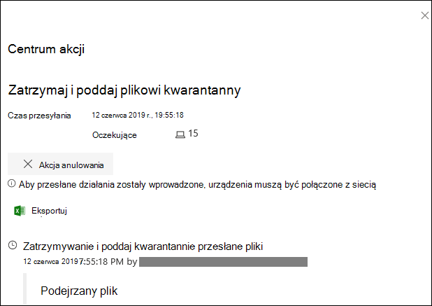
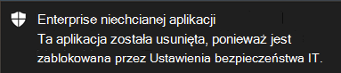

# <a name="take-response-actions-on-a-file"></a>Akcje odpowiedzi dotyczące pliku

[!INCLUDE [Microsoft 365 Defender rebranding](../../includes/microsoft-defender.md)]


**Dotyczy:**
- [Microsoft Defender for Endpoint Plan 2](https://go.microsoft.com/fwlink/p/?linkid=2154037)

[!include[Prerelease information](../../includes/prerelease.md)]

> Chcesz mieć dostęp do usługi Defender dla punktu końcowego? [Zarejestruj się, aby korzystać z bezpłatnej wersji próbnej.](https://signup.microsoft.com/create-account/signup?products=7f379fee-c4f9-4278-b0a1-e4c8c2fcdf7e&ru=https://aka.ms/MDEp2OpenTrial?ocid=docs-wdatp-responddile-abovefoldlink)

Szybkie reagowanie na wykryte ataki przez zatrzymanie i kwartyfowanie plików lub zablokowanie pliku. Po podjęciu działania na plikach możesz sprawdzić szczegóły aktywności w Centrum akcji.

Akcje odpowiedzi są dostępne na stronie szczegółowego profilu pliku. Na tej stronie możesz przełączać się między nowym i starym układem strony, przełączaąc się między nową **stroną Plik**. W dalszej części tego artykułu opisano nowsze układy stron.

Akcje odpowiedzi są uruchamiane wzdłuż górnej części strony pliku i obejmują:

- Zatrzymaj i poddaj plikowi kwarantanny
- Wskaźnik dodawania
- Pobierz plik
- Skonsultuj się z ekspertem ds. zagrożeń
- Centrum akcji

Możesz również przesłać pliki do dogłębnej analizy, aby uruchomić plik w bezpiecznej piaskownicy w chmurze. Po zakończeniu analizy otrzymasz szczegółowy raport, który zawiera informacje o zachowaniu pliku. Możesz przesłać pliki do dogłębnej analizy i odczytać wcześniejsze raporty, wybierając **kartę Analiza głębokości** . Znajduje się on poniżej kart z informacjami o plikach.

Niektóre akcje wymagają pewnych uprawnień. W poniższej tabeli opisano działania, jakie niektóre uprawnienia mogą być wykonywane na plikach przenośnych wykonywalnych (PE) i plikach innych niż PE:

<br>

****

|Uprawnienie|Pliki PE|Pliki inne niż PE|
|---|:---:|:---:|
|Wyświetlanie danych|X|X|
|Badanie alertów|&#x2611;|X|
|Odpowiedź na żywo — podstawowe|X|X|
|Zaawansowana funkcja odpowiedzi na żywo|&#x2611;|&#x2611;|
|

Aby uzyskać więcej informacji na temat ról, zobacz [Tworzenie ról w kontrolach dostępu opartych na rolach i zarządzanie nimi](user-roles.md).

## <a name="stop-and-quarantine-files-in-your-network"></a>Zatrzymywanie i kwarantanna plików w sieci

Ataki w organizacji można dotrzymywać przez zatrzymanie złośliwego procesu i kwartyfowanie pliku, w którym został on obserwowany.

> [!IMPORTANT]
> Tę czynność można podjąć tylko w przypadku:
>
> - Na urządzeniu, na które jest uruchomiona akcja, jest Windows 10 wersji 1703 lub nowszej, Windows 11
> - Plik nie należy do zaufanych wydawców innych firm ani nie jest podpisyny przez firmę Microsoft
> - Program antywirusowy Microsoft Defender musi przynajmniej być uruchomiony w trybie pasywnym. Aby uzyskać więcej informacji, [zobacz Program antywirusowy Microsoft Defender zgodności](/windows/security/threat-protection/microsoft-defender-antivirus/microsoft-defender-antivirus-compatibility).

Akcja **Zatrzymaj i poddaj** kwarantannie plik obejmuje zatrzymywanie uruchomionych procesów, kwartyfowanie plików i usuwanie trwałych danych, takich jak klucze rejestru.

Ta akcja  dotyczy urządzeń z systemem Windows 10, wersja 1703 lub nowsza i Windows 11, gdzie plik został obserwowany w ciągu ostatnich 30 dni.

> [!NOTE]
> W dowolnym momencie będzie można przywrócić plik z kwarantanny.

### <a name="stop-and-quarantine-files"></a>Zatrzymywanie i kwarantanna plików

1. Zaznacz plik, który chcesz zatrzymać i poddać kwarantannie. Możesz wybrać plik w dowolnym z następujących widoków lub użyć pola Wyszukaj:

   - **Alerty** — kliknięcie odpowiednich linków na osi czasu Opis lub Szczegóły w historii alertu
   - **Pole wyszukiwania** — **wybierz pozycję Plik** z menu rozwijanego i wprowadź nazwę pliku

   > [!NOTE]
   > Akcja zatrzymania i kwarantanny pliku jest ograniczona do maksymalnie 1000 urządzeń. Aby zatrzymać plik na większej liczbie urządzeń, zobacz Dodawanie wskaźnika [blokowania lub zezwalania na plik](#add-indicator-to-block-or-allow-a-file).

2. Przejdź do górnego paska i wybierz pozycję **Zatrzymaj i poddaj kwarantannie plik**.

   

3. Określ przyczynę, a następnie wybierz pozycję **Potwierdź**.

   

   Centrum akcji wyświetla informacje o przesyłania:

   

   - **Czas przesłania** — pokazuje, kiedy została przesłana akcja.
   - **Sukces** — pokazuje liczbę urządzeń, na których plik został zatrzymany i poddany kwarantannie.
   - **Niepowodzenie —** pokazuje liczbę urządzeń, na których działanie zakończyło się niepowodzeniem, oraz szczegóły dotyczące niepowodzenia.
   - **Oczekiwanie** — pokazuje liczbę urządzeń, na których plik nie został jeszcze zatrzymany i poddany kwarantannie. Może to zająć trochę czasu w przypadku, gdy urządzenie jest w trybie offline lub nie jest połączone z siecią.

4. Wybierz dowolny wskaźnik stanu, aby wyświetlić więcej informacji o akcji. Na przykład wybierz pozycję **Niepowodzenie,** aby zobaczyć, gdzie akcja nie powiodła się.

#### <a name="notification-on-device-userf"></a>Powiadomienie dla użytkownika urządzenia

Po usunięciu pliku z urządzenia jest wyświetlane następujące powiadomienie:



Na osi czasu urządzenia jest dodawane nowe zdarzenie dla każdego urządzenia, na którym plik został zatrzymany i poddany kwarantannie.

Przed wdrożeniem akcji jest wyświetlane ostrzeżenie dotyczące plików powszechnie używanych w całej organizacji. Ma na celu sprawdzenie, czy operacja jest przeznaczona.

## <a name="restore-file-from-quarantine"></a>Przywracanie pliku z kwarantanny

Możesz wycofać i usunąć plik z kwarantanny, jeśli określono, że jest on oczyszczani po zakończeniu badania. Uruchom następujące polecenie na każdym urządzeniu, na którym plik został poddany kwarantannie.

1. Otwórz wiersz polecenia z podwyższonym poziomem uprawnień na urządzeniu:

   1. Przejdź do **przycisku Start** i wpisz _cmd_.

   1. Kliknij prawym przyciskiem myszy **pozycję Wiersz polecenia i** wybierz **pozycję Uruchom jako administrator**.

2. Wprowadź następujące polecenie i naciśnij klawisz **Enter**:

   ```dos
   "%ProgramFiles%\Windows Defender\MpCmdRun.exe" -Restore -Name EUS:Win32/CustomEnterpriseBlock -All
   ```

   > [!NOTE]
   > W niektórych scenariuszach **nazwa zagrożenia** może być wyświetlana jako: EUS:Win32/CustomEnterpriseBlock!cl.
   >
   > Program Defender for Endpoint przywróci wszystkie niestandardowe zablokowane pliki, które zostały poddane kwarantannie na tym urządzeniu w ciągu ostatnich 30 dni.

> [!IMPORTANT]
> Plik poddany kwarantannie jako potencjalne zagrożenie sieci może nie być odzyskiwalny. Jeśli użytkownik spróbuje przywrócić plik po kwarantannie, może to oznaczać, że ten plik jest niedostępny. Może to być spowodowane tym, że system nie ma już poświadczeń sieciowych, aby uzyskać dostęp do pliku. Zazwyczaj jest to wynik tymczasowego zalogowania się do folderu systemowego lub udostępnionego i tokeny dostępu wygasły.

## <a name="download-or-collect-file"></a>Pobieranie lub zbieranie pliku

Wybranie **opcji Pobierz plik** w akcji odpowiedzi umożliwia pobranie lokalnego archiwum danych chronionych hasłem .zip zawierającego ten plik. Zostanie wyświetlone wysuwne pole, w którym możesz nagrać powód pobierania pliku i ustawić hasło.

Domyślnie powinno być możliwe pobieranie plików poddanych kwarantannie.


### <a name="download-quarantined-files"></a>Pobieranie plików poddanych kwarantannie

Pliki, które zostały poddane kwarantannie przez Program antywirusowy Microsoft Defender lub Twój zespół zabezpieczeń, zostaną zapisane zgodnie z twoimi przykładami konfiguracji [przesyłania](enable-cloud-protection-microsoft-defender-antivirus.md). Zespół zabezpieczeń może pobrać pliki bezpośrednio ze strony szczegółów pliku za pomocą przycisku "Pobierz plik". **Ta funkcja podglądu jest domyślnie włączona**.

Ta lokalizacja zależy od ustawień geograficznych organizacji (Ue, Zjednoczone Królestwo lub Usa). Plik poddany kwarantannie będzie zbierany tylko raz dla organizacji. Dowiedz się więcej o ochronie danych firmy Microsoft z Portalu zaufania usług pod witrynie https://aka.ms/STP.

Po włączeniu tego ustawienia zespoły zabezpieczeń mogą pomóc zespołom zabezpieczeń szybko i mniej ryzykownie badać potencjalnie złe pliki oraz badać zdarzenia. Jeśli jednak chcesz wyłączyć to ustawienie,  \>  \>  \> przejdź do Ustawienia Zaawansowane funkcje Pobieranie plików poddanych kwarantannie w celu dostosowania ustawienia. [Dowiedz się więcej o funkcjach zaawansowanych](advanced-features.md)

#### <a name="backing-up-quarantined-files"></a>Cofanie kopii zapasowej poddanych kwarantannie plików

Użytkownicy mogą zostać wyświetleniu monitu o wyrażenie wyraźnej zgody przed rozpoczęciem kopii zapasowej pliku poddanego kwarantannie, w zależności od [konfiguracji przykładowego przesyłania](enable-cloud-protection-microsoft-defender-antivirus.md#use-group-policy-to-turn-on-cloud-protection).

Ta funkcja nie będzie działać, jeśli przykładowe przesyłanie zostanie wyłączone. Jeśli automatyczne przesyłanie próbek jest ustawione na żądanie uprawnień użytkownika, zbierane są tylko próbki, na które użytkownik zgadza się wysyłać.

> [!IMPORTANT]
> Wymagania dotyczące pobierania plików poddanych kwarantannie:
>
> - Twoja organizacja używa Program antywirusowy Microsoft Defender w trybie aktywnym
> - Wersja aparatu antywirusowego to 1.1.17300.4 lub nowsza. Zobacz [Wersje miesięcznej platformy i aparatu](manage-updates-baselines-microsoft-defender-antivirus.md#monthly-platform-and-engine-versions)
> - Ochrona oparta na chmurze jest włączona. Zobacz [Włączanie ochrony w chmurze.](enable-cloud-protection-microsoft-defender-antivirus.md)
> - Przykładowe przesyłanie jest włączone
> - Urządzenia mają Windows 10 w wersji 1703 lub nowszej, albo Windows Server 2016 lub 2019 albo Windows Server 2022 lub Windows 11

### <a name="collect-files"></a>Zbieranie plików

Jeśli plik nie jest jeszcze przechowywany przez program Microsoft Defender dla punktu końcowego, nie możesz go pobrać. Zamiast tego w tej samej lokalizacji będzie  wyświetlony przycisk Odbierz plik. Jeśli w ciągu ostatnich 30 dni nie widać pliku w **organizacji,** wyłączy się zbieranie pliku.
> [!Important]
> Plik poddany kwarantannie jako potencjalne zagrożenie sieci może nie być odzyskiwalny. Jeśli użytkownik spróbuje przywrócić plik po kwarantannie, może to oznaczać, że ten plik jest niedostępny. Może to być spowodowane tym, że system nie ma już poświadczeń sieciowych, aby uzyskać dostęp do pliku. Zazwyczaj jest to wynik tymczasowego zalogowania się do folderu systemowego lub udostępnionego i tokeny dostępu wygasły.

## <a name="add-indicator-to-block-or-allow-a-file"></a>Dodawanie wskaźnika blokowania lub zezwalania na plik

Zapobiegaj dalszej propagacji ataków w organizacji, aby zablokować potencjalnie złośliwe pliki lub podejrzewane złośliwe oprogramowanie. Jeśli znasz potencjalnie złośliwy plik wykonywalny (PE, Portable Wykonywalna), możesz go zablokować. Ta operacja uniemożliwi jej odczytanie, napisane lub wykonanie na urządzeniach w Twojej organizacji.

> [!IMPORTANT]
>
> - Ta funkcja jest dostępna, jeśli Twoja organizacja Program antywirusowy Microsoft Defender i jest włączona ochrona w chmurze. Aby uzyskać więcej informacji, zobacz [Zarządzanie ochroną dostarczaną w chmurze](/windows/security/threat-protection/microsoft-defender-antivirus/deploy-manage-report-microsoft-defender-antivirus).
>
> - Wersja klienta ochrony przed złośliwym oprogramowaniem musi mieć wersję 4.18.1901.x lub nowszą.
> - Ta funkcja ma na celu zapobieganie pobieraniu z sieci Web potencjalnie złośliwego oprogramowania (lub potencjalnie złośliwych plików). Obecnie obsługuje przenośne pliki wykonywalne (PE), w tym _pliki.exe_ i _.dll_ pe. Zakres będzie z czasem rozszerzany.
> - Ta akcja odpowiedzi jest dostępna dla urządzeń w Windows 10, w wersji 1703 lub nowszej i Windows 11.
> - Funkcji zezwalania lub blokowania nie można wykonać na plikach, jeśli klasyfikacja pliku istnieje w pamięci podręcznej urządzenia przed akcją zezwalania lub blokowania.

> [!NOTE]
> Aby można było podjąć tę czynność, plik PE musi być na osi czasu urządzenia.
>
> Między akcją a zablokowaniem rzeczywistego pliku może mieć kilka minut opóźnienia.

### <a name="enable-the-block-file-feature"></a>Włączanie funkcji blokowania pliku

Aby rozpocząć blokowanie plików, musisz najpierw włączyć funkcję Blokuj [lub zezwalaj na ](advanced-features.md) dostęp w Ustawienia.

### <a name="allow-or-block-file"></a>Zezwalanie na plik lub blokowanie go

Po dodaniu skrótu wskaźnika dla pliku możesz podnieść alert i zablokować plik za każdym razem, gdy urządzenie w organizacji spróbuje go uruchomić.

Pliki automatycznie blokowane przez wskaźnik nie będą widoczne w Centrum akcji pliku, ale alerty będą nadal widoczne w kolejce alertów.

Zobacz [Zarządzanie wskaźnikami, aby](manage-indicators.md) uzyskać więcej szczegółowych informacji na temat blokowania i większej liczby alertów dotyczących plików.

Aby zatrzymać blokowanie pliku, usuń wskaźnik. Możesz to zrobić za pomocą **akcji Edytuj wskaźnik** na stronie profilu pliku. Przed dodaniu wskaźnika ta akcja będzie widoczna na tej  samej pozycji co akcja Dodaj wskaźnik.

Możesz również edytować wskaźniki **na stronie Ustawienia** w obszarze **Wskaźniki** \> **reguł**. Wskaźniki są wyświetlane w tym obszarze według skrótu pliku.

## <a name="consult-a-threat-expert"></a>Skonsultuj się z ekspertem ds. zagrożeń

Skontaktuj się z ekspertem ds. zagrożeń firmy Microsoft, aby uzyskać więcej informacji na temat potencjalnie naruszonego urządzenia lub już naruszonych urządzeń. Microsoft Threat Experts są zaangażowani bezpośrednio z poziomu portalu Microsoft 365 Defender w celu terminowej i dokładnej odpowiedzi. Eksperci dostarczają szczegółowych informacji na temat potencjalnie naruszonego urządzenia i ułatwiają zrozumienie złożonych zagrożeń oraz powiadomień o atakach ukierunkowanych. Mogą też dostarczać informacje o alertach i kontekście analizy zagrożeń, które są publikowane na pulpicie nawigacyjnym portalu.

Aby [uzyskać szczegółowe informacje, zobacz](/microsoft-365/security/defender-endpoint/configure-microsoft-threat-experts#consult-a-microsoft-threat-expert-about-suspicious-cybersecurity-activities-in-your-organization) Konsultowanie się ze specjalistą ds. zagrożeń firmy Microsoft.

## <a name="check-activity-details-in-action-center"></a>Sprawdzanie szczegółów aktywności w Centrum akcji

Centrum **akcji** zawiera informacje o akcjach, które zostały wykonane na urządzeniu lub pliku. Możesz wyświetlić następujące szczegóły:

- Kolekcja pakietów badania
- Skanowanie antywirusowe
- Ograniczenie aplikacji
- Izolacji urządzenia

Wyświetlane są również wszystkie inne powiązane szczegóły, takie jak data i godzina przesłania, przesyłający użytkownik oraz czy działanie zakończyło się pomyślnie lub niepowodzeniem.


## <a name="deep-analysis"></a>Analiza głębokości

Badania zabezpieczeń cyberprzestrzeniowych są zazwyczaj wyzwalane przez alert. Alerty są związane z co najmniej jednym obserwowanych plikami, które często są nowe lub nieznane. Wybranie pliku umożliwia wyświetlenie widoku pliku, w którym można wyświetlić metadane pliku. Aby wzbogacić dane związane z plikiem, możesz przesłać plik do dogłębnej analizy.

Funkcja analiza głębokości umożliwia wykonanie pliku w bezpiecznym, w pełni o przyrządowym środowisku w chmurze. Wyniki dogłębnej analizy pokazują działania pliku, obserwowane zachowania i skojarzone artefakty, takie jak porzucone pliki, modyfikacje rejestru i komunikacja z wiadomościami IP.
Obecnie analiza deep analysis obsługuje obszerną analizę przenośnych plików wykonywalnych (pe) (w tym _.exe_ _i.dll_ pe).

Deep analysis of a file takes several minutes. Po zakończeniu analizy pliku karta Analiza głębokości zostanie zaktualizowana w celu wyświetlenia podsumowania oraz daty i godzin najnowszych dostępnych wyników.

W podsumowaniu dogłębnej analizy znajduje się lista obserwowanych *zachowań, z* których niektóre mogą wskazywać złośliwą aktywność, a także obserwowanie *, w* tym adresów IP kontaktów i plików utworzonych na dysku. Jeśli nic nie znaleziono, w tych sekcjach zostanie wyświetlony krótki komunikat.

Wyniki dogłębnej analizy są do siebie dopasowane pod względem analizy zagrożeń, a wszelkie dopasowania wygenerują odpowiednie alerty.

Za pomocą funkcji szczegółowej analizy możesz zbadać szczegóły dowolnego pliku, zazwyczaj podczas badania alertu lub z dowolnego innego powodu, w którym podejrzewasz złośliwe zachowanie. Ta funkcja jest dostępna na **karcie Analiza głębokości** na stronie profilu pliku.

> [!VIDEO https://www.microsoft.com/videoplayer/embed/RE4aAYy?rel=0]

**Opcja Prześlij do dogłębnej** analizy jest włączona, gdy plik jest dostępny w przykładowej kolekcji zaplecza usługi Defender for Endpoint lub jeśli został on obserwowany na urządzeniu z systemem Windows 10 obsługujące przesyłanie do dogłębnej analizy.

> [!NOTE]
> Zbierane są tylko Windows 10 i Windows 11.

Jeśli plik nie został zaobserwowany na urządzeniu z systemem Windows 10 (lub Windows 11), możesz również przesłać próbkę za pośrednictwem portalu Centrum zabezpieczeń firmy [Microsoft](https://www.microsoft.com/security/portal/submission/submit.aspx) i poczekać, aż przycisk Prześlij zostanie udostępnione.

> [!NOTE]
> Ze względu na przepływy przetwarzania wewnętrznego w portalu Centrum zabezpieczeń firmy Microsoft może upłynieć do 10 minut opóźnienia między przesyłaniem pliku a dostępnością funkcji analizy poziomej w programie Defender dla punktu końcowego.

### <a name="submit-files-for-deep-analysis"></a>Przesyłanie plików do dogłębnej analizy

1. Wybierz plik, który chcesz przesłać w celu dogłębnej analizy. Możesz wybrać lub przeszukać plik w dowolnym z następujących widoków:

    - **Alerty** — wybierz linki do plików na osi **czasu Opis** **lub Szczegóły** na osi czasu w historii alertu
    - **Lista Urządzenia** — wybierz linki do plików w **sekcji Opis** lub **Szczegóły** w **sekcji Urządzenie w** organizacji
    - **Pole wyszukiwania** — **wybierz pozycję Plik** z menu rozwijanego i wprowadź nazwę pliku

2. Na karcie **Analiza** głębokości w widoku pliku wybierz pozycję **Prześlij**.

   

   > [!NOTE]
   > Obsługiwane są tylko pliki PE, w tym _pliki.exe_ i _.dll_ pe.

   Zostanie wyświetlony pasek postępu, który zawiera informacje na temat poszczególnych etapów analizy. Następnie można wyświetlić raport po analizie.

> [!NOTE]
> W zależności od dostępności urządzenia przykładowy czas kolekcji może się różnić. Przykładowy limit czasu wynosi 3 godziny. Kolekcja nie powiedzie się i operacja zostanie przerwać, jeśli nie będzie w tym Windows 10 trybie online (lub Windows 11). Możesz ponownie przesłać pliki do dogłębnej analizy, aby pobrać z pliku nowe dane.

### <a name="view-deep-analysis-reports"></a>Wyświetlanie raportów z analizą głębokości

Wyświetl dostarczony raport z analizą szczegółową, aby uzyskać bardziej szczegółowe informacje na temat przesłanego pliku. Ta funkcja jest dostępna w kontekście widoku pliku.

Możesz wyświetlić obszerny raport, który zawiera szczegółowe informacje w następujących sekcjach:

- Zachowania
- Obserwowanie

Podane szczegóły mogą pomóc w zbadaniu, czy istnieją oznaczenia potencjalnego ataku.

1. Wybierz plik przesłany do dogłębnej analizy.
2. Wybierz **kartę Analiza głębokości** . Jeśli istnieją jakiekolwiek wcześniejsze raporty, podsumowanie raportu będzie wyświetlane na tej karcie.

    

#### <a name="troubleshoot-deep-analysis"></a>Rozwiązywanie problemów z analizą głębokości

Jeśli podczas przesyłania pliku występuje problem, wypróbuj każdą z poniższych czynności rozwiązywania problemów.

1. Upewnij się, że plik, o który chodzi, jest plikiem PE. Pliki PE zazwyczaj mają _.exe_ lub _.dll_ (programy lub aplikacje wykonywalne).

2. Upewnij się, że usługa ma dostęp do pliku, że nadal istnieje i nie został uszkodzony ani zmodyfikowany.

3. Poczekaj chwilę i spróbuj ponownie przesłać plik. Kolejka może być pełna albo wystąpił tymczasowy błąd połączenia lub komunikacji.

4. Jeśli przykładowe zasady zbierania nie zostały skonfigurowane, zachowaniem domyślnym jest zezwalanie na przykładowe zbieranie. Jeśli to ustawienie jest skonfigurowane, sprawdź, czy ustawienie zasad zezwala na przykładowe zbieranie przed przesłaniem pliku ponownie. Po skonfigurowaniu przykładowej kolekcji sprawdź następującą wartość rejestru:

    ```text
    Path: HKLM\SOFTWARE\Policies\Microsoft\Windows Advanced Threat Protection
    Name: AllowSampleCollection
    Type: DWORD
    Hexadecimal value :
      Value = 0 - block sample collection
      Value = 1 - allow sample collection
    ```

5. Zmień jednostkę organizacyjną na zasady grupy. Aby uzyskać więcej informacji, zobacz [Konfigurowanie za pomocą zasady grupy](configure-endpoints-gp.md).

6. Jeśli te czynności nie rozwiążą problemu, skontaktuj się z pomocą techniczną.

## <a name="related-topics"></a>Tematy pokrewne

- [Akcje dotyczące odpowiedzi na urządzeniu](respond-machine-alerts.md)
- [Badanie plików](investigate-files.md)
- [Ręczne działania w odpowiedzi w programie Microsoft Defender dla planu punktu końcowego 1](defender-endpoint-plan-1.md#manual-response-actions)
